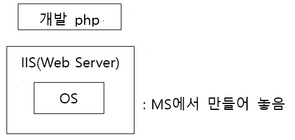

[toc]

Azure에서 제공해주는 DNS 이름은 길다. 회사 도메인처럼 짧은 DNS이름은 따로 구매해서 사용하여야 한다.

WSL2  : Windows Subsystem For Linux 2

Internic : 전 세계의 도메인을 관리
www.internic.org

>internic 사이트 -> Registrars -> Alphabetical Listing by Company/Organization Name
>
> -> internic에서 공인한 도메인 판매업체 -> HANGANG Systems, Inc. dba Doregi.com 
>
>-> 등록하고 싶은 도메인을 검색하여 없는지 확인하여 신청할 수 있음

cf ) Azure는 메뉴와 내용이 6개월에 한번씩 싹 바뀜

- www.github.com/kite01 : 강사님 github
- www.github.com/10979F : Microsogt Azure Fundamentals 실습
- www.github.com/20533E : Implementing Microsoft Azure Infrastructure Solutions 실습
- www.github.com/AZ-103 : Azure 관리자 관련 실습
- www.github.com/MicrosoftLearning : MS 관련 공인 교재 실습

cf )  Fork를 선택하면 나의 Github에 복사(Fork를 한 시점의 내용으로 고정되고, 업데이트는 되지 않는다.)

- Azure 메뉴
  - All services : Azure에서 제공하는 모든 서비스
  - All resources : 본인이 생성한 모든 서비스

# 1. 10979 module4 WordPress 생성

- WordPress : WebApp
- WebApp : Pass 서비스(웹서버까지 올라가 있음)

## WordPress 만들기(Azure)

> Create -> 
>
> > App name : 이니셜-WP (도메인 주소 : 이니셜-VP.azurewebsites.net)
> >
> > Subscription : Azure Pass -스폰서쉽
> >
> > Resource Group : say-WP-test
> >
> > Database Provider : Azure Database for MySQL
>
> App Service plan/Location  -> Create new -> 
>
> > App Service plan : 이니셜-EastUS
> >
> > Location : East US
> >
> > Pricing tier
> >
> > > Dev/Test(개발&테스트)
> > >
> > > Production(실제서비스)
> > >
> > > Isolated(전용서버, 서버를 분리시켜줌)
> >
> > Production : S1 -> Apply -> OK ->
> >
> > Data base
> >
> > > Server name : say-wp-mysqldbserver
> > >
> > > Server admin login name : mysqldbuser
> > >
> > > Password : Pa55w.rd
> > >
> > > Version : 5.7
> > >
> > > Pricing tier : vCore:2, Strage:33GB
> > >
> > > Database name : mysqldatabase7442
> >
> > -> OK
>
> -> Create

## Azure에서 사용한 비용보기

- 메뉴 -> Subscription
- www.azure.com/free : 12개월동안 무료로 사용가능한 계정 생성가능, 20만원 가량 가능(단, 신용카드 등록 필요)
  - 12개월 이상 되거나 한도를 넘는 경우 자동으로 신용카드 결제 진행

## WordPress 시작하기(Azure)

> Home -> 이니셜-WP-test -> 이니셜-WP -> URL 복사해서 인터넷에 복사해서 넣기 
>
> -> 한국어 -> 계속 -> 정보 입력하기 -> 워드프레스 설치하기 -> 로그인 -> 구글 참조해서 원하는데로 setting 가능

## 클라우드 없이 WordPress 설치하기

> Aparche설치 -> PHP 설치 -> SQL 설치 
>
> -> WordPress 설치(개발하기 위해서 최소 3년 필요)

APM = Apache + PHP + mySQL

cf ) 워드프레스 사용 동호회 존재

cf )

- Visual Studio : 유료이지만 여러회사에서 협업하여 개발하기 좋다.
- Visual Studio Code : 무료로, 협업할 수 있는 기능이 없다.

> 메뉴 -> extension -> 원하는 코드 기능 받아서 사용가능 -> azure 검색 -> Azure Tools 다운
>
>  -> azure 클릭 -> sign in to Azure
>
> => 별도의 설정 필요없이 확장프로그램 설치로 해당 언어를 사용할 수 있다.

## WP slot 추가하기

> Azure portal -> Home -> 이니셜-WP-test -> 이니셜-WP -> Deployment slots -> Add a slot ->
>
> > Name : new-slot
> >
> > Clone settings from : 이니셜-wp
>
> -> close

Deployment slots

-  slot에서 업데이트 할 내용을 한번에 저장해서 서비스 페이지와 순식간에 swaping(바꿔치기)하여 끊김없이 업데이트 서비스를 제공할 수 있게 도와준다.

cf ) visual studio에서 실시간으로 바로 수정 가능 하지만, 여러 페이지에 걸쳐 수정하여야 할 때 실시간으로 업데이트를 할 경우 에러가 나는 경우가 발생할 가능성이 높다.

cf ) production 표시가 들어간 slot이 서비스 중인 slot이다.

## WP Swap 하기

> new-slot -> Swap -> Source : 이니셜-wp-new-slot, Target : 이니셜-wp -> Swap -> Close

> Azure -> WP-test -> Deployment slots
>
> > Custom domains : 신청한 도메인을 WP에 적용시키는 것 (production 이상에서 제공되는 서비스)
> >
> > Scale up : 서비스 plan을 높이는 것(성능을 높이는 것)
> >
> > Scale out : 동일한 내용을 복사해서 여러 개 더 많드는 것
> >
> > > Manual scale : 개발자가 직접 갯수를 정함
> > >
> > > Custom autoscale : custom의 수에 따라 자동적으로 변경 됨
> > >
> > > > Rules : Add a rule -> 적용할 규칙 설정
>
> -> Add

# 2. Virtual Machine scale set

- Virtual Machine
  - IaaS로, scale up은 가능하나 out은 자동으로 안된다.
  - Virtual Machine scale sets을 통해 자동화할 수 있다.
- WordPress
     - PaaS로, scale up & out 자동으로 가능

## Virtual Machine scale set 생성하기

> Add ->
>
> > Virtual machin scale set name : VMscale
> >
> > Operating system disk image : 최신 버전들은 scale sets을 지원하지 않음
> >
> > Resource group : 지우기 쉽게하기 위해 VM과 다른 group에 저장
> >
> > Autoscale : Enabled
> >
> > Maximum number of VMs : 최대 1000까지 가능
> >
> > Scale out
> >
> > > CPU threshold(%) : 75; 5분동안 CPU가 75%이상일 때 늘려감
> > >
> > > Number of VMs to increase by : 2; 2개씩 늘림
> > >
> > > > Increase count by ~ : ~씩 늘려가라
> > > >
> > > > Increase count to ~ : ~까지 늘려라
> >
> > Scale in
> >
> > > CPU threshold(%) : 25; 5분동안 CPU가 25%이하일 때 줄여감
> >
> > Choose Load balancing options : None
> >
> > Virtual network -> Create new
> >
> > > Name : myVNe
> > >
> > > Address space, Subnets : 있는거 사용
> >
> > Public IP address per instance : On; 각 instance 마다 Public IP를 매칭한다.
> >
> > Public inbound ports : Allow sellected ports ; 방화벽에서 입장가능
> >
> > Select inbound ports : RDP (3389)
>
> -> Create

- cf ) 
  - Application Gateway :L7의 부하분산장치 ;적용하기 전에 먼저 만들어야 한다.
  - Load balancer : L4의 부하분산장치

- VM scale sets 생성을 통해 생성된 Resource: 
   - VirtualNetwork
   - VMscale2( = Virtual machine scale set)
   - VMscale2nsg( = Network security group)

  

- CPU stress test tool
  
- CPU를 부하시켜 제대로 작동하는지 확인하기 위한 프로그램
  
> VM scale set -> Instances -> VMscale_1 -> IP 획득 -> cmd을 통해 VMsclae_1에 원격접속
>
>  -> cpu stress test tool .zip파일 다운 -> .zip 파일 풀기 -> prime95 실행 -> Run -> Just Stress Testing 
>
> -> OK -> scale set이 최대치 까지 늘어난 것 확인 -> 메뉴 Test -> Stop -> scale 줄어드는 것 확인

  

- VMscale의 메뉴

  - Scaling : Scale up
  - Size : Scale out

- VMscale -Networking

  - inbound : VM으로 들어오는  control

  - outbount : VM에서 바깥으로 내보내는 control(random port사용, control 불가)

  - 방화벽 setting 시 Outbound port rules은 setting 하지 않고, Inbound port rules만 setting 한다.

  - protocol : TCP, UDP

  - Priority의 숫자가 낮을 수록 우선 순위가 높다.

  - 웹서비스시 80번 port 열기

    > Add inbound port rule ->
    >
    > > Souce : Any ; 어떤 Client든 들어올 수 있다.
    > >
    > > Destination port ranges : 80
    > >
    > > Protocol : TCP
    > >
    > > Priority : 250
    > >
  > > Name : Port_80
    >
    > -> Add
  
     
  
    cf ) 방화벽을 안열고 VM을 만든 경우 Networking에서 열어주면 된다.

- cmd
  
  - netstat -na : 열린 port 확인하기
    - Local Address : 내 컴퓨터
      - 목적지에 가기 위하여 내컴퓨터에서 random으로 발생시키는 포트번호(ex-70.12.113.131:139 중 139)
    - Foreign Address : 목적지 컴퓨터

## Web Server허용하기

> 해당 VM의 Server Manger의 Manager -> add Roles and Features -> next -> next -> next 
>
> -> Server Roles : Web Server (IIS) 체크 -> Add Features -> next.... -> install -> close

>  -> Tools -> IIS Manager -> vm 왼쪽 화살표 클릭 -> Sites 왼쪽 화살표 클릭 -> Default Document 
>
>  -> Default Document 순서 확인 -> "Default.htm" 최우선 확인 
>
>  -> `C:\inetpub\wwwroot` 에 "This is my first web site (이니셜) 을 "Default.htm"으로 저장 
>
>  -> 인터넷에 IP주소 입력해서 문장 뜨는지 확인

- IIS(Internet Information Server) : MS
  - Web Server
  - FTP Server
  -  SMTP Server
- Apache : Linux/ Unix ; 무료
- NGINX  : Linux/ Unix ; Apache보다 성능, 보안 좋음

# 3. Resource group Lock

> Resource group -> Lock -> Add ->
>
> > Lock name : Prohibit Lock
> >
> > Lock type : Delete
>
> -> OK

# 4. 실습

> github -> 10979 -> Instructions -> 
>
> > AK 안들어간 파일(간단한 설명으로 실습하는 파일)
> >
> > AK 들어간 파일(Step by Step 식으로 설명 되어 있는 파일)
>
> -> ..._AK_04.md -> 따라하기

# 5. 10979F의 1-13

## Azure management models

- **Classic (Azure Service Management)**
  : 올드 버전

  - You should limit its use to services that do not support Azure Resource Manager (for example, Azure Cloud Services)
  - This model provides limited RBAC support

- **Azure Resource Manager**
  : ARM, Resource Group Concept, 마이크로 서비스 개념

  - Is based on the concept of "resource groups"

  - Supports tagging
    : 관리하기 쉽게 구분하는데 사용

  - Supports template-based deployments
    : 템플릿 배포 가능

    > ARM Template
    >
    > : https://azure.microsoft.com/en-us/resources/templates/ ; 검색가능
    >
    > : https://github.com/Azure/azure-quickstart-templates
    >
    > : 원하는 Template를 클릭해서 바로 배포
    >
    > (github -> 원하는 Template 선택 -> Deploy to Azure -> Azure 로그인 -> 
    >
    > Resource group 선택 -> Datacenter 선택 -> user ID, Password 입력 ->
    >
    >  I agree -> 원하는 Template 환경 VM 배포 완료)
    
  - Provides full RBAC support
    
  - 특정 사용자에게 권한을 줘서 권한에 해당하는 part만 관리하도록 지원
    
    - RBAC(Role-Based Access Control)
  
- **You should use Azure Resource Manager for all deployments (whenever possible)**

# 예시 문제) 

이 중에서 ARM base VM의 특징이 아닌 것은?