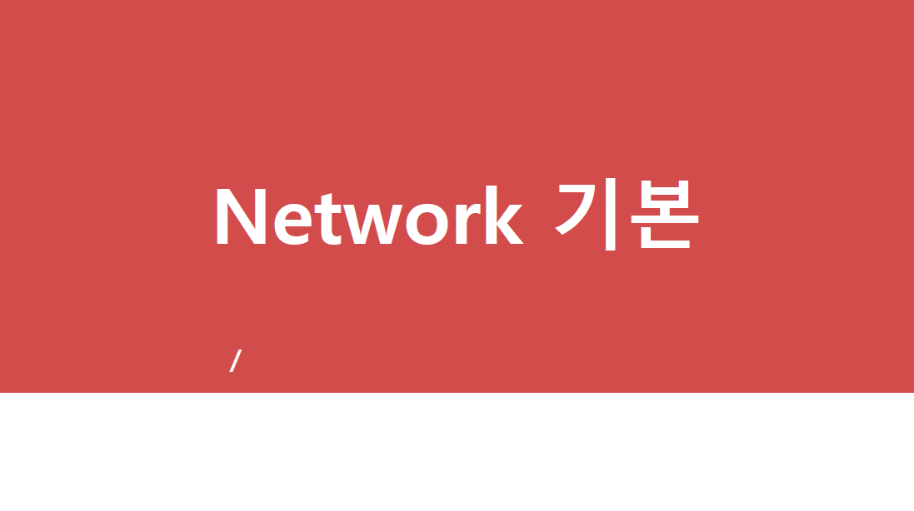
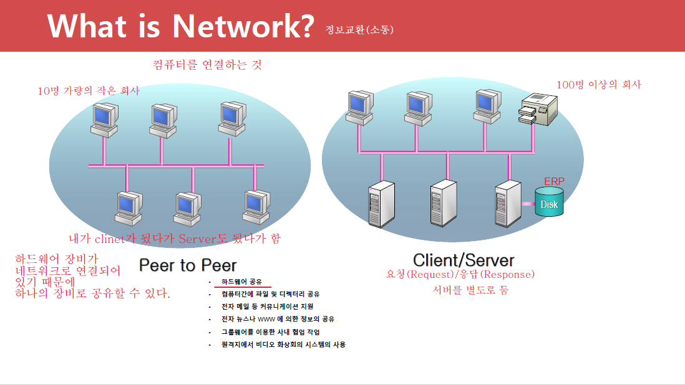
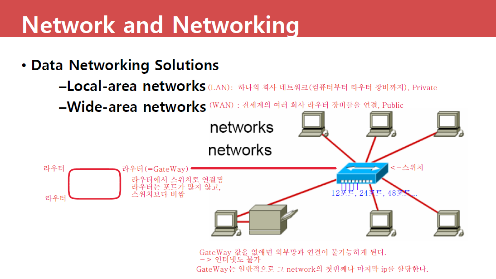
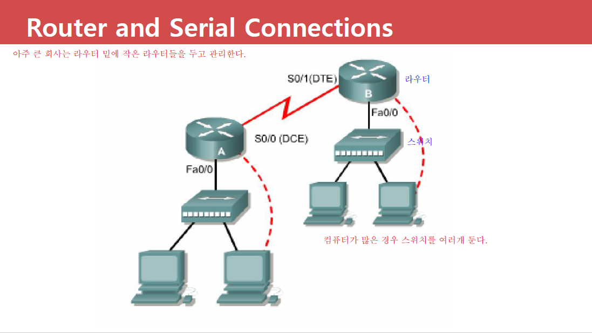
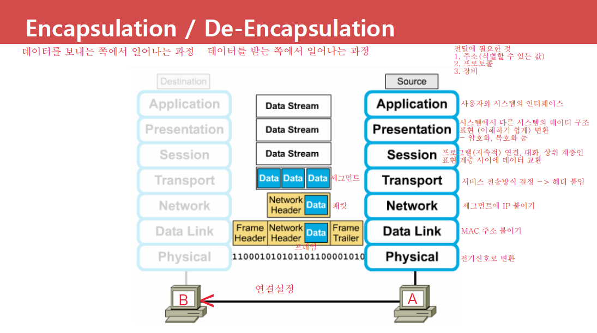
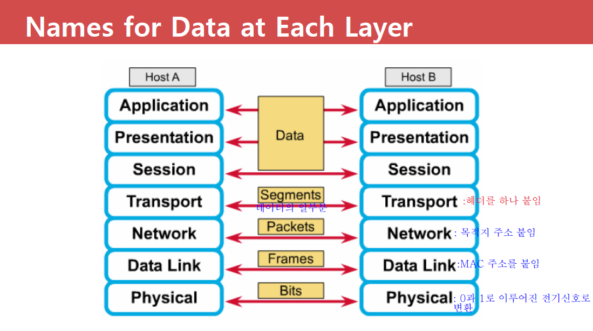
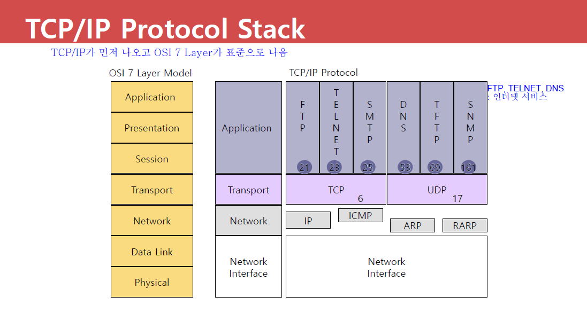
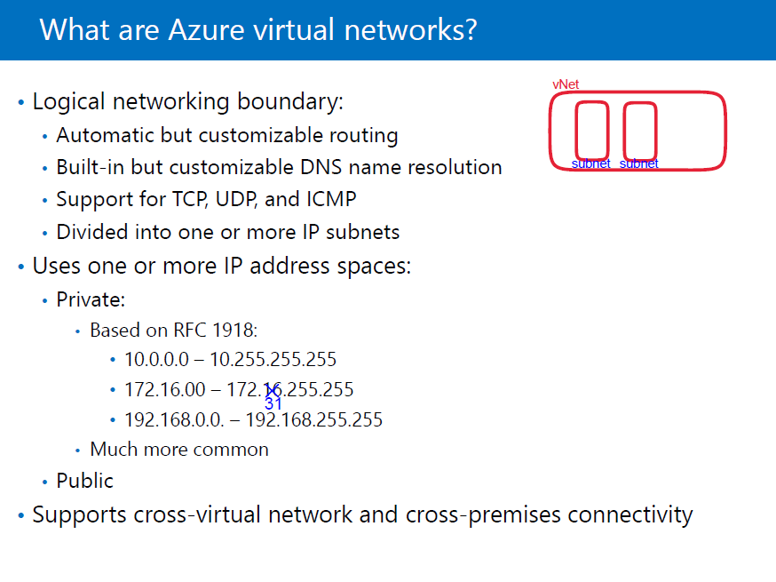
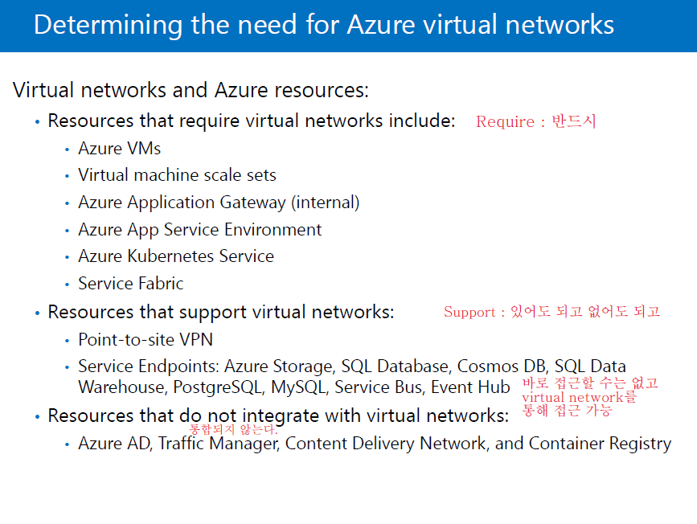

# 5일차 - Virtual Network

https://www.microsoftazuresponsorships.com/
	: Azure Pass 사용 내역 (요금 정보)

20533E - Module2
10979F - Module5

시험 총 30문제 (상, 중, 하)로 구성 80% 넘기

과제 3개를 발표(5분 ~10분)수업으로 대체, 시간이 없을 경우 금요일 4 or 5시 부터 시작할 수 있음
PPT로 5분 발표 -> 2분 가량 데모(Azure) 오래걸리는 부분은 미리 Setting 해 놓기
수업에서 하지 않은 내용을 추가하여 발표할 경우 추가 배점
PPT 작성, 데모, 마지막 질문

cf ) network 베스트 셀러 : sisco networking

## 1. Network 기본

## 2. Overview of load balancers

## 3. IP Address

인터넷 상에서 목적지를 찾는 주소 체계(A ~ C Class)로 32Bit로 구성(약 43억개)
8.8.8.8		8bit = 옥텟		(8.8.8.8 = 8bit.8bit.8bit.8bit)
v4(version 4)는 32bit, v6는 128bit

1111 1111_(2) = 255 -> 한자리당 0 ~ 255 까지 중 한 숫자로 정해진다.
	
                            IP						Default Subnet Mask
A Class				N.H.H.H				255.0.0.0
				0000 0001.0000 0000.0000 0000.0000 0000 ~		1.0.0.0 ~
				0111 1111.1111 1111.1111 1111.1111 1111		126.255.255.255
						=> 처음 bit가 0으로 고정
				Network 수 : (2^7) - 2(0과 127로 시작하는 IP는 특수하게 사용) = 126개
				Host 수	   : (2^24) - 2 (항상 2개 빼줌, Host 만) =16,777,214개
						=> 한 라우터에서 16,777,214개를 부여할 수 있다.

B Class				N.N.H.H				255.255.0.0
				1000 0000.0000 0000.0000 0000.0000 0000 ~		128.0.0.0 ~
				1011 1111.1111 1111.1111 1111.1111 1111		191.255.255.255
						=> 처음 bit가 10으로 고정
				Network 수 : 2^14 = 16,384개
				Host 수	   : 2^16 - 2 = 65,534개

C Class				N.N.N.H				255.255.255.0
				1100 0000.0000 0000.0000 0000.0000 0000 ~		192.0.0.0 ~
				1101 1111.1111 1111.1111 1111.1111 1111		223.255.255.255
						=> 처음 bit가 110으로 고정
			Network 수 : 2^21 = 2,097,152개
			Host 수	   : 2^8 - 2 = 254개

=============================================

D Class : 멀티 캐스트 데이터 전송시 사용		224.0.0.0 ~ 239.255.255.255
						=> 첫번째 bit가 1110으로 고정

E Class : 예약 IP, 군사용

A Class 중 특수한 Network
				0		: 네트워크 식별할때 사용 
				127	: LoopBack IP(모든  컴퓨터에 셋팅되어 있음), Localhost
						Encapsulation을 통해 LAN 카드까지 갔다가 자신의 컴퓨터로 다시 돌아와 De-Encapsulation 됨
						Test용으로 사용. 예 Web Server
						IPv6 LoopBack IP ( : :1)

- Host의 모든 값(bit)이 0 인 경우 : Network ID를 식별
  Host의 모든 값(bit)이 1 인 경우 : Broadcast IP (Broadcast Data 전송시 사용)

## 4. CIDR 표기법

Class로 IP를 부여해줄 경우 IP낭비가 굉장히 심하다.
Class로 할당하지 않고, 2진법으로 할당하여 IP낭비를 막는다.

- Class : 10진법으로 표기

- CIDR : 2진법으로 표기

- 예)  192.168.10.0/24				192.168.10.0/25
  		/24 : subnet mask가 들어간 bit 수(=255.255.255.0)
  		/25 = 1111 1111.1111 1111.1111 1111.1000 0000 = 255.255.255.128
  		/26 = 1111 1111.1111 1111.1111 1111.1100 0000 = 255.255.255.192
  				 ========================= ======

  ​						Network ID							  Host ID
  cf ) 2개를 빼줘야하기 때문에 /31은 사용하지 못하고, /32는 자기자신을 의미한다.

- 문제) 2,000개의 Host가 필요할때 알맞은 Subnet Mask를 CIDR 표기법으로 표기하세요.
           -> /21    255.255.248.0 ; 2^11 = 2048개의 Host를 할당할 수 있다.

- 예시) 192.168.10.50/24                      <= CIDR 표기법
                         1100 0000.1010 1000.0000 1010.0011 0010 <- IP
        AND연산   1111 1111.1111 1111.1111 1111.0000 0000 <- Subnet Mask
      ㅡㅡㅡㅡㅡㅡㅡㅡㅡㅡㅡㅡㅡㅡㅡㅡㅡㅡㅡㅡㅡㅡㅡㅡㅡㅡㅡ
                         1100 0000.1010 1000.0000 1010.0000 0000 <- Network ID or IP
                         1100 0000.1010 1000.0000 1010.1111 1111 <- Broadcast IP
          Network IP : 192.168.10.0
          Broadcast IP : 192.168.10.255
          Host IP 범위 : 192.168.10.1 ~ 192.168.10.254
          Subnet Mask : 255.255.255.0

- 문제) 192.168.10.130/25
          Network IP : 192.168.10.128
          Broadcast IP : 192.168.10.255
          Host IP 범위 : 192.168.10.129 ~ 192.168.10.254
          Subnet Mask : 255.255.255.128
          Host 수 : 126개

- 문제) 172.16.20.10/17
                     1010 1100.0001 0000.0001 0100.0000 1010
          AND    1111 1111.1111 1111.1000 0000.0000 0000
         ㅡㅡㅡㅡㅡㅡㅡㅡㅡㅡㅡㅡㅡㅡㅡㅡㅡㅡㅡㅡㅡㅡㅡㅡ
                     1010 1100.0001 0000.0000 0000.0000 0000
                     1010 1100.0001 0000.0111 1111.1111 1111
          Network IP : 172.16.0.0
          Broadcast IP : 172.16.127.255
          Host IP 범위 : 172.16.0.1 ~ 172.16.127.254
          Subnet Mask : 255.255.128.0
          Host 수 : 2^5 - 2 = 32,766개

## 5. Subnetting

ISP에서 부여받은 네트워크 ID를 더 작은 Sub Network로 분할하여 사용
cf ) 분할 이유 : 보안을 위하여

- 예시) ISP에서 192.168.20.0/24를 부여 받았다. 2개의 Sub Network로 분할 하세요.
  192.168.20.0
  ㅡㅡㅡㅡㅡ ㅡ
  Network      Host
      192.168.20.0000 0000/25 = 192.168.20.0/25 <- Network IP
                     192.168.20.1 ~ 192.168.20.126/25 <- Host IP 범위
      192.168.20.10000 0000/25 = 192.168.20.128/25 <- Network IP
                      192.168.20.129 ~ 192.168.20.254
- 문제) ISP에서 172.16.0.0/16을 부여 받았다. 4개의 Sub Network로 분할 하세요.
      172.16.0000 0000.0000 0000/18 = 172.16.0.0/18
                  172.16.0.1 ~ 172.16.63.254
      172.16.0100 0000.0000 0000/18 = 172.16.64.0/18
                  172.16.64.1 ~ 172.16.127.254
      172.16.1000 0000.0000 0000/18 = 172.16.128.0/18
                  172.16.128.1 ~ 172.16.191.254
      172.16.1100 0000.0000 0000/18 = 172.16.192.0/18
                  172.16.192.1 ~ 172.16.255.254
- 문제)  ISP에서 172.16.192.0/18을 부여 받았다. 4개의 Sub Network로 분할 하세요.
      172.16.1100 0000.0000 0000/20 = 172.16.192.0/20
                  172.16.192.1 ~ 172.16.207.254
      172.16.1101 0000.0000 0000/20 = 172.16.208.0/20
                  172.16.208.1 ~ 172.16.223.254
      172.16.1110 0000.0000 0000/20 = 172.16.224.0/20
                  172.16.224.1 ~ 172.16.239.254
      172.16.1111 0000.0000 0000/20 = 172.16.240.0/20
                  172.16.240.1 ~ 172.16.255.254

## 6. VLSM

Host 수에 따라 Subnetting, Subnet Mask 값이 각각 다르게 부여됨.
!!! 반드시 많은 수를 먼저 Subnetting (주의) !!!

cf) 라우터 각각의 포트 하나가 하나의 네트워크를 관리한다.
    라우터 장비가 있어야 네트워크를 쪼갤 수 있다.

- 예시) 192.168.10.0/24 (ISP) 아래와 같이 VLSM으로 Subnetting 하세요.
          (인사부 : 100, 관리부 : 60, 영업부 : 10, 제조부 : 30)
      1. 인사부 : 192.168.10.0/25		192.168.10.1 ~ 192.168.10.126	2^7 - 2 = 126개
         2. 관리부 : 192.168.10.128/26	192.168.10.129 ~ 192.168.10.190	2^6 - 2 = 62개
         3. 제조부 : 192.168.10.192/27	192.168.10.193 ~ 192.168.10.222	2^5 - 2 = 30개
         4. 영업부 : 192.168.10.224/28	192.168.10.225 ~ 192.168.10.238	2^4 - 2 = 14개
- 실무에서는 VLSM으로 Subnetting을 실시한다

IP = Network ID (ISP 부여) + Host ID (각 회사 네트워크 관리자가 부여)
          (우편번호, 회사)          (번지, 회사내의 각각 장치)
Subnet Mask : Network ID를 식별하기 위하여 사용

## 7. 데이터 전송 방식

- Unicast            1:1 통신
         패킷(L3)에 S.IP : 보내는 사람 IP, D.IP : A ~ C Class의 받는사람 IP
-  Multicast     	1:그룹 통신
         패킷에 S.IP : 보내는 사람 IP, D.IP : D Class IP
         받는 사람이 여러명인 경우 A~C Class로 모두 보내면 보내는 사람의 컴퓨터가 다운됨
- Broadcast         1:모든 통신 (라우터 까지)
         패킷에 S.IP : 보내는 사람 IP, D.IP : Broadcast IP
         !!! Broadcast !!!! 나중에 자세히 설명
         Broadcast : 해당되는 네트워크 안에 있는 모든 장비에 데이터를 보내는 방식
  cf) 패킷의 목적지 주소가 자신이 아닐 경우 LAN카드에서 drop 시키는데 Broadcast를 통해 보내어진 데이터는 CPU까지 올려보냄
         해당 네트워크에 Broadcast가 많이 발생하면 네트워크안에 있는 장비 모두에 부하가 발생함
         avp,dhcp가 broadcast 사용
         보통 라우터에 최대 1000대 까지 할당하고 초과할 경우 라우터를 하나 더 만듬

## 8. 10979F - Module5

 - vNet 안에 subnet존재, subnet과 subnet이 통신하기 위하여는 라우터가 있어야함.
    하지만 Azure Virtual Machine 내의 subnet과 subnet사이에 라우터가 없어도 된다.
    혹시 원하면 라우터를 설치가능하다.
 - Azure에서 주어진 DNS name을 사용해도 되지만 원하면 바꿀수있다.
 - 
 - 하나의 VM내에 최소 1개 이상의 subnet이 존재해야한다.

 - 일반적으로 vNet에 사설 IP를 사용 ( ISP에 돈을 내고 공인 IP를 사야하기 때문에 )
 !!! 시험 !!! 다음 중 사설 IP가 아닌 것을 고르시오.

## 9. Azure 실습(subnet 만들기)

> VM 만들기 -> Networking -> Virtaul Network : Create new -> 주소공간 : 10.10.0.0/16 -> 서브넷
> 	서브넷 이름	주소 범위
> 	subnet1		10.10.1.0/24
> 	subnet2		10.10.2.0/24
> 	subnet3		10.10.3.0/24
> -> review + create -> Create

> Home -> Create Resource -> Networking -> Virtual Network -> name : 이니셜-vm -> 주소공간 : 10.10.0.0/16 -> Resource group : RG_Test_1209_1 -> 서브넷이름 : subnet4 , 주소범위 : 10.10.4.0/24 -> Create

