# 6일차 - Cloud Shell, Azure DNS, Azure LoadBalancer

6일차 - Cloud Shell, Azure CLI, PowerShell(10979F - Module 2)
			Azure DNS, Azure LoadBalancer

### Cloud Shell

- Azure Portal에서 사용할 수 있는 쉘 (마크 : >_ ), Power Shell과 Bash 를 사용할 수 있다.
- Cloud Shell 을 처음 쓸 때 Storage를 먼저 만들어야한다.
- Cloud Shell 명령어가 따로 있는 것이 아니라 PowerShell이나 Azure CLI 둘 중 원하는 것을 사용한다.
- 예제에 따라 PowerShell or Azure CLI의 명령어만 존재하여 둘 다 알고 있어야 한다.

Azure Portal에서 Cloud Shell 생성시 세부사항 지정


### PowerShell

- Windows 에서 사용 가능한 쉘 (명령어가 길고, 복잡하다)

### Azure CLI

- Windows, MAC, LINUX 에서 사용가능한 쉘 (명령어가 짧고, 단순하다)

## 1. 10979F - Module 2

- PowerShell은 Azure portal, Visual Studio Tools에서 관리 가능하다.
- Window8.1 부터 PowerShell이 기본으로 설치되어 있다.
- PowerShell은 명령프롬프트(cmd)와 다르다.
- PowerShell의 명령어는 '동사-명사'로 이루어져 있다.
- 예 )  
  - get-command : PowerShell의 모든 명령어를 출력시켜라.
  -  get-command > powershell_command.txt : get-command 수행 결과를 powershell_command.txt에 저장하라.
  - get-process : 작업관리자의 process 정보를 출력하라.
- Cmdlet : PowerShell 명령어를 뜻함
- 구글에 'powershell 명령어이름' 검색하면 MicrosoftDocs에서 세부적인 설명을 보여준다.
- PowerShell 명령어 실행 
  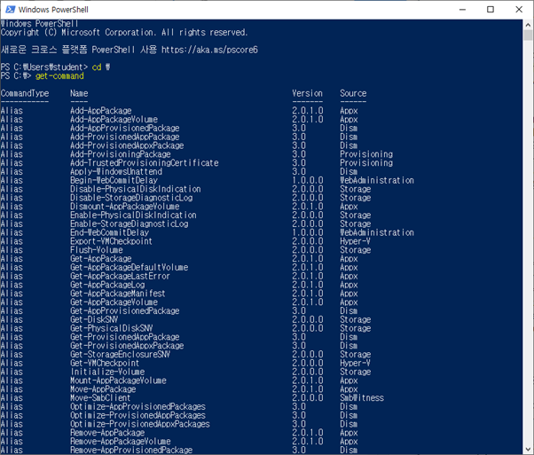
...
  
  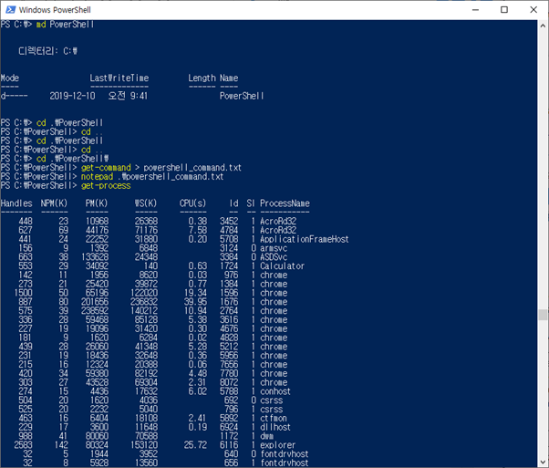
- cf ) 명령 프롬프트의 명령어를 그대로 사용할 수 있지만 명령어 옵션을 띄어써야 한다.
  

### PowerShell ISE

- Power Shell 명령어를 스크립트화 시킬 수 있다.
- F5 : 전체실행
- Block + F8 : Block한 부분만 실행

### PowerShell Module

- PowerShell  명령어 들의 집합
- 사용하기 위해서 Module를 등록시켜주어야 그 module과 관련된 명령어가 메모리에 저장되어 사용할 수 있게 된다. (import-Module 사용하기원하는Module)
- Cloud Shell은 이미 설치되어 있기 때문에 Module을 따로 설치할 필요가 없다.
- 해당 Module에서 사용할 수 있는 함수 보는 방법

### Azure 가상 머신 포털

https://docs.microsoft.com/ko-kr/azure/virtual-machines/windows/

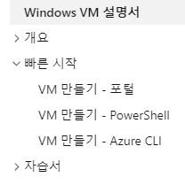

- 포털
  - GUI
- PowerShell
  - Windows
  - TXT
  - CloudShell에서 그대로 사용가능
- CLI
  - 모든 운영체제에서 사용가능
  - TXT
  - CloudShell에서 그대로 사용가능

=> CloudShell을 사용하면 Module을 설치할 필요가 없으므로 CloudShell 사용을 권함

## 2. PowerShell 설치(Azure을 사용할 수 있게하는 등록사이트)

https://azure.microsoft.com/en-us/downloads/

> -> Command-line tools
> 	Azure command-line interface(CLI)
> 	PowerShell : Azure PowerShell Module

## 3.  Az 모듈 설치 (최신 버전) 

- 정보  URL : https://docs.microsoft.com/en-us/powershell/azure/install-az-ps?view=azps-1.8.0&viewFallbackFrom=azps-1.2.0

- Az 모듈설치
```PowerShell
  Install-Module -Name Az -AllowClobber
```

- 실행 정책 허용
```PowerShell
Set-ExecutionPolicy Unrestricted
```

- 모듈 등록 & !!! 컴퓨터를 rebooting할 경우 여기부터 다시 실행 !!!
```PowerShell
import-module Az.Accounts
```

- 모듈 등록 확인
```PowerShell
get-module
```


- Azure 계정 인증 & 등록
```PowerShell  
Connect-AzAccount
```

- Azure 계정에서 가지고 있는 Subscription 확인
```PowerShell
Get-AzSubscription
```

- Subscription이 여러 개인 경우 사용할 Subscription 선택
```PowerShell
Select-AzSubscription -Subscription <Subscription ID>
```

Get-AzSubscription의 결과에서 나온 Id를 복사하여 <Subscription ID> 에 대입하여 입력해준다.

- PowerShell 실행 결과 창들
  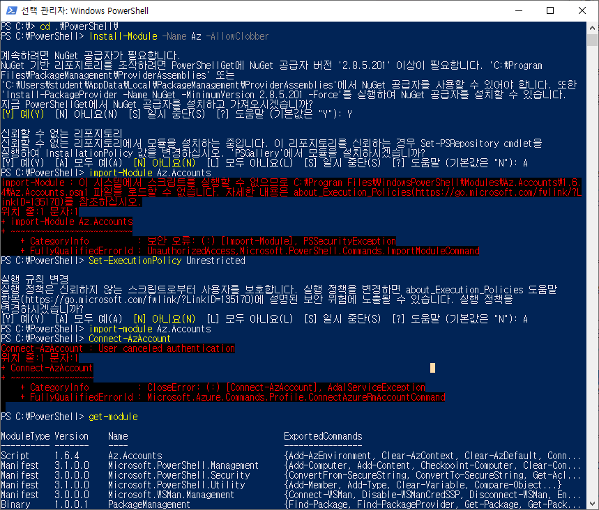
  


### PowerShell로 VM 만들기

- 리소스 그룹 만들기
``` PowerShell  
New-AzResourceGroup -Name myResourceGroup -Location EastUS
```


- 가상 머신 만들기
  명령어
           ㅡ parameter "value"
  cf ) value에 특수문자나 space가 있을 경우 " "로 묶고, 없으면 value 만 적어도 된다.

``` PowerShell
New-AzVm `
    -ResourceGroupName "myResourceGroup" `
    -Name "myVM" `
    -Location "East US" `
    -VirtualNetworkName "myVnet" `
    -SubnetName "mySubnet" `
    -SecurityGroupName "myNetworkSecurityGroup" `
    -PublicIpAddressName "myPublicIpAddress" `
    -OpenPorts 80,3389
# ` : 줄이 넘어가는 경우 연결 표시
```

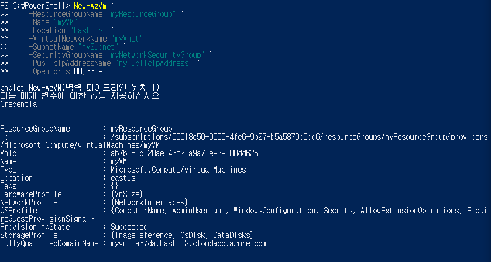

-> 여기서 사용할 계정 이름과 암호 생성

- 가상 머신에 연결

  ``` PowerShell
  Get-AzPublicIpAddress -ResourceGroupName "myResourceGroup" | Select "IpAddress"
  ```


  -> cmd 창에서 'mstsc /v: DNS주소 or IP주소' 로 들어가기

- 웹 서버 설치
방금 설치된 가상 머신의 PowerShell 에서 다음 코드 실행
  
  ``` Power
  Install-WindowsFeature -name Web-Server -IncludeManagementTools
  ```
```
  
  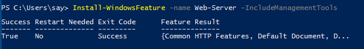
  만들어진 VM의 DNS주소를 크롬에 입력하면 다음과 같은 페이지가 나타나면 잘 만들어진 것이다.
  


## ====AzureRM 모듈 설치 (옛날) ============

### 더이상 등록이 안되므로 시도하지 말자

정보 URL : https://docs.microsoft.com/ko-kr/powershell/azure/azurerm/install-azurerm-ps?view=azurermps-6.13.0

- AzureRM 모듈 설치

  ```Powershell
  Install-Module -Name AzureRM -AllowClobber
```

- AzureRM 등록

  ```powershell
  Import-Module AzureRM
  ```

- 등록된 모듈 확인

  ```powershell
  get-module
  ```

  


- Azure 계정 인증 & 등록

  ```powershell
  Connect-AzureRMAccount
  ```

- 계정의 Subscription 확인

  ``` powershell
  Get-AzureRMSubscription
  ```

- 사용할 Subscription 선택

  ``` powershell
  Select-AzureRMSubscription -Subscription <Subscription ID> 
  ```

  

## 4.  Azure CLI 설치

- https://docs.microsoft.com/en-us/cli/azure/install-azure-cli-windows?view=azure-cli-latest

- 위의 사이트에서 'azure-cli-2.0.63.msi' 를 다운받아 설치 
   -> I accept -> install ->finish

- 명령 프롬프트 as 일반모드 -> az
  
  cf ) 밑에 나오는 함수는 'az 함수이름'로 입력하면 사용할 수 있다.

  -> az login
  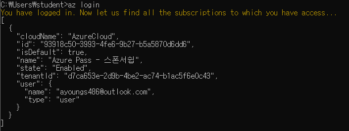

  -> az account list    (<= Subscription 출력)
  

  -> az account set --subscription <value of the subscription id property>    (<= Subscription이 여러 개일때 사용할 Subscription을 선택)

### Azure CLI로 VM 만들기

- 리소스 그룹 만들기

  ``` Azure CLI
  az group create --name myResourceGroup1 --location eastus
  ```

  
   ; json 형식

- 가상 머신 만들기

  ``` Azure CLI
  az vm create ^
      --resource-group myResourceGroup1 ^
      --name myVM ^
      --image win2016datacenter ^
      --admin-username azureuser ^
      --admin-password Pa55w.rd1234
  ```

  cf ) ^ : 다음 줄로 넘어 간다는 표시
  

----------------------------------------------------------------------------------

### !!! 시험 !!! 

- vNet내에 Subnet 10.10.10.0/24 할당

- 마지막 자리의 1 ~ 3 번 IP는 Azure 내부에서 예약해 놓은 IP

  -> 우리는 4번 ~ 254번 사이의 IP를 할당 받는다.

----------------------------------------------------------------------

- 웹 트래픽에 대해 포트 80 열기
  
  ``` Azure CLI
  az vm open-port --port 80 --resource-group myResourceGroup1 --name myVM
  ```
  
  
  ... -> 방화벽 정보를 .json 형식으로 출력
  
- 가상 머신에 연결

  ``` powershell
  mstsc /v: publicIPAddress
  ```

- 웹 서버 설치

  ``` powershell
  Install-WindowsFeature -name Web-Server -IncludeManagementTools
  ```

  

- 작업에서 웹 서버 보기
  

  -> 완료, 끝

## 5. 10979F - Module 5

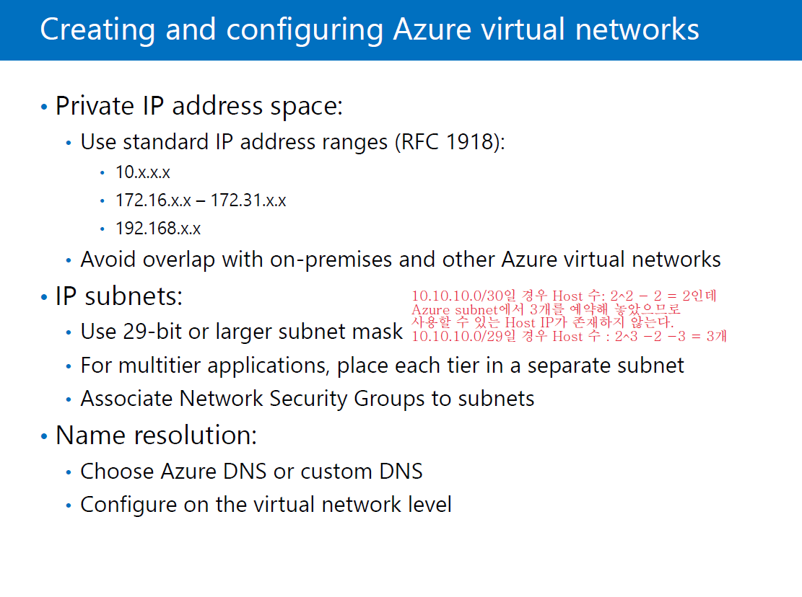

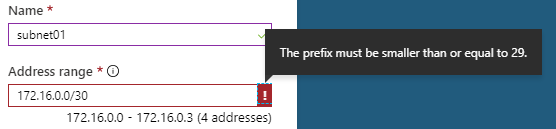

> Azure Portal -> Create a Resource -> Networking -> Virtual network ->
> 
>
> -> Create -> Resource groups -> RG_Test_1210 -> myVNet01 -> Subnets -> +Subnet ->
> 
> -> Address space ->
> 
> -> Save - > Subnets -> +Subnets -> ... ->
> 
>  cf ) 다른 네트워크 대역도 등록해 놓았기에 Subnet10이 할당 가능하다.


### !!!! 시험 !!!!

- MS-SQL
  - TCP 1433
- RDP
  - TCP 3389

subnet과 subnet 사이에 라우터가 있어야 한다. Azure에서는 없어도 된다.


## 6. LoadBalancer

### 10979F - Module5 (9p. ~ 11p.)


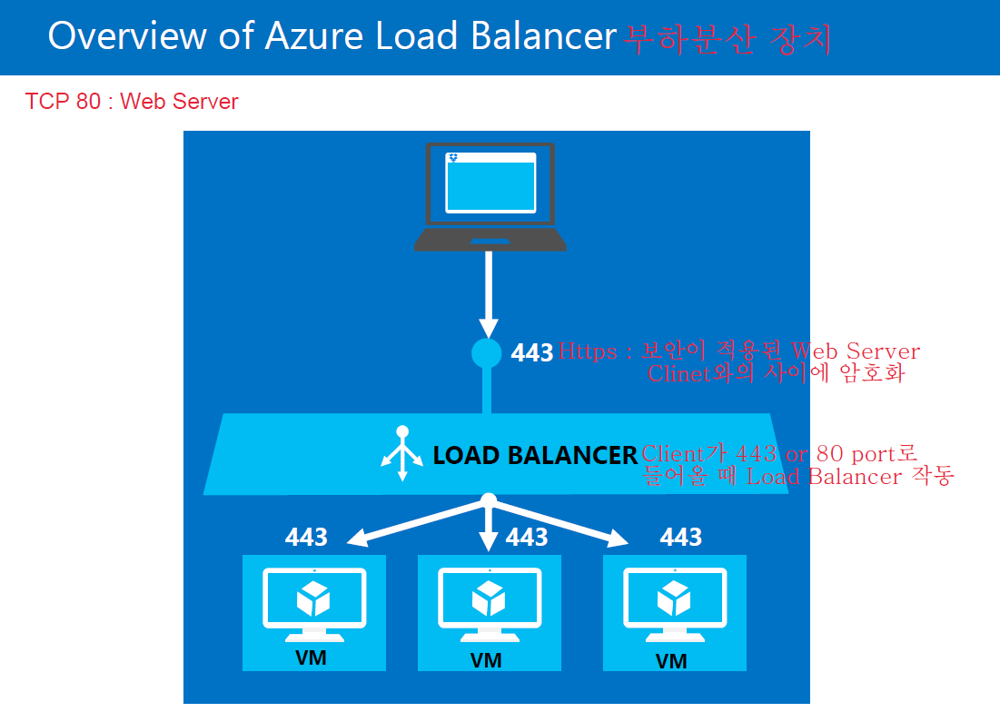


- Fronted IP configuration

  - LoadBalance 구성 할때 Client가 접속하는 대역
- probes
    - LoadBalance가 뒷단의 Backend pool에 VM이 살았는지 감시하는 장치(VM의 상태를 확인하는 장치, 5초마다)
- Backend pool
                            - LoadBalance가 부하분산 처리할 대상
                            - VM이 여기에 있음
                            - VM들의 pool을 만들어 놓음
- NAT rules
  - 사설 IP를 공인 IP로 바꿔줌
- LB(LoadBalance) rules
     - LB가 부하분산 처리할 IP포트 맵핑

## 7. VPN

### 20533E - Module (30p. ~ 31p.)

회사망(Private 망) <- 사설 IP 사용 ; 기본적인 방법으로는 회사밖에서 접근 못함
VPN : 집에서 회사망에 접속할 수 있도록 도와주는 기술
          VPN이 집에 있는 컴퓨터와 회사망 사이에 가상의 터널을 만들어 마치 집에있는 컴퓨터가 회사망 안에 있는 것처럼 처리되게 함.
         터널링 기술 사용

------

VPN : 원격에서 회사 네트워크 접근

터널링

- PPTP : 초장기 기술로 지금은 사용 안함
- L2TP / IPSet(암호화 기술)
  - 방화벽을 많이 열어줘야 함
- SSTP : TCP 443 (SSL)
  - 443번 포트 하나면 열어주면 된다.
- IKEv2 : 세션을 서버에서 자동으로 접속
  - 보통 Client가 세션이 끊기면 Client가 다시 세션을 맺어야 하지만 IKEv2는 서버에서 먼저 세션을 연결한다.

-----


- P2S VPN
  - 외부 컴퓨터(Point) 회사망(Site)
  - 외부 컴퓨터 한대가 회사망에 터널링으로 연결하는 커넥션
- stie-to-site VPN
  - 본사와 지사가 가지고 있는 라우터 '장비'에 Setting하여 VPN 연결
  - 마치 두 site가 하나의 Network를 사용하는 것처럼 만들어짐
- VNet-to-VNet VPN
  - 다른 장소에 있는 VNet과 VNet을 연결하는 터널링
  - 두 개의 VNet을 하나 처럼 사용함

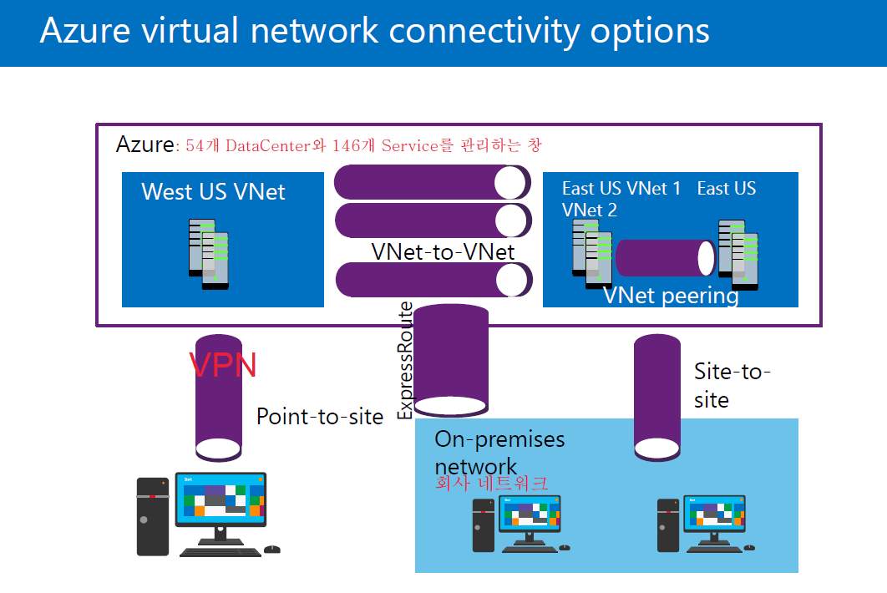

### !!!! 시험 !!!! 한 문제

- VNet Peering
  - 같은 DataCenter 내에 있는 VNet을 서로 연결해 주는 것 
  - VNet-to-VNet과 같은 개념
- ExpressRoute
  - VPN은 기존 인터넷선을 사용하는데
  - 회사와 Azure사이에 전용선을 깔아 Direct로 연결
  - 속도가 빠름

## 8. 10979F - Lab Answer Key

### VM availability Set(10979F -Module 3 10p.)


Availability : 가용성(서비스가 유지하게 하는 성질)
SLA : 서비스 유지 가능성

- availability zone
  - DataCenter간의 복제
  - 다른 DataCenter가 날아가도 복제된 정보가 있는 DataCenter에서 서비스 가능
  - 99.999% availability SLA : 1년에 1시간이하 빼고는 서비스 유지가 가능하다.
- availability set
  - Lack 단위
  - 같은 DataCenter 내에 다른 Lack에 데이터 복제
  - fault domain = Lack 
  - Up to 3 fault domains and up to 20 update domains
    : 3개의 Lack에 20개의 VM을 만들어 데이터 복제 해놓겠다.


Github
https://github.com/MicrosoftLearning/10979-Introduction-to-Azure-for-IT-Professionals/blob/master/Instructions/10979F_LAB_AK_02.md

==============
Get-Command 
Get-Process 
Get-Help Get-Process # Power Shell 주석
$env:PSModulePath

Install-Module -Name Az -AllowClobber	1. Azure Module 설치

import-module Az.Accounts			2. Azure Module 등록

Connect-AzAccount

Get-ExecutionPolicy # PowerShell 스크립트 실행 정책 
    # Rescricted  : 제한됨 (*.ps1 파일)
    # Unrestricted : 실행 (보안상 위험)

Set-ExecutionPolicy Unrestricted


===========