# 7일차 - Azure Storage, Azure SQL, Azure DNS

MS에서 제공하는 서비스에 관한 설명 : https://docs.microsoft.com/

### 시험 문제

- SaaS : Office365, dropbox
- PaaS : WebApp
- IaaS :  MS Azure, Amazon Web Services(AWS)

### 클라우드 인프라.pdf 32p.


- ESXi
  - 실 프로덕션에서 사용하는 Hyper-V
  - MS가 아닌 다른 회사 제품
  - vCenter : 서버 관리 소프트웨어
  - ESXi와 vCenter를 합쳐서 vSphere라 한다.
- SC(System Center)
  - 가상화된 서버들을 중앙에서 쉽게 관리하는 곳
  - Azure와 비슷한 곳

### Microsoft Learn

- https://docs.microsoft.com/ko-kr/azure
- https://docs.microsoft.com/ko-kr/learn
- 한국어 해석이 이상하면 ko-kr -> en-us 로 바꿔 보기
- 순서대로 따라며 배울 수 있는 곳

### 평가판 - MS의 모든 제품

- https://www.microsoft.com/ko-kr/evalcenter/
- SQL
  - 예전에는 Windows에만 설치가 가능했는데 최신버전은 Linux에도 설치 가능하다.
  - SQL Server 2016 with SP2 -> EXE -> 정보입력 -> 64bit -> 다운로드
  - SQL Server 2014 SP3 -> ISO -> 정보입력 -> 64bit -> 다운로드
- .Net Framework 4.3
  - https://dotnet.microsoft.com/download/dotnet-framework/net48?utm_source=getdotnet&utm_medium=referral
  - SQL Server Management Studio 설치를 위한 필수 조건

### 컴퓨터 리부팅 PowerShell 코드

- 리부팅 하라(관리자 계정)

```powershell
Restart-Computer -force
```

  - -force : 사용자가 로그온 한 경우에도 강제로 다시 시작


# 1. Azure Storage

## (1) 10979F - Module 6 -Lesson 1


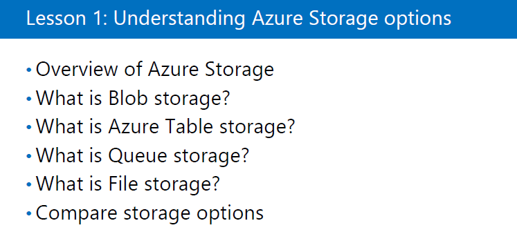

- Azure Storage

  -  VM에 들어가 있는 서비스
  - Azrue의 데이터를 저장하는 장소

----

cf )  VM
- disk, vNet, Public IP, NIC(LAN 카드), NSC(방화벽) 서비스 등 여러가지의 서비스가 합쳐져서 만들어 진다.
- ARM(Azure Resource Manager)로 바뀌어 각각의 서비스를 따로 볼 수 있다.

----

- Storage 종류

  1. Blob storage(Containers)
  2. Table storage
  3. Queue storage
  4. File storage
- Storage Account(Storage에 접근하기 위한 계정)를 만들어야 Storage를 사용할 수 있다.


- Blob storage -> Containers 로 이름 바뀜
  - Hot = Page blobs
    - 랜덤 엑세스에 최적화
    - VM에 attach 되는 Disk File에 사용됨
  - Cool = Block blobs
    - Sequential access(가끔 필요할 때 access)에 최적화
    - .iso 데이터 파일 형식(OS or Backup File)에 사용됨
    - 자주 들어가면 요금이 많이 과금된다.
  - Append blobs
    - 지금은 사라짐
    - 블록으로 구성되어있고 추가 작업에 최적화
    - 소프트웨어가 실행될 때 발생하는 이벤트를 추적하는 수단으로 사용됨
  
- Table storage
  - NoSQL로 키와 값을 실시간으로 Azure에 업로드
  - 센서 등과 같은 대량의 데이터를 처리하는 storage
  
- Queue storage
  - 메일에 사용하는 형식으로 사용자들의 정보를 받아 알림을 자동으로 보냄
  - 프로그램 알림(notification)
  - 하나의 메세지를 모든 사용자에게 전달하는데 메세지가 Queue Storage에 저장되어 있음
  - 임시저장된 상태로 보관하다가 사용자에게 전달
  
- File storage
  
- Azure로 공유폴더에 접근하는 방식으로 SMB 3.8을 사용
  

cf ) Azure Portal의 Storage에서 궁금한 storage 밑의 Learn more를 클릭하면 더 많은 설명을 볼 수 있다.


## (2) Stroage Account 만들기(Azure Portal)

> Azure Portal -> Create a Resource -> Storage -> Storage account ->  Create -> 
> 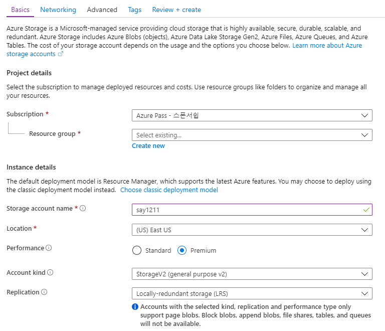
>
> - Standard : HDD, Premium : SSD
>
> - StorageV2 : 기본
>
> - LRS : 하나의 데이터 센터 안에서 3개를 복제함
>   ZRS : 쌍이 되는 데이터 센터와 나누어 복제본 3개를 나눠가짐
>   GRS : 데이터 센터 간에 복제함
>   RA-GRS : 원본에서 Read/Write 가능하지만 복제본은 Read만 가능
>
> - Cool : 가끔, Hot : 자주(v)
>
> cf ) Azure 서비스 중에 Storage 서비스가 굉장히 쌈.
> cf ) VM서비스를 중지하더라도 disk에 대한 과금은 일어남.
>
> -> Next ->
>
>  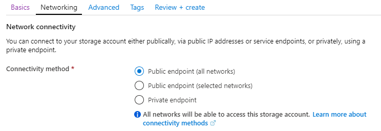
>
> - Public endpoint : Azure 외부에서 접근 가능
> - Private endpoint : Azure 내에서만 접근 가능
>
> -> Review + create -> Create

## (3) Storage Explorer 프로그램

- 컴퓨터에서 Azure의 storage를 탐색기처럼 관리하게 도와줌
- Google에 Azure Storage Explorer 검색
  -> https://azure.microsoft.com/ko-kr/features/storage-explorer/ 에서 다운로드후 설치
- Azure Storage에 연결
  - Azure 계정 추가
    - Azure 환경
      - Azure China, Germany : Azure 망이 막혀있어 특수한 Azure DataCenter로 들어가야함.
      - 일반적으로는 Azure 선택해서 들어감
  - 본인 계정 인증 -> 본인이 관리할 수 있는 모든 Subscription이 나타남
- Premium Storage를 만들 경우 모든 Storage가 나타나지 않고, Blob Storage만 나타난다.

## (4) 드라이브 공유를 통한 Storage 관리하기

- Storage Explorer에서 More -> Connect VM -> URL 복사
  <`net use [drive letter] \\say1211sa.file.core.windows.net\fileshare /u:say1211sa Yb/55+XUGQyun9ELhzuWYSDq9P67DUuFAT+alm2KCycJNVk5EnNVpjZFEfkghJ8heBv21kaDxptXst7TWOhN3A==`
  에서 '[drive letter]' 를 예를 들어 'K:'로 바꿔줘야 한다.>
  -> 관리자 권한 cmd 창에 입력 -> 완료

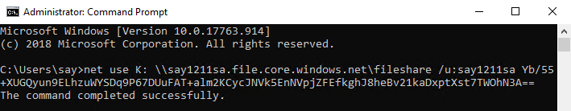


- 이를 통해 Storage Explorer를 통하지 않아도 편하기 Storage를 관리 할 수 있다.

## cf) VM사이에 공유폴더 만들어 연결하기

- 공유포트 (SMB3.0)
  - TCP 445
  - SMB 2.0 인 경우 밑에 Port도 열어줘야 한다.
    - TCP 139
    - UDP 138
    - UDP 137
- 고급 방화벽 열기 : 실행 -> wf.msc
- NSG(Network Security Group)에서 Port 열어줌
> 열어줄 VM의 Network security group -> Inbound security rule -> Add -> 
> 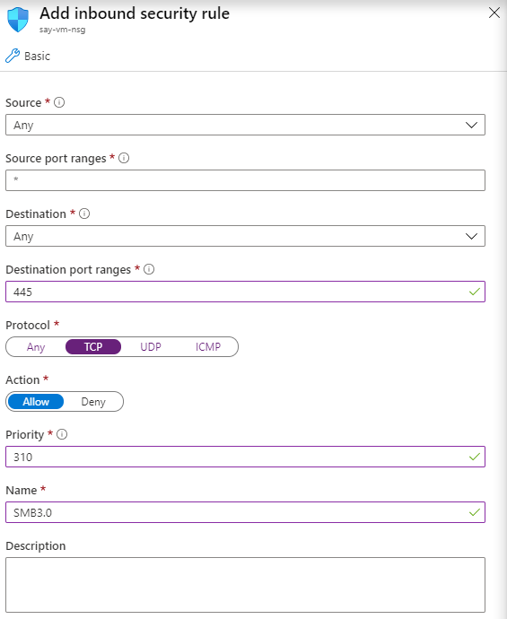
>
> -> Add

> VM의 Server Manager -> Tool -> Computer Management -> Local User and Groups 
>
> -> Users 폴더 오른쪽 클릭 -> New User ->
>
> 
>
> -> Create

> 내 폴더를 공유할 사람의 vm에서 cmd 창
>
> ```cmd
> net use Y: \\13.82.104.146\sayshare /u:test
> # net use 할당할_드라이브_대문자: \\내_Public_IP_Address or DNS_name\share할_폴더_이름 /u:허용해줄_User_name
> ```
>
> 
>
> -> 연결 완료


- 연결 완료 됬지만 들어가 지지 않을 때
> 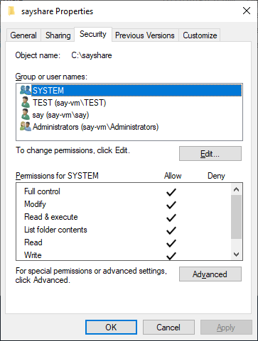
>
> 보안에 Users 계정 or 해당 계정이 들어가 있나 확인하고 없을 경우 넣어주기

# 1-1. Azure Storage에서 하위 Storage 만들기


## (1) Container 만들기

>  Azure Portal -> 해당 Storage -> Container -> +Container
>
>   -> Name : share, Public access level : Container -> OK
>
>  


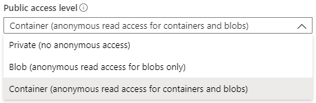

- anonymous : 익명사용자라는 의미로 Azure Pass가 없는 사람이 사용가능하게 하는 옵션이다.
- Private : 혼자만 접근 가능
- Blob : Blob 파일만 접근 가능
- Container : Container 밑의 Container와 Blob 모두 접근 가능

### -1. 파일 업로드 하기

#### - Azure Portal

> Azure Portal에서 Storage Account -> 해당 Storage Account -> Containers 
>
> -> 해당 Container -> Upload -> Files Search -> Upload

- 계정과 Subscription이 많을 때는 로그인, 로그아웃을 반복하여 Storage를 관리하여야 한다.

#### - Storage Explorer

> Storage Explorer 프로그램 -> Subscription -> 해당 Storage Account
>
>  -> 해당 Storage -> 해당 Container -> Upload
>
> => 폴더 or 파일 업로드 ->원하는 폴더 or 파일 선택 -> Upload
>
> or => 파일 드래그 하여 업로드

- 계정과 Subscription을 많아도 등록해두면 로그인, 로그아웃 필요없이 한 번에 Storage를 관리를 할 수 있다.

### -2. Blob Storage Access URL

#### - Azure Portal 이용

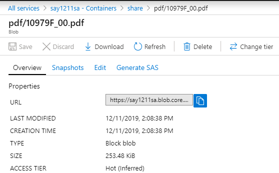
- 위의 위치에서 URL을 복사하여 크롬 주소창에 입력하면 해당 파일을 볼 수 있다.

##### -- Generate SAS

- SAS : Shared Access Signature

- 특정 문서를 공유할 때 / 특정 날짜, 시간에만 / W, R 여부 / 허용 IP 설정 / 을 통해 공유가능하도록 설정

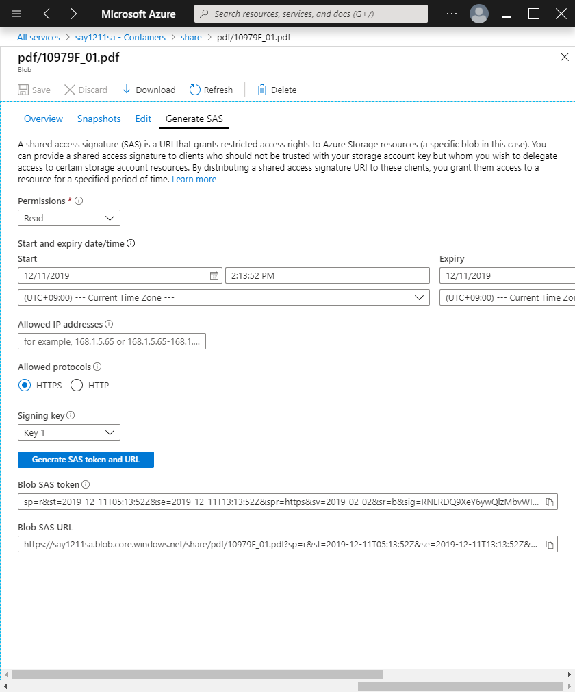

-  HTTPS : TCP 443(암호화), HTTP : TCP 80
- Blob SAS URL = URL?Blob SAS token
- Blob SAS URL을 공유하면 된다.

##### - cf) Access keys


- Connection string : 프로그램에서 SQL로 Azure Storage에 접근하기 위해 만들어지는 key 이다.

#### - Storage Explorer 이용

- 해당 파일 오른쪽 클릭 -> URL 복사
- 바로 열 경우 : 해당파일 더블 클릭

## (2) File Storage 만들기

> 해당 Storage -> File shares -> + File share 
>
> -> Name : fileshare, Quota : 100 GiB(나중에 수정 가능) -> Create

- cf )
      - 100 GB : 2진법 계산으로 실제로는 약 98 GB 할당 된다.
      - 100 GiB : 정확하게 100 GB 할당


# 2. Azure SQL

## (1) 10979F - Module 6 -Lesson 3

Data Services = Azure SQL


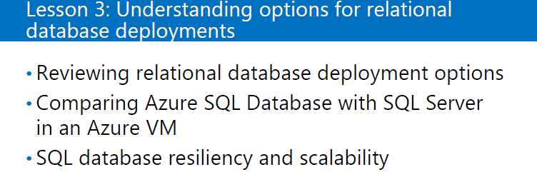

- Azure SQL
  - PaaS
  - 사용자 DB만 관리 가능, 시스템 DB 관리 불가
- SQL in an Azure VM
  - IaaS
  - SQL이 설치된 VM을 배포하면, VM에 SQL이 설치된 상태로 배포됨
  - OS 패치, SQL 패치, 레이드 설계 등등 직접 진행
  - 시스템 DB 관리가능


- DBaaS ( = PaaS )
  - DB 하단에서 관리하는 이슈 포인트가 굉장히 많다. 하여 대부분을 MS에서 관리하고 사용자 DB만 관리

## (2) SQL in an Azure VM

### -1. VM 만들기

> Create a resource -> Databases -> See all -> Featured See More 
>
> -> SQL Server 2017 Enterprise Windows Server 2016 ->
>
> 
>
> -> Review +  creat -> Create

- cf ) SQL Database 서비스 = PaaS

### -2. SQL 사용하기

 - 사용자 DB 생성하기

> 시작 -> SQL Server Tools 17 -> Server Management Studio ; SQL Server 관리 툴 -> Connect -> New Query -> 
>
> ```sql
> Create Database MyTestDB;
> go
> ```
>
> -> block 잡고 Excute(F5) -> Refresh -> 사용자 DB인 'My TestDB' 생성
>
> 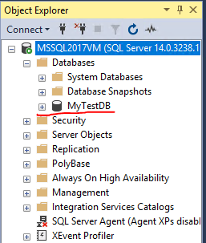

- 내가 만든 DB 접속

``` sql
use MyTestDB
go
```

- DB에 Table 만들기

```sql
Create Table myTestTBL2
  		( idx int not null identity primary key,
  		name char(10) not null,
		mail varchar(100) null ) ;
go
-- column name이 idx, name, mail인 텅 빈 Table 생성
```

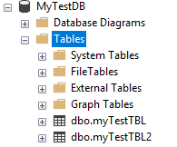


- Table 들어가기

```sql
Select * from MyTestTBL;
go
```


- Table에 내용 채우기

```sql
Insert into MyTestTBL2
Values ('김똘똘', 'aaa@aaa.com');
  
Insert into myTestTBL2
Values ('홍똘순', 'bbb@bbb.com');
go
```

- 내용 확인

```sql
Select * from MyTestTBL2;
go
```

  

- 한글 나타나게 하기

  > MyTestDB2 -> Properties -> Options -> Collation : Korean_Wansung -> OK
  
  
## (3) SQL 특징

- SQL은 Excel과 비슷하다

- cf ) Excel : 개인용DB

- SQL은 Network에 있는 사용자들이 동시에 사용가능

- record를 무한히 넣을 수 있다.

- 서버에 설치 되어야 한다.
  
  
  

## (4) PaaS 환경으로 SQL 생성하기

> Azure Portal -> Create a Resource -> Database -> SQL database -> Create ->
>
> 
> 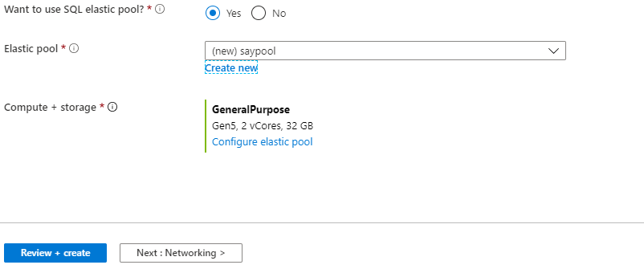
>
> -> Review + create -> Create

- 방화벽 열기; 보안을 위하여 접근할 Client IP 주소를 입력해줘야 한다.

> 해당 SQL -> Set server firewall -> 
>
> 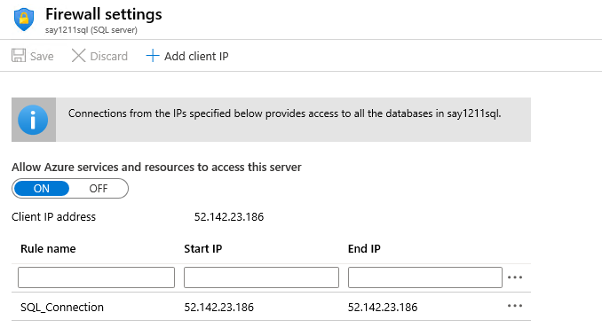
>
> -> Save; 고정IP가 아닐 경우 변동된 IP를 계속 등록해줘야 한다.

----

### - SSMS (SQL Server Management Studio)
- Local, Remote SQL Server 관리 툴
- 다른 서버에 있는 SQL를 한 서버에 모두 연결해서 한 컴퓨터에서 IaaS뿐만 아니라 PaaS에 있는 SQL까지 관리 가능하다.
- MS SQL 원격관리를 위한 포트
  - TCP 1433

----

- SSMS에서 Connetion하기 

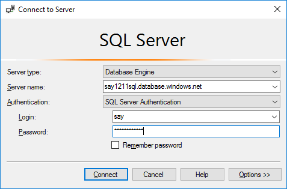


- cf ) PaaS에서 한국어 지원이 안되서 사용하려면 유니코드로 작성하여야 한다.


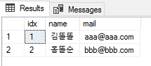


  

