[toc]

# 8일차 - AAD (Azure Active Directory), Azure DNS

## 발표 시나리오 및 PPT 작성요령

- 파일 이름 : 1. Cloud 기초 - 발표자 이름
- 시나리오
  - 모 회사에서 클라우드 제품()의 각 기능을 소개해 달라고 요청 받았습니다.
  - 여러분은 MS 회사의 직원(대리, 과장)입니다. 
  - 각 회사(MS 파트너)의 사장님을 모시고 Public Cloud 각 제품(서비스)을 소개 합니다.
- 10분 : 발표
- 5분 : 질의 응답

1. 업체에 자신의 회사 제품의 기능 소개하는 마음으로 발표
2. 셋팅 내용 STEP By STEP 로 캡쳐 (목차 및 간단 내용입력) <<공유>>
3. 다른 분들이 알수 있도록 쉽게 작성		
4. Azure 에서 전체 내용 셋팅후 결과 내용 데모 (셋팅 내용은 PPT로 캡쳐)

- PPT 작성요령
  1. 제목/발표자이름/메일주소/전화번호/GIT 주소/홈페이지(블로그)(옵션)
  2. 발표목차 (Overview)
  3. 발표내용 (Step by Step) 캡쳐
  4. 데모 (셋팅 완료 내용)
  5. 질의 응답
- 평가항목
     1. PPT 작성능력 A, B, C
     2. 의사전달능력 A, B, C
     3. 질의 응답 A, B, C

## 공유폴더 연결하기(cmd에서 안될 경우)

- cmd 창에서 `net use X: \\\70.12.113.130\PPTshare`가 적용되지 않을 경우

  > 내 PC 오른쪽클릭 -> 네트워크 드라이브 연결 ->
  >
  > 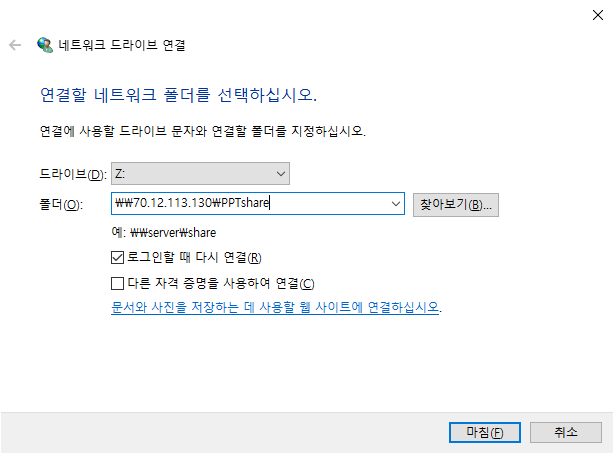
  >
  > -> 마침 -> 연결완료

# 1. AAD (Azrue Active Directory)

## (1) Active Directory

- MS Directory Service  <- LDAP
  - MS에서 관리하기 쉽게 만들어 놓은 Service
- x.500 ( Directory Service의 표준 ) <- DAP 
  - 서버장비회사(IBM, SUN->EMC->DELL, Nobell->X, HP)에서 만든 Directory Service로 관리하기 너무 복잡하고 어렵다
- 각 컴퓨터의 계정 그룹 보안정보
- 중앙에서 처리되는 서비스

### -1. Domain

- 하나의 보안 단위
- SSO (Single Sign On)
- 중, 대규모 네트워크 환경
- DC(Donmain Controller)에서 인증(Authentication; Credential( = ID + Password) 확인), 허가(Authorization) 
- 중앙화된 관리 (GPO)
- DC라는 컴퓨터가 있어야 도메인 환경을 만들 수 있어야 하므로 반드시 있어야 한다.
- DC에 Server를 깔아놓는데 여기에 AD DS(Active Directory Domain System)을 설치하여야 한다.
- 도메인의 계정을 DC에서 만들어 도메인의 계정을 각자 컴퓨터에 가져와 보안을 Setting 함
- 로그인 할 때 DC에서 인증을 받고 token을 부여받아 네트워크에 있는 다른 서버를 이용할 때 인증할 필요 없음 ( = SSO)

### - WorkGroup

- 각각의 시스템이 보안 단위
- 소규모 네트워크 환경에서 사용 (20대 미만)
- 각자의 시스템에서 인증처리 (SAM 파일로 인증)
  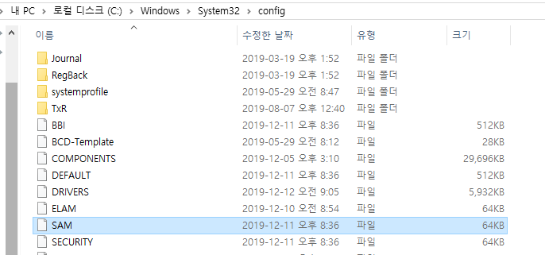
- A컴퓨터가 같은 작업그룹에 있는 B 컴퓨터에 접근하려면 인증창이 나타나 B 컴퓨터에 있는 계정으로 인증을 하여야한다. 이를 다른 컴퓨터에 들어갈 때마다 반복하여 인증해야 한다.
- 계정의 비번을 변경하면 각자 컴퓨터에 있는 계정의 비번을 모두 변경해 주어야 하기 때문에 일이 많아진다.

> Server Manager -> Local Server -> Workgroup 에서 Workgroup과 Domain을 수정 가능하다.

### - DC (Domain Controller)

- Server manager -> Tool -> Roles and Features -> next ->next -> next -> Server Roles에서 볼 수 있음 

1. Active Directory Domain Service (AD DS)
   - 도메인 서비스안에 계정이 만들어져 인증하고 허가하고 관리 를 다함

2. Active Directory Lightweight Domain Service (AD LDS)

   - 디렉토리 서비스의 간략한 정보를 가지고 있음
   - DMZ에서 주로 사용

3. Active Directory Cartification Service (AD CS)

   - Active Directory에서 인증서를 배포하는 서비스 (인증서를 통해 암호화 복호화 진행)

4. Active Directory Right Management Service (AD RMS)

   - 권한 관리

5. Active Directory Federation Service (AD FS)

   - 도메인과 도메인 사이에서의 SSO
   - A회사의 사원이 B 회사의 공유서버에 접근하려면 B의 DC에서 접근가능하도록 인증해 줘야함. but, Federation을 맺으면 B의 DC에서 인증 필요 없이 A의 DC의 인증만으로 접근가능함;
   - 회사와 Azure 사이에 Federation Service가 있다면, Azure Directory 계정없이 회사 계정으로 Azure 서비스를 이용가능하다.

- 제일 밑에 AD DS가 구성되어 있고 그 위에 CS, FS, LDS, FS가 올라간다.

## (2) 6425C_01-Acrive Directory.pdf

- SACL : 컴퓨터 이용한 전체 로그, 감사에 대한 Setting
- DACL or "ACL" 
  - Access Controll에 대한 권한 설정
  - 상속된 권한은 제거 불가 / 추가만 가능
    - 상속을 Disable로 만들어 줘야한다.
    - 해당 폴더 속성 -> 보안 -> 고급 -> 상속 안 함 -> 변경함 -> 확인 -> 편집 -> 원하는 상태로 만들어주기 -> 확인

- ACL(Access Control List) or DACL : 

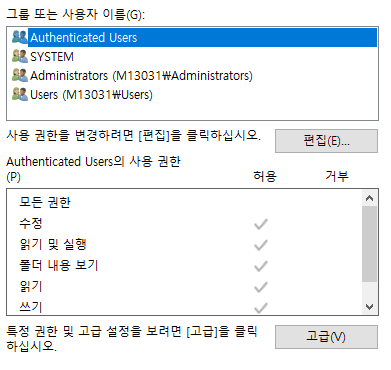

- SACL : 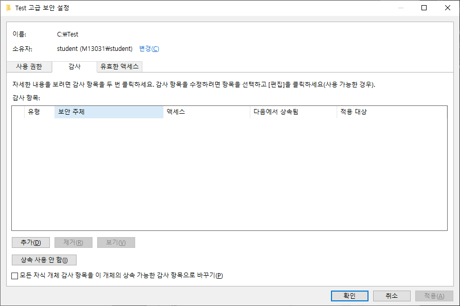

## (3) AAD 만들기 (Azure)

> Azure Portal -> Actvie Directory -> 기본 디렉터리 -> Create a dirctory -> Next : Configuration -> 
>
> 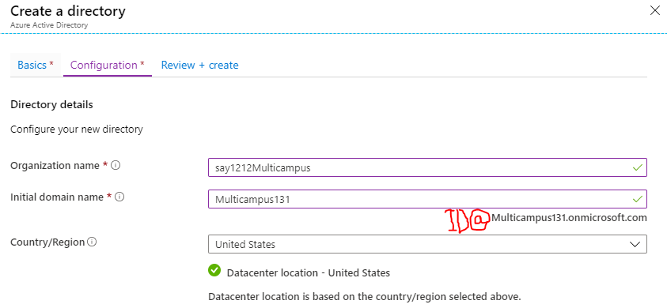
>
> -> Next : Review + create -> Create
>
> 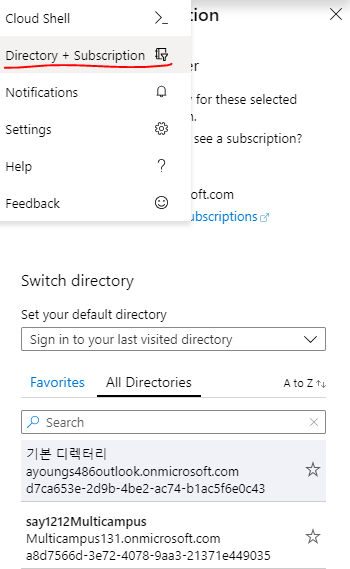
>
> -> 생성완료

- Tenant : Directory를 만들면 생성됨, 하나의 보안 단위, 하나의 Directory

### -1. User 생성

> Users -> +New user ->
> 
>
> -> Create

- RBAC(Role Base Access Controll)
  - Azure에 만들어 놓은 Role에 계정을 할당해 놓으면 Azure Role에 적용 됨
  - !!! Global Administrator !!!
    - Azure의 전반전인 모든 서비스뿐만 아니라 Microsoft 서비스에 대한 모든 권한을 갖게 된다.
  - Azure AD에 Premium 버전을 가지고 있어야 Custom Role을 만들어 사용할 수 있다.
- 사용량 위치 : 어느 지역의 데이터센터를 사용할지 한정

### -2. User login

- usera@multicampus131.onmicrosoft.com 계정으로 로그인

- 현재암호 : 관리자가 부여해 준 암호, 새 암호 : user가 부여하는 암호
  
  
- User 계정에 Subscriptions을 등록 해 놓아야 Resource Access를 할 수 있음
  
  > Subscription이 있는 계정 -> Subscriptions -> 해당 Subscription 클릭 
  >
  > -> Change directory -> 새로 만든 디텍터리로 변경 -> Change 
  >
  > -> 새로 만든 디렉토리의 Subscription에 있는 지 확인
  
  > 해당 Subscription -> Access control (IAM) ; Subscription에 권한을 줄 수 있는 곳 
  >
  > -> Add -> Add role assignment ->
  > 
  >
  > -> Save ->
  >
  > 
  >
  > -> 할당 완료
  
  - userA로 로그인하여 확인

----

## !!! 시험 !!!

- ARM 특징
  - 서비스 확장이 쉽다.(Micro Service 특징)
  - Tag(Resource에 넣은 정보)기능 제공
  - 모든 RBAC 지원
- availability (상 문제)
  - 서비스가 죽지 않도록 하는 것
  - 99.9%
  - set vs zone
    - set : 복제 단위가 Lack, 99.95%
      - 장애 도메인 = Lack
      - 업데이트 도메인 = 업데이트를 위한 복제 VM
        - 윈도우 패치시 리부팅을 해야하는데 서비스 중지를 막기 위한  VM
    - zone : 복제 단위가 DataCenter, 99.99%
- 서브넷마스크가 있는 이유 : 네트워크와 호스트를 식별하기 위해서
- 게이트웨이(라우터 주소)가 있어야 외부 네트워크와 통신이 됨/ 외부로 빠져나감
- DNS 서버(KT에 있는 DNS서버)
  - URL에 영문으로 된 도메인 이름을 DNS 서버에서 응답받아 IP를 찾아냄 
  - 없으면 영문으로는 된 URL은 못들어가고 IP로 된 URL만 들어갈 수 있다.
- 명령어도 시험에 나옴

----

### -3. MFA(Multi Factor Authentication)

- MFA(Multi Factor Authentication) : 다단계인증

  - Azure Premium이상으로 업그레이드 필요

> Azure Active Directory -> User -> 해당 계정 -> Authentication methods 
>
> -> 인증 연락처 정보 -> 저장 -> WFA 다시 등록 필요 -> 비밀번호 재설정 -> 재설정 
>
> -> 임시비밀번호 복사 하여 다시 로그인하면서 비밀번호 재설정

- Subscription은 하나의 디렉토리만 적용가능하다.
- 디렉토리에는 여러 개의 Subscription이 적용 될 수 있다.

### -4. 로그인 기록

- ADD -> Sign-ins 
  - 사용자들이 언제, 어떤 IP로 들어왔는지 확인 가능하다.

# 2. Azure DNS

DNS (Domain Name System)

- FQDN을 IP Address로 변환, 서비스의 위치 검색
  - www.naver.com =DNS=> 210.89.160.88
  - www.**naver.com** = Host+**Domain Name** = FQDN
    - Domain name = Network ID
    - Host(ex. www) = Network에 있는 각각의 컴퓨터

## (1) Azure DNS 만들기

>  DNS Zone -> Add ->
>
>  
>
>  cf ) 앞에 www 는 적지 않음
>
>  -> Review + create -> Create

> 
>
> Name Server 1,2,3,4를 Domain업체에 직접 등록하여 매칭시키면 제대로 작동 됨

> AAD -> Custom domain names -> Add custom domain ->  Custom domain name 입력 -> Add domian -> 
>
> 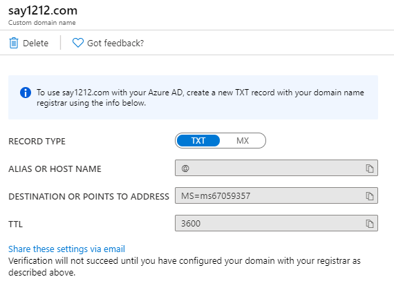
>
> 를 이용하여 Domain Setting
>
> -> Verify -> 오류없이 잘 작동하면 성공

- 도메인 연동에 성공하면 새로운 계정을 등록할 때 user name에서 @뒤에 연동한 도메인이 나타난다.

----

### - Record

- SOA : 권한의 시작
- NS : Name Server를 지정
- A : Host Name => IPv4 Address로 매핑
- CNAME : Host Name을 다른 Host Name으로 매핑
- SVR : Service의 위치 정보를 알려줌
- PTR : IP Address => Host Name로 매핑
- AAAA : Host Name => IPv6 Address로 매핑

- MX : 메일 서버를 지정
  - ALIAS OR HOST NAME : @
  - DESTINATION OR POINT TO ADDRESS : ms67059357.msv1.invalid
  - TTL : 3600
  - PRIORITY : 32767
- TXT : 특정 서버를 지정
  - ALIAS OR HOST NAME : @ ; 자기자신을 의미함
  - DESTINATION OF POINT TO ADDRESS : MS=ms67059357
  - TTL : 3600
- AD에서 제공하는 Domain Name을 MX와 TXT를 잘 Setting하여 넣으면 회사 Domain으로 AD를 사용할 수 있다.

---

- Domain Setting

> DNS Zone -> 해당 DNS -> Record set ->
>
> 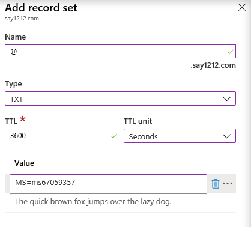
>
> -> OK -> Record set ->
>
> 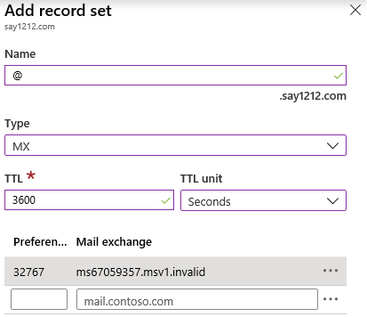
>
> -> OK

## (2) 20410D_07-DNS.pdf

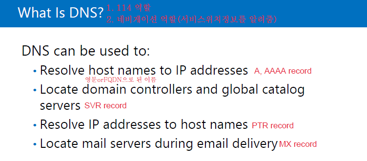
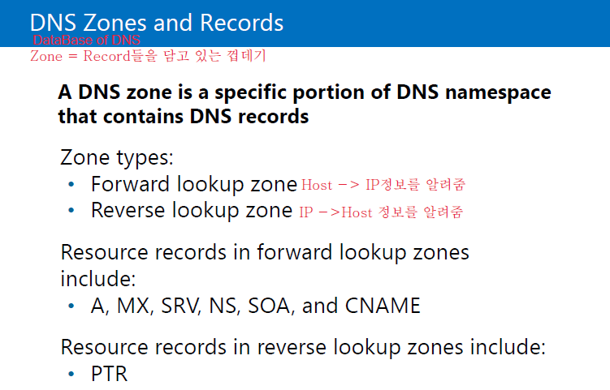

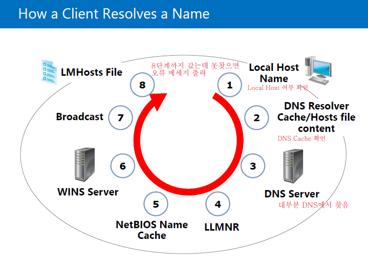

- 이름 풀이 (Name Resolution)
  - Host 이름을 IP Address로 변환하는 과정
    1. DNS Cache (hosts)
    2. Local DNS

- cmd 창 

  - ipconfig /displaydns ; RAM(Memory)에 있는 DNS의 Cache를 보는 명령어
  - ipconfig /flushdns ; DNS의 cache를 모두 날리는 명령어

- cache

  - 장점 : 서버의 부하 감소
    - 서버에 요청하기 전에 cache를 이용하여 정보를 받으므로 서버에 요청이 줄어든다.

  - 단점 : 부정확
    - 캐시를 처음 받은 후에 서버가 업데이트 됬을 경우 적용되지 않음

- `C:\Windows\System32\drivers\etc\hosts`; flushdns  적용 안됨

  - 마지막줄에 `naver.com IP	aaa		aaa.aaa.com` 입력 -> 저장
  - URL에 `aaa.aaa.com`입력시 NAVER 열림
  - 해킹을 당한 후 정상적인 도메인으로 이상한 사이트가 들어가지면 hosts 파일이 변경된 것

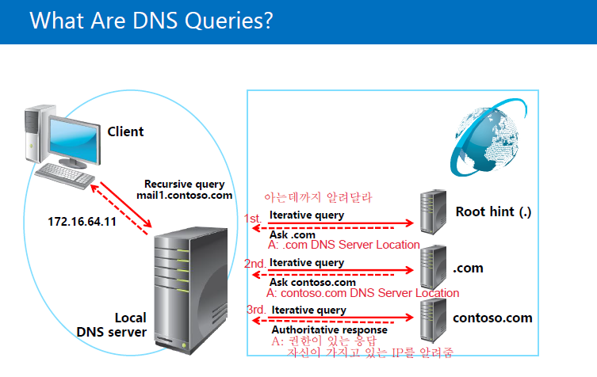