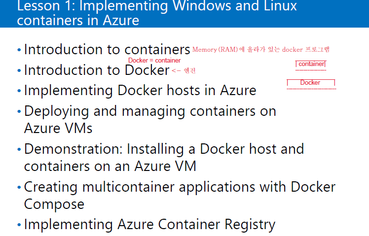
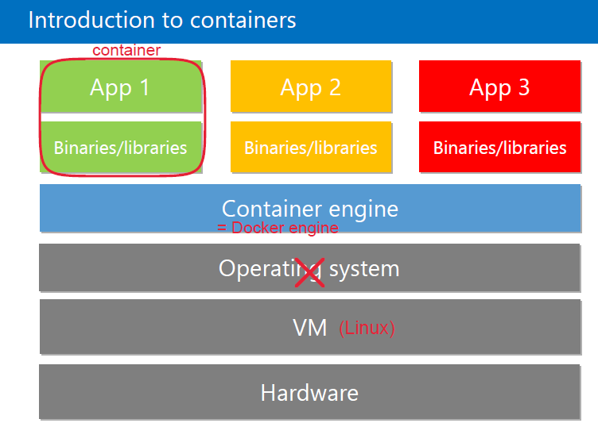
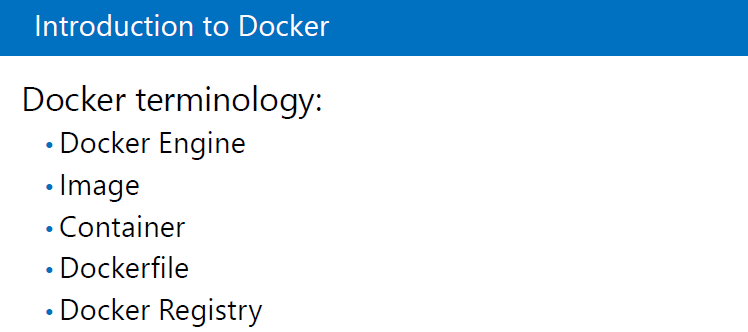
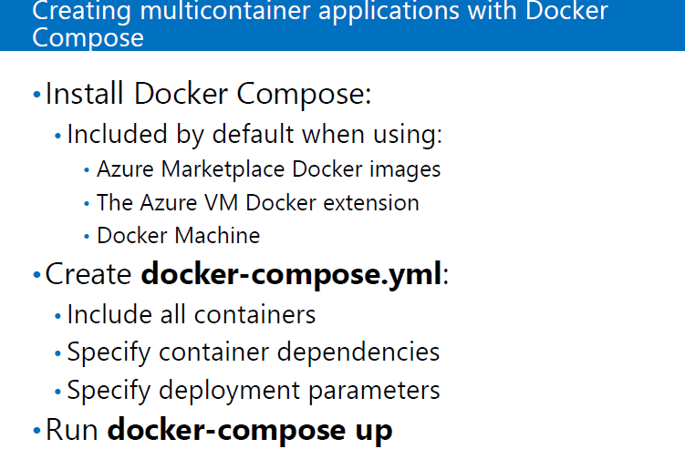

[toc]

# 9일차 - ACS, AKS

Azure 처음 시작하는 사람을 위한 단계별 데모 : https://github.com/kite01/AZ-900T0x-MicrosoftAzureFundamentals

Microsoft에서 제공하는 데모 : https://github.com/MicrosoftLearning

# 시험 리뷰(시험 : 월 1시)

클라우드 컴퓨팅(클라우드 인프라 pdf)

- 클라우드 서비스

  - 네트워크를 통해 받는 모든 서비스 
  - 인터넷에서 쓰는 모든 서비스
  - 웹브라우저만 있으면 이를 통해 모든 서비스 이용 가능
    - 애플 - 사파리
    - 리눅스 - 모질라, 파이어폭스
    - 구글 - 크롬
    - 마이크로소프트 - 인터넷익스플로라, 엣지 
    - \- 오페라

- 클라우드 컴퓨팅의 특징

  1. 데이터센터를 엘라스틱(신축성) 있게 만든다.
  2. 데이터센터에 리소스들이 풀링되어 있다.
  3. 가상화가 되어 있어야 풀링 할 수 있다.
  4. 이를 통해 하드웨어 여러개를 사용하여 빠른속도로 데이터를 처리할 수 있다.
  5. 자신이 원하는 서비스를 만들어서 사용한다.
     - 개발은 이미 되어 있으므로 원하는 서비스를 선택해서 간단한 설정 후 사용가능
     - 엘라스틱하게 움직이는 것을 자동화 할 수 있다.
  6. 클라우드 컴퓨팅은 On-premise 환경보다 저렴하다.
     - 서버를 직접 운용하면
        - 에러에 대비하여 서버 , 스토리지 장비, 네트워크 장비 2중화 필수
        - -> HA(High availability) 구성을 해야한다.
        - 장소, os, 소프트웨어, db개발, 보안, ... 
      - => 초기비용과 운용비용이 많이 든다.
        - On-premise에서 구현해야하는 것도 있다.
     - 클라우드를 사용하면 사용한만큼의 비용만 내면 된다.
  
  - 퍼블릭 클라우드
    - 
  - 프라이빗 클라우드
    - On-premises(회사의 네트워크 환경)
  - 하이브라이드 클라우드

- Public : IT 벤더에서 제공

  - 아마존, 마이크로소프트, 구글
  - 국내(글로벌 X) : KT, SKT

- Private : On-premises에서 운용

  - 엘라스틱하게 사용하지 못함.
  - 유료
    - windows 2012버전 부터 Hyper-V를 설치하여 데이터센터를 엘라스틱하게 사용할 수 있다.
    - VMware( vSphere = ESXi(하드웨어를 가상화 시켜주는 툴) + vCenter(중앙에서 모니터 관리하는 관리 툴) )
  - 무료
    - Open Stack(Linux)
    - 문제발생시 스스로 해결

- Hybrid 

  - 상황에 맞게 프라이빗과 클라우드를 사용한다.

- 클라우드 서비스 모델
  - IaaS
    - 서버, 스토리지, 네트워크 장비들을 서비스
    - 인프라 서비스
    - Azure VM within SQL, VM(원하는 SQL을 선택하여 설치 가능) : OS, SQL패치 등 직접 수행
    - 최신 버전의 경우 PaaS에서 제공되지 않는 경우, IaaS에서 직접 구성
    - 미들웨어 : 개발한 DB
    - 장점 : 원하는 것을 다 할 수 있음
    - 단점 : 패치, 관리 등 손이 많이 간다.
  - PaaS
    - 개발할 수 있는 런타임(플랫폼, 컴파이러 ; Java, .NET) 까지 제공
    - Azure WebApp
    - Azure Database(운영체제 위에 SQL까지 설치되어 있고 사용자의 DB만 사용)
  - SaaS
    - 설치없이 클라우드를 통해 서비스를 제공
    - 네트워크만 연결되면 어디서든 사용 가능
    - 오피스365, MSTeams

- Virtualization & Software Mobility

| Availability | Downtime (per year) |                          |
| ------------ | ------------------- | ------------------------ |
| 99%          | 3.7 days            |                          |
| 99.9%        | 8.8 hours           | 99.95% : availbility set |
| 99.99%       | 53 minutes          | availability zone        |
| 99.999%      | 5.3 minutes         | five nine                |

- SLA : 서비스 유지 percentage
- availability zone
  - 데이터 센터 간의 복제
  - 최대 3곳
- availbility set
  - 폴트 도메인
  - lack간의 복제
  - 최대 3개
- 업데이트 도메인
  - VM의 업데이트 패치를 오류없이 하도록 도와주는 도메인

- Azure virtual network(vNet)를 만들면 사용할 Address Space(or 풀)를 넣어야함.
  - 사설과 공인(구매필요, 드문경우 사용) 중 선택
  - VM으로 만들 경우 vNet이 자동적으로 생성되지만, 원래는 vNet을 먼저 생성하여야 한다.
  - 사설 IP 대역 !!! 알아 둘 것 !!!
    - 10.X.X.X
    - 172.16.X.X ~ 172.31.X.X
    - 192.168.X.X
  - Address Space에 하나 또는 여러 개의 subnet을 생성할 수 있다.
  - DNS 이름
    - Azure에서 제공되는 도메인 이름 사용 => 굉장히 길다
    - custom 도메인 이름을 매칭 가능
      - 액티브 디렉토리에서 커스텀도메인을 할당
      - vNet도 같음
      -  할당된 MX, TXT 레코드를 적용하여야 함.
  
  
  
- 20535 -02 -8p.
- 20535 -02 -13p. DNS 설명
- 20535 -02 -31p.
  
- Azure에서 Host 구성과 갯수
  
- VPN : 인터넷 망을 통해 연결하기 때문에 암호화 필수
  - 터널링
    - PPTP : 보안 때문에 사용 안함
    - L2TP
      - 암호화 안됨
      - => IP set 연동, 방화벽을 열어줄 것이 많음
    - SSTP
      - TCP443, SSL인증서를 통해 암호화
      - 잠깐 끊길시 재인증 필요
    - IKEv2 
      - 암호화
      - 잠깐 끊길시 서버에서 재세션 연동 => 인증 필요X
  - VPN의 종류
    - Site-to-Stie : 라우터 장비를 통한 연결, 실습불가
    - VNet peering : 같은 데이터센터내의 Azure에서 만들어진 vNet과 vNet을 연결
    - VNet-to-VNet : 다른 데이터센터의 vNet과 vNet을 연결
    - Point-to-site
    - ExpressRoute : 전용선 설치

CMD 명령어

- ping에 응답을 받기 위해서는 방화벽에 ICMP 프로토콜을 열어 주어야 한다.

  - 도메인 주소를 넣었을 때 ip주소가 나타나면 인터넷이 잘 연결된 것

  - wf.msc : 고급 방화벽 열기

    - -> Inbound rule 오른쪽 클릭 -> New rule ->  custom -> next -> all -> next ->

      > protocol type : icmp
      >
      > customize -> Spectific : Echo Request -> OK

      -> next -> next -> next -> ok

- net use

- netstat -na ; 내컴퓨터에 연결된 상황 상태들 보기

  - port 445 : SMB3.0(file storage 공유)
    - server는 지정된 포트 사용
    - client는 랜덤 포트 사용
  - port 80 : Web Server(page) (암호화X)
  - port 443 : Web page (암호화O)
  - TCP 1433 : SQL
  - TCP 3389 : RDP(GUI 원격관리)
  - TCP 22 : SSH(암호화 원격관리, CLI)
    - Telnet : 명령어로 관리하는 데 암호화X

- ipconfig /all : TCP/IP 확인

  - IP가 없으면 아무것도 연결 못함
  - 서브넷마스크 : IP의 Network와 Host구분
  - 게이트웨이 : 외부와 Network
  - DNS : URL을 IP로 변환

- ipconfig /displaydns : dns 캐시 보기

- ipconfig /flushdns : dns 캐시 삭제

- MFA(다중인증)
- 10.10.10.10/26 -> Host 갯수
- CIDR 표기법
- network 분할

- Cloud Shell

  - portal에서 사용할 수 있는 shell
  - Power Shell, Bash
  - Power Shell, Azure CLI 명령어 사용가능
- PowerShell, Azure CLI 특징
- Az 모듈

  - Power Shell에서 Azure에 있는 서비스를 사용하기 위해 설치하는 모듈
  - !!! 접속 순서 !!!
    1. install-Module -Name Az -AllowClobber
    2. Connect-AzAccount
    3. Get-AzSubscription
    4. Select-AzSubscription -Subscription <Subscription ID>
  
- Azure CLI
  - !!! 접속순서 !!!
    1. Azure CLI 설치
    2. az login
    3. az account list ; .json 형식으로 출력
    4. az account set --subscription ...; subscription 선택

- NAT : 네트워크 어드레스 트랜스레이션
  - 사설 아이피가 인터넷망을 사용하기 위하여 공인아이피로 변화해서 내보내 줌
- 로드밸런서 : 부하 분산 장치
  - Azure의 로드밸런서는 L4의 부하분산장치
  - region의 부하분산는 L7의 부하분산장치 사용
  - probe : backend pool의 건강상태 체크

- Doker에서 3문제

- DNS 
  - Authentication(인증) : credential을 확인하는 것
  - Authorization(허가) : 인증한(허가된) 사용자에 대하여 권한 부여
  - Credential : IDentity(ID; 고유한) + Passoword
  - token
    - 인증된 사람의 SID(고유번호)로 허가받으면 발급 
    - 사용자의 그룹과 권한들이 나타나 있다.

# Azure DNS

- directory = Tenant

- directory 마다  따로 Setting 을 해줘야 한다.

- Group 만들기
  - 일일히 role을 권한을 주는게 아니라 한번에 권한을 주기 위하여 사용
  - 해당 group에 속한 사람은 group에 할당 된 role이 자동적으로 할당 됨

> 해당 AAD -> Gourp -> New Group ->
>
> 
>
> -> Create

- RBAC(Role Base Access Control) : 모든 서비스는 Role Base로 관리된다.

- ARM은 Full RBAC이고, Classic에서는 제한된 RBAC 사용

> Home -> DNS Zone -> 해당 Zone ->access control (IAM) -> Add -> Add role assignment -> 
>
> 
>
> -> Save
>
> => IT_Adimin rm그룹에 속한 멤버 모두에게 해당 Role이 할당 된다.

- CNAME 레코드
  - 도메인 이름 -> Alias에 입력해 놓은 도메인이름으로 연결해줌

# ACS (Azure Container Service) - 10979F_Module 7

- Window 운영체제에도 Container engine이 있음

- 밑에 docker만 있으면 window, linux, cloud 에 상관없이 작동 됨

- 전에는 개발 소스를 서버에 올리면
  - 라이브러리가 없어서 or 기본값이 달라서
  - 오류 나거나 or 작동 안되기도 했는데 
  - docker로 개발해서 docker engine만 있으면 동일하게 작동됨.

- 요즘은 하드웨어 위에 바로 container(docker) engine이 올라감
  - => 굉장히 가볍게 개발, 배포 가능

- VM은 용량이 큰데 Docker engine은 용량이 작다.

- 앱을 쓰기 위하여 운영체제를 관리

- Docker Engine
  - Container들이 H/W를 운용할 수 있도록 도와주는 기능
  - H/W위에 올라감

- Container
  - Memory(RAM)에서 실행되고 있는 상태
  - 이미지가 작동 된 상태

- Image
  - container가 실행되기 전에 파일로 저장되어 있는 상태
  - 저장된 곳은 Registry

- Docker Registry
  - 이미지들이 저장된 곳
    1. Public Registry : Docker hub라는 사이트에 등록된 Image를 누구나 다운받을 수 있는 상태
       - https://hub.docker.com/ -> Explore -> 원하는 서비스 pool -> 설치
    2.  Private Registry : 특정 사용자들만 접근할 수 있도록 만든 Registry 

- Dockerfile
  - Registry에서 다운만 받아놓은 상태
  - 실행하면 Container가 됨

- Docker Compose : 많은 컨테이너를 스크립트화 해서 쉽게 실행하기 위한 프로그램

- .yml에 실행할 컨테이너를 스크립트로 저장 -> docker-compose up이란 명령어로 실행 -> 실행할 컨테이너들이 한꺼번에 올라감

- Azure Container Registry : docker image를 저장하기 위한 저장소

20533E_07

# AKS (Azure Kubernetes Service) - 20533E_Module7

- Container := Hyper-V

- Kubernetes := SC := LoadBalancer

| container \| container | container \| container | container \| container |
| :--------------------: | :--------------------: | :--------------------: |
|     docker engine      |     docker engine      |     docker engine      |
|         Server         |         Server         |         Server         |
|          node          |          node          |          node          |
|   클러스터(cluster)    | node들을 묶어 놓은 것  |                        |

- Kubernetes
  - 사용자 분산처리 해주는 서비스
  - 사용자가 많아지면 container를 복사해 늘려가고 사용자가 적어지면 container를 줄여나감; 오케스트레이션
  - container가 복사시 용량이 작고 가벼워서 늘리고 줄이는 것을 빠르게 해 나아간다.

# 10979F_LAB_AK_07

cd ) `az group deployment create --resource-group 10979F0702-LabRG --template-uri https://raw.githubusercontent.com/Azure/azure-quickstart-templates/master/docker-simple-on-ubuntu/azuredeploy.json` 가 적용되지 않아서 URL : https://github.com/Azure/azure-quickstart-templates/tree/master/docker-simple-on-ubuntu 로 들어가서 진행

