# Day1 딥러닝을 위한 빅데이터 기초 - 파이썬 기본 문법(1)

박길식 강사님(전자공학과 교수님) : gspark@kw.ac.kr

강화학습 : 채용하는 곳이 없어서 기초적으로만 학습

챗봇 : 수많은 채팅을 학습해야하는데 3,000건으로는 너무 부족하다.

포트폴리오 : 2~3개로는 부족하므로 수업과정 중에 최대한 많은 포트폴리오를 만드어야 한다.

딥러닝과 머신러닝은 교집합이 있을 뿐 다른 것!

R : 머신러닝, 자연어처리

Python : 자연어처리(RNN)

웹크롤링 : 마음대로 했다가 저작권이 존재하여 불법이 될 수 있다.

자격증 : 없는것보단있는게... -> 정보처리기사

## 1. 아나콘다 다운로드

https://www.anaconda.com/

.ipynb :jupyter환경에서 생성된 파일

### Jupyter 

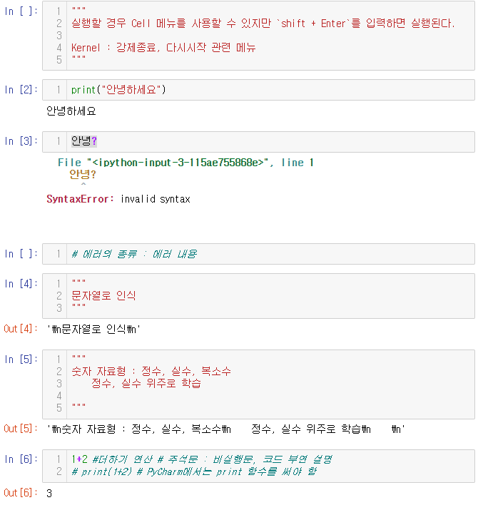

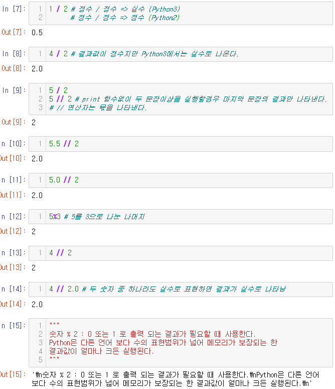

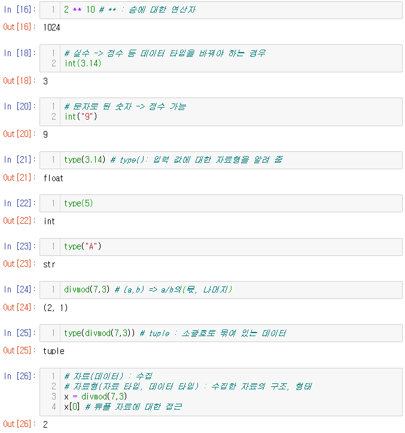

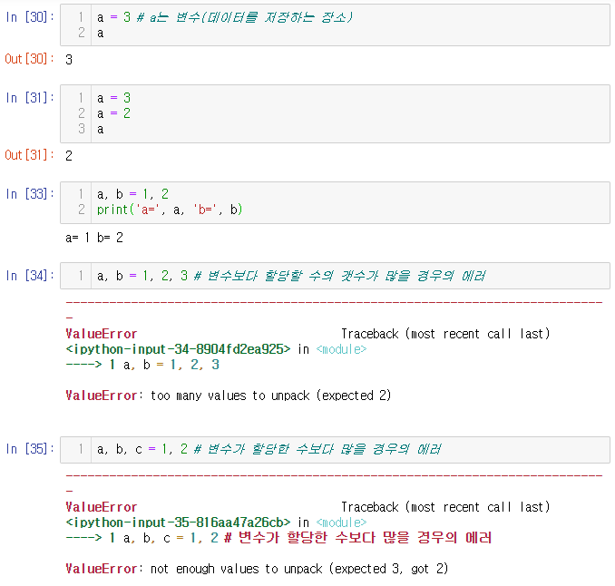

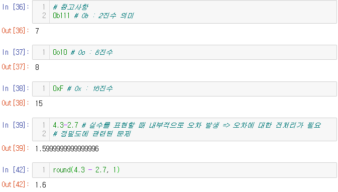

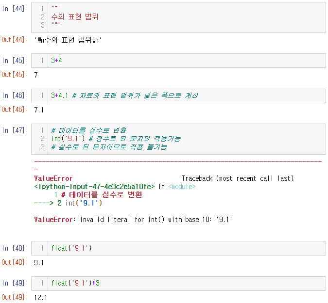

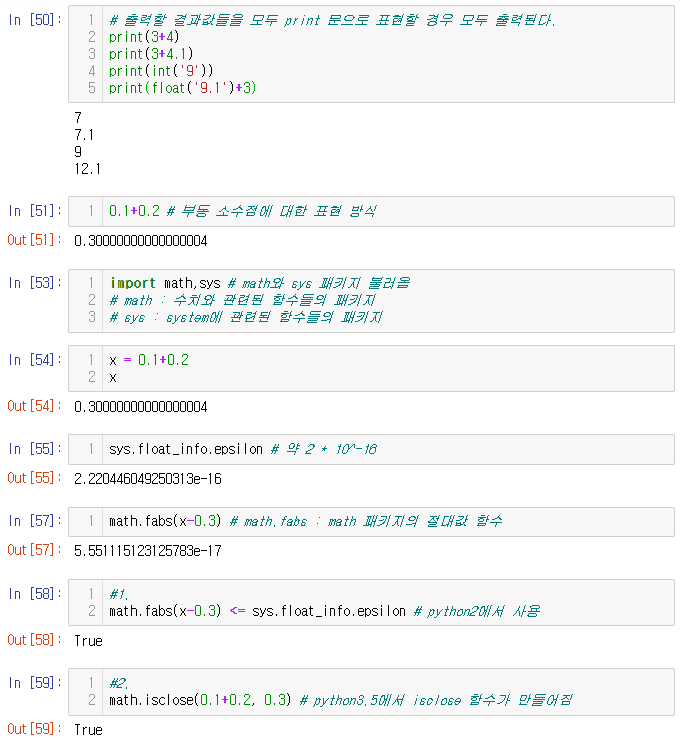

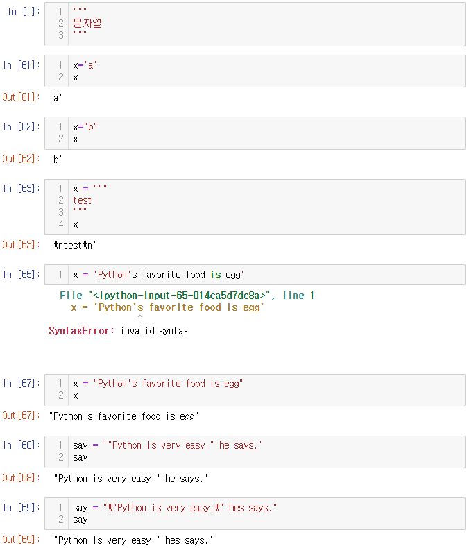

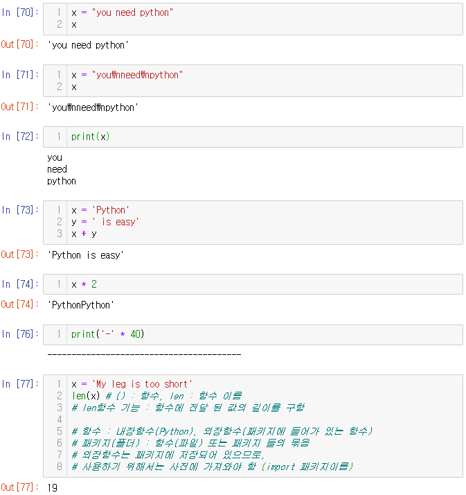

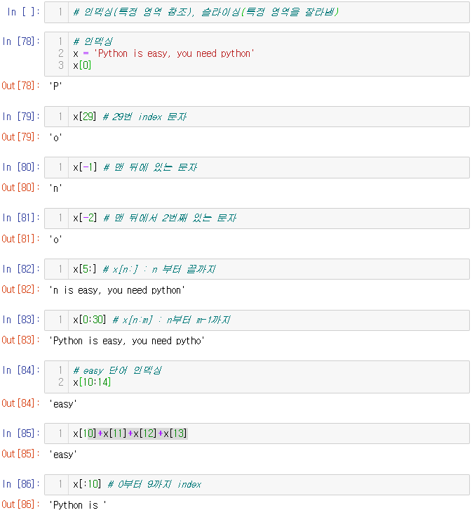

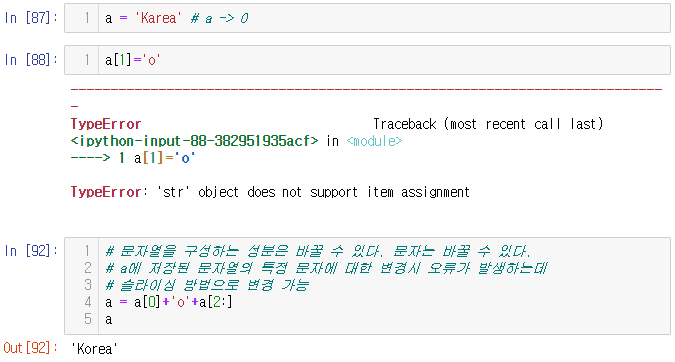

