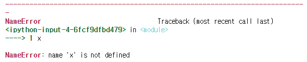
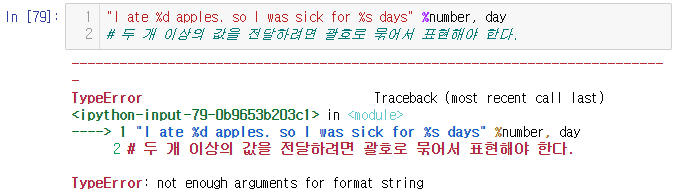
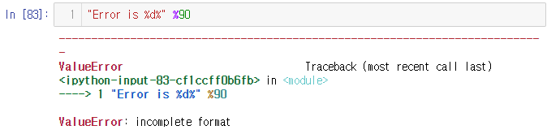
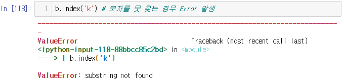
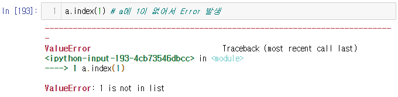
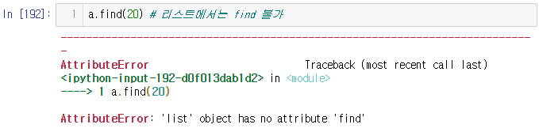
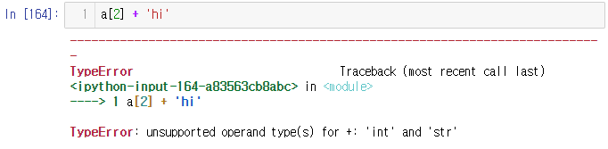
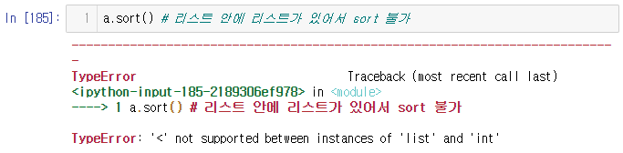
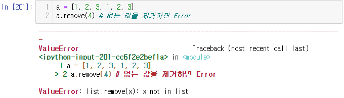

# 딥러닝을 위한 빅데이터 기초 - 데이터 모델링, SQL 응용 Day2 

## 변수 규칙

- `x, X = 5, 10` : 대소문자 구분
- 변수명 소문자로 시작, 예약어(for, if, ...) 사용금지

``` python
x, y = 1, 2
x
# > 1
```

## 변수 메모리에서 제거

``` python
del x # x 변수 메모리에서 제거
x
```



## 빈 변수 생성

``` python
x = None # 변수는 만들어 졌지만 값은 들어있지 않은 상태, null
x
# >
```

``` python
x = 10
x = x + 5 # 메모리에 저장되고, 연산은 CPU에서 처리; 2번 처리
x
# > 15

x += 5 # CPU에서 1번 처리
x
# > 20
```


## 데이터 입력 함수, input()

``` python
input()
```


``` python
x
# > '5'

x = input('입력 : ')
# > 입력 : 7

x
# > '7'
```

- input 함수는 어떤 데이터인지 상관없이 문자로 받음
- 숫자를 입력받을 경우 int()를 사용하여 바꿔줘야 한다.

``` python
int(x)
# > 7
```

또는

``` python
x = int(input('입력 : '))
# > 입력 : 5

x
# > 5
```

### split()

- input 함수로 여러 개를 입력받고 싶은 경우 => split 함수 사용(공백으로 구분)

``` python
x, y = input('문자열 두 개 입력 : ').split()
print(x)
print(y)
# > 문자열 두 개 입력 : hi hello
# > hi
# > hello
```

```python
x, y = input('문자열 두개 입력 : ').split()
print(x)
print(y)
print(x+y)
# > 문자열 두개 입력 : 5 10
# > 5
# > 10
# > 510

# 문자열로 인식하여 sum 값인 15가 아니라 문자를 붙여준 510이 나타난다.
```

``` python
x, y = input('문자열 두개 입력 : ').split()
x = int(x)
y = int(y)
print(x)
print(y)
print(x+y)
# > 문자열 두개 입력 : 5 10
# > 5
# > 10
# > 510

# 입력받은 숫자의 합을 구하고 싶으면 입력받은 값을 숫자로 변환해 줘야한다.
```


- 두 개의 문자열에 대해서는 int 사용 불가

``` python
x, y = int(input('문자열 두개 입력 : ').split())
# > 문자열 두개 입력 : 5 10
# > 에러발생
```


``` python
print(type(input('문자열 두개 입력 : ').split()))
# > 문자열 두개 입력 : 5 10
# > <class 'list'>
```

### map()

- map()를 사용하여 list의 원소에 원하는 함수를 적용할 수 있다.
- map(데이터에 적용할 함수, 데이터)

``` python
x, y = map(int, input('문자열 두개 입력 : ').split())
# map(적용할 함수, 데이터)
print(x+y)
# > 문자열 두개 입력 : 5 10
# > 15

x, y = map(int, input('문자열 두개 입력 : ').split(','))
print('x=',x, ', y=', y)
# > 문자열 두개 입력 : 5,10
# > x= 5 , y= 10
```

## 데이터 출력 방식

``` python
print(1,2,3,4)
# > 1 2 3 4

print('hi', 'hello')
# > hi hello

print(1,2,3,4, sep=',')
# > 1,2,3,4

print(1,2,3,4, sep=',,,')
# > 1,,,2,,,3,,,4

print(1,2,3,4, sep='')
# > 1234

print(1,2,3,4, sep='\n') # '\n' : 제어문자(화면에 출력X)
# > 1
# > 2
# > 3
# > 4

print('1\n2\n3')
# > 1
# > 2
# > 3

print(1,2,3,4, sep='\t')
# > 1	2	3	4

# \가 제어 문자 알림 표시 이므로 한 번으로 바로 출력 할 수 없다.
print('1\2')
# > 1

# \를 출력하기 위해서는 \\를 입력해 주어야 한다.
print('1\\2')
# > 1\2

print(1)
print(2)
print(3)
print(1,2,3)
# > 1
# > 2
# > 3
# > 1 2 3

# print 함수의 마지막 default가 '\n'이지만 ''로 대체하라는 의미로 사용
print(1, end = '')
print(2)
print(3)
# > 12
# > 3

print(1, end = ' ')
print(2, end = ' ')
print(3)
print(1,2,3)
# > 1 2 3
# > 1 2 3
```


## Boolean(논리연산자)

- 불린(boolean) : True/False(논리값) by 논리연산자

``` python
2 > 1
# > True

2 == 1
# > False

2 != 1
# > True

'test' == 'text'
# > False

'python' == 'Python'
# > False

'python' == 'python'
# > True
```

``` python
1 == 1.0
# > True
```

- 정수 1을 내부적으로 실수 1.0으로 변경(자동 형변형)
- 1->1.0 == 1.0 => True

``` python
1 is 1.0
# > False
```

- 정소 1객체 == 실수 1.0객체 => 다르다

``` python
1 is not 1.0
# > True
```

- 클래스 : 건축설계도, 붕어빵기계, 자동차 공정
- 객체 : 건물, 붕어빵, 자동차
- 속성 : 건물의 특성(층, 평수), 붕어빵의 특성(내용물, 크기), 자동차의 특성(배기량, 연비, ...)
- 메서드 : 건물의 동작, 붕어빵의 동작, 달린다/멈춘다/...
- 상속 : 유사한 건물 설계시, 기존 건축설계도의 재사용
  - 아빠 -> 코골이 -> 자식(코골이 + 이갈이) -> 손자(코골이 + 이갈이 + 잠꼬대) -> ... ; 상속의 강력함


- 논리연산 : and, or, not
- and : 연산 대상자가 모두 참인 경우 => 참

``` python
True and True
# > True

True and False
# > False
```

- or : 적어도 하나라도 참인 경우 => 참

``` python
True or False
# > True

False or False
# > False
```

- not : 논리값을 반대로 뒤집는 연산자

``` python
not True
# > False

not False
# > True

not True and False or not False
# > True
```

- 괄호를 이용하여 순서를 명확히 해주는 것이 좋다.

``` python
((not True) and False) or (not False)
# > True
```

``` python
1 == 1 and 10 != 0 # => T and T
# > True

not 1 > 0 # => not Ture
# > False

not 10 > 5 # => not T
# > False

not 1 is 1.0 # => not F
# > True
```

- bool 함수 : 정수, 실수 문자열 => 불린 타입 변환

``` python
bool(1)
# > True

bool(0)
# > False

bool(2)
# > True

bool(-2) # 정수 0을 제외한 모든 정수는 참
# > True

bool(3.14)
# > True

bool(0.0) # 실수 0.0을 제외한 모든 실수는 참
# > False

bool(-3.14)
# > True

bool('hi') # 문자가 없는 경우를 제외한 모든 문자열은 참
# > True

bool('')
# > False

bool("")
# > False

bool(' ')
# > True
```

``` python
False and True # False 가 나타나면 and 연사자는 더이상 연산하지 않는다.
# > False

True or False # Ture가 나타나면 or 연산자 뒤는 더이상 연산하지 않는다.
# > True
```


## 제어 문자

``` python
number = 3
day = 'two'
'I eat %d apples.' %3 # %d : 10진수 숫자를 입력하겠다.
# > 'I eat 3 apples.'

" I eat %d apples." %number
# > ' I eat 3 apples.'
```

``` python
" I eat %d apples." %"three"
# > 에러발생
```


``` python
" I eat %s apples." %"three" # %s : 문자열을 입력하겠다.
# > ' I eat three apples.'

" I eat %s apples." %day
# > ' I eat two apples.'

"I ate %d apples. so I was sick for %s days" %(number, day)
# > 'I ate 3 apples. so I was sick for two days'
```

``` python
# 두 개 이상의 값을 전달하려면 괄호로 묶어서 표현해야 한다.
"I ate %d apples. so I was sick for %s days" %number, day
# > 에러발생
```



``` python
"I eat %s apples." %3
# > 'I eat 3 apples.'

# %s는 형식(타입)과 관련없이 전달 받아서 출력 가능
"I eat %s apples." %3.25
# > 'I eat 3.25 apples.'

"Error is %d" %90
# > 'Error is 90'
```

``` python
"Error is %d%" %90
# > 에러발생
```



``` python
"Error is %d%%" %90 # %기호 출력 => %% 입력
# > 'Error is 90%'
```


## 포맷팅

``` python
"%s" %'hi'
# > 'hi'

print('%s' %'hi')
print('%s' %'hello')
# > hi
# > hello

# %10s : 10자리를 확보한 후, 오른쪽 정렬 출력
print('%10s' %'hi')
print('%10s' %'hello')
# >         hi
# >      hello

# %10s : 10자리를 확보한 후, 오른쪽 정렬 출력
print('%10sgd' %'hi')
print('%10sgd' %'hello')
# >         higd
# >      hellogd

# %10s : 10자리를 확보한 후, 왼쪽 정렬 출력
print('%-10sgd' %'hi')
print('%-10sgd' %'hello')
# > hi        gd
# > hello     gd

# %f : 소수점이하 6자리까지 표현이 default
"%f" %3.14
# > '3.140000'

# %.2f : 소수점이하 2자리까지 표현하라
'%.2f' %3.14
# > '3.14'

# %10.2f : 10자리를 확보한 후 소수점이하 2자리까지 표현
'%10.2f' %3.14
# > '      3.14'
```

### format  함수를 이용한 포맷팅

```python
"I eat {0} apples".format(3)
# "I eat %s apples." %3 와 같은 결과 값
# 0의 의미 : 인덱스
# > 'I eat 3 apples'

# 데이터 타입 지정 필요없이 사용 가능
"I eat {0} apples".format("three")
# > 'I eat three apples'

num = 3
"I eat {0} apples".format(num)
# > 'I eat 3 apples'

"I ate {0} apples. so I was sick for {1} days".format(3, 'two')
# > 'I ate 3 apples. so I was sick for two days'

# {}안의 숫자는 format 함수의 인덱스이므로 편하게 사용가능
"I ate {1} apples. so I was sick for {0} days".format(3, 'two')
# > 'I ate two apples. so I was sick for 3 days'

# {}안에 번호가 많을 경우 특정 변수 사용 가능
"I ate {num} apples. so I was sick for {day} days".format(num = 3, day = 'two')
# > 'I ate 3 apples. so I was sick for two days'

# 혼용도 가능하지만 권하지는 않음
"I ate {0} apples. so I was sick for {day} days".format(3, day = 'two')
# > 'I ate 3 apples. so I was sick for two days'

"{0}".format("hi")
# > 'hi'

"{0}".format("hi", "Hello")
# > 'hi'

"{1}".format("hi", "Hello")
# > 'Hello'

"{0} {1}".format("hi", "Hello")
# > 'hi Hello'

"{1} {0}".format("hi", "Hello")
# > 'Hello hi'
```

### format 함수를 이용한 정렬옵션

```python
# 10자리 확보 후, 왼쪽 정렬
"{0:<10}".format("Hello")
# > 'Hello     '

# 10자리 확보 후, 오른쪽 정렬
"{0:>10}".format("Hello")
# > '     Hello'

# 10자리 확보 후, 가운데 정렬
"{0:^10}".format("Hello")
# > '  Hello   '

# 10자리 확보 후, 가운데 정렬, 빈칸을 입력한 특수문자로 채우기
"{0:*^10}".format("Hello")
# > '**Hello***'
```


## count 함수

```python
a = 'hello'
a.count('l') # 주어진 문자열에서 해당 문자 갯수 세기
# > 2

a.count('a')
# > 0
```


## find 함수

```python
b = 'Python is very easy'
b.find('y') # 가장 왼쪽에서 찾아서 인덱스 출력
# > 1

b.find('o')
# > 4

# 문자를 못 찾는 경우 '-1' return
b.find('k') 
# > -1
```

## index 함수

```python
b.index('y') # 가장 왼쪽에서 찾아서 인덱스 출력
# > 1

b.index('o')
# > 4
```

- 찾는 문자를 못 찾는 경우 Error 발생

```python
b.index('k')
# > 에러발생
```



## join 함수

```python
"#".join("Hello") # '#'을 문자열 사이사이에 삽입함
# > 'H#e#l#l#o'

# 리스트 : 대괄호([])로 표현, 자료를 나열하고자 할 때 사용
['m', 'u', 'l', 't', 'i']
# > ['m', 'u', 'l', 't', 'i']

# 리스트 자료 구조에 대해서도 join 가능
'$'.join(['m', 'u', 'l', 't', 'i'])
# > 'm$u$l$t$i'
```


## upper(), lower()

- 자연어 처리 -> 전처리 필요
- test', 'TEST', 'Test'처럼 구성되어있을 경우 => 일괄적으로 치환 필요

```python
a = 'Test'
a.lower() # 소문자로 변환
# > 'test'

a.upper() # 대문자로 변환
# > 'TEST'
```


## split 함수

- 불필요한 공백 문자 제거
  - strip 함수 : 양쪽 공백 제거
  - lstrip 함수 : 왼족 공백 제거
  - rstrip 함수 : 오른쪽 공백 제거

``` python
word = '  hello    '
word
# > '  hello    '

word.strip()
# > 'hello'

word.lstrip()
# > 'hello    '

word.rstrip()
# > '  hello'
```


## replace 함수

- replace : 문자열 대체
- 대한민국, 한국, 코리아, 우리나라, ..... => 같은의미 => 대한민국으로 통일
- replace(바뀌는 대상, 대체할 단어)
- 한 번에 대량으로 바꾸고 싶다면 자연어 처리하는 함수 사용

```python
x = '대한민국 한국 코리아'
x
# > '대한민국 한국 코리아'

x.replace("한국", "대한민국")
# > '대한민국 대한민국 코리아'
```


## split 함수

- 문자열을 list형태로 구분

```python
x = 'a?b?c?d'
x.split('?')
# > ['a', 'b', 'c', 'd']

x.split()
# > ['a?b?c?d']

x = 'a?b$c?d'
x.split("$")
# > ['a?b', 'c?d']
```


## 리스트

- 데이터 타입에 관계없이 저장 가능한 데이터 형식
- [] : 리스트 기호

``` python
x1 = [] # 빈 리스트 생성
x1
# > []

x2 = [1, 2, 3]
x2
# > [1, 2, 3]

x3 = ['programming', 'is', 'very', 'easy']
x3
# > ['programming', 'is', 'very', 'easy']

x4 = [1, 2, 'is', 'very']
x4
# > [1, 2, 'is', 'very']

x5 = [1,2,['is', 'very']] # 리스트의 요소로 리스트가 올 수 있다.
x5
# > [1, 2, ['is', 'very']]
```

- => 리스트 내부에는 어떠한 자료형도 모두 포함될 수 있다.

### list()

- 함수로 리스트 생성

``` python
a = list() # = (a = []), 빈 리스트 생성
a
# > []
```

### index

```python
a = [1,2,3]
a[0]
# > 1

a[0] + a[2]
# > 4

a[-1] # 가장 마지막 요소를 지칭
# > 3

a[-2] # 마지막에서 두번째 요소를 지칭
# > 2

a = [10, 20, 30]
a.index(20) # 20이 저장되어 있는 요소의 위치
# > 1
```

```python
# a에 1이 없어서 Error 발생
a.index(1)
# > 에러발생
```



### 리스트에서 find 불가

```python
a.find(20)
# > 에러발생
```



## 문제

- `x = [1, 2, 3, ['a', 'b', 'c']]`
- x 리스트에서 `1`을 참조하여 출력

``` python
x = [1,2,3,['a','b','c']]
x[0]
# > 1
```

- x 리스트에서 `'a', 'b', 'c'`를 참조하여 출력

```python
print(x[-1])
print(x[3])
# > ['a', 'b', 'c']
```

- 리스트의 리스트를 참조
- `a` 를 참조

```python
x[3]
# > ['a', 'b', 'c']

x[3][0] # ['a', 'b', 'c']에서 0번 index 데이터 추출
# > 'a'
```

- x 리스트에서 `'c'`를 참조하여 출력

``` python
print(x[3][2])
print(x[3][-1])
print(x[-1][2])
print(x[-1][-1])
# > c
```


- `x = [1,2,['a', 'b', ['Python', 'is']]]`
- x에 총 3개의 요소가 있다.
- x의 3번째 요소의 길이는 3
- x의 3번째 요소의 3번째 요소의 길이는 2
- Python을 출력하시오

```python
print(x[2][2][0])
print(x[-1][-1][0])
# > Python
```

- 데이터가 많은 경우 찾기가 힘들어 보통 3중 이상은 잘 안씀


- x 변수에 저장된 데이터의 0번~(3-1)번 index 데이터를 추출하라

```python
x[0:3]
# > [1, 2, ['a', 'b', ['Python', 'is']]]
```

- [1,2]만 출력

```python
print(x[0:2])
print(x[:2]) # 처음부터 출력하려면 0을 생략하여도 된다.
# > [1, 2]
```

```python
x[2:]
# > [['a', 'b', ['Python', 'is']]]
```

- `x2 = [1,2,3,['a','b','c'],4,5]`
- `3,['a','b','c'],4,5` 출력

```python
x2[2:]
x2[2:6]
# > [3, ['a', 'b', 'c'], 4, 5]
```

- ['a','b'] 출력

```python
x2[3][:2]
x2[-3][0:2]
# > ['a', 'b']
```


### 리스트 연산

```python
x = [1, 2, 3]
y = [4, 5, 6]
x + y # 2개의 리스트가 연결되어 하나의 리스트가 됨; 문자열과 같다.
# > [1, 2, 3, 4, 5, 6]

x = [9, 8, 7]
x*3 # 똑같은 리스트가 반복해서 연결 됨; 문자열과 같다.
# > [9, 8, 7, 9, 8, 7, 9, 8, 7]
```

### 리스트 길이

```python
x = [1, 2, 3]
len(x)
# > 3
```

### 리스트 특성

```python
a = [1 ,2 ,3]
a[2]
# > 3

a[2] + 'hi' # 정수와 문자열의 합이므로 오류발생
# > 에러발생
```



``` python
# 정수와 문자열을 합치고 싶으면 정수를 문자열로 바꿔주어야 한다.
str(a[2]) + 'hi'
# > '3hi'
```

## range 함수

- 범위에 해당하는 숫자를 생성해주는 함수

```python
range(5) # 0~4까지 연속된 숫자 생성
# > range(0, 5)

type(range(5)) # range 객체
# > range

# range 객체가 가지고 있는 수를 가지고 list를 만듬
list(range(5)) 
# > [0, 1, 2, 3, 4]

# 범위를 0부터 안 줄수도 있다.
list(range(3, 12))
# > [3, 4, 5, 6, 7, 8, 9, 10, 11]

# 3부터 11까지 2씩 건너뛰어 출력
list(range(3, 12, 2))
# > [3, 5, 7, 9, 11]

# 음수부터 출력 가능
list(range(-3, 12, 2))
# > [-3, -1, 1, 3, 5, 7, 9, 11]

# 감소하는 방향으로 출력 가능
list(range(13, 2, -2))
# > [13, 11, 9, 7, 5, 3]

list(range(13, 2, -1))
# > [13, 12, 11, 10, 9, 8, 7, 6, 5, 4, 3]
```

### del 함수

```python
a = [1, 2, 3]
a
# > [1, 2, 3]

a[2] = 10
a
# > [1, 2, 10]
```

- list에서 del 함수 사용 가능

```python
del a[1]
a
# > [1, 10]

# ~10까지 숫자가 저장된 리스트 생성
a = list(range(1, 11))
a
# > [1, 2, 3, 4, 5, 6, 7, 8, 9, 10]

# list a에서 7~10 삭제
del a[6:]
a
# > [1, 2, 3, 4, 5, 6]

# list a에서 3~5 삭제
del a[2:5]
a
# > [1, 2, 6]
```

## 함수 사용법

- 리스트변수명.함수명()

- 리스트변수명. + tab키 : 리스트변수에서 사용할 수 있는 함수들이 나타남

- 자료구조에 따라 사용 가능한 함수가 다름(공통 사용 가능한 함수도 일부 존재)

- 자료구조 : 리스트, 튜플, 딕셔너리, 셋

- Python 3.7 사용설명서 & 예시

  - python.org 사이트 -> documentation -> Python 3.x Docs -> Docs by version : Python 3.7


- 리스트(객체).함수()
- 딕셔너리(객체).함수()
- 문자열(객체).함수()
- 자동차객체.달린다(), 멈춘다(), ...
- 클래스 : 사람
  - 홍길동객체.먹는다(), 잔다(), ...
  - 홍길순객체.먹는다(), 잔다(), ...

### append 함수

```python
a = [1, 2, 3]
x = 5
a.append(x) # 리스트 뒤에 요소 추가
a
# > [1, 2, 3, 5]

# 리스트 끼리 append
b = [6, 7]
a.append(b)
a
# > [1, 2, 3, 5, [6, 7]]
```

### sort 함수

- 리스트 안에 리스트가 있을 경우 sort 불가

```python
a.sort()
# > 에러발생
```



```python
a = [2, 1, 4, 3]
a.sort() # 오름차순 정렬
a
# > [1, 2, 3, 4]
```

### reverse 함수

```python
a.reverse() # 역순으로 뒤집어주는 함수
a
# > [4, 3, 2, 1]

x = [3, 7 ,5]
x.reverse()
x
# > [5, 7, 3]
```


``` python
a = ['k', 'a', 'z']
a.sort() # 문자열에도 적용 됨
a
# > ['a', 'k', 'z']

a.reverse()
a
# > ['z', 'k', 'a']
```


### insert 함수

- 리스트에 요소를 원하는 곳에 추가
- insert(원하는 위치, 추가할 요소)

```python
a = [1, 2, 3]
a.insert(0, 100)
a
# > [100, 1, 2, 3]

# 2와 3 사이에 5 추가
a.insert(3,5)
a
# > [100, 1, 2, 5, 3]

# 위치를 -로 잡을 때 조심
a.insert(-2, 4)
a
# > [100, 1, 2, 4, 5, 3]
```


### remove 함수

- 없는 값을 제거하면 Error 발생

```python
a = [1, 2, 3, 1, 2, 3]
a.remove(4)
# > 에러발생
```



```python
a.remove(3) # 앞선 하나만 제거
a
# > [1, 2, 1, 2, 3]
```


### pop 함수

- list에 가장 마지막 위치에 저장된 요소부터 꺼내어진다(제거된다).

```python
a=[10,20,30,40]
a.pop()
# > 40

a
# > [10, 20, 30]

a.pop(1) # 1번 index에 저장되어 있는 자료가 꺼내짐
# > 20

a
# > [10, 30]
```

### count 함수

```python
a = [1,2,3,1]
a.count(1)
# > 2

a.count(2)
# > 0
```


### extend 함수

```python
a = [1,2,3]
b = [4,5]
# [1,2,3,4,5]를 원할 경우
a.extend(b)
a
# > [1, 2, 3, 4, 5]

a.extend([6,7])
a
# > [1, 2, 3, 4, 5, 6, 7]
```

- extend함수 없이 다음과 같이 가능하다.

```python
a += [8,9]
a
# > [1, 2, 3, 4, 5, 6, 7, 8, 9]

a += b
a
# > [1, 2, 3, 4, 5, 6, 7, 8, 9, 4, 5]
```


# 연습문제

1) 주민번호 `921101-1231234` 에서 연월일과 그 뒤의 숫자 부분을 나누어 출력하시오.
   ex) 921101 1231234

```python
ex1 = '921101-1231234'
ex1.split('-')
# > ['921101', '1231234']
```


2) 주민번호 `921101-1231234` 에서 성별을 나타내는 숫자를 출력하시오.


```python
ex2 = '921101-1231234'
ex1.split('-')[1][0]
# > '1'
```

   

3) 문자열 `a:b:c:d -> a#b#c#d` 로 변경하시오.

```python
ex3 = "a:b:c:d"
ex3.replace(":", "#")
# > 'a#b#c#d'
```


4) ["How", "are", "you"] 리스트에서 join 함수를 이용하여 How are you를 출력하시오.

```python
ex4 = ["How", "are", "you"]
' '.join(ex4)
# > 'How are you'
```


5) 리스트 [5,3,1,-1,-3]이 출력되도록 코드를 작성하시오.(range함수 적용)

```python
ex5 = list(range(5, -4, -2))
ex5
# > [5, 3, 1, -1, -3]
```


6) 1부터 10,000까지 8이라는 숫자가 총 몇번 나오는가?

- 8이 포함되어 있는 숫자의 갯수를 카운팅하는 것이 아니라
-  8이라는 숫자를 모두 카운팅 해야한다.
- (예를들어 8808은 3, 8888은 4로 카운팅 해야 함)

```python
ex6 = 0
for i in range(1,10001):
    while i >= 1:
        i_r = i%10
        i = i//10
        if i_r == 8:
            ex6 += 1
print(ex6)
# > 4000
```

- 남이 푼 풀이

```python
ex6_1 = list(range(1, 10001))
str(ex6_1).count('8')
```

