# Day3 딥러닝을 위한 빅데이터 기초 - 파이썬 기본 문법 (3)

# Day2 연습문제 6번

- xxx8 : 1000
- xx8x : 1000
- x8xx : 1000
- 8xxx : 1000
- => 4000개

- `str(list(range(1,10001))).count('8')`


# 자료구조

- 자료구조 : 자료를 저장 및 관리하는 방법
- 알고리즘 : 문제를 해결하는 방법


- 자료구조 중 리스트와 딕셔너리가 중요한데 딕셔너리가 특히 더 중요
- 딕셔너리 구조가 가벼워서 연산하고 데이터 처리하는데 속도가 빠르다
- 리스트 : 생성,삭제,수정 가능
- 튜플
  - 몇가지점을 제외하고 리스트와 아주 비슷
  - 리스트[]와 다르게 소괄호( , , )로 묶여있다.
  - 리스트와 달리 변경 불가


## 튜플(tuple)

```python
a = (3,2,5,6,1)
a
# > (3, 2, 5, 6, 1)
```

- 다음과 같이 선언할 수 있다
- 하지만 코드의 명확성을 위하여 소괄호로 묶어 주는 것이 좋다

```python
a = 3,2,5,6,1
a
# > (3, 2, 5, 6, 1)
```

- 빈 튜플 생성
```python
a1 = () 
a1
# > ()
```
-  값을 1개 저장한 튜플을 정의할때는 컴마를 쓰면 된다. 
```python
a2 = 5, 
print(a2)
type(a2)
# > (5,)
# > tuple
```

- 튜플또한 리스트와 같이 자료형에 관계없이 저장할 수 있다.

```python
a3 = ('John', 25, 180.5, True)
a3
# > ('John', 25, 180.5, True)
```

- 변경, del 둘 다 불가

```python
a3[1] = 50
# > Error 발생
```

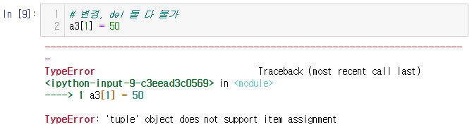


### 튜플이 필요한 이유

- 튜플은 변경이 안되므로, 데이터가 계속 유지 되어야 하는 경우에 사용
- 실수로 데이터를 변경하는 경우를 막기 위하여
- => 실무에서 잘 사용안함(불편해서)


- range를 tuple로도 변환 가능하다.

```python
a = tuple(range(10))
a
# > (0, 1, 2, 3, 4, 5, 6, 7, 8, 9)
```

-  튜플과 리스트로 서로 변경 가능하다.

```python
# 튜플 <-> 리스트
a = [1,2,3]
a
# > [1, 2, 3]

a = tuple(a)
a
# > (1, 2, 3)

a = list(a)
a
# > [1, 2, 3]
```

- 문자열을 list, tuple로 변환

```python
list("hello")
# > ['h', 'e', 'l', 'l', 'o']

tuple("hello")
# > ('h', 'e', 'l', 'l', 'o')
```

- 여러 변수에 한 번에 값 할당하기

```python
x, y = [1,2]
x
# > 1
y
# > 2

x, y = [1,2,3]
# > Error 발생
```

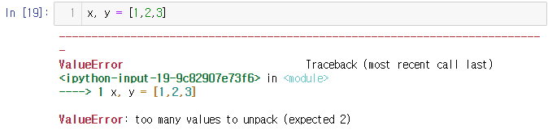

```python
x, y = (1,2)
print(x, y)
# > 1 2

type(x)
# > int
```


- unpacking : 리스트(튜플)의 요소를 여러 개의 변수에 할당하는 것
- packing : 여러 개의 변수를 리스트(튜플)에 할당하는 것

```python
a = [1,2,3] # 리스트 패킹
b = (1,2,3) # 튜플 패킹
```


### 데이터 삭제 & 수정 불가

```python
t1 = (1,2,'x', 'y')
t1
# > (1, 2, 'x', 'y')

del t1[0]
# > Error 발생
```

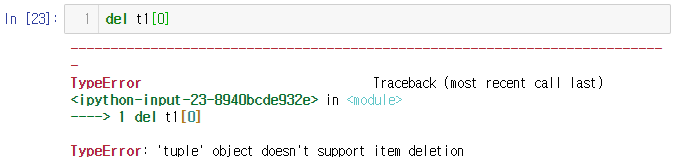

```python
t1[0] = 5
# > Error 발생
```

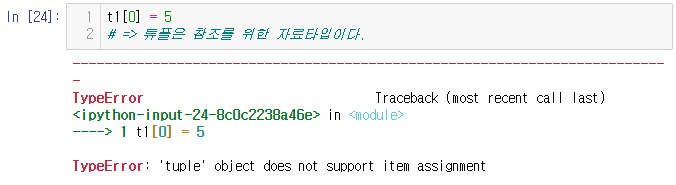


### 사용할 수 있는 함수들

- 튜플은 참조를 위한 자료타입이다.

```python
t1 = (1,2,'x', 'y')
t1[1:]
# > (2, 'x', 'y')

t2 = (3,4)
t1 + t2
# > (1, 2, 'x', 'y', 3, 4)

t2 * 3
# > (3, 4, 3, 4, 3, 4)

len(t1)
# > 4
```


- 리스트, 튜플, range, 문자열 : 데이터를 연속적으로 표현


## 시퀀스(sequence)형
- 데이터들이 연속적으로 표현된 모든 자료구조를 의미한다.

- 시퀀스형에 대해 in 연산자 사용 가능

### in 연산자 

- 자료에 특정 값이 존재하는지 확인

- 시쿼스형의 자료에 특정 값이 존재하는지 확인

```python
# 0~90까지 10씩 증가 -> list생성 -> 이름 : a
a = list(range(0,91,10)) # a = list(range(0,100,10))
a # 시퀀스형
# > [0, 10, 20, 30, 40, 50, 60, 70, 80, 90]

30 in a # a라는 시퀀스형 변수 안에 30이 있느냐?
# > True

100 in a
# > False

30 not in a # a에 30이 없니?
# > False

100 not in a
# > True

a = tuple(range(0, 100, 10))
print(30 in a, 100 in a, 30 not in a, 100 not in a)
# > True False False True

'h' in 'hello, python'
# > True

'h' not in 'hello, python'
# > False

7 in range(100)
# > True

100 in range(100)
# > False
```


### 데이터 나열하기 or 합치기

```python
a = [1,2]
b = [3,4]
a + b
# > [1, 2, 3, 4]

'hello' + 'hi'
# > 'hellohi'

a = (1,2)
b = (3,4)
a + b
# > (1, 2, 3, 4)
```

- 단, range만 + 연사자가 적용되지 않는다.

  - 정확히 range는 객체이지 순서형 데이터가 아니다.
  - 따라서 +연산자가 젹용되지 않는다.

```python
range(0,3) + range(3,5)
# > Error 발생
```

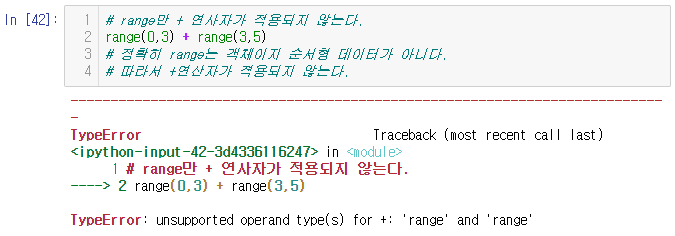

- 합치고 싶으면 다른 자료형으로 변경 필요

```python
list(range(0,3))  + list(range(3,5))
# > [0, 1, 2, 3, 4]

tuple(range(0,3))  + tuple(range(3,5))
# > (0, 1, 2, 3, 4)
```

- 서로 다른 자료형을 합치려고 할 경우 Error 발생

```python
list(range(0,3))  + tuple(range(3,5))
# > Error 발생
```

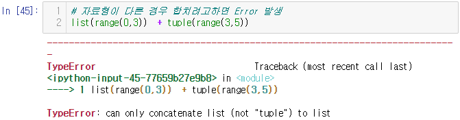

- 문자에 숫자 연결X (숫자를 문자로 변환하면 가능)

```python
'hi' + 7
# > Error 발생
```

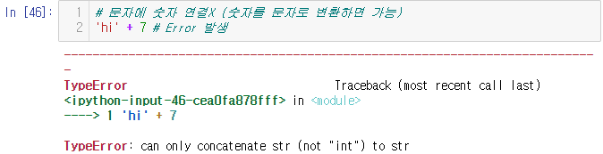

```python
'hi' + str(7)
# > 'hi7'

'hi' + str(3.14)
# > 'hi3.14'
```

- range객체는 * 연산자도 불가 => type을 변환하여야 한다.

```python
range(0,3)*3
# > Error 발생
```

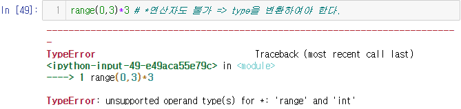

```python
list(range(0,3))*3
# > [0, 1, 2, 0, 1, 2, 0, 1, 2]
```


### len 함수

- 시쿼스 자료형에 해당되는 데이터의 길이를 구하는 함수

```python
a = [1,2,3]
len(a)
# > 3

a = (1,2,3)
len(a)
# > 3

a = range(0,3)
len(a)
# > 3

len('hello')
# > 5

hi = '안녕'
len(hi) # len는 문자의 개수를 세는 함수
# > 2

hi.encode('utf-8') # 16진수로 표현
# > b'\xec\x95\x88\xeb\x85\x95'

len(hi.encode('utf-8')) # 우리나라말은 한글자 당 3byte(길이 3)
# > 6
```


### 인덱싱(indexing)

- 시퀀스형에 대한 자료 참조는 대괄호[] 기호를 사용한다.

```python
x = 'HI HELLO'
x[0]
# > 'H'

x.__getitem__(0) # == x[0]
# > 'H'

len(x)
# > 8

x[len(x)-1] # == x[-1]
# > 'O'

x[2:-1]
# > ' HELL'

x[1:7]
# > 'I HELL'

x[1:7:2] # 인덱스 1부터 2씩 증가하면서 인덱스 6까지 가져옴
# > 'IHL'

x[:8:2]
# > 'H EL'

x[3::2]
# > 'HLO'

x[::2]
# > 'H EL'

x[::] # 전체 출력
# > 'HI HELLO'

x[5:1] # 뒤에 생략시 1씩 증가하도록 되어있어서 출력 안 됨
# > ''

x[5:1:-1] # 5, 4, 3, 2
# > 'LEH '

x[::-1] # 전체를 역순으로 출력
# > 'OLLEH IH'

x[0:len(x)]
# > 'HI HELLO'

x[:len(x)]
# > 'HI HELLO'

# 튜플도 리스트와 동일
```

- index 범위에 넘어 갈 경우

```python
x[10] # Error 메세지 기억해 두기 (많이 볼 것)
# > Error 발생
```

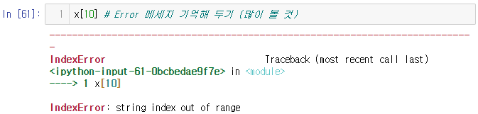


```python
x = range(10)
x[4:7]
# > range(4, 7)

list(range(0,7,2))
# > [0, 2, 4, 6]

x = 'hello world'
x[:9:3]
# > 'hlw'
```

- 데이터 수정하기

```python
a = list(range(0,91,10))
a
# > [0, 10, 20, 30, 40, 50, 60, 70, 80, 90]

a[1] = 11
a
# > [0, 11, 20, 30, 40, 50, 60, 70, 80, 90]

a[2:5] = [21,31,'x']
a
# > [0, 11, 21, 31, 'x', 50, 60, 70, 80, 90]

a[1:9:2]
# > [11, 31, 50, 70]

a[1:9:2] = ['a', 'b', 'c', 'd']
a
# > [0, 'a', 21, 'b', 'x', 'c', 60, 'd', 80, 90]
```

- 데이터 삭제하기

```python
del a[2:6]
a
# > [0, 'a', 60, 'd', 80, 90]

del a[:5:2]
a
# > ['a', 'd', 90]
```


## 딕셔너리(dictionary)

- 딕셔너리 : 키(key)와 값(value)으로 자료를 표현
- 리스트 : person = [180, 70, 'O', '서울']
- 딕셔너리 : person2 = {'키':180, '몸무게':70, '혈액형':'O', '사는곳':'서울'}
- 리스트는 값만 들어가지만, 딕셔너리는 값이 무엇인지 알 수 있도록 key가 들어간다.
- 딕셔너리를 다른 언어에서는 맵, 해쉬라고 부른다.

```python
person = [180, 70, 'O', '서울']
person2 = {'키':180, '몸무게':70, '혈액형':'O', '사는곳':'서울'}

person
# > [180, 70, 'O', '서울']
person2
# > {'키': 180, '몸무게': 70, '혈액형': 'O', '사는곳': '서울'}
```

- key 값만 할당해 줄 경우 문법 Error 발생

```python
person2 = {'키':180, '몸무게':, '혈액형':'O', '사는곳':'서울'}
# > Error 발생
```

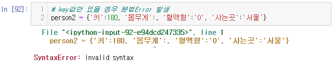

- key가 중복될 경우 마지막으로 입력된 key의 값이 저장된다.

```python
person2 = {'키':180, '몸무게':70, '혈액형':'O', '사는곳':'서울', '몸무게':80}
person2
# > {'키': 180, '몸무게': 80, '혈액형': 'O', '사는곳': '서울'}
```

- key로 boolean 사용 가능

```python
person2 = {'키':180, '몸무게':70, '혈액형':'O', '사는곳':'서울', '몸무게':80, False:0}
person2
# > {'키': 180, '몸무게': 80, '혈액형': 'O', '사는곳': '서울', False: 0}
```

- key로 숫자가 들어올 수 있고, value로 리스트가 들어 올 수도 있다.

```python
person2 = {'키':180, '몸무게':70, '혈액형':'O', '사는곳':'서울', '몸무게':80, 99 :'구구', 3.14:[3.14, '원주율']}
person2
# > {'키': 180, '몸무게': 80, '혈액형': 'O', '사는곳': '서울', 99: '구구', 3.14: [3.14, '원주율']}
```

- 리스트가 key로 올 수는 없다.

```python
person2 = {'키':180, '몸무게':70, '혈액형':'O', '사는곳':'서울', '몸무게':80, 99 : '구구', 3.14:[3.14, '원주율'], ['주소', '전번'] : '서울, 02'}
# > Error 발생
```

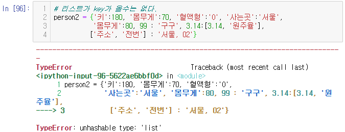

- value에 딕셔너리가 들어갈 수 있다.

```python
person2 = {'키':180, '몸무게':70, '혈액형':'O', '사는곳':'서울', '취미':{'오전':'수영', '오후':'공부'}}
person2
# > {'키': 180, '몸무게': 70, '혈액형': 'O', '사는곳': '서울', '취미': {'오전': '수영', '오후': '공부'}}
```

- person2의 key는 5개가 있고, person2의 취미의 key는 2개가 있다.
- O'REILLY 책 251page의 JSON데이터(=딕셔너리 구조)의 예시 참조

> 251page
>
> ```json
> obj = """
> {"name": "Wes",
>  "places_lived": ["United States", "Spain", "Germany"],
>  "pet": null,
>  "siblings": [{"name": "Scott", "age": 30, "pets": ["Zeus", "Zuko"]},
>               {"name": "Katie", "age": 38, "pets" : ["Sixes", "Stache", "Cisco"]}]
> }
> """
> ```


- .html : 컴퓨터가 보고 이해하기 어렵다.

- .xml : 컴퓨터가 해석하기 쉽게 한 파일(문서가 구조화가 잘 되어있기 때문에)

- .xml, .json, .csv : 인터넷에서 자료를 얻을 때 가장 많이 접할 파일 형식


### 딕셔너리

 - key, value가 여러 쌍으로 구성
 - 컴마(,)로 구분
 - key는 변하는 않는 것을 사용(ex.ID)
 - value는 변하는 값/변하지 않는 값 모두 사용 가능(ex.Password)

```python
# 빈 딕셔너리 생성
x = {}
x
# > {}

# 딕셔너리 생성 함수
x = dict()
x
# > {}

type(x)
# > dict
```

- dict(키1:값1, 키2:값2, ...)

```python
per = dict(height = 180, weight = 70, bt ='O')
per
# > {'height': 180, 'weight': 70, 'bt': 'O'}
```

- cf ) zip 함수
  - 0x ~ : ~가 16진수로 이루어진 값
  - zip 함수의 결과가 저장된 위치를 return

```python
zip(['height', 'weight', 'bt'], [180, 70, 'O'])
# > <zip at 0x2601b0aca88>
```

### 다양한 방법으로 딕셔너리 만들기

```python
per = dict(zip(['height', 'weight', 'bt'], [180, 70, 'O']))
per
# > {'height': 180, 'weight': 70, 'bt': 'O'}

per = dict([('height', 180), ('weight', 70), ('bt', 'O')])
per
# > {'height': 180, 'weight': 70, 'bt': 'O'}

per = dict({'height':180, 'weight':70, 'bt':'O'})
per
# > {'height': 180, 'weight': 70, 'bt': 'O'}
```


### 딕셔너리 수정

```python
a = {1:'hi'}
a
# > {1: 'hi'}

a = {'a':[1,2,3]}
a
# > {'a': [1, 2, 3]}

b = {1:'a'}
print(a, '\n', b)
# > {'a': [1, 2, 3]} 
# >  {1: 'a'}

a[2] = b # key = 2, value = b
a
# > {'a': [1, 2, 3], 2: {1: 'a'}}

a['name'] = 'hgd'
a
# > {'a': [1, 2, 3], 2: {1: 'a'}, 'name': 'hgd'}

# 딕셔너리[키] = '값'
a['name'] = 'lss' # key로 접근하여 value 변경가능
a
# > {'a': [1, 2, 3], 2: {1: 'a'}, 'name': 'lss'}

a['weight']=70.5
a
# > {'a': [1, 2, 3], 2: {1: 'a'}, 'name': 'lss', 'weight': 70.5}

a[2] = 'b'
a
# > {'a': [1, 2, 3], 2: 'b', 'name': 'lss', 'weight': 70.5}
```


- 딕셔너리[키] => 값

```python
a['name']
# > 'lss'
```


- 특정 키의 존재여부 확인

```python
'weight' in a
# > True

'sky' in a
# > False

'sky' not in a
# > True
```


### len()

```python
# 딕셔너리의 길이
len(a)
# > 4
```


### 딕셔너리 키와 값 확인

```python
# 딕셔너리의 모든 키 확인
a.keys() # dict_keys라는 type으로 출력
# > dict_keys(['a', 2, 'name', 'weight'])

list(a.keys())
# > ['a', 2, 'name', 'weight']

for k in a.keys():
    print(k)
# > a
# > 2
# > name
# > weight
```

```python
# 딕셔너리의 모든 value 확인
a.values() # dict_value라는 type으로 출력
# > dict_values([[1, 2, 3], 'b', 'lss', 70.5])

list(a.values())
# > [[1, 2, 3], 'b', 'lss', 70.5]
```

```python
for i in a.items(): # 튜플형식으로 출력
    print(i)
# > ('a', [1, 2, 3])
# > (2, 'b')
# > ('name', 'lss')
# > ('weight', 70.5)
```


### get 함수

```python
a
# > {'a': [1, 2, 3], 2: 'b', 'name': 'lss', 'weight': 70.5}

a['name']
# > 'lss'

a.get('name')
# > 'lss'

a['nn']
# > Error 발생
```

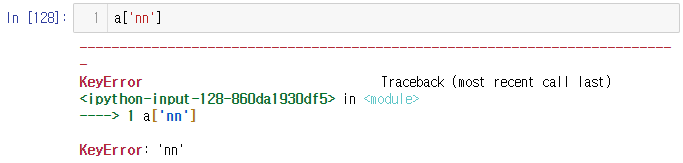

- key가 없을 경우 별도의 처리 가능

```python
print(a.get('nn'))
# > None

# 딕셔너리 a에 'nn' key가 없다면 'kim'을 출력하라.
a.get('nn', 'kim')
# > 'kim'

a.get('weight', 'kim')
# > 70.5
```


## set(집합)

- set : 집합(중복허용 불가)
- ex) x = {1,1,2,2,3} => x = {1, 2, 3}
- set()을 이용하여 집합 구성 가능

```python
s = set([1,2,3])
s
# > {1, 2, 3}

s = s = set([1,2,3,1])
s
# > {1, 2, 3}

s2 = set('hello')
s2
# > {'e', 'h', 'l', 'o'}
```

### set(집합) 자료구조 특징

- 중복허용X
- 순서가 없음
- => 인덱스 사용 불가

```python
s2[1]
# > Error 발생
```

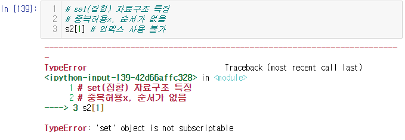

```python
s = set(['k','i','m'])
s
# > {'i', 'k', 'm'}

s_list = list(s)
s_list
# > ['i', 'k', 'm']

s_list[1]
# > 'k'

s_tuple = tuple(s)
s_tuple
# > ('i', 'k', 'm')

s_tuple[0]
# > 'i'
```


### 집합 연산

```python
s1 = set([1,2,3,4])
s2 = set([5,6,3,4])
```

- 교집합
```python
s1 & s2 
# > {3, 4}

# s1과 교집합을 구할 집합을 소괄호()안에 넣어줌
s1.intersection(s2) 
# > {3, 4}
```

- 합집합
```python
s1 | s2 
# > {1, 2, 3, 4, 5, 6}

s1.union(s2)
# > {1, 2, 3, 4, 5, 6}
```

- 차집합

```python
s1 - s2
# > {1, 2}

s1.difference(s2)
# > {1, 2}
```


### set에 원소 추가

```python
s = set([1,2])
s
# > {1, 2}
```

- set에 원소 추가 함수
- 1개만 추가 가능

```python
s.add(3)
s
# > {1, 2, 3}

s.add(4, 5)
# > Error 발생
```

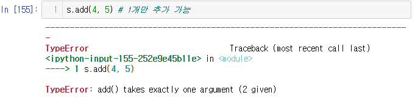

- list로도 추가 불가

```python
s.add([4, 5])
# > Error 발생
```

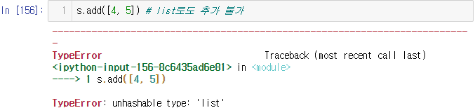

- 두 개이상 추가할 경우 update함수 사용

```python
s.update([4, 5])
s
# > {1, 2, 3, 4, 5}
```


## if 문

- 참 : "test", [1,2,], (1,2), 0이 아닌 숫자 
- 거짓 : "", [], (), 0, None


- explicit programming : 모든 조건에 대하여 명시해 놓는 프로그래밍
- implicit programming 
  - 주어진 조건을 바탕으로 연산을 하여
  - 적절한 처리하는 프로그래밍(=> AI)


- 조건문 : 
  - if 고양이가 나타나면:
    - 브레이크를 밟는다.
    - 크락션을 울린다.
  - 달린다. => 고양이가 나타나든 말든 달린다.
- (if 조건:
  - 결과) => 들여쓰기를 하지 않으면 조건문과 관계없는 문장이 되어버린다.


- 들여쓰기 조심

```python
x = 10
if x==10:
print("10입니다.") # indentationError : 들여쓰기 Error
# > Error 발생
```

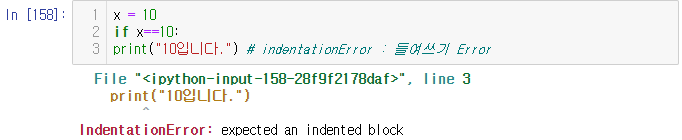

```python
x = 10
if x==10:
    print("10입니다.")
# > 10입니다.

x = 10
if x==10:
        print("10입니다.")
# > 10입니다.

x = 10
if x==10:
    print("10입니다.")
    print("5보다 큽니다.")
# > 10입니다.
# > 5보다 큽니다.

x = 10
if x==10:
    print("10입니다.")
    print("5보다 큽니다.")
print("문장을 수행합니다.")
# > 10입니다.
# > 5보다 큽니다.
# > 문장을 수행합니다.

x = 3
if x==10:
    print("10입니다.")
    print("5보다 큽니다.")
print("문장을 수행합니다.")
# > 문장을 수행합니다.
```

- 들여쓰기 오류

```python
if x == 10:
    print("안녕")
        print("하세요")
# > Error 발생
```

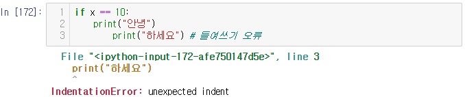


```python
if "test":
    print("수행합니다")
# > 수행합니다

if [1,2]:
    print("수행합니다")
# > 수행합니다

if 1:
    print("수행합니다")
# > 수행합니다

 # > False 이므로 실행 결과 X
if "":
    print("수행합니다")

if []:
    print("수행합니다")

if 0:
    print("수행합니다")
    
if None:
    print("수행합니다")
```

### pass

- 조건문안에 기술할 문자이 없을 경우 사용

```python
x = 10
if x == 10:
    pass
print("안녕")
# > 안녕
```


```python
if x == 10:
    print("안녕")
    if x%2 == 0: # x/2의 나머지가 0일 경우
        print("하세요")
# > 안녕
# > 하세요

x = 11
if x == 10:
    print("안녕")
    if x%2 == 0:
        print("하세요")
# 실행결과 X

x = 5
if x == 5:
    print("x는")
print("5입니다.")
# > x는
# > 5입니다.

if x >= 3:
    print("over3")
    if x<10:
        print("under10")
print("end.")
# > over3
# > under10
# > end.

if x >= 3:
    print("over3")
    if x<10:
        print("under10")
    if x<5: 
        print("under5")
print("end.")
# > over3
# > under10
# > end.
```


### else

```python
if []: # 거짓이므로 else문장 수행
    print("True")
else :
    print("False")
# > False

if [1,2]: # 참이므로 if문장 수행
    print("True")
else :
    print("False")
# > True

if None: 
    print("True")
else :
    print("False")
# > False
```


## bool 함수

```python
bool(0)
# > False

bool(10)
# > True

bool("python")
# > True

bool("")
# > False
```


### list에 pop 함수 적용하기

```python
a= [1,2,3]
if a:
    print(a.pop())
# > 3

a
# > [1, 2]
```


## while 구문

- while(~동안) : 조건문의 값이 참인 동안에 계속 반복하라.

```python
a=[1,2,3]
while a:
    print(a.pop())
# > 3
# > 2
# > 1
```


## for 구문

```python
a=[1,2,3]
while a:
    print(a.pop())
# > 3
# > 2
# > 1

for i in range(10): # (0,9)
    print("hi")
# > hi
# > hi
# > hi
# > hi
# > hi
# > hi
# > hi
# > hi
# > hi
# > hi

for i in range(10):
    print(i)
# > 0
# > 1
# > 2
# > 3
# > 4
# > 5
# > 6
# > 7
# > 8
# > 9
```


# Day3 연습문제

## sub1

- 데이터 입력을 받아서 10보다 작으면 "10보다 작아요"
- 그렇지 않으면 "10보다 커요"

```python
# sub1.
x = int(input())
if x < 10:
    print("10보다 작아요")
else:
    print("10보다 커요")
# > 5
# > 10보다 작아요

# > 11
# > 10보다 커요
```


## Num.1

- 어떤 자연수 n이 있을 때, d(n)을 n의 각 자릿수 숫자들과 n 자신을 더한 숫자라고 정의하자.
- 예를 들어
- d(91) = 9 + 1 + 91 = 101
- 이 때, n을 d(n)의 제네레이터(generator)라고 한다. 위의 예에서 91은 101의 제네레이터이다.
- 어떤 숫자들은 하나 이상의 제네레이터를 가지고 있는데, 101의 제네레이터는 91 뿐 아니라 100도 있다. 그런데 반대로, 제네레이터가 없는 숫자들도 있으며, 이런 숫자를 인도의 수학자 Kaprekar가 셀프 넘버(self-number)라 이름 붙였다. 예를 들어 1,3,5,7,9,20,31 은 셀프 넘버 들이다.
- 1 이상이고 5000 보다 작은 모든 셀프 넘버들의 합을 구하라.

```python
# 1.
total = set(range(1,5000))
dn_t = set()
for i in range(1,5000):
    dn = i + sum([int(a) for a in str(i)])
    dn_t.add(dn)
result = sum(total - dn_t)
print(result)
# > 1227365

# 수업에서 배운 내용으로한 짠 코드
total = set(range(1, 5000))
dn = set()

for i in range(1, 5000):
    tmp = 0
    for j in str(i):
        tmp += int(j)
    dn.add(i + tmp)

self = total - dns

result = 0
for a in list(self):
    result += a

print(result)

# 다른 사람이 짠 코드
sum(set(range(1, 5000)) - {x + sum([int(a) for a in str(x)]) for x in range(1, 5000)})
# > 1227365
```


## Num.2

- 표준 입력으로 가격(정수)과 쿠폰 이름이 각 줄에 입력됩니다.
- Cash3000 쿠폰은 3,000원, Cash5000 쿠폰은 5,000원을 할인합니다.
- 쿠폰에 따라 할인된 가격을 출력하는 프로그램을 만드세요(input에서 안내 문자열은 출력하지 않아야 합니다).
- 입력 
  - 27000
  - Cash3000
- 출력
  - 24000

```python
# 2.
pay = int(input())
coupon = int(input()[4:])
print(pay - coupon)
# > 27000
# > Cash3000
# > 24000
```


## Num.3

- 표준 입력으로 정수가 입력됩니다. range의 시작하는 숫자는 -10, 끝나는 숫자는 10이며 입력된 정수만큼 증가하는 숫자가 들어가도록 튜플을 만들고, 해당 튜플을 출력하는 프로그램을 만드세요(input에서 안내 문자열은 출력하지 않아야 합니다).
- 입력
  - 2
- 출력
  - (-10, -8, -6, -4, -2, 0, 2, 4, 6, 8)

```python
# 3.
x = int(input())
result = tuple(range(-10, 10, x))
print(result)
# > 2
# > (-10, -8, -6, -4, -2, 0, 2, 4, 6, 8)
```


## Num.4

- 튜플 n에서 인덱스가 홀수인 요소들이 출력되게 만드세요.
- n = -32, 75, 97, -10, 9, 32, 4, -15, 0, 76, 14, 2

```python
# 4.
n = (-32, 75, 97, -10, 9, 32, 4, -15, 0, 76, 14, 2)
print(n[1::2])
# > (75, -10, 32, -15, 76, 2)
```


## Num.5

- a 리스트에서 중복 숫자를 제거해 보자.
- a = [1, 1, 1, 2, 2, 3, 3, 3, 4, 4, 5]

```python
# 5.
a = [1, 1, 1, 2, 2, 3, 3, 3, 4, 4, 5]
a = list(set(a))
print(a)
# > [1, 2, 3, 4, 5]
```

