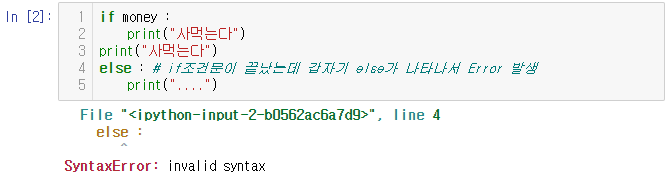
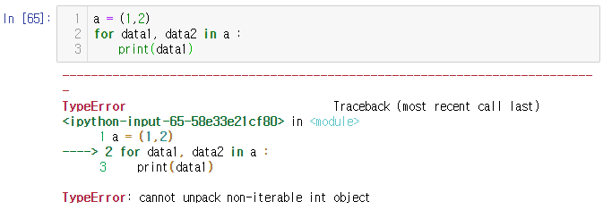
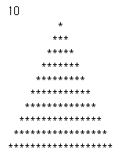

# Day4 딥러닝을 위한 빅데이터 기초 - 파이썬 기본 문법 (4)


- koi(한국정보올림피아드) : 초중고 학생들의 코딩 대회


#  jupyter Notebook 테마 설치
- cmd
     - pip install jupyterthemes
     - jt -l ; 테마 리스트 보여줌
     - jt -t 원하는 테마
     - jt -r : 원래대로 복원

# if 문

```python
money = True

if money :
    print("사먹는다")
else :
    print("....")
# > 사먹는다
```

- 들여쓰기 실수
  - 들여쓰기를 잘못하면 컴퓨터는 if 문이 끝났다고 인식하여 else구문을 Error 받아들인다.

```python
if money :
    print("사먹는다")
print("사먹는다") 
else : # if조건문이 끝났는데 갑자기 else가 나타나서 Error 발생
    print("....")
# > Error 발생
```




## and , or 연산자

```python
money = 5000
card = True
if money >= 10000 or card :
    print("taxi")
else :
    print("bus") 
# > taxi

money = 5000
card = False
if money >= 10000 or card :
    print("taxi")
else :
    print("bus") 
# > bus

money = 5000
card = True
if money >= 10000 and card :
    print("taxi")
else :
    print("bus") 
# > bus

money = 5000
card = True
if not money >= 10000 and card :
    print("taxi")
else :
    print("bus") 
# > taxi
```


## in 연산자

- x in list : list 내부에 x가 있느냐?
- x in tuple
- x in string

```python
1 in [1,2,3]
# > True

1 not in [1,2,3]
# > False

poc = ['money', 'cp', 'coin']
if 'coin' in poc :
    print("동전이 있다.")
else :
    print("동전이 없다")
# > 동전이 있다.
```


## else 문

```python
if None :
    print("T")
else :
    print("F")
# > F

if 3.14 :
    print("T")
else :
    print("F")
# > T

if 0xFFFF : # 16진수
    print("T")
else :
    print("F")
# > T

if 0b1010 : # 2진수
    print("T")
else :
    print("F")
# > T

if "" :
    print("T")
else :
    print("F")
# > F

if "hi" :
    print("T")
else :
    print("F")
# > T

if not "hi" :
    print("T")
else :
    print("F")
# > F
```


## 중첩 if 문

```python
x = 1
y = 2

if x == 1 and y == 2:
    print("T")
else :
    print("F")
# > T

# 위와 동일한 식
if x == 1 :
    if y == 2 :
        print("T")
    else :
        print("F")
else :
    print("F") 
# > T
```


## a < x < b 연산자

```python
# 일반적인 프로그램의 경우
x = 10
if x>0 and x<20 :
    print("20보다 작은 양수")
# > 20보다 작은 양수

# python에서만 가능한 문법
if 0<x<20 :
    print("20보다 작은 양수")
# > 20보다 작은 양수
```


## elif 문

- else if = elif
- 가독성을 높이기 위하여 elif 문 사용

```python
poc = ['cp', 'paper']
card = True
if 'money' in poc :
    print("택시탄다")
else :
    if card :
        print("택시탄다")
    else :
        print("걸어간다")
# > 택시탄다

if 'money' in poc :
    print("택시탄다")
elif card : # elif = else if(그렇지 않고 만약에)
    print("택시탄다")
else :
    print("걸어간다")
# > 택시탄다

card = False
if 'money' in poc :
    print("택시탄다")
elif card : 
    print("택시탄다")
else : # if 와 elif 조건을 모두 만족하지 않는 경우 실행
    print("걸어간다")
# > 걸어간다
```


## 코드 짧게 작성

- 짧지만 좋지 않은 경우가 존재하므로 적절히 사용

```python
if 'money' in poc :
    pass
else :
    print("카드 사용")
# > 카드 사용

# 같은 표현, 짧지만 가독성이 좋지 않음
if 'money' in poc : pass
else : print("카드 사용")
# > 카드 사용
```

```python
score = 80
if score >= 60 : 
    msg = 'success'
else : 
    msg = 'failure'
print(msg)
# > success

# 한 줄로 표현
# 조건이 참인 경우 if 조건문, 거짓인 경우 else 조건문이 실행된다.
msg = 'success' if score >= 60 else 'failure'
print(msg)
# > success
```


# for 구문

- for 변수 in range(범위) :
  - 반복코드

```python
for i in range(10):
    print("hi")
# > hi
# > hi
# > hi
# > hi
# > hi
# > hi
# > hi
# > hi
# > hi
# > hi

for i in range(1, 10, 3):
    print("hi")
# > hi
# > hi
# > hi

# range(1,10)보다 range(10,1,-1)의 연산 속도가 미세하게 빠르다
for i in range(10, 1, -1):
    print("hi")
# > hi
# > hi
# > hi
# > hi
# > hi
# > hi
# > hi
# > hi
# > hi
```

```python
cnt = input('반복 함수 입력 :')
for i in range(int(cnt)):
    print('hello', i)
# > 반복 함수 입력 :5
# > hello 0
# > hello 1
# > hello 2
# > hello 3
# > hello 4
```

- for 구문에 range말고 list, tuple, string도 사용 가능

```python
a = [1,2,3]
for i in a :
    print(i)
# > 1
# > 2
# > 3

a2 = (1,2,3)
for i in a2 :
    print(i)
# > 1
# > 2
# > 3

a3 = 'python'
for i in a3 :
    print(i)
# > p
# > y
# > t
# > h
# > o
# > n

a3 = 'python'
for i in a3 :
    print(i, end = " ")
# > p y t h o n 

# 반대로 바꿔서 진행
for i in reversed(a3) : 
    print(i, end = " ")
# > n o h t y p 
```


## 인수 두 개 받기

```python
a = (1,2)
for data in a :
    print(data)
# > 1
# > 2

a = (1,2)
for data1, data2 in a :
    print(data1)
# > Error 발생
```



```python
a = [(1,2)]
for (data1, data2) in a :
    print(data1, data2)
# > 1 2

a = [(1,2), (3,4)]
for (data1, data2) in a :
    print(data1, data2)
# > 1 2
# > 3 4
```


## for 구문 중첩

- 구구단 2단 출력

```python
multi = 2
for i in range(1, 10):
    print(i*multi, end = ' ')
# > 2 4 6 8 10 12 14 16 18 
```

- 구구단 9단까지 출력

```python
for i in range(2, 10) :
    for j in range(1, 10):
        print(i*j, end = ' ')
    print()
# > 2 4 6 8 10 12 14 16 18 
# > 3 6 9 12 15 18 21 24 27 
# > 4 8 12 16 20 24 28 32 36 
# > 5 10 15 20 25 30 35 40 45 
# > 6 12 18 24 30 36 42 48 54 
# > 7 14 21 28 35 42 49 56 63 
# > 8 16 24 32 40 48 56 64 72 
# > 9 18 27 36 45 54 63 72 81 
```

- \* 모양 출력

```python
# *
# **
# ***
# ****

for i in range(1, 5):
    for j in range(i):
        print('*', end ='')
    print()
# > *
# > **
# > ***
# > ****
```

```python
# *
#  *
#   *
#    *

for i in range(1, 5):
    for j in range(i):
        if i-1 == j :
            print('*')
        else : print(' ', end = '')
# > *
# >  *
# >   *
# >    *
```

### Sub3 : 피라미드 모양 출력

```
  *
 ***
*****
```


## 리스트 내포

- 리스트 내포 : 리스트 내부에 for문을 포함
- [표현식 for 변수 in 반복가능형(시퀀스형) if 조건문], if 조건문 생략 가능

```python
x = [1,2,3]
res = []
for n in x:
    res.append(n)
print(res)
# > [1, 2, 3]

res = []
for n in x:
    res.append(n*2)
print(res)
# > [2, 4, 6]
```

- 위의 코드를 리스트 내포로 표현

```python
res = [n for n in x]
print(res)
# > [1, 2, 3]

# x에서 데이터를 n으로 읽어들인 후, n에 2를 곱한 값으로 리스트에 저장
res = [n*2 for n in x]
print(res)
# > [2, 4, 6]

# x에서 데이터를 n으로 읽어들인 후
# 만약에 n이 짝수이면, n에 2를 곱한 값으로 리스트에 저장
res = [n*2 for n in x if n%2 == 0]
print(res)
# > [4]
```

- for 구문이 2개인 리스트 내포

```python
# 출력 : [2, 4, 6, 8, ...., 81]
res = [ y*x for y in range(2,10) for x in range(1, 10)]
# 1. for y in range(2,10)
# 2. for x in range(1,10)
# 3. y*x
print(res)
# > [2, 4, 6, 8, 10, 12, 14, 16, 18, 3, 6, 9, 12, 15, 18, 21, 24, 27, 4, 8, 12, 16, 20, 24, 28, 32, 36, 5, 10, 15, 20, 25, 30, 35, 40, 45, 6, 12, 18, 24, 30, 36, 42, 48, 54, 7, 14, 21, 28, 35, 42, 49, 56, 63, 8, 16, 24, 32, 40, 48, 56, 64, 72, 9, 18, 27, 36, 45, 54, 63, 72, 81]
```


# while 문

- while 조건식 :
  - 수행문장1
  - 수행문장2
  - ...

```python
i = 0
# while i < 10 :# i가 10보다 작다는 조건을 만족하는 동안에 실행
#     print('hi', i)  # 무한루프 구문

while i < 10 :
    print('hi', i)
    i += 1
# > hi 0
# > hi 1
# > hi 2
# > hi 3
# > hi 4
# > hi 5
# > hi 6
# > hi 7
# > hi 8
# > hi 9

i = 0
while i > 10 :
    print('hi', i)
# > 실행결과 없음
```

```python
prompt = """
1. add
2. del
3. list
4. quit

enter number:  """
print(prompt)
# > 
# > 1. add
# > 2. del
# > 3. list
# > 4. quit
# > 
# > enter number:  

number = 0 # while문의 조건으로 사용할 변수에 대하여 초기화 필요
while number != 4 : 
    print(prompt)
    number = int(input())
# > 
# > 1. add
# > 2. del
# > 3. list
# > 4. quit
# > 
# > enter number:  
# > 1
# > 
# > 1. add
# > 2. del
# > 3. list
# > 4. quit
# > 
# > enter number:  
# > 2
# > 
# > 1. add
# > 2. del
# > 3. list
# > 4. quit
# > 
# > enter number:  
# > 3
# > 
# > 1. add
# > 2. del
# > 3. list
# > 4. quit
# > 
# > enter number:  
# > 4
```


## break, continue

- reak, continue 문은 반복문에서 제어하는 역할
- break : 반복문 종료
- continue : 특정한 반복 문장을 건너뛸 때 사용

```python
i = 0
while True : # 무한 반복
    print(i, end = ' ')
    i += 1
    if i == 10 :
        break # while문 종료
# > 0 1 2 3 4 5 6 7 8 9 

for i in range(100):
    print(i, end = ' ')
    if i == 9 :
        break
# > 0 1 2 3 4 5 6 7 8 9 
```

- 반복문의 시작위치로 이동 => continue 아래에 있는 문장들은 실행 X

```python
for i in range(100) :
    if i%2 == 0 : # 짝수
        continue 
    print(i, end = ' ')
# > 1 3 5 7 9 11 13 15 17 19 21 23 25 27 29 31 33 35 37 39 41 43 45 47 49 51 53 55 57 59 61 63 65 67 69 71 73 75 77 79 81 83 85 87 89 91 93 95 97 99 
```

- 1~100 사이의 수에 대해 짝수만 출력(while문)
```python
i = 0
while i <= 100 :
    i += 1
    if i%2 == 1 :
        continue
    print(i, end = ' ')
# > 2 4 6 8 10 12 14 16 18 20 22 24 26 28 30 32 34 36 38 40 42 44 46 48 50 52 54 56 58 60 62 64 66 68 70 72 74 76 78 80 82 84 86 88 90 92 94 96 98 100
```

- 커피머신

```python
coffee = 10 # 10잔 커피, 200원/잔
money = 5000 # 5천원

while money :
    print("커피가 나옵니다.")
    coffee = coffee - 1
    money = money - 200
    print("남은 커피는 %d잔 입니다." %coffee)
    print("잔액은 %d원 입니다." %money)
    if coffee == 0:
        print("커피가 떨어졌습니다. 판매중지")
        break
# > 커피가 나옵니다.
# > 남은 커피는 9잔 입니다.
# > 잔액은 4800원 입니다.
# > 커피가 나옵니다.
# > 남은 커피는 8잔 입니다.
# > 잔액은 4600원 입니다.
# > 커피가 나옵니다.
# > 남은 커피는 7잔 입니다.
# > 잔액은 4400원 입니다.
# > 커피가 나옵니다.
# > 남은 커피는 6잔 입니다.
# > 잔액은 4200원 입니다.
# > 커피가 나옵니다.
# > 남은 커피는 5잔 입니다.
# > 잔액은 4000원 입니다.
# > 커피가 나옵니다.
# > 남은 커피는 4잔 입니다.
# > 잔액은 3800원 입니다.
# > 커피가 나옵니다.
# > 남은 커피는 3잔 입니다.
# > 잔액은 3600원 입니다.
# > 커피가 나옵니다.
# > 남은 커피는 2잔 입니다.
# > 잔액은 3400원 입니다.
# > 커피가 나옵니다.
# > 남은 커피는 1잔 입니다.
# > 잔액은 3200원 입니다.
# > 커피가 나옵니다.
# > 남은 커피는 0잔 입니다.
# > 잔액은 3000원 입니다.
# > 커피가 떨어졌습니다. 판매중지
```

```python
coffee = 10 # 10잔 커피, 200원/잔
money = 1000 # 5천원

while money :
    print("커피가 나옵니다.")
    coffee = coffee - 1
    money = money - 200
    print("남은 커피는 %d잔 입니다." %coffee)
    print("잔액은 %d원 입니다." %money)
    if coffee == 0:
        print("커피가 떨어졌습니다. 판매중지")
        break
# > 커피가 나옵니다.
# > 남은 커피는 9잔 입니다.
# > 잔액은 800원 입니다.
# > 커피가 나옵니다.
# > 남은 커피는 8잔 입니다.
# > 잔액은 600원 입니다.
# > 커피가 나옵니다.
# > 남은 커피는 7잔 입니다.
# > 잔액은 400원 입니다.
# > 커피가 나옵니다.
# > 남은 커피는 6잔 입니다.
# > 잔액은 200원 입니다.
# > 커피가 나옵니다.
# > 남은 커피는 5잔 입니다.
# > 잔액은 0원 입니다.
```

### Sub2 : 잔액이 200미만이면 판매가 안되도록...


# 난수(random number)

- 난수(random number) : 컴퓨터 임의의 수
- 모듈 : 함수들의 묶음(.py or .ipynb), (파일)
- 패키지 : 모듈 또는 서브 패키지의 묶음, (폴더)

```python
import random # random모듈(random.py) 호출
random.random() # 0 <= 난수 < 1
# 모듈이름.함수이름()
# > 0.5689079784214864
```


- random.randint() : 정수의 random number 발생

```python
random.randint(1,45) # 정수 범위를 제공하여야 함
# > 16

i = 0
while i != 6 :
    print(random.randint(1,45), end = " ")
    i += 1
# > 29 19 37 37 9 25
```

### Sub1 : 동일한 수가 발생하지 않도록 로또 번호 생성기 수정


- choice 함수는 주어진 시퀀스 형에서 랜덤으로 하나 추출

```python
random.choice([1,2,3,4,5,6])
# > 2

random.choice('hello')
# > 'h'

random.choice(range(10,20))
# > 12
```


# 연습문제

## 1. 
- 1차원의 점들이 주어졌을 때, 그 중 가장 거리가 짧은 것의 쌍을 출력하는 함수를 작성하시오. (단 점들의 배열은 모두 정렬되어있다고 가정한다.)
- 예를들어 S={1, 3, 4, 8, 13, 17, 20} 이 주어졌다면, 결과값은 (3, 4)가 될 것이다.

```python
# 1.
S={1, 3, 4, 8, 13, 17, 20}

S_list = list(S) # index 사용을 위하여 list로 변환
dis = list() # 점 간의 거리
m = 1000 # 최소거리 변수 초기화
index = list() # 최소거리에 해당하는 index 저장
result = list() # 결과

for i in range(len(S)-1) : # 점간의 거리 구하기 
    dis.append(S_list[i+1] - S_list[i])

for i in range(len(dis)) : # 최소거리 구하기
    if m > dis[i]:
        m = dis[i]

for i in range(len(dis)-1) : # 최소거리에 해당하는 index 구하기
    if dis[i] == m : index.append(i)

for i in index : # 최소거리에 해당하는 점들 구하기
    result.append((S_list[i], S_list[i+1]))
    
print(result)
# > [(3, 4)]
```


## 2.

- 주어진 문자열(공백 없이 쉼표로 구분되어 있음)을 가지고 아래 문제에 대한 프로그램을 작성하세요.
- data="이유덕,이재영,권종표,이재영,박민호,강상희,이재영,김지완,최승혁,이성연,박영서,박민호,전경헌,송정환,김재성,이유덕,전경헌"
  1. 김씨와 이씨는 각각 몇 명 인가요?
  2. "이재영"이란 이름이 몇 번 반복되나요?
  3. 중복을 제거한 이름을 출력하세요.
  4. 중복을 제거한 이름을 오름차순으로 정렬하여 출력하세요.

- names = "이유덕,이재영,권종표,이재영,박민호,강상희,이재영,김지완,최승혁,이성연,박영서,박민호,전경헌,송정환,김재성,이유덕,전경헌".split(",")

```python
# 2. 
data="이유덕,이재영,권종표,이재영,박민호,강상희,이재영,김지완,최승혁,이성연,박영서,박민호,전경헌,송정환,김재성,이유덕,전경헌"
name = data.split(",")
```
```python
# (1)
kim_count = 0 # 김씨 명 수 카운트 초기화
lee_count = 0 # 이씨 명 수 카운트 초기화

for i in range(len(name)) : # 각각 명 수 카운트
    if name[i][0] == '김' : kim_count += 1
    elif name[i][0] == '이' : lee_count += 1

print('김씨 :', kim_count, ', 이씨 :', lee_count)
# > 김씨 : 2 , 이씨 : 6
```
```python
# (2)
specific_count = 0 # '이재영'이란 이름 카운트 초기화
for i in range(len(name)) : # '이재영'이란 이름 카운트
    if name[i] == '이재영' : specific_count += 1

print('"이재영"이란 이름은 총', specific_count, '번 반복됩니다.')
# > "이재영"이란 이름은 총 3 번 반복됩니다.
```
```python
# (3)
overlap_remove = list(set(name)) # 중복을 제거하기 위하여 list -> set -> list 변환

print(overlap_remove)
# > ['송정환', '이재영', '최승혁', '권종표', '이유덕', '김재성', '강상희', '박영서', '김지완', '전경헌', '박민호', '이성연']
```
```python
# (4)
order_name = overlap_remove # 정렬해줄 데이터 입력
order_name.sort() # 정렬

print(order_name)
# > ['강상희', '권종표', '김재성', '김지완', '박민호', '박영서', '송정환', '이성연', '이유덕', '이재영', '전경헌', '최승혁']
```


## 3.

- 10미만의 자연수에서 3과 5의 배수를 구하면 3,5,6,9이다. 이들의 총합은 23이다.
- 1000미만의 자연수에서 3,5의 배수의 총합을 구하라.

```python
# 3.
maximum = 1000

three = [ 3*i for i in range(1, (1000+2)//3) ] # 1000미만의 3의 배수 list
five = [ 5*i for i in range(1, (1000+4)//5) ] # 1000미만의 5의 배수 list

# 3과 5의 배수에서 중복제거를 위한 집합으로 변경 및 합집합 후 리스트로 변경
combine = list(set(three) | set(five))

result = 0
for i in range(len(combine)) : 
    result += combine[i]

print(result)
# > 233168
```


## 4.

- 자기 자신을 제외한 모든 양의 약수들의 합이 자기 자신이 되는 자연수를 완전수라고 한다.
- 예를 들면, 6과 28은 완전수이다.
  - 6=1+2+3 // 1,2,3은 각각 6의 약수
  - 28=1+2+4+7+14 // 1,2,4,7,14는 각각 28의 약수
- 입력으로 자연수 N을 받고, 출력으로 N 이하의 모든 완전수를 출력하는 코드를 작성하라.

```python
# 4.
N = int(input())

number = list(range(2, N+1)) # 2~(N+1)까지의 숫자 list 생성
complete = list() # 완전수를 위한 list 생성

for i in range(len(number)) :
    tmp = 0 # 완전수 확인을 위한 변수
    
    for j in range(2, number[i]//2) : 
        # 자기자신에서 1을 제외한 모든 약수 더하기
        if j*j > number[i] or tmp > number[i]: 
            break # number[i]의 제곱근까지만 or 
            # 약수의 합이 number[i]를 넘어가는 경우 계산을 멈춤
        if number[i] % j == 0 :
            if j == number[i]//j : 
                # 16=4^2와 같은 경우 약수 한 번만 더해주기
                tmp = tmp + j
            else : 
                tmp = tmp + j + (number[i]//j)
    
    if number[i] == tmp + 1 : # 완전수인지 확인
        complete.append(number[i]) 

print(complete)
# > 10000
# > [6, 28, 496, 8128]
```


## 5.

- 0\~9까지의 문자로 된 숫자를 입력 받았을 때, 이 입력 값이 0\~9까지의 숫자가 각각 한 번 씩만 사용된 것인지 확인하는 함수를 구하시오.

- sample inputs: 0123456789 01234 01234567890 6789012345 012322456789
- sample outputs: true false false true false

```python
# 5.
source = input()

print(set(str(source)) == set(str('0123456789')) and len(str(source)) == 10)
# > 0123456789
# > True

# > 01234
# > False

# > 01234567890
# > False

# > 6789012345
# > True

# > 012322456789
# > False
```


## 6. run length 압축알고리즘 문제( .bmp)

- 문자열을 입력받아서, 같은 문자가 연속적으로 반복되는 경우에 그 반복 횟수를 표시하여 문자열을 압축하기.
- 입력 예시: aaabbcccccca
- 출력 예시: a3b2c6a1

```python
# 6.
source = input()

i = 0 # index 위치 초기화
result = list() # 연속적인 문자 카운트 저장을 위한 list

while 1 : 
    result.append(source[i])
    count = 0 # 연속적인 문자 카운트 초기화
    
    for j in range(i, len(source)) : # 연속적인 문자 카운트
        if source[j] == source[i] : count += 1
        else : break
    
    result.append(str(count)) # 리스트에 카운트 입력
    i = i + count # 연속적인 문자들 넘어가기
    if i == len(source) : break

print(''.join(result))
# > aaabbcccccca
# > a3b2c6a1
```


## 7. Sub1

- 동일한 수가 발생하지 않도록 로또 번호 생성기 수정

```python
# 7.
rotto = set() # 로또 번호 저장을 위한 집합 생성

while len(rotto) <= 6 : # 로또 번호 생성
    rotto.add(random.randint(1, 45))

print(rotto)
# > {1, 4, 37, 9, 13, 26, 31}
# > {37, 7, 42, 18, 21, 23, 30}
# > {33, 2, 34, 3, 36, 12, 25}
```


## 8. Sub2

- 커피값 200원/잔
- 최대 10잔
- 잔액이 200미만이면 판매가 안되도록...

```python
# 8.
coffee = 10 # 10잔 커피, 200원/잔
money = 700 # 7백원

while money >= 200 :
    print("커피가 나옵니다.")
    coffee = coffee - 1
    money = money - 200
    print("  남은 커피는 %d잔 입니다." %coffee)
    print("  잔액은 %d원 입니다." %money)
    if coffee == 0:
        print("커피가 떨어졌습니다. 판매중지")
        break
# > 커피가 나옵니다.
# >   남은 커피는 9잔 입니다.
# >   잔액은 500원 입니다.
# > 커피가 나옵니다.
# >   남은 커피는 8잔 입니다.
# >   잔액은 300원 입니다.
# > 커피가 나옵니다.
# >   남은 커피는 7잔 입니다.
# >   잔액은 100원 입니다.
```


## 9. Sub3

- 피라미드 모양 출력

```
  *
 ***
*****
```

```python
# 9.
num = int(input())

for i in range(1, num+1) :
    for j in range(num-i) :
        print(' ', end = '')
    for j in range(2*i - 1) :
        print('*', end = '')
    print()
# > 그림
```

