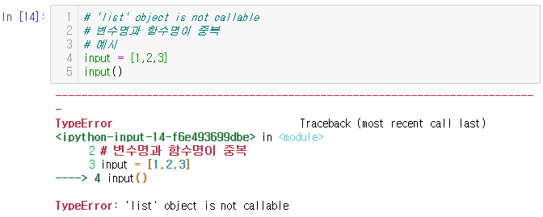
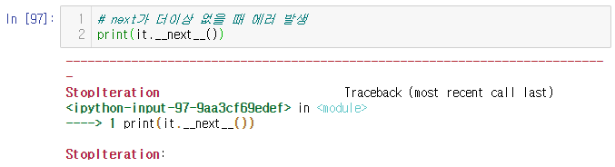

# 딥러닝을 위한 빅데이터 기초 - 데이터 모델링, SQL 응용 Day7


# 내장함수

## filter

- filter(함수, 반복가능 자료형)
- 반복가능 자료형 요소가 첫번째 인수인 함수에 입력
- 변환 값이 참인 경우에 대해서만 필터링 해주는 함수

- filter 함수를 모를 경우 작성하는 방법

```python
def positive(p) :
    res=[]
    for i in p :
        if i > 0 :
            res.append(i)
    return res

print(positive([1,-3,2,-5]))
# > [1, 2]
```

- filter 함수를 사용한 경우

```python
print(filter(lambda x: x > 0, [1,-3,2,-5]))
# > <filter object at 0x0000024235F62108>

# filter 함수 후 list를 사용하여 값을 볼 수 있게 할 것
print(list(filter(lambda x: x > 0, [1,-3,2,-5])))
# > [1, 2]
```

- map : 모든 요소에 대하여 적용한다.
- filter : 조건에 맞는 요소에만 적용한다.

```python
target = [1,2,3,4]
res =[]
def add1(n) :
    return n+1

for v in target :
    res.append(add1(v))

print(res)
# > [2, 3, 4, 5]

# 여러가지 작성 방법
print(list(map(add1, target)))
print(list(map(lambda x : x+1, target)))
# > [2, 3, 4, 5]
# > [2, 3, 4, 5]

print(list(map(str, target)))
# > ['1', '2', '3', '4']
```


- def : 재사용 목적
- lambda : 일회용 목적

```python
target = list(range(1,11))
res = []

def is_even(n) :
    return True if n%2 == 0 else False

for v in target :
    if is_even(v) :
        res.append(v)

print(res)
# > [2, 4, 6, 8, 10]

# filter 사용
print(list(filter(is_even, target)))
# > [2, 4, 6, 8, 10]

# filter + lambda 조합으로 작성
print(list(filter(lambda x : x%2 == 0, target)))
# > [2, 4, 6, 8, 10]

# [1,3,-2,-5] 양수만 필터링
print(list(filter(lambda x : x > 0, [1,3,-2,-5])))
# > [1, 3]
```

----

# 오류

- 'list' object is not callable
- 변수명과 함수명이 중복된 경우 발생

```python
# 예시
input = [1,2,3]
input()
# > Error 발생
```



----


## hex

- hex : 정수 -> 16진수로 변환해 주는 함수

```python
hex(254)
# > 'Oxfe'
```


## id

- id(객체) : 객체의 메모리 주소 값을 돌려주는 함수

```python
a = 3
print(id(3)) # 3이 저장된 메모리상 주소
print(id(a)) # 3이 저장된 메모리상 주소를 a가 가지고 있다.
# > 140733204963792
# > 140733204963792
```


## int

```python
print(int('3'))
print(int(3.14))
# > 3
# > 3

int('101', 2) # 2진수 101에 대한 10진수 값
# > 5

int('FA', 16) # 16진수 FA에 대한 10진수 값
# > 250
```


## isinstance

- isinstance : 객체(instance) 인지 판단하는 함수
- 붕어빵 isinstance 붕어빵기계 => True
- 꽃게빵 isinstance 붕어빵기계 => False

```python
class 붕어빵기계 :
    pass
붕어빵 = 붕어빵기계()
isinstance(붕어빵, 붕어빵기계)
# > True

class 꽃게빵기계 :
    pass
꽃게빵 = 꽃게빵기계()
isinstance(꽃게빵, 붕어빵기계)
# > False
```


## list

```python
list("test") # => ['t','e','s','t']
# > ['t', 'e', 's', 't']

list((1,2,3))
# > [1, 2, 3]

list(range(1,10))
# > [1, 2, 3, 4, 5, 6, 7, 8, 9]
```


## 함수 구현 방법

- (1) 일반적인 함수 구현

```python
def two_times(num) :
    tt_num =list()
    for n in num :
        tt_num.append(n*2)
    return tt_num

res = two_times([1,2,3])
print(res) # [2,4,6]
# > [2, 4, 6]
```

- (2) map 함수 구현

```python
def two_times(x):
    return x*2

print(list(map(two_times, [1,2,3])))
# > [2, 4, 6]
```

- (3) lambda 함수 구현

```python
print(list(map(lambda x : x*2, [1,2,3])))
# > [2, 4, 6]
```


## max

```python
max([1,2,3])
# > 3

max("test") # 아스키 코드 값이 가장 큰 문자
# > 't'
```


## min

```python
min([1,2,3])
# > 1

min("test") # 아스키 코드 값이 가장 작은 문자
# > 'e'
```


## oct

- oct() : 8진수로 변환하는 함수, 8 -> 10_(8)

```python
oct(8)
# > '0o10'
```


## chr

- chr() : 해당 숫자에 해당하는 아스키 문자를 반환

```python
chr(97)
# > 'a'
```


## ord

- ord : chr와 반대되는 함수
- 문자에 대한 아스키코드 값을 알려줌 

```python
ord('a')
# > 97
```


## pow

- pow(a,b) : a에 b승을 계산해 줌

```python
pow(2,4)
# > 16
```


## round

- round : 반올림해주는 함수
- 반올림 위치 지정 가능

```python
round(4.6)
# > 5

round(3.4567, 2)
# > 3.46
```


## 정렬

### sort()

- list.sort()
  - 리스트를 정렬하여 return 값은 None
  - 리스트의 순서가 내부적으로 변경

```python
li = [1,3,2]
print(li.sort())
print(li)
# > None
# > [1, 2, 3]
```

### sorted()

- sorted(list)
  - 정렬된 새로운 리스트를 반환
  - 원본 리스트에는 영향이 없음

```python
li2 = [1,3,2]
print(sorted(li2))
print(li2)
# > [1, 2, 3]
# > [1, 3, 2]
```

```python
sorted(['a','c','b'])
# > ['a', 'b', 'c']

sorted("today")
# > ['a', 'd', 'o', 't', 'y']

sorted((1,3,2))
# > [1, 2, 3]
```

### 두 함수의 차이점

- sort는 원본 리스트 순서가 변경됨.
- sorted는 변경 안됨.
- 속도 : sort이 sorted보다 빠르다.
  - 이유 : sorted는 사본 리스트가 추가적으로 생성되기 때문에


## str

```python
str(3)
# > '3'

str('hi')
# > 'hi'

str('hi'.upper())
# > 'HI'
```


## sum

```python
sum([1,2])
# > 3

sum((1,2,3))
# > 6
```


## zip

- zip() : 자료를 묶어주는 함수

```python
zip('abc', 'def')
# > <zip at 0x24236d43048>

list(zip('abc', 'def'))
# > [('a', 'd'), ('b', 'e'), ('c', 'f')]

list(zip('abc', 'def', 'ghi'))
# > [('a', 'd', 'g'), ('b', 'e', 'h'), ('c', 'f', 'i')]
```

- 짝이 없는 경우 짤림

```python
list(zip('abc', 'defg')) # g가 버려짐
# > [('a', 'd'), ('b', 'e'), ('c', 'f')]

list(zip('abc', 'de')) # c가 버려짐
# > [('a', 'd'), ('b', 'e')]
```


# 외장함수

## pickle

- pickle : 객체 상태 그대로 저장/불러오기 모듈

```python
import pickle

f = open('test.txt', 'wb') # 'wb' : 이진(binary)모드 wirte
data ={1:'python', 2:'java'} # 객체
pickle.dump(data, f)
f.close()
# > 'test.txt' 파일 생성
```

- cf) binary로 저장되는 정보 : 이미지, 음성

- binary 정보 읽어오기

```python
f = open('test.txt', 'rb') # 'rb' : 이진모드로 열기
data = pickle.load(f)
print(data)
# > {1: 'python', 2: 'java'}
```


## shutil.copy

- shutil.copy : 파일 복사

```python
import shutil # 파일복사
shutil.copy('test.txt', 'test2.txt')
# > 'test2.txt' # 'test.txt' 파일 생성
```


## glob

- 특정위치에 있는 모든 파일의 목록을 가져와라

```python
import glob
glob.glob('c:/da/*')
# > ['c:/da\\newFile.txt']
```

```python
glob.glob('C:/Users/student/Desktop/Python/*')
# > ['C:/Users/student/Desktop/Python\\DA',
# >  'C:/Users/student/Desktop/Python\\day2 연습문제.txt',
# >  'C:/Users/student/Desktop/Python\\day3 연습문제.txt',
# >  'C:/Users/student/Desktop/Python\\day4 연습문제.txt',
# >  'C:/Users/student/Desktop/Python\\day5 연습문제.txt',
# >  'C:/Users/student/Desktop/Python\\day6 연습문제.txt']
```


## webbrowser

- 해당 웹브라우저 실행

```python
import webbrowser
webbrowser.open("http://www.google.com")
# > True # google 웹페이지 열림

webbrowser.open_new("http://www.google.com")
# > True # google 웹페이지 열림
```


## 두 점 사이의 거리 출력(피타고라스 정리)

- 2차원 평면에서 위치를 나타내는 클래스

```python
class Point2D :
    def __init__(self, x, y) :
        self.x = x
        self.y = y
    
p1 = Point2D(x=30, y=20) # 점1(x=30, y=20)
p2 = Point2D(x=50, y=40) # 점2(x=50, y=40)

print('p1:{} {}'.format(p1.x, p1.y))
print('p2:{} {}'.format(p2.x, p2.y))
# > p1:30 20
# > p2:50 40
```

- 두 점 사이의 거리 출력(피타고라스 정리)

```python
import math

dx = abs(p1.x - p2.x)
dy = abs(p1.y - p2.y)
d = math.sqrt(pow(dx, 2) + pow(dy, 2))
print(d)
# > 28.284271247461902
```

- or

```python
d = math.sqrt(pow(p2.x - p1.x, 2) +
              pow(p2.y - p1.y, 2))
print(d)
# > 28.284271247461902
```


## iterator

- 이터레이터(iterator, 반복자)

  - 데이터를 차례대로 꺼낼 수 있는 객체
  - for i in range(10)
    - 숫자 0~9까지를 차례대로 꺼내는 이터레이터가 있음
    - 이터레이터에 의해서 0~9까지의 수가 생성


- 이터러블(iterable, 반복 가능한 객체)

  - 문자열, 리스트, 튜플, ...


### dir

- dir() : 데이터가 이터러블 한지 확인
- dir(객체)
  - 결과로 나온 method들이 사용가능한다

```python
dir([1,2,3]) # 반복가능하면 '__iter__'가 포함
# > ['__add__',
# >  '__class__',
# >  '__contains__',
# >  '__delattr__',
# >  '__delitem__',
# >  '__dir__',
# >  '__doc__',
# >  '__eq__',
# >  '__format__',
# >  '__ge__',
# >  '__getattribute__',
# >  '__getitem__',
# >  '__gt__',
# >  '__hash__',
# >  '__iadd__',
# >  '__imul__',
# >  '__init__',
# >  '__init_subclass__',
# >  '__iter__',
# >  '__le__',
# >  '__len__',
# >  '__lt__',
# >  '__mul__',
# >  '__ne__',
# >  '__new__',
# >  '__reduce__',
# >  '__reduce_ex__',
# >  '__repr__',
# >  '__reversed__',
# >  '__rmul__',
# >  '__setattr__',
# >  '__setitem__',
# >  '__sizeof__',
# >  '__str__',
# >  '__subclasshook__',
# >  'append',
# >  'clear',
# >  'copy',
# >  'count',
# >  'extend',
# >  'index',
# >  'insert',
# >  'pop',
# >  'remove',
# >  'reverse',
# >  'sort']
```

```python
# 이터레이터 객체 출력
[1,2,3].__iter__()
# > <list_iterator at 0x24239a61d48>
```

- for 구문은 __iter__()와 __next__()에 의해 수행
```python
for i in [1,2,3] :
    print(i)
# > 1
# > 2
# > 3
```

```python
it = [1,2,3].__iter__()

print(it.__next__())
print(it.__next__())
print(it.__next__())
# > 1
# > 2
# > 3
```

- next가 더이상 없을 때 에러 발생

```python
print(it.__next__())
```



- for i in range(3) :
  - print(i)
- =>
  - 1) `__iter__()` 호출
  - 2) `__next__()` 호출 -> i변수에 1저장
  - 3) `__next__()` 호출 -> i변수에 2저장
  - 4) `__next__()` 호출 -> 에러 발생


# 정규표현식(regular expression)

- 데이터수집(정규표현식 사용) -> 전처리 -> 분석 -> ...
- 정규표현식 : 문자열을 규칙에 맞춰 정리
- 010-1234-1234

- 텍스트 수집 -> 주민번호 포함 -> 뒷자리를 \*로 변경

```python
data = """
kim 950101-1234567
lee 970202-2345678
"""
```

- 일반적인 치환 방법

```python
for line in data.split('\n') :
    print(line)
# > 
# > kim 950101-1234567
# > lee 970202-2345678
# > 

for line in data.split('\n') :
    for word in line.split(' ') :
        print(word)
# > 
# > kim
# > 950101-1234567
# > lee
# > 970202-2345678
# > 

for line in data.split('\n') :
    for word in line.split(' ') :
        print(len(word))
# > 0
# > 3
# > 14
# > 3
# > 14
# > 0

# 길이가 14인 경우가 주민번호이므로 해당 곳만 바꿔줌
# isdigit() : 숫자인지 아닌지 확인하는 함수
result = []
for line in data.split('\n') :
    word_res = []
    for word in line.split(' ') :
        if len(word) == 14 and word[:6].isdigit() and word[7:].isdigit() :
            w = word[0:6] + '-' + '*******'
            word_res.append(w)
    result.append(" ".join(word_res))

print('\n'.join(result))
# > 
# > 950101-*******
# > 970202-*******
# > 
```

- 정규표현식 사용

```python
data = """
kim 950101-1234567
lee 970202-2345678
"""

import re # re(regular expression,정규표현식) 모듈
pattern = re.compile("(\d{6})[-]\d{7}")
print(pattern.sub("\g<1>-*******", data))
# > 
# > kim 950101-*******
# > lee 970202-*******
```


## 정규표현식 작성방법

- re.match("패턴", "문자열")
  - 문자열에 패턴이 있는지 여부를 확인


- 패턴을 발견하면 span이라는 속성으로 위치를 알려줌

```python
print(re.match("hello", "hello. world"))
# > <re.Match object; span=(0, 5), match='hello'>
```

- None : 패턴이 문자열에 없다.

```python
print(re.match("hi", "hello. world"))
# > None

print(re.match("hellohi", "hello"))
# > None
```


## 정규표현식 메타문자

- 정규표현식 메타문자

  - 문자의 본래 의미가 아닌, 특정 의미를 갖는 문자
  - ( ), { }, \[ \], \, |, ?, +, *, $, ^, ...

### 1. [ ] 메타문자 

- 문자와 관련된 정규식에서 사용
- \[ \] 대괄호 사이에는 어떤 문자도 올 수 있음
- 정규표현식: \[abcdef\]
  - 의미 : a,b,c,d,e,f 문자 중에서 어느 한 개의 문자와 매치
  - "a"는 정규식에 일치하는 문자가 있으므로 -> 매치됨
- cf ) `re.match("패턴", "문자열")`
  - 문자열 첫번째 글자에 패턴에 해당하는 글자가 있어야 매치결과가 출력된다.

```python
print(re.match("[abcdef]", "a"))
# > <re.Match object; span=(0, 1), match='a'>

print(re.match("[abcdef]", "z"))
# > None

print(re.match("[abcdef]", "all"))
# > <re.Match object; span=(0, 1), match='a'>

print(re.match("[abcdef]", "sky"))
# > None

print(re.match("[abcdef]", "best"))
# > <re.Match object; span=(0, 1), match='b'>

print(re.match("[abcdef]", "fgha"))
# > <re.Match object; span=(0, 1), match='f'>

print(re.match("[a-z]", "fgha")) # [a-z] : 알파벳 소문자 전체
# > <re.Match object; span=(0, 1), match='f'>

print(re.match("[a-z]", "ABC"))
# > None

print(re.match("[A-Z]", "ABC")) # [A-Z] : 알파벳 대문자 전체
# > <re.Match object; span=(0, 1), match='A'>

print(re.match("[a-zA-Z]", "aABC")) # [a-zA-Z] : 알파벳 대소문자 모두
# > <re.Match object; span=(0, 1), match='a'>

print(re.match("[a-zA-Z]", "ABC"))
# > <re.Match object; span=(0, 1), match='A'>

print(re.match("[0-9]", "119")) # [0-9] : 숫자 모두
# > <re.Match object; span=(0, 1), match='1'>

print(re.match("[^0-9]", "119")) # [^0-9] : 숫자를 제외한 모두
# > None

# \d : 숫자와 매치됨, [0-9]과 같음
print(re.match("\d", "119"))
# > <re.Match object; span=(0, 1), match='1'>

# \D : 숫자가 아닌 모두와 매치됨. =[^0-9]
print(re.match("\D", "119"))
# > None

# \w : 숫자와 영문자 매치, =[0-9a-zA-Z]
print(re.match("\w", "119"))
# > <re.Match object; span=(0, 1), match='1'>

print(re.match("\w", "test"))
# > <re.Match object; span=(0, 1), match='t'>

print(re.match("[0-9a-zA-Z]", "119"))
# > <re.Match object; span=(0, 1), match='1'>

print(re.match("[0-9a-zA-Z]", "대한민국"))
# > None

print(re.match("[^0-9a-zA-Z]", "대한민국"))
# > <re.Match object; span=(0, 1), match='대'>

print(re.match("[가-핳]", "대한민국"))
# > <re.Match object; span=(0, 1), match='대'>

# \W : 숫자 + 영문자가 아닌 나머지
print(re.match("\W", "test")) 
# > None
```

- [a-z] : 알파벳 소문자 전체
- [A-Z] : 알파벳 대문자 전체
- [a-zA-Z] : 알파벳 대소문자 전체
- [0-9] : 숫자 모두
- [^0-9] : 숫자를 제외한 모두
- \d : 숫자와 매치됨, [0-9]과 같음
- \D : 숫자가 아닌 모두와 매치됨. = \[^0-9\]
- \w : 숫자와 영문자 매치, = \[0-9a-zA-Z\]
- \W : 숫자와 영문자가 아닌 모두와 매치, =\[^0-9a-zA-Z]
- [가-핳] : 한글 모두와 매치


### 2. ^ 메타문자

- ^문자열 
  - 문자열이 맨 앞에 오는지 판단
  - search 함수에서 사용됨

```python
print(re.search("^hi", "hello, hi"))
# > None

print(re.search("^hi", "hi, hello"))
# > <re.Match object; span=(0, 2), match='hi'>
```


### 3. $ 메타문자

- 문자열$ 
  - 문자열이 맨 뒤에 오는지 판단
  - search 함수에서 사용됨

```python
print(re.search("hi$", "hello, hi"))
# > <re.Match object; span=(7, 9), match='hi'>

print(re.search("hi$", "hi, hello"))
# > None
```


### 4. | 메타문자

- |(bar) 기호
  - '또는' 의미
  - 문자열1|문자열2 : 문자열1 또는 문자열2

```python
print(re.match("hello|hi|good", "hi"))
# > <re.Match object; span=(0, 2), match='hi'>

print(re.match("hello|hi|good", "goo"))
# > None

print(re.match("hello|hi|good", "hello"))
# > <re.Match object; span=(0, 5), match='hello'>
```


### 5. * 메타문자

- 정규식 : `[abc]`
  - 의미 : a,b,c 중에서 한 개의 문자와 매치
  - a문자 - 매치, before - 매치, kick - 매치x

- re.match("패턴", "문자열")
  - 패턴이 문자열에 있는지 확인
  - span=(0, 1) 패턴이 매치되는 문자열의 위치

```python
print(re.match("[0-9]", "123"))
# > <re.Match object; span=(0, 1), match='1'>
```

- `*`은 숫자가 0개 이상 있는지 판단

```python
# 아래 코드에서는 숫자 3개가 매치됨
print(re.match("[0-9]*", "123")) 
# > <re.Match object; span=(0, 3), match='123'>

print(re.match("[0-9]*", "12a3")) # 2개 매치
# > <re.Match object; span=(0, 2), match='12'>
```

```python
print(re.match("a*", "a"))
# ("패턴", "문자열") : 문자열에 패턴이 있는지?
# > <re.Match object; span=(0, 1), match='a'>

print(re.match("a*", "b"))
# > <re.Match object; span=(0, 0), match=''>

print(re.match("a*", "aaab"))
# > <re.Match object; span=(0, 3), match='aaa'>
```

- a*b : a가 0개 이상 있으면서 b로 이어진다면 매치

```python
print(re.match("a*b", "b"))
# > <re.Match object; span=(0, 1), match='b'>

print(re.match("a*b", "aab"))
# > <re.Match object; span=(0, 3), match='aab'>

print(re.match("a*b", "aabc"))
# > <re.Match object; span=(0, 3), match='aab'>

print(re.match("a*b", "aabbc"))
# > <re.Match object; span=(0, 3), match='aab'>
```

- 패턴이 문자열에 있는지 확인

```python
print(re.match("a*", "aaaaaab"))
# > <re.Match object; span=(0, 6), match='aaaaaa'>
```

```python
print(re.match("do*g", "dog"))
# > <re.Match object; span=(0, 3), match='dog'>

print(re.match("do*g", "dokg"))
# > None

print(re.match("do*g", "dg"))
# > <re.Match object; span=(0, 2), match='dg'>

print(re.match("do*g", "dggggggggggg"))
# > <re.Match object; span=(0, 2), match='dg'>
```


### 6. + 메타문자

- \+ : 문자가 1개 이상 있는지 판단
- \* : 문자가 0개 이상 있는지 판단

```python
print(re.match("[a-z]+", "abc123def"))
# > <re.Match object; span=(0, 3), match='abc'>

print(re.match("[a-z]+", "12a3bc"))
# > None

print(re.match("[a-z]+", "9abc123def"))
# > None
```

- a+b = a가 1개 이상 있으면서 b로 이어진다면 매치

```python
print(re.match("a+b", "b"))
# > None

print(re.match("a+b", "ab"))
# > <re.Match object; span=(0, 2), match='ab'>

print(re.match("a+b", "aab"))
# > <re.Match object; span=(0, 3), match='aab'>

print(re.match("a+b", "aacb"))
# > None

print(re.match("a+b", "aaaaaab"))
# > <re.Match object; span=(0, 7), match='aaaaaab'>

print(re.match("a+b", "aaaaaabcc"))
# > <re.Match object; span=(0, 7), match='aaaaaab'>
```


#### *와 +

```python
print(re.match("a+b*", "aaaaaabcc"))
# > <re.Match object; span=(0, 7), match='aaaaaab'>
```

```python
print(re.match("a*b+", "aabbc"))
# > <re.Match object; span=(0, 4), match='aabb'>

print(re.match("a*b*", "aabbc"))
# > <re.Match object; span=(0, 4), match='aabb'>
```

```python
print(re.match("a*b*c", "aabbc"))
# > <re.Match object; span=(0, 5), match='aabbc'>

print(re.match("a*b*c+b", "aabbc"))
# > None

print(re.match("a*b*c+b", "aabbccccb"))
# > <re.Match object; span=(0, 9), match='aabbccccb'>
```

```python
print(re.match("do*g+", "dggggggggggg"))
# > <re.Match object; span=(0, 12), match='dggggggggggg'>
```


### 7. ? 메타문자

- ?는 문자가 0개 또는 1개 있으면 매치됨
- h?는 h 문자가 0개 또는 1개 있으면 매치됨

```python
print(re.match("h?", "h"))
# > <re.Match object; span=(0, 1), match='h'>

print(re.match("h?", "hi"))
# > <re.Match object; span=(0, 1), match='h'>

print(re.match("h?", "hello"))
# > <re.Match object; span=(0, 1), match='h'>

print(re.match("h?", "ello"))
# > <re.Match object; span=(0, 0), match=''>

print(re.match("h?", "hhhello"))
# > <re.Match object; span=(0, 1), match='h'>
```


### 8. . 메타문자

- . 은 문자가 1개 있으면 매치됨(모든 문자)
- h. 은 h 문자가 다음에 문자가 1개 있으면 매치됨

```python
print(re.match("h.", "h"))
# > None

print(re.match("h.", "hi"))
# > <re.Match object; span=(0, 2), match='hi'>

print(re.match("h.", "hello"))
# > <re.Match object; span=(0, 2), match='he'>
```

- h.l = h문자 + 모든 문자 + l문자

```python
print(re.match("h.l", "hello"))
# > <re.Match object; span=(0, 3), match='hel'>
```

- a.b : a와 b 사이에 문자가 1개 있어야만 매치됨

```python
print(re.match("a.b", "ab"))
# > None

print(re.match("a.b", "acb"))
# > <re.Match object; span=(0, 3), match='acb'>

print(re.match("a.b", "acccb"))
# > None
```

- a.b => a + 모든 문자 + b
- abc는 매치X

#### 주의사항

- a\[.\]b => a + 점('.') + b
- "\[a-z\]+\[.\]\[a-z\]+\[.\]+com"
  - => test.abc.com


### 9. {숫자} 메타문자

- 문자{횟수} : 문자가 지정된 횟수만큼 반복
- a{3} : a가 3개 있는지?

```python
print(re.match("a{3}", "aaabbbccc"))
# > <re.Match object; span=(0, 3), match='aaa'>

print(re.match("a{3}", "aaaaaaaabbbccc"))
# > <re.Match object; span=(0, 3), match='aaa'>

print(re.match("a{3}", "aabbbccc"))
# > None

print(re.match("a{3}b", "aaabbbccc"))
# > <re.Match object; span=(0, 4), match='aaab'>
```

```python
print(re.match("hi", "hi"))
# > <re.Match object; span=(0, 2), match='hi'>

print(re.match("hi{2}", "hi"))
# > None

print(re.match("hi{2}", "hii"))
# > <re.Match object; span=(0, 3), match='hii'>

print(re.match("hi{2}", "hiiiii"))
# > <re.Match object; span=(0, 3), match='hii'>
```


- 다른 메타 문자와의 혼용
```python
print(re.match("a{3}b*", "aaabbbccc"))
# > <re.Match object; span=(0, 6), match='aaabbb'>

print(re.match("a{3}b+", "aaabbbccc"))
# > <re.Match object; span=(0, 6), match='aaabbb'>

print(re.match("a{3}b+c", "aaabbbccc"))
# > <re.Match object; span=(0, 7), match='aaabbbc'>

print(re.match("a{3}b+c*", "aaabbbccc"))
# > <re.Match object; span=(0, 9), match='aaabbbccc'>
```


- (문자열){횟수} : 문자열이 지정된 횟수만큼 반복

```python
print(re.match("(hi){1}", "hii"))
# > <re.Match object; span=(0, 2), match='hi'>

print(re.match("(hi){1}", "hihi"))
# > <re.Match object; span=(0, 2), match='hi'>

print(re.match("(hi){2}", "hihi"))
# > <re.Match object; span=(0, 4), match='hihi'>

print(re.match("(hi){2}", "hihihi"))
# > <re.Match object; span=(0, 4), match='hihi'>

print(re.match("(hi){2}", "hibyehihi"))
# > None

print(re.match("(hi){2}(he){2}", "hihihehe"))
# > <re.Match object; span=(0, 8), match='hihihehe'>
```


#### 전화번호 형식 매치

```python
tel1 = "010-1234-5678"
print(re.match("[0-9]{3}-[0-9]{4}-[0-9]{4}", tel1))
# > <re.Match object; span=(0, 13), match='010-1234-5678'>

tel2 = '02-1234-5678'
print(re.match("[0-9]{3}-[0-9]{4}-[0-9]{4}", tel2))
# > None
```

- {m,M} : 최소 m개 ~ 최대 M개 매치될 수 있다.
- {2,3} : 최소 2개 ~ 최대 3개 매치될 수 있다.

```python
print(re.match("[0-9]{2,3}-[0-9]{4}-[0-9]{4}", tel1))
print(re.match("[0-9]{2,3}-[0-9]{4}-[0-9]{4}", tel2))
# > <re.Match object; span=(0, 13), match='010-1234-5678'>
# > <re.Match object; span=(0, 12), match='02-1234-5678'>
```


#### 주민번화 형식 매치

```python
jm = "990101-1234567"
print(re.match("[0-9]{6}-[0-9]{7}", jm))
# > <re.Match object; span=(0, 14), match='990101-1234567'>

check = re.match("[0-9]{6}-[0-9]{7}", jm)
if check :
    print("정상 번호")
else : 
    print("비정상 번호")
# > 정상 번호

jm = "990101-123456"
check = re.match("[0-9]{6}-[0-9]{7}", jm)
if check :
    print("정상 번호")
else : 
    print("비정상 번호")
# > 비정상 번호
```


# Day7 문제

## 1. 커피자판기 만들기

- 금액 투입
- 커피 선택
- 커피 출력(품절)
- 잔액 출력
- 동전: 500, 100, 1000 등등

- 관리자 / 사용자 기능 구현  

- 예시)
  - 1) 관리자
    - 커피 재료(10잔 입력)
    - 동전 투입(500:20, 100:50, 1000:30)
  - 2) 사용자
    - 금액 투입
    - 커피 선택
    - 잔액 출금 / 커피를 추가적으로 선택
- 실행 예시)
  - step 1
    - 선택하세요?
    - (1) 관리자 모드 (2) 사용자 모드 (3) 종료
    - 입력 : 1
  - step 2
    - (1) 커피 재료 (2) 동전 투입 (3) 종료
    - 입력 : 3
  - step 3
    - 커피 충전 : 10
    - 10잔이 충전되었습니다
    - 현재 ?잔이 되었습니다.
- file에 저장하여 프로그램 종료 후 다시 시작해도 정보를 불러올수 있도록 할것