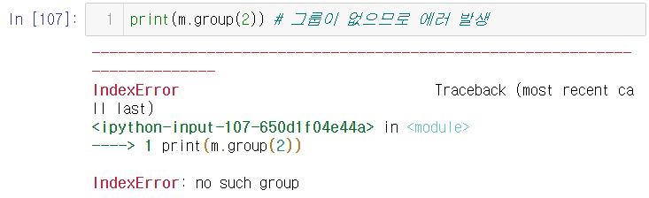

# 딥러닝을 위한 빅데이터 기초 - 데이터 모델링, SQL 응용 Day8


## 문제

- 최소의 동전을 사용하여 거스름돈 반환

1. 동전 종류 : 10, 50, 100
   - 120원 반환 : 10=12개/10=12개, 50=2개/100=1개, 10=2개/...
   - 정답 : 100원 1개, 10원 2개 => 3개
   - 임의의 금액 입력 -> 최소 개수 동전 -> 큰 단위 화폐부터 교환
2. 동전 종류 : 10, 60, 100
   - ex) 120원 반환 : 10=12개/60=2개/100=1개, 10원=2개/...
   - 정답 : 60원 2개 => 2개
   - solution : 완전탐색(backtracking(되추적), DP(동적계획법))

----

1.

- \[ \] : \[ \] 사이의 문자들과 매치, [A-K], [0-9], \[^0-9\]
  - 정규식 : [ABCDE]
  - 문자열 A : 매치, BLUE : 매치, DRY : 매치, SKY : 매치

2.

- \d <=> [0-9], \D <=> \[^0-9\]
- \w <=> \[a-zA-Z0-9\_\], \W <=> \[^a-zA-Z0-9\_\]

3.

- .(dot) : 모든 문자
  - 정규식 a.b <=> a+모든문자_1글자+b
  - 문자열 aab : 매치, abb : 매치, a0b : 매치
- \*(0번 이상 반복)
  - 정규식 : ca*t
  - 문자열 ct : 매치, cat : 매치, caaat : 매치
- +(1번 이상 반복)
  - 정규식 : ca+t
  - 문자열 ct : 매치X , cat : 매치. caaat : 매치
- {}(앞에 문자 반복 횟수 지정)
  - 정규식 : ca{2}t <=> c+a가\_반드시\_2번\_반복+t
  - 문자열 cat : 매치X, caat : 매치
  - 정규식 : ca{2,5}t <=> c+a가\_2~5번\_반복+t
  - 문자열 cat : 매치X, caat : 매치, caaaaat : 매치
- ? : 0또는 1개
  - 정규식 : ca?t <=> c+a(0\_또는\_1개)+t
  - 문자열 ct : 매치, cat : 매치, caat : 매치X


# 정규표현식

```python
import re
```
```python
print(re.match("[a-zA-Z]", "hellohi123"))
# > <re.Match object; span=(0, 1), match='h'>

print(re.match("[a-zA-Z]*", "hellohi123"))
# > <re.Match object; span=(0, 7), match='hellohi'>

print(re.match("[a-zA-Z]+", "hellohi123"))
# > <re.Match object; span=(0, 7), match='hellohi'>

print(re.match("[a-zA-Z0-9]+", "hellohi123"))
# > <re.Match object; span=(0, 10), match='hellohi123'>
```

```python
print(re.match("[가-핳]+", "반가워 안녕 ㅋㅋㅋ ㅎㅎ"))
# > <re.Match object; span=(0, 3), match='반가워'>

print(re.match("[가-핳]+", "반가워안녕ㅋㅋㅋㅎㅎ"))
# > <re.Match object; span=(0, 5), match='반가워안녕'>
```

- 대괄호 안에 ^가 있으면 not의 의미

```python
print(re.match("[^a-zA-Z]+", "hellohi123"))
# > None
```

- 대괄호 밖에 ^가 있으면 패턴문자로 시작한다는 의미

```python
print(re.match("^[a-zA-Z]+", "hellohi123"))
# > <re.Match object; span=(0, 7), match='hellohi'>

print(re.match("^[a-z]", "hello"))
# > <re.Match object; span=(0, 1), match='h'>
```

- 123 매치

```python
print(re.match("[0-9]+", "123abc456"))
# > <re.Match object; span=(0, 3), match='123'>

print(re.match("^[0-9]+", "123abc456"))
# > <re.Match object; span=(0, 3), match='123'>

print(re.match("[0-9]{3}", "123abc456"))
# > <re.Match object; span=(0, 3), match='123'>
```

- 456 매치
- match 함수는 왼쪽부터 확인하면서 다르면 바로 stop

```python
print(re.match("[0-9]+$", "123abc456"))
# > None
```

- search 함수는 문자열 전체를 확인하는데 사용

```python
print(re.search("[0-9]+$", "123abc456"))
# > <re.Match object; span=(6, 9), match='456'>

print(re.search("[0-9]{3}$", "123abc456"))
# > <re.Match object; span=(6, 9), match='456'>
```

- 특수문자는 앞에 역슬래쉬를 붙여야 함
- 수식에서 제곱(**)이 사용됐는지 여부 확인 방법

```python
print(re.match("[0-9]+\*+[0-9]+", "3**8")) # 3의 8승
# > <re.Match object; span=(0, 4), match='3**8'>

print(re.match("\*+", "3**8"))
# > None

print(re.search("\*+", "3**8"))
# > <re.Match object; span=(1, 3), match='**'>
```

- \D : 숫자가 아닌 모두

```python
print(re.match("\D+", "aB가10"))
# > <re.Match object; span=(0, 3), match='aB가'>
```

- \w : 숫자+문자+_

```python
print(re.match("\w+", "aB가10"))
# > <re.Match object; span=(0, 5), match='aB가10'>

print(re.match("\w+", "aB가_10"))
# > <re.Match object; span=(0, 6), match='aB가_10'>
```

- \W : mot (숫자+문자+_)

```python
print(re.match("\W+", "(#:)"))
# > <re.Match object; span=(0, 4), match='(#:)'>
```

- \s : whitespace 문자(\n, \r, \f, \t)
  - \r : print시 커서 맨 앞으로 위치시키기

```python
print(re.match("\s+", "test"))
# > None

print(re.match("\s+", " test"))
# > <re.Match object; span=(0, 1), match=' '>

print(re.match("\s+", "  test"))
# > <re.Match object; span=(0, 2), match='  '>
```

```python
print(re.match("[a-zA-Z0-9\s]+", " test HI 99 안녕"))
# > <re.Match object; span=(0, 12), match=' test HI 99 '>
```


# 정규식을 작성하는 일반적인 형식

1. 패턴을 저장(re.compile 함수)
2. 패턴을 사용하여 문자열 검색을 수행
   - match, search, findall, finditer 함수 사용


- match : 문자열의 처음부터 정규식과 매치되는지 조사
- search : 문자열 전체에 대해 정규식과 매치되는 조사
- findall : 정규식과 매치되는 모든 문자열을 리스트로 리턴
- finditer : 정규식과 매치되는 모든 문자열을 반복 가능한 객체로 리턴


## re.compile()

- re.compile() : 정규식을 저장 => 객체(패턴)

```python
pat = re.compile("[0-9]+")
pat.match("123")
# > <re.Match object; span=(0, 3), match='123'>

pat.match("abc") # match 되는 것이 없어 결과 값이 없다.

pat.match("12가나다")
# > <re.Match object; span=(0, 2), match='12'>
```


## match : 문자열의 처음부터 정규식과 매치

```python
p = re.compile("[a-z]+") # 패턴저장
m = p.match("python")
print(m)
# > <re.Match object; span=(0, 6), match='python'>

m = p.match(" python")
print(m)
# > None
```
```python
m = p.match(" python")
if m :
    print("매치됨")
else :
    print("매치안됨")
print(m)
# > 매치안됨
# > None

m = p.match("python")
if m :
    print("매치됨", m.group()) # 매치된 문자열 출력
else :
    print("매치안됨")
print(m)
# > 매치됨 python
# > <re.Match object; span=(0, 6), match='python'>
```


## search는 문자열 전체에 대해 검색

```python
m = p.search("python")
print(m)
# > <re.Match object; span=(0, 6), match='python'>

m = p.search("9 python 7 java")
print(m)
# > <re.Match object; span=(2, 8), match='python'>
```


## findall : 패턴과 일치하는 문자열들을 리스트로 리턴

```python
res = p.findall("Life is too short") # [a-z]+
print(res)
# > ['ife', 'is', 'too', 'short']
```


## finditer : 패턴과 일치하는 문자열들을 반복 가능한 객체로 리턴

```python
res = p.finditer("Life is too short") # [a-z]+
print(res)
# > <callable_iterator object at 0x000001ED2B7AD548>

for r in res :
    print(r)
# > <re.Match object; span=(1, 4), match='ife'>
# > <re.Match object; span=(5, 7), match='is'>
# > <re.Match object; span=(8, 11), match='too'>
# > <re.Match object; span=(12, 17), match='short'>
```

- group() : 매치 문자열
- start() : 매치 시작 위치
- end() : 매치 끝 위치
- span() : (시작, 끝)

```python
res = p.finditer("Life is too short")
for r in res :
    print(r.group()) # 매치 문자열
# > ife
# > is
# > too
# > short

res = p.finditer("Life is too short")
for r in res :
    print(r.start()) # 매치 시작 위치
# > 1
# > 5
# > 8
# > 12

res = p.finditer("Life is too short")
for r in res :
    print(r.end()) # 매치 끝 위치
# > 4
# > 7
# > 11
# > 17

res = p.finditer("Life is too short")
for r in res :
    print(r.span()) # (시작, 끝)
# > (1, 4)
# > (5, 7)
# > (8, 11)
# > (12, 17)
```

- 1과 2는 같은 의미 이다.

```python
# 1.
p = re.compile("[a-z]+")
m = p.match("multi")

# 2.
m = re.match("[a-z]+", "multi")
```

# 정규식 컴파일 옵션

- .은 '\n를 제외한' 모든 문자와 매치

```python
p = re.compile("a.b") # .은 '\n를 제외한' 모든 문자와 매치
m = p.match("acb")
print(m)
# > <re.Match object; span=(0, 3), match='acb'>

m = p.match("a\nb")
print(m)
# > None
```


## re.DOTALL 옵션

- re.DOTALL 옵션 : .을 사용할 때 \n 문자도 포함하고자 하는 경우

```python
p = re.compile("a.b", re.DOTALL)
m = p.match("a\nb")
print(m)
# > <re.Match object; span=(0, 3), match='a\nb'>
```


## re.I 옵션

- re.I 옵션 : I = ignorecase, 대소문자 구분없이 수행

```python
p = re.compile("[a-z]")
print(p.match("python"))
# > <re.Match object; span=(0, 1), match='p'>

p = re.compile("[a-z]")
print(p.match("Python"))
# > None

p = re.compile("[a-z]", re.I) # == [a-zA-Z]
print(p.match("Python"))
# > <re.Match object; span=(0, 1), match='P'>
```


## re.MULTILINE 옵션

- re.MULTILINE 옵션 : 문자열의 각 라인 단위로 정규식를 적용

```python
text = """python one
python two
you need python
"""
p = re.compile("^python\s\w+") # python시작+공백문자+아무문자
# ^를 문자열 전체의 처음에 대해서 적용
print(p.match(text))
# > <re.Match object; span=(0, 10), match='python one'>

print(p.search(text))
# > <re.Match object; span=(0, 10), match='python one'>

print(p.findall(text))
# > ['python one']
```

- 그런데, 내가 원하는 것은 문자열 전체가 아니라
- 문자열의 각 라인 단위로 정규식(^)를 적용 => MULTILINE 옵션

```python
p = re.compile("^python\s\w+", re.MULTILINE)
print(p.findall(text))
# > ['python one', 'python two']
```


## cf) | (bar) 메타문자

```python
pat = re.compile("Bye")
m = pat.match("ByeHello")
print(m)
# > <re.Match object; span=(0, 3), match='Bye'>

pat = re.compile("Bye|Hi")
m = pat.match("HiHello")
print(m)
# > <re.Match object; span=(0, 2), match='Hi'>

m = pat.match("Hello")
print(m)
# > None
```


## cf) ^, $ 메타문자

- Life로 시작하는 문자열 패턴식 지정

```python
print(re.search("^Life", "Life is too short"))
# > <re.Match object; span=(0, 4), match='Life'>
```

- short로 끝나는 문자열 패턴식 지정

```python
print(re.search("short$", "Life is too short"))
# > <re.Match object; span=(12, 17), match='short'>
```


# 그루핑

- 그루핑
  - 패턴식 내부에 괄호로 묶어서 표현
  - 괄호로 묶인 부분이 그룹이 됨

- xyz 문자열이 계속해서 반복되는지 확인 정규식

```python
# (xyz)+
pat = re.compile("(xyz)+")
m = pat.search("xyzxyzxyz ok")
print(m)
# > <re.Match object; span=(0, 9), match='xyzxyzxyz'>

print(m.group()) # 매칭된 문자열 확인
# > xyzxyzxyz
```

- 이름 번호(-연결)을 만족하는 문자열 추출하기

```python
"""
kim 010-2345-6789
hong 02-1234-5678
lee seoul
park 010 1234 5656
"""
```
```python
pat = re.compile("\w+")
m = pat.search("kim 010-2345-6789")
print(m)
# > <re.Match object; span=(0, 3), match='kim'>

pat = re.compile("\w+ ")
m = pat.search("kim 010-2345-6789")
print(m)
# > <re.Match object; span=(0, 4), match='kim '>

pat = re.compile("\w+\s")
m = pat.search("kim 010-2345-6789")
print(m)
# > <re.Match object; span=(0, 4), match='kim '>

pat = re.compile("\w+\s+")
m = pat.search("kim 010-2345-6789")
print(m)
# > <re.Match object; span=(0, 4), match='kim '>

pat = re.compile("\w+\s+\d+")
m = pat.search("kim 010-2345-6789")
print(m)
# > <re.Match object; span=(0, 7), match='kim 010'>

pat = re.compile("\w+\s+\d+[-]")
m = pat.search("kim 010-2345-6789")
print(m)
# > <re.Match object; span=(0, 8), match='kim 010-'>

pat = re.compile("\w+\s+\d+[-]\d+")
m = pat.search("kim 010-2345-6789")
print(m)
# > <re.Match object; span=(0, 12), match='kim 010-2345'>

pat = re.compile("\w+\s+\d+[-]\d+[-]")
m = pat.search("kim 010-2345-6789")
print(m)
# > <re.Match object; span=(0, 13), match='kim 010-2345-'>

pat = re.compile("\w+\s+\d+[-]\d+[-]\d+")
m = pat.search("kim 010-2345-6789")
print(m)
# > <re.Match object; span=(0, 17), match='kim 010-2345-6789'>
```

```python
pat = re.compile("\w+\s+\d+[-]\d+[-]\d+")
m = pat.search("hong 02-1234-5678")
print(m)
# > <re.Match object; span=(0, 17), match='hong 02-1234-5678'>

pat = re.compile("\w+\s+\d+[-]\d+[-]\d+")
m = pat.search("lee seoul")
print(m)
# > None

pat = re.compile("\w+\s+\d+[-]\d+[-]\d+")
m = pat.search("park 010 1234 5656")
print(m)
# > None
```

- () : 그루핑 기호

```python
# 이름 그루핑 (\w+)
pat = re.compile("(\w+)\s+\d+[-]\d+[-]\d+")
m = pat.search("kim 010-2345-6789")
print(m.group())
print(m.group(1)) # 첫번째 그룹에 해당되는 문자열

# > kim 010-2345-6789
# > kim

print(m.group(0)) # 매칭된 전체 문자열
# > kim 010-2345-6789

print(m.group(2)) # 그룹이 없으므로 에러 발생
```



```python
pat = re.compile("(\w+)\s+(\d+)[-](\d+)[-](\d+)")
m = pat.search("kim 010-2345-6789")
print(m.group(0))
print(m.group(1))
print(m.group(2))
print(m.group(3))
print(m.group(4))
# > kim 010-2345-6789
# > kim
# > 010
# > 2345
# > 6789
```

- 바깥쪽과 안쪽에 그루핑이 되어있는 경우 바깥쪽이 우선

```python
pat = re.compile("(\w+)\s+(\d+)[-]((\d+)[-](\d+))")
m = pat.search("kim 010-2345-6789")
print(m.group(0))
print(m.group(1))
print(m.group(2))
print(m.group(3))
print(m.group(4))
print(m.group(5))
# > kim 010-2345-6789
# > kim
# > 010
# > 2345-6789
# > 2345
# > 6789
```


## 이름부여

- 그루핑시 그룹단위로 이름을 부여 가능
- 그룹 이름 부여 : 형식 => (?P<그룹명>...)
- (\w+) => (?P<name>\w+)

```python
pat = re.compile("(?P<name>\w+)\s+(\d+)[-]((\d+)[-](\d+))")
m = pat.search("kim 010-2345-6789")
print(m.group(0))
print(m.group(1))
print(m.group("name"))
# > kim 010-2345-6789
# > kim
# > kim
```


- 텍스트 수집 -> 전처리
- -> 워드임베딩(숫자 변환(인코딩), ex.word to back)
- -> 얕은(깊은) 신경망(hidden layer 1개(얕은), 2개 이상(깊은))
- -> 모델링 -> 분류/예측 등 수행

# sub() : 치환 함수

```python
pat = re.compile("red")
pat.sub("color", "blue socks and red shoes")
# > 'blue socks and color shoes'
```

- pat.sub("바꿀문자열", "대상문자열")
- 해석 : 대상문자열에서 패턴이 발견되면 바꿀문자열로 변경해라

```python
# blue 또는 red는 모두 color로 변경하시오.
pat = re.compile("red|blue")
pat.sub("color", "blue socks and red shoes")
# > 'color socks and color shoes'
```

```python
# "You are dozing off. I'm also sleepy" 문자열에서
# "are" 패턴이 발견되면 "R"로 치환
pat = re.compile("are")
pat.sub("R", "You are dozing off. I'm also sleepy")
# > "You R dozing off. I'm also sleepy"
```

```python
# 우리나라, 한국, 코리아, 대한민국 => 대한민국
pat = re.compile("우리나라|한국|코리아|대한민국")
pat.sub("대한민국", "우리나라 좋은 나라 한국 코리아 대한민국")
# > '대한민국 좋은 나라 대한민국 대한민국 대한민국'
```

- 우리나라, 한국, 코리아, 대한민국 => 대한민국
  - `pat = re.compile("우리나라|한국|코리아|대한민국")`
  - `pat.sub("대한민국", "우리나라 좋은 나라 한국 코리아 대한민국")`
- 를 간단하게
- re.sub("패턴", "바꿀문자열", "문자열")

```python
print(re.sub("우리나라|한국|코리아|대한민국", "대한민국",
             "우리나라 좋은 나라 한국 코리아 대한민국"))
# > 대한민국 좋은 나라 대한민국 대한민국 대한민국
```


- "100 200" match

```python
g = re.match("\d+\s\d+", "100 200")
# g = re.match("[0-9]+ [0-9]+", "100 200")
# g = re.match("([0-9]+) ([0-9]+)", "100 200")
# g = re.match("\d+ \d+", "100 200")
print(g)
# > <re.Match object; span=(0, 7), match='100 200'>
```


- 함수에서 '이름', '인수' 추출하는 패턴식
- ex)
  - 함수 구문 : sumPrice(50)
  - 함수 명 : sumPrice, 인수 : 50

```python
g = re.match("(?P<func>[a-zA-Z]+)\((?P<arg>\d+)\)", "sumPrice(50)")
print(g.group("func")) #sumPrice
print(g.group("arg")) #50
# > sumPrice
# > 50
```

- 함수명
  - 첫번째 글자는 반드시 소문자로 시작
  - 두번째 글자부터는 소/대문자,숫자,_ 올 수 있음

```python
g = re.match("(?P<func>[a-z][a-zA-Z0-9_]+)\((?P<arg>\d+)\)", "sumPrice(50)")
print(g.group("func")) #sumPrice
print(g.group("arg")) #50
# > sumPrice
# > 50
```


```python
print(re.findall("[0-9]+", "10 20 th 40"))
# > ['10', '20', '40']
```


- sub 함수와 그루핑을 활용하여
- park 010-1234-5678 => 010-1234-5678 park
- 문자열에서 패턴에 매칭되는 부분을 바꿀문자열로 변경

```python
p = re.compile("(?P<name>[a-z]+)\s(?P<number>\d+[-]\d+[-]\d+)")
# p = re.compile("(?P<name>\w+)\s+(?P<phone>(\d+)[-](\d+)[-](\d+))")
print(p.sub("\g<2> \g<1>", "park 010-1234-5678")) # \g : 그룹
# > 010-1234-5678 park
```


- sub의 바꿀문자열에 함수를 사용할수도 있다.

```python
def toHex(mat) :
    val = int(mat.group())
    return hex(val)

pat = re.compile("\d+")
pat.sub(toHex, "call 114, 99 for user code")
# > 'call 0x72, 0x63 for user code'
```


# 연습문제


## 1. 형식에 부합하도록 패턴식 정의

```python
emails = ['python@mail.example.com', 'python+kr@example.com',
          'python-dojang@example.co.kr', 'python_10@example.info', 
          'python.dojang@e-xample.com', # 올바른 형식
          '@example.com', 'python@example', 'python@example-com'] # 잘못된 형식
```

- 아이디(점포함)@도메인주소(점포함)(.com, .co.kr, .net)

### A.

```python
# 1. 형식에 부합하도록 패턴식 정의
emails = ['python@mail.example.com', 'python+kr@example.com',
          'python-dojang@example.co.kr', 'python_10@example.info',
          'python.dojang@e-xample.com', # 올바른 형식
          '@example.com', 'python@example', 'python@example-com']
#아이디(점포함)@도메인주소(점포함).com, .co.kr, .net
p = re.compile("[a-zA-Z0-9+-._]+[@][a-zA-Z0-9-]+[.][a-zA-Z0-9.]+")
for email in emails :
    print(p.match(email).group() if p.match(email) else "잘못된 형식")
```


## 2.토지 파일 전처리(정규식)

- 저자명 추출
- 편 제목 추출
  - ex) 제2편 제목 - 추적과 음모
- 각 편에 대한 장 구성 정보 출력
  - ex) 제 1편 - ??장으로 구성
- 인용부호(겹따옴표)로 묶여있는 대사만 추출->챗봇
  -  (토지/어린왕자 대사 추출)
- 치환(양반, 사람 => 사람)

### A.

```python
# 2.
# 도서 전체내용을 하나의 문자열로 읽기
with open('C:/Users/student/Desktop/Python/BEXX0003.txt',
          encoding = 'utf-16-le', mode = 'r') as book :
    lines = book.read() 
# 저자명 추출
# 저자명이 <author>과 </author> 사이에 있으므로 그루핑하여
# author 라는 변수에 저장하기
author = re.search("<author>(\w+)</author>", lines).group(1)
print(author)
# > 박경리
```

#### A1.

```python
# 편 제목 추출
# <head>를 기준으로 하고 제[0-9]편으로 편 제목 추출
# findall에서 그루핑을 이용하여 제목만 추출
head_com = re.compile("<head>(제[0-9]편[가-핳\s]+)")
heads = head_com.findall(lines)
print(heads)
# > ['제1편 어둠의 발소리', '제2편 추적과 음모']
```

#### A2.

```python
# 각 편에 대한 장 구성 정보 출력
# 제 1편과 제2편의 구간 찾기
heads_iter = head_com.finditer(lines)
start, end = list(), list() # 시작위치 끝위치 저장 list
for head in heads_iter : # 1편과 2편 위치 저장
    start.append(head.start())
    end.append(head.end())
# 소설의 마지막 위치를 의미하는 </body> 위치 찾아 저장
start.append(re.search("</tei.2>", lines).start())
end.append(re.search("</tei.2>", lines).end())

# 장 구성 정보를 알기 위한 컴파일 생성 후
# 1편과 2편에서 장 정보 찾아서 저장
middle_com = re.compile("<head>([0-9]+장)")
middle1 = middle_com.findall(lines[start[0]:end[1]])
middle2 = middle_com.findall(lines[start[1]:end[2]])

print("제 1편 - {}으로 구성".format(middle1[-1]))
print("제 2편 - {}으로 구성".format(middle2[-1]))
# > 제 1편 - 19장으로 구성
# > 제 2편 - 13장으로 구성
```

#### A3.

```python
# 인용부호(겹따옴표)로 묶여있는 대사만 추출 -> 챗봇
# "로 묶이고 한글로 시작하는 문장 추출을 위한 컴파일 생성 후 추출
con_com = re.compile("\"([가-핳].+)\"")
# "\"(.+?)\""도 가능
conversation = re.findall(con_com, lines)
print(conversation)
# > 대화내용들이 리스트 형태로 출력
# > ['쯔쯔…… 저 좋은 목청도 흙 속에서 썩을랑가?', '서서방이 죽으믄 자지러지는 상두가 못 들어서 서분을 기요.', '할망구 들을라? 들으믄 지랄할 기다.', '세상에 저리 신이 많으믄서 자게 마누라밖에 없는 줄 아니 그것이 보통 드문 일가?', '신주단지를 그리 위하까? 천생연분이지 머.', '소나아로 태이나가지고 남으 제집 한분 모르고 지내는 것도 벵신은 벵신이제?', '이 사람들아! 사랑도 품앗이라 안 하더나?', ...]
```

### cf) 게으른 수량자

- 게으른 수량자 : +?, *?, {n,}?
  - 패턴에 근접하는 최소한의 덩어리를 찾는 메타문자

#### A4.

```python
# 치환(양반, 사람 => 사람)
sub_com = re.compile("양반|사람") # 패턴 지정
# 토지 내 에서 패턴에 속하는 단어 "사람"으로 변경 후 re_lines에 저장
re_lines = sub_com.sub("사람", lines)

# 똑같은 파일 형식을 사용하고 파일이름 다르게 해서 저장
with open('C:/Users/student/Desktop/Python/BEXX0003_re.txt',
          encoding = 'utf-16-le', mode = 'w') as f :
    f.write(re_lines)
```


