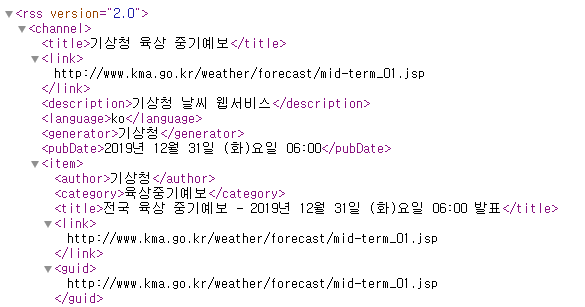
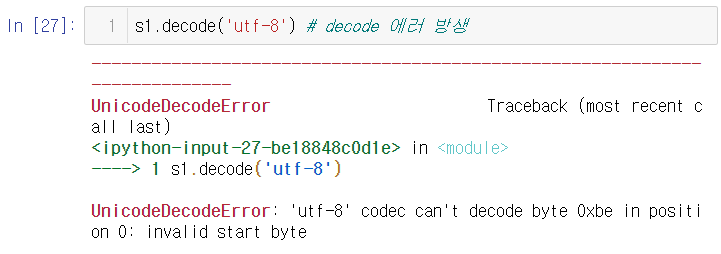

# Day9 딥러닝을 위한 빅데이터 기초 - 스크립핑(1)

# 스크립핑

- 데이트수집
  - DB(정형, formal data)에서 데이터 가져오기
  - 텍스트(비정형 데이터) 수집
- 파이썬 웹 데이터 추출
  - urllib 라이브러리(모듈 집합)
  - request 모듈(urllib.request)로 웹에 있는 데이터에 접근할 수 있음.
  - urlretrieve(retrieve:탐색) 함수를 이용하여 웹 파일을 다운로드 수행


- url과 저장경로 지정

```python
url = ("https://www.multicampus.com/img/saas/main/logo/CUS0001/pc_main.png")
savename = "test.png"
```

- 다운로드

```python
import urllib.request

# urllib.request.urlretrieve(url, 저장할이름) : 다운로드 -> 파일로 저장됨
urllib.request.urlretrieve(url, savename)
print("저장되었습니다.")
# > 저장되었습니다
```

- urlopen을 이용한 다운로드
  - 다운로드시 바로 파일로 저장되는 것이 아니라,
  - 데이터가 메모리에 적재

```python
mem = urllib.request.urlopen(url).read() # RAM에 저장
print(mem) # 이미지가 text 형태로 출력
# > b'\x89PNG\r\n\x1a\n\x00\x00\x00\rIHDR\x00\x00\x00\xb9\x00\x00\x00$\x08\x06\x00\x00\x00\xd5U\x9b\xc1\x00\x00\x00\tpHYs\x00\x00\x0b\x13\x00\x00\x0b\x13\x01\x00\x9a\x9c\x18\x00\x00\t\x1ciTXtXML:com.adobe.xmp\x00\x00\x00\x00\x00<?xpacket begin="\xef\xbb\xbf" id="W5M0MpCehiHzreSzNTczkc9d"?> <x:xmpmeta xmlns:x="adobe:ns:meta/" x:xmptk="Adobe XMP Core 5.6-c145 79.163499, 2018/08/13-16:40:22   ...
```

- 메모리에 있는 내용을 파일로 저장

```python
# 이미지파일이 바이너리 형식이라서 'wb'을 사용
savename = 'test2.png' 
with open(savename, mode = 'wb') as f :
    f.write(mem)
    print('저장되었습니다')
# > 저장되었습니다
```


## HTML

- html

  - 형식, 구조가 정해져 있지 않아
  - 컴퓨터가 웹에 구성된 정보를 이해하기 어려움
  - 과거부터 주류로 사용
  - 컴퓨터가 문서를 이해해야하는 측면에서는 불편함이 존재
  - 컴퓨터가 이해하기 좋게 하기위해 만들어진 형식이 xml

- HTML

  - `<p> 오늘의 날씨는 맑음입니다.</p>` => html 파일로 저장
- -> hosting 업체에 전달 -> domain주소와 html 파일을 연결
  - -> 사용자들이 domain주소로 들어가면 html파일을 제공
- HTML이 비구조적 문서


## xml

- 구조적 : 계단식으로 설계되어진 형식
- 연산량이 적어 효율 적이다.

- xml
  - <날씨>
    - <오늘>
      - 맑음
    - </오늘>
  - </날씨>(;태그)
- 사용자가 직접 태그를 설정하고, 구조적으로 작성하여야 한다.
- 요즘은 xml 뿐만아니라 json 파일도 많이 사용한다


## json

- json : 딕셔너리 자료구조로 구성
- {날씨:{오늘:맑음}}


## xml 살펴보기

- `https://www.weather.go.kr/weather/forecast/mid-term-rss3.jsp`



- `<rss version = "2.0">`
  - version 2.0이고
  - 갈색 글씨 version은 속성을 의미함.
- `<chanenel>` 등 보라색 글씨 = tag

- 주소 뒤에 `stnId = 숫자`를 입력하면 숫자에 해당하는 지역의 날씨 정보를 볼 수 있다.
  - 제주도 날씨 정보 : `https://www.weather.go.kr/weather/forecast/mid-term-rss3.jsp?stnId=184`
  - 전라도 날씨 정보 : `https://www.weather.go.kr/weather/forecast/mid-term-rss3.jsp?stnId=156`

## url

```python
import urllib.parse

addr = "https://www.weather.go.kr/weather/forecast/mid-term-rss3.jsp"
# 여러 지역을 한번에 불러오기 위해서 딕셔너리 형태로 구성하면
# 편리하게 사용할 수 있다.
# ex. {'stnId' : ('184', '156')}
values = {'stnId': '184'}

# 딕셔너리를 입력하면 url을 위한 방식으로 표현해줌
param = urllib.parse.urlencode(values)

addr
# > 'https://www.weather.go.kr/weather/forecast/mid-term-rss3.jsp'

values
# > {'stnId': '184'}

param
# > 'stnId=184'

addr+'?'+param
# > 'https://www.weather.go.kr/weather/forecast/mid-term-rss3.jsp?stnId=184'
```
```python
url = addr+'?'+param
url
# > 'https://www.weather.go.kr/weather/forecast/mid-term-rss3.jsp?stnId=184'

data = urllib.request.urlopen(url).read()
data
# > b'<?xml version="1.0" encoding="utf-8" ?>\r\n<rss version="2.0">\r\n<channel>\r\n<title>\xea\xb8\xb0\xec\x83\x81\xec\xb2\xad \xec\x9c\xa1\xec\x83\x81 ...
```

- decode() : 다른 형식의 데이터를 보기위한 함수

```python
text = data.decode('utf-8')
text
# > '<?xml version="1.0" encoding="utf-8" ?>\r\n<rss version="2.0">\r\n<channel>\r\n<title>기상청 육상 중기예보</title>\r\n<link>http://www.kma.go.kr/weather/forecast/mid-term_07.jsp</link>\r\n<description>기상청 날씨 웹서비스</description>\r\n<language>ko</language>\r\n<generator>기상청</generator>\r\n<pubDate>2019년 12월 31일 (화)요일 06:00</pubDate>\r\n <item>\r\n<author>기상청</author>\r\n<category>육상중기예보</category>\r\n<title>제주도 육상 중기예보 - 2019년 12월 31일 (화)요일 06:00 발표</title>\r\n ...
```


## 파이썬 문자열 인코딩

- 인코딩(encoding): 유니코드 -> 바이트 열

- 디코딩(decoding): 바이트 열 -> 유니코드


- 인코딩 : 문자 표현 -> 2진수 열(바이트 열)

- 인코딩방식 : ASCII, EUC-KR, CP949, ...


- 인코딩과 디코딩은 동일한 인코딩 방식을 사용하여야 한다.
  
- ex) 안녕 -> 통역(한영) -> hi -> 통역(프한) -> #?>..(글자가 깨짐)
  
-  인코딩 방식을 통일 하고자 유니코드(범용코드) 탄생
-   유니코딩(UTF-8, UTF-16, UTF-32,...)
-   중 UTF-8이 가장 일반적으로 사용됨
-   파이썬 문자열 자료형은 UTF-8

```python
text = "안녕" # 유니코드
len(text)
# > 2
```

- bytearray() : (유니코드 -> 바이트)방식 지정

```python
bytearray(text, 'cp949') #(8bit=1byte)*4
# > bytearray(b'\xbe\xc8\xb3\xe7')

l = bytearray(text, 'cp949') # 한글 한글자당 2byte
len(l)
# > 4

l = bytearray(text, 'utf-8') # 한글 한글자당 3byte
len(l)
# > 6

l
# > bytearray(b'\xec\x95\x88\xeb\x85\x95')
```

```python
test = "안녕하세요" # 인코딩 : 문자열 -> 바이트열
type(test)
# > str

test.encode('cp949')
# > b'\xbe\xc8\xb3\xe7\xc7\xcf\xbc\xbc\xbf\xe4'

s1 = test.encode('cp949') # cp949로 인코딩된 결과가 저장
print(type(s1))
print(len(s1))
# > <class 'bytes'>
# > 10

s2 = test.encode('euc-kr')
print(type(s2))
print(len(s2))
# > <class 'bytes'>
# > 10

s3 = test.encode('utf-8')
print(type(s3))
print(len(s3))
# > <class 'bytes'>
# > 15

s1.decode('cp949')
# > '안녕하세요'

s1.decode('euc-kr') # 같은 크기라서 제대로 된 결과가 나타남
# > '안녕하세요'

s1.decode('utf-8') # decode 에러 방생
```




# ---------------------------------

1. 스크리핑
   - 웹사이트에서 원하는 정보를 추출하는 것
   - 주의 사항
     - 불특정 사이트로부터 데이터를 추출하므로
     - 불법이 되지 않도록 조심해야 한다.
2. 로그인하여 로그인페이지에서 볼 수 있는 정보를 추출
   - 스크리핑을 막아놓은 사이트도 존재함
     - => 우회로 스크리핑 할 경우 불법

- 페이지에 따라 주소 일부가 변경되는 경우와
- 페이지가 바뀌어도 주소가 변경되지 않는 경우를 할 것
- 감성 분석 예정

## 데이터 수집 과정

1. 수집 대상 웹사이트에서 개발자 도구를 활용하여 
   스크랩 대상에 대한 선택자를 복사
2. 파이썬에서 urlretrieve, urlopen 등을 사용하여
   웹페이지를 가져온다.
3. 파서를 사용하여 파싱한다
   - 파싱(parsing) : 가져온 웹 문서에서 태그를 기준으로 원하는 데이터를 추출
4. 데이터에 대한 전처리를 수행
5. 모델링...

- 예
  - 위키피디아 윤동주 시인 데이터 수집
    - 1) 해당데이터 추출을 위한 고유의 이름
      - #mw-content-text > div > div:nth-child(77) > table > tbody > tr > td > ul 
  - 네이버 미국 환율
    - 1) #content > div.section_calculator > table:nth-child(4) > tbody > tr > td:nth-child(1)

```python
# 2)
import urllib.request as req
url = "https://finance.naver.com/marketindex/exchangeDetail.nhn?marketindexCd=FX_USDKRW"
res = req.urlopen(url)
print(res)
# > <http.client.HTTPResponse object at 0x000001E1D28D3F48>
```

```python
# 3)
from bs4 import BeautifulSoup
soup = BeautifulSoup(res, 'html.parser')
print(soup) # 해당 페이지에서 '페이지 소스 보기' 한 결과와 똑같이 출력
# > <script language="javascript" src="/template/head_js.nhn?referer=info.finance.naver.com&amp;menu=marketindex&amp;submenu=marketend"></script> ...

p = soup.select_one("#content > div.section_calculator > table:nth-child(4) > tbody > tr > td:nth-child(1)").string
print(p)
# > None

p = soup.select_one("#content > div.section_calculator > table:nth-child(4) > tbody > tr > td:nth-child(1)").text
print(p)
# > 1,156.50

# 다른 위치의 경우
p = soup.select_one("#content > div.spot > div.today > p.no_today").text
print(p)
# > 
# > 
# > 
# > 1,156.50
# > 
# > 
# > 원

```


# 연습문제

## 1.

- 다음(Daum)의 주가가 89,000원이고 네이버(Naver)의 주가가 751,000원이라고 가정하고, 어떤 사람이 다음 주식 100주와 네이버 주식 20주를 가지고 있을 때 그 사람이 가지고 있는 주식의 총액을 계산하는 프로그램을 작성하세요.

### A.

```python
# 1.
daum_stock_num = int(input("다음(Daum) 주식 보유량 : "))
daum_stock = int(input("다음(Daum) 주가 : "))
naver_stock_num = int(input("네이버(Naver) 주식 보유량 : "))
naver_stock = int(input("네이버(Naver) 주가 : "))

# 주식의 총액 계산 후 가독성을 위하여 formating
total = (daum_stock*daum_stock_num) + (naver_stock*naver_stock_num)

print("주식의 총액은 {:,}원 입니다.".format(total))
# > 다음(Daum) 주식 보유량 : 100
# > 다음(Daum) 주가 : 89000
# > 네이버(Naver) 주식 보유량 : 20
# > 네이버(Naver) 주가 : 751000
# > 주식의 총액은 23,920,000원 입니다.
```


## 2.

- 문제 1에서 구한 주식 총액에서 다음과 네이버의 주가가 각각 5%, 10% 하락한 경우에 손실액을 구하는 프로그램을 작성하세요.

### A.

```python
# 2.
daum_down = int(input("다음(Daum) 주가 하락율 : ").rstrip("%"))
naver_down = int(input("네이버(Naver) 주가 하락율 : ").rstrip("%"))

# 각 회사의 손실율
daum_loss = int(daum_stock*0.01*daum_down)
naver_loss = int(naver_stock*0.01*naver_down)

# 손실액 계산 후 가독성을 위하여 formating
loss_total = (daum_loss*daum_stock_num) + (naver_loss*naver_stock_num)

print("손실액은 {:,}원 입니다.".format(loss_total))
# > 다음(Daum) 주가 하락율 : 5
# > 네이버(Naver) 주가 하락율 : 10%
# > 손실액은 1,947,000원 입니다.
```


## 3.

- 우리나라는 섭씨 온도를 사용하는 반면 미국과 유럽은 화씨 온도를 주로 사용합니다. 화씨 온도(F)를 섭씨 온도(C)로 변환할 때는 다음과 같은 공식을 사용합니다. 
- 이 공식을 사용해 화씨 온도가 50일 때의 섭씨 온도를 계산해 보세요.
  - C = (F-32)/1.8

### A.

```python
# 3.
fah = float(input("화씨 온도 : "))

cel = (fah - 32) / 1.8

print("{0}°F 는 {1}°C 입니다.".format(fah, cel))
# > 화씨 온도 : 50
# > 50.0°F 는 10.0°C 입니다.
```


## 4.

- 문제 4 화면에 "pizza"를 10번 출력하는 프로그램을 작성하세요.

### A.

```python
# 4.
def rep_print(thing) : # 10번 출력을 위한 함수
    for i in range(10) :
        print(thing)
        
thing = input("10번 출력할 단어 : ")
rep_print(thing)
# > 10번 출력할 단어 : pizza
# > pizza
# > pizza
# > pizza
# > pizza
# > pizza
# > pizza
# > pizza
# > pizza
# > pizza
# > pizza
```


## 5.

- 월요일에 네이버의 주가가 100만 원으로 시작해 3일 연속으로 하한가(-30%)를 기록했을 때 수요일의 종가를 계산해 보세요.

### A.

```python
# 5.
mon = int(input("네이버 주식 월요일 시작 가격: "))
wen = round(mon*(0.7**3), 4)
print("네이버 주식 수요일 종가는 {:,}원 입니다.".format(wen))
# > 네이버 주식 월요일 시작 가격: 1000000
# > 네이버 주식 수요일 종가는 343,000.0원 입니다.
```


## 6.

- 다음 형식과 같이 이름, 생년월일, 주민등록번호를 출력하는 프로그램을 작성해 보세요. 이름: 파이썬 생년월일: 2014년 12월 12일 주민등록번호: 20141212-1623210

### A.

```python
# 6.
def formating(name, birth, own_id) : 
    print("이름: {0} 생년월일: {1} 주민등록번호: {2}".format(name, birth, own_id))

name = input("이름 : ")
birth = input("생년월일 : ")
own_id = input("주민등록번호 : ")

formating(name, birth, own_id)
# > 이름 : 파이썬
# > 생년월일 : 2014년 12월 12일
# > 주민등록번호 : 20141212-1623210
# > 이름: 파이썬 생년월일: 2014년 12월 12일 주민등록번호: 20141212-1623210
```


## 7.

- s라는 변수에 'Daum KaKao'라는 문자열이 바인딩돼 있다고 했을 때 문자열의 슬라이싱 기능과 연결하기를 이용해 s의 값을 'KaKao Daum'으로 변경해 보세요.

### A.

```python
# 7.
s = "Daum KaKao"

s_sp = s.split() # Daum과 KaKao로 분할
s_tr = list() # 순서 바꿔주기 위한 list
for i in range(len(s_sp)-1, -1, -1) : # 순서 바꿔서 입력하기
    s_tr.append(s_sp[i])
s_jo = ' '.join(s_tr) # KaKao와 Daum 연결하기
print(s_jo)
# > KaKao Daum
```


## 8.

- a라는 변수에 'hello world'라는 문자열이 바인딩돼 있다고 했을 때 a의 값을 'hi world'로 변경해 보세요.

### A.

```python
# 8.
a = "hello world"

import re
p = re.compile("hello")
print(p.sub("hi", a)) # hello를 hi로 변경하여 출력
# > hi world
```


## 9.

- x라는 변수에 'abcdef'라는 문자열이 바인딩돼 있다고 했을 때 x의 값을 'bcdefa'로 변경해 보세요.

### A.

```python
# 9.
x = 'abcdef'

import re
# 첫글자 그룹과 나머지 글자로 그룹 묶기
p = re.compile("([a-z])([a-z]+)")
print(p.sub("\g<2>\g<1>", x)) # 그룹 순서 바꿔서 출력
# > bcdefa
```


## 10.

- 2015년 9월 초의 네이버 종가는 표 3.2와 같습니다. 09/07의 종가를 리스트의 첫 번째 항목으로 입력해서 naver_closing_price라는 이름의 리스트를 만들어보세요.

- 네이버 종가
| 날짜  | 요일 | 종가    |
| ----- | ---- | ------- |
| 09/11 | 금   | 488,500 |
| 09/10 | 목   | 500,500 |
| 09/09 | 수   | 501,000 |
| 09/08 | 화   | 461,500 |
| 09/07 | 월   | 474,500 |

### A.

```python
# 10.
naver_closing_price = list() # 종가 입력받기 위한 list

for i in range(5) : # 09/07~09/11의 종가 입력 받기
    naver_closing_price.append(int(input("09/%02d 종가 : " %int(i+7))))

print(naver_closing_price)
# > 09/07 종가 : 474500
# > 09/08 종가 : 461500
# > 09/09 종가 : 501000
# > 09/10 종가 : 500500
# > 09/11 종가 : 488500
# > [474500, 461500, 501000, 500500, 488500]
```


## 11.

- 문제 10에서 만든 naver_closing_price를 이용해 해당 주에 종가를 기준으로 가장 높았던 가격을 출력하세요. (힌트: 리스트에서 최댓값을 찾는 함수는 max()이고, 화면에 출력하는 함수는 print()입니다.)

### A.

```python
# 11.
print(max(naver_closing_price))
# > 501000
```


## 12.

- 문제 10에서 만든 naver_closing_price를 이용해 해당 주에 종가를 기준으로 가장 낮았던 가격을 출력하세요. (힌트: 리스트에서 최솟값을 찾는 함수는 min()이고, 화면에 출력하는 함수는 print()입니다.)

### A.

```python
# 12.
print(min(naver_closing_price))
# > 461500
```


## 13.

- 문제 10에서 만든 naver_closing_price를 이용해 해당 주에서 가장 종가가 높았던 요일과 가장 종가가 낮았던 요일의 가격 차를 화면에 출력하세요.

### A.

```python
# 13.
week = ['월', '화', '수', '목', '금'] # 요일을 위한 list

# 최고가과 최저가인 요일
max_day = week[naver_closing_price.index(max(naver_closing_price))]
min_day = week[naver_closing_price.index(min(naver_closing_price))]

# 최고가와 최저가 차이
diff = int(max(naver_closing_price)) - int(min(naver_closing_price))

print("최고가는 {0}요일이고, 최저가는 {1}요일 입니다.".format(max_day, min_day))
print("최고가와 최저가의 차이는 {:,}원입니다.".format(diff))
# > 최고가는 수요일이고, 최저가는 화요일 입니다.
# > 최고가와 최저가의 차이는 39,500원입니다.
```


## 14.

- 문제 10에서 만든 naver_closing_price를 이용해 수요일의 종가를 화면에 출력하세요.

### A.

```python
# 14.
for day in week :
    if day == '수' :
        print("수요일 종가는 {:,}원 입니다.".format(naver_closing_price[week.index('수')]))
# > 수요일 종가는 501,000원 입니다.
```


## 15.

- 문제 10의 표 3.2를 이용해 날짜를 딕셔너리의 키 값으로, 종가를 딕셔너리의 값으로 사용해 naver_closing_price2라는 딕셔너리를 만드세요.

### A.

```python
# 15.
naver_closing_price2 = dict()

for i in range(5) : 
    naver_closing_price2["09/%02d" %int(i+7)] = naver_closing_price[i]

print(naver_closing_price2)
# > {'09/07': 474500, '09/08': 461500, '09/09': 501000, '09/10': 500500, '09/11': 488500}
```


## 16.

- 문제 15에서 만든 naver_closing_price2 딕셔너리를 이용해 09/09일의 종가를 출력하세요.

### A.

```python
# 16.
print('{:,}'.format(naver_closing_price2['09/09']))
# > 501,000
```


## 17.

- 중첩 루프를 이용해 신문 배달을 하는 프로그램을 작성하세요. 단, 아래에서 arrears 리스트는 신문 구독료가 미납된 세대에 대한 정보를 포함하고 있는데, 해당 세대에는 신문을 배달하지 않아야 합니다.
-  apart = [[101, 102, 103, 104],[201, 202, 203, 204],[301, 302, 303, 304], [401, 402, 403, 404]]
- arrears = [101, 203, 301, 404]

### A.

```python
# 17.
apart = [[101, 102, 103, 104],[201, 202, 203, 204],[301, 302, 303, 304], [401, 402, 403, 404]]
arrears = [101, 203, 301, 404]

for floor in apart :
    for house in floor :
        if house not in arrears :
            print("{}호 배달".format(house))
# > 102호 배달
# > 103호 배달
# > 104호 배달
# > 201호 배달
# > 202호 배달
# > 204호 배달
# > 302호 배달
# > 303호 배달
# > 304호 배달
# > 401호 배달
# > 402호 배달
# > 403호 배달
```


## 18.

- 두 개의 정수 값을 받아 두 값의 평균을 구하는 함수를 작성하세요.
- def myaverage(a, b):
  - 함수 구현

### A.

```python
# 18.
def myaverage(a,b) :
    return((a+b)/2)

a = int(input("a : "))
b = int(input("b : "))

print("평균 : {}".format(myaverage(a,b)))
# > a : 1
# > b : 2
# > 평균 : 1.5
```


## 19.

- 함수의 인자로 리스트를 받은 후 리스트 내에 있는 모든 정수 값에 대한 최댓값과 최솟값을 반환하는 함수를 작성하세요.
- def get_max_min(data_list):
  - 함수 구현

### A.

```python
# 19.
def get_max_min(data_list) :
    res = list() # max, min 저장할 list
    res.append(max(data_list))
    res.append(min(data_list))
    return(res)

data = input().split()
print(get_max_min(data))
# > 2 81 64 28 43 91
# > ['91', '2']
```


## 20.

- 절대 경로를 입력받은 후 해당 경로에 있는 *.txt 파일의 목록을 파이썬 리스트로 반환하는 함수를 작성하세요.
- def get_txt_list(path):
  - 함수 구현

### A.

```python
# 20.
def get_txt_list(path) :
    import glob
    f_list = glob.glob(path+'/*')
    f_list_txt = [f for f in f_list if f.endswith(".txt")]
    return f_list_txt

path = input("경로 : ")
for f in get_txt_list(path) :
    print(f)
```


## 21.

- 체질량 지수(BMI; Body Mass Index)는 인간의 비만도를 나타내는 지수로서 체중과 키의 관계로 아래의 수식을 통해 계산합니다. 여기서 중요한 점은 체중의 단위는 킬로그램(kg)이고 신장의 단위는 미터(m)라는 점입니다.
  - BMI=체중(kg)신장(m)2
- 일반적으로 BMI 값에 따라 다음과 같이 체형을 분류하고 있습니다.
  - BMI <18.5, 마른체형
  - 18.5 <= BMI < 25.0, 표준
  - 25.0 <= BMI < 30.0, 비만
  - BMI >= 30.0, 고도 비만
- 함수의 인자로 체중(kg)과 신장(cm)을 받은 후 BMI 값에 따라 ‘마른체형’, ‘표준’, ‘비만’, ‘고도 비만’ 중 하나를 출력하는 함수를 작성하세요.

### A.

```python
# 21.
def obesity(kg, m) :
    if m > 10 : m = m/100 # cm로 적는 사람을 고려하여 조정
    bmi = kg / (m**2)
    
    if bmi < 18.5 :
        return "마른체형"
    elif bmi < 25.0 :
        return "표준"
    elif bmi < 30.0 :
        return "비만"
    else :
        return "고도비만"

weight = float(input("몸무게(kg) : "))
height = float(input("키(m) : "))

print(obesity(weight, height))
```


## 22.

- 사용자로부터 키(cm)와 몸무게(kg)를 입력받은 후 BMI 값과 BMI 값에 따른 체형 정보를 화면에 출력하는 프로그램을 작성해 보세요. 파이썬에서 사용자 입력을 받을 때는 input 함수를 사용하며, 작성된 프로그램은 계속해서 사용자로부터 키와 몸무게를 입력받은 후 BMI 및 체형 정보를 출력해야 합니다(무한 루프 구조).

### A.

```python
# 22.
def isNumber(value) : # 숫자인가 판단하는 함수
    try :
        float(value)
        return True
    except ValueError :
        return False

def obesity() :
    print("몸무게와 키 둘 다에 'q'를 입력하면 종료 됩니다.")
    kg = input("몸무게(kg) : ")
    m = input("키(m) : ")
    if isNumber(kg) & isNumber(m) :
        kg = float(kg)
        m = float(m)
        
        if m > 10 : m = m/100 # cm로 적는 사람을 고려하여 조정
        bmi = kg / (m**2)
    
        if bmi < 18.5 :
            print("마른체형\n")
        elif bmi < 25.0 :
            print("표준\n")
        elif bmi < 30.0 :
            print("비만\n")
        else :
            print("고도비만\n")
        obesity()
        
    elif (kg == 'q') & (m == 'q') : # 종료
        return
        
    else :
        print("잘못 입력하셨습니다. 다시 입력해주세요\n")
        obesity()

obesity()
```


## 23.

- 삼각형의 밑변과 높이를 입력받은 후 삼각형의 면적을 계산하는 함수를 작성하세요.
- def get_triangle_area(width, height):
  - 함수 구현

### A.

```python
# 23.
def get_triangle_area(width, height):
    area = round(width*height/2, 2)
    if area == int(area) :
        area = int(area)
    return area

w = float(input("밑변 : "))
h = float(input("높이 : "))

print("삼각형의 면적 :", get_triangle_area(w, h))
# > 밑변 : 10
# > 높이 : 7
# > 삼각형의 면적 : 35
```


## 24.

- 함수의 인자로 시작과 끝을 나타내는 숫자를 받아 시작부터 끝까지의 모든 정수값의 합을 반환하는 함수를 작성하세요(시작값과 끝값을 포함).
- def add_start_to_end(start, end):
  - 함수 구현

### A.

```python
# 24.
def add_start_to_end(start, end) :
    res = 0
    for i in range(start, end+1) :
        res += i
    return res

start = int(input("시작 숫자 : "))
end = int(input("끝 숫자 : "))

print(add_start_to_end(start, end))
# > 시작 숫자 : 5
# > 끝 숫자 : 10
# > 45
```


## 25.

- 함수의 인자로 문자열을 포함하는 리스트가 입력될 때 각 문자열의 첫 세 글자로만 구성된 리스트를 반환하는 함수를 작성하세요. 예를 들어, 함수의 입력으로 ['Seoul', 'Daegu', 'Kwangju', 'Jeju']가 입력될 때 함수의 반환값은 ['Seo', 'Dae', 'Kwa', 'Jej']입니다.

### A.

```python
# 25.
def shorter(li) :
    res = list() # 결과값 저장을 위한 list
    for s in li :
        if s.isalpha() : # 문자열 판별함수
            s = s[:3]
        res.append(s)
    return res

print(shorter(['Seoul', 'Daegu', 'Kwangju', 'Jeju']))
# > ['Seo', 'Dae', 'Kwa', 'Jej']
```


# 보너스 문제(Baby-gin Game)

- 설명
  - 0~9 사이의 숫자 카드에서 임의의 카드 6장을 뽑았을 때
  - 3장의 카드가 연속적인 번호를 갖는 경우를 run이라 하고, 
  - 3장의 카드가 동일한 번호를 갖는 경우를 triplet이라고 한다.
  - 그리고, 6장의 카드가 run과 triplet로만 구성된 경우를 baby-gin으로 부른다.
  - 6자리의 숫자를 입력 받아 baby-gin 여부를 판단하는 프로그램을 작성하라.
- 입력 예
  - 667767은 두 개의 triplet이므로 baby-gin이다. (666, 777)
  - 054060은 한 개의 run과 한 개의 triplet이므로 역시 baby-gin이다. (456, 000)
  - 101123은 한 개의 triplet가 존재하나, 023이 run이 아니므로 baby-gin이 아니다. 
    - (123을 run으로 사용하더라도 011이 run이나 triplet가 아님)

## 힌트

- 계수정렬 참고
- 0으로 초기화한 길이 10인 리스트 생성
- 입력 숫자의 갯수를 카운트하여 리스트 위치에 입력
- if list[:] >= 3 than list[.] -= 3 # triplet
  - triplet += 1
  - 2번진행
- if 연속적인 3자리(a,b,c)가 1 이상이면 run than list[a:c+1] -= 1
  - run += 1
  - 2번 진행
- if triplet =2 or triplet=1, run=1 of run=2 than baby-gin

## A.

```python
import random

def baby_gin(rand_list) :
    count = [0]*10 # 0으로 초기화한 길이 10인 list
    for num in rand_list : # count 하여 해당 위치에 입력
        count[num] += 1
    
    # triplet 판별
    # 같은 번호 6개인 경우를 고려해 2번 실행
    for i in range(2) :
        count = list(map(lambda x: x-3 if x >= 3 else x, count))
        # triplet 해당시 count-3
        
    # run 판별
    # triplet 발견 여부에 따라 횟수 조정
    for i in range(int(sum(count)/3)) :
        try : # count가 1 or 2인 첫번째 index
            index = count.index(1)
        except ValueError :
            index = count.index(2) # [4,5,6,4,5,6]인 경우 고려 

        # run 해당시 count-1
        if (0 not in count[index:index+3]) & (index <= 7) :
            for ind in range(index, index+3) :
                print(ind)
                count[ind] -= 1
    if sum(count) == 0 :
        return "Baby-gin"
    else : return "not Baby-gin"

random_list = list() # Baby-gin으로 판단되어질 list 생성
for i in range(6) : # 0~9사이의 6개 숫자 복원추출
    random_list.append(random.randrange(0, 10))
print(random_list) # 생성된 random list 출력
print(baby_gin(random_list)) # Baby-gin 여부 출력
# > [7, 3, 6, 9, 1, 6]
# > not Baby-gin
```

