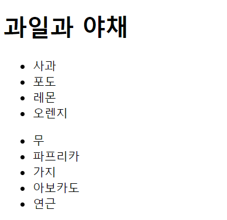

[toc]

# Day10딥러닝을 위한 빅데이터 기초 - 스크래핑 (2)

# Day9 연습문제 다르게 푸는 방법

- 4

```python
# 4.
print("pizza"*10) # or print("pizza\n"*10)
# > pizzapizzapizzapizzapizzapizzapizzapizzapizzapizza
```
- 5
```python
# 5.
# round(실수,n) : 반올림
# math.ceil(i) : 올림
# math.floor(i) : 내림
# tmathc.runc(i) : 버림
```
- 8
```python
# 8.
a = 'hello world'
ch = a.replace('hello', 'hi')
print(ch)
# > hi world
```
- 9
```python
# 9.
x = 'abcdef'
x = x[1:] + x[0]
print(x)
# > bcdefa
```
- 15
```python
# 15.
naver_closing_price2 = dict(zip(['09/07','09/08','09/09','09/10','09/11'], 
                                [474500, 461500, 501000, 500500, 488500]))
print(naver_closing_price2)
# > {'09/07': 474500, '09/08': 461500, '09/09': 501000, '09/10': 500500, '09/11': 488500}
```
- Baby-gin
```python
# Baby-gin
"""
계수정렬
정렬이 매우 빠르다는 장점이 있지만 숫자만 빠르다는 단점이 있다.
문자의 경우에는 '문자->숫자 => 정렬 => 숫자->문자'의 과정을 거친다.
(5,5,2,1,4,3)를 table로 변경하여 인덱스를 이용하여 정렬한다.
(5,5,2,1,4,1000)의 경우, 필요없는 인덱스를 필요로 하여 데이터를 많이
잡아먹게 된다는 단점이 존재하므로, 자료구조를 잘 살펴보고 사용하여야 한다.
"""
```


# 스크래핑

```python
from bs4 import BeautifulSoup

html = """
<html><body>
<h1>스크래핑</h1>
<p>웹 페이지 분석</p>
<p>원하는 부분 추출</p>
</body></html>
"""

# BeautifulSoup 객체 생성
soup = BeautifulSoup(html, 'html.parser') # BeautifulSoup(html주소, 분석종류)
# html 문서 분석
print(soup)
# > 
# > <html><body>
# > <h1>스크래핑</h1>
# > <p>웹 페이지 분석</p>
# > <p>원하는 부분 추출</p>
# > </body></html>
# > 
```
```python
print(soup.html)
# > <html><body>
# > <h1>스크래핑</h1>
# > <p>웹 페이지 분석</p>
# > <p>원하는 부분 추출</p>
# > </body></html>
```

```python
print(soup.html.body)
# > <body>
# > <h1>스크래핑</h1>
# > <p>웹 페이지 분석</p>
# > <p>원하는 부분 추출</p>
# > </body>
```

```python
print(soup.html.body.h1)
# > <h1>스크래핑</h1>
```

```python
print(soup.html.body.p) # 가장 처음으로 만나는 p태그만 출력
# > <p>웹 페이지 분석</p>
```

- 다음 p태그를 출력하기 위한 방법
- body태그 안에 있는 p태그 둘은 형제이다.

```python
p1 = soup.html.body.p
# 첫번째 p태그 -> 엔터문자 -> 두번째 p태그
print(p1.next_sibling)
# > 

print(p1.next_sibling.next_sibling)
# > <p>원하는 부분 추출</p>
```

```python
h1 = soup.html.body.h1
p2 = p1.next_sibling.next_sibling
print(h1)
print(p1)
print(p2)
# > <h1>스크래핑</h1>
# > <p>웹 페이지 분석</p>
# > <p>원하는 부분 추출</p>
```

- 태그 없이 출력하는 방법

```python
print(h1.string)
print(p1.string)
print(p2.string)
# > 스크래핑
# > 웹 페이지 분석
# > 원하는 부분 추출
```

- 형제 p태그가 많을경우 편리하게 접근하기
- find 함수 : id를 이용하여 직접 접근

```python
html = """
<html><body>
<h1 id="title">스크래핑</h1>
<p id="body">웹 페이지 분석</p>
<p>원하는 부분 추출</p>
</body></html>
"""

soup = BeautifulSoup(html, 'html.parser')
print(soup)
# > 
# > <html><body>
# > <h1 id="title">스크래핑</h1>
# > <p id="body">웹 페이지 분석</p>
# > <p>원하는 부분 추출</p>
# > </body></html>
# > 

print(soup.find(id="title"))
# > <h1 id="title">스크래핑</h1>

title = soup.find(id="title")
body = soup.find(id="body")
print("title="+title.string)
print("body="+body.string)
# > title=스크래핑
# > body=웹 페이지 분석
```

- find_all() : 여러 개의 태그를 한번에 추출

```python
html="""
<html><body>
<ul>
<li><a href="http://www.naver.com">naver</a></li>
<li><a href="http://www.daum.com">daum</a></li>
</ul>
</body></html>
"""
# <ul> : 순서가 없는 목록 <-> <ol> : 순서가 있는 목록
# a태그(anchor) : 하이퍼링크를 걸어주는 태그
# href 속성 : 연결할 주소를 지정 한다.

soup = BeautifulSoup(html, 'html.parser')
soup.find_all('a')
# > [<a href="http://www.naver.com">naver</a>,
# >  <a href="http://www.daum.com">daum</a>]

links = soup.find_all('a')
for a in links :
    href = a.attrs['href'] # a href에 대한 값이 출력
    print(href)
# > http://www.naver.com
# > http://www.daum.com
# 하이퍼링크로 클릭하면 해당사이트가 켜진다.

for a in links :
    href = a.attrs['href']
    text = a.string
    print(text, '->', href)
# > naver -> http://www.naver.com
# > daum -> http://www.daum.com
```

- a태그 안에 내가 원하는 속성이 있는지 확인

```python
print(soup)
# > 
# > <html><body>
# > <ul>
# > <li><a href="http://www.naver.com">naver</a></li>
# > <li><a href="http://www.daum.com">daum</a></li>
# > </ul>
# > </body></html>
# > 

for a in links :
    if 'href' in a.attrs :
        print("O")
# > O
# > O
```


## 기상 예보에서 특정 내용 추출

```python
import urllib.request as req

url = "https://www.weather.go.kr/weather/forecast/mid-term-rss3.jsp"
res = req.urlopen(url)
print(res)
# > <http.client.HTTPResponse at 0x2026380b8c8>
```

```python
soup = BeautifulSoup(res, 'html.parser')
print(soup)
# > <?xml version="1.0" encoding="utf-8" ?>
# > <rss version="2.0">
# > <channel>
# > <title>기상청 육상 중기예보</title> ...
```

- title 검색

```python
print(soup.find('title'))
# > <title>기상청 육상 중기예보</title>

print(soup.title) # 유일하면 바로 들어갈 수 있다.
# > <title>기상청 육상 중기예보</title>

print(soup.title.string)
# > 기상청 육상 중기예보
```

- wf 태그값 추출

```python
print(soup.wf)
# > <wf><![CDATA[기압골의 영향으로 6일부터 8일 사이에 전국에 비 또는 눈이 오겠고, 제주도는 10~11일에도 비가 오겠습니다. <br />한편, 동풍의 영향으로 9일은 강원영동에 비 또는 눈이 오겠습니다. ...

print(soup.find('wf').string)
# > 기압골의 영향으로 6일부터 8일 사이에 전국에 비 또는 눈이 오겠고, 제주도는 10~11일에도 비가 오겠습니다. <br />한편, 동풍의 영향으로 9일은 강원영동에 비 또는 눈이 오겠습니다. ...
```


## css 선택자 사용하기

- soup.select_one(선택자) : 선택자로 지정된 요소하나를 추출
- soup.select(선택자) : 선택자로 지정된 여러 개 요소를 추출
- 선택자 = 브라우저 개발자도구에서 객체선택 후 copy selector 사용

```python
html = """
<html>
    <body>
        <div id='myid'>
            <h1>2020년</h1>
            <ul class='day'>
                <li>월요일</li>
                <li>화요일</li>
                <li>수요일</li>
            </ul>
        </div>
    </body>
</html>
"""
```

```python
soup = BeautifulSoup(html, 'html.parser')
print(soup.select_one("div#myid")) # div태그가 여러 개일 경우
# > <div id="myid">
# > <h1>2020년</h1>
# > <ul class="day">
# > <li>월요일</li>
# > <li>화요일</li>
# > <li>수요일</li>
# > </ul>
# > </div>

print(soup.select_one("div#myid h1"))
# > <h1>2020년</h1>

print(soup.select_one("div#myid > h1"))
# > <h1>2020년</h1>
# 선택자 : div#myid > h1

print(soup.select_one("div#myid > h1").string)
# > 2020년

# 찾고자 하는 태그가 하나만 있을 경우
print(soup.select_one("h1")) 
# > <h1>2020년</h1>
```

```python
print(soup.select_one("div#myid ul"))
# print(soup.select_one("div#myid > ul"))
# > <ul class="day">
# > <li>월요일</li>
# > <li>화요일</li>
# > <li>수요일</li>
# > </ul>

print(soup.select_one("div#myid > ul.day"))
# > <ul class="day">
# > <li>월요일</li>
# > <li>화요일</li>
# > <li>수요일</li>
# > </ul>

print(soup.select_one("div#myid > ul.day > li"))
# > <li>월요일</li>

print(soup.select("div#myid > ul.day > li"))
# > [<li>월요일</li>, <li>화요일</li>, <li>수요일</li>]

myList = soup.select("div#myid > ul.day > li")
for a in myList :
    print(a.string)
# > 월요일
# > 화요일
# > 수요일
```


## yahoo finance에서 삼성전자 주가

```python
url = 'https://finance.yahoo.com/quote/005930.KS?p=005930.KS&.tsrc=fin-srch'
res = req.urlopen(url)
samsung = BeautifulSoup(res, 'html.parser')
print(samsung.select_one('#quote-header-info > div.My\(6px\).Pos\(r\).smartphone_Mt\(6px\) > div > span').string)
# > 55,300.00
```

```python
# 선택자 찾는 과정
samsung.select_one("#quote-header-info")
# > <div class="quote-header-section Cf Pos(r) Mb(5px) Maw($maxModuleWidth) Miw($minGridWidth) smartphone_Miw(ini) Miw(ini)!--tab768 Miw(ini)!--tab1024 Mstart(a) Mend(a) Px(20px) smartphone_Pb(0px) ...

samsung.select("#quote-header-info > div")
# > [<div class="W(100%) Bdts(s) Bdtw(7px) Bdtc($negativeColor)" data-reactid="3"></div>,
# >  <div class="Mt(15px)" data-reactid="4"><div class="D(ib) Mt(-5px) Mend(20px) Maw(56%)--tab768 Maw(52%) Ov(h) smartphone_Maw(85%) ...

samsung.select("#quote-header-info > div")[2]
# > <div class="My(6px) Pos(r) smartphone_Mt(6px)" data-reactid="12"><div class="" data-reactid="13"><span class="Trsdu(0.3s) Trsdu(0.3s) Fw(b) Fz(36px) Mb(-4px) D(b)" data-reactid="14">55,300.00 ...

soup = samsung.select("#quote-header-info > div")[2]
soup.select_one("div")
# > <div class="" data-reactid="13"><span class="Trsdu(0.3s) Trsdu(0.3s) Fw(b) Fz(36px) Mb(-4px) D(b)" data-reactid="14">55,300.00</span> ...

soup.select_one("div > span")
# > <span class="Trsdu(0.3s) Trsdu(0.3s) Fw(b) Fz(36px) Mb(-4px) D(b)" data-reactid="14">55,300.00</span>

soup.select_one("div > span").string
# > '55,300.00'
```


## 위키문헌에서 윤동주 시인의 저작 추출하기

```python
url = 'https://ko.wikisource.org/wiki/%EC%A0%80%EC%9E%90:%EC%9C%A4%EB%8F%99%EC%A3%BC'
res = req.urlopen(url)
soup = BeautifulSoup(res, 'html.parser')
poem = list() # 윤동주 시인 저작 저장 list

# '하늘과 바람과 별과 시'에 수록된 시
for i in range(1,20) :
    poem.append(soup.select_one("#mw-content-text > div > ul:nth-child(6) > li > ul > li:nth-child({}) > a".format(i)).string)
# div > ul:nth-child(6) => 해당 div의 6번째 ul이다는 의미

# '하늘과 바람과 별과 시'에  수록되지 않은 시
for i in range(7,10) :
    li = soup.select("#mw-content-text > div > ul:nth-child({}) > li".format(i))
    for po in li :
        poem.append(po.string)

print(poem)
# > ['서시', '자화상', '소년', '눈 오는 지도', '돌아와 보는 밤', '병원', '새로운 길', '간판 없는 거리', '태초의 아침', '또 태초의 아침', '새벽이 올 때까지', '무서운 시간', '십자가', '바람이 불어', '슬픈 족속', '눈감고 간다', '또 다른 고향', '길', '별 헤는 밤', '흰 그림자', '사랑스런 추억', '흐르는 거리', '쉽게 씌어진 시', '봄', '참회록', '간(肝)', '위로', '팔복', '못자는밤', '달같이', '고추밭', '아우의 인상화', '사랑의 전당', '이적', '비오는 밤', '산골물', '유언', '창', '바다', '비로봉', '산협의 오후', '명상', '소낙비', '한난계', '풍경', '달밤', '장', '밤', '황혼이 바다가 되어', '아침', '빨래', '꿈은 깨어지고', '산림', '이런날', '산상', '양지쪽', '닭', '가슴 1', '가슴 2', '비둘기', '황혼', '남쪽 하늘', '창공', '거리에서', '삶과 죽음', '초한대', '산울림', '해바라기 얼굴', '귀뚜라미와 나와', '애기의 새벽', '햇빛·바람', '반디불', '둘 다', '거짓부리', '눈', '참새', '버선본', '편지', '봄', '무얼 먹구 사나', '굴뚝', '햇비', '빗자루', '기왓장 내외', '오줌싸개 지도', '병아리', '조개껍질', '겨울']
```


## 여러가지 방법을 사용하여 추출하기

```python
html = """
<ul id='language'>
    <li id='bas'>Basic</li>
    <li id='cpp'>c++</li>
    <li id='ja'>Java</li>
    <li id='py'>Python</li>
    <li id='sp'>Spark</li>
</ul>
"""

sel = BeautifulSoup(html, 'html.parser')
print(sel)
# > 
# > <ul id="language">
# > <li id="bas">Basic</li>
# > <li id="cpp">c++</li>
# > <li id="ja">Java</li>
# > <li id="py">Python</li>
# > <li id="sp">Spark</li>
# > </ul>
# > 

print(sel.select_one("#py").string)
# > Python
```

```python
myfunc = lambda arg : print(sel.select_one(arg).string)
myfunc("#py")
# > Python

myfunc("li#py")
# > Python

myfunc("ul > li#py")
# > Python

myfunc("#language #py")
# > Python

myfunc("#language > #py")
# > Python

myfunc("ul#language > li#py")
# > Python

myfunc("li[id='py']")
# > Python

myfunc("li:nth-of-type(4)")
# > Python

print(sel.select("li"))
# > [<li id="bas">Basic</li>, <li id="cpp">c++</li>, <li id="ja">Java</li>, <li id="py">Python</li>, <li id="sp">Spark</li>]

print(sel.select("li")[3].string)
# > Python

sel.find_all("li")
# > [<li id="bas">Basic</li>,
# >  <li id="cpp">c++</li>,
# >  <li id="ja">Java</li>,
# >  <li id="py">Python</li>,
# >  <li id="sp">Spark</li>]

print(sel.find_all("li")[3].string)
# > Python
```

- id가 unique하지 않을수도 있으므로 조심히 사용하여야 한다.


## 직접 작성한 html으로 실습

- PyCharm 에서 'fru-veg.html' 파일 작성

```html
<!DOCTYPE html>
<html lang="en">
<head>
    <meta charset="UTF-8">
    <title>Title</title>
</head>
<body>
<div id="main-goods" role="page">
    <h1>과일과 야채</h1>
    <ul id="fr">
        <li class="red green" data-lo="ko">사과</li>
        <li class="purple" data-lo="us">포도</li>
        <li class="yellow" data-lo="us">레몬</li>
        <li class="yellow" data-lo="ko">오렌지</li>
    </ul>

    <ul id="ve">
        <li class="white green" data-lo="ko">무</li>
        <li class="red green" data-lo="us">파프리카</li>
        <li class="black" data-lo="ko">가지</li>
        <li class="black" data-lo="us">아보카도</li>
        <li class="white" data-lo="cn">연근</li>
    </ul>
</div>
</body>
</html>
```

- html



- 작성한 파일을 Jupyter Notemook 실행 폴더로 복사 붙여넣기

- Jupyter Notebook

```python
fp = open("fru-veg.html", encoding="utf-8")
fp
# > <_io.TextIOWrapper name='fru-veg.html' mode='r' encoding='utf-8'>

soup = BeautifulSoup(fp, 'html.parser')
soup
# > <!DOCTYPE html>
# > 
# > <html lang="en">
# > <head>
# > <meta charset="utf-8"/>
# > <title>Title</title>
# > </head>
# > <body>
# > <div id="main-goods" role="page">
# > <h1>과일과 야채</h1>
# > <ul id="fr">
# > <li class="red green" data-lo="ko">사과</li>
# > <li class="purple" data-lo="us">포도</li>
# > <li class="yellow" data-lo="us">레몬</li>
# > <li class="yellow" data-lo="ko">오렌지</li>
# > </ul>
# > <ul id="ve">
# > <li class="white green" data-lo="ko">무</li>
# > <li class="red green" data-lo="us">파프리카</li>
# > <li class="black" data-lo="ko">가지</li>
# > <li class="black" data-lo="us">아보카도</li>
# > <li class="white" data-lo="cn">연근</li>
# > </ul>
# > </div>
# > </body>
# > </html>
```

- 아보카도 추출하기
- css 선택자

```python
print(soup.select_one("#ve > li:nth-of-type(4)").string)
# > 아보카도

print(soup.select("#ve > li[data-lo='us']")[1].string)
# > 아보카도

print(soup.select("#ve > li.black")[1].string)
# > 아보카도
```

- find 메서드

```python
cond = { 'data-lo':'us', 'class':'black'}
print(soup.find("li", cond).string)
# > 아보카도

print(soup.find(id="ve").find("li", cond).string)
# > 아보카도
```


## 정규표현식과 함께 데이터 추출

```python
html = """
<li><a href="test.html">test</li>
<li><a href="https://test.html">test2</li>
<li><a href="https://test.html">test3</li>
<li><a href="http://test.html">test4</li>
"""
```

```python
soup = BeautifulSoup(html, 'html.parser')
soup.find_all("a")
# > [<a href="test.html">test</a>,
# >  <a href="https://test.html">test2</a>,
# >  <a href="https://test.html">test3</a>,
# >  <a href="http://test.html">test4</a>]

import re
li = soup.find_all(href=re.compile("https://"))
print(li)
# > [<a href="https://test.html">test2</a>, <a href="https://test.html">test3</a>]
```


# 연습문제

## 1.

- 다음의 조건을 만족하는 Point라는 클래스를 작성하세요.

- Point 클래스는 생성자(__init__)를 통해 (x, y) 좌표를 입력받는다.
- setx(x), sety(y) 메서드를 통해 x 좌표와 y 좌표를 따로 입력받을 수도 있다.
- get() 메서드를 호출하면 튜플로 구성된 (x, y) 좌표를 반환한다.
- move(dx, dy) 메서드는 현재 좌표를 dx, dy만큼 이동시킨다.
- 모든 메서드는 인스턴스 메서드다.

### A.

```python
# 1.
class Point :
    def __init__(self, x=None, y=None) :
        if x == None or y == None :
            if x == None :
                # class내부에 있는 함수를 호출하므로 앞에 self.를 붙여준다
                self.setx(x) 
            if y == None :
                self.sety(y)
        else :
            self.x = x
            self.y = y
    def setx(self, x) :
        self.x = int(input("x좌표를 입력해 주세요 : "))
        return
    def sety(self, y) :
        self.y = int(input("y좌표를 입력해 주세요 : "))
        return
    def get(self) : 
        print((self.x, self.y))
    def move(self, dx, dy) :
        self.x += dx
        self.y += dy
```


## 2.

- 문제 1에서 생성한 Point 클래스에 대한 인스턴스를 생성한 후 4개의 메서드를 사용하는 코드를 작성하세요.
- p=Point(3,2)
- p.get()
- ...
- p.move(-3,-2) => 0,0

### A.

```python
# 2.
p1 = Point()
p1.get()
print("-------")
p2 = Point(3,2)
p2.get()
p2.move(-3,-2)
p2.get()
```


## 3.

- 1부터 10까지의 숫자를 각 라인 단위로 파일에 출력하는 프로그램을 작성하세요.
- 생성되는 파일의 이름은 number.txt 이다.

### A.

```python
# 3.
def txt_wr() :
    f = open('number.txt', 'w')
    for i in range(1,11) :
        f.write(str(i)+"\n")
    f.close()
txt_wr()
```


## 4.

- 사용자에게 경로를 입력받은 후 해당 경로에 있는 디렉터리와 파일 목록을 flist.txt라는 파일로 출력하는 함수를 작성하세요.

### A.

```python
# 4.
def path_file(path) :
    import glob
    f_list = glob.glob(path+'/*')
    f = open('filst.txt', encoding = 'utf-8', mode = 'w')
    for file in f_list :
        f.write(file + '\n')
    f.close()
path_file('C:/Users/student/Desktop/Python')
```


## 5.

- 윤동주 시인 방송 출연 년월일 추출(화요일 수업내용 중)

### A.

```python
# 5.
import re

url = 'https://ko.wikipedia.org/wiki/%EC%9C%A4%EB%8F%99%EC%A3%BC'
res = req.urlopen(url)
soup = BeautifulSoup(res, 'html.parser')

broadcast = list() # 관련된 방송 날짜 입력 list

for i in range(1,9) :
    tmp = soup.select('#mw-content-text > div > ul:nth-child(71) > li:nth-child({})'.format(i))[0].text
    if i == 5 : p = re.compile("[0-9]+년 [0-9\~]+월")
    else : p = re.compile("[0-9]+년 [0-9]+월 [0-9]+일")
    day = p.findall(tmp)
    for i in range(len(day)) :
        broadcast.append(day[i])

print(broadcast)
# > ['1984년 12월 22일', '1988년 3월 1일', '1995년 3월 11일', '2006년 7월 31일', '2006년 8월 7일', '2008년 6~7월', '2009년 8월 15일', '2011년 11월 4일', '2016년 3월 6일']
```


## 6.

- 영문, 숫자 포함하여 특수문자 모두 제거(오늘 수업내용 중)
- res=req.urlopen(url)
- soup=BeautifulSoup(res, 'html.parser')
- #soup.title.string
- title=soup.find("title").string
- #wf태그값 추출
- soup.find('wf').string

### A.

```python
# 6.
import urllib.request as req
url = "https://www.weather.go.kr/weather/forecast/mid-term-rss3.jsp"
res = req.urlopen(url)
soup = BeautifulSoup(res, 'html.parser')
quest = soup.find('wf').string
quest = str(quest)
p = re.compile("[^가-핳]")
res = p.sub("", quest)
print(res)
# > 기압골의영으로일부터일사이에전국에비또는눈이오겠고제주도는일에도비가오겠습니다한편동풍의영으로일은강원영동에비또는눈이오겠습니다그밖의날은고기압의가장자리에들어가끔구름많겠습니다기온은평년최저기온최고기온보다높겠습니다강수량은평년보다많겠습니다
```

