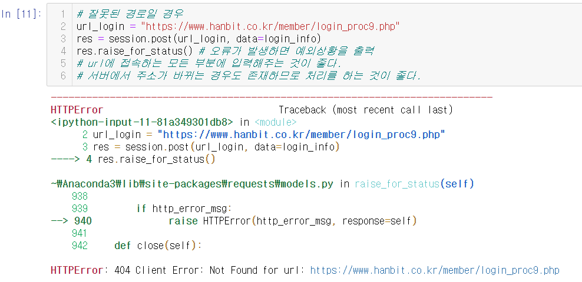
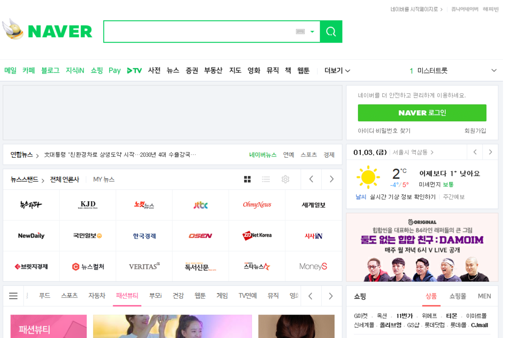

[toc]

# Day11 딥러닝을 위한 빅데이터 기초 - 스크래핑 (3)

- class 개념 다시 설명

```python
"""
class 붕어빵기계 :
    def __init__(self, 내용물, 반죽) :
        self.내용물 = 내용물
        self.반죽 = 반죽
    def 굽는다(self, 시간, 방법) :
        self.시간 = 시간
        slef.방법 = 방법

붕1 = 붕어빵기계(단팥, 밀가루) => 밀가루 단팥붕어빵
붕2 = 붕어빵기계(크림, 밀가루) => 밀가루 크림붕어빵
붕3 = 붕어빵기계(크림, 쌀가루) => 쌀가루 크림붕어빵

붕1.굽는다(1분, 중간불)
붕2.굽는다(30초, 쎈불)
붕3.굽는다(2분, 약한불)
"""
```


# 로그인이 필요한 스크래핑

- 한빛출판네트워크(http://www.hanbit.co.kr/index.html) 가입

1. 클 : www.hanbit.co.kr 입력
2. 서 : http://www.hanbit.co.kr/index.html을 클에게 전달(정상신호 : 200, 주소잘못입력 : 40x, 서버내부오류 : 50x 도 같이 전달)
3. 클 : 웹브라우저가 http://www.hanbit.co.kr/index.html 해석 => 결과 화면 출력

- 초기화면 : http://www.hanbit.co.kr/index.html)
- 로그인 : https://www.hanbit.co.kr/member/login.html
- m_id : ID, m_passwd : Password 전달한 후 로그인 처리(login_proc.php)
- => 처리 결과 : 로그인 성공, 실패
- 사용자페이지 http://www.hanbit.co.kr/myhanbit/myhanbit.html

- **로그인 하는 방법을 알기 위하여**

> 개발자도구 -> Network -> Doc -> Preserve log 체크
>
> > => 내가 이동-한 페이지와 상태롤 차례대로 저장해준다.
>
>  -> 로그인 -> login_proc.php선택 -> Header
>
> > Request Method
> >
> > - POST(id와 비번이 나타나지 않음)
> > - GET(나타남, 속도가 빠름)
> >
> > 제일 밑에 보면 ID, Password이 보인다.

- **로그인을 하기 위한 모듈**

```python
import requests
from bs4 import BeautifulSoup 
```

```python
USER = "아이디"
PASS = "비밀번호"
```

- **세션 시작하기(requests 모듈 사용)**
  - 세션 : 서버와 클러이언트 간 연결

```python
session = requests.session() # 세션을 시작하게 해주는 함수(=승차권)
```

- 인증작업필요(id, password)
  - 인증 : id와 password가 일치하는가 확인
  - 인가 : 권한 설정
- login을 위한 딕셔너리 생성

```python
login_info = {"m_id" : USER, "m_passwd" : PASS}
```

```python
url_login = "https://www.hanbit.co.kr/member/login_proc.php"
session.post(url_login) # url_login으로 이동
# > <Response [200]>

res = session.post(url_login, data=login_info) # 로그인 처리
print(res)
# > <Response [200]>
```

- **사용자 페이지로 이동**

```python
res = session.get("http://www.hanbit.co.kr/myhanbit/myhanbit.html")
print(res)
# > <Response [200]>
```

- **한빛 마일리지와 한빛이코인 정보 가져오기**

```python
soup = BeautifulSoup(res.text, "html.parser")
mileage = soup.select_one("#container > div > div.sm_mymileage > dl.mileage_section1 > dd").get_text()
ecoin = soup.select_one("#container > div > div.sm_mymileage > dl.mileage_section2 > dd > span").get_text()
print("마일리지 :", mileage)
print("이코인 :", ecoin)
# > 마일리지 : 2,000 점
# > 이코인 : 0
```

- **잘못된 경로일 경우**

```python
url_login = "https://www.hanbit.co.kr/member/login_proc9.php"
res = session.post(url_login, data=login_info)
res.raise_for_status() # 오류가 발생하면 예외상황을 출력
# url에 접속하는 모든 부분에 입력해주는 것이 좋다.
# 서버에서 주소가 바뀌는 경우도 존재하므로 처리를 하는 것이 좋다.
# > Error 발생
```




# 웹 브라우저를 이용한 스크래핑

- request 모듈 : html형식의 경우 주로 사용, java형식의 경우 어려움
- Selenium : 웹 브라우저를 조작(스크래핑) 도구
- Phantomjs : 화면없이 명령줄에서 이용할 수 있는 웹 브라우저

- **Selenum 설치**

  1. 아나콘다 프롬프트 : pip install selenium

   - 자동으로 url열기, 클릭, 스크롤, 문자 입력 가능, 화면 캡쳐 등(일종의 자동화 도구)

- **Phantomjs 설치**

  1. https://phantomjs.org/download.html 이동 및 다운로드
  2. path 지정하기
      - PhantomJS가 설치된 경로를 고급설정->path에 추가(또는 기존 path 경로에다가 phantomjs.exe파일을 복사할것)
      - 기존 path 경로 : 파일 탐색기 -> 내PC 속성 -> 고급시스템 속성 -> 환경변수 -> 시스템 변수 : Path 더블클릭 -> Path 중 한곳에 phantomjs.exe 파일 붙여넣기
      - 새로운 path 추가 : 시스템 변수 : Path 더블클릭 -> 추가 -> `C:\Users\student\Downloads\phantomjs-2.1.1-windows\phantomjs-2.1.1-windows\bin`

  3. 크롬 드라이버 설치(첨부파일)

- Phantomjs를 이용하여 사이트 탐색(이동), Selenium을 이용하여 해당 사이트에서 자동으로 url 열기, 클릭, 스크롤, 문자 입력, 화면 캡쳐 등의 작업을 수행
- 환경변수
  - a폴더 : abc.exe
  - b폴더에서 abd를 실행하면 -> 안됨
  - => a폴더를 Path에 추가하면 다른 경로에서도 a폴더에 있는 파일을 실행 가능

```python
from selenium import webdriver
url = "http://www.naver.com"
# phantomjs 드라이버 추출
browser = webdriver.PhantomJS()
# 3초 대기
browser.implicitly_wait(3)
# url 읽기
browser.get(url)
# 화면 캡쳐
browser.save_screenshot("myshot.png")
# 브라우저 종료
browser.quit()
# > C:\Users\student\Anaconda3\lib\site-packages\selenium\webdriver\phantomjs\webdriver.py:49: UserWarning: Selenium support for PhantomJS has been deprecated, please use headless versions of Chrome or Firefox instead
# >  warnings.warn('Selenium support for PhantomJS has been deprecated, please use headless '
```

- myshot.png 생성




# rottentomatoes에서 TOP BOX OFFICE 스크래핑

```python
import urllib.request as req
page = req.urlopen("https://www.rottentomatoes.com/")
page
# > <http.client.HTTPResponse at 0x2887bd5da88>

doc = page.read()
doc
# > b'<!DOCTYPE html>\n<html lang="en"\n      dir="ltr"\n      xmlns:fb="http://www.facebook.com/2008/fbml"\n      xmlns:og="http://opengraphprotocol.org/schema/">\n\n    <head prefix="og: http://ogp.me/ns# flixstertomatoes: http://ogp.me/ns/apps/flixstertomatoes#">\n\n ...

soup = BeautifulSoup(doc, 'html.parser')
soup
# > <!DOCTYPE html>
# > 
# > <html dir="ltr" lang="en" xmlns:fb="http://www.facebook.com/2008/fbml" xmlns:og="http://opengraphprotocol.org/schema/">
# > <head prefix="og: http://ogp.me/ns# flixstertomatoes: http://ogp.me/ns/apps/flixstertomatoes#">
# > <!-- salt=lay-def-02-juRm --> ...

movies = soup.find(id="homepage-top-box-office")
movies
# > <div class="listings" id="homepage-top-box-office">
# > <a class="pull-right showtimesLink" href="/showtimes/">Get Tickets</a>
# > <h2>Top Box Office</h2>
# > <table class="movie_list" id="Top-Box-Office">
# > <tr class=""> ...

movies.find_all("td")
# > [<td class="left_col">
# >  <a href="/m/star_wars_the_rise_of_skywalker">
# >  <span class="icon tiny rotten"></span>
# >  <span class="tMeterScore">54%</span>
# >  </a>
# >  </td>, <td class="middle_col"> ...

movies.find_all("td", class_="middle_col")
# > [<td class="middle_col">
# >  <a href="/m/star_wars_the_rise_of_skywalker">Star Wars: The Rise of Skywalker</a>
# >  </td>, <td class="middle_col">
# >  <a href="/m/jumanji_the_next_level">Jumanji: The Next Level</a>
# >  </td>, <td class="middle_col"> ...

movies_list = movies.find_all("td", class_="middle_col")
for movie in movies_list :
    print(movie.get_text())
    print("https://www.rottentomatoes.com" + movie.find("a").get("href"))
# > Star Wars: The Rise of Skywalker
# > 
# > https://www.rottentomatoes.com/m/star_wars_the_rise_of_skywalker
# > 
# > Jumanji: The Next Level
# > 
# > https://www.rottentomatoes.com/m/jumanji_the_next_level
# > 
# > Little Women
# > 
# > https://www.rottentomatoes.com/m/little_women_2019 ...
```

# stackoverflow.com에서 Q&A 스크래핑

- !!!주의!!! : 동시에 여러명이 스크래핑을 할 경우 서버가 IP를 차단할 수 있다.

>주소 : stackoverflow.com
>
>각 질문의 copy selector
>
>- #question-summary-59573352 > div.summary > h3 > a
>- #question-summary-59573349 > div.summary > h3 > a
>
>페이지가 넘어갈 경우 주소
>
>- https://stackoverflow.com/questions/tagged/python?tab=newest&page=2&pagesize=15
>- https://stackoverflow.com/questions/tagged/python?tab=newest&page=1&pagesize=15

```python
import requests
url = "https://stackoverflow.com/questions/tagged/python"
response = requests.get(url)
response
# > <Response [200]>

response.text
# > '<!DOCTYPE html>\r\n\r\n\r\n    <html class="html__responsive">\r\n\r\n    <head>\r\n\r\n        <title>Newest &#39;python&#39; Questions - Stack Overflow</title>\r\n        <link rel="shortcut icon" href="https://cdn.sstatic.net/Sites/stackoverflow/img/favicon.ico?v=4f32ecc8f43d">\r\n ...

soup = BeautifulSoup(response.text, "html.parser")
print(soup)
# > <!DOCTYPE html>
# > 
# > <html class="html__responsive">
# > <head>
# > <title>Newest 'python' Questions - Stack Overflow</title>
# > <link href="https://cdn.sstatic.net/Sites/stackoverflow/img/favicon.ico?v=4f32ecc8f43d" rel="shortcut icon"/> ...

soup.select("div")
# > [<div id="notify-container"></div>,
# >  <div id="custom-header"></div>,
# >  <div class="wmx12 mx-auto grid ai-center h100" role="menubar">
# >  <div class="-main grid--cell"> ...

soup.select("div.question-summary")
# > [<div class="question-summary" id="question-summary-59573675">
# >  <div class="statscontainer">
# >  <div class="stats">
# >  <div class="vote">
# >  <div class="votes">
# >  <span class="vote-count-post"><strong>0</strong></span>
# >  <div class="viewcount">votes</div> ...
```

```python
# 단계별로 내려갈 경우
soup.select("div.question-summary > h3")
# > []

# 중간 pass하고 내려갈 경우
soup.select("div.question-summary h3")
# > [<h3><a class="question-hyperlink" href="/questions/59573675/how-to-solve-traceback-most-recent-call-last-detect-parkinsons-py">how to solve Traceback most recent call last detect_parkinsons.py</a></h3>, ...
```

```python
soup.select("div.question-summary h3 a")
# > [<a class="question-hyperlink" href="/questions/59573675/how-to-solve-traceback-most-recent-call-last-detect-parkinsons-py">how to solve Traceback most recent call last detect_parkinsons.py</a>, ...

for link in soup.select("div.question-summary h3 a") :
    print(link.attrs['href'])
# > /questions/59573675/how-to-solve-traceback-most-recent-call-last-detect-parkinsons-py
# > /questions/59573674/dataframe-merge-on-left-adding-extra-rows
# > /questions/59573670/how-to-stream-a-video-using-python-and-opencv-without-twilio ...

links = []
for link in soup.select("div.question-summary h3 a") :
    links.append(link.attrs['href'])
for link in links :
    url = "http://stackoverflow.com"+link # 답변이 있는 위치
    response = requests.get(url) # url 정보 획득
    text = response.text # 정리
    soup = BeautifulSoup(text, 'html.parser') # 정보 획득
    print(soup)
    print("="*40)
# > <!DOCTYPE html>
# > 
# > <html class="html__responsive">
# > <head>
# > <title>python - how to solve Traceback most recent call last detect_parkinsons.py - Stack Overflow</title>
# > <link href="https://cdn.sstatic.net/Sites/stackoverflow/img/favicon.ico?v=4f32ecc8f43d" rel="shortcut icon"/> ...

links = []
for link in soup.select("div.question-summary h3 a") :
    links.append(link.attrs['href'])

for link in links :
    url = "http://stackoverflow.com"+link
    response = requests.get(url)
    text = response.text
    soup1 = BeautifulSoup(text, 'html.parser')
    print("Question\n")
    for x in soup1.select("div.postcell div.post-text p") :
        print(x.text)
    
    print("\nAnswer\n")
    try : # 답변이 없는 경우 다음으로 넘어가는 예외 처리
        for x in soup1.selcet("div.answercell div.post-text p") :
            print(x.text)
    except TypeError : pass
    
    print("="*40, "\n")
# > Question
# > 
# > how to use hebb Rule in python. actuallty I am trying to make a Neuronal network and I want to define synaptic plasticity between neurons using hebb rule. can anyone give me python program for this. I tried a lot but I was not successful.
# > 
# > Answer
# > 
# > ======================================== 
# > 
# > Question ...
```


# 연습문제

- 네이버 지식인 글 추출하기 연습문제

## 1. 파이썬 키워드에 대한 질문 제목 추출

### A.

```python
# 1. 파이썬 키워드에 대한 질문 제목 추출
import requests
from bs4 import BeautifulSoup
import urllib.request as req

# 네이버 지식인 '파이썬' 검색결과 1페이지 불러오기
url = "https://search.naver.com/search.naver?where=kin&kin_display=10&qt=&title=0&&answer=0&grade=0&choice=0&sec=0&nso=so%3Ar%2Ca%3Aall%2Cp%3Aall&query=%ED%8C%8C%EC%9D%B4%EC%8D%AC&c_id=&c_name=&sm=tab_pge&kin_start=1"
response = requests.get(url)
soup = BeautifulSoup(response.text, "html.parser")

# 질문 제목 추출
for que in soup.select("ul.type01 dt.question a"):
    print(que.text)
```


## 2. 1페이지에 있는 질문 모두 추출

### A.

```python
# 2. 1페이지에 있는 질문 모두 추출
# 각 질문에 대한 link 추출
links = []
for link in soup.select("ul.type01 dt.question a") :
    links.append(link.attrs['href'])


for link in links : # link = 답변이 있는 url
    kin_response = requests.get(link)
    kin_text = kin_response.text
    kin_soup = BeautifulSoup(kin_text, 'html.parser')
    print(kin_soup.select("div.c-heading__title div.title")[0].text.strip())
    try :
        for sen in kin_soup.select("div.c-heading__content") :
            print(sen.text.strip())
    except TypeError :
        pass
    print('='*50)
```


## 3. 1~10 페이지에 있는 질문 모두 추출

### A.

```python
# 3. 1~10 페이지에 있는 질문 모두 추출
url = "https://search.naver.com/search.naver?where=kin&kin_display=10&qt=&title=0&&answer=0&grade=0&choice=0&sec=0&nso=so%3Ar%2Ca%3Aall%2Cp%3Aall&query=%ED%8C%8C%EC%9D%B4%EC%8D%AC&c_id=&c_name=&sm=tab_pge&kin_start="
for i in range(1, 92, 10) :
    print("="*25, "page", i//10 + 1, "="*25)
    response = requests.get(url + str(i))
    soup = BeautifulSoup(response.text, "html.parser")

    links = []
    for link in soup.select("ul.type01 dt.question a") :
        links.append(link.attrs['href'])

    for link in links : # link = 답변이 있는 url
        kin_response = requests.get(link)
        kin_text = kin_response.text
        kin_soup = BeautifulSoup(kin_text, 'html.parser')
        print(kin_soup.select("div.c-heading__title div.title")[0].text.strip())
        try :
            for sen in kin_soup.select("div.c-heading__content") :
                print(sen.text.strip())
        except TypeError :
            pass
        print('='*50)
```


## 4. 1~10 페이지에 있는 질문/답변 모두 추출

### A.

```python
# 4. 1~10 페이지에 있는 질문/답변 모두 추출
url = "https://search.naver.com/search.naver?where=kin&kin_display=10&qt=&title=0&&answer=0&grade=0&choice=0&sec=0&nso=so%3Ar%2Ca%3Aall%2Cp%3Aall&query=%ED%8C%8C%EC%9D%B4%EC%8D%AC&c_id=&c_name=&sm=tab_pge&kin_start="
for i in range(1, 92, 10) :
    print("="*25, "page", i//10 + 1, "="*25)
    response = requests.get(url + str(i))
    soup = BeautifulSoup(response.text, "html.parser")

    links = []
    for link in soup.select("ul.type01 dt.question a") :
        links.append(link.attrs['href'])
    
    for link in links : # link = 답변이 있는 url
        kin_response = requests.get(link)
        kin_text = kin_response.text
        kin_soup = BeautifulSoup(kin_text, 'html.parser')
        
        print('*'*10, 'Question', '*'*10)
        print(kin_soup.select("div.c-heading__title div.title")[0].text.strip())
        try : # 질문 내용이 없는 경우 예외 처리
            for sen in kin_soup.select("div.c-heading__content") :
                print(sen.text.strip())
        except TypeError :
            pass
        
        print('*'*10, 'Answer', '*'*10)
        try : # 대답 내용이 없는 경우 예외 처리
            for sen in kin_soup.select("div.se-component") :
                print(sen.text)
        except TypeError :
            pass
        
        print('='*50)
```


## 5. 추출한 전체 결과에 대해 '초보' 라는 단어가 등장한 횟수 출력

### A.

```python
# 5. 추출한 전체 결과에 대해 '초보' 라는 단어가 등장한 횟수 출력
import re

count = 0
p = re.compile("초보")

url = "https://search.naver.com/search.naver?where=kin&kin_display=10&qt=&title=0&&answer=0&grade=0&choice=0&sec=0&nso=so%3Ar%2Ca%3Aall%2Cp%3Aall&query=%ED%8C%8C%EC%9D%B4%EC%8D%AC&c_id=&c_name=&sm=tab_pge&kin_start="
for i in range(1, 92, 10) :
    response = requests.get(url + str(i))
    soup = BeautifulSoup(response.text, "html.parser")

    links = []
    for link in soup.select("ul.type01 dt.question a") :
        links.append(link.attrs['href'])
    
    for link in links : # link = 답변이 있는 url
        kin_response = requests.get(link)
        kin_text = kin_response.text
        kin_soup = BeautifulSoup(kin_text, 'html.parser')
        
        count += kin_soup.select("div.c-heading__title div.title")[0].text.count('초보')
        
        try : # 질문 내용이 없는 경우 예외 처리
            for sen in kin_soup.select("div.c-heading__content") :
                count += sen.text.count('초보')
        except TypeError :
            pass
        
        try : # 대답 내용이 없는 경우 예외 처리
            for sen in kin_soup.select("div.se-component") :
                count += sen.text.count('초보')
        except TypeError :
            pass
        
print(count)
```

