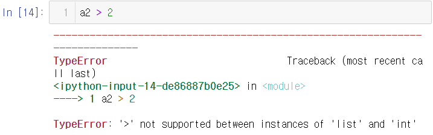
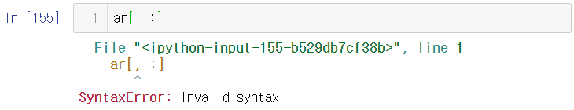
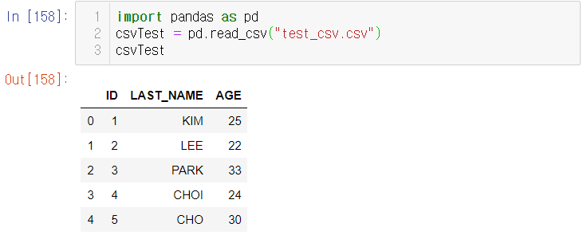
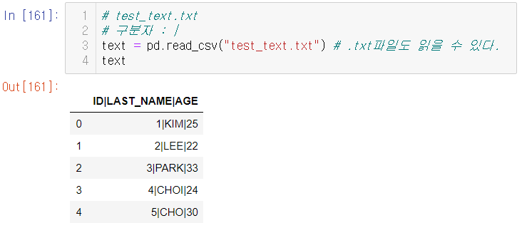
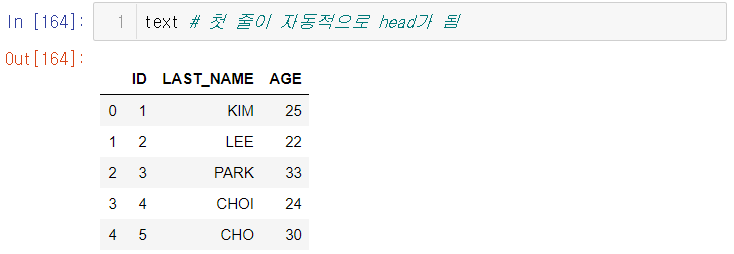

# Day13 딥러닝을 위한 빅데이터 기초 - 데이터 분석를 위한 NumPy, Pandas (1)

- numpy(전처리), pandas(분석)
- matplotlib, seaborn(시각화)

# 전처리

- 전처리

  - 결측치(보통, 회귀분석/knn 방법을 사용하여 처리)
  - 표준화/정규화
    - 정규화(Normalization)
      - (각 속성값 - 최소값) / 각 속성의 최대 - 최소
    - 표준화(standardzation)
      - 평균 = 0, 표준편차 = 1
      - (각 속성값 - 평균) / 표준편차

- 원핫인코딩

  - 데이터에 대해서 하나만 1 나머지는 0으로 만들어주는 인코딩, 자연어 처리에서 문자를 숫자로 바꾸는 기법

  - | 100000 | 010000 | 001000 | 000100 | 000010 | 000001 |
    | :----: | :----: | :----: | :----: | :----: | :----: |
    |   A    |   B    |   C    |   D    |   E    |   F    |

  - 문장 추출 -> 단어(5개) 추출 -> 원핫인코딩

    - 국어10000, 영어01000, 수학00100, 과학00010, 윤리00001
    - 오늘(2번), 내일(1번), 날씨(3번) => (오늘,내일,날씨) = (2,1,3) 좌표에 표시

  - 단점 : 단어가 많을 경우 메모리 낭비가 심하다.

- 밀집백터

  - 단어 집합의 크기가 아닌 사용자가 설정한 값으로 모든 단어의 벡터 표현의 차원을 맞춘다. 이 과정에서 더이상 0과 1만 가진 값이 아니라 실수값을 가진다.
  - 문장추출 -> 단어(5개 추출) -> 밀집벡터(워드2벡터)
      - 국어[0.2, 0.7]
      - 수학[0.1, 0.3]
      - ...


# NumPy

- NumPy : Num(numeric) + Py(python)
- 리스트 : 속도느림, 메모리 많이 차지
- 배열(array) : 속도빠름, 메모리 적게 차지


- 넘파이 배열과 리스트의 차이점
  - 리스트 : 서로 다른 자료형을 저장 가능함
  - 배열
    - 모두 같은 자료형을 저장
    - 기본적으로 원소 개수 변경 못함(방법은 존재함)
    - 파이썬에서 제공하지 않음(파이썬 환경에서 넘파이 패키지를 활용하여 배열을 사용할 수 있음)


- 넘파이
  - 수치해석 패키지
  - 다차원 배열 구조 지원
  - 벡터, 행렬을 사용하는 선형대수 계산시 사용
  - 넘파이 배열 연산 빠름(벡터화 연산을 하므로)


```python
# 1차원 배열
import numpy
ar = numpy.array([0,1,2,3,4]) # 1*5 array
ar
# > array([0, 1, 2, 3, 4])

type(ar) # nd : n-dimension(n차원)
# > numpy.ndarray
```


- 100*100 크기의 이미지(픽셀:10000개)
- 0~255사이의 gray scale
- => 몇 차원? 10000차원(1픽셀 당 1차원, 컬러는 *3)


```python
# 2차원 배열
numpy.array([[0,1,2,3,4], [5,6,7,8,9]]) # 2*5 array
# > array([[0, 1, 2, 3, 4],
# >        [5, 6, 7, 8, 9]])
```

```python
data = list(range(0,10))
# data에 저장된 모든 값들에 대해 2배하여 data에 저장
data = list(map(lambda x:2*x, data))
data
# > [0, 2, 4, 6, 8, 10, 12, 14, 16, 18]

# 강사님
ans = []
for d in data :
    ans.append(2*d)
print(ans)
# > [0, 2, 4, 6, 8, 10, 12, 14, 16, 18]
```

----

- 시간 / 공간 복잡도
- 시간복잡도(CPU) : 연산 결과가 나오기까지 수행되는 라인의 수

```python
d = 100
print(d*(d+1)/2) # O(1)

rsum = 0
for d in range(1, 100) : # O(n)
    rsum += d
print(rsum)
```

- 공간복잡도(MEMORY) : 차지하는 메모리를 비교하는 복잡도

----

## 벡터화 연산

```python
import numpy as np
data = list(range(0,10))
x = np.array(data)
x*2
# > array([ 0,  2,  4,  6,  8, 10, 12, 14, 16, 18])
```

```python
a = np.array([1,2,3])
b = np.array([4,5,6])
a2 = [1,2,3]
b2 = [4,5,6]

2*a2 + b2
# > [1, 2, 3, 1, 2, 3, 4, 5, 6]

2*a
# > array([2, 4, 6])

2*a + b
# > array([ 6,  9, 12])
```

- 각각의 요소별로 논리 연산 가능

```python
a2 == 2
# > False

a == 2
# > array([False,  True, False])
```

- 각각의 요소별로 비교 연산 가능

```python
a2 > 2
# > Error 발생
```



```python
a > 2
# > array([False, False,  True])
```


## 2차원 배열(행렬, matrix)

- 리스트의 리스트로 만들 수 있다.

```python
m = np.array([[0,1,2], [3,4,5]])
m
# > array([[0, 1, 2],
# >        [3, 4, 5]])

# 0 1 2
# 3 4 5 (2행 3열)
# 열 : 안쪽 리스트 길이, 가로 크기
# 행 : 바깥쪽 리스트 길이, 세로 크기

len(m) # 행의 갯수
# > 2

len(m[0]) # 열의 갯수
# > 3
```


## 3차원 배열

- 리스트의 리스트의 리스트

```python
m = np.array([[[1,2,3,4],
               [5,6,7,8],
               [9,10,11,12]],
              [[31,2,3,4],
               [35,6,7,8],
               [39,10,11,12]]])
# 2행 3열 4깊이(면)
# 2*3*4

len(m) # 행의 갯수
# > 2

len(m[0]) # 열의 갯수
# > 3

len(m[0][0]) # 깊이(면)의 갯수
# > 4
```


## 배열의 차원 & 크기

```python
a = np.array([4,5,6])
a.ndim # 배열의 차원
# > 1

a.shape # 배열의 크기
# > (3,)
```

```python
m = np.array([[0,1,2], [3,4,5]])
m.ndim
# > 2

m.shape
# > (2, 3)

m = np.array([[[1,2,3,4],
               [5,6,7,8],
               [9,10,11,12]],
              [[31,2,3,4],
               [35,6,7,8],
               [39,10,11,12]]])
m.ndim
# > 3

m.shape
# > (2, 3, 4)
```


## array slicing

```python
ar = np.array([[1,2,3,4], [5,6,7,8]])
ar
# > array([[1, 2, 3, 4],
# >        [5, 6, 7, 8]])

ar[0]
# > array([1, 2, 3, 4])

ar[0, :] # 첫번째 행 전체
# > array([1, 2, 3, 4])

ar[:, 1] # 두번째 열 전체
# > array([2, 6])

ar[1, 1:] # 두번째 행의 두번째 열부터 마지막 열까지
# > array([6, 7, 8])

# [[1,2],[5,6]] 추출
ar[0:2, 0:2]
ar[:, 0:2]
ar[:, :2]
ar[:2, :2]
# > array([[1, 2],
# >        [5, 6]])
```

- 참고
  - slicing : 데이터 여러개를 참조
  - indexing : 데이터 1개를 참조

```python
# indexing
ar = np.array([0,1,2])
ar[1]
# > 1

ar[-1]
# > 2

ar = np.array([[1,2,3,4], [5,6,7,8]])
ar[0][0]
# > 1
```
- 다차원 배열에서는 컴마로 접근 가능
```python
ar[0, 0]
# > 1

ar[0, 1]
# > 2
```
```python
ar[-1]
# > array([5, 6, 7, 8])

ar[1][1]
ar[1, 1]
ar[-1][1]
ar[-1, 1]
ar[-1][-3]
ar[=1, -3]
# > 6
```


## 불린(Boolean) 참조

- 조건에 대해 만족하는 값을 추출 

```python
ar = np.array([2,3,4,5])
bidx = np.array([True, True, False, True])
ar[bidx]
# > array([2, 3, 5])

ar != 4
# > array([ True,  True, False,  True])

ar[ar != 4]
# > array([2, 3, 5])
```

- ar 요소 값이 짝수인 것들만 추출

```python
ar[ar%2 == 0]
# > array([2, 4])
```

- ar 요소 값이 3보다 큰 값들만 추출

```python
ar[ar > 3]
# > array([4, 5])
```


## 정수 참조 추출

```python
ar = np.array([2,3,4,5])
idx = np.array([0,3])
ar[idx]
# > array([2, 5])

idx = np.array([0,0,1,1])
ar[idx]
# > array([2, 2, 3, 3])
```

```python
ar = np.array([[1,2,3,4], [5,6,7,8]])

# [[1,4], [5, 8]] 추출
ar[:, range(0,4,3)] # 내 답
# > array([[1, 4],
# >        [5, 8]])

ar[:, [0,3]]
ar[:, [True, False, False, True]]
# > array([[1, 4],
# >        [5, 8]])
```

```python
ar = np.array([[1,2,3,4], [5,6,7,8]])

ar[:] # ar 전체 행
ar # ar 배열 전체
ar[:, :] # 전체 행 전체열
# > array([[1, 2, 3, 4],
# >        [5, 6, 7, 8]])
```

- Error 발생

```python
ar[, :]
```




```python
ar = np.array([[1,2,3,4],
               [15,16,17,18],
               [25,26,27,28],
               [35,36,37,38]])
ar[[2,0], :] # [행, 열]
# > array([[25, 26, 27, 28],
# >        [ 1,  2,  3,  4]])

ar[[2,0,-1], :]
# > array([[25, 26, 27, 28],
# >        [ 1,  2,  3,  4],
# >        [35, 36, 37, 38]])
```


# Pandas

- 참고 사이트 : https://pandas.pydata.org/ 오른쪽 Release의 pdf

- 원데이터 : csv(구분자 ,), tsv(구분자 tap), txt, xls, xlsa, json, ..
- Pandas : 원데이터를 데이터 프레임(엑셀 시트)으로 읽어서 분석
- NumPy : 원데이터를 다차원배열으로 읽어서 처리
- 메모장에 다음 내용 입력하고 "text_csv.csv"으로 저장
- `ID,LAST_NAME,AGE
  1,KIM,25
  2,LEE,22
  3,PARK,33
  4,CHOI,24
  5,CHO,30`

```python
import pandas as pd
csvTest = pd.read_csv("test_csv.csv")
csvTest
# >		ID	LAST_NAME	AGE
# > 0	1		KIM		25
# > 1	2		LEE		22
# > 2	3		PARK	33
# > 3	4		CHOI	24
# > 4	5		CHO		30
```



```python
type(csvTest)
# > pandas.core.frame.DataFrame
# pandas에서 사용하는 자료구조인 DataFrame이다.

csvTest.shape # DataFrame의 행과 열 알려줌, 튜플로 return
# > (5, 3)
```

- "test_csv.csv"파일에서 ,를 |로 바꿔주고, "test_text.txt" 로 저장
- `ID|LAST_NAME|AGE
  1|KIM|25
  2|LEE|22
  3|PARK|33
  4|CHOI|24
  5|CHO|30`
- .txt파일도 읽을 수 있다.

```python
# test_text.txt
# 구분자 : |
text = pd.read_csv("test_text.txt")
text
```



```python
text.shape
# 읽을 수는 있지만 데이터 형태가 제대로 읽어지지 않았다.
# > (5, 1)
```

- 제대로 읽기 위하여 구분자를 알려줘야 한다.

```python
text = pd.read_csv("test_text.txt", sep="|")
text # 첫 줄이 자동적으로 head가 됨
```



```python
text.shape
# > (5, 3)
```


# 연습문제

## 0.

### (1)

- [3,2,1,-4,-7,-9,8,-5,3,-1]
- 연속으로 숫자 3개를 곱했을 때 얻어진 결과값이 가장 큰 구간이 어디인지 출력

#### A.

```python
# 0.(1)
ar = np.array([3,2,1,-4,-7,-9,8,-5,3,-1])

mul = np.zeros(shape=(len(ar)-2, ))
for i in range(len(mul)) :
    mul[i] = ar[i]*ar[i+1]*ar[i+2]

print(ar[mul.argmax():mul.argmax()+3])
# > [-7 -9  8]
```

### (2)

- [[3, 1, -2],
-  [2, 1, -3],
-  [-2,0, -7]]
-  2*2 행렬을 구성하는 수를 곱했을 때 얻어진 결과값이 가장 큰 구간이 어디인지 출력

#### A.

```python
# 0.(2)
ar2 = np.array([[3, 1, -2],
                [2, 1, -3],
                [-2,0, -7]])

mul2 = np.zeros(shape=(len(ar2)-1, len(ar2[0])-1))
for i in range(len(mul2)) :
    for j in range(len(mul2[0])) :
        mul2[i][j] = ar2[i][j] * ar2[i][j+1] * ar2[i+1][j] * ar2[i+1][j+1]
        
max_i, max_j = np.unravel_index(mul2.argmax(), mul2.shape)
print(ar2[max_i:max_i+2, max_j:max_j+2])
# > [[3 1]
# >  [2 1]]
```

## 1.

- 다음 행렬과 같은 행렬이 있다.

- m = np.array([[ 0,  1,  2,  3,  4],

  - [ 5,  6,  7,  8,  9],
  - [10, 11, 12, 13, 14]])


1. 이 행렬에서 값 7 을 인덱싱한다.
2. 이 행렬에서 값 14 을 인덱싱한다.
3. 이 행렬에서 배열 [6, 7] 을 슬라이싱한다.
4. 이 행렬에서 배열 [7, 12] 을 슬라이싱한다.
5. 이 행렬에서 배열 [[3, 4], [8, 9]] 을 슬라이싱한다.

### A.

```python
# 1.
m = np.array([[ 0,  1,  2,  3,  4],
              [ 5,  6,  7,  8,  9],
              [10, 11, 12, 13, 14]])
# (1)
print(m[1, 2])
# > 7

# (2)
print(m[-1,-1])
# > 14

# (3)
print(m[1,1:3])
# > [6 7]

# (4)
print(m[1:3, 2])
# > [ 7 12]

# (5)
print(m[0:2, 3:])
# > [[3 4]
# >  [8 9]]
```

## 2.

- 다음 행렬과 같은 배열이 있다.

- x = np.array([1, 2, 3, 4, 5, 6, 7, 8, 9, 10,

  - 11, 12, 13, 14, 15, 16, 17, 18, 19, 20])

1. 이 배열에서 3의 배수를 찾아라.
2. 이 배열에서 4로 나누면 1이 남는 수를 찾아라.
3. 이 배열에서 3으로 나누면 나누어지고 4로 나누면 1이 남는 수를 찾아라.

### A.

```python
# 2.
x = np.array([1, 2, 3, 4, 5, 6, 7, 8, 9, 10,
              11, 12, 13, 14, 15, 16, 17, 18, 19, 20])

# (1)
print(x[x%3 == 0])
# > [ 3  6  9 12 15 18]

# (2)
print(x[x%4 == 1])
# > [ 1  5  9 13 17]

# (3)
print(x[(x%3 == 0) & (x%4 == 1)])
# > [9]
```

## 3. Gravity

### A.

```python
# 3.
ar = np.array(list(map(int, input("왼쪽부터 쌓여진 상자 개수 입력 : ").split())))
# 각 값에대한 최대낙차를 입력하기 위한 array
res = np.zeros(shape=max(ar))

for i in range(1, max(ar)+1) :
    # 인덱스들을 저장
    idx = np.where(ar >= i)
    # 각 값이 대한 최대 낙차
    res[i-1] = len(ar) - idx[0][0] - len(idx[0])

max_res = int(res.max())
print("최대 낙차는 {}입니다.".format(max_res))
# > 왼쪽부터 쌓여진 상자 개수 입력 : 7 4 2 0 0 6 0 7 0
# > 최대 낙차는 7입니다.
```


