# Day14 딥러닝을 위한 빅데이터 기초 - 데이터 분석를 위한 NumPy, Pandas (2)

- NumPy : https://numpy.org/doc/ 참고
- Pandas : https://pandas.pydata.org/ 참고

- Anaconda의 Spyder : PyCharm과 비슷
- Anaconda의 Jupyter Notebook : IPython과 비슷

# Pandas

## read_csv()

```python
import pandas as pd
import numpy as np

pd.read_csv("test_text.txt")
```

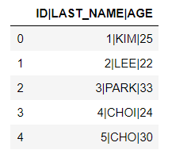

```python
pd.read_csv("test_text.txt", sep="|")
# default 행 인덱스 : 0번~
```

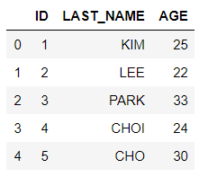


- **행인덱스를 지정하고 싶은 경우**

```python
pd.read_csv("test_text.txt", sep="|", index_col="ID")
```

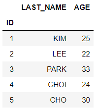

```python
pd.read_csv("test_text.txt", sep="|", index_col=0)
```

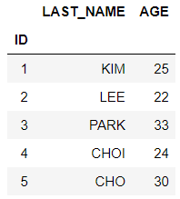

```python
pd.read_csv("test_text.txt", sep="|", index_col=1)
```

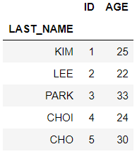

```python
pd.read_csv("test_text.txt", sep="|", index_col=2)
```

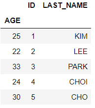

- **파일에 열 이름이 없는 경우**
- 첫번째 줄을 열 이름으로 인식 한다.

```python
# test_text.txt 파일에서 header 부분을 삭제하고 test_text_without_name.txt로 저장
pd.read_csv("test_text_without_name.txt", sep="|")
```

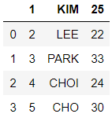

```python
pd.read_csv("test_text_without_name.txt", sep="|", header=None)
```

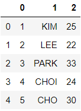

- **연속적으로 여러 줄을 건너 뛸 경우**

```python
pd.read_csv("test_text.txt", sep="|", skiprows=1)
```

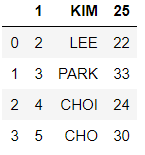

```python
pd.read_csv("test_text.txt", sep="|", skiprows=2)
```


- **비연속적으로 여러 줄을 건너 뛸 경우**

```python
pd.read_csv("test_text.txt", sep="|", skiprows=[1,3])
```

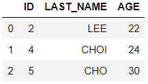

- **위에서부터 일부의 데이터만 불러오기**

```python
pd.read_csv("test_text.txt", sep="|", nrows=3)
```

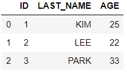

## 결측값(na)

- `ID|LAST_NAME|AGE
  1|KIM|25
  2|LEE|없음
  3|PARK|33
  4|모름|24
  5|CHO|30`을 'test_na.txt'로 저장

```python
data = pd.read_csv("test_text.txt", sep="|", nrows=3)
data.info()
# > <class 'pandas.core.frame.DataFrame'>
# > RangeIndex: 3 entries, 0 to 2
# > Data columns (total 3 columns):
# > ID           3 non-null int64
# > LAST_NAME    3 non-null object
# > AGE          3 non-null int64
# > dtypes: int64(2), object(1)
# > memory usage: 200.0+ bytes
```

- object = string

```python
pd.read_csv("test_na.txt", sep="|")
```

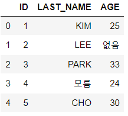

```python
data = pd.read_csv("test_na.txt", sep="|")
data.info()
# > <class 'pandas.core.frame.DataFrame'>
# > RangeIndex: 5 entries, 0 to 4
# > Data columns (total 3 columns):
# > ID           5 non-null int64
# > LAST_NAME    5 non-null object
# > AGE          5 non-null object
# > dtypes: int64(1), object(2)
# > memory usage: 248.0+ bytes
```

- LAST_NAME과 AGE에 모름, 없음이 들어가서 AGE가 int64에서 object로 변경되었다.
- **na_value = 결측값 처리 옵션**

```python
data = pd.read_csv("test_na.txt", sep="|", na_values=["없음", "모름"])
print(data)
data.info()
# >    ID LAST_NAME   AGE
# > 0   1       KIM  25.0
# > 1   2       LEE   NaN
# > 2   3      PARK  33.0
# > 3   4       NaN  24.0
# > 4   5       CHO  30.0
# > <class 'pandas.core.frame.DataFrame'>
# > RangeIndex: 5 entries, 0 to 4
# > Data columns (total 3 columns):
# > ID           5 non-null int64
# > LAST_NAME    4 non-null object
# > AGE          4 non-null float64
# > dtypes: float64(1), int64(1), object(1)
# > memory usage: 248.0+ bytes
```


## 데이터 타입 지정하기

- **dtype**
  - **데이터 타입을 지정하는 옵션**
  - 딕셔너리 형식으로 **key 값은 열이름**, **value 값은 데이터 타입**을 입력한다.

```python
data = pd.read_csv("test_text.txt", sep="|")
data.info()
data
# > <class 'pandas.core.frame.DataFrame'>
# > RangeIndex: 5 entries, 0 to 4
# > Data columns (total 3 columns):
# > ID           5 non-null int64
# > LAST_NAME    5 non-null object
# > AGE          5 non-null int64
# > dtypes: int64(2), object(1)
# > memory usage: 248.0+ bytes
```

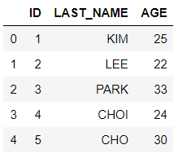

```python
data = pd.read_csv("test_text.txt", sep="|", dtype={"ID":int, "LAST_NAME":str, "AGE":str})
data.info()
data
# > <class 'pandas.core.frame.DataFrame'>
# > RangeIndex: 5 entries, 0 to 4
# > Data columns (total 3 columns):
# > ID           5 non-null int32
# > LAST_NAME    5 non-null object
# > AGE          5 non-null object
# > dtypes: int32(1), object(2)
# > memory usage: 228.0+ bytes
```

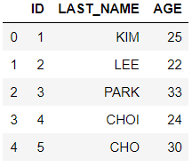


## Pandas 데이터 저장하기

- **pd.DataFrame.to_csv : 데이터프레임을 csv로 저장**
- cf )
  - **import** pandas **as** pd : *pd.DataFrame()*
  - **from** pandas **import** \* : *DataFrame()*
  - **from** pandas **import** DataFrame : *DataFrame()*
- **DataFrame(data, index=)**
- 딕셔너리 데이터로 데이터 프레임 생성하기

```python
df = DataFrame({
    "id" : ['a1','a2','a3','a4','a5'],
    "x1" : [1,2,3,4,5],
    "x2" : [1.1, 2.2, 3.3, 4.4, 5.5]
})
df
```

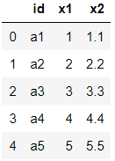

```python
df = DataFrame(data={
    "id" : ['a1','a2','a3','a4','a5'],
    "x1" : [1,2,3,4,5],
    "x2" : [1.1, 2.2, 3.3, 4.4, 5.5]
}, index=['a', 'b', 'c', 'd', 'e'])
df
```

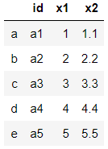

- **결측값으로 구성된 새로운 행 추가하기**

```python
df2 = df.reindex(index=['a', 'b', 'c', 'd', 'e', 'f'])
df2
```

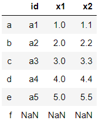

- **index옵션에서 선택된 행들만 출력**

```python
df.reindex(index=['a', 'c', 'e', 'f'])
```

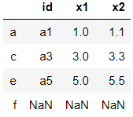

```python
df.reindex(index=['a', 'k', 'c', 'e', 'f'])
```

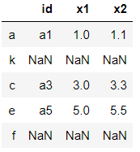

```python
# 기본 구분자 ','
df2.to_csv("df2.csv")
```

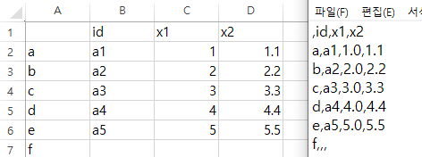

```python
# 구분자 '$'로 설정
df2.to_csv("df3.csv", sep="$")
```

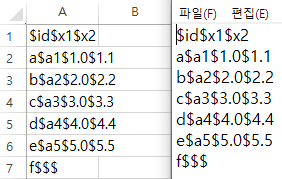

```python
# NaN 표시 설정
df2.to_csv("df4.csv", na_rep="NaN")
```

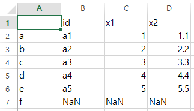

```python
# header 설정
df2.to_csv("df5.csv", na_rep="NaN", header=None)
```

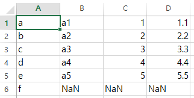

```python
# 소수이하 두번째자리까지 표시
df2.to_csv("df6.csv", na_rep="NaN", float_format="%.2f")
```

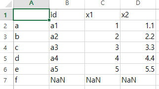

```python
# 원하는 열만 선택적으로 저장
df2.to_csv("df7.csv", na_rep="NaN", columns=["id", "x2"])
```

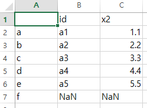

```python
# 행인덱스 제외하고 저장
df2.to_csv("df8.csv", na_rep="NaN", columns=["id", "x2"], index=False)
```

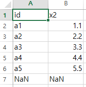


## array를 이용한 데이터프레임 생성

```python
from pandas import DataFrame as df

np.arange(8)
# > array([0, 1, 2, 3, 4, 5, 6, 7])

np.arange(8).shape
# > (8,)

np.arange(8).reshape(2,4)
# > array([[0, 1, 2, 3],
# >        [4, 5, 6, 7]])

np.arange(8).reshape(2,2,2)
# > array([[[0, 1],
# >         [2, 3]],
# > 
# >        [[4, 5],
# >         [6, 7]]])
```

```python
df(np.arange(8).reshape(4,2))
```

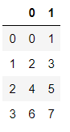

```python
df(data = np.arange(8).reshape(4,2))
```

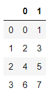

```python
df(data = np.arange(8).reshape(4,2), 
  columns=["col0", "col1"])
```

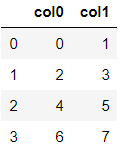

```python
df(data = np.arange(8).reshape(4,2), 
  columns=["col0", "col1"],
  index=["row0", "row1", "row2", "row3"])
```

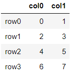

### **참고, 인덱스 개수가 맞지 않을 경우 ValueError 발생**


## transpose matirx

```python
df1 = df(data = np.arange(8).reshape(4,2), 
  columns=["col0", "col1"],
  index=["row0", "row1", "row2", "row3"])
type(df1)
# > pandas.core.frame.DataFrame

df1.T
```


```python
df1 # df1.T를 설정하고 싶으면 할당해야 한다.
```

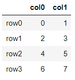


## DataFrame에 연결된 함수들

- **행과 열의 모든 이름 출력**
- axis(축, 단수), axes(복수)

```python
df1.axes
# > [Index(['row0', 'row1', 'row2', 'row3'], dtype='object'),
# >  Index(['col0', 'col1'], dtype='object')]
```

- 열별로 **data type** 반환

```python
df1.dtypes
# > col0    int32
# > col1    int32
# > dtype: object
```

- **data type을 포함한 상세한 정보 반환**

```python
df1.info()
# > <class 'pandas.core.frame.DataFrame'>
# > Index: 4 entries, row0 to row3
# > Data columns (total 2 columns):
# > col0    4 non-null int32
# > col1    4 non-null int32
# > dtypes: int32(2)
# > memory usage: 224.0+ bytes
```

- DataFrame **크기** 반환

```python
df1.shape
# > (4, 2)
```

- **데이터의 갯수** 반환

```python
df1.size
# > 8
```

- **데이터 값들** 출력

```python
df1.values
# > array([[0, 1],
# >        [2, 3],
# >        [4, 5],
# >        [6, 7]])
```

----

### NumPy 난수발생 함수

```python
np.random.randn() # rand(random) + n(Normal(0,1))
# > 0.8477964283448294

np.random.randn(5)
# > array([-1.40637294, -0.33003999, -1.66307322,  0.18701989,  0.76149387])
```

----

```python
df_new = DataFrame({
    "cls_1" : ['a', 'a', 'b', 'b', 'c'],
    "v1" : np.arange(5),
    "v2" : np.random.randn(5)},
    index = ['r0', 'r1', 'r2', 'r3', 'r4'])
df_new
```

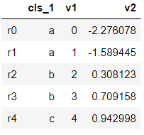

```python
df_new.index
# > Index(['r0', 'r1', 'r2', 'r3', 'r4'], dtype='object')
```


### DataFrame.ix

- ix는 행 단위로 indexing할 때,
  - 행 위치(정수)와 행 인덱스 이름을 모두 사용할 수 있다.

```python
df_new.ix # Warning 발생
```

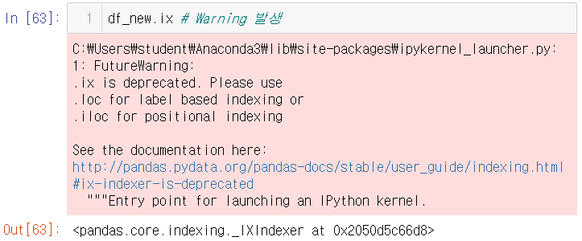

----

### 참고, Warning 출력되지 않게 하는 방법

```python
import warnings
warnings.filterwarnings(action="ignore")
```

----

- 행 위치(0번부터 시작)

```python
df_new.ix[2]
# > cls_1           b
# > v1              2
# > v2       0.308123
# > Name: r2, dtype: object
```

- 행 인덱스 이름을 입력하여도 참조 가능

```python
df_new.ix['r2']
# > cls_1           b
# > v1              2
# > v2       0.308123
# > Name: r2, dtype: object
```

- 인덱스 3번부터 마지막까지 추출

```python
df_new.ix[3:]
```

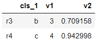

```python
df_new.ix["r3":]
```

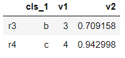

### .head, .tail

- data가 클 경우 상위, 하위 확인하는 함수

```python
df_new.head(3)
```

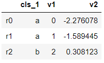

```python
df_new.tail(3)
```

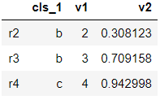

### 원하는 열 출력하기

- dataframe에서 원하는 열만 출력하기

```python
df_new["cls_1"]
# > r0    a
# > r1    a
# > r2    b
# > r3    b
# > r4    c
# > Name: cls_1, dtype: object

df_new.cls_1
# > r0    a
# > r1    a
# > r2    b
# > r3    b
# > r4    c
# > Name: cls_1, dtype: object
```

- 원하는 열이 2개일 경우

```python
df_new["cls_1", "v1"]
# > Error 발생
```

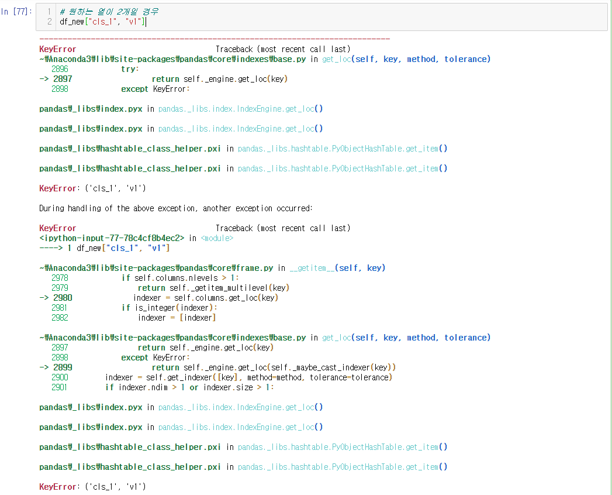

```python
df_new[["cls_1", "v1"]]
```

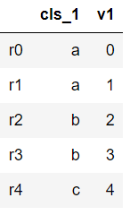

- 참고,  []와 [[]]는 data type이 서로 다르다.

```python
df_new["cls_1"]
# > r0    a
# > r1    a
# > r2    b
# > r3    b
# > r4    c
# > Name: cls_1, dtype: object

df_new[["cls_1"]]
```

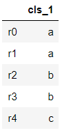

```python
type(df_new["cls_1"])
# > pandas.core.series.Series

type(df_new[["cls_1"]])
# > pandas.core.frame.DataFrame
```


## 결측값 대체하기

```python
df_new = DataFrame({
    "cls_1" : ['a', 'a', 'b', 'b', 'c'],
    "v1" : np.arange(5),
    "v2" : np.random.randn(5)},
    index = ['r0', 'r1', 'r2', 'r3', 'r4'])
df_new
```

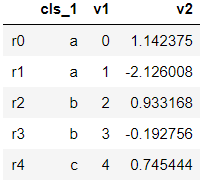

- 행 인덱스에서 : r3, r4 제거, r5. r6 추가

```python
df_new.reindex(index=['r0', 'r1', 'r2', 'r5', 'r6'])
```

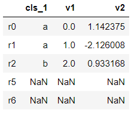

- NaN 값 0, 'mssing', 'NA'로 대체

```python
df_new.reindex(['r0', 'r1', 'r2', 'r5', 'r6'], fill_value=0)
```

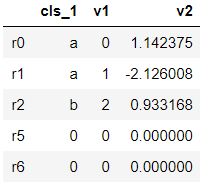

```python
df_new.reindex(['r0', 'r1', 'r2', 'r5', 'r6'], 
               fill_value="missing")
```

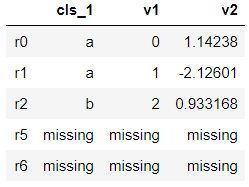

```python
df_new.reindex(['r0', 'r1', 'r2', 'r5', 'r6'], 
               fill_value="NA")
```

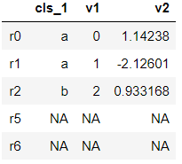


## 시계열 데이터

- 시간에 따라 발생되고 저장된 데이터
- DataFrame에서 index를 만들 때, date_range함수를 사용하여 생성

```python
pd.date_range("1/7/2020", periods=5) # 2020년 1월 7일
# > DatetimeIndex(['2020-01-07', '2020-01-08', '2020-01-09', '2020-01-10',
# >                '2020-01-11'],
# >               dtype='datetime64[ns]', freq='D')
# ns : nano second, D : day

pd.date_range("1/7/2020", periods=5, freq='D') # 하루단위
# > DatetimeIndex(['2020-01-07', '2020-01-08', '2020-01-09', '2020-01-10',
# >                '2020-01-11'],
# >               dtype='datetime64[ns]', freq='D')

pd.date_range("1/7/2020", periods=5, freq='M') # 월단위(말)
# > DatetimeIndex(['2020-01-31', '2020-02-29', '2020-03-31', '2020-04-30',
# >                '2020-05-31'],
# >               dtype='datetime64[ns]', freq='M')

pd.date_range("1/7/2020", periods=5, freq='Y') # 연단위(말)
# > DatetimeIndex(['2020-12-31', '2021-12-31', '2022-12-31', '2023-12-31',
# >                '2024-12-31'],
# >               dtype='datetime64[ns]', freq='A-DEC')

pd.date_range("1/7/2020", periods=5, freq='H') # 시간
# > DatetimeIndex(['2020-01-07 00:00:00', '2020-01-07 01:00:00',
# >                '2020-01-07 02:00:00', '2020-01-07 03:00:00',
# >                '2020-01-07 04:00:00'],
# >               dtype='datetime64[ns]', freq='H')
```

```python
df2 = pd.DataFrame({"c1" : [5,3,7,6,4]})
df2
```

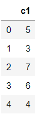

```python
date_idx = pd.date_range("1/7/2020", periods=5, freq='D')
df2 = pd.DataFrame({"c1" : [5,3,7,6,4]}, index=date_idx)
df2
```

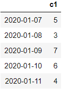

```python
date_idx2 = pd.date_range("1/1/2020", periods=20, freq="D")
date_idx2
# > DatetimeIndex(['2020-01-01', '2020-01-02', '2020-01-03', '2020-01-04',
# >                '2020-01-05', '2020-01-06', '2020-01-07', '2020-01-08',
# >                '2020-01-09', '2020-01-10', '2020-01-11', '2020-01-12',
# >                '2020-01-13', '2020-01-14', '2020-01-15', '2020-01-16',
# >                '2020-01-17', '2020-01-18', '2020-01-19', '2020-01-20'],
# >               dtype='datetime64[ns]', freq='D')
```

```python
df3 = pd.DataFrame({"c1" : [5,3,7,6,4]}, index=date_idx2)
df3 # Error 발생 (data보다 index가 더 많다.)
```

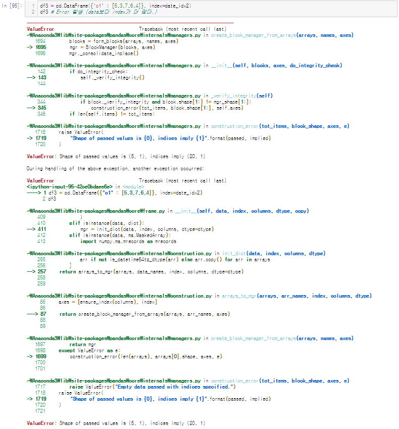

```python
df2.reindex(date_idx2)
```

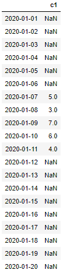

### 결측값 대체 방법

```python
df2.reindex(date_idx2, fill_value=0)
```


- **ffill(forward) : 결측값을 이전 날의 데이터로 채우는 방법**

```python
df2.reindex(date_idx2, method="ffill")
```

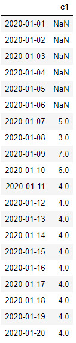

- **bfill(backward) : 결측값을 다음 날의 데이터로 채우는 방법**

```python
df2.reindex(date_idx2, method="bfill")
```


# 연습문제

## 0. zoo.data, zoo.names

- UCI의 zoo에서 zoo.data, zoo.names 다운

## 1. 데이터 읽기, 저장하기 연습

```python
# 1.
# 변수명을 위한 col_name list 생성
col_name = np.array(["animal_name", "hair", "feathers", "eggs", "milk", "airborne", "aquatic", "predator", "toothed", "backbone", "breathes", "venomous", "fins", "legs", "tail", "domestic", "catsize", "type"])
# zoo.data 불러오면서 변수명 할당하기
zoo = pd.read_csv("zoo.data", header = None, names=col_name)
zoo

# header는 있고, row_name은 없이 저장
zoo.to_csv('zoo_name.csv', index=False)
```


## 2. reindex

```python
# 2.
# 0~100사이의 값 중 10 단위로 출력
zoo.reindex(index = range(0,101, 10))
```


## 3. 결측값을 임의로 추가 -> 결측값 처리 연습

```python
# 3.
# 마지막 부분에 결측값 4개 추가
zoo.reindex(index = list(range(105)))

# 결측값 NA로 채우기
zoo.reindex(index = list(range(105)), fill_value="NA")

# 결측값 forward 방식으로 채우기
zoo.reindex(index = list(range(105)), method="ffill")
```


## 4. info, head, tail, ... 데이터 확인

```python
# 4.
zoo.info()
# > <class 'pandas.core.frame.DataFrame'>
# > RangeIndex: 101 entries, 0 to 100
# > Data columns (total 18 columns):
# > animal_name    101 non-null object
# > hair           101 non-null int64
# > feathers       101 non-null int64
# > eggs           101 non-null int64
# > milk           101 non-null int64
# > airborne       101 non-null int64
# > aquatic        101 non-null int64
# > predator       101 non-null int64
# > toothed        101 non-null int64
# > backbone       101 non-null int64
# > breathes       101 non-null int64
# > venomous       101 non-null int64
# > fins           101 non-null int64
# > legs           101 non-null int64
# > tail           101 non-null int64
# > domestic       101 non-null int64
# > catsize        101 non-null int64
# > type           101 non-null int64
# > dtypes: int64(17), object(1)
# > memory usage: 14.3+ KB

zoo.head(5)

zoo.tail(5)
```


## 5. ppt 문제 Flatten

```python
# 5. ppt 문제 Flatten
def flatten(origin, num) :
    # origin 값이 바뀌지 않게 해주기 위하여 copy의 deepcopy를 이용하여 다른 변수로 값을 복사
    import copy
    tmp = copy.deepcopy(origin)
    
    # 평탄화 작업 수행
    for i in range(num) :
        tmp[tmp.argmax()] -= 1
        tmp[tmp.argmin()] += 1
    # 평탄화 후 최고점과 최저점의 높이 차이 반환
    return tmp.max() - tmp.min()

origin = np.array(list(map(int, input().split())))
num = int(input("평탄화 작업 횟수 : "))

res = flatten(origin, num)
print(res)
# > 5 8 3 1 5 6 9 9 2 2 4
# > 평탄화 작업 횟수 : 10
# > 2
```

