[toc]

# Day15 딥러닝을 위한 빅데이터 기초 - 데이터 분석를 위한 NumPy, Pandas (3)

- 데이터 병합(Pandas의 concat함수)
- 데이터 분할(scikit-learn)


## help

- 함수에 대한 간단한 설명을 볼 수 있는 함수

```python
help()
# 입력창이 떠서 검색하면 함수에 대한 정보를 알려준다.
# 여러개의 함수를 검색할 수 있다.
# 끄는 방법을 모르겠다...
```

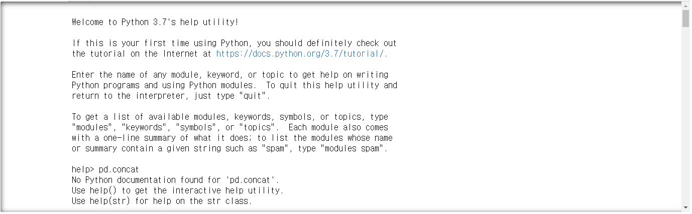


```python
help(pd.concat)
# 설명이 필요한 함수를 바로 검색하여 결과창을 보여줌
# 한 함수마다 코드 작성필요
```

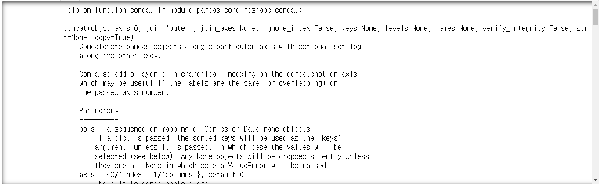

# Pandas

## concat

- **데이터를 병합하는 함수**
- parameter
  - objs : Series or DataFrame
  - **axis**
    - 0 'index' : 아래로 병합(default), 열 이름 기준 병합
    - 1 'index' : 옆으로 병합, 행 이름 기준 병합
  - **joins**
    - inner : 교집합
    - outer : 합집합(default)
  - join_axes : 교집합을 하더라고 꼭 나왔으면 하는 데이터 지정

```python
df1 = pd.DataFrame({'a':['a1', 'a2', 'a3'],
                    'b':['b1', 'b2', 'b3'],
                    'c':['c1', 'c2', 'c3'],
                    'd':['d1', 'd2', 'd3']},
                  index = [1,2,3])
df1
```

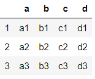

```python
df2 = pd.DataFrame({'a':['a4', 'a2', 'a3'],
                    'b':['b4', 'b2', 'b3'],
                    'c':['c4', 'c2', 'c3'],
                    'd':['d4', 'd2', 'd3']},
                  index = [4,2,3])
df2
```

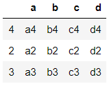


### axis 옵션

- **default : axis=0(위아래), 열 인덱스 기준**

```python
df12 = pd.concat([df1, df2]) 
df12
```

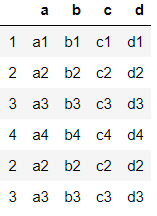

- **aixs=1(좌우), 행 인덱스 기준**
- 값이 없으면 NaN으로 채워짐

```python
df12 = pd.concat([df1, df2], axis=1) 
df12
```

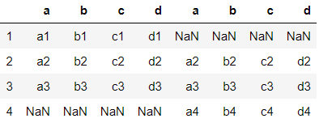

- df1 과 df2의 열 구성이 다를 경우

```python
df2 = pd.DataFrame({'a':['a4', 'a2', 'a3'],
                    'b':['b4', 'b2', 'b3'],
                    'c':['c4', 'c2', 'c3'],
                    'e':['e4', 'e2', 'e3']},
                  index = [4,2,3])
df2
```

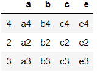

```python
df12 = pd.concat([df1, df2], axis=0) 
df12
```


```python
df12 = pd.concat([df1, df2], axis=1) 
df12
```

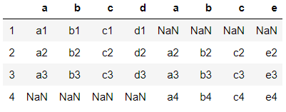

----

```python
df1 = pd.DataFrame({'A': ['A0', 'A1', 'A2'],
    'B': ['B0', 'B1', 'B2'],
    'C': ['C0', 'C1', 'C2'],
    'D': ['D0', 'D1', 'D2']},
    index=[0, 1, 2])

df2 = pd.DataFrame({'A': ['A3', 'A4', 'A5'],
    'B': ['B3', 'B4', 'B5'],
    'C': ['C3', 'C4', 'C5'],
    'D': ['D3', 'D4', 'D5']},
    index=[3, 4, 5])

df12 = pd.concat([df1, df2])
df12
```

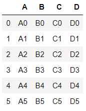

```python
df3 = pd.DataFrame({'E': ['A6', 'A7', 'A8'],
    'F': ['B6', 'B7', 'B8'],
    'G': ['C6', 'C7', 'C8'],
    'H': ['D6', 'D7', 'D8']},
    index=[0, 1, 2])

df13_1 = pd.concat([df1, df3], axis=1)
df13_1
```

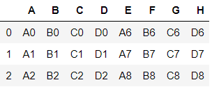

```python
pd.concat([df1, df3], axis=0)
```

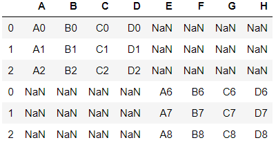

```python
df4 = pd.DataFrame({'A': ['A0', 'A1', 'A2'],
     'B': ['B0', 'B1', 'B2'],
     'C': ['C0', 'C1', 'C2'],
     'E': ['E0', 'E1', 'E2']},
     index=[0, 1, 3])

pd.concat([df1, df4])
```

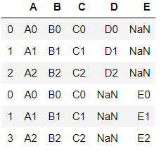

```python
pd.concat([df1, df4], axis=1)
```

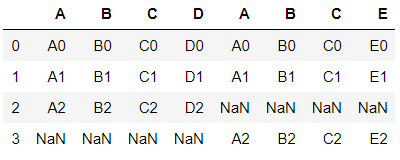


### join 옵션

- join='outer'가 default 임을 확인

```python
pd.concat([df1, df4], axis=0, join='outer')
```

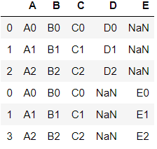

- join='inner'는 교집합이므로 D와 E열 출력 안됨

```python
pd.concat([df1, df4], axis=0, join='inner')
```

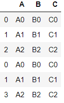

```python
pd.concat([df1, df4], axis=1, join='outer')
```

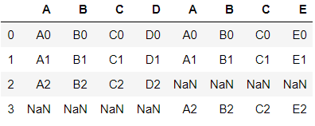

```python
pd.concat([df1, df4], axis=1, join='inner')
```

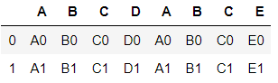


### join_axes 옵션

- inner를 하더라도 df1에 있는 모든 행이 나왔으면 좋았을 때

```python
pd.concat([df1, df4], axis=1, join="inner", join_axes=[df1.index])
# df1과 df4를 좌우로 병합
# 행인덱스가 공통적으로 존재하는 데이터에 대해 병합
# df1에 있는 행인덱스는 모두 출력
```


### ignore_index 옵션

```python
df5 = pd.DataFrame({'A': ['A0', 'A1', 'A2'],
     'B': ['B0', 'B1', 'B2'],
     'C': ['C0', 'C1', 'C2'],
     'D': ['D0', 'D1', 'D2']},
     index=['r0', 'r1', 'r2'])

df6 = pd.DataFrame({'A': ['A3', 'A4', 'A5'],
     'B': ['B3', 'B4', 'B5'],
     'C': ['C3', 'C4', 'C5'],
     'D': ['D3', 'D4', 'D5']},
     index=['r3', 'r4', 'r5'])

pd.concat([df5, df6])
```

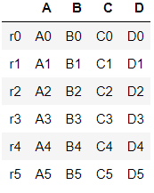

```python
pd.concat([df5, df6], axis=1)
```

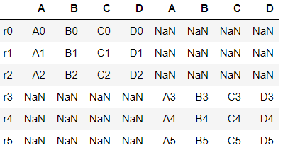

- ignore_index : 기존의 이름을 삭제하고 0부터 넘버링
- 두 개 이상의 데이터를 합칠 때 인덱스가 중복되지 않게하기 위하여 ignore_index 사용

```python
pd.concat([df5, df6], axis=0, ignore_index=True)
```

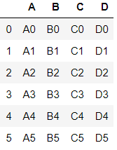

- ignore_index를 사용할 때,
  - axis=0 이면 행 인덱스를 0부터 넘버링
  - axis=1 이면 열 인덱스를 0부터 넘버링

```python
pd.concat([df5, df6], axis=1, ignore_index=True)
```

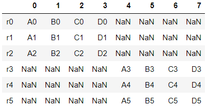


### keys 옵션

- keys : 계층적으로 index를 생성

```python
df56_keys = pd.concat([df5, df6], axis=0, keys=["df_5", "df_6"])
df56_keys
```

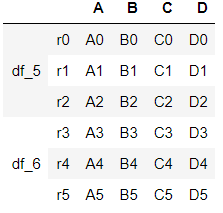

```python
df56_keys.ix['df_5']
```

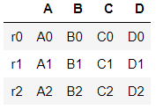

- 행 추출시 범위로 명시해야 함

```python
df56_keys.ix['df_5'][1:2]X
```

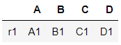

```python
df56_keys.ix['df_6'][0:1]
```

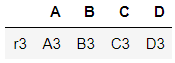

### names 옵션

- names : 계층과 계층의 행에 이름 설정

```python
df56_keys = pd.concat([df5, df6], axis=0, keys=["df_5", "df_6"], names=['dfName', 'rowData'])
df56_keys
```

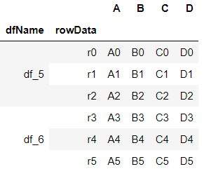


### verify_integrity 옵션

- verify_integrity : index 중복 여부 확인
- default = False
- True로 설정하게되면, index 중복시 에러 발생

```python
df7 = pd.DataFrame({'A': ['A0', 'A1', 'A2'],
     'B': ['B0', 'B1', 'B2'],
     'C': ['C0', 'C1', 'C2'],
     'D': ['D0', 'D1', 'D2']},
     index=['r0', 'r1', 'r2'])

df8 = pd.DataFrame({'A': ['A2', 'A3', 'A4'],
     'B': ['B2', 'B3', 'B4'],
     'C': ['C2', 'C3', 'C4'],
     'D': ['D2', 'D3', 'D4']},
     index=['r2', 'r3', 'r4'])

df7
```

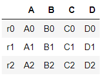

```python
df8
```

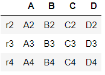

```python
pd.concat([df7, df8])
```

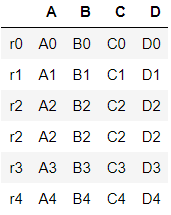

```python
pd.concat([df7, df8], verify_integrity=False)
```

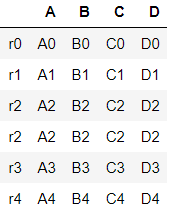

```python
pd.concat([df7, df8], verify_integrity=True)
# > Error 발생
```

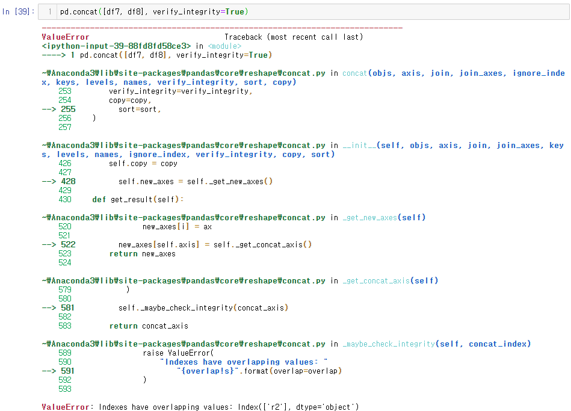


### 데이터프레임과 시리즈간 합치기

```python
from pandas import DataFrame
from pandas import Series

df1 = pd.DataFrame({'A': ['A0', 'A1', 'A2'],
    'B': ['B0', 'B1', 'B2'],
    'C': ['C0', 'C1', 'C2'],
    'D': ['D0', 'D1', 'D2']},
    index=[0, 1, 2])

type(df1)
# > pandas.core.frame.DataFrame

df1['A']
# > 0    A0
# > 1    A1
# > 2    A2
# > Name: A, dtype: object

df1.A
# > 0    A0
# > 1    A1
# > 2    A2
# > Name: A, dtype: object

df1[['A', 'B']]
```

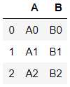

```python
type(df1['A'])
# > pandas.core.series.Series

type(df1[['A']])
# > pandas.core.frame.DataFrame

type(df1[['A', 'B']])
# > pandas.core.frame.DataFrame
```

```python
S1 = pd.Series(['s1', 's2', 's3'])
S1
# > 0    s1
# > 1    s2
# > 2    s3
# > dtype: object

pd.concat([df1, S1])
```

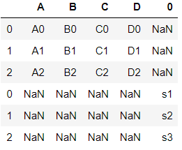

```python
pd.concat([df1, S1], axis=1)
```

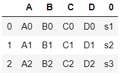

#### Series col_name 설정하기

```python
S1 = pd.Series(['s1', 's2', 's3'], name='S')
S1
# > 0    s1
# > 1    s2
# > 2    s3
# > dtype: object

pd.concat([df1, S1], axis=1)
```

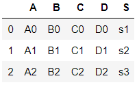

```python
pd.concat([df1, S1], axis=1, ignore_index=True)
```

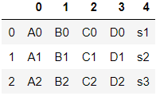

```python
S1 = pd.Series(['s1', 's2', 's3'], name='S')
S2 = pd.Series([1,2,3])
S3 = pd.Series([4,5,6])

pd.concat([S1, S2, S3])
# > 0    s1
# > 1    s2
# > 2    s3
# > 0     1
# > 1     2
# > 2     3
# > 0     4
# > 1     5
# > 2     6
# > dtype: object

pd.concat([S1, S2, S3], axis=1)
```

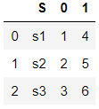

```python
pd.concat([S1, S2, S3], axis=1, ignore_index=True)
```

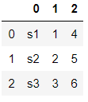

- Series들이 모여서 DataFrame이 된다.

```python
type(pd.concat([S1, S2, S3], axis=1, ignore_index=True))
# > pandas.core.frame.DataFrame
```


## merge

- **merge : SQL 명령문과 유사**
- concat보다 조금 더 빠름

```python
help(pd.merge)
```


- **prarmeter**
  - left : DataFrame
  - right : DataFrame or named Series
  - how : 병합방법, 'left', 'right', 'outer', 'inner'
  - on : 행 or 열 병합 이름
  - suffixes : 접두사 설정

```python
dfleft = DataFrame({'KEY': ['K0', 'K1', 'K2', 'K3'],
    'A': ['A0', 'A1', 'A2', 'A3'],
    'B': ['B0', 'B1', 'B2', 'B3']})


dfright = DataFrame({'KEY': ['K2', 'K3', 'K4', 'K5'],
    'C': ['C2', 'C3', 'C4', 'C5'],
    'D': ['D2', 'D3', 'D4', 'D5']})

dfleft
```

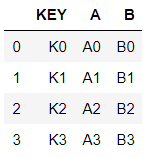

```python
dfright
```

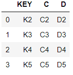

- dfleft와 dfright를 **KEY변수를 기준**으로 merge

```python
pd.merge(dfleft, dfright)
```

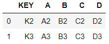

### how 옵션

- how의 default 'inner' 확인

```python
pd.merge(dfleft, dfright, how='inner')
```

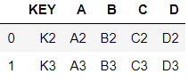

```python
pd.merge(dfleft, dfright, how='outer')
```

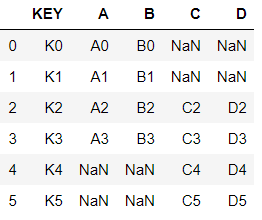

- **how='left'** : **left는 모두** 출력, **right는 공통된** 부분만 출력

```python
pd.merge(dfleft, dfright, how='left')
```

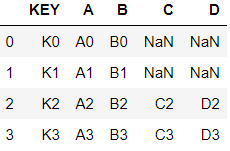

- **how='right'** : **right는 모두** 출력, **left는 공통된** 부분만 출력

```python
pd.merge(dfleft, dfright, how='right')
```

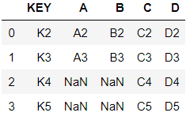

### on 옵션

- on
  - left와 right에 동시에 존재하는 변수가 많을 경우, 
  - 병합 기준이 될 변수 지정

```python
pd.merge(dfleft, dfright, how='left', on='KEY')
```

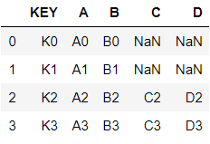

- left와 right에 동시에 가지고 있지 않는 변수를 on에 대입할 경우 Error 발생

```python
pd.merge(dfleft, dfright, how='left', on='A')
```

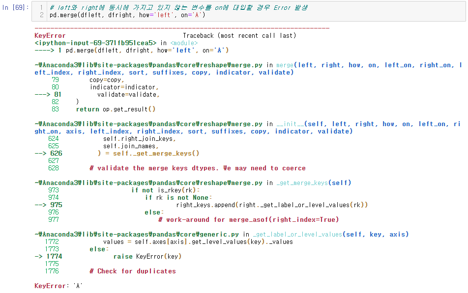

```python
pd.merge(dfleft, dfright)
```

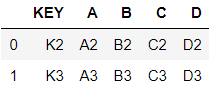

```python
pd.merge(dfleft, dfright, how='outer', on='KEY')
```

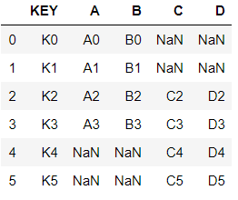


### indicator 옵션

- indicator : 부가설명 추가

```python
pd.merge(dfleft, dfright, how='outer', on='KEY', 
         indicator=True)
```

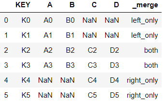

- 부가설명 변수 이름 지정 가능

```python
pd.merge(dfleft, dfright, how='outer', on='KEY', 
         indicator='indicator_info')
```


### suffixes 옵션

```python
dfleft2 = DataFrame({'KEY': ['K0', 'K1', 'K2', 'K3'],
     'A': ['A0', 'A1', 'A2', 'A3'],
     'B': ['B0', 'B1', 'B2', 'B3'],
     'C': ['C0', 'C1', 'C2', 'C3']})

dfright2 = DataFrame({'KEY': ['K0', 'K1', 'K2', 'K3'],
     'B': ['B0_2', 'B1_2', 'B2_2', 'B3_2'],
     'C': ['C0_2', 'C1_2', 'C2_2', 'C3_2'],
     'D': ['D0_2', 'D1_2', 'D2_2', 'D3_3']})
```

- 공통된 변수가 'KEY', 'B', 'C'가 있고, 'B'와 'C'가 각각 값이 다르므로 병합니 제대로 이뤄지지 않는다.

```python
pd.merge(dfleft2, dfright2)
```


- 두 dataframe에 똑같은 변수가 존재하는데 병합이 안된다면, 변수가 따로 생성됨

```python
pd.merge(dfleft2, dfright2, how='inner', on='KEY')
```


- **suffixes 옵션을 사용하여, 이름이 같은 변수의 접미사 설정 가능**

```python
pd.merge(dfleft2, dfright2, how='inner', on='KEY', 
         suffixes=('_left', '_right'))
```


### 인덱스 기준으로 데이터프레임 병합

```python
dfleft = DataFrame({
    'A': ['A0', 'A1', 'A2', 'A3'],
    'B': ['B0', 'B1', 'B2', 'B3']}, 
    index=['K0', 'K1', 'K2', 'K3'])

dfright = DataFrame({
    'C': ['C2', 'C3', 'C4', 'C5'],
    'D': ['D2', 'D3', 'D4', 'D5']}, 
    index=['K2', 'K3', 'K4', 'K5'],)

dfleft
```


```python
dfright
```


- 공통된 변수가 없어서 Error 발생

```python
pd.merge(dfleft, dfright)
```


- **index 기준 병합 방법 : join(), merge()**
- index를 기준으로 left join 수행

#### merge()를 이용한 left join

```python
pd.merge(dfleft, dfright, left_index=True, right_index=True)
```


```python
pd.merge(dfleft, dfright, left_index=True, right_index=True,
         how='left')
```


```python
pd.merge(dfleft, dfright, left_index=True, right_index=True, 
         how='right')
```


```python
pd.merge(dfleft, dfright, left_index=True, right_index=True, 
         how='outer')
```


#### join()를 이용한 left join

```python
dfleft.join(dfright) # default는 how='left'
```


```python
dfleft.join(dfright, how='right')
```


### index와 key를 조합하여 병합

```python
dfleft = DataFrame({
    'KEY': ['K0', 'K1', 'K2', 'K3'],
    'A': ['A0', 'A1', 'A2', 'A3'],
    'B': ['B0', 'B1', 'B2', 'B3']})

dfright = DataFrame({
    'C': ['C2', 'C3', 'C4', 'C5'],
    'D': ['D2', 'D3', 'D4', 'D5']}, 
    index=['K2', 'K3', 'K4', 'K5'],)

pd.merge(dfleft, dfright, left_on='KEY', right_index=True, how='left')
```


```python
dfleft.join(dfright, on="KEY", how='left')
```


# 연습문제

## 1. df1 ~ d3 merge(위아래)

### A.

```python
# 1.
df1 = pd.read_csv('../data/concat_1.csv') # ../ : 상위폴더
df2 = pd.read_csv('../data/concat_2.csv')
df3 = pd.read_csv('../data/concat_3.csv')
df123 = pd.concat([df1, df2, df3])
df123
```


## 2. how, axis 값을 변경해서 테스트

### A.

```python
# 2.
pd.concat([df1, df2, df3], axis=0) # default : join='outer'
pd.concat([df1, df2, df3], axis=0, join='outer')
pd.concat([df1, df2, df3], axis=0, join='inner')
```


```python
pd.concat([df1, df2, df3], axis=1, join='outer')
pd.concat([df1, df2, df3], axis=1, join='inner')
```


## 3. ignore_index 적용

### A.

```python
# 3.
pd.concat([df1, df2, df3], axis=0, join='inner', 
          ignore_index=True)
```


```python
pd.concat([df1, df2, df3], axis=1, join='inner', 
          ignore_index=True)
```


## 4. merge / join 함수 버전으로 각각 수행

### A.

```python
# 4.
pd.merge(pd.merge(df1, df2, how='outer'), df3, how='outer')
```


```python
pd.merge(pd.merge(df1, df2, how='outer', left_index=True, 
                  right_index=True), 
         df3, left_index=True, right_index=True)

pd.merge(pd.merge(df1, df2, how='inner', left_index=True,
                  right_index=True), 
         df3, left_index=True, right_index=True)

df1.join(df2.join(df3, how='outer', lsuffix='_y'),
         how='outer', lsuffix='_x')

df1.join(df2.join(df3, how='inner', lsuffix='_y'),
         how='inner', lsuffix='_x')
```


## 5. survey_ 파일에 대해 merge 연습

- left_on, right_on 적용(survey_site, survey_visited 열 기준으로 데이터 연결)

### A.

```python
# 5.
survey_site = pd.read_csv('../data/survey_site.csv')
survey_visited = pd.read_csv('../data/survey_visited.csv')

survey_site
survey_visited
```


```python
pd.merge(survey_site, survey_visited, left_on="name", 
         right_on="site")
```


## 6. 코딩문제(조망권)

### A.

```python
# 6.
def view_right(bud) :
    count = 0 # 조망권 확보된 집 count
    
    # 맨앞과 맨뒤에 2칸은 빌딩이 없으므로 제외
    for i in range(2, len(bud)-1) :
        # i번째 건물이 조망권이 확보되는지 확인
        if bud[i] >= max(bud[i-2:i+3]) :
            # i번째 건물에서 조망권이 확보된 층 count
            count += bud[i] - max(bud[i-2:i] + bud[i+1:i+3])
    
    return count

building = list(map(int, input().split()))
print(view_right(building))
# > 0 0 3 5 2 4 9 0 6 4 0 6 0 0
# > 6
```