[toc]

# Day16 딥러닝을 위한 빅데이터 기초 - 데이터 분석를 위한 NumPy, Pandas (4)

- 변수는 열로, 측정한 데이터는 행으로 구성
- 테이블 형태로 저장

- 기업정보, 주식가격이 연결되어 있어야 분석 가능

# Pandas

```python
import pandas as pd

df1 = pd.read_csv("../data/concat_1.csv")
df2 = pd.read_csv("../data/concat_2.csv")
df3 = pd.read_csv("../data/concat_3.csv")

row_concat = pd.concat([df1, df2, df3])
row_concat
```

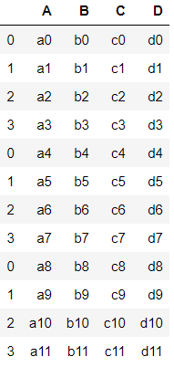

## iloc 속성

- iloc\[ , \] : i(index)를 이용하여 데이터 추출

```python
row_concat.iloc[3,]
# > A    a3
# > B    b3
# > C    c3
# > D    d3
# > Name: 3, dtype: object

row_concat.iloc[11,]
# > A    a11
# > B    b11
# > C    c11
# > D    d11
# > Name: 3, dtype: object
```


## concat review

```python
new_row_series = pd.Series(['n1', 'n2', 'n3'])
df1
```

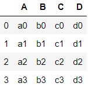

```python
pd.concat([df1, new_row_series])
```

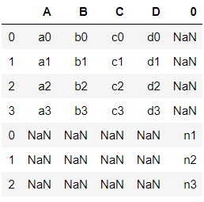

```python
new_df = pd.DataFrame([['n1', 'n2', 'n3', 'n4']])
new_df
```

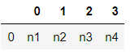

----

## columns 옵션

- columns : 열 이름 지정 옵션

```python
new_df = pd.DataFrame([['n1', 'n2', 'n3', 'n4']],
                      columns=['A', 'B', 'C', 'D'])
new_df
```

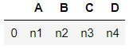

```python
pd.concat([df1, new_df])D
```

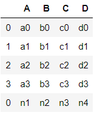

- 열 이름 변경

```python
df1.columns
# > Index(['A', 'B', 'C', 'D'], dtype='object')

df2.columns
# > Index(['A', 'B', 'C', 'D'], dtype='object')

df2.columns = ['E', 'F', 'G', 'H']
df2
```

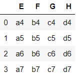

```python
df3.columns = ['A', 'C', 'F', 'H']
df3
```

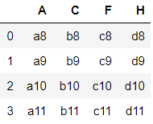

```python
pd.concat([df1, df2])
```

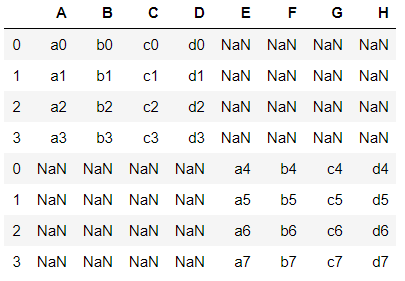

```python
pd.concat([df1, df2, df3])
```

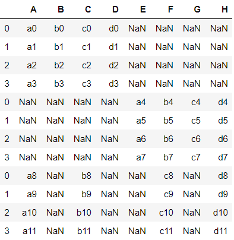


----

- 하나만 연결하는 경우에는 append를 사용하여도 무방하다.

```python
df1.append(new_df)
```

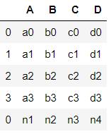

```python
df1.append(new_df, ignore_index=True)
```

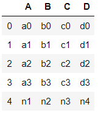

```python
row_cc = pd.concat([df1, df2, df3], ignore_index=True)
row_cc
```

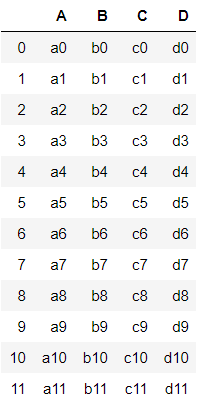

```python
col_cc = pd.concat([df1, df2, df3], ignore_index=True, 
                   axis=1)
col_cc
```

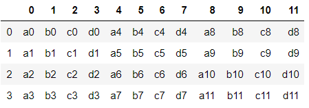

```python
col_cc = pd.concat([df1, df2, df3], axis=1)
col_cc
```

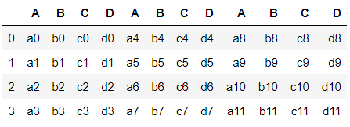

- 'A'열 추출

```python
col_cc['A']
```

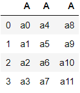

----

## 새로운 열 추가

```python
col_cc['E'] = ['e0', 'e1', 'e2', 'e3']
col_cc
```

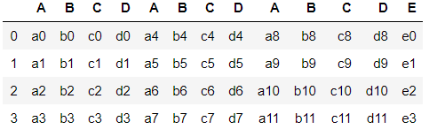


----

- df1과 df3의 공통된 열만 골라서 연결

```python
pd.concat([df1, df3], join="inner")
pd.concat([df1, df3], join="inner", ignore_index=True)
```

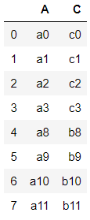


## index 옵션

- index : 행 index 변경

```python
df1.index
# > RangeIndex(start=0, stop=4, step=1)

df1.index = [4,5,6,7]
df1
```

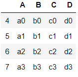

```python
df3.index = [0,2,5,7]
df3
```

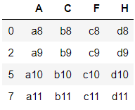

```python
pd.concat([df1, df3], join="inner", axis=1)
```

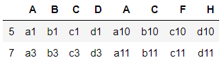

# gapminder.tsv

```python
df = pd.read_csv("../data/gapminder.tsv", sep='\t')
df
```

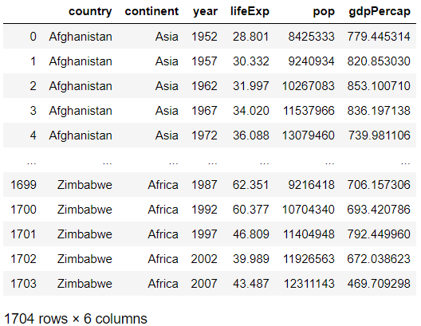

```python
df.head()
```

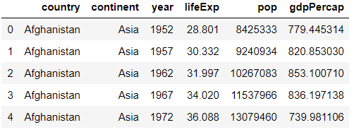

```python
type(df)
# > pandas.core.frame.DataFrame

df.shape
# > (1704, 6)

df.columns
# > Index(['country', 'continent', 'year', 'lifeExp', 'pop', 'gdpPercap'], dtype='object')

df.index
# > RangeIndex(start=0, stop=1704, step=1)

df.dtypes
# > country       object
# > continent     object
# > year           int64
# > lifeExp      float64
# > pop            int64
# > gdpPercap    float64
# > dtype: object

df.info()
# > <class 'pandas.core.frame.DataFrame'>
# > RangeIndex: 1704 entries, 0 to 1703
# > Data columns (total 6 columns):
# > country      1704 non-null object
# > continent    1704 non-null object
# > year         1704 non-null int64
# > lifeExp      1704 non-null float64
# > pop          1704 non-null int64
# > gdpPercap    1704 non-null float64
# > dtypes: float64(2), int64(2), object(2)
# > memory usage: 80.0+ KB

df['country'] # df.country
# > 0       Afghanistan
# > 1       Afghanistan
# > 2       Afghanistan
# > 3       Afghanistan
# > 4       Afghanistan
# >            ...     
# > 1699       Zimbabwe
# > 1700       Zimbabwe
# > 1701       Zimbabwe
# > 1702       Zimbabwe
# > 1703       Zimbabwe
# > Name: country, Length: 1704, dtype: object

df.tail(10)
```

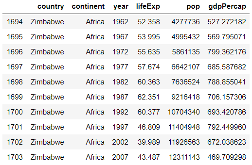

```python
# Error : df["country", "continent", "year"]
df[["country", "continent", "year"]]
```

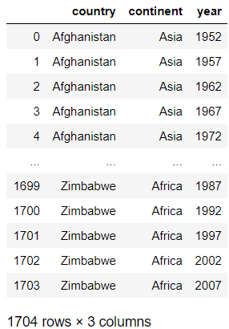

## iloc

```python
subset = df.iloc[:, 0:3]
subset
```

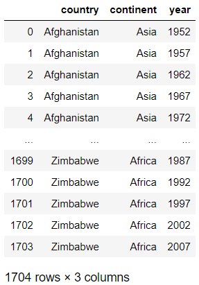

```python
df[0:3] # 0,1,2 행이 출력됨
```

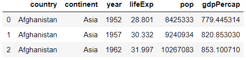

## ix

```python
df.ix[0:3] # 0,1,2,3 행이 출력됨
```

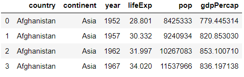

```python
df.ix[:, 0:3]
```

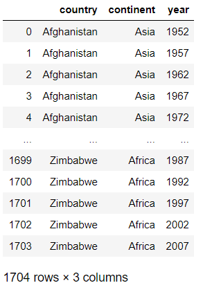

```python
df.ix[:, [0,2,3,-1]] 
```

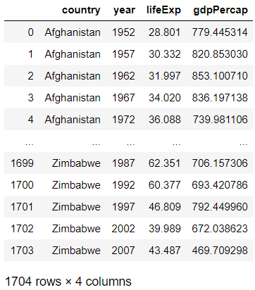

## loc 속성

- loc속성 : 행단위로 데이터 추출
- 음수사용이 불가

```python
df.loc[0] # 인덱스가 0인 행 데이터 추출
# > country      Afghanistan
# > continent           Asia
# > year                1952
# > lifeExp           28.801
# > pop              8425333
# > gdpPercap        779.445
# > Name: 0, dtype: object

df.loc[99]
# > country      Bangladesh
# > continent          Asia
# > year               1967
# > lifeExp          43.453
# > pop            62821884
# > gdpPercap       721.186
# > Name: 99, dtype: object
```

- -1인 인덱스가 존재하지 않으므로 Error 발생

```python
df.loc[-1]
```

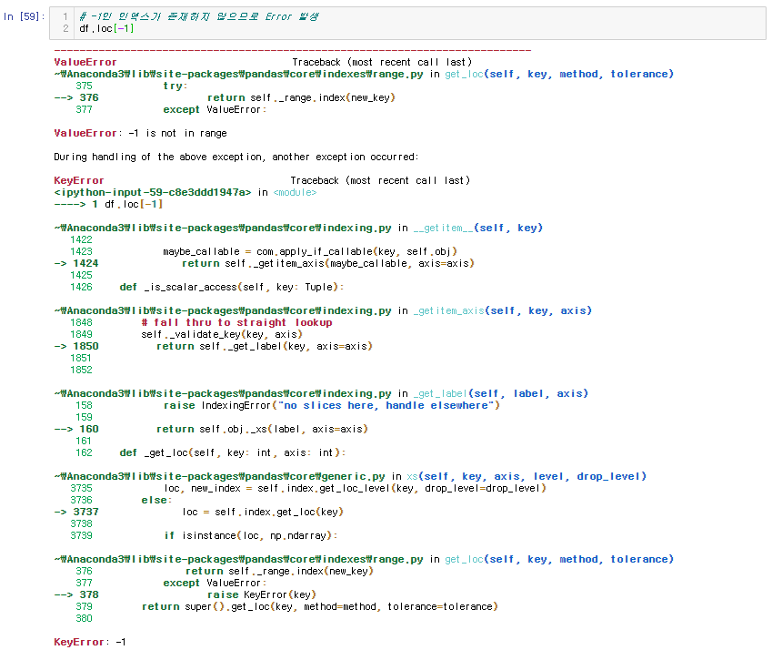

- 마지막 데이터 추출방법

```python
df.loc[df.shape[0]-1]
# > country      Zimbabwe
# > continent      Africa
# > year             2007
# > lifeExp        43.487
# > pop          12311143
# > gdpPercap     469.709
# > Name: 1703, dtype: object

df.tail(1)
```

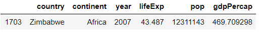

```python
type(df.loc[1703]) # Series
# > pandas.core.series.Series

type(df.tail(1)) # DataFrame
# > pandas.core.frame.DataFrame
```

- 여러 행을 추출하고 싶은 경우

```python
df.loc[[10, 100, 1000]]
```


### loc와 iloc 차이

```python
df.loc[1]
# > country      Afghanistan
# > continent           Asia
# > year                1957
# > lifeExp           30.332
# > pop              9240934
# > gdpPercap        820.853
# > Name: 1, dtype: object

df.iloc[1]
# > country      Afghanistan
# > continent           Asia
# > year                1957
# > lifeExp           30.332
# > pop              9240934
# > gdpPercap        820.853
# > Name: 1, dtype: object
```

```python
df.loc[1703]
# > country      Zimbabwe
# > continent      Africa
# > year             2007
# > lifeExp        43.487
# > pop          12311143
# > gdpPercap     469.709
# > Name: 1703, dtype: object

df.iloc[1703]
# > country      Zimbabwe
# > continent      Africa
# > year             2007
# > lifeExp        43.487
# > pop          12311143
# > gdpPercap     469.709
# > Name: 1703, dtype: object
```

- loc : 인덱스(행이름)를 기준으로 행 데이터 추출
- iloc : 행번호(0번부터 자동으로 부여되는 행 교유의 번호)를 기준으로 행 데이터 추출
- 인덱스 : 행을 나타내는 이름, (예, 날짜데이터)

| 행번호 | 인덱스   | 데이터  |
| ------ | -------- | ------- |
| 0      | 20200109 | 데이터1 |
| 1      | 20200110 | 데이터2 |
| 2      | 20200111 | 데이터3 |

- `loc[20200109]` => 데이터1 출력
- `iloc[0]` => 데이터1 출력

```python
df.iloc[-1] # 행번호를 의미하므로 가능
# > country      Zimbabwe
# > continent      Africa
# > year             2007
# > lifeExp        43.487
# > pop          12311143
# > gdpPercap     469.709
# > Name: 1703, dtype: object
```

----

- df의 'year', 'pop' 추출 후 subset에 저장

```python
subset = df.loc[:, ['year', 'pop']]
# df.ix[:, ['year', 'pop']]
# df.ix[:, [2, 4]]
# df.iloc[:, [2, 4]]

# df.loc[:, [2, 4]] => Error
# df.iloc[:, ['year', 'pop']] => Error
subset
```

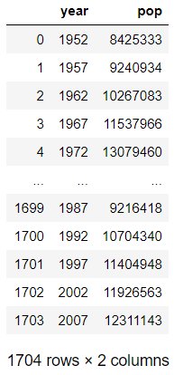

- range함수를 이용하여 데이터 추출

```python
sr = list(range(5))
sr
# > [0, 1, 2, 3, 4]

subset = df.iloc[:, sr]
subset
```

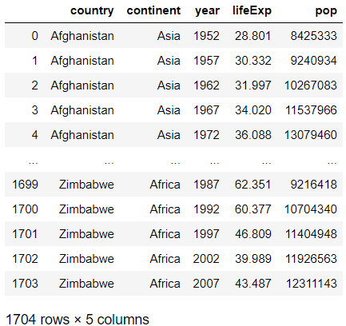

```python
subset.head(10)
```

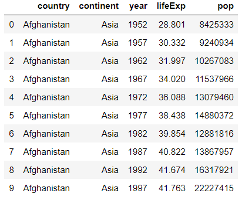

- df에서 0번, 2번. 4번 열을 추출

```python
df.iloc[:, list(range(0, 5, 2))]
```

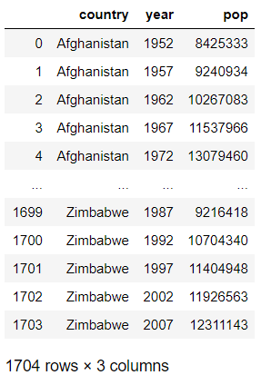

- df에서 0번~2번 열을 추출

```python
df.iloc[:, list(range(3))] # df.iloc[:, :3]
```

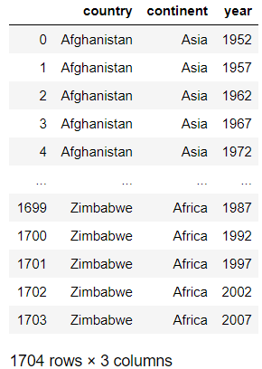

- 0, 100, 1000 행과 0,3,5 열을 추출

```python
df.iloc[[0,100,1000], [0,3,5]]
df.loc[[0,100,1000], ['country', 'lifeExp', 'gdpPercap']]
```

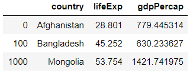


## 참고, loc는 범위에 있는 숫자가 모두 출력된다.

```python
df.loc[5:10,]
```

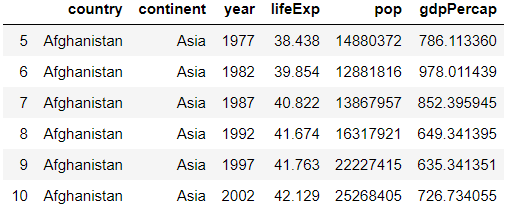


# survey_.csv

```python
person = pd.read_csv("../data/survey_person.csv")
site = pd.read_csv("../data/survey_site.csv")
survey = pd.read_csv("../data/survey_survey.csv")
visited = pd.read_csv("../data/survey_visited.csv")

person
```

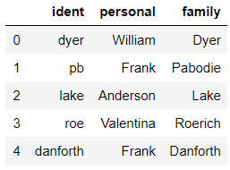

```python
site
```

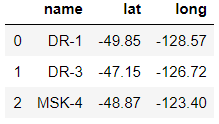

```python
survey
```

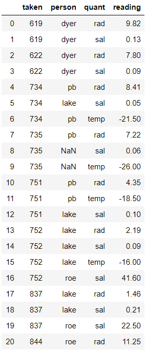

```python
visited
```

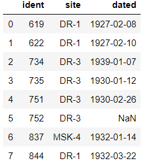

- **visited에서 0,2,6번 인덱스 불러오기**

```python
visited_subset = visited.loc[[0,2,6]]
# visited.loc[[0,2,6], ]
# visited.iloc[[0,2,6]]
# visited.loc[[0,2,6], ]
# visited.ix[[0,2,6]]
# visited.ix[[0,2,6], ] => 모두 동일한 결과
visited_subset
```

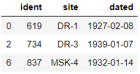

- **visited_subset과 site를 merge**

```python
pd.merge(site, visited_subset, left_on="name", 
         right_on="site")
# site.merge(visited_subset, left_on="name", right_on="site") # 동일한 결과
```

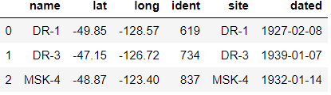

- **visited와 site를 merge**

```python
o2o_merge = site.merge(visited, left_on="name", 
                       right_on="site")
# pd.merge(site, visited, left_on="name", right_on="site") 동일한 결과
o2o_merge
```

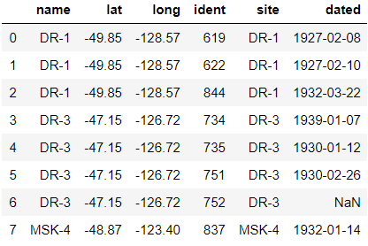

- **person-ident, survey-person Merge**

```python
ps = person.merge(survey, left_on="ident", 
                  right_on="person")
ps
```

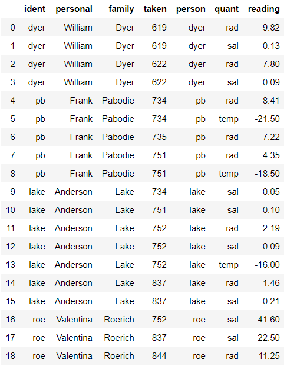

-  **visited-ident, survey-taken Merge**

```python
vs = visited.merge(survey, left_on="ident", 
                   right_on="taken")
vs
```

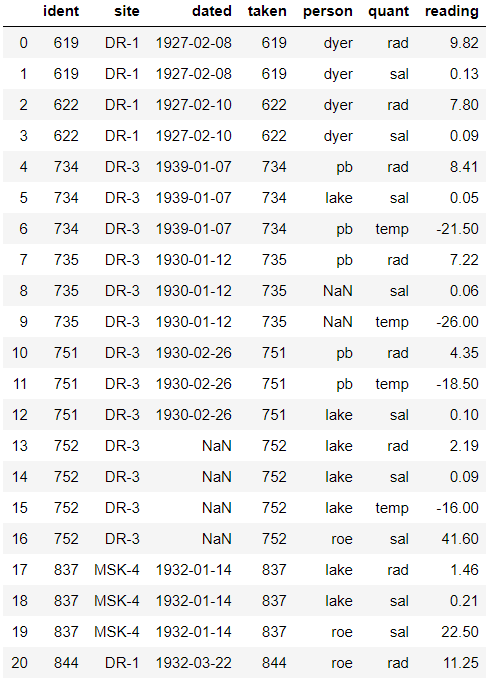

- **ps와 vs Merge**

```python
ps_vs = ps.merge(vs, 
                 on=["person", "taken", "quant", "reading"])
ps_vs
```

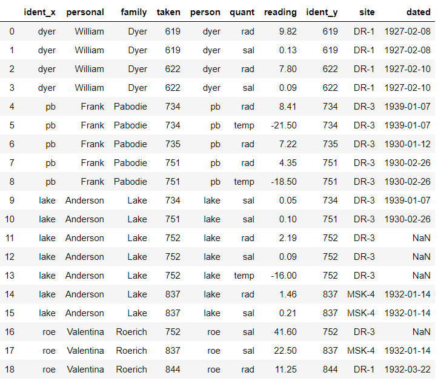

```python
ps.merge(vs,
         left_on=['ident', 'taken', 'quant', 'reading'],
         right_on=['person', 'ident', 'quant', 'reading'])
```

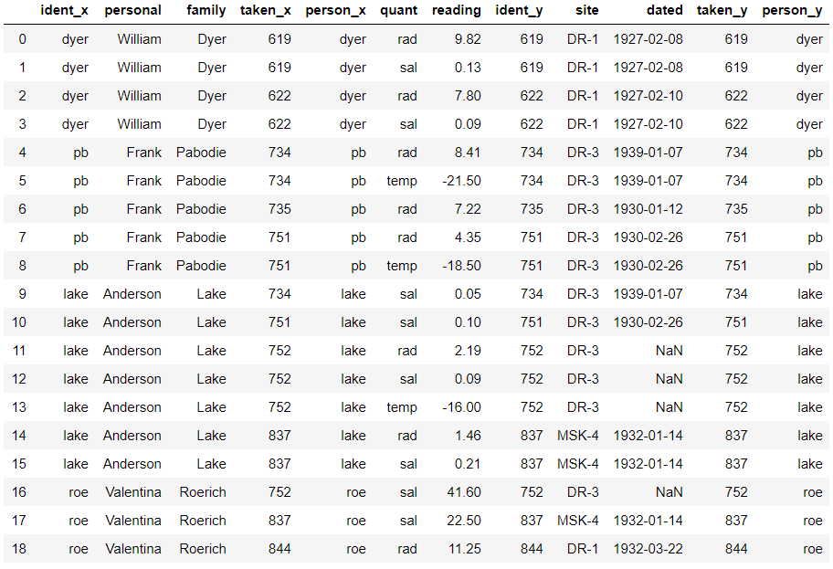


# 누락값 : NaN, NAN, nan 가능

```python
import numpy as np
np.NaN
# > nan

np.NAN
# > nan

np.nan
# > nan
```


## isnull, notnull 함수

```python
print(pd.isnull(np.NaN))
# > True
```

```python
df_left = pd.DataFrame({
    "KEY": ['K0', 'K1','K2', 'K3'],
    "A" : ['A0', 'A1', 'A2', 'A3'],
    "B" : [0.5, 1.0, 0.7, 1.5]
})
df_right = pd.DataFrame({
    "KEY": ['K2', 'K3','K4', 'K5'],
    "C" : ['C2', 'C3', 'C4', 'C5'],
    "D" : ['D2', 'D3', 'D4', 'D5']
})

df_left
df_right
```


- merge, KEY, outer

```python
df_all = df_left.merge(df_right, on="KEY", how="outer")
# pd.merge(df_left, df_right, how="outer", on="KEY")
df_all
```


- 데이터프레임 전체에 대해 결측값 확인
- df.isnull(), isnull(df)
- df.notnull(), notnull(df)

```python
pd.isnull(df_all)
# df_all.isnull()
```


```python
pd.notnull(df_all)
# df_all.notnull()
```


## 결측값 생성하기

```python
df_all.ix[[0,1],['A','B']]
```


```python
df_all.ix[[0,1],['A','B']] = np.NaN
df_all
```


```python
df_all.ix[[0,1],['A','B']] = None
df_all # B열은 수치데이터라 NaN, A열은 문자열이라 None으로 표기
```


```python
df_all[['A', 'B']]
```


```python
df_all[['A', 'B']].isnull()
```


```python
df_all.isnull()
```


## 행, 열 별 결측값 갯수 count

```python
df_all.isnull().sum() # column 별 결측값 갯수 count
# > KEY    0
# > A      4
# > B      4
# > C      2
# > D      2
# > dtype: int64
```

- A열의 결측값 개수 출력

```python
df_all['A'].isnull().sum()
# df_all.A.isnull().sum()
# > 4
```

- df_all 각 열별로 결측값이 아닌 개수 출력

```python
df_all.notnull().sum()
# > KEY    6
# > A      2
# > B      2
# > C      4
# > D      4
# > dtype: int64
```
- sum default : axis=0
```python
df_all.notnull().sum(axis=0)
# > KEY    6
# > A      2
# > B      2
# > C      4
# > D      4
# > dtype: int64
```

```python
df_all.notnull().sum(axis=1)
# > 0    1
# > 1    1
# > 2    5
# > 3    5
# > 4    3
# > 5    3
# > dtype: int64
```

- df_all 맨 우측에 Nan_cnt, NotNull_cnt 컬럼 추가

```python
df_all['Nan_cnt'] = df_all[['KEY', 'A', 'B', 'C', 'D']].isnull().sum(axis=1)
df_all['NotNull_cnt'] = df_all[['KEY', 'A', 'B', 'C', 'D']].notnull().sum(1) # '1'만 입력해도 'axis=1' 수행
df_all
```


- 결측값 : isnull(), notnull()
- 열단위 결측값 : df.isnull.sum()
- 행단위 결측값 : df.isnull.sum(1)


## NaN이 존재할 때 연산


```python
df = pd.DataFrame(np.arange(10).reshape(5,2))
df
```


```python
df = pd.DataFrame(np.arange(10).reshape(5,2),
                  index=['a', 'b', 'c', 'd', 'e'])
df
```


```python
df = pd.DataFrame(np.arange(10).reshape(5,2),
                  index=['a', 'b', 'c', 'd', 'e'], 
                  columns=['c1', 'c2'])
df
```


```python
df.loc[['b', 'e'], "c1"] = None
# df.ix[['b', 'e'], 'c1'] = np.NaN
# df.ix[[1,4], 0] = np.NaN # []안을 통일해서 사용할 것
# df.loc[['b', 'e'], 'c1'] = np.NaN
# df.iloc[[1,4], 0] = np.NaN
df
```


```python
df.ix[['b','c'], 'c2'] = None
df
```


- **sum**
- **NaN은 연산에서 제외**

```python
df.c1.sum()
# df['c1'].sum()
# > 10.0

df.sum()
# > c1    10.0
# > c2    17.0
# > dtype: float64
```

- **cumsum : 누적합 함수**

```python
df['c1'].cumsum()
# > a     0.0
# > b     NaN
# > c     4.0
# > d    10.0
# > e     NaN
# > Name: c1, dtype: float64
```

- **mean() : 평균, std() : 표준편차**

```python
df.mean()
# > c1    3.333333
# > c2    5.666667
# > dtype: float64

df.mean(1)
# > a    0.5
# > b    NaN
# > c    4.0
# > d    6.5
# > e    9.0
# > dtype: float64

df.std()
# > c1    3.055050
# > c2    4.163332
# > dtype: float64
```


## 데이터프레임을 구성하는 컬럼간 연산

- Series + Series는 요소간 덧샘
- **NaN이 하나라도 있으면 연산 결과가 NaN**

```python
df['c3'] = df['c1'] + df['c2']
df
```


```python
df2 = pd.DataFrame({
    'c1' : [1,1,1,1,1],
    'c4' : [1,1,1,1,1]},
    index = ['a', 'b', 'c', 'd', 'e'])

print(df2)
print("-"*20)
print(df)
# >    c1  c4
# > a   1   1
# > b   1   1
# > c   1   1
# > d   1   1
# > e   1   1
# > --------------------
# >     c1   c2    c3
# > a  0.0  1.0   1.0
# > b  NaN  NaN   NaN
# > c  4.0  NaN   NaN
# > d  6.0  7.0  13.0
# > e  NaN  9.0   NaN
```

- df, dff2 사이에 공통된 열이 c1
- c2, c3, c4는 공통되지 않는 열

```python
print(df+df2)
# >     c1  c2  c3  c4
# > a  1.0 NaN NaN NaN
# > b  NaN NaN NaN NaN
# > c  5.0 NaN NaN NaN
# > d  7.0 NaN NaN NaN
# > e  NaN NaN NaN NaN
```


### 결측값 대체

- 버릴껀 버리고 채울 수 있는 건 상황에 맞는 대체값을 구하여 입력

```python
df = pd.DataFrame(np.random.randn(5,3), 
                  columns=['c1', 'c2', 'c3'])
df
```


- df에서 0번 인덱스 c1에 NaN 입력

```python
df.ix[0, 0] = None
df
```


- df에서 [1, (c1, c2)]에 NaN 입력

```python
df.ix[1, [0,2]] = None
df
```


```python
df.ix[2, ['c2']] = None
df.ix[3, ['c2']] = None
df.ix[4, ['c3']] = None
df
```


#### 결측치를 특정값으로 대체

- **0**으로 대체

```python
df0 = df.fillna(0) # df 변경 X
df0
```


- NaN을 **missing**으로 대체

```python
df_mis = df.fillna("missing")
df_mis
```


- **forward 방법**으로 대체

```python
df.fillna(method='ffill')
```


- **backward 방법**으로 대체


```python
df.fillna(method='bfill')
```


#### limit 옵션

- limit 옵션 : limit=1 ; 하나만 채워라

```python
df.fillna(method="ffill", limit=1)
```


- NaN을 각 열의 **mean 값**으로 대체

```python
df.mean()
# > c1   -0.722173
# > c2    0.639902
# > c3    1.125994
# > dtype: float64

df.fillna(df.mean())
```


# 연습문제

## 1.

- A사무실에는 특정일자의 출퇴근 시간이 기록된 거대한 로그파일이 있다고 한다.
- 파일의 형식은 다음과 같다. (한 라인에서 앞부분은 출근시간(HH:MM:SS), 뒷부분은 퇴근시간이다)
- 09:12:23 11:14:35
- 10:34:01 13:23:40
- 10:34:31 11:20:10
- 특정시간을 입력(예:11:05:20)으로 주었을 때 그 시간에 총 몇 명이 사무실에 있었는지 알려주는 함수를 작성하시오.

### A.

```python
# 1.

def working_num(log, time) :
    # 출퇴근 로그파일을 DataFrame으로 변환
    work = pd.DataFrame(np.array(log.split()).reshape(3,2), 
                        columns=["go_work", "off_work"])

    # 시간 비교를 위하여 특정시간 데이터 변형
    re_time = int(''.join(time.split(":")))

    # 특정시간에 근무하고 있는 근무자 수 count
    working = 0
    for i in range(work.shape[0]) :
        # 시간 비교를 위하여 출, 퇴근 시간 데이터 변형
        s = int(''.join(work.iloc[i, 0].split(":")))
        e = int(''.join(work.iloc[i, 1].split(":")))
        # 특정시간에 근무중을 경우 count
        if s <= re_time <= e :
            working += 1

    print("{0}에 총 {1}명이 사무실에 있었습니다.".format(time, working))

log_file = """
09:12:23 11:14:35
10:34:01 13:23:40
10:34:31 11:20:10
"""

# 특정시간 입력
specific = input()

working_num(log_file, specific)
# > 11:05:20
# > 11:05:20에 총 3명이 사무실에 있었습니다.
```


## 2.

- [문제4] DashInsert
- DashInsert 함수는 숫자로 구성된 문자열을 입력받은 뒤, 문자열 내에서 홀수가 연속되면 두 수 사이에 - 를 추가하고, 짝수가 연속되면 * 를 추가하는 기능을 갖고 있다. 
- (예, 454 => 454, 4546793 => 454*67-9-3)
- DashInsert 함수를 완성하자.
- 입력 - 화면에서 숫자로 된 문자열을 입력받는다.
- 4546793
- 출력 - \*, -가 적절히 추가된 문자열을 화면에 출력한다.
- 454\*67-9-3

### A.

```python
# 2.
def DashInsert(num_str) :
    # 숫자로 구성된 문자열을 하나씩 숫자로 바꿔서 저장
    num_str = list(map(int, list(num_str)))
    
    # 추가한 문자 갯수 카운트
    insert_num = 0
    
    # 앞뒤 숫자 비교와 문자 추가를 위한 반복문
    for i in range(1, len(num_str)) :
        # 문자가 추가한 만큼 넘어가기
        i += insert_num
        
        # 앞뒤 숫자가 짝수일 경우 사이에 '*' 추가
        if (num_str[i-1]%2 == 0) & (num_str[i]%2 == 0) :
            num_str.insert(i, "*")
            insert_num += 1
        # 앞뒤 숫자가 홀수일 경우 사이에 '-' 추가
        elif (num_str[i-1]%2 != 0) & (num_str[i]%2 != 0) :
            num_str.insert(i, "-")
            insert_num += 1
            
    # 문자로 변환하여 join으로 연결
    res = ''.join(list(map(str, num_str)))
    
    return res

string = input('숫자열 : ')

print(DashInsert(string))
# > 숫자열 : 454679
# > 454*67-9
```


## 3. 타이타닉 데이터

1. 호칭 추출 -> 호칭 별 인원수 출력
   - ex) Mr. Mrs.

2. Age 컬럼에 결측값을 평균으로 대체
   - Age열의 최대/최소값
3. SP = SibSp + Parch
- SP열 추가

### A.

```python
# 3.
titanic = pd.read_csv('../train.csv')

# (1)
import re
pa = re.compile(', ([a-zA-Z ]+).')


# 모든 행의 호칭 출력
for i in range(titanic.shape[0]) :
    print(pa.findall(titanic.loc[int(i), "Name"]), end='\t')
```


```python
# 널리알려진 'Mr', 'Mrs', 'Miss'를 기본으로 데이터프레임 생성
name_title = pd.DataFrame(index = ["count"], 
                          columns=["Mr", "Mrs", "Miss"])

# count를 위한 DataFrame이므로 NaN에 0 대입
name_title = name_title.fillna(0)

# 모든 호칭에 대하여 반복문 수행
for i in range(titanic.shape[0]) :
    title = pa.findall(titanic.loc[i, "Name"])
    
    # name_title에 호칭이 없을 경우 만들고, 1 대입
    if title[0] not in name_title.columns :
        name_title[title[0]] = 1
        
    # name_title에 호칭이 있을 경우 count
    else : name_title[title[0]] += 1

name_title
```


```python
# (2)
titanic.Age = titanic.Age.fillna(titanic.Age.mean())
# titanic.Age.mean() = 29.758888888888887

max(titanic.Age)
# > 80.0

min(titanic.Age)
# > 0.42

# (3)
titanic["SP"] = titanic.SibSp + titanic.Parch
titanic[["SibSp", "Parch", "SP"]].head(20)
```


