[toc]

# Day18 딥러닝을 위한 빅데이터 기초 - 데이터 분석를 위한 NumPy, Pandas (5)


## 복습

```python
import pandas as pd
import numpy as np

df = pd.DataFrame(np.random.randn(5,3), 
                  columns=["c1", "c2", "c3"])
df
```

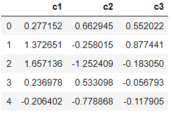

```python
df.iloc[0,0] = None

df.ix[1,['c1', 'c3']] = np.nan

df.ix[2,['c2']] = None
df.ix[3,['c2']] = None
df.ix[4,['c3']] = None
df
```

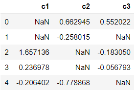

- NaN이 들어가 있는 자리를 모두 0으로 대체

```python
df.fillna(0)
```

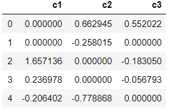

- `fillna`의 method
  - `ffill` : forward fill
  - `bfill` : backward fill
- NaN이 들어가 있는 자리를 각 열의 평균으로 대체

```python
df.fillna(df.mean())
```

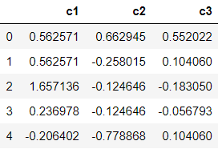

- where을 이용하여 결측값 대체 가능
  - df에서 notnull에 만족하는 데이터에 대햐여 df.mean()을 수행하여 결측값을 대체하라.

```python
df.where(pd.notnull(df), df.mean(), axis="columns")
```

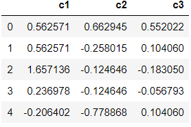


## where함수 사용법

```python
arr = np.array([1,2,3,10,20,30,0.1,0.2])
arr.min() # np.min(arr)
# > 0.1

np.argmin(arr) # 최소값의 index
# > 6

np.max(arr)
# > 30.0

np.argmax(arr) # 최대값의 index
# > 5
```

- where함수는 조건문을 사용하여 **조건문을 만족하는 index 도출**

```python
np.where(arr<1)
# > (array([6, 7], dtype=int64),)

np.where(arr>=10)
# > (array([3, 4, 5], dtype=int64),)
```

- **np.where(조건문, 참인 경우 수행, 거짓인 경우 실행)**

```python
np.where(arr>=10, 0, arr)
# > array([1. , 2. , 3. , 0. , 0. , 0. , 0.1, 0.2])

np.where(arr>=10, 0, 1)
# > array([1, 1, 1, 0, 0, 0, 1, 1])

np.where(arr>=10, arr*0.1, arr)
# > array([1. , 2. , 3. , 1. , 2. , 3. , 0.1, 0.2])

df.mean()['c1']
# > 0.5625708356961965

df.mean()['c1':'c2']
# > c1    0.562571
# > c2   -0.124646
# > dtype: float64
```

- 지정한 특정한 열만 대체 가능

```python
df.fillna(df.mean()['c1': 'c2'])
```

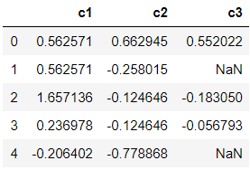

```python
df = pd.DataFrame({'c1' : [1,2,3,4,5],
                   'c2' : [6,7,8,9,10]})
df
```

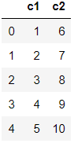

```python
df.ix[[1,3], ['c2']] = np.nan
df
```

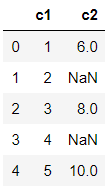

- c2p 열에는 
  - c2열 값이 notnull이면 c2열 값을, 
  - c2열 값이 null이면 c1열 값으로 채우고자 함.

```python
df['c2p'] = np.where(pd.notnull(df['c2'])==True, 
                     df['c2'], df['c1'])
df
```

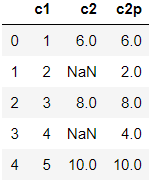

```python
# 반복문으로 표현하기
for i in range(len(df)) :
    if pd.notnull(df.loc[i, 'c2']) :
        df.loc[i, 'c2p'] = df.loc[i, 'c2']
    else :
        df.loc[i, 'c2p'] = df.loc[i, 'c1']
df

# or
for i in df.index:
    print(i)
# > 0
# > 1
# > 2
# > 3
# > 4

for i in df.index:
    if pd.notnull(df.ix[i, 'c2']) == True :
        df.ix[i, 'c2p'] = df.ix[i, 'c2']
    else :
        df.ix[i, 'c2p'] = df.ix[i, 'c1']
df
```

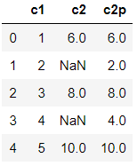


## dropna 메서드

- 행(axis=0)/열(axis=1) 제거

```python
df = pd.DataFrame({'c1' : [1,2,3,4,5],
                   'c2' : [6,7,8,9,10]})
df.ix[[1,3], ['c2']] = np.nan
df
```

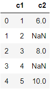

- **axis=0** ; 결측값이 있는 **행 전체** 제거

```python
df.dropna(axis=0)
```

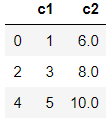

- **axis=1** ; 결측값이 있는 **열 전체** 제거

```python
df.dropna(axis=1)
```

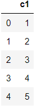

```python
df[['c1', 'c2']].dropna() # df.dropna(axis=0)
# default : axis=0
```

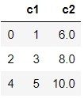

# 결측값 보간(interpolate)

- 시계열데이터에 대해 선형적으로 비례하는 값
- 이미지 보간에서는 그라데이션 효과와 비슷

- 시계열 데이터를 사용하기 위하여
- datetime 모듈에서 datetime 함수를 가져옴

```python
from datetime import datetime
dateStr = ['1/13/2020', '1/16/2020', '1/17/2020', '1/20/2020']
dates = pd.to_datetime(dateStr)
dates
# > DatetimeIndex(['2020-01-13', '2020-01-16', '2020-01-17', '2020-01-20'], dtype='datetime64[ns]', freq=None)

ts = pd.Series([1, np.nan, np.nan, 10], index=dates)
ts
# > 2020-01-13     1.0
# > 2020-01-16     NaN
# > 2020-01-17     NaN
# > 2020-01-20    10.0
# > dtype: float64

tslr = ts.interpolate()
# default :method = "linear" ; 선형적으로 비례하게 결측값을 보간
tslr # 결측치를 선형적으로 대체함
# > 2020-01-13     1.0
# > 2020-01-16     4.0
# > 2020-01-17     7.0
# > 2020-01-20    10.0
# > dtype: float64

ts.interpolate(method="linear") # default 확인
# > 2020-01-13     1.0
# > 2020-01-16     4.0
# > 2020-01-17     7.0
# > 2020-01-20    10.0
# > dtype: float64
```

- 시간에 따라 결측값을 보간

```python
ts.interpolate(method="time")
# > 2020-01-13     1.000000
# > 2020-01-16     4.857143
# > 2020-01-17     6.142857
# > 2020-01-20    10.000000
# > dtype: float64
```

- limit 옵션: 보간 갯수를 제한함.

```python
ts.interpolate(method="time", limit=1)
# > 2020-01-13     1.000000
# > 2020-01-16     4.857143
# > 2020-01-17          NaN
# > 2020-01-20    10.000000
# > dtype: float64
```

- **na를 대체 : fillna, replace**
- fillna : na를 다른 값으로 대체
- replace : na 뿐만 아니라 다른 모든 값에 대해서도 대체 가능
  - 결측값/실측값 대상 데이터 교체

```python
s = pd.Series([1,2,3,4,np.nan])
s
# > 0    1.0
# > 1    2.0
# > 2    3.0
# > 3    4.0
# > 4    NaN
# > dtype: float64
```


## replace

- replace : 결측값/실측값 변경

```python
s.replace(3,9) # 3을 9로 변경
# > 0    1.0
# > 1    2.0
# > 2    9.0
# > 3    4.0
# > 4    NaN
# > dtype: float64

s.replace(np.nan, 5) # NaN을 5로 변경
# > 0    1.0
# > 1    2.0
# > 2    3.0
# > 3    4.0
# > 4    5.0
# > dtype: float64

s.replace([1,2,3], [6,7,8]) # [1,2,3]을 [6,7,8]로 변경
# > 0    6.0
# > 1    7.0
# > 2    8.0
# > 3    4.0
# > 4    NaN
# > dtype: float64
```

```python
s = pd.Series([1,2,3,1,np.nan])
s.replace([1,2,3], [6,7,8])
# > 0    6.0
# > 1    7.0
# > 2    8.0
# > 3    6.0
# > 4    NaN
# > dtype: float64

s.replace([1,2,3,np.nan], [10,20,30,99])
# > 0    10.0
# > 1    20.0
# > 2    30.0
# > 3    10.0
# > 4    99.0
# > dtype: float64
```

- dictionary 형태로 replace 가능

```python
s.replace({1:5}) # {원래값:변경값}
# > 0    5.0
# > 1    2.0
# > 2    3.0
# > 3    5.0
# > 4    NaN
# > dtype: float64

s.replace({1:5, 3:30, np.nan:99})
# > 0     5.0
# > 1     2.0
# > 2    30.0
# > 3     5.0
# > 4    99.0
# > dtype: float64
```

- 데이터프레임에서 replace 적용

```python
df = pd.DataFrame({'c1':['aaa', 'b', 'c' ,'d'],
                   'c2':[1, 2, 3, 4],
                   'c3':[5, 6, 7, np.nan]})
df
```

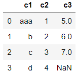

```python
df.replace({'c1':'aaa'}, {'c1':'bbb'})
```


```python
df.replace({'c3':np.nan}, {'c3':99})
```

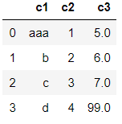

- 병합 : 중복 데이터 발생
- 중복데이터 여부 확인 : duplicated()
- 중복데이터 처리 : drop_dulplicates() ;한개만 남겨놓고 나머지는 제거

## duplicated()

```python
df = pd.DataFrame({
    'k1' : ['a', 'b', 'b', 'c', 'c'],
    'k2' : ['x', 'y', 'y', 'x', 'z'],
    'col' : [10, 20, 30, 40, 50]
})
df
```


- 'k1'열에서 중복된 값 찾기

```python
df.duplicated(['k1'])
# > 0    False
# > 1    False
# > 2     True
# > 3    False
# > 4     True
# > dtype: bool

df.duplicated(['k2'])
# > 0    False
# > 1    False
# > 2     True
# > 3     True
# > 4    False
# > dtype: bool
```

- 'k1'과 'k2' 모두에서 중복된 값 찾기

```python
df.duplicated(['k1', 'k2'])
# > 0    False
# > 1    False
# > 2     True
# > 3    False
# > 4    False
# > dtype: bool
```

```python
df.duplicated(['k1'], keep='first') # default : keep='first' ; 첫번째는 무조건 True
# > 0    False
# > 1    False
# > 2     True
# > 3    False
# > 4     True
# > dtype: bool

df.duplicated(['k1'], keep='last') # keep='last'; 마지막를 무조건 True
# > 0    False
# > 1     True
# > 2    False
# > 3     True
# > 4    False
# > dtype: bool

# keep=False : 중복된 값은 모두 True
df.duplicated(['k1'], keep=False)
# > 0    False
# > 1     True
# > 2     True
# > 3     True
# > 4     True
# > dtype: bool
```

```python
df = pd.DataFrame({
    'k1' : ['b', 'b', 'b', 'c', 'c'],
    'k2' : ['x', 'y', 'y', 'x', 'z'],
    'col' : [10, 20, 30, 40, 50]
})
df
```

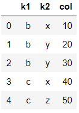

```python
df.duplicated(['k1'], keep='first')
# > 0    False
# > 1     True
# > 2     True
# > 3    False
# > 4     True
# > dtype: bool

df.duplicated(['k1'], keep='last')
# > 0     True
# > 1     True
# > 2    False
# > 3     True
# > 4    False
# > dtype: bool

df.duplicated(['k1'], keep=False)
# > 0    True
# > 1    True
# > 2    True
# > 3    True
# > 4    True
# > dtype: bool
```

## drop_duplicates

- 중복값 제거(1개만 살리고 나머지 중복은 제거)

```python
df.drop_duplicates(['k1']) # default : keep='first'
```

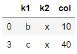

```python
df.drop_duplicates(['k1'], keep='first') # default 확인
```

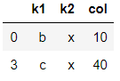

```python
df.drop_duplicates(['k1'], keep='last')
```

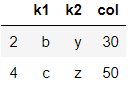

```python
df.drop_duplicates(['k1'], keep=False) # 모두 중복이므로 모든 데이터가 제거된다.
```

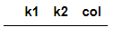

```python
df.drop_duplicates(['k1', 'k2'])
```

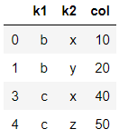

## unique()

- 유일한 값 : unique()

```python
df = pd.DataFrame({
    'a' : ['a1', 'a1', 'a2', 'a2', 'a3'],
    'b' : ['b1', 'b1', 'b2', 'b2', np.nan],
    'c' : [1 , 1, 3, 4, 4]
})
df
```


```python
df['a'].unique()
# > array(['a1', 'a2', 'a3'], dtype=object)

df['b'].unique() # nan도 unique한 값으로 처리됨
# > array(['b1', 'b2', nan], dtype=object)

df['c'].unique()
# > array([1, 3, 4], dtype=int64)
```

## value_counts()

- 유일한 값 개수 세기 : value_counts()

```python
help(pd.Series.value_counts)
```

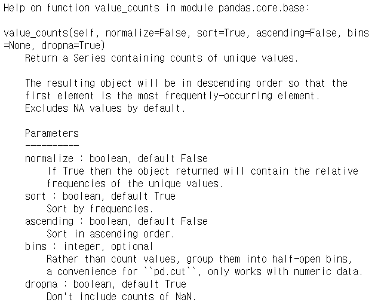

- normalize=디폴트(False) : 개수, True : 상대비율

```python
df['a'].value_counts()
# > a1    2
# > a2    2
# > a3    1
# > Name: a, dtype: int64

df['a'].value_counts(normalize=True)
# > a1    0.4
# > a2    0.4
# > a3    0.2
# > Name: a, dtype: float64
```

- sort=True : 개수를 기준으로 정렬
- ascending=Flase : 개수를 기준으로 내림차순 정렬, True : 오름차순

```python
df['a'].value_counts(sort=True, ascending=True)
# > a3    1
# > a2    2
# > a1    2
# > Name: a, dtype: int64
```
```python
df['c'].value_counts()
# > 4    2
# > 1    2
# > 3    1
# > Name: c, dtype: int64

df['c'].value_counts(sort=True, ascending=False) # 유일한 값의 개수를 기준으로 내림차순 정렬
# > 4    2
# > 1    2
# > 3    1
# > Name: c, dtype: int64

df['c'].value_counts(sort=True, ascending=True) # 유일한 값의 개수를 기준으로 오름차순 정렬
# > 3    1
# > 1    2
# > 4    2
# > Name: c, dtype: int64

df['c'].value_counts(sort=False) # 정렬 기준이 없음
# > 1    2
# > 3    1
# > 4    2
# > Name: c, dtype: int64
```
```python
df['b'].value_counts() # default : dropna=True ; na를 제외하고 count
# > b1    2
# > b2    2
# > Name: b, dtype: int64

df['b'].value_counts(dropna=False)
# > b1     2
# > b2     2
# > NaN    1
# > Name: b, dtype: int64
```

- group별 데이터 개수 세기

```python
df['c'] # 1 1 3 4 4
# > 0    1
# > 1    1
# > 2    3
# > 3    4
# > 4    4
# > Name: c, dtype: int64

df['c'].value_counts(sort=False)
# > 1    2
# > 3    1
# > 4    2
# > Name: c, dtype: int64
```

- bins : 구간을 나누는 옵션

```python
df['c'].value_counts(bins=[0,1,2,3,4,5], sort=False)
# > (-0.001, 1.0]    2
# > (1.0, 2.0]       0
# > (2.0, 3.0]       1
# > (3.0, 4.0]       2
# > (4.0, 5.0]       0
# > Name: c, dtype: int64
```

- df['c'].value_counts(bins=[0,1,2,3,4,5])와 동일한 결과를 나타내는 다른 코드

```python
res = pd.cut(df['c'], bins=[0,1,2,3,4,5])
res
# > 0    (0, 1]
# > 1    (0, 1]
# > 2    (2, 3]
# > 3    (3, 4]
# > 4    (3, 4]
# > Name: c, dtype: category
# > Categories (5, interval[int64]): [(0, 1] < (1, 2] < (2, 3] < (3, 4] < (4, 5]]

pd.value_counts(res)
# > (3, 4]    2
# > (0, 1]    2
# > (2, 3]    1
# > (4, 5]    0
# > (1, 2]    0
# > Name: c, dtype: int64
```

# 표준화

- 변수들 간 척도가 다른 경우 데이터 표준화
- 전체 집단이 어떠헌 특성을 가지고 있는지 알고 싶어한다.
  - 모집단 : 전체집단
- 하지만 전체 집단을 알 수 없으니 적절히 추출하여 분석을 실시한다.
  - 모집단에서 표본추출 -> 표본집단 평균, 표준편차, ... -> 통계량 => 모평균, 모분산(모수, parameter) 추정

- 모수적 방법
  - 중심극한정리 : 무작위로 복원추출하면, 연속형 자료의 편균에 대한 분포는 정규분포를 띈다면
  - 30개 이상의 표본의 경우에 정규분포를 따른다. 가정
- 비모수적 방법
  - 10개 미만의 표본의 경우에는 모수적 방법을 사용하지 못함
  - 자료를 크기로 나열 -> 순위 매김 => 차이 비교

- 표준화 : (각데이터-평균) / 표준편차
- 모집단이 정규분포를 따르는 경우에,
- 평균:0, 표준편차:1인 표준정규분포로 표준화하는 작업

1. `numpy`
2. `scipy.stats` : `zscore`
3. `sklearn.preprocessing`

## numpy

```python
from numpy import *
np.random.randint(30) # 0~29사이의 수 1개를 랜덤 추출
# > 5

data = np.random.randint(30, size=(6,5)) # 6행5열의 데이터 생성
data
# > array([[28, 25,  1, 16,  4],
# >        [18, 11, 25, 14,  3],
# >        [ 4,  1,  8,  5, 19],
# >        [12,  6, 13, 23, 27],
# >        [27,  7, 16, 23, 26],
# >        [25, 10,  2, 10,  5]])
```
- **표준화**
```python
data.mean(axis=0) # axis=0; 열, axis=1; 행
# = np.mean(data, axis=0)
# asix옵션을 주지 않을 경우 데이터 전체에 대한 평균값을 반환함
# > array([19.        , 10.        , 10.83333333, 15.16666667, 14.        ])

np.std(data, axis=0)
# > array([ 8.71779789,  7.43863787,  8.31497979,  6.5170716 , 10.32795559])

data_std = (data-data.mean(axis=0)) / np.std(data,axis=0)
data_std
# > array([[ 1.0323708 ,  2.01649822, -1.1826046 ,  0.12786929, -0.96824584],
# >        [-0.11470787,  0.13443321,  1.70375239, -0.17901701, -1.06507042],
# >        [-1.720618  , -1.20989893, -0.34075048, -1.56000537,  0.48412292],
# >        [-0.80295507, -0.53773286,  0.26057389,  1.20197135,  1.25871959],
# >        [ 0.91766294, -0.40329964,  0.62136852,  1.20197135,  1.161895  ],
# >        [ 0.6882472 ,  0.        , -1.06233972, -0.79278961, -0.87142125]])
```

- **표준화 결과 확인**
```python
np.mean(data_std, axis=0)
# > array([-3.70074342e-17,  0.00000000e+00, -1.11022302e-16,  1.11022302e-16,
# >        -1.85037171e-17])

np.std(data_std, axis=0)
# > array([1., 1., 1., 1., 1.])

np.var(data_std, axis=0)
# > array([1., 1., 1., 1., 1.])
```

- 내부적으로 broadcating 을 실시하여 연산을 위한 두개의 데이터의 사이즈를 맞춰주어서 연산이 가능하도록 만들어 줌.

- cf ) `np.var()` : 분산 구하는 함수


## scipy

```python
import scipy.stats as ss

data_ss = ss.zscore(data)
data_ss
# > array([[ 1.0323708 ,  2.01649822, -1.1826046 ,  0.12786929, -0.96824584],
# >        [-0.11470787,  0.13443321,  1.70375239, -0.17901701, -1.06507042],
# >        [-1.720618  , -1.20989893, -0.34075048, -1.56000537,  0.48412292],
# >        [-0.80295507, -0.53773286,  0.26057389,  1.20197135,  1.25871959],
# >        [ 0.91766294, -0.40329964,  0.62136852,  1.20197135,  1.161895  ],
# >        [ 0.6882472 ,  0.        , -1.06233972, -0.79278961, -0.87142125]])
```


## sklearn

```python
from sklearn.preprocessing import *

data_ft = StandardScaler().fit_transform(data)
data_ft
# > array([[ 1.0323708 ,  2.01649822, -1.1826046 ,  0.12786929, -0.96824584],
# >        [-0.11470787,  0.13443321,  1.70375239, -0.17901701, -1.06507042],
# >        [-1.720618  , -1.20989893, -0.34075048, -1.56000537,  0.48412292],
# >        [-0.80295507, -0.53773286,  0.26057389,  1.20197135,  1.25871959],
# >        [ 0.91766294, -0.40329964,  0.62136852,  1.20197135,  1.161895  ],
# >        [ 0.6882472 ,  0.        , -1.06233972, -0.79278961, -0.87142125]])
```

## 예외적인 값(이상치, 특이값, outlier)이 들어있는 데이터 표준화

- 표준정규분포로의 표준화 : 이상치, 특이값이 없어야 한다.
- z = (x-mean) / std

- 이상치가 데이터에 포함되어 있는 경우에는 표준화를 어떻게?
  1. 이상치, 특이값을 찾아서 제거 (모수적 방법)
     - 통상적으로 IQR(=Q3-Q1)*1.5의 범위를 넘어가는 수를 이상치라고 한다.
  2. 중앙값(median), IQR을 이용하여 스케일링 (비모수적 방법)


### 이상치가 있는 데이터 표준화


```python
from sklearn.preprocessing import StandardScaler, RobustScaler
import matplotlib.pyplot as plt
mu, sigma = 5, 2
x = mu + sigma * np.random.randn(100)
x
# > array([ 3.74824567,  3.9934645 ,  7.59336946,  2.88061531,  4.0140743 ,
# >         4.25139749,  6.2263649 ,  4.86251002,  7.34613869,  5.63174242,
# >         4.86760924,  3.27810971,  4.26361163,  5.03006097,  8.17885019,
# >         6.08914369,  6.27026674,  4.2330338 ,  1.89822355,  6.00520988,
# >         3.8314759 ,  3.44838091,  7.44358329,  4.16780629,  6.94241231,
# >         4.68559066,  4.64224907,  1.66874664,  2.1757576 ,  3.19012075,
# >         4.93682546,  6.42107669,  6.73441624,  5.76949234,  6.59775161,
# >         4.91418   ,  3.76686164,  5.61784229,  4.48580791,  0.9262623 ,
# >         3.28216178,  4.63685295,  3.01608494,  7.3061108 ,  6.73437239,
# >         1.61505377,  2.62828806,  7.42039007,  7.42529422,  2.92004676,
# >         3.62013243,  6.80397311,  3.13742208,  5.02070078,  5.27780825,
# >         5.33135525,  7.8895012 ,  2.18510438,  5.30005376,  3.03593478,
# >         5.87848387,  5.49523038,  6.18168002,  4.87607476,  5.96293959,
# >         2.04649059,  5.2327798 ,  3.85679111,  8.36651571,  1.56212219,
# >         4.42362647,  5.71974659,  8.13409103,  4.38689726,  7.02720682,
# >         7.16067584, 11.68015192,  5.4089103 ,  3.56507966,  4.70333054,
# >         6.2907781 ,  5.13798171, 10.62714373,  7.81448861,  4.9920713 ,
# >         4.88590386,  8.2088623 ,  3.99594798,  6.99611525,  6.04062035,
# >         3.87525176,  4.74841417,  1.87409861,  5.33162898,  2.16719373,
# >         1.79460526,  3.4691568 ,  6.83734719,  3.9162386 ,  3.10385445])

plt.hist(x)
# > (array([ 7.,  9., 18., 22., 20., 12., 10.,  0.,  0.,  2.]),
# >  array([ 0.9262623 ,  2.00165126,  3.07704022,  4.15242918,  5.22781814,
# >          6.30320711,  7.37859607,  8.45398503,  9.52937399, 10.60476296,
# >         11.68015192]),
# >  <a list of 10 Patch objects>)
```

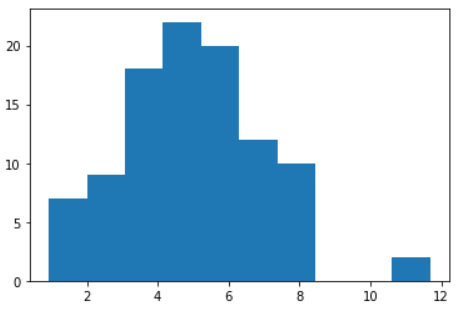

```python
np.mean(x)
# > 5.013918510034239

np.std(x)
# > 1.981568503977005
```
```python
x[98:100] = 100
x
# > array([  3.74824567,   3.9934645 ,   7.59336946,   2.88061531,
# >          4.0140743 ,   4.25139749,   6.2263649 ,   4.86251002,
# >          7.34613869,   5.63174242,   4.86760924,   3.27810971,
# >          4.26361163,   5.03006097,   8.17885019,   6.08914369,
# >          6.27026674,   4.2330338 ,   1.89822355,   6.00520988,
# >          3.8314759 ,   3.44838091,   7.44358329,   4.16780629,
# >          6.94241231,   4.68559066,   4.64224907,   1.66874664,
# >          2.1757576 ,   3.19012075,   4.93682546,   6.42107669,
# >          6.73441624,   5.76949234,   6.59775161,   4.91418   ,
# >          3.76686164,   5.61784229,   4.48580791,   0.9262623 ,
# >          3.28216178,   4.63685295,   3.01608494,   7.3061108 ,
# >          6.73437239,   1.61505377,   2.62828806,   7.42039007,
# >          7.42529422,   2.92004676,   3.62013243,   6.80397311,
# >          3.13742208,   5.02070078,   5.27780825,   5.33135525,
# >          7.8895012 ,   2.18510438,   5.30005376,   3.03593478,
# >          5.87848387,   5.49523038,   6.18168002,   4.87607476,
# >          5.96293959,   2.04649059,   5.2327798 ,   3.85679111,
# >          8.36651571,   1.56212219,   4.42362647,   5.71974659,
# >          8.13409103,   4.38689726,   7.02720682,   7.16067584,
# >         11.68015192,   5.4089103 ,   3.56507966,   4.70333054,
# >          6.2907781 ,   5.13798171,  10.62714373,   7.81448861,
# >          4.9920713 ,   4.88590386,   8.2088623 ,   3.99594798,
# >          6.99611525,   6.04062035,   3.87525176,   4.74841417,
# >          1.87409861,   5.33162898,   2.16719373,   1.79460526,
# >          3.4691568 ,   6.83734719, 100.        , 100.        ])

np.mean(x)
# > 6.943717579449942

np.std(x)
# > 13.438789765647147

plt.hist(x)
# > (array([97.,  1.,  0.,  0.,  0.,  0.,  0.,  0.,  0.,  2.]),
# >  array([  0.9262623 ,  10.83363607,  20.74100984,  30.64838361,
# >          40.55575738,  50.46313115,  60.37050492,  70.27787869,
# >          80.18525246,  90.09262623, 100.        ]),
# > X <a list of 10 Patch objects>)
```

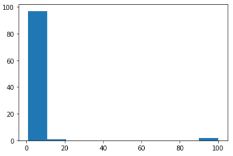

```python
plt.hist(x, bins=np.arange(0, 102, 2))
# > (array([ 7., 24., 36., 25.,  4.,  2.,  0.,  0.,  0.,  0.,  0.,  0.,  0.,
# >          0.,  0.,  0.,  0.,  0.,  0.,  0.,  0.,  0.,  0.,  0.,  0.,  0.,
# >          0.,  0.,  0.,  0.,  0.,  0.,  0.,  0.,  0.,  0.,  0.,  0.,  0.,
# >          0.,  0.,  0.,  0.,  0.,  0.,  0.,  0.,  0.,  0.,  2.]),
# >  array([  0,   2,   4,   6,   8,  10,  12,  14,  16,  18,  20,  22,  24,
# >          26,  28,  30,  32,  34,  36,  38,  40,  42,  44,  46,  48,  50,
# >          52,  54,  56,  58,  60,  62,  64,  66,  68,  70,  72,  74,  76,
# >          78,  80,  82,  84,  86,  88,  90,  92,  94,  96,  98, 100]),
# >  <a list of 50 Patch objects>)
```

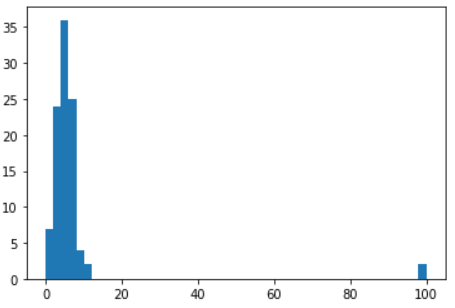

- `StandardScaler().fit_transform()` : **2차원**의 데이터에 대하여 적용 가능

```python
StandardScaler().fit_transform(x)
```

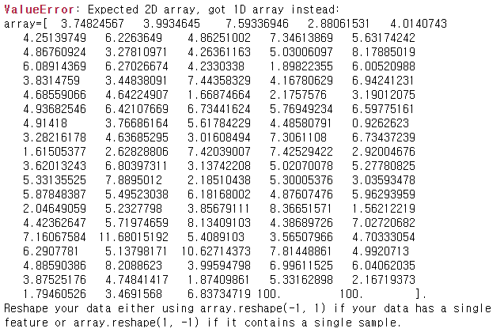

- (100, ) -> (100,1)로 바꿔주기
- type(x) : array이므로 reshape 가능

```python
x = x.reshape(100,1)
x.shape
# > (100, 1)

StandardScaler().fit_transform(x)
# > array([[-2.37779738e-01],
# >        [-2.19532647e-01],
# >        [ 4.83415463e-02],
# >        [-3.02341382e-01],
# >        ... ,
# >        [-2.58547149e-01],
# >        [-7.91517654e-03],
# >        [ 6.92445406e+00],
# >        [ 6.92445406e+00]])
```

----

### reshape 편하게 하기

```python
x = x.reshape(-1, 5) # 열만 지정해주면 알아서 계산해서 행이 들어간다.
x.shape
# > (20, 5)

x = x.reshape(-1, 1)
x.shape
# > (100, 1)
```

----

```python
ss_x = StandardScaler().fit_transform(x)
np.mean(ss_x)
# > 5.329070518200751e-17

np.std(ss_x)
# > 1.0

plt.hist(ss_x)
# > (array([97.,  1.,  0.,  0.,  0.,  0.,  0.,  0.,  0.,  2.]),
# >  array([-0.44776765,  0.28945452,  1.02667669,  1.76389887,  2.50112104,
# >          3.23834321,  3.97556538,  4.71278755,  5.45000972,  6.18723189,
# >          6.92445406]),
# >  <a list of 10 Patch objects>)
```

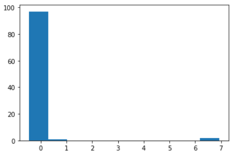

### 이상치 제거

```python
ss_x_z = ss_x[ss_x<5]
plt.hist(ss_x_z)
# > (array([ 7.,  9., 16., 22., 20., 12., 10.,  0.,  0.,  2.]),
# >  array([-0.44776765, -0.36774638, -0.28772512, -0.20770385, -0.12768259,
# >         -0.04766132,  0.03235994,  0.11238121,  0.19240248,  0.27242374,
# >          0.35244501]),
# >  <a list of 10 Patch objects>)
```

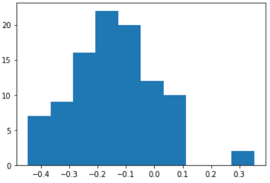

```python
plt.hist(ss_x_z, bins=arange(-1,1,0.1))
# > (array([ 0.,  0.,  0.,  0.,  0.,  2., 11., 22., 26., 20., 14.,  1.,  1.,
# >          1.,  0.,  0.,  0.,  0.,  0.]),
# >  array([-1.00000000e+00, -9.00000000e-01, -8.00000000e-01, -7.00000000e-01,
# >         -6.00000000e-01, -5.00000000e-01, -4.00000000e-01, -3.00000000e-01,
# >         -2.00000000e-01, -1.00000000e-01, -2.22044605e-16,  1.00000000e-01,
# >          2.00000000e-01,  3.00000000e-01,  4.00000000e-01,  5.00000000e-01,
# >          6.00000000e-01,  7.00000000e-01,  8.00000000e-01,  9.00000000e-01]),
# >  <a list of 19 Patch objects>)
```

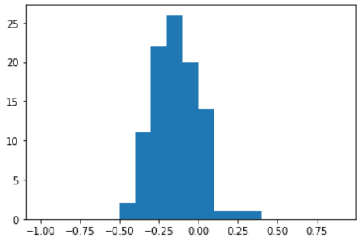


### sklearn.preprocessing.RobustScaler()

- 중앙값(median), IQR을 이용한 스케일링 방법
- 이상치 포함 데이터에 대한 중앙값, IQR을 이용하여 표준화 실시
- 이상치를 제거하고 표준화를 하는 것이 좋다.

```python
np.median(x) # 중앙값
# > 4.96444837948439

q1 = np.percentile(x, 25) # 1사분위수
q1
# > 3.7622076444183197

q3 = np.percentile(x, 75) # 3사분위수
q3
# > 6.465245422042264

iqr = q3 - q1
iqr
# > 2.703037777623944
```

```python
x_rs = RobustScaler().fit_transform(x)
x_rs
# > array([[-4.49939221e-01],
# >        [-3.59219502e-01],
# >        [ 9.72580220e-01],
# >        [-7.70922657e-01],
# > 	   ... ,
# >        [-5.53189300e-01],
# >        [ 6.92886656e-01],
# >        [ 3.51587952e+01],
# >        [ 3.51587952e+01]])

np.median(x_rs)
# > -1.6479873021779667e-16

np.mean(x_rs)
# > 0.732238822686893

np.std(x_rs)
# > 4.9717358288126725

plt.hist(x_rs)
# > (array([97.,  1.,  0.,  0.,  0.,  0.,  0.,  0.,  0.,  2.]),
# >  array([-1.49394364,  2.17133025,  5.83660413,  9.50187801, 13.1671519 ,
# >         16.83242578, 20.49769966, 24.16297354, 27.82824743, 31.49352131,
# >         35.15879519]),
# >  <a list of 10 Patch objects>)
```

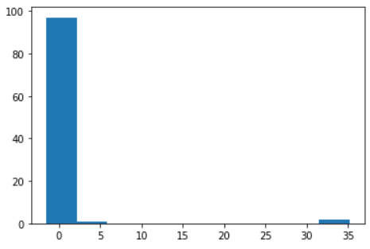

- 이상치 제거

````python
x_rs_z = x_rs[x_rs<10]
plt.hist(x_rs_z, bins=arange(-1,1,0.1))
# > (array([0., 1., 4., 4., 3., 6., 3., 6., 4., 8., 5., 6., 4., 4., 5., 1., 5.,
# >         3., 3.]),
# >  array([-1.00000000e+00, -9.00000000e-01, -8.00000000e-01, -7.00000000e-01,
# >         -6.00000000e-01, -5.00000000e-01, -4.00000000e-01, -3.00000000e-01,
# >         -2.00000000e-01, -1.00000000e-01, -2.22044605e-16,  1.00000000e-01,
# >          2.00000000e-01,  3.00000000e-01,  4.00000000e-01,  5.00000000e-01,
# >          6.00000000e-01,  7.00000000e-01,  8.00000000e-01,  9.00000000e-01]),
# >  <a list of 19 Patch objects>)
````


# 연습문제

## 1.

- NumPy를 사용하여 다음과 같은 행렬을 만든다.
  - `10 20 30 40`
  - `50 60 70 80`

### A.

```python
# 1.
np.array([[10,20,30,40],[50,60,70,80]])
# > array([[10, 20, 30, 40],
# >        [50, 60, 70, 80]])
```


## 2.

- 다음 행렬과 같은 행렬이 있다.

```python
m = np.array([[ 0,  1,  2,  3,  4],
              [ 5,  6,  7,  8,  9],
              [10, 11, 12, 13, 14]])
```

1. 이 행렬에서 값 7 을 인덱싱한다.
2. 이 행렬에서 값 14 을 인덱싱한다.
3. 이 행렬에서 배열 [6, 7] 을 슬라이싱한다.
4. 이 행렬에서 배열 [7, 12] 을 슬라이싱한다.
5. 이 행렬에서 배열 [[3, 4], [8, 9]] 을 슬라이싱한다.

### A.

````python
# 2.
m = np.array([[ 0,  1,  2,  3,  4],
              [ 5,  6,  7,  8,  9],
              [10, 11, 12, 13, 14]])
print("(1)", m[1,2])
print("(2)", m[-1,-1])
print("(3)", m[1, [1,2]])
print("(4)", m[[1,2], 2])
print("(5)", m[0:2, 3:5])
# > (1) 7
# > (2) 14
# > (3) [6 7]
# > (4) [ 7 12]
# > (5) [[3 4]
# >  [8 9]]
````


## 3.

- 다음 행렬과 같은 배열이 있다.

```python
x = np.array([1, 2, 3, 4, 5, 6, 7, 8, 9, 10,
              11, 12, 13, 14, 15, 16, 17, 18, 19, 20])
```

1. 이 배열에서 3의 배수를 찾아라.
2. 이 배열에서 4로 나누면 1이 남는 수를 찾아라.
3. 이 배열에서 3으로 나누면 나누어지고 4로 나누면 1이 남는 수를 찾아라.

### A.

```python
# 3.
x = np.array([1, 2, 3, 4, 5, 6, 7, 8, 9, 10,
              11, 12, 13, 14, 15, 16, 17, 18, 19, 20])
print("(1)", x[x%3 == 0])
print("(2)", x[x%4 == 1])
print("(3)", x[(x%3 == 0) &(x%4 == 1)])
# > (1) [ 3  6  9 12 15 18]
# > (2) [ 1  5  9 13 17]
# > (3) [9]
```


## 4. 타이타닉 데이터셋에서 Age , sibsp, parch, fare 컬럼에 대해 표준화 하시오.

1. 누락값에 대해서는 Age열은 평균 나이로 대체,
2. sibsp는 최대값으로 대체
3. parch는 최소값으로 대체
4. fare는 평균 요금으로 대체

### 1A.

```python
# 4.
titanic = pd.read_csv('../train.csv')

# (1)
age = array(titanic.Age.fillna(mean(titanic.Age)))
age_std = StandardScaler().fit_transform(age.reshape(-1,1))
plt.hist(age_std)
```


- 이상치를 제거한 후 표준화한 경우

```python
q1 = np.percentile(age.reshape(-1,1), 25)
print(q1)
q3 = np.percentile(age.reshape(-1,1), 75)
print(q3)
iqr = q3 - q1
print(iqr)
print(q1-1.5*iqr)
print(q3+1.5*iqr)
# > 22.0
# > 35.0
# > 13.0
# > 2.5
# > 54.5

# 2.5 = Q1 - (1.5*IQR)
# 54.5 = Q3 + (1.5*IQR)
age_re = age[(2.5 <= age) & (age <= 54.5)]
age_re = age_re.reshape(-1,1)
age_re_std = StandardScaler().fit_transform(age_re)
plt.hist(age_re_std)
```

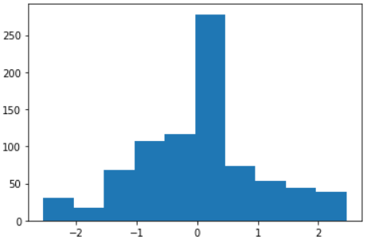


### 2A.

```python
# (2)
sibsp = array(titanic.SibSp.fillna(max(titanic.SibSp)))
sibsp_std = StandardScaler().fit_transform(sibsp.reshape(-1,1))
plt.hist(sibsp_std)
```

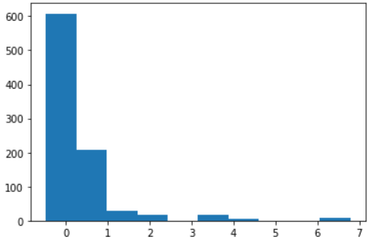

```python
plt.hist(sibsp_std[sibsp_std<5])
```

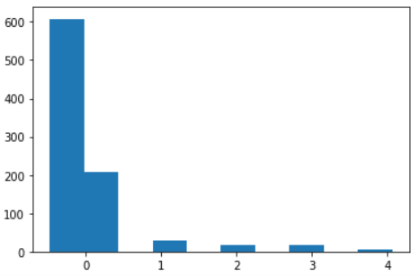

- 이상치를 제거한 후 표준화한 경우

```python
q1 = np.percentile(sibsp.reshape(-1,1), 25)
print(q1)
q3 = np.percentile(sibsp.reshape(-1,1), 75)
print(q3)
iqr = q3 - q1
print(iqr)
print(q1 - 1.5*iqr)
print(q3 + 1.5*iqr)
# > 0.0
# > 1.0
# > 1.0
# > -1.5
# > 2.5

# -1.5 = Q1 - (1.5*IQR)
# 2.5 = Q3 + (1.5*IQR)
sibsp_re = sibsp[(-1.5 <= sibsp) & (sibsp <= 2.5)]
sibsp_re = sibsp_re.reshape(-1,1)
sibsp_re_std = StandardScaler().fit_transform(sibsp_re)
plt.hist(sibsp_re_std)
```

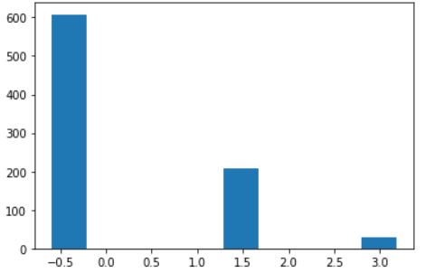


### 3A.

```python
# (3)
parch = array(titanic.Parch.fillna(min(titanic.Parch)))
parch_std = StandardScaler().fit_transform(parch.reshape(-1,1))
plt.hist(parch_std)
```

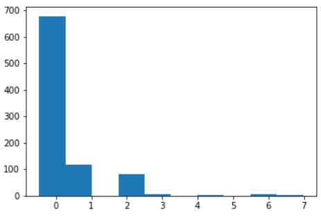

```python
plt.hist(parch_std[parch_std<5])
```

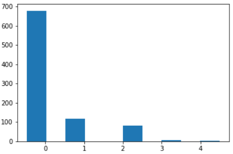

- 값이 너무 0에 모여있어서 IQR 방식으로 하면 안됨.

```python
q1 = np.percentile(parch.reshape(-1, 1), 25)
print(q1)
q3 = np.percentile(parch.reshape(-1, 1), 75)
print(q3)
iqr = q3 - q1
print(iqr)
print(q1 - 1.5*iqr)
print(q3 + 1.5*iqr)
# > 0.0
# > 0.0
# > 0.0
# > 0.0
# > 0.0

plt.hist(parch)
```

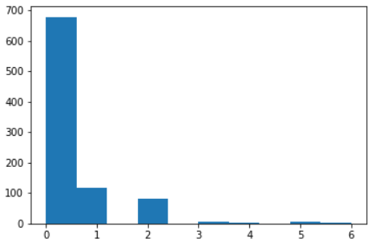


### 4A.

```python
# (4)
fare = array(titanic.Fare.fillna(mean(titanic.Fare)))
fare_std = StandardScaler().fit_transform(fare.reshape(-1,1))
plt.hist(fare_std)
```

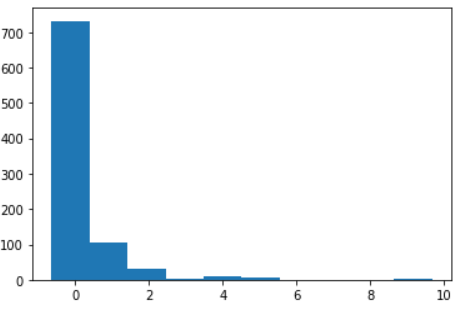

```python
plt.hist(fare_std[fare_std<6])
```

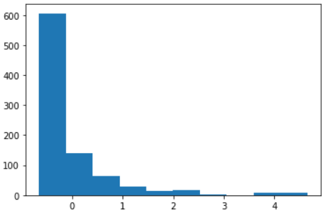

```python
q1 = np.percentile(fare.reshape(-1, 1), 25)
print(q1)
q3 = np.percentile(fare.reshape(-1, 1), 75)
print(q3)
iqr = q3 - q1
print(iqr)
print(q1 - 1.5*iqr)
print(q3 + 1.5*iqr)
# > 7.9104
# > 31.0
# > 23.0896
# > -26.724
# > 65.6344

# -26.724= Q1 - (1.5*IQR)
# 65.6344 = Q3 + (1.5*IQR)
fare_re = fare[(-26.724 <= fare) & (fare <= 65.6344)].reshape(-1,1)
fare_re_std = StandardScaler().fit_transform(fare_re)
plt.hist(fare_re_std)
```

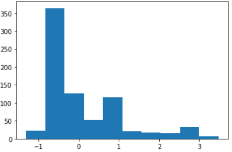