# Day19 딥러닝을 위한 빅데이터 기초 - 데이터 분석를 위한 NumPy, Pandas (6)

# 정규화

- 0과 1사이의 범위로 데이터를 표준화

- 5 3 1 7 9 => 0~1 => 각데이터값-최소값 / 최대값-최소값
- 5-1 / 9-1 => 0.5
- 3-1 / 9-1 => 0.25
- 1-1 / 9-1 => 0
- 7-1 / 9-7 => 0.75
- 9-1 / 9-1 => 1


```python
import numpy as np
import pandas as pd

data = np.array([[10, -10, 2],
                 [5, 0, 6],
                 [0, 7, 4]])
data
# > array([[ 10, -10,   2],
# >        [  5,   0,   6],
# >        [  0,   7,   4]])
```

- **직접 계산**

```python
print(data.max()) # data 배열 전체에서 최대값
print(data.max(axis = 0)) # 각 열 단위 최대값
print(data.max(axis = 1)) # 각 행 단위 최대값
# > 10
# > [10  7  6]
# > [10  6  7]

data.max(axis=0) - data.min(axis=0) # 분모
# > array([10, 17,  4])

data_mm = (data - data.min(axis=0)) / (data.max(axis=0) - data.min(axis=0)) # 정규화
data_mm
# > array([[1.        , 0.        , 0.        ],
# >        [0.5       , 0.58823529, 1.        ],
# >        [0.        , 1.        , 0.5       ]])
```

- **모듈 사용**

```python
from sklearn.preprocessing import MinMaxScaler

mms = MinMaxScaler()
data_mms = mms.fit_transform(data)
data_mms
# > array([[1.        , 0.        , 0.        ],
# >        [0.5       , 0.58823529, 1.        ],
# >        [0.        , 1.        , 0.5       ]])
```

- **함수 사용**

```python
from sklearn.preprocessing import minmax_scale

datamm = minmax_scale(data, axis=0)
datamm
# > array([[1.        , 0.        , 0.        ],
# >        [0.5       , 0.58823529, 1.        ],
# >        [0.        , 1.        , 0.5       ]])
```

# 이항변수화

- 변수를 0 or 1로 변환

## 바이너라이저

- 바이너라이저 : 연속형 변수를 기준이하->0, 기준초과 ->1

- 확률변수 X가 이항분포를 따른다고 했을 때, 0 or 1 값을 갖는 이항변수화가 필요하다.

- 베르누이시행
  - 성공(1), 실패(0) 두가지 경우만 발생
  - 성공확률이 p인 베르누이 시행을 n번 수행.
  - 성공하는 횟수를 x라고 하면, 확률변수 x는 모수 n과 p인 이항분포를 따른다. 
  - ex)
    - 주사위 : 3 성공, not 3 실패
    - 3이 나올 확률(성공) : 1/6
    - 실패 : 5/6
    - A, B, C, D
    - (A만 성공, B만 성공, C만 성공, D만 성공)
      - A만 성공 : (1/6) \* ((5/6)^3) = 0.09
      - B만 성공 : (1/6) \* ((5/6)^3) = 0.09
      - C만 성공 : (1/6) \* ((5/6)^3) = 0.09
      - D만 성공 : (1/6) \* ((5/6)^3) = 0.09
      - 0.09\*4 = 0.36
    - 성공확률(p) \* 시나리오수(n)

- **모듈 사용**

```python
from sklearn.preprocessing import Binarizer

data
# > array([[ 10, -10,   2],
# >        [  5,   0,   6],
# >        [  0,   7,   4]])

bina = Binarizer().fit(data)
bina # threshold : 0과 1을 나누는 기준 값
# > Binarizer(copy=True, threshold=0.0)

Binarizer(threshold=5).fit(data)
# > Binarizer(copy=True, threshold=5)

bina.transform(data)
# > array([[1, 0, 1],
# >        [1, 0, 1],
# >        [0, 1, 1]])

bina = Binarizer(threshold=5).fit(data) # 기준점 이하는 0
bina.transform(data)
# > array([[1, 0, 0],
# >        [0, 0, 1],
# >        [0, 1, 0]])

bina = Binarizer(threshold=4.5).fit(data)
bina.transform(data)
# > array([[1, 0, 0],
# >        [1, 0, 1],
# >        [0, 1, 0]])
```

- **함수 사용**

```python
from sklearn.preprocessing import binarize

data
# > array([[ 10, -10,   2],
# >        [  5,   0,   6],
# >        [  0,   7,   4]])

binarize(data)
# > array([[1, 0, 1],
# >        [1, 0, 1],
# >        [0, 1, 1]])

binarize(data, threshold=5)
# > array([[1, 0, 0],
# >        [0, 0, 1],
# >        [0, 1, 0]])
```

- cf ) copy 옵션

```python
binarize(data, copy=True) # default: copy=Ture
# > array([[1, 0, 1],
# >        [1, 0, 1],
# >        [0, 1, 1]])

data
# > array([[ 10, -10,   2],
# >        [  5,   0,   6],
# >        [  0,   7,   4]])

binarize(data, copy=False)
# > array([[1, 0, 1],
# >        [1, 0, 1],
# >        [0, 1, 1]])

data
# > array([[1, 0, 1],
# >        [1, 0, 1],
# >        [0, 1, 1]])
```

- `copy=False`이면, 원본 데이터로 `binarize`하기 때문에 원본이 변경된다.


## 원핫인코더

- 바이너라이저 : 연속형변수를 이항변수화
- 원핫인코더 : 범주형 변수를 이항변수화

- 연령대 : 20대->0, 30대->1, 40대->2
- 성별 : 남->0, 여->1
- 학점 : A->0, B->1, C->2, D->3, F->4
  - 학점
    - 0 1 2 3 4
    - 1 0 0 0 0 (A)
    - 0 1 0 0 0 (B)
    - ...
    - 0 0 0 0 1 (F)
- 20대 여성 B
  - 100 01 01000
- 30대 남성 D
  - 010 10 00010

```python
from sklearn.preprocessing import OneHotEncoder

data = np.array([[0,0,0], # [성별, 연령, 학점]
                 [0,1,1],
                 [0,2,2],
                 [1,0,3],
                 [1,1,4],])
ohe = OneHotEncoder()
ohe.fit(data)
# > OneHotEncoder(categorical_features=None, categories=None, drop=None,
# >               dtype=<class 'numpy.float64'>, handle_unknown='error',
# >               n_values=None, sparse=True)

ohe.active_features_
# > array([0, 1, 2, 3, 4, 5, 6, 7, 8, 9], dtype=int64)
# (0,1)성별, (2,3,4)연령대, (5,6,7,8,9)학점을 의미

ohe.n_values_
# > array([2, 3, 5])
# 각 범주의 갯수

ohe.feature_indices_
# > array([ 0,  2,  5, 10], dtype=int32)
# 성별 : 0이상 2미만,
# 연령 : 2이상 5미만,
# 학점 : 5이상 10미만
```

- 번주형 데이터 -> 이항변수화

```python
data = np.array([[1,2,3]]) # 여성 40대 D 학점
ohe.transform(data)
# > <1x10 sparse matrix of type '<class 'numpy.float64'>'
# > 	with 3 stored elements in Compressed Sparse Row format>
```

- 결과확인

```python
ohe.transform(data).toarray()
# > array([[0., 1., 0., 0., 1., 0., 0., 0., 1., 0.]])
#          | 성별  |   연령    |       학점        |
```


# random number set seed

- seed number 설정 ; 동일한 random number를 발생하기 위해 사용

```python
np.random.randn(1)
# > array([0.34872678])

np.random.seed(10)
np.random.randn(1)
# > array([1.3315865])
# 두 문장을 같이 실행할 경우 계속 같은 random number 발생
```


# 이산화

- `np.digitize`함수, `np.where` 함수 : 연속형 변수 -> 이산화

- 이항변수화 : 0또는 1값을 갖는 변수를 만드는 것
- 이산화 : 연속형 변수를 2개 이상의 범주를 갖는 변수로 변환
  - ex) 점수 : 75 -> A/B/C/D/F(범주=category)

```python
df = pd.DataFrame({'C1': np.random.randn(20),
   'C2': ['a', 'a', 'a', 'a', 'a', 'a', 'a', 'a', 'a', 'a',
   'b', 'b', 'b', 'b', 'b', 'b', 'b', 'b', 'b', 'b']})
df
```

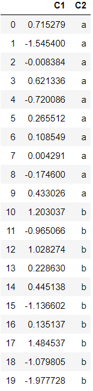

- df의 c1열 20개 data 구성
- 10개의 bin으로 구간을 균등하게 나눔

```python
df.C1.min()
# > -1.977728280657907

df.C1.max()
# > 1.4845370018365822
```

- `np.linspace()` : 선형공간의 의미로, **구간을 균등하게 분할해줌**

```python
bins = np.linspace(df.C1.min(), df.C1.max(), 10)
bins
# > array([-1.97772828, -1.59303214, -1.208336  , -0.82363985, -0.43894371,
# >        -0.05424757,  0.33044857,  0.71514472,  1.09984086,  1.484537  ])

df['C1_bin'] = np.digitize(df['C1'], bins)
df # 마지막구간 : [최대값, 무한대)
```

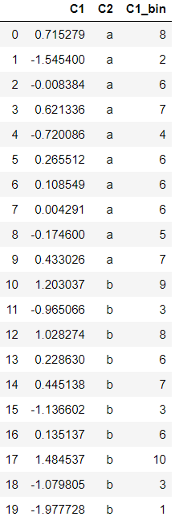

- 구간별로 요약통계, 범주간 평균 차이
- 독립성검정, indexing, ... 가능

- 그룹화 객체생성

```python
df.groupby("C1_bin")
# > <pandas.core.groupby.generic.DataFrameGroupBy object at 0x00000279D7ECE348>
```

- 각 그룹간의 갯수를 셀 수 있다.

```python
df.groupby("C1_bin")["C1"].size()
# "C1_bin"의 값을 기준으로 생성한 그룹을 이용하여 각 그룹에 해당하는 "C1"의 갯수
# > C1_bin
# > 1     1
# > 2     1
# > 3     3
# > 4     1
# > 5     1
# > 6     6
# > 7     3
# > 8     2
# > 9     1
# > 10    1
# > Name: C1, dtype: int64

df.groupby("C1_bin")["C1"].mean() 
# "C1_bin"으로 생성한 그룹으로 "C1"의 평균
# > C1_bin
# > 1    -1.977728
# > 2    -1.545400
# > 3    -1.060491
# > 4    -0.720086
# > 5    -0.174600
# > 6     0.122289
# > 7     0.499833
# > 8     0.871777
# > 9     1.203037
# > 10    1.484537
# > Name: C1, dtype: float64

df.groupby("C1_bin")["C1"].std()
# "C1_bin"으로 생성한 그룹으로 "C1"의 표준편차(갯수가 1개인 경우, 표준편차를 계산할 수 없으므로 NaN 발생)
# > C1_bin
# > 1          NaN
# > 2          NaN
# > 3     0.087384
# > 4          NaN
# > 5          NaN
# > 6     0.112404
# > 7     0.105399
# > 8     0.221321
# > 9          NaN
# > 10         NaN
# > Name: C1, dtype: float64

df.groupby("C1_bin")["C2"].value_counts()
# "C1_bin"열을 기준으로 그룹화하고 "C2"열을 참조하여 count
# > C1_bin  C2
# > 1       b     1
# > 2       a     1
# > 3       b     3
# > 4       a     1
# > 5       a     1
# > 6       a     4
# >         b     2
# > 7       a     2
# >         b     1
# > 8       a     1
# >         b     1
# > 9       b     1
# > 10      b     1
# > Name: C2, dtype: int64

df[df['C1_bin'] == 4]
```

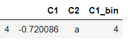


## pd.get_dummies() 

- pd.get_dummies() : 가변수 생성 함수

```python
df['C1_bin']
# > 0      8
# > 1      2
# > 2      6
# > 3      7
# > 4      4
# > 5      6
# > 6      6
# > 7      6
# > 8      5
# > 9      7
# > 10     9
# > 11     3
# > 12     8
# > 13     6
# > 14     7
# > 15     3
# > 16     6
# > 17    10
# > 18     3
# > 19     1
# > Name: C1_bin, dtype: int64

pd.get_dummies(df['C1_bin'])
```

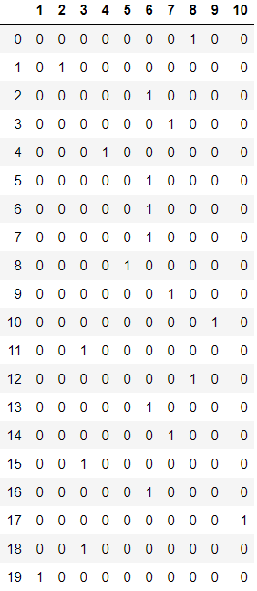

- 모델 = 가중치*x1 + 가중치*x2 + ... + 가중치*x10 + 바이스

```python
pd.get_dummies(df['C1_bin'], prefix='C1') # 접두어 옵션
```

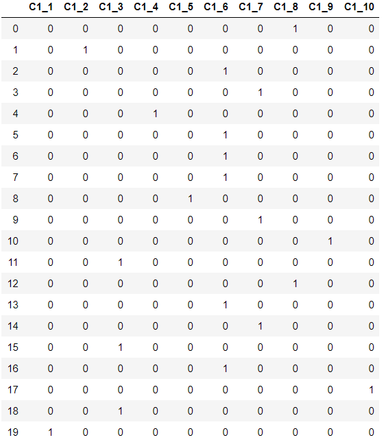


## np.where()

```python
df['C1'] > df['C1'].mean()
# > 0      True
# > 1     False
# > 2      True
# > 3      True
# > 4     False
# > 5      True
# > 6      True
# > 7      True
# > 8     False
# > 9      True
# > 10     True
# > 11    False
# > 12     True
# > 13     True
# > 14     True
# > 15    False
# > 16     True
# > 17     True
# > 18    False
# > 19    False
# > Name: C1, dtype: bool

df['h_l'] = np.where(df['C1'] > df['C1'].mean(), 'high', 'low')
df
```

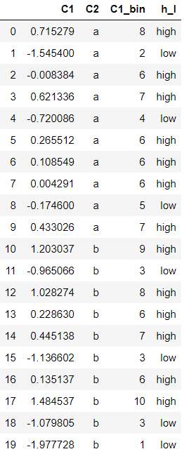

```python
df.groupby('h_l')['C1'].size()
# > h_l
# > high    13
# > low      7
# > Name: C1, dtype: int64

df.groupby('h_l')['C1'].mean()
# > h_l
# > high    0.512643
# > low    -1.085612
# > Name: C1, dtype: float64

df.groupby('h_l')['C1'].std()
# > h_l
# > high    0.476821
# > low     0.575615
# > Name: C1, dtype: float64
```

```python
q1 = np.percentile(df['C1'], 25)
q3 = np.percentile(df['C1'], 75)
```

- 연습문제
  - if C1열 값이 <= Q1 then df['h_m_l'] = "l"
  - elif Q1 < C1열 값 <= Q3 then df['h_m_l'] = "m"
  - else then df['h_m_l'] = "h"

```python
df['h_m_l'] = np.where(df['C1'] <= q1, "l",
                      np.where(df['C1'] <= q3, "m", "h"))
# df['h_m_l'] = np.where(df['C1'] >= q3, "high", 
#                     np.where(df['C1']>=q1,"medium","low"))
df
```

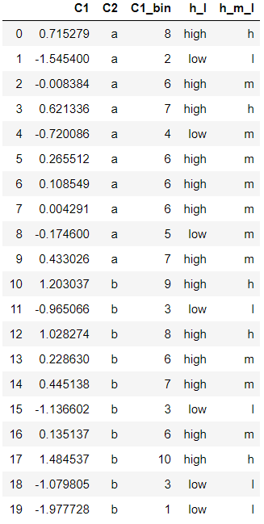

```python
df.groupby('h_m_l')['C1'].size()
# > h_m_l
# > h     5
# > l     5
# > m    10
# > Name: C1, dtype: int64
```


## cut(), qcut()

- 실수 데이터 -> 카테고리화

### cut()

- cut() : 실수 값의 경계 지정

```python
ages = [0,2,10,21,23,37,31,61,20,42,32,100]
bins = [1,15,25,35,60,99]
labels = ["미성년자", "청년", "중년", "장년", "노년"]
cats = pd.cut(ages, bins, labels=labels)
cats # 0과 100은 범주에 들어가지 못해 NaN 발생
# > [NaN, 미성년자, 미성년자, 청년, 청년, ..., 노년, 청년, 장년, 중년, NaN]
# > Length: 12
# > Categories (5, object): [미성년자 < 청년 < 중년 < 장년 < 노년]

cats.categories
# > Index(['미성년자', '청년', '중년', '장년', '노년'], dtype='object')

cats.codes # 각 데이터가 해당되는 범주
# > array([-1,  0,  0,  1,  1,  3,  2,  4,  1,  3,  2, -1], dtype=int8)
```

```python
df = pd.DataFrame(ages, columns=["ages"])
df
```

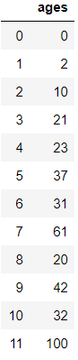

```python
df['age_cat'] = pd.cut(ages, bins, labels=labels)
df
```

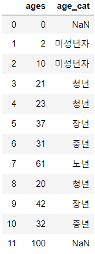

### qcut()

- qcut() : 똑같은 구간으로 나눔

```python
data = np.random.randn(100)
data
# > array([ 1.79587702,  2.12415669,  1.57222241,  0.43429526, -0.98623764,
# >        -0.00907445,  0.4437856 ,  0.01401076, -0.90851245,  1.81532293,
# >         0.25119689,  1.60177262,  0.8367563 ,  0.21322714, -0.40844951,
# >         0.52227217,  0.61251281, -0.54072313, -2.59084478, -0.23579795,
# >         0.20683116,  0.89558272, -0.13896205,  0.61755122,  1.65913544,
# >        -0.99156849, -0.29106287, -1.51702175,  1.39794941,  0.00788356,
# >         0.30262266,  0.00922551, -0.11720712,  2.18902134, -0.69961265,
# >         0.151243  ,  0.96745013,  0.80910842,  1.68327174,  1.04848807,
# >        -0.95715358,  0.61772115,  0.30153547,  0.77133177,  1.05041213,
# >         2.49245382,  0.65410821, -0.02116572,  0.04984467,  2.10535481,
# >        -1.06347074,  2.4451962 ,  0.47040755, -1.01831197, -0.29914241,
# >        -1.30067997,  1.17936254, -0.47065155,  0.78443096, -0.13767896,
# >         0.11224116, -0.37817489,  0.55148436, -1.91245912,  0.16587623,
# >         1.55290537,  0.46653243, -0.24279483,  0.52175079, -0.08175358,
# >        -2.20282413, -0.80806059, -2.12973581, -1.28645005, -1.13719732,
# >         0.36522408, -0.71360171, -0.32775323,  0.77020073,  1.61720682,
# >         0.78123494,  0.16596178, -0.64395048,  1.06000915,  0.96104739,
# >         0.10160058,  0.67306295, -1.27097317,  0.43426851,  0.52122571,
# >        -0.23942242,  0.68334236, -1.26863104, -0.81510319,  0.88581078,
# >        -0.01216231, -0.30412596,  0.06410684, -1.10475709, -1.17123332])

cats = pd.qcut(data, 4, labels=['Q1', 'Q2', 'Q3', 'Q4'])
cats
# > [Q4, Q4, Q4, Q3, Q1, ..., Q2, Q2, Q2, Q1, Q1]
# > Length: 100
# > Categories (4, object): [Q1 < Q2 < Q3 < Q4]

pd.value_counts(cats)
# > Q4    25
# > Q3    25
# > Q2    25
# > Q1    25
# > dtype: int64
```


# 데이터 재구조화

- 피벗테이블(pivot, pivot_table)
- 스텍(stack, unstack)
- 멜트(melt)
- wide_to_long, crosstab


## pivot, pivot_table

- pivot : pd.DataFrame안에 있음
- pivot_table : Pandas(=pd)에 있음

```python
data = pd.DataFrame({'cust_id': ['c1', 'c1', 'c1', 'c2', 'c2', 'c2', 'c3', 'c3', 'c3'], # 고객 id
    'prod_cd': ['p1', 'p2', 'p3', 'p1', 'p2', 'p3', 'p1', 'p2', 'p3'], # 상품 번호
    'grade' : ['A', 'A', 'A', 'A', 'A', 'A', 'B', 'B', 'B'], # 상품 등급
    'pch_amt': [30, 10, 0, 40, 15, 30, 0, 0, 10]}) # 상품 수량
data
```

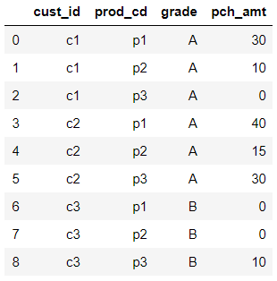

 

|      | p1   | p2   | p3   |
| ---- | ---- | ---- | ---- |
| c1   | 30   | 10   | 0    |
| c2   | 40   | 15   | 30   |
| c3   | 0    | 0    | 10   |

- 으로 재구조화

```python
data.pivot(index="cust_id", columns="prod_cd", 
           values="pch_amt")
# index:행, columns:열, values:테이블 안의 값
```

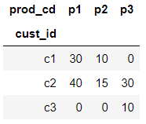

```python
pd.pivot_table(data, index="cust_id", columns="prod_cd", values="pch_amt")
# or
# data.pivot_table(index="cust_id", columns="prod_cd", values="pch_amt")
```

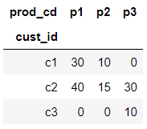

- **pivot_table로만 가능한 기능이 존재**하여, pivot보다 pivot_table를 아는 것이 좋다.

- 행인덱스를 계층적으로 2개의 열로 구성하고 싶을 때

```python
data.pivot(index=['cust_id', 'grade'], columns='prod_cd', 
           values='pch_amt') # Error 발생
```

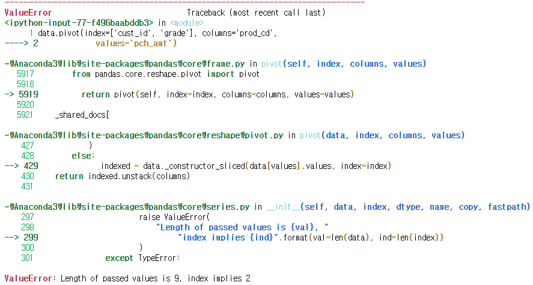

```python
pd.pivot_table(data, index=['cust_id', 'grade'], 
               columns='prod_cd', values='pch_amt')
```

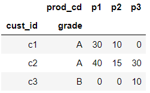

- 열 인덱스를 계층적으로 2개의 열로 구성하고 싶을 때

```python
pd.pivot_table(data, index='cust_id', 
               columns=['grade', 'prod_cd'], 
               values='pch_amt')
```

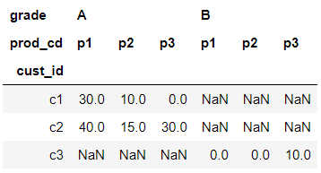

- **pivot_table : 집계함수(aggfunc) 제공**

```python
pd.pivot_table(data, index='grade', columns='prod_cd', 
               values='pch_amt')
# default : 평균
```

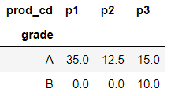

- default 확인

```python
pd.pivot_table(data, index='grade', columns='prod_cd', 
               values='pch_amt', aggfunc=np.mean)
```

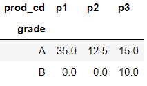

```python
pd.pivot_table(data, index='grade', columns='prod_cd', 
               values='pch_amt', aggfunc=np.sum)
```

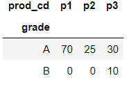

- pivot은 집계함수를 제공하지 않음

```python
data.pivot(index='grade', columns='prod_cd', 
               values='pch_amt', aggfunc=np.sum)
```

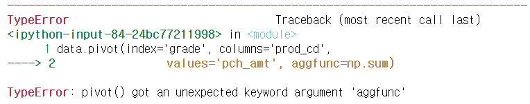

- => pivot 함수도 있다는 것은 알고, pivot_table을 주로 사용하자.


## stack

- stack() : 위에서 아래로 쌓는 것
- unstack() : 쌓여 있는 것을 옆으로 놓는 것(L -> R)

```python
mul_index = pd.MultiIndex.from_tuples([('cust_1', '2020'),
                                       ('cust_1', '2021'),
                                       ('cust_2', '2020'),
                                       ('cust_2', '2021')])
mul_index # 계층적 인덱스를 사용하고자 할 때 사용
# > MultiIndex([('cust_1', '2020'),
# >             ('cust_1', '2021'),
# >             ('cust_2', '2020'),
# >             ('cust_2', '2021')],
# >            )

data = pd.DataFrame(data=np.arange(16).reshape(4, 4),
                index=mul_index,
                columns=['prd_1', 'prd_2', 'prd_3', 'prd_4'],
                dtype='int') # dtype = data_type
data
```

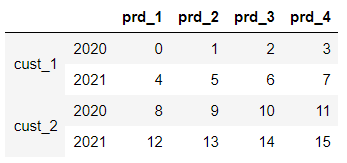

```python
datastd = data.stack()
datastd
# > cust_1  2020  prd_1     0
# >               prd_2     1
# >               prd_3     2
# >               prd_4     3
# >         2021  prd_1     4
# >               prd_2     5
# >               prd_3     6
# >               prd_4     7
# > cust_2  2020  prd_1     8
# >               prd_2     9
# >               prd_3    10
# >               prd_4    11
# >         2021  prd_1    12
# >               prd_2    13
# >               prd_3    14
# >               prd_4    15
# > dtype: int32

datastd.index
# > MultiIndex([('cust_1', '2020', 'prd_1'),
# >             ('cust_1', '2020', 'prd_2'),
# >             ('cust_1', '2020', 'prd_3'),
# >             ('cust_1', '2020', 'prd_4'),
# >             ('cust_1', '2021', 'prd_1'),
# >             ('cust_1', '2021', 'prd_2'),
# >             ('cust_1', '2021', 'prd_3'),
# >             ('cust_1', '2021', 'prd_4'),
# >             ('cust_2', '2020', 'prd_1'),
# >             ('cust_2', '2020', 'prd_2'),
# >             ('cust_2', '2020', 'prd_3'),
# >             ('cust_2', '2020', 'prd_4'),
# >             ('cust_2', '2021', 'prd_1'),
# >             ('cust_2', '2021', 'prd_2'),
# >             ('cust_2', '2021', 'prd_3'),
# >             ('cust_2', '2021', 'prd_4')],
# >            )
```

- 'cust_2'의 '2020'의 'prd_1'과 'prd_2' 참조

```python
datastd['cust_2']['2020']['prd_1']
# > 8
```

- 두 개 이상일 경우 대괄호로 한번 더 묶어준다.

```python
datastd['cust_2']['2020'][['prd_1', 'prd_2']]
# > prd_1    8
# > prd_2    9
# > dtype: int32
```

- 'cust_2'과 'prd_4'인 11과 15자리에 NaN 입력

```python
data.ix['cust_2', 'prd_4'] = np.nan
data
```

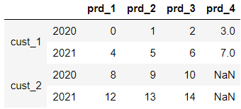

```python
data.stack() # NaN이 출력되지 않음, default 때문에
# > cust_1  2020  prd_1     0.0
# >               prd_2     1.0
# >               prd_3     2.0
# >               prd_4     3.0
# >         2021  prd_1     4.0
# >               prd_2     5.0
# >               prd_3     6.0
# >               prd_4     7.0
# > cust_2  2020  prd_1     8.0
# >               prd_2     9.0
# >               prd_3    10.0
# >         2021  prd_1    12.0
# >               prd_2    13.0
# >               prd_3    14.0
# > dtype: float64

data.stack(dropna=False) # NaN 출력 옵션
# > cust_1  2020  prd_1     0.0
# >               prd_2     1.0
# >               prd_3     2.0
# >               prd_4     3.0
# >         2021  prd_1     4.0
# >               prd_2     5.0
# >               prd_3     6.0
# >               prd_4     7.0
# > cust_2  2020  prd_1     8.0
# >               prd_2     9.0
# >               prd_3    10.0
# >               prd_4     NaN
# >         2021  prd_1    12.0
# >               prd_2    13.0
# >               prd_3    14.0
# >               prd_4     NaN
# > dtype: float64
```


## melt

```python
data = pd.DataFrame({'cust_ID' : ['C_001', 'C_001', 'C_002', 'C_002'],
    'prd_CD' : ['P_001', 'P_002', 'P_001', 'P_002'],
    'pch_cnt' : [1, 2, 3, 4],
    'pch_amt' : [100, 200, 300, 400]})
data
```


```python
pd.melt(data, id_vars=['cust_ID', 'prd_CD'])
# id_vars : 고정할 열 입력
```

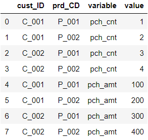

- variable, value 이름 변경

```python
pd.melt(data, id_vars=['cust_ID', 'prd_CD'], 
        var_name='CD', value_name='VAL')
```

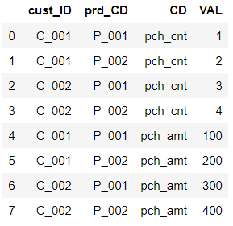

### pew.csv

```python
pew = pd.read_csv('../data/pew.csv')
pew.head()
```

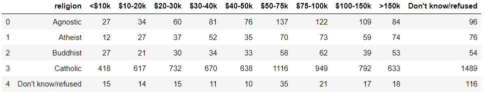

```python
pew.iloc[:, :6]
```

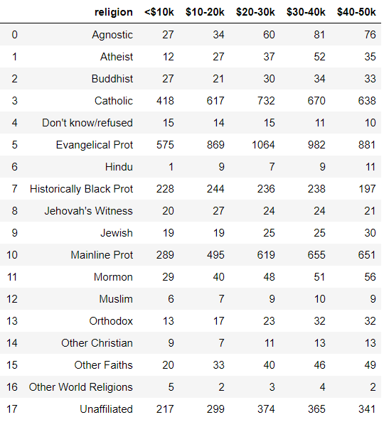

```python
pd.melt(pew.iloc[:, :6], id_vars=['religion'], 
        var_name='revenue')
# or pd.melt(pew.iloc[:, :6], id_vars='religion',
#            var_name='income', value_name='count')
```

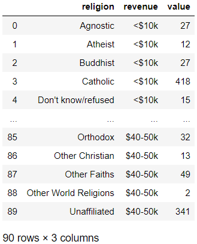

### billboard.csv

```python
billboard = pd.read_csv('../data/billboard.csv')
billboard.head()
```

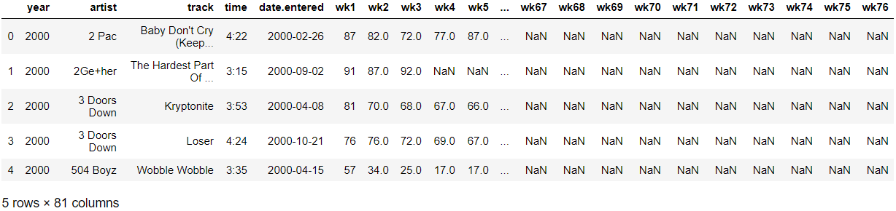

```python
pd.melt(billboard, id_vars=list(billboard.columns[:5]))
```

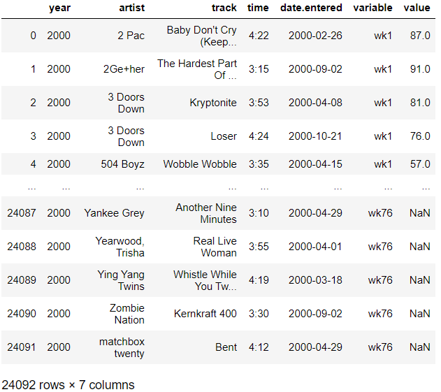

```python
# or
pd.melt(billboard, id_vars=billboard.columns[:5], 
        var_name='week', value_name='rating')
```

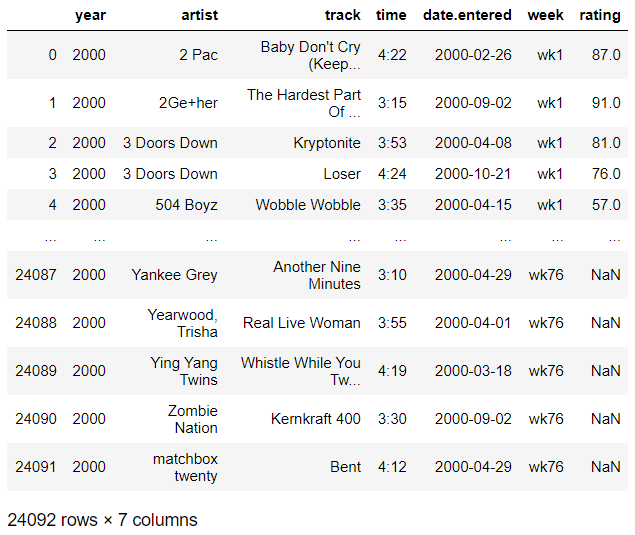


# count, value_counts

```python
s = pd.Series(range(10))
s[3] = np.nan
s
# > 0    0.0
# > 1    1.0
# > 2    2.0
# > 3    NaN
# > 4    4.0
# > 5    5.0
# > 6    6.0
# > 7    7.0
# > 8    8.0
# > 9    9.0
# > dtype: float64

s.count() # NaN은 제외
# > 9

df = pd.DataFrame(np.random.randint(5, size=(4,4)),
                  dtype=float)
df
```

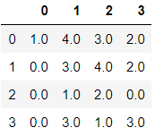

```python
df.iloc[2,3] = np.nan
df
```

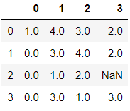

```python
df.count()
# > 0    4
# > 1    4
# > 2    4
# > 3    3
# > dtype: int64
```


----

## seaborn 모듈의 titanic 데이터

```python
import seaborn as sns

# seaborn에서 제공하는 titanic 데이터
titanic = sns.load_dataset("titanic")
titanic.head()
```

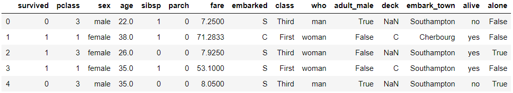

```python
titanic.count()
# > survived       891
# > pclass         891
# > sex            891
# > age            714
# > sibsp          891
# > parch          891
# > fare           891
# > embarked       889
# > class          891
# > who            891
# > adult_male     891
# > deck           203
# > embark_town    889
# > alive          891
# > alone          891
# > dtype: int64
# 열별로 결과가 나왔기 때문에 Series에 count가 적용된 것으로 봐야한다.
```

----

```python
np.random.seed(777)
s2 = pd.Series(np.random.randint(6, size=100))
s2
# > 0     3
# > 1     1
# > 2     5
# > 3     4
# > 4     1
# >      ..
# > 95    5
# > 96    3
# > 97    4
# > 98    5
# > 99    4
# > Length: 100, dtype: int32

s2.count()
# > 100

s2.value_counts() # 종류별로 데이터 갯수를 count
# > 5    20
# > 0    20
# > 4    19
# > 3    15
# > 2    15
# > 1    11
# > dtype: int64

s2.value_counts(sort=False)
# > 0    20
# > 1    11
# > 2    15
# > 3    15
# > 4    19
# > 5    20
# > dtype: int64
```

```python
df
```

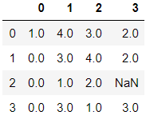

- DataFrame은 value_counts()라는 함수를 가지고 있지 않아서 Error 발생

```python
df.value_counts()
```

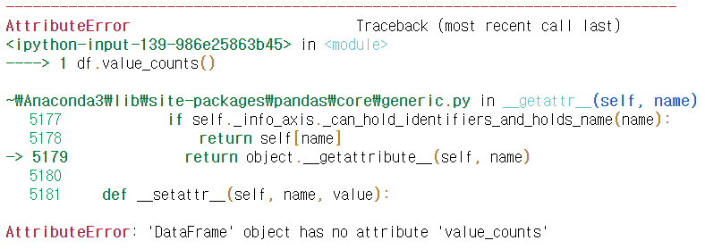

```python
df[0].value_counts() # 직접 열별로 적용
# > 0.0    3
# > 1.0    1
# > Name: 0, dtype: int64
```


# 정렬

```python
s2
# > 0     3
# > 1     1
# > 2     5
# > 3     4
# > 4     1
# >      ..
# > 95    5
# > 96    3
# > 97    4
# > 98    5
# > 99    4
# > Length: 100, dtype: int32

s2.value_counts()
# > 5    20
# > 0    20
# > 4    19
# > 3    15
# > 2    15
# > 1    11
# > dtype: int64
```


## 인덱스 기준 정렬

```python
s2.value_counts().sort_index() 
# > 0    20
# > 1    11
# > 2    15
# > 3    15
# > 4    19
# > 5    20
# > dtype: int64
```


## 정렬시 NaN은 맨 마지막

```python
s
# > 0    0.0
# > 1    1.0
# > 2    2.0
# > 3    NaN
# > 4    4.0
# > 5    5.0
# > 6    6.0
# > 7    7.0
# > 8    8.0
# > 9    9.0
# > dtype: float64

# 값을 기준으로 정렬(NaN은 맨 마지막)
s.sort_values()
# > 0    0.0
# > 1    1.0
# > 2    2.0
# > 4    4.0
# > 5    5.0
# > 6    6.0
# > 7    7.0
# > 8    8.0
# > 9    9.0
# > 3    NaN
# > dtype: float64

# 내림차순 정렬(이때도 NaN은 맨 마지막)
s.sort_values(ascending=False)
# > 9    9.0
# > 8    8.0
# > 7    7.0
# > 6    6.0
# > 5    5.0
# > 4    4.0
# > 2    2.0
# > 1    1.0
# > 0    0.0
# > 3    NaN
# > dtype: float64
```


## 데이터프레임 정렬

```python
df
```


```python
df.sort_values() # 인수가 필요한데 입력하지 않음으로 인한 Error
```

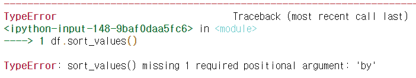

- 2번 열을 기준으로 정렬

```python
df.sort_values(by=2) 
```

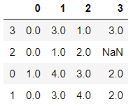

- 정렬기준 2개 입력 시

```python
df.sort_values(by=1)
```

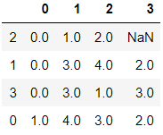

```python
df.sort_values(by=[1,2])
```

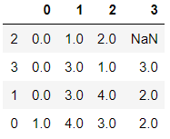


# 데이터프레임 행/열 추가

```python
df = pd.DataFrame(np.random.randint(10, size=(4,8)))
df
```

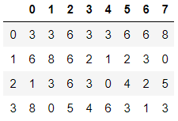

- **열 추가하기**

```python
df['Mysum'] = df.sum(axis=1)
df
```

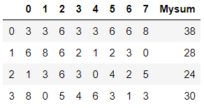

- **행 추가하기**

```python
df.loc['total',:] = df.sum(axis=0)
df
```

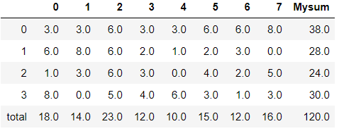


# 연습문제

## 1.

- 타이타닉 데이터에 대해
  1. Pclass를 원핫인코딩
  2. Age를 이산화(5개 구간으로 나눔)
  3. Fare를 이산화(3개 구간으로 나눔)
  4. embarked를 원핫인코딩

### 1A.

```python
# 1.
titanic = pd.read_csv('../train.csv')

# (1)
pclass = list()
for i in list(titanic.Pclass) :
    pclass.append([i])

ohe = OneHotEncoder()
ohe.fit(pclass)
# > OneHotEncoder(categorical_features=None, categories=None, drop=None,
# >               dtype=<class 'numpy.float64'>, handle_unknown='error',
# >               n_values=None, sparse=True)

ohe.active_features_
# > array([1, 2, 3], dtype=int64)

ohe.n_values_
# > array([4])

ohe.feature_indices_
# > array([0, 4], dtype=int32)

data = np.array([[1]])
ohe.transform(data).toarray()
# > array([[1., 0., 0.]])

data = np.array([[2]])
ohe.transform(data).toarray()
# > array([[0., 1., 0.]])

data = np.array([[3]])
ohe.transform(data).toarray()
# > array([[0., 0., 1.]])
```

### 2A.

```python
# (2)
age = titanic.Age
age_qcut = pd.qcut(age, 5)
age_qcut
# > 0       (19.0, 25.0]
# > 1       (31.8, 41.0]
# > 2       (25.0, 31.8]
# > 3       (31.8, 41.0]
# > 4       (31.8, 41.0]
# >            ...      
# > 886     (25.0, 31.8]
# > 887    (0.419, 19.0]
# > 888              NaN
# > 889     (25.0, 31.8]
# > 890     (31.8, 41.0]
# > Name: Age, Length: 891, dtype: category
# > Categories (5, interval[float64]): [(0.419, 19.0] < (19.0, 25.0] < (25.0, 31.8] < (31.8, 41.0] < (41.0, 80.0]]

pd.value_counts(age_qcut, sort=False)
# > (0.419, 19.0]    164
# > (19.0, 25.0]     137
# > (25.0, 31.8]     127
# > (31.8, 41.0]     144
# > (41.0, 80.0]     142
# > Name: Age, dtype: int64
```

### 3A.

```python
# (3)
fare = titanic.Fare
fare_qcut = pd.qcut(fare, 3)
fare_qcut
# > 0      (-0.001, 8.662]
# > 1      (26.0, 512.329]
# > 2      (-0.001, 8.662]
# > 3      (26.0, 512.329]
# > 4      (-0.001, 8.662]
# >             ...       
# > 886      (8.662, 26.0]
# > 887    (26.0, 512.329]
# > 888      (8.662, 26.0]
# > 889    (26.0, 512.329]
# > 890    (-0.001, 8.662]
# > Name: Fare, Length: 891, dtype: category
# > Categories (3, interval[float64]): [(-0.001, 8.662] < (8.662, 26.0] < (26.0, 512.329]]

pd.value_counts(fare_qcut)
# > (-0.001, 8.662]    308
# > (26.0, 512.329]    295
# > (8.662, 26.0]      288
# > Name: Fare, dtype: int64
```

### 4A.

```python
# (4)
embarked = titanic.Embarked
# S = 0, Q = 1, C = 2
embarked_int = np.where(embarked == 'S', 0,
                        np.where(embarked == 'Q', 1, 2))

embarked_dum = list()
for i in embarked_int : # OneHotEncoder를 위한 이중 list
    embarked_dum.append([i])

e_ohe = OneHotEncoder()
e_ohe.fit(embarked_dum)
# > OneHotEncoder(categorical_features=None, categories=None, drop=None,
# >               dtype=<class 'numpy.float64'>, handle_unknown='error',
# >               n_values=None, sparse=True)

e_ohe.active_features_
# > array([0, 1, 2], dtype=int64)

e_ohe.n_values_
# > array([3])

e_ohe.feature_indices_
# > array([0, 3], dtype=int32)

data = np.array([[0]])
e_ohe.transform(data).toarray()
# > array([[1., 0., 0.]])

data = np.array([[1]])
e_ohe.transform(data).toarray()
# > array([[0., 1., 0.]])

data = np.array([[2]])
e_ohe.transform(data).toarray()
# > array([[0., 0., 1.]])
```


## 2.

- 리스트를 거꾸로 출력하는 반복문을 만들어 보세요.
- 2가지 방법으로 구현합니다.

### A.

```python
# 2.
input_list = list(input())

for i in range(len(input_list)-1, -1, -1):
    print(input_list[i], end=' ')
# > abcdefg
# > g f e d c b a 

for s in reversed(input_list) :
    print(s, end=' ')
# > g f e d c b a 
```


## 3.

- 리스트에서 중복 값을 제거해 보세요.
- `ns = [1, 3, 5, 1, 3, 5, 1, 3, 5]`

### A.

```python
# 3.
ns = [1, 3, 5, 1, 3, 5, 1, 3, 5]
ns = list(set(ns))
print(ns)
# > [1, 3, 5]
```


## 4.

- `bins = [1, 15, 25, 35, 60, 99]`
- `labels = ["미성년자", "청년", "중년", "장년", "노년"]`
- 타이타닉호 승객을 사망자와 생존자 그룹으로 나누고 각 그룹에 대해 '미성년자', '청년', '중년', '장년', '노년' 승객의 비율을 구한다. 각 그룹 별로 비율의 전체 합은 1이 되어야 한다.

### A.

```python
dataset = titanic[['Survived', 'Age']]
dataset
```

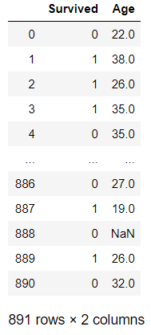

```python
bins = [1, 15, 25, 35, 60, 99]
labels = ["미성년자", "청년", "중년", "장년", "노년"]
dataset['ages'] = pd.cut(dataset.Age, bins, labels=labels)
dataset
```

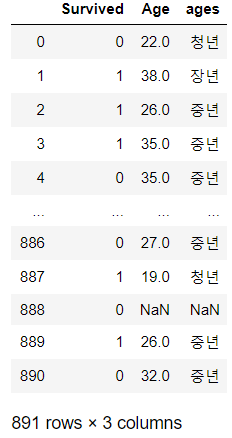

```python
df = dataset.groupby(["Survived", "ages"]).count()
df
```

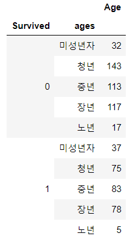

```python
prob_df = pd.DataFrame(index=range(2), columns=labels)

for i in range(2) :
    row_sum = df.loc[i].sum()[0]
    for j in labels :
        prob_df.loc[i, j] = (df.loc[i] / row_sum).loc[j][0]

prob_df
```

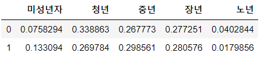

```python
prob_df.sum(axis=1)
# > 0    1.0
# > 1    1.0
# > dtype: float64
```

