[toc]

# Day20 딥러닝을 위한 빅데이터 기초 - 데이터 분석를 위한 NumPy, Pandas (7)

# 정렬

- 데이터프레임 정렬 : sort_values()
- 튜플 정렬 : sorted()
- 리스트 정렬 : list.sort(), sorted(list)

```python
import pandas as pd
import numpy as np

help(pd.DataFrame.sort_values)
```

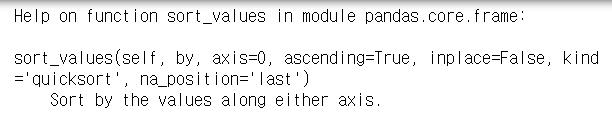

- **inplace 옵션** : 정렬된 결과로 변경 True, 결과만 보려면 False
- **kind 옵션** : 'quicksort'&'mergesort'(= n*log(n)의 시간), 'heapsort'
- **na_position 옵션** : NaN위치 지정 옵션, 'first', 'last'


## 데이터프레임 정렬

```python
df = pd.DataFrame({"seq" : [10, 30, 20],
                   "name" : ["park", "kim", "choi"],
                   "age" : [25, 35, 22]})
df
```

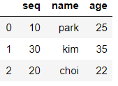

```python
df.sort_values(by="seq")
```

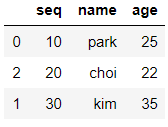

```python
df.sort_values(by="seq", ascending=False)
```

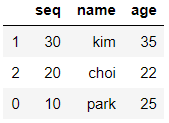

```python
df.sort_values(by="seq", ascending=False, inplace=True)

df
```

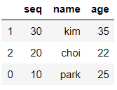

```python
df = pd.DataFrame({"seq" : [10, 30, np.nan],
                   "name" : ["park", "kim", "choi"],
                   "age" : [25, 35, 22]})
df
```

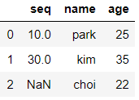

```python
df.sort_values(by="seq", na_position="first")
```

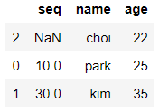

```python
df.sort_values(by="seq", ascending=False, na_position="first")
```

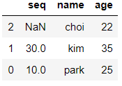


## 튜플 정렬

```python
tup = [(1,"kim",25), (3, "lee", 20), (2,"park", 15)]
tup
# > [(1, 'kim', 25), (3, 'lee', 20), (2, 'park', 15)]
```

- sorted(튜플변수, 기준)

```python
sorted(tup)
# > [(1, 'kim', 25), (2, 'park', 15), (3, 'lee', 20)]

sorted(tup, key=lambda p: p[0])
# > [(1, 'kim', 25), (2, 'park', 15), (3, 'lee', 20)]

sorted(tup, key=lambda p: p[1])
# > [(1, 'kim', 25), (3, 'lee', 20), (2, 'park', 15)]

sorted(tup, key=lambda p: p[2])
# > [(2, 'park', 15), (3, 'lee', 20), (1, 'kim', 25)]

sorted(tup, key=lambda p: p[2], reverse=True)
# > [(1, 'kim', 25), (3, 'lee', 20), (2, 'park', 15)]
```


## 리스트 정렬

```python
myList = [0,1,2,5,4,7,8,6,3]
sorted(myList)
# > [0, 1, 2, 3, 4, 5, 6, 7, 8]

myList
# > [0, 1, 2, 5, 4, 7, 8, 6, 3]

myList.sort()

myList
# > [0, 1, 2, 3, 4, 5, 6, 7, 8]

sorted(myList, reverse=True)
# > [8, 7, 6, 5, 4, 3, 2, 1, 0]

myList
# > [0, 1, 2, 3, 4, 5, 6, 7, 8]
```


# pd.Series

```python
s1 = pd.Series([3,1,4,2,5])
s1
# > 0    3
# > 1    1
# > 2    4
# > 3    2
# > 4    5
# > dtype: int64
```


## indexing, slicing

```python
s1[2]
# > 4
```
- 3, 1, 4 출력
```python
s1[:3]
# > 0    3
# > 1    1
# > 2    4
# > dtype: int64
```
- 평균값보다 큰 수만 출력
```python
s1[s1>s1.mean()]
# > 2    4
# > 4    5
# > dtype: int64
```
- 떨어진 인덱스 두개를 참조할 때
```python
s1[[2,4]]
# > 2    4
# > 4    5
# > dtype: int64
```

```python
s = pd.Series([10, 20, 30, 40, 50], 
              index=['a', 'b','c', 'd', 'e'])
s
# > a    10
# > b    20
# > c    30
# > d    40
# > e    50
# > dtype: int64
```
- 인덱스 이름 사용
```python
s['a']
# > 10

s[['a', 'c', 'e']]
# > a    10
# > c    30
# > e    50
# > dtype: int64
```
- get 함수 사용가능
```python
s.get(['a', 'c', 'e'])
# > a    10
# > c    30
# > e    50
# > dtype: int64
```

- 대입

```python
s['c'] = 300
s
# > a     10
# > b     20
# > c    300
# > d     40
# > e     50
# > dtype: int64
```


## in

- in : Series안에 인덱스 존재 여부 확인

```python
'c' in s # s 안에 'c' 인덱스가 있나요? 
# > True

'z' in s
# > False
```


# pd.DataFrame

```python
df = pd.DataFrame({
    "c1" : [1,2,3],
    "c2" : [4,5,6],
    "c3" : [7,8,np.nan]
}, index=["r1", "r2", "r3"])
df
```

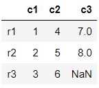

```python
df.info() # R에서 str()
# > <class 'pandas.core.frame.DataFrame'>
# > Index: 3 entries, r1 to r3
# > Data columns (total 3 columns):
# > c1    3 non-null int64
# > c2    3 non-null int64
# > c3    2 non-null float64
# > dtypes: float64(1), int64(2)
# > memory usage: 96.0+ bytes

df.index
# > Index(['r1', 'r2', 'r3'], dtype='object')

df.columns
# > Index(['c1', 'c2', 'c3'], dtype='object')
```


## sub DataFrame 생성

- df에서 'r1', 'r3'만 추출하여 새로운 DataFrame 생성

```python
df13 = pd.DataFrame(df)
df13
```

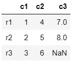

```python
df13 = pd.DataFrame(df, index=["r1", "r3"])
df13
```

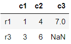

- c1과 c3열 추출하여 dfc13으로 저장

```python
dfc13 = pd.DataFrame(df, columns=["c1", "c3"])
dfc13
```

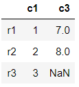

- r3, r1행과 c3, c1열을 추출하여 rdfc13으로 저장

```python
rdfc13 = pd.DataFrame(df, index=["r3", "r1"], 
                      columns=["c3", "c1"])
rdfc13
```

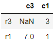


## 행 or 열 다루기

### 여러 행 or 열 출력

```python
df[['c1', 'c3']]
```

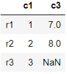

```python
col_sel = ['c1', 'c3']
df[col_sel]
```

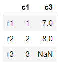


### 열 추가 방법

- df['컬럼명'] = 데이터

```python
df['c4'] = df['c1'] + df['c2']
df
```

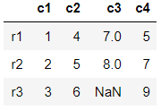

- assign 함수

```python
df = df.assign(c5 = df['c1'] * df['c2'])
df
```

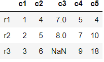

- lambda 함수

```python
df = df.assign(c6 = lambda x: x.c1 - x.c2) # x에는 df가 전달
df
```

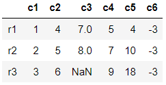


### 데이터 프레임 컬럼 삭제

- df.drop(), del 명령 : 데이터프레임 컬럼 삭제

#### df.drop()

- df.drop() : 행/열 가능, 카피 데이터 사용

```python
df.drop(['c4'], axis=1)
# df.drop('c4', axis=1)
```

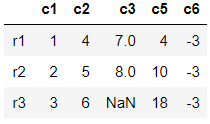

- c2, c4, c5열 제거

```python
df.drop(['c2', 'c4', 'c5'], axis=1)
```

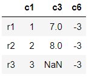

- r2행 제거

```python
df.drop(['r2'], axis=0)
```

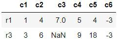

```python
df.drop(['r2']) # default : axis=0
```

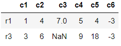

#### del

- del 명령 : 열만 가능, 행 불가능, 원본데이터 변경

```python
del df['c2']

df
```

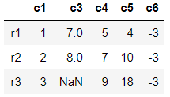

```python
del df['c4']
df
```

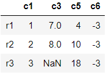


### 조건에 맞는 행 출력

```python
df['c1'] <= 2
# > r1     True
# > r2     True
# > r3    False
# > Name: c1, dtype: bool

df[df['c1'] <= 2] # df[True, True, False]
# True에 해당하는 행만 추출
```

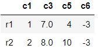


# numpy

- 수치데이터에 대하여 빠르고, 정확한 분석을 제공하는 모듈
- ndarray로 벡터연산이 가능하므로 빠르다.

```python
arr1 = np.array([1,2,3,4])

mylist = [5,6,7,8]
arr2 = np.array(mylist)

arr1.shape
# > (4,)

arr2.shape
# > (4,)

arr1.dtype
# > dtype('int32')
```

## 타입을 변경해야하는 경우

### np.asarray

```python
mylist = np.asarray(mylist)
mylist
# > array([5, 6, 7, 8])

type(mylist)
# > numpy.ndarray
```

### np.asfarray

- 데이터가 float형인 array로 변환

```python
np.asfarray(mylist)
# > array([5., 6., 7., 8.])
```

### np.asarray_chkfinite

- 데이터를 array로 변환할 때, finite인지 검사하는 함수
- 죽, 무한수(inf) or 결측값이 없는지 확인한다.

```python
np.asarray_chkfinite(mylist)
# > array([5, 6, 7, 8])
```

- 무한수 or 결측값 존재시 Error 발생

```python
mylist = [5,6,7,np.nan]
np.asarray_chkfinite(mylist)
```

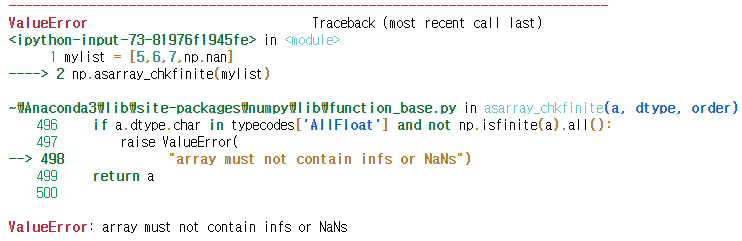

```python
mylist = [5,6,7,np.inf] # np.inf : 무한수
np.asarray_chkfinite(mylist)
```

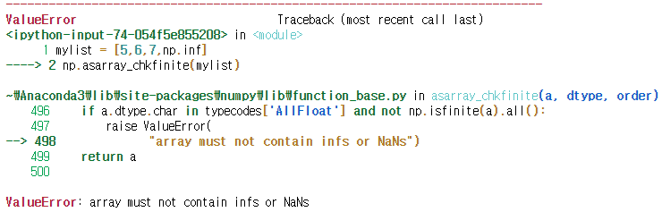


## 초기화

### np.zeros()
- float type의 0으로 초기화
```python
np.zeros(5)
# > array([0., 0., 0., 0., 0.])
```
### np.ones()
- float type의 1로 초기화
```python
np.ones(10)
# > array([1., 1., 1., 1., 1., 1., 1., 1., 1., 1.])

np.ones(5)*2 # 벡터화 연산
# > array([2., 2., 2., 2., 2.])
```

### np.empty()
- 요소의 초기화 과정이 없고, 기존 메모리 값을 그대로 사용
```python
np.empty(10)
# > array([1., 1., 1., 1., 1., 1., 1., 1., 1., 1.])
```

### 다차원 배열의 초기화

```python
np.zeros((2,5))
# > array([[0., 0., 0., 0., 0.],
# >        [0., 0., 0., 0., 0.]])

np.ones((2,5))
# > array([[1., 1., 1., 1., 1.],
# >        [1., 1., 1., 1., 1.]])
```

### 다른 데이터와 같은 사이즈로 초기화

```python
arr = np.arange(12)
arr
# > array([ 0,  1,  2,  3,  4,  5,  6,  7,  8,  9, 10, 11])

arr = arr.reshape(3,4)
arr
# > array([[ 0,  1,  2,  3],
# >        [ 4,  5,  6,  7],
# >        [ 8,  9, 10, 11]])

np.zeros_like(arr)
# > array([[0, 0, 0, 0],
# >        [0, 0, 0, 0],
# >        [0, 0, 0, 0]])

np.ones_like(arr)
# > array([[1, 1, 1, 1],
# >        [1, 1, 1, 1],
# >        [1, 1, 1, 1]])
```

### 단위행렬(항등행렬)

```python
np.eye(3)
# > array([[1., 0., 0.],
# >        [0., 1., 0.],
# >        [0., 0., 1.]])

np.identity(3)
# > array([[1., 0., 0.],
# >        [0., 1., 0.],
# >        [0., 0., 1.]])
```


## 분포에 따른 난수 생성

- np.random.분포이름 : 해당 분포를 따르는 난수 생성

- 모집단 - 확률분포 -> 분위수에 대한 확률, 특정 확률에 해당되는 분위수 계산
- 확률분포를 이용해서 난수를 발생

- 확률분포 : 연속형 확률 분포, 이산형 확률 분포
  - 연속형 확률 분포 : 정규분포, t분포, f-분포, 균등분포
  - 이산형 확률 분포 : 이항분포, 포아송, 초기하분포
- 이항분포
  - 성공확률이 p인 베르누이시행을 n번 반복 수행 했을 때, 
  - 성공횟수를 X라고 하면, 
  - 확률변수 X는 모수 n과 p인 이항분포를 따른다.
  - nCx * p의 x승 * (1-p)의 (n-x)승
  - 베르누이시행 : 각 시행마다 성공/실패의 경우의 수가 나오는 시행

```python
np.random.normal() # 정규분호로부터 개수가 1인 무작위 샘플 추출
# > -2.1598688908726578

np.random.normal(5) # 평균 5
# > 4.417623325641864

np.random.normal(size=5)
# > array([ 0.75212607,  0.18175579, -0.18276902, -0.10328477, -1.27759001])

np.random.seed(seed=777)
np.random.normal(size=5)
# > array([-0.46820879, -0.82282485, -0.0653801 , -0.71336192,  0.90635089])

np.random.normal(size=(2,5))
# > array([[ 0.76623673,  0.82605407, -1.32368279, -1.75244452,  1.00244907],
# >        [ 0.54480945,  1.8951609 , -0.76935745, -1.40309592, -0.63246751]])
```

```python
np.random.binomial(n=1, p=0.5, size=20)
# > array([0, 0, 1, 1, 1, 0, 0, 1, 0, 1, 1, 1, 1, 0, 1, 1, 1, 0, 0, 1])
```


## 데이터 타입

- numpy : boolean, int, float, string
- 숫자형/문자형

```python
x = np.array([3, 2, 4, 5])
x.dtype
# > dtype('int32')

x = np.array([3.1, 2.5, 4.1, 5.2])
x.dtype
# > dtype('float64')
```

### 데이터 타입 지정

```python
x = np.array([3.1, 2.5, 4.1, 5.2], dtype=np.float32)
x.dtype
# > dtype('float32')

x = np.array([3.1, 2.5, 4.1, 5.2], dtype=np.int32)
x.dtype
# > dtype('int32')

x
# > array([3, 2, 4, 5])

x = np.int32([1.5, 2.4])
x
# > array([1, 2])
```


### 데이터 타입 변환

- 데이터.astype(변환타입)

```python
x.astype(np.float64)
# > array([1., 2.])

x.dtype # x가 변경되진 않음
# > dtype('int32')
```

```python
x = np.float64([3, 2, 1])
x
# > array([3., 2., 1.])

# int64로 변경
x.astype(np.int64)
# > array([3, 2, 1], dtype=int64)

# 문자로 변경
x = x.astype(np.int64)
x = x.astype(np.string_)
x
# > array([b'3', b'2', b'1'], dtype='|S21')

x.dtype # 문자타입
# > dtype('S21')
```


## 벡터화 연산

- 두 배열의 차원이 같아야 연산
- 차원이 다르면 broadcasting을 통해 차원을 동일하게 만들어야 함

```python
x = np.array([1., 1., 2., 2.])
y = np.array([1., 2., 3., 4.])
```

### 배열 + 스칼라

```python
y+1
# > array([2., 3., 4., 5.])

y/2
# > array([0.5, 1. , 1.5, 2. ])

y//2
# > array([0., 1., 1., 2.])

y%2
# > array([1., 0., 1., 0.])

y**2
# > array([ 1.,  4.,  9., 16.])
```


### 벡터화 연산 시간 비교

```python
a = np.arange(1000000)
a
# > array([     0,      1,      2, ..., 999997, 999998, 999999])
```
- `%timeit` : 뒤에 있는 문장의 수행 시간을 알려 줌
```python
%timeit a+1
# > 2.33 ms ± 25.5 µs per loop (mean ± std. dev. of 7 runs, 100 loops each)

%timeit (i+1 for i in a)
# > 297 ns ± 2.03 ns per loop (mean ± std. dev. of 7 runs, 1000000 loops each)

# 벡터화 연산의 속도가 확실히 빠르다.
```


### 배열 + 배열

```python
x
# > array([1., 1., 2., 2.])

y
# > array([1., 2., 3., 4.])

x+y # element wise sum
# > array([2., 3., 5., 6.])

x-y
# > array([ 0., -1., -1., -2.])

x*y
# > array([1., 2., 6., 8.])

x/y
# > array([1.        , 0.5       , 0.66666667, 0.5       ])

x//y
# > array([1., 0., 0., 0.])

x%y
# > array([0., 1., 2., 2.])
```

- **요소간 비교 연산**

```python
np.equal(x,y) # x == y
# > array([ True, False, False, False])

np.not_equal(x,y) # x != y
# > array([False,  True,  True,  True])

np.greater(x,y) # x > y
# > array([False, False, False, False])

np.greater_equal(x,y) # x >= y
# > array([ True, False, False, False])

np.less(x,y) # x < y
# > array([False,  True,  True,  True])

np.less_equal(x,y) # x <= y
# > array([ True,  True,  True,  True])
```

- **배열 전체 비교**

```python
np.array_equal(x,y) # x전체 == y전체
# > False

np.array_equal(x,x)
# > True
```

- **연산 축약 표현식**

```python
x+=y # x-=y x*=y x/=y x**=y
x
# > array([2., 3., 5., 6.])
```


### 논리연산 함수

```python
x = np.array([1,1,0,0])
y = np.array([1,0,1,0])

np.logical_and(x,y) # 연산되어지는 연산 모두가 True일때 True
# > array([ True, False, False, False])

np.logical_or(x,y)
# > array([ True,  True,  True, False])

np.logical_xor(x,y) # 두 값이 서로 배타적일 때 True
# > array([False,  True,  True, False])
```

### in, not in

- 소속 여부 확인? in, notin
- 객체 in 배열 : 배열에 객체가 있으면 True

```python
a = "x"
b = np.array(["x", "y"])

a in b
# > True

'z' not in b
# > True
```


### broadcasting 가능 여부
- **가능한 경우**
```python
ar = np.array([1,2,3,4])
ar.shape
# > (4,)

ar+1 # 1 => [1, 1, 1, 1]로 변환되어 계산
# > array([2, 3, 4, 5])
```

- 

```python
df = pd.DataFrame({'x1':[1,2,3], 'x2':[4,5,6]})
df
```

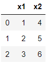

```python
df+1 # 1 => 3행 2열의 1행렬로 변환
```

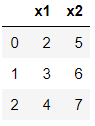

- 

```python
ar = np.arange(12).reshape(4,3)
ar
# > array([[ 0,  1,  2],
# >        [ 3,  4,  5],
# >        [ 6,  7,  8],
# >        [ 9, 10, 11]])

ar2 = np.array([1,2,3])
ar2
# > array([1, 2, 3])

ar+ar2 # ar2 => np.array([[1,2,3], [1,2,3], [1,2,3], [1,2,3]])로 변환
# > array([[ 1,  3,  5],
# >        [ 4,  6,  8],
# >        [ 7,  9, 11],
# >        [10, 12, 14]])
```

- 

```python
ar = np.arange(12).reshape(4,3)
ar2 = np.array([1,2,3,4]).reshape(4,1) # 4행1열로 변경
ar+ar2 # ar2를 열 방향으로 복제하여 4행3열 변환하여 계산됨
# > array([[ 1,  2,  3],
# >        [ 5,  6,  7],
# >        [ 9, 10, 11],
# >        [13, 14, 15]])
```


- **불가능한 경우**
```python
x = np.array([1.,1.,2.,2.])
y = np.arange(5)

x+y # 두 배열간 차원이 같아야 연산 가능
```


```python
ar = np.arange(12).reshape(4,3)
ar2 = np.array([1,2,3,4])
ar+ar2
```

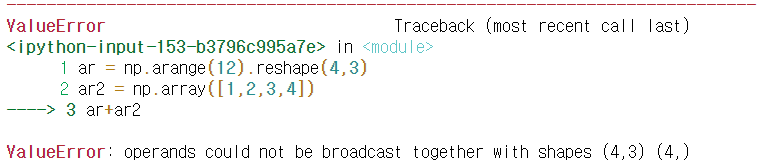


# 타이타닉 데이터

```python
train = pd.read_csv("../train.csv")
```

## EDA(Exploratory data analysis)

```python
train.head()
```

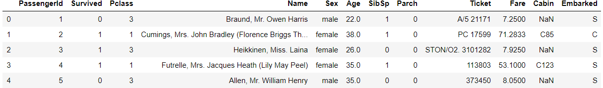

```python
train.shape
# > (891, 12)

train.info()
# > <class 'pandas.core.frame.DataFrame'>
# > RangeIndex: 891 entries, 0 to 890
# > Data columns (total 12 columns):
# > PassengerId    891 non-null int64
# > Survived       891 non-null int64
# > Pclass         891 non-null int64
# > Name           891 non-null object
# > Sex            891 non-null object
# > Age            714 non-null float64
# > SibSp          891 non-null int64
# > Parch          891 non-null int64
# > Ticket         891 non-null object
# > Fare           891 non-null float64
# > Cabin          204 non-null object
# > Embarked       889 non-null object
# > dtypes: float64(2), int64(5), object(5)
# > memory usage: 83.7+ KB

train.isnull().sum(axis=0)
# > PassengerId      0
# > Survived         0
# > Pclass           0
# > Name             0
# > Sex              0
# > Age            177
# > SibSp            0
# > Parch            0
# > Ticket           0
# > Fare             0
# > Cabin          687
# > Embarked         2
# > dtype: int64
```

### bar plot 그리기

- 생존자들만 추출

```python
train[train['Survived'] == 1]
```

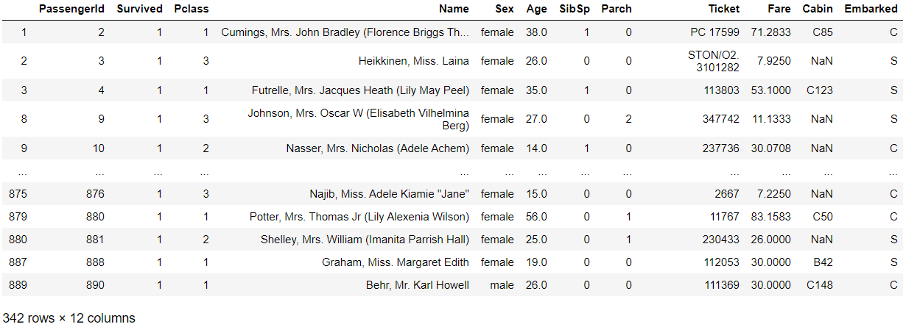

- 생존자의 성별만 출력

```python
train[train['Survived'] == 1]['Sex']
# > 1      female
# > 2      female
# > 3      female
# > 8      female
# > 9      female
# >         ...  
# > 875    female
# > 879    female
# > 880    female
# > 887    female
# > 889      male
# > Name: Sex, Length: 342, dtype: object
```

```python
train[train['Survived'] == 1]['Sex'].value_counts()
# > female    233
# > male      109
# > Name: Sex, dtype: int64

survived = train[train['Survived'] == 1]['Sex'].value_counts()
dead = train[train['Survived'] == 0]['Sex'].value_counts()
dead
# > male      468
# > female     81
# > Name: Sex, dtype: int64

type(survived)
# > pandas.core.series.Series

type(dead)
# > pandas.core.series.Series

df = pd.DataFrame([survived, dead])
df
```

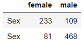

```python
df.index = ['Survived', 'Dead']
df
```

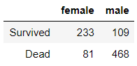

```python
import matplotlib.pyplot as plt
df.plot()
# > <matplotlib.axes._subplots.AxesSubplot at 0x1aec736c848>

df.plot(kind = "bar")
```

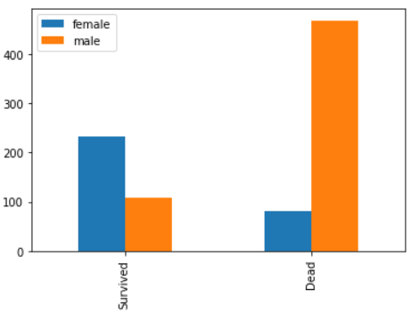

```python
df.plot(kind = "bar", stacked=True)
```

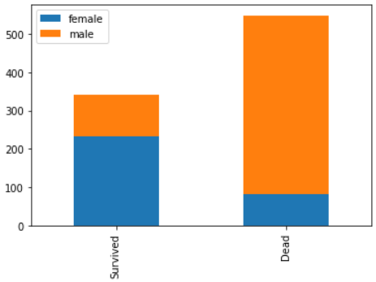

```python
df.plot(kind = "bar", stacked=True, figsize=(10,5))
```

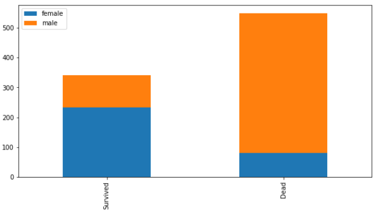

- **티켓 등급**에 따른 생존여부

```python
survived = train[train['Survived'] == 1]['Pclass'].value_counts()
dead = train[train['Survived'] == 0]['Pclass'].value_counts()
df = pd.DataFrame([survived, dead])
df.index = ['Survived', 'Dead']
df.plot(kind = "bar")
```


- **함수화**

```python
def my_chart(feature) :
    survived = train[train['Survived'] == 1][feature].value_counts()
    dead = train[train['Survived'] == 0][feature].value_counts()
    df = pd.DataFrame([survived, dead])
    df.index = ['Survived', 'Dead']
    df.plot(kind = "bar")
```

```python
my_chart('Sex')
```

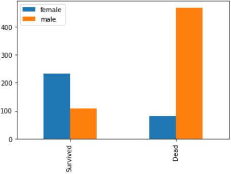

```python
my_chart('Pclass')
```

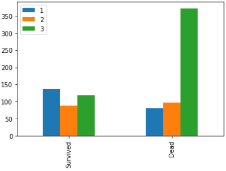

```python
my_chart('Parch')
```

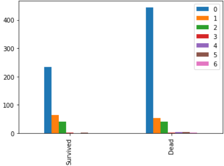

```python
my_chart('Embarked')
```

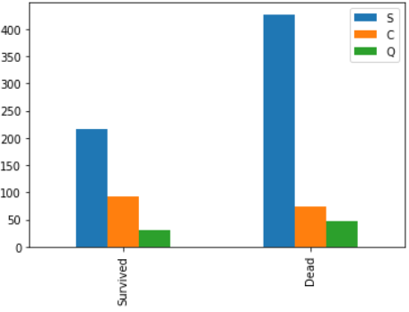


### 호칭 추출

```python
train['Name']
# > 0                                Braund, Mr. Owen Harris
# > 1      Cumings, Mrs. John Bradley (Florence Briggs Th...
# > 2                                 Heikkinen, Miss. Laina
# > 3           Futrelle, Mrs. Jacques Heath (Lily May Peel)
# > 4                               Allen, Mr. William Henry
# >                              ...                        
# > 886                                Montvila, Rev. Juozas
# > 887                         Graham, Miss. Margaret Edith
# > 888             Johnston, Miss. Catherine Helen "Carrie"
# > 889                                Behr, Mr. Karl Howell
# > 890                                  Dooley, Mr. Patrick
# > Name: Name, Length: 891, dtype: object

type(train['Name'])
# > pandas.core.series.Series

# extract 함수 사용을 위하여 문자열로 변환
train['Name'].str
# > <pandas.core.strings.StringMethods at 0x1aec80a9748>

# extract : 소괄호 안에 해당되는 문자열만 추출
train['Name'].str.extract(" ([A-Za-z]+)\.")
```


```python
train['title'] = train['Name'].str.extract(" ([A-Za-z]+)\.")
train['title'].value_counts()
# > Mr          517
# > Miss        182
# > Mrs         125
# > Master       40
# > Dr            7
# > Rev           6
# > Mlle          2
# > Major         2
# > Col           2
# > Mme           1
# > Lady          1
# > Ms            1
# > Countess      1
# > Jonkheer      1
# > Capt          1
# > Sir           1
# > Don           1
# > Name: title, dtype: int64

title_mapping={"Mr":0, "Miss":1, "Mrs":2, "Master":3}
train['title'].map(title_mapping) # 없는 것은 NaN
# > 0      0.0
# > 1      2.0
# > 2      1.0
# > 3      2.0
# > 4      0.0
# >       ... 
# > 886    NaN
# > 887    1.0
# > 888    1.0
# > 889    0.0
# > 890    0.0
# > Name: title, Length: 891, dtype: float64

train['title'] = train['title'].map(title_mapping)
train['title'].value_counts()
# > 0.0    517
# > 1.0    182
# > 2.0    125
# > 3.0     40
# > Name: title, dtype: int64

train.drop('Name', axis=1, inplace=True)
train
```

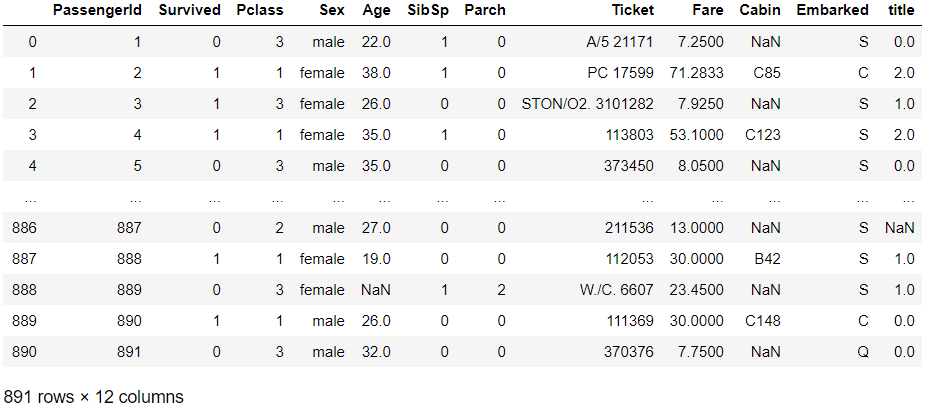


### Sex : male=0, female=1 변환

```python
sex_mapping={"male":0, "female":1}
train['Sex'] = train['Sex'].map(sex_mapping)
train
```


```python
my_chart('Sex')
```

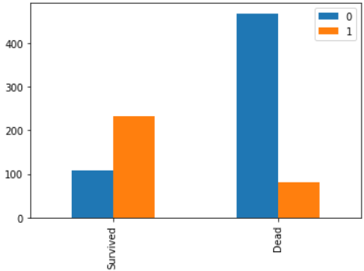


### Age 구간화

- `train.Age`에서 `(0,16]:0, (16,26]:1, (26,36]:2, (36,62]:3, (62,inf]:4`

```python
bins = [0, 16, 26, 36, 62, train.Age.max()]
age_cut = pd.cut(train.Age, bins, labels=[0,1,2,3,4])
age_cut
# > 0        1
# > 1        3
# > 2        1
# > 3        2
# > 4        2
# >       ... 
# > 886      2
# > 887      1
# > 888    NaN
# > 889      1
# > 890      2
# > Name: Age, Length: 891, dtype: category
# > Categories (5, int64): [0 < 1 < 2 < 3 < 4]
```

```python
train.loc[train['Age'] <= 16, 'Age']= 0
train.loc[(train['Age'] > 16) & (train['Age'] <= 26), 'Age']= 1
train.loc[(train['Age'] > 26) & (train['Age'] <= 36), 'Age']= 2
train.loc[(train['Age'] > 36) & (train['Age'] <= 62), 'Age']= 3
train.loc[train['Age'] > 61, 'Age']= 4
train['Age']
# > 0      1.0
# > 1      3.0
# > 2      1.0
# > 3      2.0
# > 4      2.0
# >       ... 
# > 886    2.0
# > 887    1.0
# > 888    NaN
# > 889    1.0
# > 890    2.0
# > Name: Age, Length: 891, dtype: float64
```


# 연습문제

## 1.

- 길이가 10인 0-벡터를 만드세요.

### A.

```python
# 1.
q1 = np.zeros(10)
q1
# > array([0., 0., 0., 0., 0., 0., 0., 0., 0., 0.])
```


## 2.

- 길이가 10이며 다섯번째 원소만 1이고 나머지 원소는 모두 0인 벡터를 만드세요.

### A.

```python
# 2.
q2 = np.zeros(10)
q2[4] = 1
q2
# > array([0., 0., 0., 0., 1., 0., 0., 0., 0., 0.])
```


## 3.

- 10 부터 49까지의 값을 가지는 벡터를 만드세요.

### A.

```python
# 3.
q3 = np.arange(10, 50)
q3
# > array([10, 11, 12, 13, 14, 15, 16, 17, 18, 19, 20, 21, 22, 23, 24, 25, 26,
# >        27, 28, 29, 30, 31, 32, 33, 34, 35, 36, 37, 38, 39, 40, 41, 42, 43,
# >        44, 45, 46, 47, 48, 49])
```


## 4.

- 위 벡터의 순서를 바꾸세요.

### A.

```python
# 4.
q4 = np.array(list(reversed(q3)))
q4
# > array([49, 48, 47, 46, 45, 44, 43, 42, 41, 40, 39, 38, 37, 36, 35, 34, 33,
# >        32, 31, 30, 29, 28, 27, 26, 25, 24, 23, 22, 21, 20, 19, 18, 17, 16,
# >        15, 14, 13, 12, 11, 10])
```


## 5.

- 0부터 8까지의 값을 가지는 3x3 행렬을 만드세요.

### A.

```python
# 5.
q5 = np.array(np.arange(9).reshape(3,3))
q5
# > array([[0, 1, 2],
# >        [3, 4, 5],
# >        [6, 7, 8]])
```


## 6.

- 벡터 [1,2,0,0,4,0] 에서 원소의 값이 0이 아닌 원소만 선택한 벡터를 만드세요.

### A.

```python
# 6.
q6 = np.array([1,2,0,0,4,0])
q6_res = q6[q6 != 0]
q6_res
# > array([1, 2, 4])
```


## 7.

- 3x3 단위 행렬(identity matrix)을 만드세요

### A.

```python
# 7.
q7 = np.identity(3)
q7
# > array([[1., 0., 0.],
# >        [0., 1., 0.],
# >        [0., 0., 1.]])
```


## 8.

- 난수 원소를 가지는 3x3 행렬을 만드세요

### A.

```python
# 8.
q8 = np.array(np.random.randn(9).reshape(3,3))
q8
# > array([[-0.55887367, -0.28158426,  1.74445271],
# >        [-0.67423891,  0.58840123,  1.80436346],
# >        [ 2.05625026,  1.45458168, -0.13841169]])
```

## 9.

- 위에서 만든 난수 행렬에서 최대값/최소값 원소를 찾으세요.

### A.

```python
# 9.
q8.max()
# > 2.056250260584693

q8.min()
# > -0.6742389094364267
```


## 10.

- 위에서 만든 난수 행렬에서 행 평균, 열 평균을 계산하세요.

### A.

```python
# 10.
q8.mean(axis=1) # 행
# > array([0.30133159, 0.57284193, 1.12414008])

q8.mean(axis=0)
# > array([0.27437923, 0.58713288, 1.13680149])
```


## 11.

- 4개의 직사각형이 평면에 있는데 밑변이 모두 가로축에 평행하다. 이 직사각형들이 차지하는 면적을 구하는 프로그램을 작성하시오. 이 네 개의 직사각형들은 서로 떨어져 있을 수도 있고 겹쳐 있을 수도 있다. 또한 하나가 다른 하나를 포함할 수도 있으며, 변이나 꼭지점이 겹쳐질 수도 있다.

- 입력형식
  - 하나의 직사각형은 왼쪽 아래의 꼭지점과 오른쪽 위의 꼭지점의 좌표로 주어진다. 입력은 네 줄이며, 각 줄은 네 개의 정수로 하나의 직사각형을 나타낸다. 첫 번째와 두 번째의 정수는 사각형의 왼쪽 아래 꼭지점의 x좌표, y좌표이고, 세 번째와 네 번째의 정수는 사각형의 오른쪽 위 꼭지점의 x좌표, y좌표이다. 단, x좌표와 y좌표는 1 이상이고 1000 이하인 정수이다.

- 출력형식
  - 화면에 4개의 직사각형이 차지하는 면적을 출력한다.

- 입력예제
  - 1 2 4 4
  - 2 3 5 7
  - 3 1 6 5
  - 7 3 8 6

- 출력예제
  - 26

### A.

```python
# 11.
value = list() # 입력값
for i in range(4) : 
    value.append(list(map(int, input().split())))

rec = list() # 사각형 좌표 생성
# 직사각형을 크기 1인 정사각형으로 생각하여 왼쪽하단 좌표를 생성
for i in range(4) :
    for x in range(value[i][0], value[i][2]) :
        for y in range(value[i][1], value[i][3]) :
            rec.append([x,y])

# 중복되는 좌표 제거
rec_re = list(set(map(tuple, rec)))

# rec_re의 갯수가 4개의 직사각형들이 차지하는 면적
print(len(rec_re))
# > 1 2 4 4
# > 2 3 5 7
# > 3 1 6 5
# > 7 3 8 6
# > 26
```

