# Day21 딥러닝을 위한 빅데이터 기초 - 데이터 분석를 위한 NumPy, Pandas (8)

# 데이터 재구조화

## stack, unstack

- **stack**

```python
import pandas as pd
import numpy as np

mul_index = pd.MultiIndex.from_tuples([('cust_1', '2020'), ('cust_1', '2021'),
   ('cust_2', '2020'), ('cust_2', '2021')]) 
mul_index
# > MultiIndex([('cust_1', '2020'),
# >             ('cust_1', '2021'),
# >             ('cust_2', '2020'),
# >             ('cust_2', '2021')],
# >            )

data = pd.DataFrame(data=np.arange(16).reshape(4, 4),
   index=mul_index,
   columns=['prd_1', 'prd_2', 'prd_3', 'prd_4'],
   dtype='int')
data
```

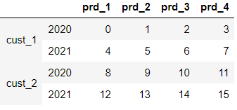

```python
dataStacked = data.stack()
dataStacked
# > cust_1  2020  prd_1     0
# >               prd_2     1
# >               prd_3     2
# >               prd_4     3
# >         2021  prd_1     4
# >               prd_2     5
# >               prd_3     6
# >               prd_4     7
# > cust_2  2020  prd_1     8
# >               prd_2     9
# >               prd_3    10
# >               prd_4    11
# >         2021  prd_1    12
# >               prd_2    13
# >               prd_3    14
# >               prd_4    15
# > dtype: int32

dataStacked['cust_2']
# > 2020  prd_1     8
# >       prd_2     9
# >       prd_3    10
# >       prd_4    11
# > 2021  prd_1    12
# >       prd_2    13
# >       prd_3    14
# >       prd_4    15
# > dtype: int32

dataStacked['cust_2']['2020']
# > prd_1     8
# > prd_2     9
# > prd_3    10
# > prd_4    11
# > dtype: int32

dataStacked['cust_2']['2020']['prd_1']
# > 8

dataStacked['cust_2']['2020'][['prd_1', 'prd_2']]
# > prd_1    8
# > prd_2    9
# > dtype: int32
```
```python
data.ix['cust_2', 'prd_3']
# > 2020    10
# > 2021    14
# > Name: prd_3, dtype: int32

data.ix['cust_2', 'prd_3'] = np.nan
data
```

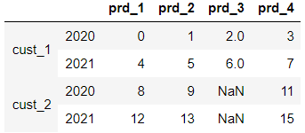

```python
data.stack()
# > cust_1  2020  prd_1     0.0
# >               prd_2     1.0
# >               prd_3     2.0
# >               prd_4     3.0
# >         2021  prd_1     4.0
# >               prd_2     5.0
# >               prd_3     6.0
# >               prd_4     7.0
# > cust_2  2020  prd_1     8.0
# >               prd_2     9.0
# >               prd_4    11.0
# >         2021  prd_1    12.0
# >               prd_2    13.0
# >               prd_4    15.0
# > dtype: float64

data.stack(dropna=True) # default
# > cust_1  2020  prd_1     0.0
# >               prd_2     1.0
# >               prd_3     2.0
# >               prd_4     3.0
# >         2021  prd_1     4.0
# >               prd_2     5.0
# >               prd_3     6.0
# >               prd_4     7.0
# > cust_2  2020  prd_1     8.0
# >               prd_2     9.0
# >               prd_4    11.0
# >         2021  prd_1    12.0
# >               prd_2    13.0
# >               prd_4    15.0
# > dtype: float64

data.stack(dropna=False)
# level=0,  =1,   =2 ; unstack에서 옵션으로 사용
# > cust_1  2020  prd_1     0.0
# >               prd_2     1.0
# >               prd_3     2.0
# >               prd_4     3.0
# >         2021  prd_1     4.0
# >               prd_2     5.0
# >               prd_3     6.0
# >               prd_4     7.0
# > cust_2  2020  prd_1     8.0
# >               prd_2     9.0
# >               prd_3     NaN
# >               prd_4    11.0
# >         2021  prd_1    12.0
# >               prd_2    13.0
# >               prd_3     NaN
# >               prd_4    15.0
# > dtype: float64
```

- **unstack**

```python
dataStacked.unstack()
```

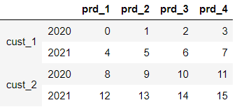

```python
dataStacked.unstack(level=0) # level=0 : 'cust_*'
```

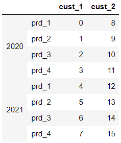

```python
dataStacked.unstack(level=1) # level=1 : '202*'
```

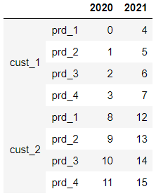

```python
dataStacked.unstack(level=2) # level=2 : 'prd_*'
```

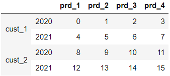

```python
dataStacked.unstack(level=-1) # level=-1 : 'prd_*' ; default
```


## wide_to_long

```python
data_wide = pd.DataFrame({
    "C1prd1" : {0 : "a", 1 : "b", 2 : "c"},
    "C1prd2" : {0 : "d", 1 : "e", 2 : "f"},# 중첩 딕셔너리 구조
    "C2prd1" : {0 : 2.5, 1 : 1.2, 2 : .7}, # {행인덱스 : value}
    "C2prd2" : {0 : 3.2, 1 : 1.3, 2 : .1},
    "value" : dict(zip(range(3), np.random.randn(3)))
   })
data_wide
```

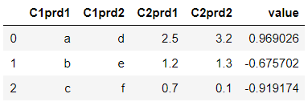

```python
data_wide["seq_no"] = data_wide.index
data_wide
```

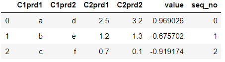

```python
pd.wide_to_long(data_wide, ["C1prd", "C2prd"], i="seq_no", j="prd")
# ["C1prd", "C2prd"]열 생성, "seq_no"
# pandas에서만 제공하는 함수
```

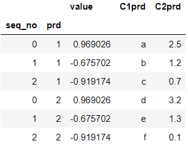

```python
pd.wide_to_long(data_wide, ["C1", "C2"], i="seq_no", j="prd", suffix='\\w+')
# suffix(접미사) 옵션을 지정해 주어야 값에 문자 또한 들어간다.
```

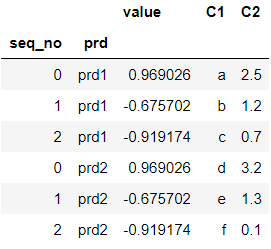


## crosstab

```python
data = pd.DataFrame({
    'id' : ['id1', 'id1', 'id1', 'id2', 'id2', 'id3'],
    'f1' : ['a', 'a', 'a', 'b', 'b', 'b'],
    'f2' : ['d', 'd', 'd', 'c', 'c', 'd']
})
data
```

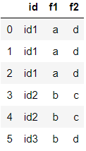

```python
pd.crosstab(data.f1, data.f2) # (인덱스, 컬럼)
# value=자료의 건수
```

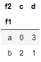


# Titanic data

```python
train = pd.read_csv('../train.csv')
train.head()
```

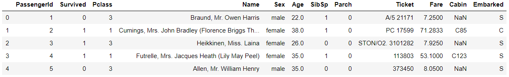


## groupby, pivot_table

- **성별에 따른 생존률?**

```python
train.groupby('Sex') # DataFrameGroupBy
# > <pandas.core.groupby.generic.DataFrameGroupBy object at 0x00000186972D74C8>

train.groupby('Sex')['Survived'] # SeriesGroupBy
# > <pandas.core.groupby.generic.SeriesGroupBy object at 0x00000186971C21C8>

train.groupby('Sex')[['Survived']] # DataFrameGroupBy
# > <pandas.core.groupby.generic.DataFrameGroupBy object at 0x00000186972A7B48>
```
```python
train.groupby('Sex')['Survived'].mean()
# groupby(그룹화기준컬럼)[열].함수()
# > Sex
# > female    0.742038
# > male      0.188908
# > Name: Survived, dtype: float64

train.groupby('Sex')[['Survived']].mean()
```

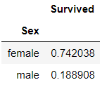

- pivot_table 함수로 동일한 결과

```python
pd.pivot_table(train, values='Survived', index='Sex')
```

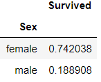

```python
pd.pivot_table(train, values='Survived', index='Sex', 
               aggfunc=np.mean) # default
```

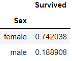

```python
pd.pivot_table(train, values='Survived', index='Sex', 
               aggfunc=np.sum) # 생존자 확인
```

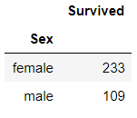

```python
train.pivot_table(values='Survived', index='Sex')
```


- **성별에 따른 모든 열들의 평균**

```python
train.pivot_table(index=['Sex'])
```

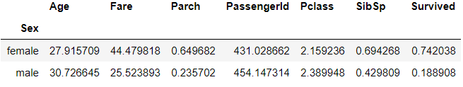

- **성별, 선실등급별 생존률**

```python
train.groupby(['Sex', 'Pclass'])[['Survived']].mean()
```

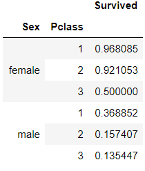

```python
train.pivot_table(values='Survived', 
                  index=['Sex', 'Pclass'])
```

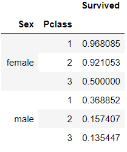

- 순서만 잘 지키면 굳이 속성을 입력하지 않아도 된다.

```python
train.pivot_table('Survived', ['Sex', 'Pclass'], aggfunc=np.mean) 
```


## describe

- describe() : 간단한 기술통계 함수

```python
train.describe() # 기술통계 결과 요약 출력
```

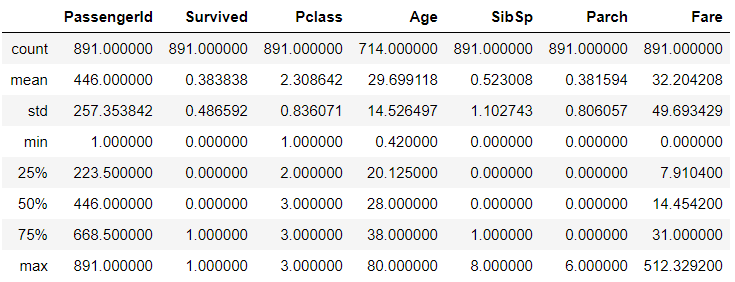

- 성별로 구분(groupby), 생존여부(Survived) 컬럼에 대하여 describe 함수 적용

```python
train.groupby('Sex')[['Survived']].describe()
```

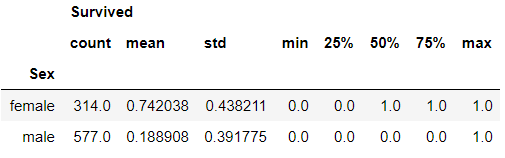

```python
train.groupby('Sex')['Survived'].describe()
# 위와 다른점 : Survived라는 변수명이 없다.
```

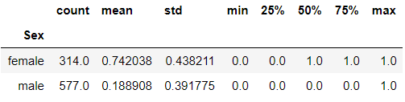


## 조건에 따른 열 생성

```python
train.info()
# > <class 'pandas.core.frame.DataFrame'>
# > RangeIndex: 891 entries, 0 to 890
# > Data columns (total 12 columns):
# > PassengerId    891 non-null int64
# > Survived       891 non-null int64
# > Pclass         891 non-null int64
# > Name           891 non-null object
# > Sex            891 non-null object
# > Age            714 non-null float64
# > SibSp          891 non-null int64
# > Parch          891 non-null int64
# > Ticket         891 non-null object
# > Fare           891 non-null float64
# > Cabin          204 non-null object
# > Embarked       889 non-null object
# > dtypes: float64(2), int64(5), object(5)
# > memory usage: 83.7+ KB
```

```python
train.Sex == "female"
# > 0      False
# > 1       True
# > 2       True
# > 3       True
# > 4      False
# >        ...  
# > 886    False
# > 887     True
# > 888     True
# > 889    False
# > 890    False
# > Name: Sex, Length: 891, dtype: bool

(train.Sex == "female") & (train.Age > 0) & (train.Embarked)
# > 0      False
# > 1       True
# > 2       True
# > 3       True
# > 4      False
# >        ...  
# > 886    False
# > 887     True
# > 888    False
# > 889    False
# > 890    False
# > Length: 891, dtype: bool

train['Survived_2'] = (train.Sex == "female") & (train.Age > 0) & (train.Embarked)
train.head()
```

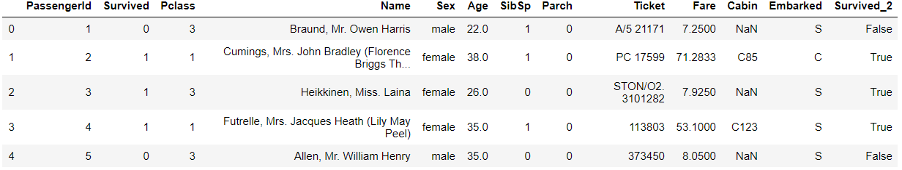

- 누락값 갯수 확인

```python
train.isnull().sum()
# > PassengerId      0
# > Survived         0
# > Pclass           0
# > Name             0
# > Sex              0
# > Age            177
# > SibSp            0
# > Parch            0
# > Ticket           0
# > Fare             0
# > Cabin          687
# > Embarked         2
# > Survived_2       0
# > dtype: int64
```

```python
train['Survived_2'].value_counts()
# > False    632
# > True     259
# > Name: Survived_2, dtype: int64
```

- 생성한 'Survived_2'열의 데이터를 0 or 1로 변경

```python
train['Survived_2'] = train['Survived_2'].astype(int)
train['Survived_2']
# > 0      0
# > 1      1
# > 2      1
# > 3      1
# > 4      0
# >       ..
# > 886    0
# > 887    1
# > 888    0
# > 889    0
# > 890    0
# > Name: Survived_2, Length: 891, dtype: int32
```


## 시각화

- R의 ggplot2를 사용하기 위하여 plotnine 설치
  - Anaconda prompt -> `pip install plotnine`
  - Jupyter Notebook -> `from plotnine import *`
- 누락값들에 대한 시각화를 위한 패키지
  - Anaconda prompt -> `pip install missingno`
  - Jupyter Notebook -> `import missingno as msno`

```python
from plotnine import *
import missingno as msno

train.columns
# > Index(['PassengerId', 'Survived', 'Pclass', 'Name', 'Sex', 'Age', 'SibSp',
# >        'Parch', 'Ticket', 'Fare', 'Cabin', 'Embarked', 'Survived_2'],
# >       dtype='object')
```


### missingno

- 누락값 확인하기
  - 누락값 흰색선으로 표시

```python
msno.matrix(train)
```

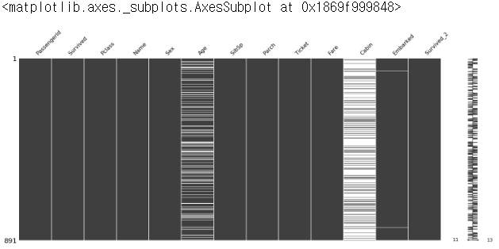


### plotnine

```python
(ggplot(train))
```


```python
(ggplot(train)
+ aes(x="Sex", y="Survived")
)
```

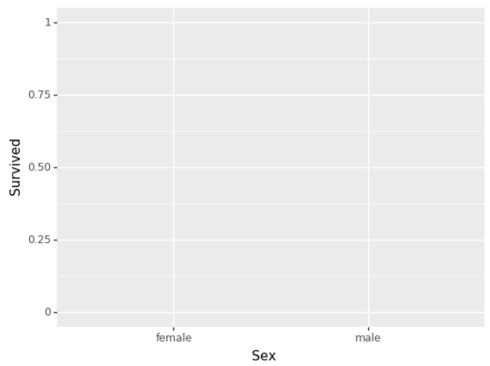

```python
(ggplot(train)
+ aes(x="Sex", y="Survived")
+ geom_col()
)
```


```python
(ggplot(train)
+ aes(x="Sex", y="Survived")
+ geom_col()
+ ggtitle("Survive rate by Sex")
)
```

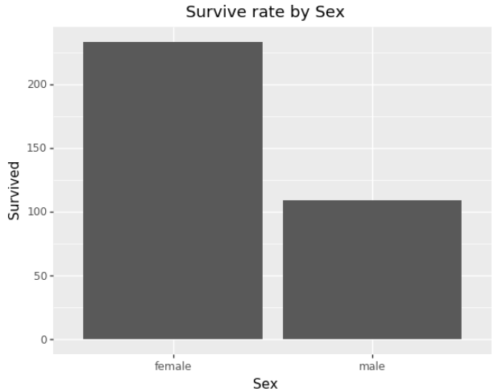

- 한글 깨짐

```python
(ggplot(train)
+ aes(x="Sex", y="Survived")
+ geom_col()
+ ggtitle("성별 생존률")
)
```


# Kaggle : Titanic(train, test)

```python
train = pd.read_csv('train.csv')
test = pd.read_csv('test.csv')

train.shape
# > (891, 12)

test.shape
# > (418, 11)

train.head()
```

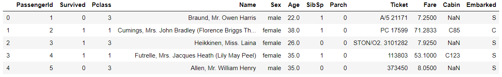

```python
test.head()
```

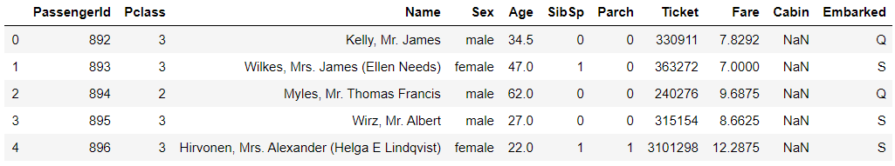

```python
train.describe()
```

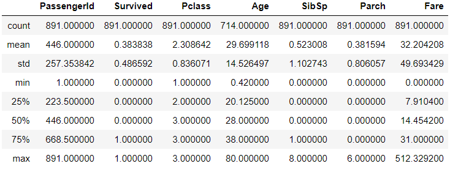

```python
test.describe()
```

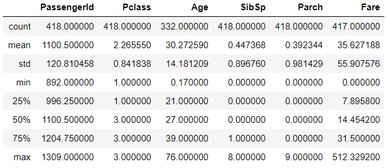

```python
train.info()
# > <class 'pandas.core.frame.DataFrame'>
# > RangeIndex: 891 entries, 0 to 890
# > Data columns (total 12 columns):
# > PassengerId    891 non-null int64
# > Survived       891 non-null int64
# > Pclass         891 non-null int64
# > Name           891 non-null object
# > Sex            891 non-null object
# > Age            714 non-null float64
# > SibSp          891 non-null int64
# > Parch          891 non-null int64
# > Ticket         891 non-null object
# > Fare           891 non-null float64
# > Cabin          204 non-null object
# > Embarked       889 non-null object
# > dtypes: float64(2), int64(5), object(5)
# > memory usage: 83.7+ KB

test.info()
# > <class 'pandas.core.frame.DataFrame'>
# > RangeIndex: 418 entries, 0 to 417
# > Data columns (total 11 columns):
# > PassengerId    418 non-null int64
# > Pclass         418 non-null int64
# > Name           418 non-null object
# > Sex            418 non-null object
# > Age            332 non-null float64
# > SibSp          418 non-null int64
# > Parch          418 non-null int64
# > Ticket         418 non-null object
# > Fare           417 non-null float64
# > Cabin          91 non-null object
# > Embarked       418 non-null object
# > dtypes: float64(2), int64(4), object(5)
# > memory usage: 36.0+ KB
```

```python
test.Sex == "female"
# > 0      False
# > 1       True
# > 2      False
# > 3      False
# > 4       True
# >        ...  
# > 413    False
# > 414     True
# > 415    False
# > 416    False
# > 417    False
# > Name: Sex, Length: 418, dtype: bool

test.Embarked
# > 0      Q
# > 1      S
# > 2      Q
# > 3      S
# > 4      S
# >       ..
# > 413    S
# > 414    C
# > 415    S
# > 416    S
# > 417    C
# > Name: Embarked, Length: 418, dtype: object

test.Age
# > 0      34.5
# > 1      47.0
# > 2      62.0
# > 3      27.0
# > 4      22.0
# >        ... 
# > 413     NaN
# > 414    39.0
# > 415    38.5
# > 416     NaN
# > 417     NaN
# > Name: Age, Length: 418, dtype: float64

test['Survived'] = (test.Sex == "female") & (test.Embarked) & (test.Age > 0)
test.head()
```

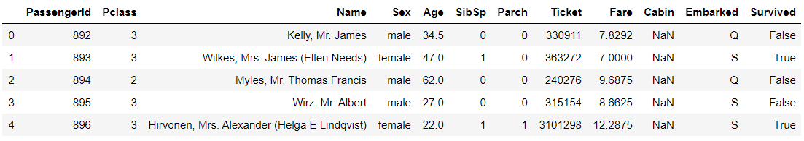

```python
test.isnull().sum()
# > PassengerId      0
# > Pclass           0
# > Name             0
# > Sex              0
# > Age             86
# > SibSp            0
# > Parch            0
# > Ticket           0
# > Fare             1
# > Cabin          327
# > Embarked         0
# > Survived         0
# > dtype: int64

test['Survived'].value_counts()
# > False    291
# > True     127
# > Name: Survived, dtype: int64

submission = test[['PassengerId', 'Survived']]
submission.head()
```

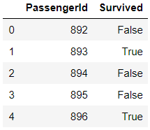

```python
submission['Survived'] = submission['Survived'].astype(int)
submission.head()
```

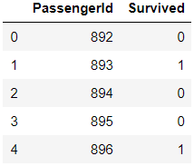

```python
submission.to_csv('submission.csv', index=False)
# Kaggle 제출용 파일 생성
```


## 범주형 변수 변환

- 범주형 데이터 -> 원핫인코딩
- 혈액형 : A, B, A, AB, O, O
- A : 1000
- B : 0100
- AB: 0010
- O : 0001

```python
train.info()
# > <class 'pandas.core.frame.DataFrame'>
# > RangeIndex: 891 entries, 0 to 890
# > Data columns (total 12 columns):
# > PassengerId    891 non-null int64
# > Survived       891 non-null int64
# > Pclass         891 non-null int64
# > Name           891 non-null object
# > Sex            891 non-null object
# > Age            714 non-null float64
# > SibSp          891 non-null int64
# > Parch          891 non-null int64
# > Ticket         891 non-null object
# > Fare           891 non-null float64
# > Cabin          204 non-null object
# > Embarked       889 non-null object
# > dtypes: float64(2), int64(5), object(5)
# > memory usage: 83.7+ KB

train.select_dtypes(include=['object'])
```

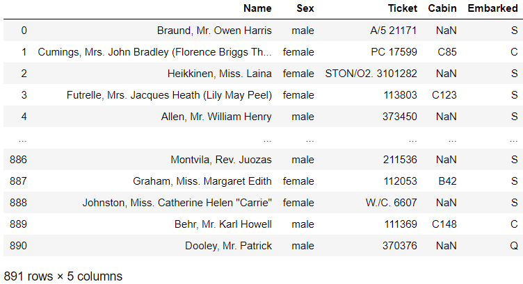

```python
train.select_dtypes(include=['object', 'int64'])
```

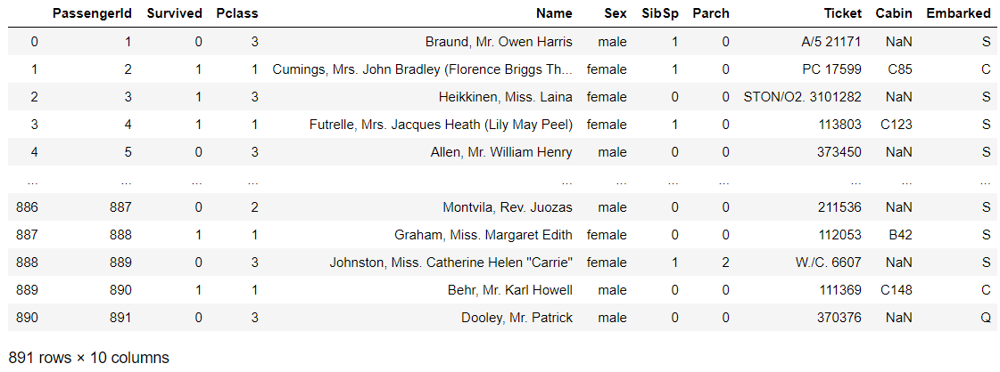

```python
obj_df = train.select_dtypes(include=['object'])
obj_df['Name'].isnull().sum()
# > 0

obj_df.info()
# > <class 'pandas.core.frame.DataFrame'>
# > RangeIndex: 891 entries, 0 to 890
# > Data columns (total 5 columns):
# > Name        891 non-null object
# > Sex         891 non-null object
# > Ticket      891 non-null object
# > Cabin       204 non-null object
# > Embarked    889 non-null object
# > dtypes: object(5)
# > memory usage: 34.9+ KB
```

- 단하나의 열이라도 NaN이 포함된다면, 해당 행 전체를 추출

```python
obj_df.isnull()
```

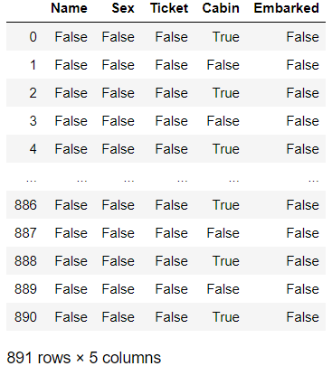

```python
obj_df.isnull().any()
# > Name        False
# > Sex         False
# > Ticket      False
# > Cabin        True
# > Embarked     True
# > dtype: bool

obj_df.isnull().any(axis=0) # default
# > Name        False
# > Sex         False
# > Ticket      False
# > Cabin        True
# > Embarked     True
# > dtype: bool

obj_df.isnull().any(axis=1) # 결측값이 하나라도 존재하면 참
# > 0       True
# > 1      False
# > 2       True
# > 3      False
# > 4       True
# >        ...  
# > 886     True
# > 887    False
# > 888     True
# > 889    False
# > 890     True
# > Length: 891, dtype: bool

obj_df[obj_df.isnull().any(axis=1)].head()
```

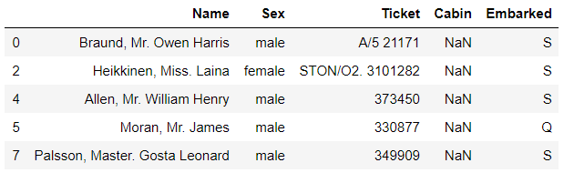

- **domain knowledge 필요**

```python
obj_df['Cabin'] # 승객들의 방번호
# > 0       NaN
# > 1       C85
# > 2       NaN
# > 3      C123
# > 4       NaN
# >        ... 
# > 886     NaN
# > 887     B42
# > 888     NaN
# > 889    C148
# > 890     NaN
# > Name: Cabin, Length: 891, dtype: object

obj_df['Cabin'].value_counts()
# > G6             4
# > C23 C25 C27    4
# > B96 B98        4
# > F2             3
# > C22 C26        3
# >               ..
# > T              1
# > A10            1
# > F G63          1
# > A5             1
# > A36            1
# > Name: Cabin, Length: 147, dtype: int64

train['Embarked'] # 승선지 정보(C, S, Q) 중 하나는 부유한 지역
train['Pclass'] # 승선실 등급
```

- Sex 변수 수치로 변환

```python
train['Sex'] # 수치로 변환 필요
# > 0        male
# > 1      female
# > 2      female
# > 3      female
# > 4        male
# >         ...  
# > 886      male
# > 887    female
# > 888    female
# > 889      male
# > 890      male
# > Name: Sex, Length: 891, dtype: object

train[train['Sex'] == "male"]['Sex']=0
train.head()
```

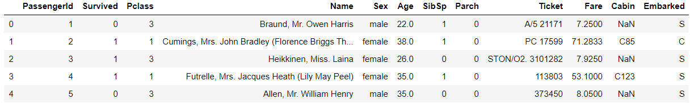

```python
# Series라서 Sex가 변하지 않음
type(train[train['Sex'] == "male"]['Sex'])
# > pandas.core.series.Series

# Series를 변환하려면 하나씩 대입 해야한다.
train.loc[train['Sex']=="male", "Sex"]
# > 0      male
# > 4      male
# > 5      male
# > 6      male
# > 7      male
# >        ... 
# > 883    male
# > 884    male
# > 886    male
# > 889    male
# > 890    male
# > Name: Sex, Length: 577, dtype: object

train.loc[train['Sex']=="male", "Sex"] = 0
train['Sex']
# > 0           0
# > 1      female
# > 2      female
# > 3      female
# > 4           0
# >         ...  
# > 886         0
# > 887    female
# > 888    female
# > 889         0
# > 890         0
# > Name: Sex, Length: 891, dtype: object

train.loc[train['Sex']=="female", "Sex"] = 1
train['Sex']
# > 0      0
# > 1      1
# > 2      1
# > 3      1
# > 4      0
# >       ..
# > 886    0
# > 887    1
# > 888    1
# > 889    0
# > 890    0
# > Name: Sex, Length: 891, dtype: int64
```

- test 데이터도 동일하게 변경

```python
test.loc[test['Sex']=="male", "Sex"] = 0
test.loc[test['Sex']=="female", "Sex"] = 1
test.Sex
# > 0      0
# > 1      1
# > 2      0
# > 3      0
# > 4      1
# >       ..
# > 413    0
# > 414    1
# > 415    0
# > 416    0
# > 417    0
# > Name: Sex, Length: 418, dtype: int64
```


### sklearn의 LabelEncoder

```python
from sklearn.preprocessing import LabelEncoder
```

- 1.

```python
train = pd.read_csv('train.csv')
test = pd.read_csv('test.csv')

le = LabelEncoder()
le.fit(["male", "female"])
train['Sex'] = le.transform(train['Sex'])
train['Sex'] # male=1, female=0으로 변환
# > 0      1
# > 1      0
# > 2      0
# > 3      0
# > 4      1
# >       ..
# > 886    1
# > 887    0
# > 888    0
# > 889    1
# > 890    1
# > Name: Sex, Length: 891, dtype: int32

test['Sex'] = le.transform(test['Sex'])
test['Sex']
# > 0      1
# > 1      0
# > 2      1
# > 3      1
# > 4      0
# >       ..
# > 413    1
# > 414    0
# > 415    1
# > 416    1
# > 417    1
# > Name: Sex, Length: 418, dtype: int32
```

- 2.함수정의

```python
train = pd.read_csv('train.csv')
test = pd.read_csv('test.csv')

def genToint(data) : 
    le = LabelEncoder()
    le.fit(["male", "female"])
    data['Sex'] = le.transform(data['Sex'])
    return data

train = genToint(train)
train.head()
```

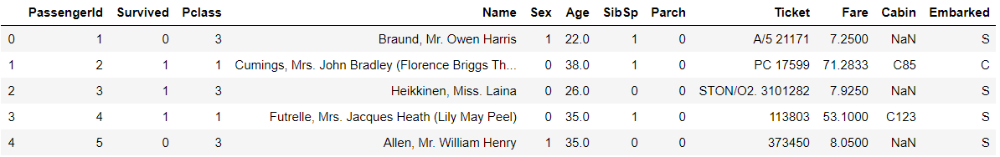

```python
test = genToint(test)
test.head()
```

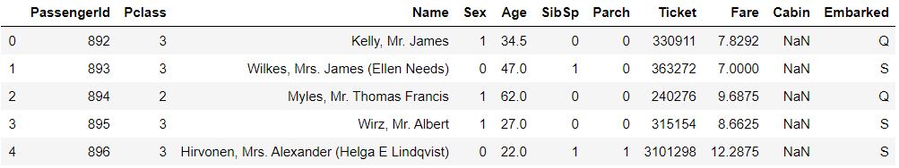

----

## cf) 카피본 만들기

```python
train = pd.read_csv('train.csv')
test = pd.read_csv('test.csv')
trainCopy = train.copy()
testCopy = test.copy()
```

----

```python
trainCopy = genToint(trainCopy)
trainCopy.head()
```

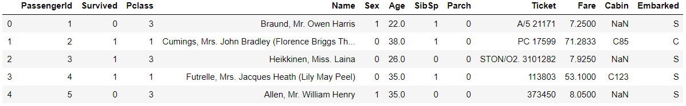

```python
train.head()
```

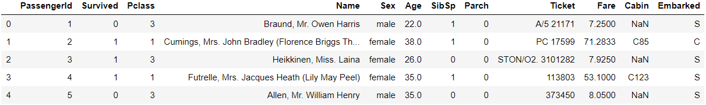


### pd.get_dummy

- Sex(남/여), Pclass(1/2/3), Embarked(C/Q/S)
- 10/01, 100/010/001, 100/010/001

```python
dummy_columns=['Sex', 'Pclass', 'Embarked']

def myDummy(data, columns) :
    # 각각의 컬럼 값을 원핫인코딩 -> 리턴
    for column in columns :
        print(data[column])
# Sex0 Sex1 Pclass1 Pclass2 Pclass3 Embarked_Q Embarked_C Embarked_S
    
myDummy(train, dummy_columns)
# > 0        male
# > 1      female
# > 2      female
# > 3      female
# > 4        male
# >         ...  
# > 886      male
# > 887    female
# > 888    female
# > 889      male
# > 890      male
# > Name: Sex, Length: 891, dtype: object
# > 0      3
# > 1      1
# > 2      3
# > 3      1
# > 4      3
# >       ..
# > 886    2
# > 887    1
# > 888    3
# > 889    1
# > 890    3
# > Name: Pclass, Length: 891, dtype: int64
# > 0      S
# > 1      C
# > 2      S
# > 3      S
# > 4      S
# >       ..
# > 886    S
# > 887    S
# > 888    S
# > 889    C
# > 890    Q
# > Name: Embarked, Length: 891, dtype: object
```

```python
def myDummy(data, columns) :
    # 각각의 컬럼 값을 원핫인코딩 -> 리턴
    for column in columns :
        print(pd.get_dummies(data[column]))
# Sex0 Sex1 Pclass1 Pclass2 Pclass3 Embarked_Q Embarked_D Embarked_S

myDummy(train, dummy_columns)
# >      female  male
# > 0         0     1
# > 1         1     0
# > 2         1     0
# > 3         1     0
# > 4         0     1
# > ..      ...   ...
# > 886       0     1
# > 887       1     0
# > 888       1     0
# > 889       0     1
# > 890       0     1
# > 
# > [891 rows x 2 columns]
# >      1  2  3
# > 0    0  0  1
# > 1    1  0  0
# > 2    0  0  1
# > 3    1  0  0
# > 4    0  0  1
# > ..  .. .. ..
# > 886  0  1  0
# > 887  1  0  0
# > 888  0  0  1
# > 889  1  0  0
# > 890  0  0  1
# > 
# > [891 rows x 3 columns]
# >      C  Q  S
# > 0    0  0  1
# > 1    1  0  0
# > 2    0  0  1
# > 3    0  0  1
# > 4    0  0  1
# > ..  .. .. ..
# > 886  0  0  1
# > 887  0  0  1
# > 888  0  0  1
# > 889  1  0  0
# > 890  0  1  0
# > 
# > [891 rows x 3 columns]
```

```python
def myDummy(data, columns) :
    # 각각의 컬럼 값을 원핫인코딩 -> 리턴
    for column in columns :
        print(pd.get_dummies(data[column], prefix=column))
# Sex0 Sex1 Pclass1 Pclass2 Pclass3 Embarked_Q Embarked_D Embarked_S
    
myDummy(train, dummy_columns)
# >      Sex_female  Sex_male
# > 0             0         1
# > 1             1         0
# > 2             1         0
# > 3             1         0
# > 4             0         1
# > ..          ...       ...
# > 886           0         1
# > 887           1         0
# > 888           1         0
# > 889           0         1
# > 890           0         1
# > 
# > [891 rows x 2 columns]
# >      Pclass_1  Pclass_2  Pclass_3
# > 0           0         0         1
# > 1           1         0         0
# > 2           0         0         1
# > 3           1         0         0
# > 4           0         0         1
# > ..        ...       ...       ...
# > 886         0         1         0
# > 887         1         0         0
# > 888         0         0         1
# > 889         1         0         0
# > 890         0         0         1
# > 
# > [891 rows x 3 columns]
# >      Embarked_C  Embarked_Q  Embarked_S
# > 0             0           0           1
# > 1             1           0           0
# > 2             0           0           1
# > 3             0           0           1
# > 4             0           0           1
# > ..          ...         ...         ...
# > 886           0           0           1
# > 887           0           0           1
# > 888           0           0           1
# > 889           1           0           0
# > 890           0           1           0
# > 
# > [891 rows x 3 columns]
```

```python
def myDummy(data, columns) :
    # 각각의 컬럼 값을 원핫인코딩 -> 리턴
    for column in columns :
#         print(pd.get_dummies(data[column], prefix=column))
# Sex0 Sex1 Pclass1 Pclass2 Pclass3 Embarked_Q Embarked_D Embarked_S
        # data에 모든 열 추가
        data = pd.concat([data, pd.get_dummies(data[column], prefix=column)], axis=1)
        data = data.drop(column, axis=1)
    return data
    
trainDummy = myDummy(train, dummy_columns)
testDummy = myDummy(test, dummy_columns)

print("원핫인코딩 이전")
print(train.shape)
print(test.shape)
print("원핫인코딩 이후")
print(trainDummy.shape)
print(testDummy.shape)
# > 원핫인코딩 이전
# > (891, 12)
# > (418, 11)
# > 원핫인코딩 이후
# > (891, 17)
# > (418, 16)

trainDummy.head()
```

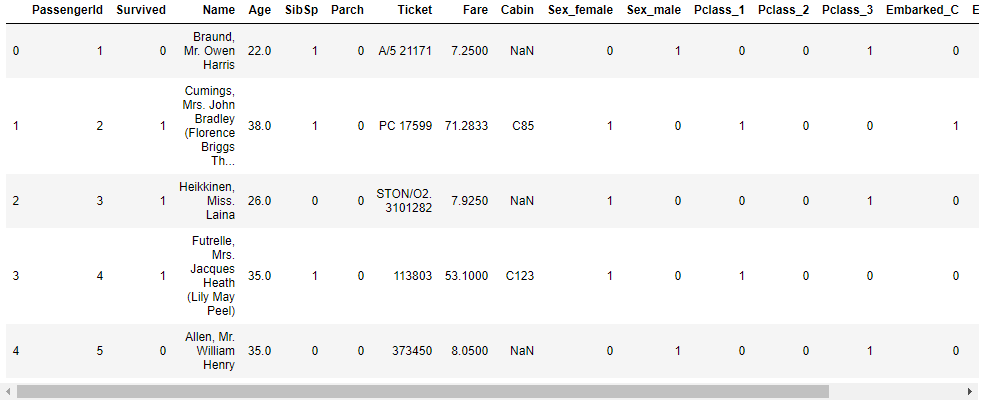

```python
testDummy.head()
```

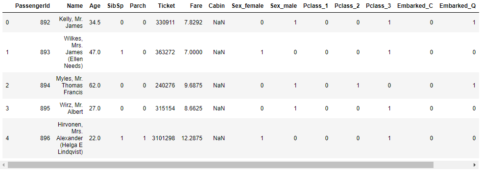

- dummy 이용
  - 모델 = sigmoid(가중치1*pcalss1 + 가중치2*pcalss2 + 가중치3*pcalss3 +...)
    - sigmoid(x) = 1/(1+e^(-x)) => 0~1
  - if 모델 > 0.5 => 1(생존)
  - else => 0(사망)


# 연습문제

- 목표 : Kaggle Titanic 등수 올리기(3900등 이상)
  - 조건문 개선
  - Name => Age 결측값 처리
  - Mrs => Mrs 그룹 중앙값
  - Miss => Miss 그룹 중앙값
  - ... 대표적인 것만
  - 나머지는 전체 데이터 평균 or 중앙값
  - FamilySize 컬럼 추가(SibSp + Parch), binning(L/M/S)

## A.

- 기존 분류 방법의 train 정분류율 확인

```python
trainCopy = train.copy()
trainCopy['P'] = (trainCopy.Sex == "female") & (trainCopy.Embarked) & (trainCopy.Age >0)
pd.crosstab(trainCopy.Survived, trainCopy.P) # 0.7632
# total = 891 => 680/891
```

- 새로운 분류방법 찾기

```python
# 각 승객의 호칭에 대한 열 생성
trainCopy['NTitle'] = trainCopy['Name'].str.extract("\, ([a-zA-Z]+)\.") 
# 각 호칭의 중앙값으로 Age의 결측치 대체
trainCopy['Age'] = trainCopy['Age'].fillna(trainCopy.groupby('NTitle')['Age'].transform('median'))
# FamilySize 컬럼 추가
trainCopy['FamilySize'] = trainCopy['SibSp'] + trainCopy['Parch']

# 나이 구간별로 cut
bins = [0, 16, 26, 36, 62, trainCopy.Age.max()]
trainCopy['AgeCut'] = pd.cut(trainCopy.Age, bins, labels=[0,1,2,3,4])

# 각 조건별 생존율 확인
trainCopy.groupby(['Sex', 'AgeCut', 'Embarked', 'FamilySize'])[['Survived']].mean()

# 생존율에 따른 예측
# 우선 여성과 남성을 나눔
trainCopy['P'] = (trainCopy.Sex == "female") & (trainCopy.FamilySize < 4)
# 특정한 조건에 따른 생존 변경
# 여성 & 나이(36, 62] & Embarked=Q => dead
trainCopy['P'] = np.where((trainCopy.Sex == "female") & (trainCopy.AgeCut == 3) & (trainCopy.Embarked == 'Q'), False, trainCopy['P'])
# 남성 & 나이(0,16] & FamilySize<4 => survive
trainCopy['P'] = np.where((trainCopy.Sex == "male") & (trainCopy.AgeCut == 0) & (trainCopy.FamilySize < 4), True, trainCopy['P'])
# 남성 & 나이(26, 36] & Embarked=Q & FamilySize=2 => survive
trainCopy['P'] = np.where((trainCopy.Sex == "male") & (trainCopy.AgeCut == 2) & (trainCopy.Embarked == 'Q') & (trainCopy.FamilySize == 2), True, trainCopy['P'])
```

- 새로운 분류 방법 test 데이터에 적용

```python
testCopy = test.copy()
# 각 승객의 호칭에 대한 열 생성
testCopy['NTitle'] = testCopy['Name'].str.extract("\, ([a-zA-Z]+)\.") 
# train datad에서 각 호칭의 중앙값으로 Age의 결측치 대체
testCopy['Age'] = testCopy['Age'].fillna(trainCopy.groupby('NTitle')['Age'].transform('median'))
# FamilySize 컬럼 추가
testCopy['FamilySize'] = testCopy['SibSp'] + testCopy['Parch']

# 나이 구간별로 cut
bins = [0, 16, 26, 36, 62, trainCopy.Age.max()]
testCopy['AgeCut'] = pd.cut(testCopy.Age, bins, labels=[0,1,2,3,4])

# 생존율에 따른 예측
# 우선 여성과 남성을 나눔
testCopy['Survived'] = (testCopy.Sex == "female") & (testCopy.FamilySize < 4)
# 특정한 조건에 따른 생존 변경
# 여성 & 나이(36, 62] & Embarked=Q => dead
testCopy['Survived'] = np.where((testCopy.Sex == "female") & (testCopy.AgeCut == 3) & (testCopy.Embarked == 'Q'), False, testCopy['Survived'])
# 남성 & 나이(0,16] & FamilySize<4 => survive
testCopy['Survived'] = np.where((testCopy.Sex == "male") & (testCopy.AgeCut == 0) & (testCopy.FamilySize < 4), True, testCopy['Survived'])
# 남성 & 나이(26, 36] & Embarked=Q & FamilySize=2 => survive
testCopy['Survived'] = np.where((testCopy.Sex == "male") & (testCopy.AgeCut == 2) & (testCopy.Embarked == 'Q') & (testCopy.FamilySize == 2), True, testCopy['Survived'])

submission = testCopy[['PassengerId', 'Survived']]
submission.head() # 잘 생성 되었는지 확인

submission['Survived'] = submission['Survived'].astype(int)
submission.head() # int로 변경 확인

# 파일 저장
submission.to_csv('submission_self.csv', index=False)
```

- 결론 : 점수가 똑같다. 실패


## cf) DataFrame 전체 출력해주는 옵션

- `pd.set_option('display.max_rows', 500)`