# Day23 딥러닝을 위한 빅데이터 기초 - 데이터 분석를 위한 NumPy, Pandas (9)

# copy

## 변수의 주소 확인

```python
a = [1,2,3]
id(a) # 변수의 메모리 주소값을 리턴
# > 2007685059912

a[0] = 10 # 값은 변경, 주소는 변경X
id(a)
# > 2007685059912
```

```python
x = {1,2,3}
id(x)
# > 2007686784840

x |= {4,5,6} # |:or(합집합), &:and(교집합)
x
# > {1, 2, 3, 4, 5, 6}

id(x)
# > 2007686784840
```

```python
s = "abc"
id(s)
# > 2007644737712

s = "kbc" # 메모리 주소 변경
s
# > 'kbc'

id(s)
# > 2007686935344
```

## 얕은 복사

```python
a = [1,2,3]
b = a # 얕은 복사
print(id(a))
print(id(b))
# > 2007686256968
# > 2007686256968

a[0] = 10
a
# > [10, 2, 3]

b # 주소값이 같으므로 a와 동일한 결과가 나타난다.
# > [10, 2, 3]

b[0] = 20
b
# > [20, 2, 3]

a
# > [20, 2, 3]
```

- 얕은 복사 : b에 a를 할당하게되면 값이 할당되는 것이 아니라 메모리 주소를 공유함.

```python
a = "abc"
b = a
print(id(a))
print(id(b))
# > 2007644737712
# > 2007644737712

b = "edf" # b가 새롭게 생성
print(id(a))
print(id(b))
# > 2007644737712
# > 2007687139056
```

- 문자열의 경우에는 list의 경우 동일한 메모리 주소를 가르키게 된다.
- 그런데, 다른 값을 할당하게 되면 메모리에서 재할당이 이루어지게 되어,
- 그 결과 메모리 주소가 변경된다.

## 'is' vs '=='

```python
a = [1,2,3]
b = a
print(id(a))
print(id(b))
# > 2007686267400
# > 2007686267400

print(a is b) # 메모리 상의 주소가 동일한지 확인
# > True

print(a == b) # 두 변수에 저장된 값을 비교
# > True
```

```python
a = [1,2,3]
b = a[:]
print(id(a))
print(id(b))
# > 2007686268616
# > 2007686268360

print(a is b)
# > False

print(a == b)
# > True
```

----

```python
a = [[1,2], [3,4]]
# a는 a[0]와 a[1]의 주소를 갖고 있음
# a[0]는 [1,2]가 저장된 주소를 갖고 있음
print(id(a))
# > 2007687107208

print(id(a[0]))
print(id(a[1]))
# > 2007685113672
# > 2007685878856

b = a[:]
print(id(b)) # a와 b의 주소는 다르지만
print(id(b[0])) # a[0]와 b[0]
print(id(b[1])) # a[1]과 b[1]의 주소는 동일하다.
# > 2007686267656
# > 2007685113672
# > 2007685878856

a[0] = [100, 200]
a
# > [[100, 200], [3, 4]]

b
# > [[1, 2], [3, 4]]

print(id(a[0]))# 값이 변경되면서 주소가 재할당 됨
print(id(b[0]))
# > 2007686268872
# > 2007685113672
```
```python
print(a[1])
print(id(a[1]))
# > [3, 4]
# > 2007685878856

a[1].append(5) # append의 경우 주소가 재할당 되지 않으므로 b[1]에도 동일하게 추가 된다.
a
# > [[100, 200], [3, 4, 5]]

print(id(a[1]))
# > 2007685878856

b
# > [[1, 2], [3, 4, 5]]

print(id(b[1]))
# > 2007685878856
```


## copy 모듈

- 내부 객체들이 서로 복사

```python
import copy
a = [[1,2], [3,4]]
b = a
print(id(a))
print(id(b))
# > 2007703198664
# > 2007703198664

print(id(a[0]))
print(id(b[0]))
# > 2007685301064
# > 2007685301064

a[1]
# > [3, 4]

a[1] = [5,6]
a
# > [[1, 2], [5, 6]]

b
# > [[1, 2], [5, 6]]

a[1].append(9)
a
# > [[1, 2], [5, 6, 9]]

b
# > [[1, 2], [5, 6, 9]]
```

### 깊은 카피(deepcopy)

```python
a = [[1,2], [3,4]]
b = copy.deepcopy(a)
a[1].append(5)

print(id(a))
print(id(b))
print(a)
print(b)
# > 2007715631496
# > 2007685173576
# > [[1, 2], [3, 4, 5]]
# > [[1, 2], [3, 4]]
```

- copy모듈 : copy(), deepcopy()

```python
a = ["test"]
b = a # 값을 복사하는 것이 아니라, 주소가 복사됨
print(id(a))
print(id(b))
# > 2007714843848
# > 2007714843848

a is b
# > True

a.append("data")
a
# > ['test', 'data']

b
# 참조하는 형태로 정의하였으므로, 주소가 공유
# > ['test', 'data']
```

### 'copy' vs 'deepcopy'

- 값을 복사하는 형태 -> copy모듈
- copy모듈로 값 복사 : 얕은, 깊은 복사

```python
import copy
myList = ["first", ["second"]]
cp = copy.copy(myList)# 얕은 복사(copy)
dp = copy.deepcopy(myList)# 깊은 복사(deepcopy)

print(myList)
print(cp)
print(dp)
# > ['first', ['second']]
# > ['first', ['second']]
# > ['first', ['second']]

print(id(myList), id(cp), id(dp))
# id가 모두 다름(상위 리스트)
# > 2007715028168 2007715612744 2007687167624

print(id(myList[1]), id(cp[1]), id(dp[1]))
# copy함수는 원본 리스트와 같은 위치를 참조(하위 리스트)
# deepcopy함수는 값만 복사하여 id가 다르다.(하위 리스트)
# > 2007715026696 2007715026696 2007715028552

myList[1].append("thrid")
myList
# > ['first', ['second', 'thrid']]

cp
# > ['first', ['second', 'thrid']]

dp
# > ['first', ['second']]
```

```python
a = b # 복사X, 참조(주소 동일)
a = copy.copy(b) # (=b[:]) 얕은 복사
a = copy.deepcopy(b) # 깊은 복사
```


----

```python
import numpy as np
a = np.arange(10, 20)
a
# > array([10, 11, 12, 13, 14, 15, 16, 17, 18, 19])

b = a[0:5]
b[0:5]
# > array([10, 11, 12, 13, 14])

bidx = b[0:5]
bidx
# > array([10, 11, 12, 13, 14])

bidx[0:3] = 100
bidx 
# > array([100, 100, 100,  13,  14])

b
# > array([100, 100, 100,  13,  14])

a
# 메모리를 적게 사용하기 위하여 주소들을 공유하여 이러한 결과가 나타난다.
# > array([100, 100, 100,  13,  14,  15,  16,  17,  18,  19])
```

- 위와같은 상황을 방지하기 위하여 copy 함수 사용

```python
c = np.arange(10,20)
ccopy = c[0:5].copy()
ccopy[0:3] = 100
ccopy
# > array([100, 100, 100,  13,  14])

c
# > array([10, 11, 12, 13, 14, 15, 16, 17, 18, 19])
```

```python
d = np.arange(20).reshape(5,4)
d
# > array([[ 0,  1,  2,  3],
# >        [ 4,  5,  6,  7],
# >        [ 8,  9, 10, 11],
# >        [12, 13, 14, 15],
# >        [16, 17, 18, 19]])

d[0:2]
# > array([[0, 1, 2, 3],
# >        [4, 5, 6, 7]])

d[1,2]
# > 6

d[1:4, 1:3]
# > array([[ 5,  6],
# >        [ 9, 10],
# >        [13, 14]])

dx = d[0]
dx[0:2] = 100
dx
# > array([100, 100,   2,   3])

d
# > array([[100, 100,   2,   3],
# >        [  4,   5,   6,   7],
# >        [  8,   9,  10,  11],
# >        [ 12,  13,  14,  15],
# >        [ 16,  17,  18,  19]])
```


# 시각화

```python
import matplotlib.pyplot as plt
import seaborn as sns
from scipy import stats
import pandas as pd

train = pd.read_csv("../bike-sharing-demand/train.csv", parse_dates=['datetime'])

train.info()
# > <class 'pandas.core.frame.DataFrame'>
# > RangeIndex: 10886 entries, 0 to 10885
# > Data columns (total 12 columns):
# > datetime      10886 non-null datetime64[ns]
# > season        10886 non-null int64
# > holiday       10886 non-null int64
# > workingday    10886 non-null int64
# > weather       10886 non-null int64
# > temp          10886 non-null float64
# > atemp         10886 non-null float64
# > humidity      10886 non-null int64
# > windspeed     10886 non-null float64
# > casual        10886 non-null int64
# > registered    10886 non-null int64
# > count         10886 non-null int64
# > dtypes: datetime64[ns](1), float64(3), int64(8)
# > memory usage: 1020.7 KB

train.head()
```

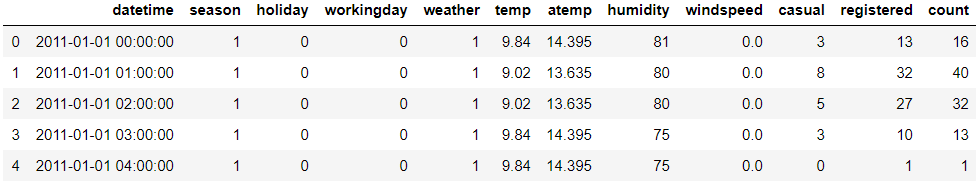

```python
train.describe()
```

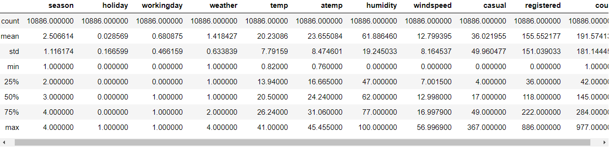

```python
train.temp.describe()
# > count    10886.00000
# > mean        20.23086
# > std          7.79159
# > min          0.82000
# > 25%         13.94000
# > 50%         20.50000
# > 75%         26.24000
# > max         41.00000
# > Name: temp, dtype: float64

train.isnull().sum()
# > datetime      0
# > season        0
# > holiday       0
# > workingday    0
# > weather       0
# > temp          0
# > atemp         0
# > humidity      0
# > windspeed     0
# > casual        0
# > registered    0
# > count         0
# > dtype: int64

import missingno as msno
msno.matrix(train, figsize=(12,5))
# 흰색선이 보이지 않으므로 missing value가 없음을 알 수 있다.
```

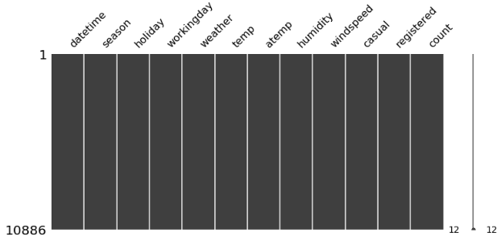

```python
train["datetime"]
# > 0       2011-01-01 00:00:00
# > 1       2011-01-01 01:00:00
# > 2       2011-01-01 02:00:00
# > 3       2011-01-01 03:00:00
# > 4       2011-01-01 04:00:00
# >                 ...        
# > 10881   2012-12-19 19:00:00
# > 10882   2012-12-19 20:00:00
# > 10883   2012-12-19 21:00:00
# > 10884   2012-12-19 22:00:00
# > 10885   2012-12-19 23:00:00
# > Name: datetime, Length: 10886, dtype: datetime64[ns]
```
## barplot
```python
train["year"] = train["datetime"].dt.year
train["month"] = train["datetime"].dt.month
train["day"] = train["datetime"].dt.day
train["hour"] = train["datetime"].dt.hour
train["minute"] = train["datetime"].dt.minute
train["second"] = train["datetime"].dt.second

fig,((ax1, ax2, ax3), (ax4, ax5, ax6)) = plt.subplots(nrows=2, ncols=3)
fig.set_size_inches(16,8)
# 각 x마다의 평균값
sns.barplot(data=train, x="year", y="count", ax=ax1)
sns.barplot(data=train, x="month", y="count", ax=ax2)
# 2011년과 2012년의 데이터가 같이 나오므로 제대로 보려면 년도에 따라 분리해서 보아야 한다.
sns.barplot(data=train, x="day", y="count", ax=ax3)
sns.barplot(data=train, x="hour", y="count", ax=ax4)
sns.barplot(data=train, x="minute", y="count", ax=ax5)
sns.barplot(data=train, x="second", y="count", ax=ax6)
```


## boxplot
```python
fig,axes = plt.subplots(nrows=2, ncols=2)
fig.set_size_inches(20,8)
sns.boxplot(data=train, x="season", y="count", ax=axes[0][0])
sns.boxplot(data=train, x="workingday", y="count", ax=axes[0][1])
sns.boxplot(data=train, orient="v", y="count", ax=axes[1][0])
# count에 대해서만 boxplot을 출력함
sns.boxplot(data=train, x="hour", y="count", ax=axes[1][1])
```

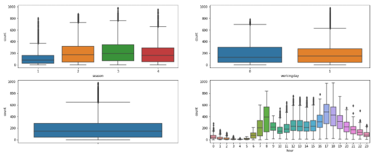


## pointplot(꺾은선 그래프)
```python
train['dayofweek'] = train['datetime'].dt.dayofweek
train.shape
# > (10886, 19)

train["dayofweek"].unique()
# > array([5, 6, 0, 1, 2, 3, 4], dtype=int64)

train["dayofweek"].value_counts(sort=False)
# > 0    1551
# > 1    1539
# > 2    1551
# > 3    1553
# > 4    1529
# > 5    1584
# > 6    1579
# > Name: dayofweek, dtype: int64
```

```python
fig, ax1 = plt.subplots(nrows=1)
fig.set_size_inches(18, 25)
sns.pointplot(data=train, x="hour", y="count", ax=ax1)
```

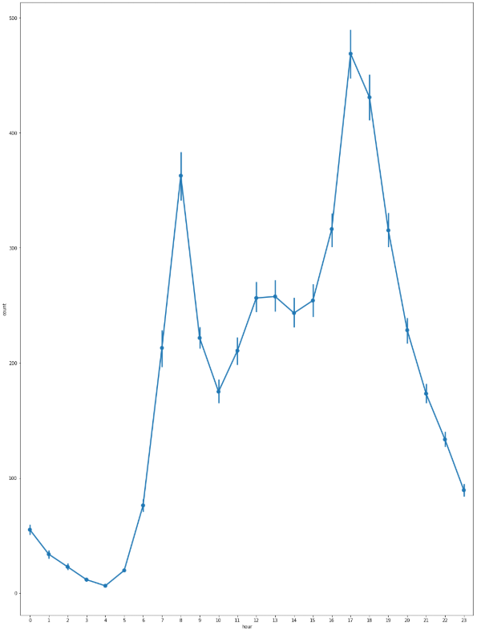

```python
fig, (ax1, ax2) = plt.subplots(nrows=2)
fig.set_size_inches(18, 25)
sns.pointplot(data=train, x="hour", y="count", ax=ax1)
sns.pointplot(data=train, x="hour", y="count", hue="workingday", ax=ax2)
# 근무일에 따라 시간대별로 꺽은선 그래프 생성
```

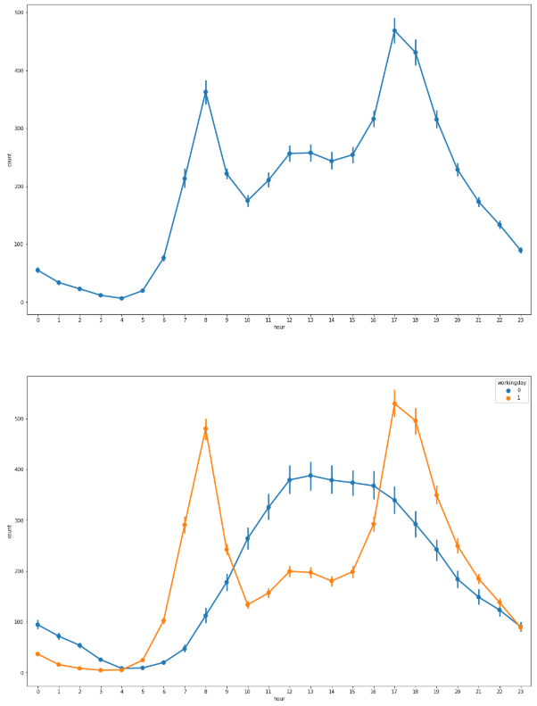

```python
fig, (ax1, ax2, ax3) = plt.subplots(nrows=3)
fig.set_size_inches(18, 25)
sns.pointplot(data=train, x="hour", y="count", ax=ax1)
sns.pointplot(data=train, x="hour", y="count", hue="workingday", ax=ax2)
sns.pointplot(data=train, x="hour", y="count", hue="dayofweek", ax=ax3)
```

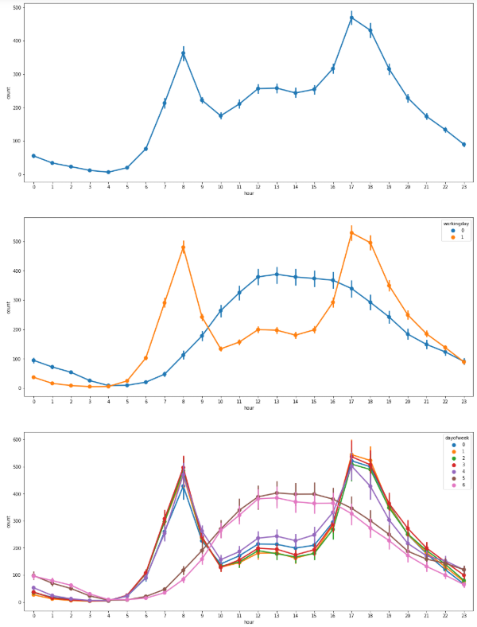

```python
fig, (ax1, ax2, ax3, ax4) = plt.subplots(nrows=4)
fig.set_size_inches(18, 25)
sns.pointplot(data=train, x="hour", y="count", ax=ax1)
sns.pointplot(data=train, x="hour", y="count", hue="workingday", ax=ax2)
sns.pointplot(data=train, x="hour", y="count", hue="dayofweek", ax=ax3)
sns.pointplot(data=train, x="hour", y="count", hue="weather", ax=ax4)
```

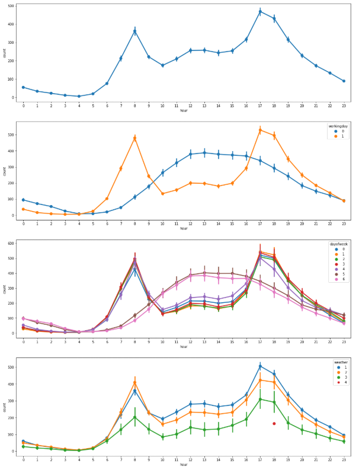

```python
fig, (ax1, ax2, ax3, ax4, ax5) = plt.subplots(nrows=5)
fig.set_size_inches(18, 25)
sns.pointplot(data=train, x="hour", y="count", ax=ax1)
sns.pointplot(data=train, x="hour", y="count", hue="workingday", ax=ax2)
sns.pointplot(data=train, x="hour", y="count", hue="dayofweek", ax=ax3)
sns.pointplot(data=train, x="hour", y="count", hue="weather", ax=ax4)
sns.pointplot(data=train, x="hour", y="count", hue="season", ax=ax5)
```

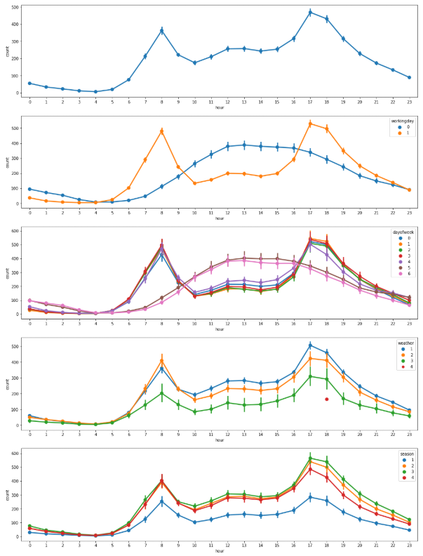


## regplot(산점도 + 단순선형회귀그래프)

```python
fig, (ax1, ax2, ax3) = plt.subplots(ncols=3)
fig.set_size_inches(18, 10)
sns.regplot(x="temp", y="count", data=train, ax=ax1)
sns.regplot(x="windspeed", y="count", data=train, ax=ax2)
sns.regplot(x="humidity", y="count", data=train, ax=ax3)
```

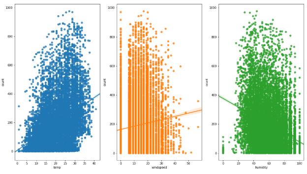


# bike-sharing-demand

## 년도와 월별로 자전거 대여수

- '년도-월' 로 이루어진 변수 만들기

```python
def ym(mydt) :
    print(mydt)

train["datetime"].apply(ym)
# > 2011-01-01 00:00:00
# > 2011-01-01 01:00:00
# > 2011-01-01 02:00:00
# > ...
# > 2012-12-19 21:00:00
# > 2012-12-19 22:00:00
# > 2012-12-19 23:00:00
# > 0        None
# > 1        None
# > 2        None
# > ...
# > 10883    None
# > 10884    None
# > 10885    None
# > Name: datetime, Length: 10886, dtype: object
```

```python
def ym(mydt) :
    print(type(mydt))
#     print(mydt)

train["datetime"].apply(ym)
# > <class 'pandas._libs.tslibs.timestamps.Timestamp'>
# > <class 'pandas._libs.tslibs.timestamps.Timestamp'>
# > ...
# > <class 'pandas._libs.tslibs.timestamps.Timestamp'>
# > <class 'pandas._libs.tslibs.timestamps.Timestamp'>
# > 0        None
# > 1        None
# > ...
# > 10884    None
# > 10885    None
# > Name: datetime, Length: 10886, dtype: object
```

```python
def ym(mydt) :
    print(mydt.year)

train["datetime"].apply(ym)
# > 2011
# > 2011
# > ...
# > 2012
# > 2012
# > 0        None
# > 1        None
# > ...
# > 10884    None
# > 10885    None
# > Name: datetime, Length: 10886, dtype: object
```

```python
def ym(mydt) :
    print(mydt.year, mydt.month)

train["datetime"].apply(ym)
# > 2011 1
# > 2011 1
# > ...
# > 2012 12
# > 2012 12
# > 0        None
# > 1        None
# > ...
# > 10884    None
# > 10885    None
# > Name: datetime, Length: 10886, dtype: object
```

```python
def ym(mydt) :
    print("{0}-{1}".format(mydt.year, mydt.month))

train["datetime"].apply(ym)
# > 2011-1
# > 2011-1
# > ...
# > 2012-12
# > 2012-12
# > 0        None
# > 1        None
# > ...
# > 10884    None
# > 10885    None
# > Name: datetime, Length: 10886, dtype: object
```

```python
def ym(mydt) :
    return "{0}-{1}".format(mydt.year, mydt.month)

train["year_month"] = train["datetime"].apply(ym)

train[['datetime', 'year_month']]
```

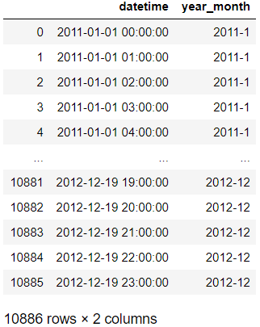

```python
fig, axes = plt.subplots(nrows=1, ncols=1)
fig.set_size_inches(18, 10)
sns.barplot(data=train, x="year_month", y="count", ax=axes)
```

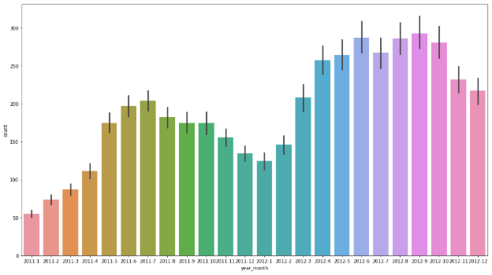


## 이상치(outliers) 제거

```python
trainWithoutOutliers = train[np.abs(train["count"] - train["count"].mean()) <= (train['count'].std()*3)]
# 표준편차*3

print(train.shape)
print(trainWithoutOutliers.shape)
# > (10886, 20)
# > (10739, 20)
```

## train 풍속=0 값 대체하기

```python
train['windspeed'].mean()
# > 12.799395406945093

train['windspeed'] == 0
# > 0         True
# > 1         True
# > 2         True
# > 3         True
# > 4         True
# >          ...  
# > 10881    False
# > 10882    False
# > 10883    False
# > 10884    False
# > 10885    False
# > Name: windspeed, Length: 10886, dtype: bool

train[train['windspeed'] == 0]
```

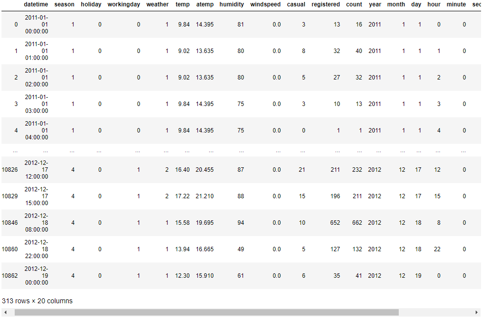

```python
train.loc[train['windspeed'] == 0, "windspeed"]
# > 0        0.0
# > 1        0.0
# > 2        0.0
# > 3        0.0
# > 4        0.0
# >         ... 
# > 10826    0.0
# > 10829    0.0
# > 10846    0.0
# > 10860    0.0
# > 10862    0.0
# > Name: windspeed, Length: 1313, dtype: float64

train.loc[train['windspeed'] == 0, "windspeed"] = train['windspeed'].mean()

train.loc[train['windspeed'] != 0, "windspeed"]
# > 0        12.799395
# > 1        12.799395
# > 2        12.799395
# > 3        12.799395
# > 4        12.799395
# >            ...    
# > 10881    26.002700
# > 10882    15.001300
# > 10883    15.001300
# > 10884     6.003200
# > 10885     8.998100
# > Name: windspeed, Length: 10886, dtype: float64
```


## 풍속이 0인 것과 아닌 것을 구분하여 저장

```python
trainWithoutOutliers['windspeed'] == 0
# > 0         True
# >1         True
# >2         True
# >3         True
# >4         True
# >         ...  
# >10881    False
# >10882    False
# >10883    False
# >10884    False
# >10885    False
# >Name: windspeed, Length: 10739, dtype: bool

trainWind0 = trainWithoutOutliers[trainWithoutOutliers['windspeed'] == 0]
trainWindNot0 = trainWithoutOutliers[trainWithoutOutliers['windspeed'] != 0]

print(trainWind0.shape)
print(trainWindNot0.shape)
# > (1297, 20)
# > (9442, 20)
```


## 머신러닝 랜덤포레스트로 풍속 예측

```python
from sklearn.ensemble import RandomForestClassifier

def predict_windspeed(data):
    # data의 windspeed값이 0인 데이터를
    # 랜덤 포레스트를 이용하여 예측한 값으로 대체
    
    # 풍속 예측에 사용되는 변수
    wCol = ['season', 'weather', 'humidity', 'month', 
            'temp', 'year', 'atemp']
    
    # 풍속이 0인 것과 아닌것으로 구분
    dataWind0 = data.loc[data['windspeed'] == 0]
    dataWindNot0 = data.loc[data['windspeed'] != 0]
    
    # 랜덤포레스트 분류기 생성
    rfModel = RandomForestClassifier()
    # 랜덤포레스트 결과 값이 문자여야 실행되므로 변환
    dataWindNot0['windspeed'] = dataWindNot0['windspeed'].astype("str")
    
    # wCol -> 풍속
    rfModel.fit(dataWindNot0[wCol], dataWindNot0['windspeed'])
    # 학습된 모델로 풍속 0에 대한 데이터 예측
    preValue = rfModel.predict(dataWind0[wCol])
    
    predictWind0 = dataWind0
    predictWindNot0 = dataWindNot0
    
    # 예측값이 문자이므로 숫자로 다시 변환
    predictWind0['windspeed'] = preValue.astype("float")
        
    data = predictWindNot0.append(predictWind0)
    
    return data

train = predict_windspeed(trainWithoutOutliers)
train.head()
```

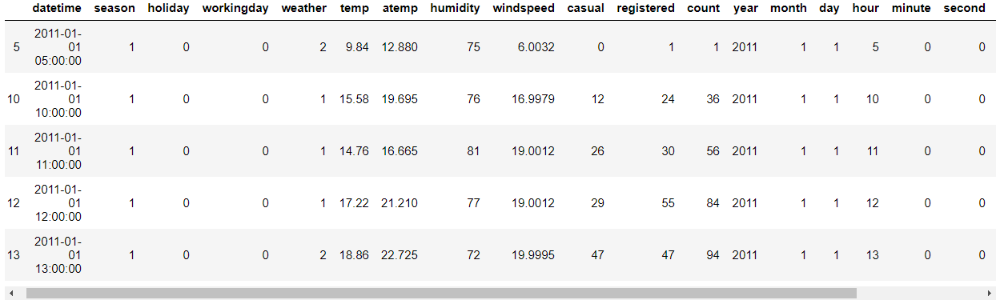

```python
(train['windspeed'] == 0).sum()
# > 0
```


# 연습문제

- 두 개의 데이터프레임을 만들고 merge 명령으로 합친다. 단 데이터프레임은 다음 조건을 만족해야 한다.

## 1.

- 각각 5 x 5 이상의 크기를 가진다.
- df1

|      | Name    | Segment | Engine | Fuel | Price |
| ---- | ------- | ------- | ------ | ---- | ----- |
| 0    | Morning | Mini    | 1.0    | 14km | 1000  |
| 1    | K3      | Smal    | 1.6    | 18km | 2000  |
| 2    | K5      | Mid     | 2.0    | 16km | 3000  |
| 3    | K8      | Sport   | 3.0    | 12km | 4000  |
| 4    | K9      | Large   | 5.0    | 10km | 5000  |

- df2

|   | 이름     | 출시년도 | 연료   | 마력 | 탑승인원 |
| - | ------- | ------- | ----- | --- | ------- |
| 0 | Morning | 2000    | 휘발유 | 50  | 4       |
| 1 | K3      | 2005    | 경유   | 100 | 5       |
| 2 | K5      | 2005    | 경유   | 150 | 5       |
| 3 | K8      | 2016    | 휘발유 | 250 | 4       |
| 4 | K9      | 2010    | 휘발유 | 300 | 4       |


### A.

```python
# 1.
df1 = pd.DataFrame({
    "Name" : ["Morning", "K3", "K5", "K8", "K9"],
    "Segment" : ["Mini", "Small", "Mid", "Sport", "Large"],
    "Engine" : ["1.0", "1.6", "2.0", "3.0", "5.0"],
    "Fuel" : ["14km", "18km", "16km", "12km", "10km"],
    "Price" : [1000, 2000, 3000, 4000, 5000]
})
df1
```

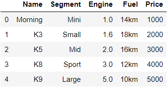

```python
df2 = pd.DataFrame({
    "이름" : ["Morning", "K3", "K5", "K8", "K9"],
    "출시년도" : [2000, 2005, 2005, 2016, 2010],
    "연료" : ["휘발유", "경유", "경유", "휘발유", "휘발유"],
    "마력" : [50, 100, 150, 250, 300],
    "탑승인원" : [4, 5, 5, 4, 4]
})
df2
```

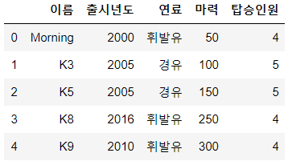


## 2.

- 공통 열을 하나 이상 가진다. 다만 공통 열의 이름은 서로 다르다.

|      | Name    | Segment | Engine | Fuel | Price | 이름     | 출시년도 | 연료   | 마력 | 탑승인원 |
| ---- | ------- | ------- | ------ | ---- | ----- | ------- | ------- | ----- | --- | ------- |
| 0    | Morning | Mini    | 1.0    | 14km | 1000  | Morning | 2000    | 휘발유 | 50  | 4       |
| 1    | K3      | Smal    | 1.6    | 18km | 2000  | K3      | 2005    | 경유   | 100 | 5       |
| 2    | K5      | Mid     | 2.0    | 16km | 3000  | K5      | 2005    | 경유   | 150 | 5       |
| 3    | K8      | Sport   | 3.0    | 12km | 4000  | K8      | 2016    | 휘발유 | 250 | 4       |
| 4    | K9      | Large   | 5.0    | 10km | 5000  | K9      | 2010    | 휘발유 | 300 | 4       |

### A.

```python
# 2.
pd.merge(df1, df2, left_on = 'Name', right_on="이름")
```

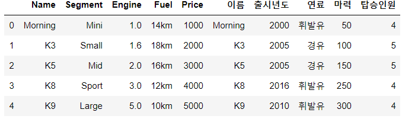


## 3.

- 어느 회사의 전반기(1월 ~ 6월) 실적을 나타내는 데이터프레임과 후반기(7월 ~ 12월) 실적을 나타내는 데이터프레임을 만든 뒤 합친다. 실적 정보는 "매출", "비용", "이익" 으로 이루어진다. (이익 = 매출 - 비용).
- 또한 1년간의 총 실적을 마지막 행으로 덧붙인다

- 전반기 손익(1~6)
- df1

|| 매출 | 비용 | 이익 |
|-|-|-|-|
|1월|1000|1500|-500|
|2월|1500|2000|-500|
|3월|3000|2500|500|
|4월|4000|2700|1300|
|5월|5000|3000|2000|
|6월|6000|3200|2800|

- 후반기 손익(7~12)
- df2
||매출|비용|이익|
|-|-|-|-|
|7월|	4500|	2800|	1700|
|8월|	4000|	2700|	1300|
|9월|	5000|	3000|	2000|
|10월|	6000|	3200|	2800|
|11월|	3000|	2500|	500|
|12월|	2000|	2000|	0|

- 결산(1~12)
- df3

||	매출|	비용|	이익|
|-|-|-|-|
|1월|	1000|	1500|	-500|
|2월|	1500|	2000|	-500|
|3월|	3000|	2500|	500|
|4월|	4000|	2700|	1300|
|5월|	5000|	3000|	2000|
|6월|	6000|	3200|	2800|
|7월|	4500|	2800|	1700|
|8월|	4000|	2700|	1300|
|9월|	5000|	3000|	2000|
|10월|	6000|	3200|	2800|
|11월|	3000|	2500|	500|
|12월|	2000|	2000|	0|
|총실적|	45000|	31100|	13900|


### A.

```python
# 3.
df1 = pd.DataFrame({
    "매출" : [1000, 1500, 3000, 4000, 5000, 6000],
    "비용" : [1500, 2000, 2500, 2700, 3000, 3200],
    "이익" : [-500, -500, 500, 1300, 2000, 2800]
}, index = ["1월", "2월", "3월", "4월", "5월", "6월"])
df1
```

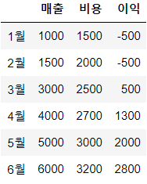

```python
df2 = pd.DataFrame({
    "매출" : [4500, 4000, 5000, 6000, 3000, 2000],
    "비용" : [2800, 2700, 3000, 3200, 2500, 2000],
    "이익" : [1700, 1300, 2000, 2800, 500, 0]
}, index = ["7월", "8월", "9월", "10월", "11월", "12월"])
df2
```

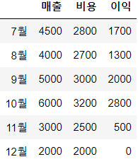

```python
result = pd.concat([df1, df2])
result = result.append(pd.DataFrame(result.sum(), columns=["총실적"]).T)
result
```

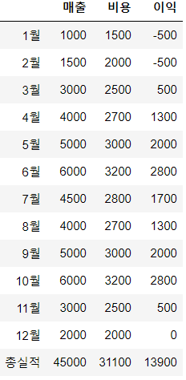

```python
result = pd.concat([df1, df2])
result.loc["총실적", ] = result.sum()
result
```

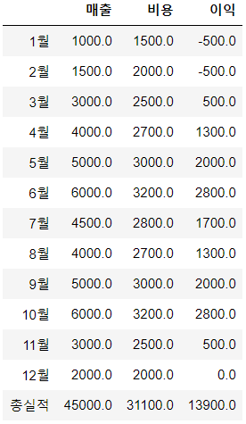


## 4.

- A 반 학생 5명과 B반 학생 5명의 국어, 영어, 수학 점수를 나타내는 데이터프레임을 다음과 같이 만든다.
- "반", "번호", "국어", "영어", "수학" 을 열로 가지는 데이터프레임 df_score2을 만든다.
- df_score2

||	반|	번호|	국어|	영어|	수학|
|-|---|-----|-----|----|---|
|0|	A|	1|	90|	100|	80|
|1|	A|	2|	80|	90|	100|
|2|	A|	3|	90|	100|	80|
|3|	A|	4|	70|	80|	90|
|4|	A|	5|	100|	70|	80|
|5|	B|	1|	80|	90|	100|
|6|	B|	2|	90|	100|	70|
|7|	B|	3|	100|	70|	80|
|8|	B|	4|	70|	80|	90|
|9|	B|	5|	80|	90|	100|

### A.

```python
# 4.
df_score2 = pd.DataFrame({
    "반" : sorted(['A', 'B']*5),
    "번호" : list(range(1,6))*2,
    "국어" : [90, 80, 90, 70, 100, 80, 90, 100, 70, 80],
    "영어" : [100, 90, 100, 80, 70, 90, 100, 70 ,80 ,90],
    "수학" : [80, 100, 80, 90, 80, 100, 70 ,80 ,90 ,100]
})
df_score2
```

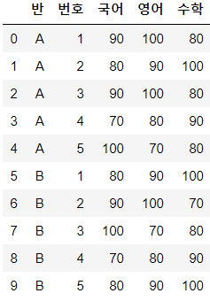


## 5.

- df_score2을 변형하여 1차 행 인덱스로 "반"을 2차 행 인덱스로 "번호"을 가지는 데이터프레임을 만든다.
- df1

|      |      | 국어 | 영어 | 수학 |
| ---- | ---- | ---- | ---- | ---- |
| 반   | 번호 |      |      |      |
| A    | 1    | 90   | 100  | 80   |
|      | 2    | 80   | 90   | 100  |
|      | 3    | 90   | 100  | 80   |
|      | 4    | 70   | 80   | 90   |
|      | 5    | 100  | 70   | 80   |
| B    | 1    | 80   | 90   | 100  |
|      | 2    | 90   | 100  | 70   |
|      | 3    | 100  | 70   | 80   |
|      | 4    | 70   | 80   | 90   |
|      | 5    | 80   | 90   | 100  |


### A.

```python
# 5.
df_score2.groupby(["반", "번호"]).mean()
# df_score2.pivot_table(index=["반", "번호"])
```

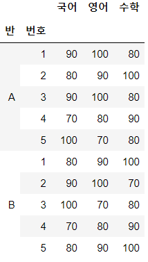


## 6.

- 위 데이터 프레임에 각 학생의 평균을 나타내는 행을 오른쪽에 추가한다.

- df1

|      |      | 국어 | 영어 | 수학 | 평균       |
| ---- | ---- | ---- | ---- | ---- | ---------|
| 반   | 번호 |      |      |      |           |
| A    | 1    | 90   | 100  | 80   | 90.000000 |
|      | 2    | 80   | 90   | 100  | 90.000000 |
|      | 3    | 90   | 100  | 80   | 90.000000 |
|      | 4    | 70   | 80   | 90   | 80.000000 |
|      | 5    | 100  | 70   | 80   | 83.333333 |
| B    | 1    | 80   | 90   | 100  | 90.000000 |
|      | 2    | 90   | 100  | 70   | 86.666667 |
|      | 3    | 100  | 70   | 80   | 83.333333 |
|      | 4    | 70   | 80   | 90   | 80.000000 |
|      | 5    | 80   | 90   | 100  | 90.000000 |

### A.

```python
# 6.
df_6 = df_score2.groupby(["반", "번호"]).mean()
df_6['평균'] = df_6.mean(axis=1)
df_6
```

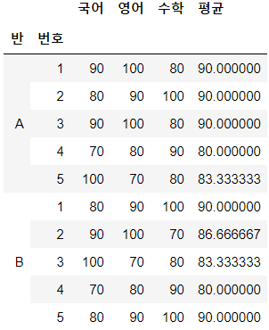


## 7.

- df_score2을 변형하여 행 인덱스로 "번호"을, 1차 열 인덱스로 "국어", "영어", "수학"을, 2차 열 인덱스로 "반"을 가지는 데이터프레임을 만든다.
- df3

| |	국어|	|영어| |수학| |
|-|----|-|---|-|----|-|
|반|	A|	B|	A|	B|	A|	B|
|번호|	|	|	|	|	|	|
|1|	90|	80|	100|	90|	80|	100|
|2|	80|	90|	90|	100|	100|	70|
|3|	90|	100|	100|	70|	80|	80|
|4|	70|	70|	80|	80|	90|	90|
|5|	100|	80|	70|	90|	80|	100|

### A.

```python
# 7.
df_score2.pivot_table(index=["번호"], columns=["반"], 
                      aggfunc={"국어" :np.sum, 
                               "영어" :np.sum, "수학":np.sum})
```

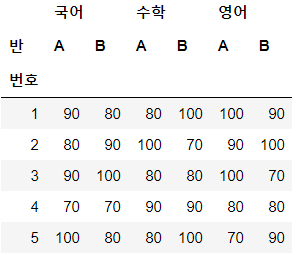


## 8.

- 위 데이터 프레임에 각 반별 각 과목의 평균을 나타내는 행을 아래에 추가한다.

||	국어||		영어||		수학||
|-|--------|-|-------|-|---------|-|
|반|	A|	B|	A|	B|	A|	B|
|번호|	|	|	|	|	|	|
|1|	90.0|	80.0|	100.0|	90.0|	80.0|	100.0|
|2|	80.0|	90.0|	90.0|	100.0|	100.0|	70.0|
|3|	90.0|	100.0|	100.0|	70.0|	80.0|	80.0|
|4|	70.0|	70.0|	80.0|	80.0|	90.0|	90.0|
|5|	100.0|	80.0|	70.0|	90.0|	80.0|	100.0|
|평균|	86.0|	84.0|	88.0|	86.0|	86.0|	88.0|

### A.

```python
# 8.
df_8 = df_score2.pivot_table(index=["번호"], columns=["반"],
                             aggfunc={"국어" :np.mean, 
                                      "영어" :np.mean, 
                                      "수학":np.mean})
df_8.loc["평균"] = df_8.mean()
df_8
```

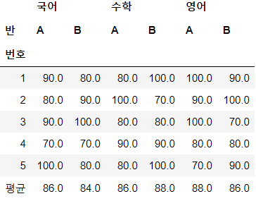


## 9.

- 스러피(Slurpy)란 어떠한 속성이 존재하는 문자열이다. 문자열을 읽어서 스러피가 존재하는지를 판단하는 프로그램을 작성해야 한다.
- 스럼프(Slump)는 다음 속성을 갖는 문자열이다.
  - 첫 번째 문자가 'D' 또는 'E'이다.
  - 첫 번째 문자 뒤에는 하나 이상의 'F'가 나온다.
  - 하나 이상의 'F' 뒤에는 또 다른 스럼프나 'G'가 온다. 스럼프는 'F' 끝에 오는 스럼프나 'G'로끝난다. 예를 들어, DFFEFFFG는 첫 번째 문자가 'D'로 시작하고 두 개의 'F'가 나오며, 또 다른스럼프 'EFFFG'로 끝난다.
  - 위의 경우가 아니면 스럼프가 아니다.
- 스림프(Slimp)는 다음 속성을 갖는 문자열이다.
  - 첫 번째 문자는 'A'이다.
  - 두 개의 문자로만 된 스림프면, 두 번째 문자는 'H'이다.
  - 두 개의 문자로 된 스림프가 아니면 다음 형식 중의 하나가 된다.
  - 'A' + 'B' + 스림프 + 'C'.
  - 'A' + 스럼프 + 'C'.
  - 위의 경우가 아니면 스림프가 아니다.
- 스러피(Slurpy)는 스림프(Slimp) 뒤에 스럼프(Slump)로 구성되는 문자열이다.
- 다음은 그 예이다.

> Slumps : DFG, EFG, DFFFFFG, DFDFDFDFG, DFEFFFFFG
>
> Not Slumps: DFEFF, EFAHG, DEFG, DG, EFFFFDG
>
> Slimps: AH, ABAHC, ABABAHCC, ADFGC, ADFFFFGC, ABAEFGCC, ADFDFGC
>
> Not Slimps: ABC, ABAH, DFGC, ABABAHC, SLIMP, ADGC
>
> Slurpys: AHDFG, ADFGCDFFFFFG, ABAEFGCCDFEFFFFFG
>
> Not Slurpys: AHDFGA, DFGAH, ABABCC

- 입력
  - 입력될 문자열의 개수를 나타내는 정수 N 이 1 ~ 10의 범위로 우선 입력된다. 다음 줄부터 N개의 문자열이 입력된다. 문자열은 1 ~ 60 개의 알파벳 문자로 구성된다.
- 출력
  - 첫 줄에는 "SLURPYS OUTPUT"을 출력한다. N 개의 문자열 입력에 대해서 각 문자열이 스러피인지를 "YES" 또는 "NO"로 표기한다. 마지막으로 "END OF OUTPUT"를 출력한다.
- Sample Input
  - 2
  - AHDFG
  - DFGAH
- Sample Output
  - SLURPYS OUTPUT
  - YES
  - NO
  - END OF OUTPUT

### A.

```python
# 9.
import re

def slimp(string) : # slimp 확인 함수
    if (len(string) == 2) : # 첫번째 경우
        if (string =='AH') :
            return True
    if (len(string)>3) : # 두번째 경우('AB+slimp+C')
        if (string[:2]=='AB') & (string[-1]=='C') :
            return slimp(string[2:len(string)-1])
    if (len(string)>2) : # 세번째 경우('A+sulmp+C')
        if (string[0]=='A') & (string[-1]=='C') :
            return bool(slump.match(string[1:len(string)-1]))
    return False

t = int(input())

print("SLURPYS OUTPUT")

slump = re.compile("([D,E]F+)+G$")

for i in range(t) :
    test = input()
    # slump에 해당되지 않는 부분에 대하여 slimp 확인
    if slimp(re.sub("([D,E]F+)+G$", "", test)) : 
        if bool(slump.search(test)) : # slump확인
            print("YES")
    print("NO")

print("END OF OUTPUT")
```


