# 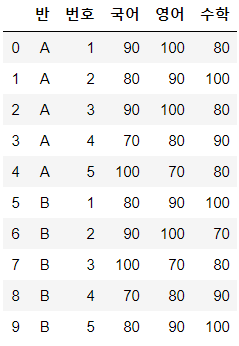Day24 딥러닝을 위한 빅데이터 기초 - 데이터 분석를 위한 NumPy, Pandas (10)

- TensorFlow : Tensor(다차원)가 흘러다닌다는 의미

# 어제 수업 내용

```python
import numpy as np

a = np.arange(10)
a
# > array([0, 1, 2, 3, 4, 5, 6, 7, 8, 9])

a[0:5]
# > array([0, 1, 2, 3, 4])

ai = a[0:5]
ai[1:3] = 10
ai
# > array([ 0, 10, 10,  3,  4])

a
# > array([ 0, 10, 10,  3,  4,  5,  6,  7,  8,  9])
```


# 배열 축 추가

- `np.newaxis`, `np.tile`

## np.newaxis

- ex. 1차원 -> 2차원

```python
a = np.array([1,2,3,4])
a
# > array([1, 2, 3, 4])

a.shape
# > (4,)
```

- a를 (4,1)로 구성

```python
a41 = a[:, np.newaxis]
a41
# > array([[1],
# >        [2],
# >        [3],
# >        [4]])

a41.shape
# > (4, 1)

a14 = a[np.newaxis, :]
a14
# > array([[1, 2, 3, 4]])

a14.shape
# > (1, 4)
```

```python
b = np.arange(15).reshapeape(3,5)
b
# > array([[ 0,  1,  2,  3,  4],
# >        [ 5,  6,  7,  8,  9],
# >        [10, 11, 12, 13, 14]])

b351 = b[:,:,np.newaxis]
b351
# > array([[[ 0],
# >         [ 1],
# >         [ 2],
# >         [ 3],
# >         [ 4]],
# > 
# >        [[ 5],
# >         [ 6],
# >         [ 7],
# >         [ 8],
# >         [ 9]],
# > 
# >        [[10],
# >         [11],
# >         [12],
# >         [13],
# >         [14]]])

b351.shape
# > (3, 5, 1)

b315 = b[:, np.newaxis, :]
b315
# > array([[[ 0,  1,  2,  3,  4]],
# > 
# >        [[ 5,  6,  7,  8,  9]],
# > 
# >        [[10, 11, 12, 13, 14]]])

b315.shape
# > (3, 1, 5)
```


## np.tile

- tile 보단 newaxis가 일반적으로 사용된다.

```python
a = np.array([0,1,2,3])
a8 = np.tile(a,2)
a8
# > array([0, 1, 2, 3, 0, 1, 2, 3])

a32 = np.tile(a,(3,2))
a32
# > array([[0, 1, 2, 3, 0, 1, 2, 3],
# >        [0, 1, 2, 3, 0, 1, 2, 3],
# >        [0, 1, 2, 3, 0, 1, 2, 3]])
```

```python
b = np.arange(8).reshape(2,4)
b28 = np.tile(b,2)
b28
# > array([[0, 1, 2, 3, 0, 1, 2, 3],
# >        [4, 5, 6, 7, 4, 5, 6, 7]])

b44 = np.tile(b,(2,1))
b44
# > array([[0, 1, 2, 3],
# >        [4, 5, 6, 7],
# >        [0, 1, 2, 3],
# >        [4, 5, 6, 7]])
```


# 전치행렬(aT)

- `.T`와 `np.transpose()`는 동일

```python
a = np.arange(15).reshape(3,5)
a
# > array([[ 0,  1,  2,  3,  4],
# >        [ 5,  6,  7,  8,  9],
# >        [10, 11, 12, 13, 14]])

a.T
# > array([[ 0,  5, 10],
# >        [ 1,  6, 11],
# >        [ 2,  7, 12],
# >        [ 3,  8, 13],
# >        [ 4,  9, 14]])
```

```python
np.transpose(a)
# > array([[ 0,  5, 10],
# >        [ 1,  6, 11],
# >        [ 2,  7, 12],
# >        [ 3,  8, 13],
# >        [ 4,  9, 14]])
```


# 불린 참조

```python
arr = np.arange(20).reshape(5,4)
arr
# > array([[ 0,  1,  2,  3],
# >        [ 4,  5,  6,  7],
# >        [ 8,  9, 10, 11],
# >        [12, 13, 14, 15],
# >        [16, 17, 18, 19]])

abc = np.array(['a', 'a', 'b', 'c', 'c'])
abc
# > array(['a', 'a', 'b', 'c', 'c'], dtype='<U1')
```
```python
abc=='a'
# > array([ True,  True, False, False, False])

arr[abc=='a']
# > array([[0, 1, 2, 3],
# >        [4, 5, 6, 7]])

arr[abc=='a', :]
# > array([[0, 1, 2, 3],
# >        [4, 5, 6, 7]])

arr[abc=='a', :2]
# > array([[0, 1],
# >        [4, 5]])

arr[abc=='a', 2]
# > array([2, 6])
```

```python
arr[abc != 'a']
# > array([[ 8,  9, 10, 11],
# >        [12, 13, 14, 15],
# >        [16, 17, 18, 19]])

arr[~(abc=='a')] # ~ = not의미
# > array([[ 8,  9, 10, 11],
# >        [12, 13, 14, 15],
# >        [16, 17, 18, 19]])

arr[(abc=='a') | (abc=='b')]
# > array([[ 0,  1,  2,  3],
# >        [ 4,  5,  6,  7],
# >        [ 8,  9, 10, 11]])

arr[(abc!='a') & (abc!='b')]
# > array([[12, 13, 14, 15],
# >        [16, 17, 18, 19]])
```

- 참고 : index안에 'and' or 'or'를 작성할 경우 Error 발생

```python
arr[(abc!='a') and (abc!='b')]
```


- arr에서 abc배열을 이용하여 'a'와 같은 행은 모두 99로 변경(불린 참조)

```python
arr[abc=='a'] = 99
arr
# > array([[99, 99, 99, 99],
# >        [99, 99, 99, 99],
# >        [ 8,  9, 10, 11],
# >        [12, 13, 14, 15],
# >        [16, 17, 18, 19]])
```

- arr배열에서 20보다 큰 값은 모두 0으로 변경

```python
arr[arr>20] = 0
arr
# > array([[ 0,  0,  0,  0],
# >        [ 0,  0,  0,  0],
# >        [ 8,  9, 10, 11],
# >        [12, 13, 14, 15],
# >        [16, 17, 18, 19]])
```

- arr배열에서 8이상 15이하의 값은 모두 10으로 변경

```python
arr[(8 <= arr) & (arr <= 15)] = 10
# 연산자 우선순위에서 <=보다 &이 높으므로 ()로 묶어서 <=가 먼저 실행되도록 해야한다.
# ()로 묶지 않을 경우 &먼저 실행하여 Error 발생
arr
# > array([[ 0,  0,  0,  0],
# >        [ 0,  0,  0,  0],
# >        [10, 10, 10, 10],
# >        [10, 10, 10, 10],
# >        [16, 17, 18, 19]])
```


# numpy 수학 관련 함수

```python
a = np.array([-3.5, -2.2, 0, 1.6, 3.14, 4.05])
a
# > array([-3.5 , -2.2 ,  0.  ,  1.6 ,  3.14,  4.05])
```

- `np.around`

```python
np.around(a) # 0.5기준 반올림
# > array([-4., -2.,  0.,  2.,  3.,  4.])

np.round_(a,1) # 소수이하 첫째자리까지 출력(두번째자리에서 반올림)
# > array([-3.5, -2.2,  0. ,  1.6,  3.1,  4. ])
```

- `np.rint`

```python
np.rint(a) # 가까운 정수로 반올림
# > array([-4., -2.,  0.,  2.,  3.,  4.])
```

- `np.fix`

```python
np.fix(a) # 0 방향으로 가까운 정수로 올림 또는 내림
# > array([-3., -2.,  0.,  1.,  3.,  4.])
```

- `np.ceil`

```python
np.ceil(a) # 해당 값보다 크거나 같은 가장 작은 정수 값으로 올림
# a<=x<a+1인 정수 x
# > array([-3., -2.,  0.,  2.,  4.,  5.])
```

- `np.floor`

```python
np.floor(a) # 해당 값보다 작거나 같은 가장 큰 정수 값으로 내림
# a-1<x<=a인 정수 x
# > array([-4., -3.,  0.,  1.,  3.,  4.])
```

- `np.trunc`

```python
np.trunc(a) # 소수이하 버림
# > array([-3., -2.,  0.,  1.,  3.,  4.])
```

- `np.pord`
  - 요소간 곱셈

```python
a = np.array([1,2,3,4])
a
# > array([1, 2, 3, 4])

c = np.arange(1,5).reshape(2,2)
c
# > array([[1, 2],
# >        [3, 4]])

np.prod(a)
# > 24

np.prod(c)
# > 24

np.prod(c, axis=0) # 열 기준 곱셈
# > array([3, 8])

np.prod(c, axis=1) # 행 기준 곱셈
# > array([ 2, 12])
```

- `np.sum`

```python
np.sum(a) # 0차원=scalar
# > 10

np.sum(a, keepdims=True) # keepdims : 차원을 유지하는 옵션
# > array([10])

np.sum(c)
# > 10

np.sum(c, axis=0)
# > array([4, 6])

np.sum(c, axis=1)
# > array([3, 7])
```

- `np.nanprod`
  - 곱셈할 때 NaN을 1로 간주해서 곱셈

```python
d = np.array([[1,2], [3, np.nan]])
d
# > array([[ 1.,  2.],
# >        [ 3., nan]])

np.prod(d)
# > nan

np.prod(d, axis=0)
# > array([ 3., nan])

np.prod(d, axis=1)
# > array([ 2., nan])

np.nanprod(d, axis=0)
# > array([3., 2.])
```
- `np.nansum`
  - 덧셈할 때 NaN을 0으로 간주해서 덧셈

```python
np.sum(d, axis=0)
# > array([ 4., nan])

np.nansum(d, axis=0)
# > array([4., 2.])
```

- `np.cumprod`

```python
# np.cumprod : 누적곱
a
# > array([1, 2, 3, 4])

b = np.arange(1,7).reshape(2,3)
b
# > array([[1, 2, 3],
# >        [4, 5, 6]])

np.cumprod(a)
# > array([ 1,  2,  6, 24], dtype=int32)

np.cumprod(b)
# > array([  1,   2,   6,  24, 120, 720], dtype=int32)

np.cumprod(b, axis=0)
# > array([[ 1,  2,  3],
# >        [ 4, 10, 18]], dtype=int32)

np.cumprod(b, axis=1)
# > array([[  1,   2,   6],
# >        [  4,  20, 120]], dtype=int32)
```

- `np.cumsum`
  - `np.cumprod`와 비슷한 결과를 나타낸다. 곱셈이 덧셈으로만 바뀜


## 지수, 로그함수

- 자연상수`e`, `y=log(x)` or `y=ln(x)`
- 지수함수 : `np.exp()` =`e^x`

```python
x = np.array([0.00001, 1, 2, 10])
np.exp(x) # 지수함수
# > array([1.00001000e+00, 2.71828183e+00, 7.38905610e+00, 2.20264658e+04])

np.log(x) # 밑이 자연상수e 인 로그함수
# > array([-11.51292546,   0.        ,   0.69314718,   2.30258509])

np.log10(x) # 밑이 10인 로그함수
# > array([-5.     ,  0.     ,  0.30103,  1.     ])

np.log2(x) # 밑이 2인 로그함수
# > array([-16.60964047,   0.        ,   1.        ,   3.32192809])
```


# bike-sharing-demand(Day23 이어서)

```python
import matplotlib.pyplot as plt
import seaborn as sns
from scipy import stats
import pandas as pd

train = pd.read_csv("../bike-sharing-demand/train.csv", parse_dates=['datetime'])

train["year"] = train["datetime"].dt.year
train["month"] = train["datetime"].dt.month
train["day"] = train["datetime"].dt.day
train["hour"] = train["datetime"].dt.hour
train["minute"] = train["datetime"].dt.minute
train["second"] = train["datetime"].dt.second
train['dayofweek'] = train['datetime'].dt.dayofweek
```

```python
test = pd.read_csv("../bike-sharing-demand/test.csv", parse_dates=['datetime'])
```

```python
import missingno as msno
msno.matrix(test, figsize=(12,5))
```


```python
# Feature Engineering
# 데이터 전처리, 파생변수 생성
test["year"] = test["datetime"].dt.year
test["month"] = test["datetime"].dt.month
test["day"] = test["datetime"].dt.day
test["hour"] = test["datetime"].dt.hour
test["minute"] = test["datetime"].dt.minute
test["second"] = test["datetime"].dt.second
test['dayofweek'] = test['datetime'].dt.dayofweek

test.shape
# > (6493, 16)
```

```python
fig, axes = plt.subplots(nrows=2)
fig.set_size_inches(18,10)
plt.sca(axes[0]) # 다음에서 설정할 옵션이 axes[0]에 대한 것이라는 선언
# sca(Set the Current Axes)
plt.xticks(rotation=30) # x축 글씨 기울기 설정
sns.countplot(data=train, x='windspeed', ax=axes[0])
sns.countplot(data=test, x='windspeed', ax=axes[1])
```

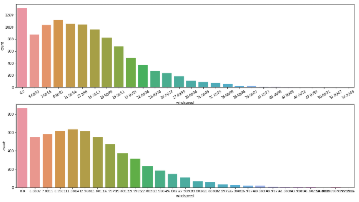

```python
fig, axes = plt.subplots(nrows=2)
fig.set_size_inches(18,10)
plt.sca(axes[0])
plt.xticks(rotation=30)
sns.countplot(data=train, x='windspeed', ax=axes[0])

plt.sca(axes[1])
plt.xticks(rotation=50)
sns.countplot(data=test, x='windspeed', ax=axes[1])
```

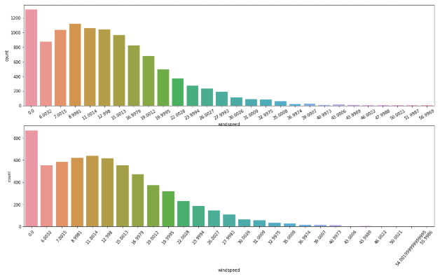

```python
trainWind0 = trainWithoutOutliers[trainWithoutOutliers['windspeed'] == 0]
trainWindNot0 = trainWithoutOutliers[trainWithoutOutliers['windspeed'] != 0]
print(trainWind0.shape)
print(trainWindNot0.shape)
# > (1297, 20)
# > (9442, 20)
```

```python
# 머신러닝 랜덤포레스트로 풍속 예측

from sklearn.ensemble import RandomForestClassifier

def predict_windspeed(data):
    # data의 windspeed값이 0인 데이터를
    # 랜덤 포레스트를 이용하여 예측한 값으로 대체
    
    # 풍속 예측에 사용되는 변수
    wCol = ['season', 'weather', 'humidity', 'month', 
            'temp', 'year', 'atemp']
    
    # 풍속이 0인 것과 아닌것으로 구분
    dataWind0 = data.loc[data['windspeed'] == 0]
    dataWindNot0 = data.loc[data['windspeed'] != 0]
    
    # 랜덤포레스트 분류기 생성
    rfModel = RandomForestClassifier()
    # 랜덤포레스트 결과 값이 문자여야 실행되므로 변환
    dataWindNot0['windspeed'] = dataWindNot0['windspeed'].astype("str")
    # wCol -> 풍속
    rfModel.fit(dataWindNot0[wCol], dataWindNot0['windspeed'])
    # 학습된 모델로 풍속 0에 대한 데이터 예측
    preValue = rfModel.predict(dataWind0[wCol])
    
    predictWind0 = dataWind0
    predictWindNot0 = dataWindNot0
    
    # 예측값이 문자이므로 숫자로 다시 변환
    predictWind0['windspeed'] = preValue.astype("float")
    
    data = predictWindNot0.append(predictWind0)
    data.reset_index(inplace=True)
    data.drop('index', inplace=True, axis=1)
    return data

print(predict_windspeed(train))
```

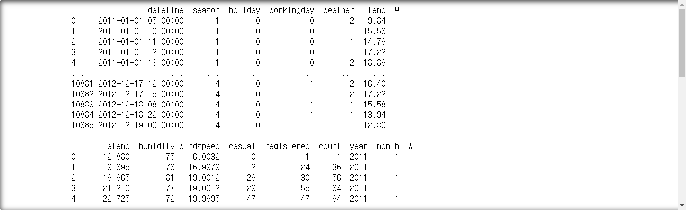

```python
train = predict_windspeed(train)
test = predict_windspeed(test)
```

## 'windspeed'에 0이 없는지 확인

```python
fig, ax1 = plt.subplots()
fig.set_size_inches(18,10)
plt.sca(ax1)
plt.xticks(rotation=30)
sns.countplot(data=train, x='windspeed', ax=ax1)
```

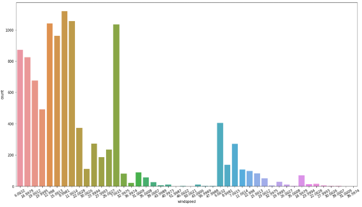

```python
fig, ax1 = plt.subplots()
fig.set_size_inches(18,10)
plt.sca(ax1)
plt.xticks(rotation=30)
sns.countplot(data=test, x='windspeed', ax=ax1)
```

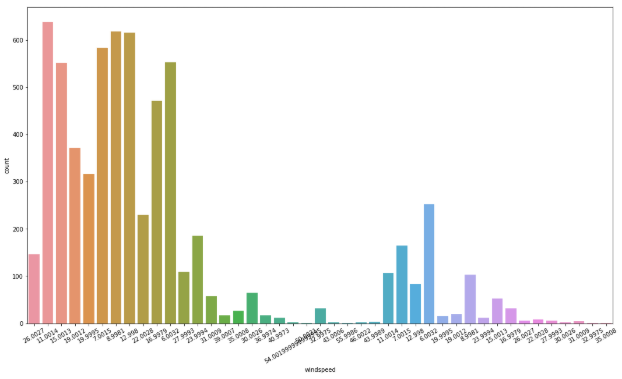

## feature selection

- 연속형(temp, humidity, windspeed, atemp, ...)
- 범주형(season, weather, dayofweek, ...)
- 범주형 변수는 type을 category로 변경 필요

```python
type(train['season'])
# > pandas.core.series.Series

train['season'].dtypes
# > dtype('int64')

train['season'].astype("category")
# > 0        1
# > 1        1
# > 2        1
# > 3        1
# > 4        1
# >         ..
# > 10881    4
# > 10882    4
# > 10883    4
# > 10884    4
# > 10885    4
# > Name: season, Length: 10886, dtype: category
# > Categories (4, int64): [1, 2, 3, 4]

train['season'] = train['season'].astype("category")
test['season'] = test['season'].astype("category")

train['season'].dtypes
# > CategoricalDtype(categories=[1, 2, 3, 4], ordered=False)
```

```python
train.columns
# > Index(['datetime', 'season', 'holiday', 'workingday', 'weather', 'temp',
# >        'atemp', 'humidity', 'windspeed', 'casual', 'registered', 'count',
# >        'year', 'month', 'day', 'hour', 'minute', 'second', 'dayofweek'],
# >       dtype='object')

# 임의로 feature 선택
feature_names = ['season', 'holiday', 'workingday', 'weather', 
                 'temp', 'atemp', 'humidity', 'windspeed',
                 'year', 'hour', 'dayofweek']

# category로 변환할 변수
c_f_n = ['season', 'holiday', 'workingday', 'weather', 'year',
         'month', 'hour', 'dayofweek']

for v in c_f_n :
    train[v] = train[v].astype("category")
    test[v] = test[v].astype("category")
```

- train x, y, test x 생성

```python
xtrain = train[feature_names]
xtrain.shape
# > (10886, 11)

xtest = test[feature_names]
xtest.shape
# > (6493, 11)

ytrain = train['count'] # 레이블(정답)
ytrain.shape
# > (10886,)
```

- bike-sharing-demand 평가방법인 RMSLE를 구하는 함수 작성

```python
def rmsle(predicted_value, actual_value) :
    # 넘파이 배열로의 변환
    predicted_value = np.array(predicted_value)
    actual_value = np.array(actual_value)
    
    # +1후 log 변환
    log_predict = np.log(predicted_value+1)
    log_actual = np.log(actual_value+1)
    
    # 연산
    diff = log_predict - log_actual
        # diff**2 = np.square(diff)
    diff = np.square(diff)
    mean_diff = diff.mean()
    score = np.sqrt(mean_diff)
    
    return score
```

```python
from sklearn.metrics import make_scorer
rmsle_score = make_scorer(rmsle)
rmsle_score
# > make_scorer(rmsle)
```

- k-fold cross-validation(핸즈온 머신러닝 p.127)

> data : 400
>
> 1 2 3 4 : 4개의 폴드(4-fold)
>
> 1 2 3 : train, 4 : test => 모델평가(80%)
>
> 1 2 4 : trian, 3 : test => 모델평가(70%)
>
> 1 3 4 : train, 2 : test => 모델평가(80%)
>
> 2 3 4 : train, 1 : test => 모델평가(70%)
>
> => 최종 모델 평가 75%

```python
from sklearn.model_selection import KFold
from sklearn.model_selection import cross_val_score

kfold = KFold(n_splits=10, shuffle=True, random_state=42)
```

```python
from sklearn.ensemble import RandomForestRegressor
model = RandomForestRegressor(n_estimators=100, n_jobs=-1, random_state=42)
# n_estimators : 모델 갯수 지정 옵션
# n_jobs : 코어 갯수 지정, -1; 현재 환경에서 최적의 갯수 사용
# random_state : 동일한 난수 발생을 위한 옵션(=set.seed)
```

- k-fold 수행

```python
%time score = cross_val_score(model, xtrain, ytrain, cv=kfold, scoring=rmsle_score)
# %time : 수행하는데 걸린 시간을 보여주는 옵션
print(score)
# > Wall time: 13.2 s
# > [0.29222454 0.32192032 0.34553389 0.33102153 0.32937866 0.32452711
# >  0.3569047  0.33604752 0.31830406 0.3554179 ]

score.mean()
# > 0.3311280232509699
```

- 모델에 대한 결정을 한 후
- 전체 train 데이터를 사용하여 fitting

```python
model.fit(xtrain, ytrain)
# > RandomForestRegressor(bootstrap=True, criterion='mse', max_depth=None,
# >                       max_features='auto', max_leaf_nodes=None,
# >                       min_impurity_decrease=0.0, min_impurity_split=None,
# >                       min_samples_leaf=1, min_samples_split=2,
# >                       min_weight_fraction_leaf=0.0, n_estimators=100, n_jobs=-1,
# >                       oob_score=False, random_state=42, verbose=0,
# >                       warm_start=False)
```

```python
prediction = model.predict(xtest)
prediction
# > array([ 12.44,   3.48,   3.  , ..., 205.78,  68.62, 183.86])

prediction.shape
# > (6493,)
```

- 제출용 파일 만들기

```python
submission = pd.read_csv('../bike-sharing-demand/sampleSubmission.csv')
submission.head()
```

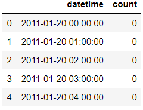

```python
submission['count'] = prediction
submission.head()
```


```python
submission.to_csv('../bike-sharing-demand/classSubmission.csv', index=False)
```

- 제출 결과 score : 1.89279


# 연습문제

## 1.

- A 반 학생 5명과 B반 학생 5명의 국어, 영어, 수학 점수를 나타내는 데이터프레임을 다음과 같이 만든다.
- "반", "번호", "국어", "영어", "수학" 을 열로 가지는 데이터프레임 df_score2을 만든다.
- df_score2

|      | 반   | 번호 | 국어 | 영어 | 수학 |
| ---- | ---- | ---- | ---- | ---- | ---- |
| 0    | A    | 1    | 90   | 100  | 80   |
| 1    | A    | 2    | 80   | 90   | 100  |
| 2    | A    | 3    | 90   | 100  | 80   |
| 3    | A    | 4    | 70   | 80   | 90   |
| 4    | A    | 5    | 100  | 70   | 80   |
| 5    | B    | 1    | 80   | 90   | 100  |
| 6    | B    | 2    | 90   | 100  | 70   |
| 7    | B    | 3    | 100  | 70   | 80   |
| 8    | B    | 4    | 70   | 80   | 90   |
| 9    | B    | 5    | 80   | 90   | 100  |

### A.

```python
# 1.
df_score2 = pd.DataFrame({
    "반" : sorted(["A", "B"]*5),
    "번호" : list(range(1,6))*2,
    "국어" : [90, 80, 90, 70, 100, 80, 90, 100, 70, 80],
    "영어" : [100, 90, 100 ,80 ,70 ,90 ,100, 70 ,80 ,90],
    "수학" : [80, 100, 80, 90, 80, 100, 70, 80, 90, 100]
})
df_score2
```


## 2.

- df_score2을 변형하여 1차 행 인덱스로 "반"을 2차 행 인덱스로 "번호"을 가지는 데이터프레임을 만든다.
- df1

|      |      | 국어 | 영어 | 수학 |
| ---- | ---- | ---- | ---- | ---- |
| 반   | 번호 |      |      |      |
| A    | 1    | 90   | 100  | 80   |
|      | 2    | 80   | 90   | 100  |
|      | 3    | 90   | 100  | 80   |
|      | 4    | 70   | 80   | 90   |
|      | 5    | 100  | 70   | 80   |
| B    | 1    | 80   | 90   | 100  |
|      | 2    | 90   | 100  | 70   |
|      | 3    | 100  | 70   | 80   |
|      | 4    | 70   | 80   | 90   |
|      | 5    | 80   | 90   | 100  |

### A.

```python
# 2.
df1 = df_score2.pivot_table(index = ["반", "번호"])
df1
```

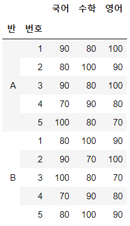


## 3.

- 위 데이터 프레임에 각 학생의 평균을 나타내는 행을 오른쪽에 추가한다.
- df1

|      |      | 국어 | 영어 | 수학 | 평균      |
| ---- | ---- | ---- | ---- | ---- | --------- |
| 반   | 번호 |      |      |      |           |
| A    | 1    | 90   | 100  | 80   | 90.000000 |
|      | 2    | 80   | 90   | 100  | 90.000000 |
|      | 3    | 90   | 100  | 80   | 90.000000 |
|      | 4    | 70   | 80   | 90   | 80.000000 |
|      | 5    | 100  | 70   | 80   | 83.333333 |
| B    | 1    | 80   | 90   | 100  | 90.000000 |
|      | 2    | 90   | 100  | 70   | 86.666667 |
|      | 3    | 100  | 70   | 80   | 83.333333 |
|      | 4    | 70   | 80   | 90   | 80.000000 |
|      | 5    | 80   | 90   | 100  | 90.000000 |

### A.

```python
# 3.
df1["평균"] = df1.mean(axis=1)
df1
```

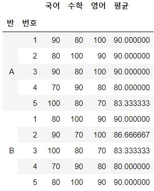


## 4.

- df_score2을 변형하여 행 인덱스로 "번호"을, 1차 열 인덱스로 "국어", "영어", "수학"을, 2차 열 인덱스로 "반"을 가지는 데이터프레임을 만든다.
- df3

|      | 국어 |      | 영어 |      | 수학 |      |
| ---- | ---- | ---- | ---- | ---- | ---- | ---- |
| 반   | A    | B    | A    | B    | A    | B    |
| 번호 |      |      |      |      |      |      |
| 1    | 90   | 80   | 100  | 90   | 80   | 100  |
| 2    | 80   | 90   | 90   | 100  | 100  | 70   |
| 3    | 90   | 100  | 100  | 70   | 80   | 80   |
| 4    | 70   | 70   | 80   | 80   | 90   | 90   |
| 5    | 100  | 80   | 70   | 90   | 80   | 100  |

### A.

```python
# 4.
df3 = df_score2.pivot_table(index=["번호"], columns=["반"], values=["국어", "영어", "수학"])
df3
```

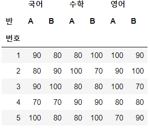


## 5.

- 위 데이터 프레임에 각 반별 각 과목의 평균을 나타내는 행을 아래에 추가한다	
- df3

|      | 국어  |       | 영어  |       | 수학  |       |
| ---- | ----- | ----- | ----- | ----- | ----- | ----- |
| 반   | A     | B     | A     | B     | A     | B     |
| 번호 |       |       |       |       |       |       |
| 1    | 90.0  | 80.0  | 100.0 | 90.0  | 80.0  | 100.0 |
| 2    | 80.0  | 90.0  | 90.0  | 100.0 | 100.0 | 70.0  |
| 3    | 90.0  | 100.0 | 100.0 | 70.0  | 80.0  | 80.0  |
| 4    | 70.0  | 70.0  | 80.0  | 80.0  | 90.0  | 90.0  |
| 5    | 100.0 | 80.0  | 70.0  | 90.0  | 80.0  | 100.0 |
| 평균 | 86.0  | 84.0  | 88.0  | 86.0  | 86.0  | 88.0  |

### A.

```python
# 5.
df3.loc["평균"] = df3.mean(axis=0)
df3
```

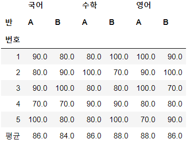


## 6.

- 양의 정수 I가 주어지면, 당신이 할 일은 I보다 큰 수 중 가장 작은 수 J를 찾습니다. I의 이진수 형태에서의 1의 개수와 J의 이진수 형태에서의 1의 개수는 일치합니다.
- 예를들어, "78"이 주어지면, 여러분은 "1001110"과 같은 이진수 형태로 쓸 수 있습니다. 이 이진수는 4개의 1을 가지고 있습니다. "1001110" 보다 크고 4개의 1을 포함하는 가장 작은 정수는 "1010011"입니다. 출력값은 "83"이 되어야 합니다.
- Input
  - 각 줄에 한개의 정수를 입력할 수 있습니다. (1 <= I <= 1000000)
    0이 나오면 입력을 종료합니다. 이 줄은 작업할 필요 없습니다.
- Output
- 각 줄에 한개의 정수를 출력하면 됩니다.
- Sample Input
  - 1
  - 2
  - 3
  - 4
  - 78
  - 0
- Sample Output
  - 2
  - 4
  - 5
  - 8
  - 83

### A.

```python
# 6.
while 1 :
    i = int(input())
    if i == 0 : break
        
    i_2 = format(i, 'b') # 이진수 형식으로 표현
    for j in range(i+1, 3*i) :
        j_2 = format(j, 'b')
        if j_2.count("1") == i_2.count("1") :
            res = j
            break
    print(res)
# > 1
# > 2
# > 2
# > 4
# > 3
# > 5
# > 4
# > 8
# > 78
# > 83
# > 0
```

