[toc]

# Day25 딥러닝을 위한 빅데이터 기초

# 지금까지의 내용 정리

```python
import pandas as pd
df = pd.read_csv('../data/gapminder.tsv', sep='\t')
df
```

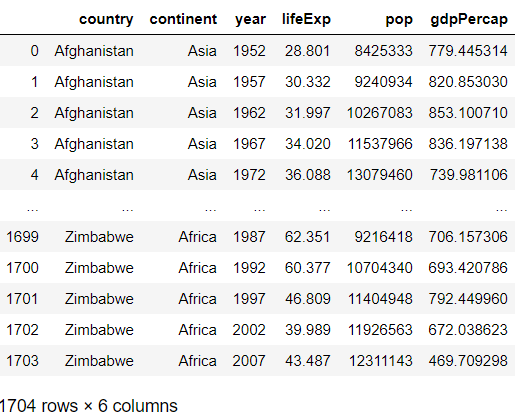

```python
type(df) # 데이터 전체에 대한 속성
# > pandas.core.frame.DataFrame

df.dtypes # 각 열마다의 속성
# > country       object
# > continent     object
# > year           int64
# > lifeExp      float64
# > pop            int64
# > gdpPercap    float64
# > dtype: object

cdf = df['country']
type(cdf)
# > pandas.core.series.Series

subset = df[['country', 'continent', 'year']]
subset
```

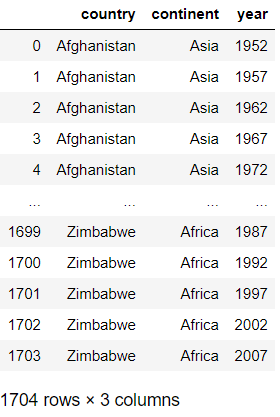

```python
df.loc[0] # 인덱스 이름을 입력받으므로, -1은 Error 발생
# > country      Afghanistan
# > continent           Asia
# > year                1952
# > lifeExp           28.801
# > pop              8425333
# > gdpPercap        779.445
# > Name: 0, dtype: object

df.iloc[-1] # 인덱스 숫자를 입력받으므로, -1 가능
# > country      Zimbabwe
# > continent      Africa
# > year             2007
# > lifeExp        43.487
# > pop          12311143
# > gdpPercap     469.709
# > Name: 1703, dtype: object

df.shape[0] # 행의 갯수
# > 1704

lli = df.shape[0]-1 
df.loc[lli] # 마지막 데이터 확인
# > country      Zimbabwe
# > continent      Africa
# > year             2007
# > lifeExp        43.487
# > pop          12311143
# > gdpPercap     469.709
# > Name: 1703, dtype: object

df.head(n=5)
```

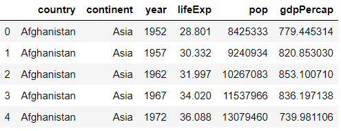

```python
df.tail()
```

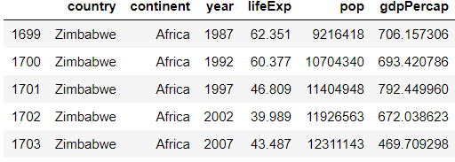

```python
df.loc[[0, 100, 1000]]
```

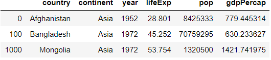

```python
type(df.loc[0]) # Series
# > pandas.core.series.Series

type(df.tail(1)) # DataFrame
# > pandas.core.frame.DataFrame

df.iloc[[0, 100, 1000]]
```

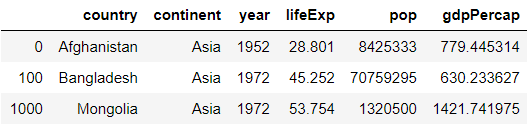

```python
df[['year', 'pop']]
```

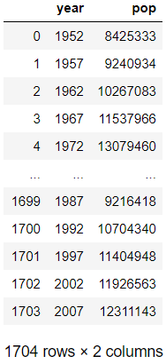

```python
df.loc[:,['year', 'pop']]
```

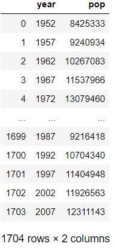

```python
df.iloc[:,[2,4]]
```

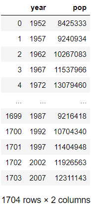

```python
df.iloc[:,list(range(2,5,2))]
```

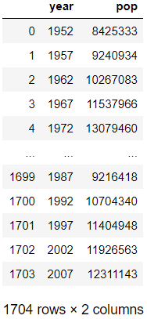

```python
df.iloc[:, :3]
```

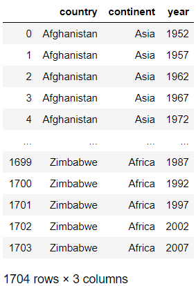

```python
df.iloc[:, 0:6:2] # 0:6:2 = 0, 2, 4 번째 열 추출
```

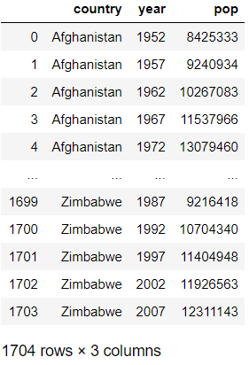

```python
df.iloc[[0,99,999]]
```

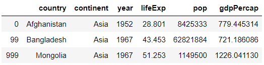

```python
df.iloc[[0,99,999], [0,2,4]]
```

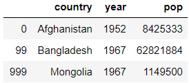

```python
df.loc[[0,99,999], ['country', 'year', 'pop']]
```

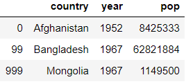

```python
df.loc[10:20, ['country', 'year', 'pop']]
```

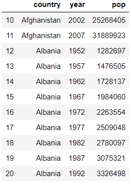

```python
df
```

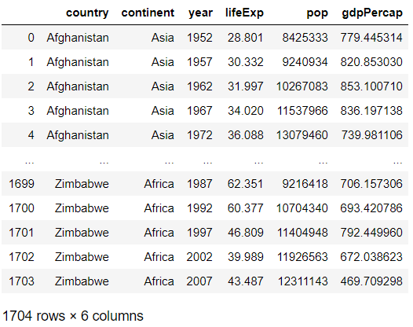

```python
df.year
# > 0       1952
# > 1       1957
# > 2       1962
# > 3       1967
# > 4       1972
# >         ... 
# > 1699    1987
# > 1700    1992
# > 1701    1997
# > 1702    2002
# > 1703    2007
# > Name: year, Length: 1704, dtype: int64

df.year.unique()
# > array([1952, 1957, 1962, 1967, 1972, 1977, 1982, 1987, 1992, 1997, 2002,
# >        2007], dtype=int64)

# 연도별 기대수명의 평균
df.groupby('year') # 그룹화 객체 생성
# > <pandas.core.groupby.generic.DataFrameGroupBy object at 0x000001DB23F77548>

df.groupby('year')['lifeExp'].mean()
# > year
# > 1952    49.057620
# > 1957    51.507401
# > 1962    53.609249
# > 1967    55.678290
# > 1972    57.647386
# > 1977    59.570157
# > 1982    61.533197
# > 1987    63.212613
# > 1992    64.160338
# > 1997    65.014676
# > 2002    65.694923
# > 2007    67.007423
# > Name: lifeExp, dtype: float64

df.groupby(['year', 'continent'])['lifeExp'].mean()
# > year  continent
# > 1952  Africa       39.135500
# >       Americas     53.279840
# >       Asia         46.314394
# >       Europe       64.408500
# >       Oceania      69.255000
# > ...
# > 2007  Africa       54.806038
# >       Americas     73.608120
# >       Asia         70.728485
# >       Europe       77.648600
# >       Oceania      80.719500
# > Name: lifeExp, dtype: float64

df.groupby(['year', 'continent'])[['lifeExp', 'gdpPercap']].mean()
```

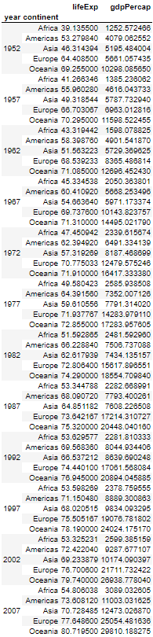

```python
df.groupby('year')['lifeExp'].nunique()
# 그룹화한 데이터 개수 세기
# > year
# > 1952    142
# > 1957    142
# > 1962    141
# > 1967    141
# > 1972    142
# > 1977    142
# > 1982    142
# > 1987    141
# > 1992    141
# > 1997    142
# > 2002    142
# > 2007    142
# > Name: lifeExp, dtype: int64

df.groupby('continent')['country'].nunique()
# > continent
# > Africa      52
# > Americas    25
# > Asia        33
# > Europe      30
# > Oceania      2
# > Name: country, dtype: int64
```

```python
import matplotlib.pyplot as plt
gle = df.groupby('year')['lifeExp'].mean()
gle
# > year
# > 1952    49.057620
# > 1957    51.507401
# > 1962    53.609249
# > 1967    55.678290
# > 1972    57.647386
# > 1977    59.570157
# > 1982    61.533197
# > 1987    63.212613
# > 1992    64.160338
# > 1997    65.014676
# > 2002    65.694923
# > 2007    67.007423
# > Name: lifeExp, dtype: float64

type(gle)
# > pandas.core.series.Series

gle.plot() # 기본 선 그래프
# 기대수명이 점점 늘어가고 있다.
```

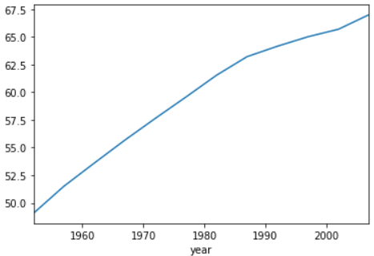

```python
s = pd.Series(['apple', 30])
s
# > 0    apple
# > 1       30
# > dtype: object

s = pd.Series(['apple', 30], index=['Name', 'Num'])
s
# > Name    apple
# > Num        30
# > dtype: object

s.loc['Num']
# > 30

s.iloc[1]
# > 30
```

```python
df = pd.DataFrame({
    'Name' : ['AAA', 'BBB'],
    'Age' : [20, 30]
})
df
```

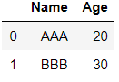

```python
df = pd.DataFrame({
    'Name' : ['AAA', 'BBB'],
    'Age' : [20, 30]
}, index=['first', 'second'])
df
```

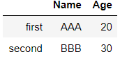

```python
first_row = df.loc['first']
first_row
# > Name    AAA
# > Age      20
# > Name: first, dtype: object

first_row.index
# > Index(['Name', 'Age'], dtype='object')

first_row.values
# > array(['AAA', 20], dtype=object)

first_row.keys() # first_row.index와 동일한 결과 출력
# > Index(['Name', 'Age'], dtype='object')

first_row.index[0]
# > 'Name'

ages = df['Age']
ages
# > first     20
# > second    30
# > Name: Age, dtype: int64

ages.mean()
# > 25.0
```

```python
scientists = pd.read_csv('../data/scientists.csv')
scientists
```

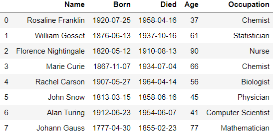

```python
ages = scientists['Age']
ages
# > 0    37
# > 1    61
# > 2    90
# > 3    66
# > 4    56
# > 5    45
# > 6    41
# > 7    77
# > Name: Age, dtype: int64

ages.max()
# > 90

ages.mean()
# > 59.125

# 평균나이보다 큰 나이만 출력
ages[ages>ages.mean()]
# > 1    61
# > 2    90
# > 3    66
# > 7    77
# > Name: Age, dtype: int64

ages + ages # 요소간 덧셈 실시
# > 0     74
# > 1    122
# > 2    180
# > 3    132
# > 4    112
# > 5     90
# > 6     82
# > 7    154
# > Name: Age, dtype: int64

ages * ages # 요소간 곱셈
# > 0    1369
# > 1    3721
# > 2    8100
# > 3    4356
# > 4    3136
# > 5    2025
# > 6    1681
# > 7    5929
# > Name: Age, dtype: int64

ages + 10 # 시리즈 + 스칼라 => 시리즈
# > 0     47
# > 1     71
# > 2    100
# > 3     76
# > 4     66
# > 5     55
# > 6     51
# > 7     87
# > Name: Age, dtype: int64

ages * 10 # 시리즈 * 스칼라 => 시리즈
# > 0    370
# > 1    610
# > 2    900
# > 3    660
# > 4    560
# > 5    450
# > 6    410
# > 7    770
# > Name: Age, dtype: int64

ages + pd.Series([1,100]) # 시리즈 + 시리즈 => 시리즈
# but, broadcating이 적용되진 않음
# > 0     38.0
# > 1    161.0
# > 2      NaN
# > 3      NaN
# > 4      NaN
# > 5      NaN
# > 6      NaN
# > 7      NaN
# > dtype: float64

ages.sort_index() # 행 인덱스 정렬
# > 0    37
# > 1    61
# > 2    90
# > 3    66
# > 4    56
# > 5    45
# > 6    41
# > 7    77
# > Name: Age, dtype: int64

ages.sort_index(ascending=False)
# > 7    77
# > 6    41
# > 5    45
# > 4    56
# > 3    66
# > 2    90
# > 1    61
# > 0    37
# > Name: Age, dtype: int64

ages.sort_values() # 값 정렬
# > 0    37
# > 6    41
# > 5    45
# > 4    56
# > 1    61
# > 3    66
# > 7    77
# > 2    90
# > Name: Age, dtype: int64

ages.sort_values(ascending=False)
# > 2    90
# > 7    77
# > 3    66
# > 1    61
# > 4    56
# > 5    45
# > 6    41
# > 0    37
# > Name: Age, dtype: int64

rev_ages = ages.sort_index(ascending=False)
print(ages)
print(rev_ages)
# > 0    37
# > 1    61
# > 2    90
# > 3    66
# > 4    56
# > 5    45
# > 6    41
# > 7    77
# > Name: Age, dtype: int64
# > 7    77
# > 6    41
# > 5    45
# > 4    56
# > 3    66
# > 2    90
# > 1    61
# > 0    37
# > Name: Age, dtype: int64

print(ages+rev_ages) # 같은 인덱스끼리 연산
# > 0     74
# > 1    122
# > 2    180
# > 3    132
# > 4    112
# > 5     90
# > 6     82
# > 7    154
# > Name: Age, dtype: int64
```

```python
scientists
```

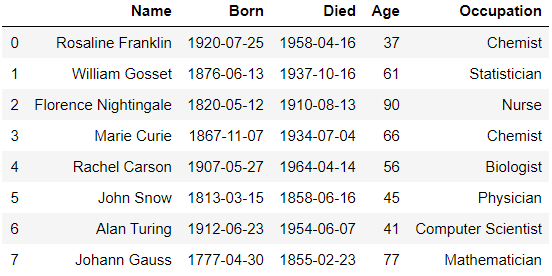

```python
# age열의 평균값보다 큰 scientists 추출
scientists[scientists.Age > scientists.Age.mean()]
```

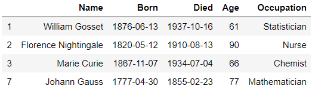

```python
scientists['Born'].dtype # 'O' : object
# > dtype('O')

pd.to_datetime(scientists['Born']) # 기본 format : %Y-%m-%d
# > 0   1920-07-25
# > 1   1876-06-13
# > 2   1820-05-12
# > 3   1867-11-07
# > 4   1907-05-27
# > 5   1813-03-15
# > 6   1912-06-23
# > 7   1777-04-30
# > Name: Born, dtype: datetime64[ns]

pd.to_datetime(scientists['Born'], format='%Y-%m-%d')
# > 0   1920-07-25
# > 1   1876-06-13
# > 2   1820-05-12
# > 3   1867-11-07
# > 4   1907-05-27
# > 5   1813-03-15
# > 6   1912-06-23
# > 7   1777-04-30
# > Name: Born, dtype: datetime64[ns]

bd = pd.to_datetime(scientists['Born'], format='%Y-%m-%d')
dd = pd.to_datetime(scientists['Died'], format='%Y-%m-%d')
dd
# > 0   1958-04-16
# > 1   1937-10-16
# > 2   1910-08-13
# > 3   1934-07-04
# > 4   1964-04-14
# > 5   1858-06-16
# > 6   1954-06-07
# > 7   1855-02-23
# > Name: Died, dtype: datetime64[ns]

scientists['bd'], scientists['dd'] = bd, dd
scientists
```

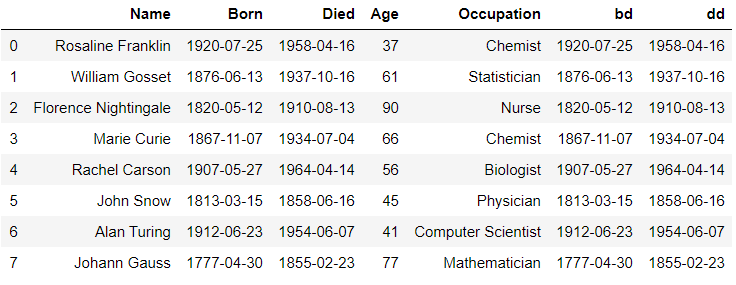

```python
scientists['bt'] = scientists['bd'] - scientists['dd']
scientists
```

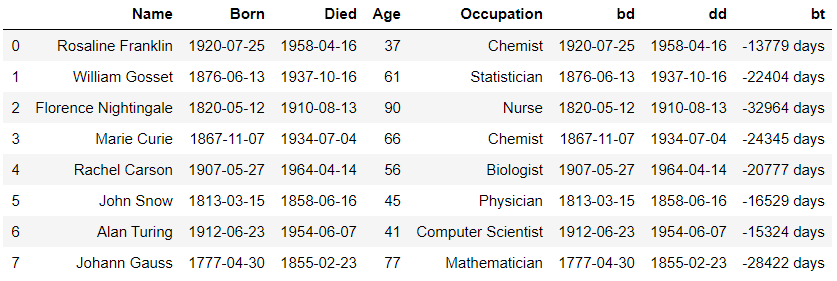

```python
scientists['Age']
# > 0    37
# > 1    61
# > 2    90
# > 3    66
# > 4    56
# > 5    45
# > 6    41
# > 7    77
# > Name: Age, dtype: int64

import random
random.seed(42)
random.shuffle(scientists['Age']) # 데이터 순서 바꾸기
print(scientists['Age'])
# > 0    77
# > 1    90
# > 2    37
# > 3    61
# > 4    41
# > 5    45
# > 6    66
# > 7    56
# > Name: Age, dtype: int64

random.shuffle(scientists['Age'])
print(scientists['Age'])
# > 0    61
# > 1    56
# > 2    37
# > 3    77
# > 4    41
# > 5    66
# > 6    45
# > 7    90
# > Name: Age, dtype: int64

random.seed(1004)
random.shuffle(scientists['Age'])
print(scientists['Age'])
# > 0    37
# > 1    77
# > 2    90
# > 3    56
# > 4    41
# > 5    66
# > 6    61
# > 7    45
# > Name: Age, dtype: int64

scientists
```

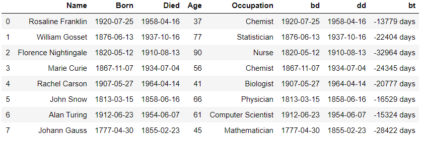

```python
random.seed(1004)
random.shuffle(scientists['Age'])
print(scientists['Age'])
# > 0    90
# > 1    56
# > 2    45
# > 3    77
# > 4    41
# > 5    66
# > 6    37
# > 7    61
# > Name: Age, dtype: int64

scientists.drop(['Age'], axis=1)
```

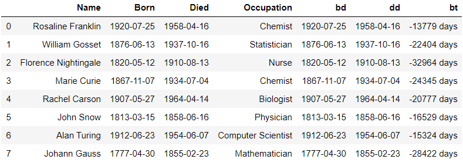

```python
# 피클 : 데이터 객체를 그대로 저장
scientists['Name']
# > 0       Rosaline Franklin
# > 1          William Gosset
# > 2    Florence Nightingale
# > 3             Marie Curie
# > 4           Rachel Carson
# > 5               John Snow
# > 6             Alan Turing
# > 7            Johann Gauss
# > Name: Name, dtype: object

names = scientists['Name']
names.to_pickle('../data/sci_name.pickle') # 시리즈를 피클로 저장
# 데이터 무게가 가벼움

scientists.to_pickle('../data/sci_df.pickle')


sci_name_fp = pd.read_pickle('../data/sci_name.pickle')
sci_name_fp
# > 0       Rosaline Franklin
# > 1          William Gosset
# > 2    Florence Nightingale
# > 3             Marie Curie
# > 4           Rachel Carson
# > 5               John Snow
# > 6             Alan Turing
# > 7            Johann Gauss
# > Name: Name, dtype: object

sci_df_fp = pd.read_pickle('../data/sci_df.pickle')
sci_df_fp
```

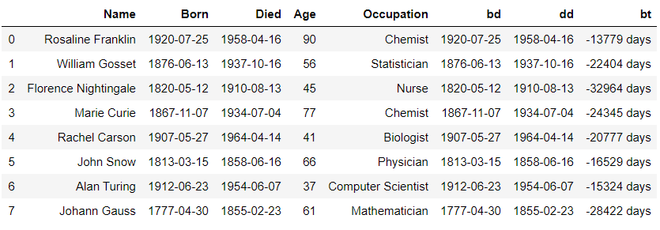

```python
# 엑셀 파일로 저장
scientists.to_excel('../data/sci.xls')
```

```python
df1 = pd.read_csv('../data/concat_1.csv')
df2 = pd.read_csv('../data/concat_2.csv')
df3 = pd.read_csv('../data/concat_3.csv')
df1

df2

df3
```

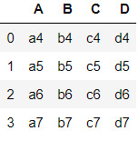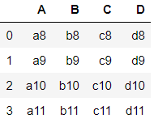

```python
rc = pd.concat([df1, df2, df3])
rc
```

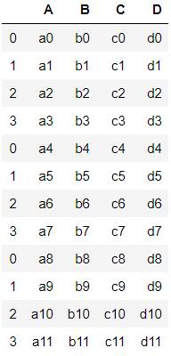

```python
rc.iloc[3] # 3번째인 행이 추출
# > A    a3
# > B    b3
# > C    c3
# > D    d3
# > Name: 3, dtype: object

rc.loc[3] # 행인덱스가 3인 모든 데이터 추출
```

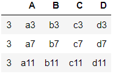

```python
nrs =  pd.Series(['n1', 'n2', 'n3', 'n4'])
nrs
# > 0    n1
# > 1    n2
# > 2    n3
# > 3    n4
# > dtype: object

pd.concat([df1, nrs])
```

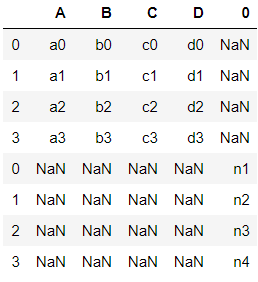

```python
nrdf =  pd.DataFrame([['n1', 'n2', 'n3', 'n4']], 
                     columns=['A', 'B', 'C', 'D'])
nrdf
```

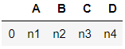

```python
pd.concat([df1, nrdf])
```

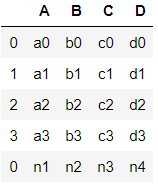

```python
df1.append(nrdf)
```

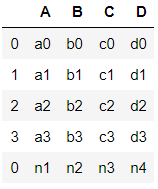

```python
df1.append(nrdf, ignore_index=True)
```

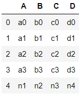

```python
mydict = {"A": 'n1', "B": 'n2', "C": 'n3', "D": 'n4'}
mydict
# > {'A': 'n1', 'B': 'n2', 'C': 'n3', 'D': 'n4'}

df1.append(mydict, ignore_index=True)
```

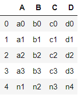

```python
# df1.df2.df3 합치기,index 무시
rci = pd.concat([df1, df2 ,df3], ignore_index=True)
rci
```

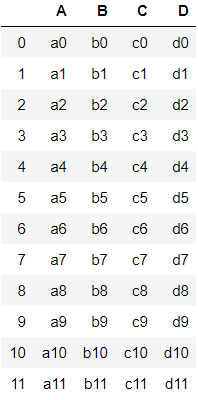

```python
# 열방향으로 데이터프레임 연결
cc = pd.concat([df1, df2, df3], axis=1)
cc
```

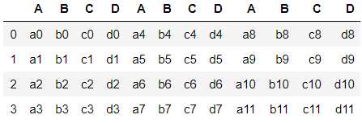

```python
cc['A']
```

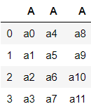

```python
cc['ncl'] = ['n1', 'n2', 'n3', 'n4']
cc
```

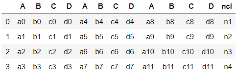

```python
pd.concat([df1, df2, df3], axis=1, ignore_index=True)
```

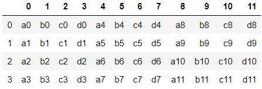

```python
df2
```

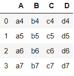

```python
df2.columns = ['E', 'F', 'G', 'H']
df2
```

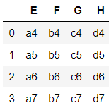

```python
df3.columns = ['A', 'C', 'F', 'H']
df3
```

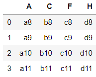

```python
pd.concat([df1, df2])
```


```python
rc = pd.concat([df1, df2, df3])
rc
```

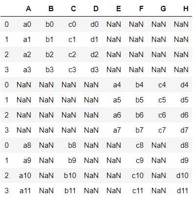

```python
pd.concat([df1, df2, df3], join='inner') # 공통된 열이 없음
```

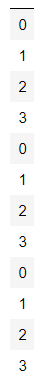

```python
pd.concat([df1, df3], join='inner')
```

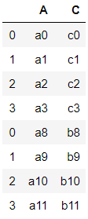

```python
pd.concat([df1, df3], join='inner', ignore_index=True)
```


```python
df1.index
# > RangeIndex(start=0, stop=4, step=1)

df2.index
# > RangeIndex(start=0, stop=4, step=1)

df2.index = [4,5,6,7]
df3.index = [0,2,5,7]
df2
```


```python
df3
```


```python
cc = pd.concat([df1, df2 ,df3], axis=1)
cc
```


```python
pd.concat([df1, df3], axis=1, join='inner')
```


```python
person = pd.read_csv('../data/survey_person.csv')
person
```


```python
site = pd.read_csv('../data/survey_site.csv')
survey = pd.read_csv('../data/survey_survey.csv')
visited = pd.read_csv('../data/survey_visited.csv')

visited_subset = visited.loc[[0,2,6],:]
visited_subset
```


```python
site
```


```python
o2o = site.merge(visited_subset, left_on='name', 
                 right_on='site')
o2o
```


```python
site
```


```python
visited
```


```python
m2o = site.merge(visited, left_on='name', right_on='site')
m2o
```


```python
# ps = person, survey
# vs = visited, survey
person.head(2)
```


```python
survey.head(2)
```


```python
visited.head(2)
```


```python
ps = person.merge(survey, left_on='ident', 
                  right_on='person')
ps
```


```python
vs = visited.merge(survey, left_on='ident', 
                   right_on='taken')
vs
```


```python
# ps와 vs merge
ps.merge(vs, on=['taken', 'quant', 'reading'])
```


```python
ps.merge(vs, left_on=['ident'], right_on=['person'])
```


```python
ps.merge(vs, left_on=['ident', 'taken'], 
         right_on=['person', 'ident'])
```


```python
ps.merge(vs, left_on=['ident', 'taken', 'quant'], 
         right_on=['person', 'ident', 'quant'])
```


```python
ps.merge(vs, left_on=['ident', 'taken', 'quant', 'reading'],
         right_on=['person', 'ident', 'quant', 'reading'])
```


```python
import numpy as np
np.NaN
# > nan

np.NAN
# > nan

np.nan
# > nan

pd.isnull(np.nan)
# > True

pd.notnull(np.nan)
# > False

pd.notnull("test")
# > True

pd.notnull("")
# > True
```

```python
# 누락값 발생 원인
# 실수로 누락, merge, 날짜 데이터
gap = pd.read_csv('../data/gapminder.tsv', sep='\t')
le = gap.groupby(['year'])['lifeExp'].mean()
le
# > year
# > 1952    49.057620
# > 1957    51.507401
# > 1962    53.609249
# > 1967    55.678290
# > 1972    57.647386
# > 1977    59.570157
# > 1982    61.533197
# > 1987    63.212613
# > 1992    64.160338
# > 1997    65.014676
# > 2002    65.694923
# > 2007    67.007423
# > Name: lifeExp, dtype: float64

le.loc[1997,]
# > 65.01467605633805

le.loc[range(2000, 2010),]
# > year
# > 2000          NaN
# > 2001          NaN
# > 2002    65.694923
# > 2003          NaN
# > 2004          NaN
# > 2005          NaN
# > 2006          NaN
# > 2007    67.007423
# > 2008          NaN
# > 2009          NaN
# > Name: lifeExp, dtype: float64

# 2002와 2007만 추출
le.index
# > Int64Index([1952, 1957, 1962, 1967, 1972, 1977, 1982, 1987, 1992, 1997, 2002,
# >             2007],
# >            dtype='int64', name='year')

le.index>2000
# > array([False, False, False, False, False, False, False, False, False,
# >        False,  True,  True])

le[le.index>2000]
# > year
# > 2002    65.694923
# > 2007    67.007423
# > Name: lifeExp, dtype: float64
```


# 수행평가

```python
# [데이터 모델링, SQL 응용]
# 1. 제공해준 타이타닉 데이터에 대해 아래와 같은 작업을 수행하시오.
# 1) Pclass를 원핫인코딩
import pandas as pd
titanic = pd.read_csv('../train.csv')

from sklearn.preprocessing import OneHotEncoder
ohe = OneHotEncoder()
ohe_fit = ohe.fit_transform(titanic['Pclass'].factorize()[0].reshape(-1,1))
# factorize()를 통해 [3,1,2] 순서로 OneHotEncoding 됨
print(ohe_fit.toarray())

pclass_dummy = pd.get_dummies(titanic.Pclass, 
                              prefix='Pclass')
print(pclass_dummy)
# > [[1. 0. 0.]
# >  [0. 1. 0.]
# >  [1. 0. 0.]
# >  ...
# >  [1. 0. 0.]
# >  [0. 1. 0.]
# >  [1. 0. 0.]]
# >      Pclass_1  Pclass_2  Pclass_3
# > 0           0         0         1
# > 1           1         0         0
# > 2           0         0         1
# > 3           1         0         0
# > 4           0         0         1
# > ..        ...       ...       ...
# > 886         0         1         0
# > 887         1         0         0
# > 888         0         0         1
# > 889         1         0         0
# > 890         0         0         1
# > 
# > [891 rows x 3 columns]

# 2) Age를 이산화(5개 구간으로 나눔)
bins = [0, 15, 30, 45, 60, 100]
label = ['미성년자', '청년', '중년', '장년', '노년']
age_cut = pd.cut(titanic.Age, bins, labels=label)
print(age_cut)
# > 0       청년
# > 1       중년
# > 2       청년
# > 3       중년
# > 4       중년
# >       ... 
# > 886     청년
# > 887     청년
# > 888    NaN
# > 889     청년
# > 890     중년
# > Name: Age, Length: 891, dtype: category
# > Categories (5, object): [미성년자 < 청년 < 중년 < 장년 < 노년]

# 3) embarked를 원핫인코딩
embarked_dummy = pd.get_dummies(titanic.Embarked, 
                                prefix='Embarked')
print(embarked_dummy)
# >      Embarked_C  Embarked_Q  Embarked_S
# > 0             0           0           1
# > 1             1           0           0
# > 2             0           0           1
# > 3             0           0           1
# > 4             0           0           1
# > ..          ...         ...         ...
# > 886           0           0           1
# > 887           0           0           1
# > 888           0           0           1
# > 889           1           0           0
# > 890           0           1           0
# > 
# > [891 rows x 3 columns]
```

```python
# 2. 타이타닉호 승객을 사망자와 생존자 그룹으로 나누고 
# 각 그룹에 대해 '미성년자', '청년', '중년', '장년', '노년' 승객의 비율을 구한다. 
# 각 그룹 별로 비율의 전체 합은 1이 되어야 한다.
bins = [5, 20, 30, 40, 60, 90]
labels = ["미성년자", "청년", "중년", "장년", "노년"]
titanic['label'] = pd.cut(titanic.Age, bins, labels=labels)
titanic['S'] = pd.cut(titanic.Survived, [-0.1, 0.5, 1.1], 
                      labels=["dead", "survived"])

g_2 = titanic.groupby(['S', 'label'])[['Survived']].count()
df_2 = g_2 / g_2.sum(level=0)
print(df_2)
# >                 Survived
# > S        label          
# > dead     미성년자   0.204380
# >          청년     0.355231
# >          중년     0.209246
# >          장년     0.189781
# >          노년     0.041363
# > survived 미성년자   0.196911
# >          청년     0.324324
# >          중년     0.266409
# >          장년     0.193050
# >          노년     0.019305
```

```python
# 기초 알고리즘
# 문제 1. 길이가 10인 1-벡터를 만드세요.
import numpy as np
v1 = np.ones(10)
print(v1)
# > [1. 1. 1. 1. 1. 1. 1. 1. 1. 1.]

# 문제 2. 문제 1에서 만든 벡터에 대해 다섯번째 원소만 1이고 
# 나머지 원소는 모두 0인 벡터를 만드세요.
v2 = v1.copy()
v2[:4] = 5
v2[5:] = 5
print(v2)
# > [5. 5. 5. 5. 1. 5. 5. 5. 5. 5.]

# 문제 3. 10 부터 20까지의 값을 가지는 벡터를 만드세요.
v3 = np.arange(10, 21)
print(v3)
# > [10 11 12 13 14 15 16 17 18 19 20]

# 문제 4. 위 벡터의 순서를 바꾸세요
v4 = np.array([v3[i] for i in range(10, -1, -1)])
print(v4)
# > [20 19 18 17 16 15 14 13 12 11 10]

# 문제 5. 0부터 7까지의 값을 가지는 2x4 행렬을 만드세요.
m5 = np.arange(8).reshape(2,4)
print(m5)
# > [[0 1 2 3]
# >  [4 5 6 7]]

# 문제 6. 벡터 [1,2,0,0,4,0] 에서 
# 원소의 값이 짝수인 원소만 선택한 벡터를 만드세요.
v = np.array([1,2,0,0,4,0])
v6 = v[v%2 == 0]
print(v6)
# > [2 0 0 4 0]

# 문제 7. 2x2 단위 행렬(identity matrix)을 만드세요
v7 = np.identity(2)
print(v7)
# > [[1. 0.]
# >  [0. 1.]]

# 문제 8. 난수 원소를 가지는 3x3 행렬을 만드세요
v8 = np.random.random(9).reshape(3,3)
print(v8)
# > [[0.08500578 0.6842916  0.76524243]
# >  [0.02606524 0.88896719 0.00368806]
# >  [0.37478104 0.39753755 0.28822261]]

# 문제 9. 위에서 만든 난수 행렬에서 최대값 / 최소값 원소를 찾으세요.
print("max :", v8.max())
print("min :", v8.min())
# > max : 0.8965323735697183
# > min : 0.0051992801680640355

# 문제 10. 위에서 만든 난수 행렬에서 행 평균, 열 평균을 계산하세요.
print("행 평균 :", v8.mean(axis=1))
print("열 평균 :", v8.mean(axis=0))
# > 행 평균 : [0.39485472 0.18879362 0.84760365]
# > 열 평균 : [0.47582152 0.62190181 0.33352867]
```

```python
# Microsoft R 서버를 활용한 빅데이터 분석
import pandas as pd
import seaborn as sns
tips = sns.load_dataset("tips")
# 1. 위 문장을 모두 수행한 후, 아래와 같은 요구사항을 구현하시오.
# 1) tips의 'sex‘ 컬럼의 타입을 문자열로 변환한 다음, 
#   info함수를 호출하여 결과를 확인하시오.
tips['sex'] = tips['sex'].astype('str')
tips.info()
# > <class 'pandas.core.frame.DataFrame'>
# > RangeIndex: 244 entries, 0 to 243
# > Data columns (total 7 columns):
# > total_bill    244 non-null float64
# > tip           244 non-null float64
# > sex           244 non-null object
# > smoker        244 non-null category
# > day           244 non-null category
# > time          244 non-null category
# > size          244 non-null int64
# > dtypes: category(3), float64(2), int64(1), object(1)
# > memory usage: 8.8+ KB

# 2) tips의 1,3,5,7번 index행에 저장된 tip 컬럼의 값을 모두 ‘missing'으로 변경하시오
tips.loc[[1,3,5,7], "tip"] = 'missing'
print(tips.head(10))
# >    total_bill      tip     sex smoker  day    time  size
# > 0       16.99     1.01  Female     No  Sun  Dinner     2
# > 1       10.34  missing    Male     No  Sun  Dinner     3
# > 2       21.01      3.5    Male     No  Sun  Dinner     3
# > 3       23.68  missing    Male     No  Sun  Dinner     2
# > 4       24.59     3.61  Female     No  Sun  Dinner     4
# > 5       25.29  missing    Male     No  Sun  Dinner     4
# > 6        8.77        2    Male     No  Sun  Dinner     2
# > 7       26.88  missing    Male     No  Sun  Dinner     4
# > 8       15.04     1.96    Male     No  Sun  Dinner     2
# > 9       14.78     3.23    Male     No  Sun  Dinner     2

"""
# 3) scikitlearn에 있는 preprocessing 모듈중 표준화 및 정규화와 관련된 함수를 모두 기술하시오
from sklearn.preprocessing import *
StandardScaler(X) # 평균이 0, 표준편차가 1이 되도록 변환
RobustScaler(X) # median이 0, IQR이 1이 되도록 변환
MinMaxScaler(X) # 최대값이 1, 최소값이 0이 되도록 변환
MaxAbsScaler(X) # 0을 기준으로 절대값이 1을 넘지 않도록 변환

# 2. 표준화와 정규화의 차이점을 설명하시오.
- 표준화는 요소값을 평균으로 빼준 후 표준편차로 나눈 값으로, 
	비교하려는 대상의 단위가 다를 때 같은 기준으로 볼 수 있게 한다. 
	데이터가 정규분포를 따른다는 가정하에 사용하여, 
	표준화를 통해 표준정규분포를 따른다고 볼 수 있다.
	
- 정규화는 요소값을 요소들의 최소값으로 빼준 후 
	요소들의 최대값과 최소값의 차이로 나눈 값이다. 
	이는 데이터를 0과 1 사이의 값으로 만들어, 
	데이터 군 내에서 특정 데이터가 가지는 위치를 알기 쉽게 만들어 준다.

# 3. 데이터 분석을 위해 필요로 하는 라이브러리 및 용도를 기술하시오.
- numpy : 파이썬 기반 데이터 분석에서 행렬연산을 위한 라이브러리로, 
	대규모 다차원 배열과 행렬 연산에 필요한 다양한 함수를 제공한다.
	
- pandas : 데이터 분석에 특화된 자료구조를 제공하는 라이브러리로, 
	표와 같은 DataFrame 구조로 데이터를 다룰 수 있어 직관적이다.
	
- matplotlib : 데이터 시각화를 위한 라이브러리로, 
	다양한 형태의 그래프를 통한 시각화를 제공한다.
"""
```

```python
# 파이썬 기본문법과 통계기초
"""
다음 실행 예시처럼 교환할 돈을 입력받아서, 
최소한의 동전의 개수로 교환해 주는 파이썬 코드를 작성하시오.
바꿀 돈 -->7777
500원: 15 , 100원: 2 , 50원: 1 , 10원 2 , 나머지: 7
"""
money = int(input())

count = list()
for i in [500, 100, 50, 10] :
    count.append(money//i)
    money = money%i

print("500원:{}, 100원:{}, 50원:{}, 10원:{}, 나머지:{}".format(*count, money))
# > 7777
# > 500원:15, 100원:2, 50원:1, 10원:2, 나머지:7
```

```python
# 파이썬 패키지를 활용한 데이터 시각화
"""
bike sharing command 데이터를 불러온 후, 
workingday 및 dayofweek에 대한 시간대별 자전거 이용자 수(count)를 
시각화하는 프로그램을 작성하시오.
"""
import matplotlib.pyplot as plt
import pandas as pd

bike = pd.read_csv('../bike-sharing-demand/train.csv', 
                   parse_dates=['datetime'])

bike['hour'] = bike['datetime'].dt.hour
bike['dayofweek'] = bike['datetime'].dt.dayofweek

fig, (ax1, ax2) = plt.subplots(nrows = 2, ncols=1)
fig.set_size_inches(16,16)
sns.pointplot(data=bike, x='hour', y='count', hue='workingday',
              ax=ax1, linestyles=['-', '--'])
sns.pointplot(data=bike, x='hour', y='count', hue='dayofweek',
              ax=ax2, markers=['o', 'x', 'v', '^', '*', 'o', 'x'], ci=0)
```

