[toc]

# Day26 딥러닝을 위한 빅데이터 기초 - 데이터 분석를 위한 NumPy, Pandas (11)

# 구글 코랩(colab)

- 구글서버에서 주피터노트북을 동작
- gmail 계정 필요
- 파이썬 설치없이, 웹브라우저만 있으면 사용 가능
- => 공유가 용이(github연결)
- 데이터 분석 패키지(Pandas, TensorFlow, Keras)가 설치되어 있음
- 그래픽 처리(GPU)를 무료로 사용 가능
- 구글 로그인 -> https://colab.research.google.com/ -> 파일 -> 새Python3 노트 : 주피터노트북과 똑같이 사용가능

```python
import pandas as pd
import numpy as np
```

```python
from google.colab import files
uploaded = files.upload()
```

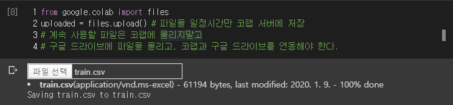

- 파일을 일정시간 동안만 코랩 서버에 저장이 된다.
- 하여 계속 사용할 파일은 코랩에 올리지말고
- 구글 드라이브에 파일을 올리고, 코랩과 구글 드라이브를 연동하여 사용하여야 한다.

```python
!ls # 구글 코랩서버 내에 연결된 파일 목록 확인 코드
# > sample_data  train.csv
```

```python
dataset = pd.read_csv('train.csv')
dataset.head()
```

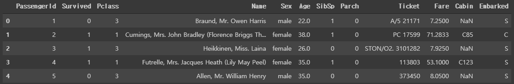

## 구글 드라이브와 연동

```python
from google.colab import drive
drive.mount('/gdrive', force_remount=True)
```


> 주어진 하이퍼링크 -> 로그인 -> 허용 -> 주어진 코드 복사
>
> -> 코랩으로 돌아와 인증코드 입력 칸에 입력 -> '`Mounted at /gdrive`' 뜨면 연결 성공
>
> - 구글 드라이브 -> 내 드라이브 -> 파일 업로드 -> '`banklist.csv`'  업로드

```python
# 구글 코랩
!ls "/gdrive/My Drive"
# > banklist.csv  'Colab Notebooks'
```

```python
df = pd.read_csv('/gdrive/My Drive/banklist.csv')
df.head()
```

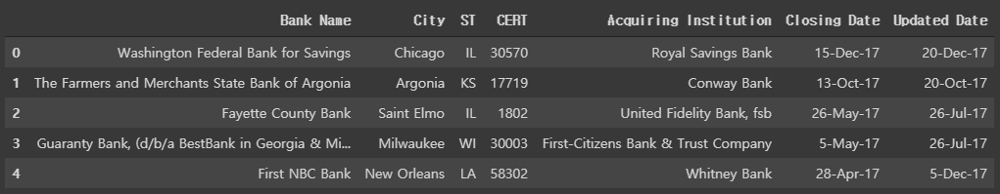

- 코랩 사용법 : colab.research.google.com/ 사이트 -> 목차 내용 참고

# 시각화

- matplotlib
  - 차트 또는 그래프로 출력
  - lineplot, scatterplot, barchart ... 
  - 패키지 사용 및 설명 : matplotlib.org

- matplotlib 예제 중 하나 복붙 실행

```python
import numpy as np
import matplotlib.pyplot as plt
from matplotlib.collections import LineCollection
from matplotlib.colors import ListedColormap, BoundaryNorm

x = np.linspace(0, 3 * np.pi, 500)
y = np.sin(x)
dydx = np.cos(0.5 * (x[:-1] + x[1:]))  # first derivative

# Create a set of line segments so that we can color them individually
# This creates the points as a N x 1 x 2 array so that we can stack points
# together easily to get the segments. The segments array for line collection
# needs to be (numlines) x (points per line) x 2 (for x and y)
points = np.array([x, y]).T.reshape(-1, 1, 2)
segments = np.concatenate([points[:-1], points[1:]], axis=1)

fig, axs = plt.subplots(2, 1, sharex=True, sharey=True)

# Create a continuous norm to map from data points to colors
norm = plt.Normalize(dydx.min(), dydx.max())
lc = LineCollection(segments, cmap='viridis', norm=norm)
# Set the values used for colormapping
lc.set_array(dydx)
lc.set_linewidth(2)
line = axs[0].add_collection(lc)
fig.colorbar(line, ax=axs[0])

# Use a boundary norm instead
cmap = ListedColormap(['r', 'g', 'b'])
norm = BoundaryNorm([-1, -0.5, 0.5, 1], cmap.N)
lc = LineCollection(segments, cmap=cmap, norm=norm)
lc.set_array(dydx)
lc.set_linewidth(2)
line = axs[1].add_collection(lc)
fig.colorbar(line, ax=axs[1])

axs[0].set_xlim(x.min(), x.max())
axs[0].set_ylim(-1.1, 1.1)
plt.show()
```

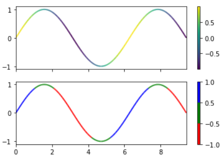

- 사이트의 예제 코드에서 사용된 함수를 클릭하면 설명 페이지로 넘어간다.
- 맨 아래에 있는 배너를 통해 파일을 다운받아 사용할수도 있다.

```python
import matplotlib as mpl
import matplotlib.pyplot as plt
# import matplotlib.pylab as plt
# pylab : 수치해석관련 소프트웨어에서 사용하는 시각화명령을 그대로 사용할 수 있도록 지원
```
```python
%matplotlib inline
# 노트북 내부에 이미지 출력 명령
```
## line plot

```python
# 선(line plot)
plt.title("plot")
plt.plot([1,4,9,16])
plt.show()
```

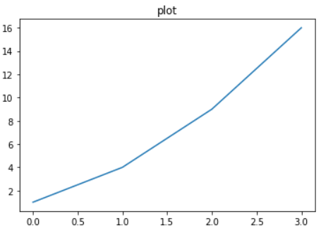

```python
plt.title("plot")
plt.plot([10,20,30,40], [1,4,9,16])
plt.show() # PyCharm에서는 필수
```

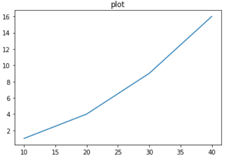

```python
plt.title("plot")
plt.plot([10,20,30,40], [1,4,9,16])
plt.xlabel("x axis")
plt.ylabel("y axis")
plt.show()
```

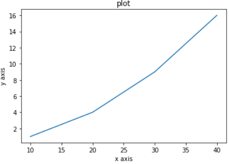

### 그래프 옵션 지정

```python
plt.title("plot")
plt.plot([10,20,30,40], [1,4,9,16], 'rs--')
# rs-- = r:색상, s:점 , --:선 스타일
plt.xlabel("x axis")
plt.ylabel("y axis")
plt.show()
```

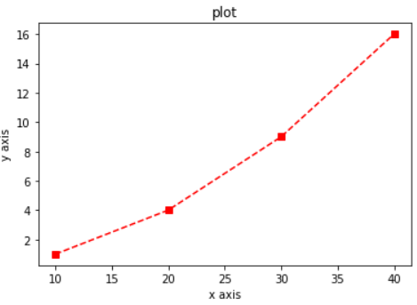

```python
plt.title("plot")
plt.plot([10,20,30,40], [1,4,9,16], 'rh-')
# h : hexsacon
plt.xlabel("x axis")
plt.ylabel("y axis")
plt.show()
```

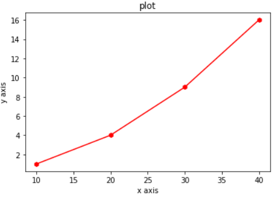

```python
plt.title("plot")
plt.plot([10,20,30,40], [1,4,9,16], 'rx-.')
plt.xlabel("x axis")
plt.ylabel("y axis")
plt.show()
```

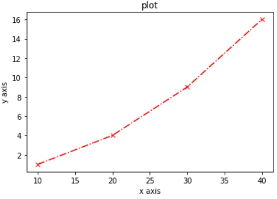

```python
plt.title("plot")
plt.plot([10,20,30,40], [1,4,9,16], 'rd:')
plt.xlabel("x axis")
plt.ylabel("y axis")
plt.show()
```

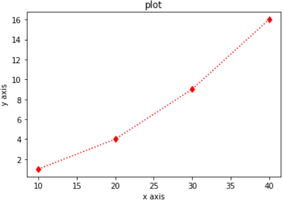

```python
plt.title("plot")
plt.plot([10,20,30,40], [1,4,9,16], 'rD:')
# matplotlib.org > gallery
# color : List of named colors 글 참조
# maker : Marker Referenc 글 참조
# linestyle : Linestyles 글 참조
plt.xlabel("x axis")
plt.ylabel("y axis")
plt.show()
```

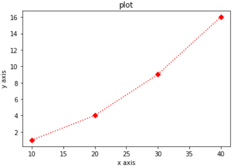

```python
plt.title("plot")
plt.plot([10,20,30,40], [1,4,9,16], c='b', lw=5, ls='--', marker = 'o', ms = 15)
# lw:선두께, ls:선 스타일, ms:MarkerSize
plt.xlabel("x axis")
plt.ylabel("y axis")
plt.show()
```

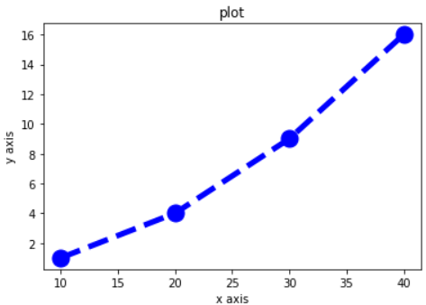

### tick 설정

- 틱 : 플롯에서 축의 위치 표시 지점
- xticks, yticks

```python
np.pi
# > 3.141592653589793

np.linspace(0, 10, 5)
# > array([ 0. ,  2.5,  5. ,  7.5, 10. ])

np.linspace(-np.pi, np.pi, 256)
# > array([-3.14159265, -3.11695271, -3.09231277, -3.06767283, -3.04303288,
# > ...,
# > 3.14159265])
```

```python
x = np.linspace(-np.pi, np.pi, 256)
c = np.cos(x)
plt.plot(x, c)
plt.show()
```


```python
x = np.linspace(-np.pi, np.pi, 256)
c = np.cos(x)
plt.plot(x, c)
plt.yticks([-1,0,1])
plt.show()
```

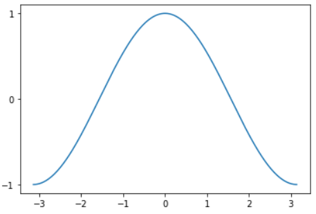

```python
x = np.linspace(-np.pi, np.pi, 256)
c = np.cos(x)
plt.plot(x, c)
plt.xticks([-np.pi,-np.pi/2,0, np.pi/2, np.pi])
plt.yticks([-1,0,1])
plt.show()
```

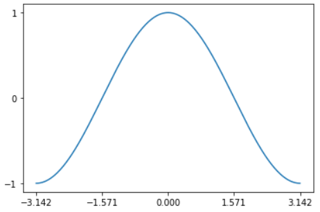

### 그래프 같이 그리기

```python
t = np.arange(0, 5, 0.2)
t
# > array([0. , 0.2, 0.4, 0.6, 0.8, 1. , 1.2, 1.4, 1.6, 1.8, 2. , 2.2, 2.4,
# >        2.6, 2.8, 3. , 3.2, 3.4, 3.6, 3.8, 4. , 4.2, 4.4, 4.6, 4.8])

plt.plot(t,t, 'r--')
```

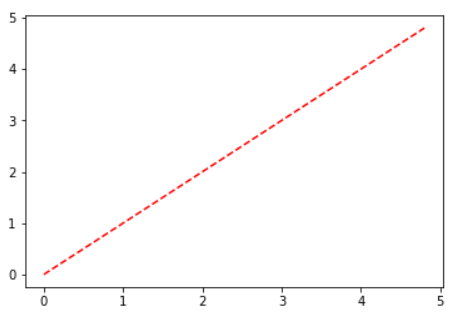

```python
plt.plot(t,t,'r--', t,0.5*t**2,'bs:')
```

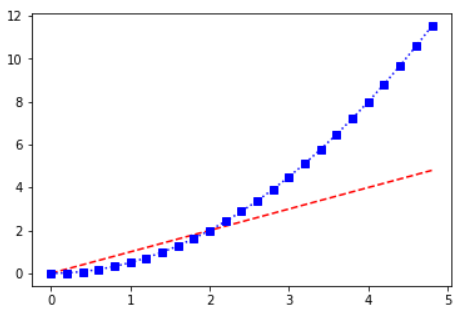

### 범례

```python
x = np.linspace(-np.pi, np.pi, 256)
c,s = np.cos(x), np.sin(x)
plt.plot(x, c, ls='--', label="cosine")
plt.plot(x, s, ls=':', label="sine")
plt.legend(loc=2)
# loc옵션 : 범례출력 위치 0~10; 0은 가장 좋은 위치에 넣어줌
plt.show()
```

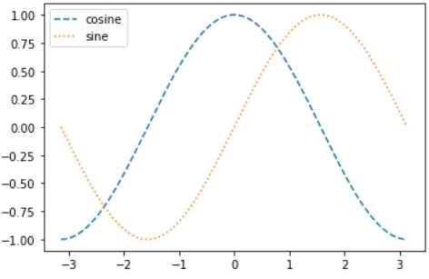

```python
x = np.linspace(-np.pi, np.pi, 256)
c,s = np.cos(x), np.sin(x)
plt.plot(x, c, ls='--', label="cosine")
plt.plot(x, s, ls=':', label="sine")
plt.legend(loc=0)
plt.show()
```

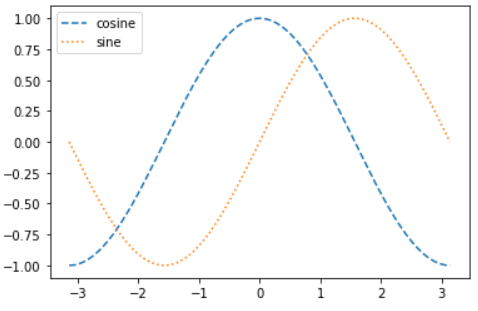

```python
x = np.linspace(-np.pi, np.pi, 256)
c,s = np.cos(x), np.sin(x)
plt.plot(x, c, ls='--', label="cosine")
plt.plot(x, s, ls=':', label="sine")
plt.legend(loc=1)
plt.show()
```

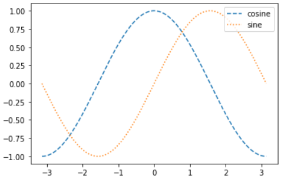

```python
x = np.linspace(-np.pi, np.pi, 256)
c,s = np.cos(x), np.sin(x)
plt.plot(x, c, ls='--', label="cosine")
plt.plot(x, s, ls=':', label="sine")
plt.legend(loc=10)
plt.show()
```

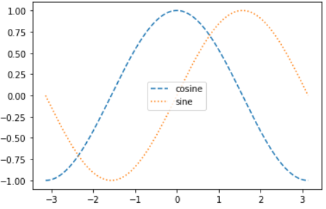

### figure, axes, axis

- figure : 그림을 그릴 종이
- axes : 하나의 plot
- axis : 축
- ex) 종이(figure)를 반으로 접어서(axes), 각 axes에 2차원 그림을 출력(axis)

```python
np.random.seed(0)
f1 = plt.figure(figsize=(10,2))
# figsize 옵션 : figure 사이즈 설정
# > <Figure size 720x144 with 0 Axes>

np.random.seed(0)
f1 = plt.figure(figsize=(10,2))
plt.show()
# > <Figure size 720x144 with 0 Axes>

np.random.seed(0)
f1 = plt.figure(figsize=(10,2))
plt.plot(np.random.randn(100))
plt.show()
```


- subplot(2,1,1) : 2행 1열의 첫번째 위치(위쪽)
- subplot(2,1,2) : 2행 1열의 두번째 위치(아래쪽)

```python
x1 = np.linspace(0.0, 5.0)
x1
# > array([0.        , 0.10204082, 0.20408163, 0.30612245, 0.40816327,
# >        0.51020408, 0.6122449 , 0.71428571, 0.81632653, 0.91836735,
# > ...,
# >        4.59183673, 4.69387755, 4.79591837, 4.89795918, 5.        ])

x2 = np.linspace(0.0, 2.0)
y1 = np.cos(2*np.pi*x1)*np.exp(-x1)
y2 = np.cos(2*np.pi*x2)

ax1 = plt.subplot(2,1,1)
plt.plot(x1, y1, 'yo-')
```

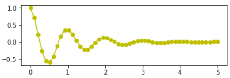

```python
ax1 = plt.subplot(2,1,1)
plt.plot(x1, y1, 'yo-')

ax2 = plt.subplot(2,1,2)
plt.plot(x2, y2, 'r.-')
```


```python
ax1 = plt.subplot(2,1,1)
plt.plot(x1, y1, 'yo-')
plt.title("table1")

ax2 = plt.subplot(2,1,2)
plt.plot(x2, y2, 'r.-')
plt.title("table2")
```

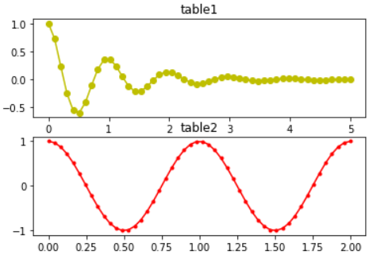

```python
ax1 = plt.subplot(2,1,1)
plt.plot(x1, y1, 'yo-')
plt.title("table1")

ax2 = plt.subplot(2,1,2)
plt.plot(x2, y2, 'r.-')
plt.title("table2")

plt.tight_layout()
```

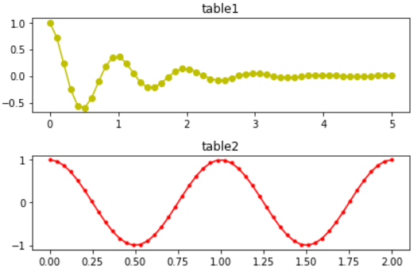

```python
# 이러한 방법도 존재함
fig, axes = plt.subplots(2,2)
```

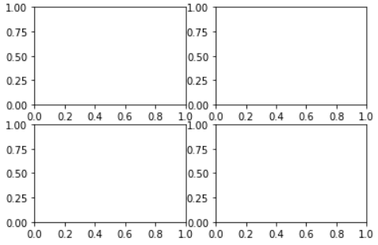

## bar chart

```python
y = [2,3,1]
x = np.arange(len(y)) # [0,1,2]
plt.bar(x,y)
plt.show()
```

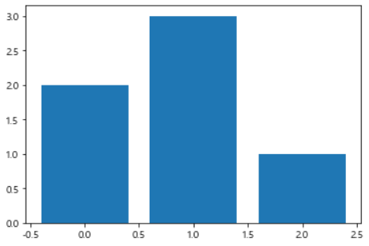

```python
plt.bar(x,y)
plt.xticks(x, ['X', 'Y', 'Z'])
plt.show()
```


```python
plt.bar(x,y)
plt.xticks(x, ['X', 'Y', 'Z'])
plt.xlabel("XYZ")
plt.show()
```

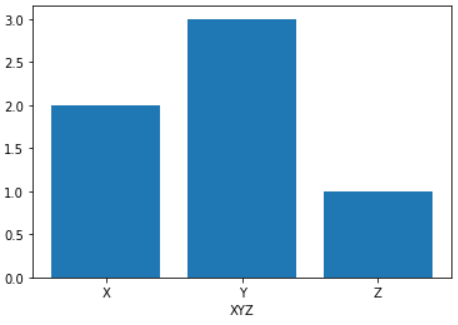

---

# cf) 한글 안깨지는 코드

```python
import matplotlib
from matplotlib import font_manager, rc
import platform
if platform.system()=="Windows":
    font_name=font_manager.FontProperties(fname="c:/Windows/Fonts/malgun.ttf").get_name()
    rc('font', family=font_name)
matplotlib.rcParams['axes.unicode_minus']=False
```

----

```python
plt.bar(x,y)
plt.xticks(x, ['X', 'Y', 'Z'])
plt.xlabel("가나다")
plt.show()
```

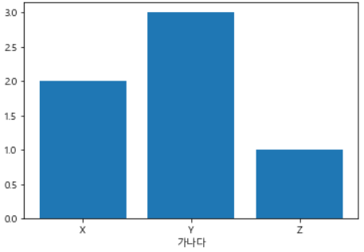

## stem(줄기 잎 그래프)

```python
x = np.linspace(0.1, 2*np.pi, 10)
plt.stem(x, np.cos(x), "-.")
plt.show()
```

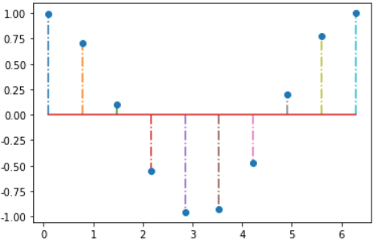

## pie(원 그래프)

```python
labels = ['취업', '결혼', '출산', '건강']
sizes = [15, 30, 45, 10]
colors = ['yellow', 'gold', 'skyblue', 'lightcoral']
plt.pie(sizes, labels=labels, colors=colors)
plt.show()
```

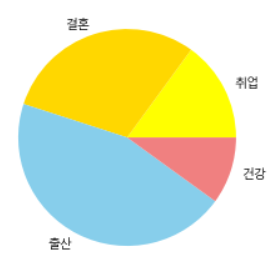

### shadow

```python
plt.pie(sizes, labels=labels, colors=colors, shadow=True)
plt.show()
```


### startangle

```python
plt.pie(sizes, labels=labels, colors=colors, shadow=True, startangle=90)
plt.show()
```

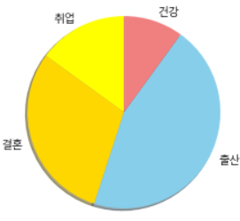

### explode

```python
ex = (0.2,0,0,0)
plt.pie(sizes, labels=labels, colors=colors, shadow=True, startangle=90, explode=ex)
plt.show()
```

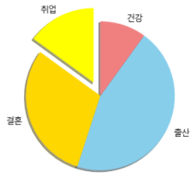

### autopct(자료형 안에 수치 표현)

```python
plt.pie(sizes, labels=labels, colors=colors, shadow=True, startangle=90, explode=ex, autopct="%.1f")
plt.show()
```

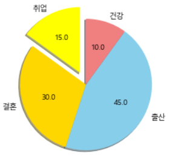

- '`%`' 형식지정을 의미하므로 '`%`'를 출력하기 위해서는  '`%%`'로 작성해야 한다.

```python
plt.pie(sizes, labels=labels, colors=colors, shadow=True, startangle=90, explode=ex, autopct="%.1f%%")
plt.show()
```

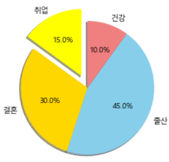

## hist(히스토그램)

```python
x = np.random.randn(100)
plt.hist(x, bins=10)
plt.show()
```

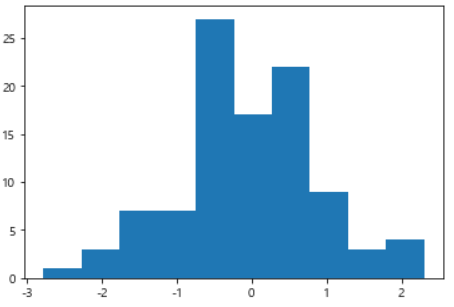

```python
arr, bins, patches = plt.hist(x, bins=10)
```

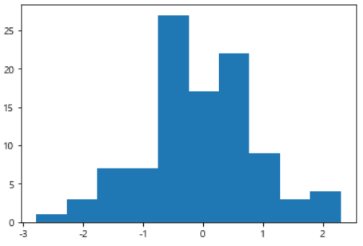

```python
arr # 각 막대의 건수
# > array([ 1.,  3.,  7.,  7., 27., 17., 22.,  9.,  3.,  4.])

bins # 나뉘어진 구간
# > array([-2.77259276, -2.26494181, -1.75729087, -1.24963992, -0.74198897,
# >        -0.23433803,  0.27331292,  0.78096386,  1.28861481,  1.79626575,
# >         2.3039167 ])
```

## ScatterPlot(산점도)

- 데이터 사이에 상관관계를 대략 보기 위하여 사용

```python
x = np.random.normal(0, 1, 100)
y = np.random.normal(0, 1, 100)
plt.scatter(x,y)
plt.show()
```

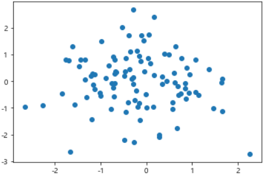

### 3개 이상의 데이터를 2차원에 나타내는 방법

```python
w = np.random.rand(30) # U(0,1)에서 추출
x = np.random.rand(30)
y = np.random.rand(30)
z = np.pi*(10*np.random.rand(30))**2

plt.scatter(w,x)
plt.show()
```

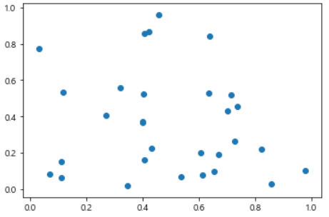

```python
plt.scatter(w,x, c=y)
plt.show()
```

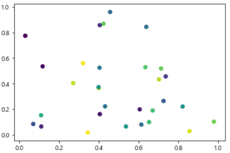

```python
plt.scatter(w,x, c=y, s=z)
plt.show()
```

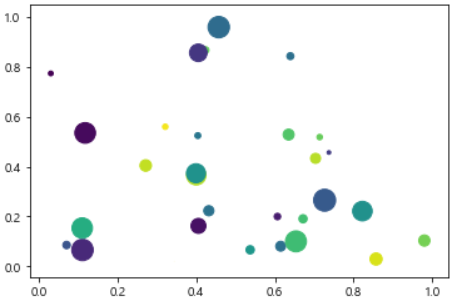


# 주어진 데이터 시각화

## 이미지데이터

```python
from sklearn.datasets import load_digits
```

- load_digits() : MNIST 데이터의 샘플

```python
digits = load_digits()
x = digits.images[0]
x
# > array([[ 0.,  0.,  5., 13.,  9.,  1.,  0.,  0.],
# >        [ 0.,  0., 13., 15., 10., 15.,  5.,  0.],
# >        [ 0.,  3., 15.,  2.,  0., 11.,  8.,  0.],
# >        [ 0.,  4., 12.,  0.,  0.,  8.,  8.,  0.],
# >        [ 0.,  5.,  8.,  0.,  0.,  9.,  8.,  0.],
# >        [ 0.,  4., 11.,  0.,  1., 12.,  7.,  0.],
# >        [ 0.,  2., 14.,  5., 10., 12.,  0.,  0.],
# >        [ 0.,  0.,  6., 13., 10.,  0.,  0.,  0.]])

x = digits.images[2]
x
# > array([[ 0.,  0.,  0.,  4., 15., 12.,  0.,  0.],
# >        [ 0.,  0.,  3., 16., 15., 14.,  0.,  0.],
# >        [ 0.,  0.,  8., 13.,  8., 16.,  0.,  0.],
# >        [ 0.,  0.,  1.,  6., 15., 11.,  0.,  0.],
# >        [ 0.,  1.,  8., 13., 15.,  1.,  0.,  0.],
# >        [ 0.,  9., 16., 16.,  5.,  0.,  0.,  0.],
# >        [ 0.,  3., 13., 16., 16., 11.,  5.,  0.],
# >        [ 0.,  0.,  0.,  3., 11., 16.,  9.,  0.]])

plt.imshow(x)
```

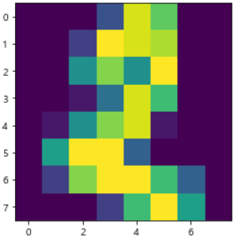

```python
x = digits.images[0]
plt.imshow(x)
```

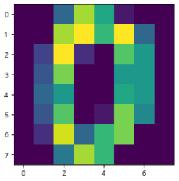

```python
plt.imshow(x, cmap=plt.cm.bone_r)
```

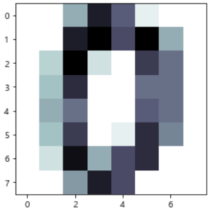

```python
x = digits.images[3]
plt.imshow(x, cmap=plt.cm.bone_r)
```

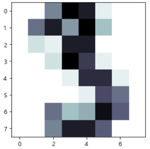

- plt.cm의 속성

```python
dir(plt.cm) # plt.cm의 속성
# > ['Accent',
# >  'Accent_r',
# >  'Blues',
# >  'Blues_r',
# > ... ,
# >  'viridis_r',
# >  'winter',
# >  'winter_r']
```

## anscombe 데이터

```python
import seaborn as sns

anscombe = sns.load_dataset("anscombe")
anscombe
# dataset마다 평균과 분산, 상관관계, 회귀선이 모두 동일
# 데이터 시각화가 중요하다는 것을 알려주는 데이터
```

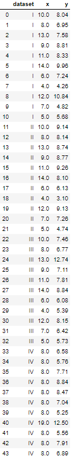

```python
anscombe['dataset'].unique()
# > array(['I', 'II', 'III', 'IV'], dtype=object)

# 'I', 'II', 'III', 'IV'
d1 = anscombe[anscombe['dataset'] == 'I']
plt.plot(d1['x'], d1['y'])
```

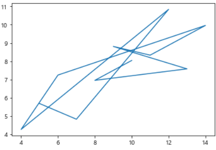

```python
plt.plot(d1['x'], d1['y'], 'o')
```

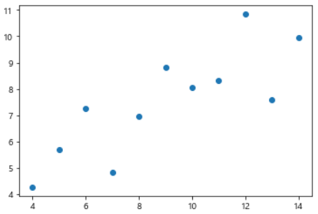

```python
# 'I', 'II', 'III', 'IV'
d2 = anscombe[anscombe['dataset'] == 'II']
d3 = anscombe[anscombe['dataset'] == 'III']
d4 = anscombe[anscombe['dataset'] == 'IV']

fig = plt.figure()
axes1 = fig.add_subplot(2,2,1) # 왼쪽 상단에 추가
axes2 = fig.add_subplot(2,2,2) # 오른쪽 상단에 추가
axes3 = fig.add_subplot(2,2,3) # 왼쪽 하단에 추가
axes4 = fig.add_subplot(2,2,4) # 오른쪽 하단에 추가
```

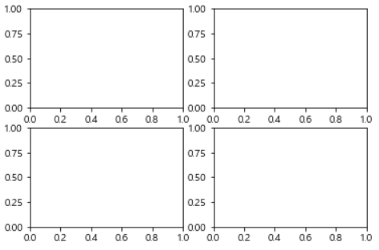

```python
axes1.plot(d1['x'], d1['y'], 'o')
fig
```

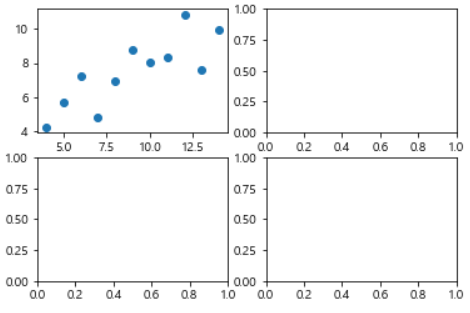

```python
axes2.plot(d2.x, d2.y, 'o')
fig
```

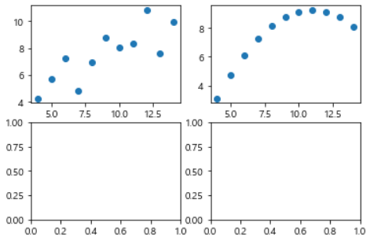

```python
axes3.plot(d3.x, d3.y, 'o')
fig
```


```python
axes4.plot(d4.x, d4.y, 'o')
fig
```


```python
axes1.set_title("dataset1")
axes2.set_title("dataset2")
axes3.set_title("dataset3")
axes4.set_title("dataset4")

fig
```


```python
fig.tight_layout()
fig
```


```python
fig.suptitle("Anscomebe data")
fig
```


## tips 데이터

```python
tips = sns.load_dataset("tips")
tips
# total_bill : 전체 영수증 가격
# tip : 종업원 팁
# size : 일행 수
```


```python
fig = plt.figure()
axes1 = fig.add_subplot(1,1,1)
axes1
```


```python
tips['total_bill']
# > 0      16.99
# > 1      10.34
# > 2      21.01
# > 3      23.68
# > 4      24.59
# >        ...  
# > 239    29.03
# > 240    27.18
# > 241    22.67
# > 242    17.82
# > 243    18.78
# > Name: total_bill, Length: 244, dtype: float64

axes1.hist(tips['total_bill'])
# > (array([ 7., 42., 68., 51., 31., 19., 12.,  7.,  3.,  4.]),
# >  array([ 3.07 ,  7.844, 12.618, 17.392, 22.166, 26.94 , 31.714, 36.488,
# >         41.262, 46.036, 50.81 ]),
# >  <a list of 10 Patch objects>)

axes1.hist(tips['total_bill'], bins=6)
# bins의 default=10
fig
# bins=10인 hist위에 bins=6인 hist가 그려져 파란색 막대일부가 보인다. 
```


```python
scPlot = plt.figure()
axes1 = scPlot.add_subplot(1,1,1)
axes1.scatter(tips['total_bill'], tips['tip'])
```


```python
boxPlot = plt.figure()
axes1 = boxPlot.add_subplot(1,1,1)
axes1.boxplot(
    [tips[tips['sex']=='Female']['tip'],
     tips[tips['sex']=='Male']['tip']],
    labels=['Female', 'Male'])
```


### map, apply

- Female=>0, Male=>1

```python
tips['sex_color'] = tips['sex'].map({'Female':0, 'Male':1})
tips
```


```python
# tips['sex'].apply(사용자함수)
def enc(s) :
    if s =='Female' :
        return 0
    else :
        return 1

tips['sex_color'] = tips['sex'].apply(enc)
tips
```


----

```python
sPlot = plt.figure()
axes1 = sPlot.add_subplot(1,1,1)
axes1.scatter(x=tips['total_bill'], y=tips['tip'])
```


```python
sPlot = plt.figure()
axes1 = sPlot.add_subplot(1,1,1)
axes1.scatter(x=tips['total_bill'], y=tips['tip'], 
              s=tips['size']*10)
```


```python
sPlot = plt.figure()
axes1 = sPlot.add_subplot(1,1,1)
axes1.scatter(x=tips['total_bill'], y=tips['tip'], 
              s=tips['size']*10, c=tips['sex_color'])
```


```python
sPlot = plt.figure()
axes1 = sPlot.add_subplot(1,1,1)
axes1.scatter(x=tips['total_bill'], y=tips['tip'], 
              s=tips['size']*10, c=tips['sex_color'],
              alpha=0.5)
# alpha = 투명도 지정(0에 가까울수록 색이 연해짐)
```


### sns.distplot

```python
import seaborn as sns
ax = plt.subplots()
ax1 = sns.distplot(tips['total_bill'])
# distplot : seaborn에서 hist를 그릴 때 사용하는 함수
```


```python
import seaborn as sns
ax = plt.subplots()
ax1 = sns.distplot(tips['total_bill'], kde=False)
# kde : dist 선그래프 여부 지정 옵션
```


```python
ax1 = sns.distplot(tips['total_bill'], rug=True)
# rug : rug(양탄자) 그래프
# 그래프 축에 동일한 길이의 직선을 그려,
# 데이터가 밀집된 부분을 쉽게 볼 수 있다.
```


### sns.countplot

```python
ax = plt.subplots()
sns.countplot('day', data=tips)
```


# 연습문제

## 1. 타이타닉 데이터 시각화 연습하기

- 스캐터 플롯:생존/사망여부, 성별
- 히스토그램 연습(연령)
- 라인플롯
- 항구에 따른 생존/사망과 관련된 시각화
- ...

### A.

```python
# 1. 타이타닉 데이터 시각화 연습하기
import pandas as pd
import matplotlib.pyplot as plt
import seaborn as sns

titanic = pd.read_csv('../train.csv')
titanic.head()
```


```python
# 생존여부에 따른 요금과 나이의 산점도
sca_plot = plt.subplot()
ax = sca_plot.scatter(titanic['Fare'], titanic['Age'],  c=titanic['Survived'], alpha=0.5)
```


```python
# 성별에 따른 요금과 나이의 산점도
titanic['sex_color'] = titanic['Sex'].map({'female':0, 'male':1})
sca_plot = plt.subplot()
ax = sca_plot.scatter(titanic['Fare'], titanic['Age'], c=titanic['sex_color'], alpha=0.5)
```


```python
# 나이에 대한 histogram
hist_plot = plt.subplot()
hist_plot.hist(titanic['Age'])
# > (array([ 54.,  46., 177., 169., 118.,  70.,  45.,  24.,   9.,   2.]),
# >  array([ 0.42 ,  8.378, 16.336, 24.294, 32.252, 40.21 , 48.168, 56.126,
# >         64.084, 72.042, 80.   ]),
```


```python
# 생존여부에 따른 나이에 대한 histogram
ax1 = plt.subplot(2,1,1)
plt.hist([titanic[titanic['Survived']==0]['Age'],
          titanic[titanic['Survived']==1]['Age']],
        label=['사망', '생존'])
plt.legend()

# 성별에 따른 나이에 대한 histogram
ax2 = plt.subplot(2,1,2)
plt.hist([titanic[titanic['Sex']=='female']['Age'],
          titanic[titanic['Sex']=='male']['Age']],
        label=['여성', '남성'])
plt.legend()
```


```python
# 생존여부와 성별에 따른 나이에 대한 histogram
fig, ax = plt.subplots()
ax.hist([titanic[(titanic['Survived']==0) & (titanic['Sex']=='female')]['Age'], 
         titanic[(titanic['Survived']==1) & (titanic['Sex']=='female')]['Age'],
         titanic[(titanic['Survived']==0) & (titanic['Sex']=='male')]['Age'],
         titanic[(titanic['Survived']==1) & (titanic['Sex']=='male')]['Age']],
        label=['여성&사망','여성&생존', '남성&사망', '남성&생존'])
ax.legend()
```


```python
# 생존여부를 구분한 탑승 항구에 대한 bar 그래프
mod = titanic.groupby(['Embarked'])['Survived'].value_counts(sort=False)

p1 = plt.bar(np.arange(3), mod[:,1,:])
p2 = plt.bar(np.arange(3), mod[:,0,:], bottom=mod[:,1,:])
plt.ylabel('Count')
plt.xticks(np.arange(3), ('C', 'Q', 'S'))
plt.legend((p1[0], p2[0]), ('생존', '사망'))
plt.show()
```


## 2. 

 - 1 부터 9까지의 연속된 수를 + 나 - 를 사용하여 합계가 100이 되는 전체 수를 구하시오.
 - ex) 1 + 2 + 3 - 4 + 5 + 6 + 78 + 9 = 100

### A.

```python
# 2.
num = [list('123456789')]
for i in range(1, 16, 2) :
    res = list()
    for n in num :
        res.append(n[:i]+['+']+n[i:])
        res.append(n[:i]+['-']+n[i:])
        res.append(n[:i]+['']+n[i:])
    num = res.copy() # num에 모든 경우의 수 저장

# 계산 결과 100이 되는 경우만 ans에 저장
answer = list()
for form in num :
    if eval(''.join(form)) == 100 :
        answer.append(''.join(form))

print('총', len(answer), '개') # 총 갯수
print('식 :')
for ans in answer :
    print(ans) # 100을 만족하는 식
# > 총 11 개
# > 식 :
# > 1+2+3-4+5+6+78+9
# > 1+2+34-5+67-8+9
# > 1+23-4+5+6+78-9
# > 1+23-4+56+7+8+9
# > 12+3+4+5-6-7+89
# > 12+3-4+5+67+8+9
# > 12-3-4+5-6+7+89
# > 123+4-5+67-89
# > 123+45-67+8-9
# > 123-4-5-6-7+8-9
# > 123-45-67+89
```


## 3.

- 은비는 빵을 좋아한다.
- “아 빵 먹고 싶다.”
- 은비는 자주 가는 빵집에서 두 가지 맛의 빵 밖에 먹지 않는다.
- 하나는 현미 빵으로 하나에 A원에 팔고 있다.
- 또 다른 하나는 단호박 빵으로 하나에 B원에 팔고 있다.
- 은비는 지금 C원을 가지고 있으며, 어떤 빵이든 상관 없이 그냥 많은 개수의 빵을 사고 싶다.
- 두 종류의 개수를 다르게 사도 되고, 한 종류의 빵만 사도 된다.
-  최대 몇 개의 빵을 살 수 있을까?
-  [입력]
  - 첫 번째 줄에는 세 정수 A, B, C(1 ≤ A, B ≤ 103, 1 ≤ C ≤ 106)가 공백으로 구분되어 주어진다.
- [출력]
  - 최대 몇 개의 빵을 살 수 있는지 출력한다.
- 입력
  - 3 5 6
  - 6 8 20	
  - sample_input.txt
- 출력
  - 2
  - 3	

### A.

```python
# 3.
A, B, C = map(int, input().split())

min_AB = min(A,B)
print(C//min_AB)
# > 6 8 20
# > 3
```


