# Day27 딥러닝을 위한 빅데이터 기초 - 데이터 분석를 위한 NumPy, Pandas (12)

# seaborn에 있는 다양한 그래프

```python
import seaborn as sns
import matplotlib.pyplot as plt
```

## regplot

```python
ax = plt.subplots()
tips = sns.load_dataset("tips")
sns.regplot(x="total_bill", y="tip", data=tips)
```

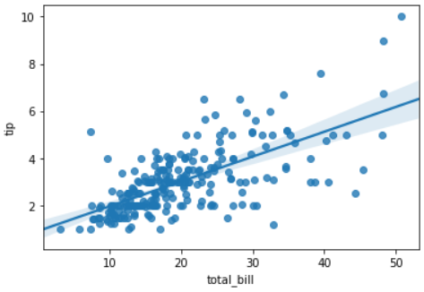

```python
ax = sns.regplot(x="total_bill", y="tip", data=tips)
ax.set_xlabel("TB")
ax.set_ylabel("Tip")
ax.set_title("Total bill and Tip")
```

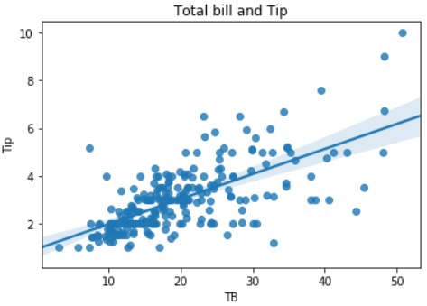

```python
ax = sns.regplot(x="total_bill", y="tip", data=tips, fit_reg=False)
ax.set_xlabel("TB")
ax.set_ylabel("Tip")
ax.set_title("Total bill and Tip")
```


## jointplot

```python
sns.jointplot(x="total_bill", y="tip", data=tips)
```


```python
joint = sns.jointplot(x="total_bill", y="tip", data=tips)
joint.set_axis_labels(xlabel="TB", ylabel="Tip")
```

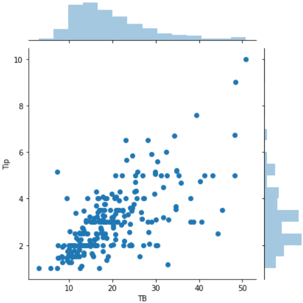

```python
joint = sns.jointplot(x="total_bill", y="tip", data=tips, 
                      kind="hex")
joint.set_axis_labels(xlabel="TB", ylabel="Tip")
```

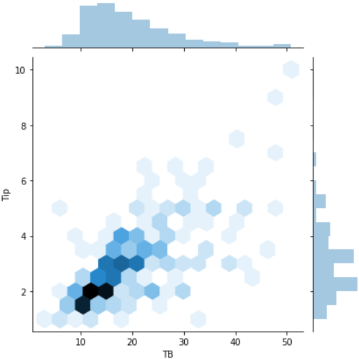

## 이차원 밀잡도 그래프(kdeplot)

```python
# 이차원 밀집도 그래프
kde, ax = plt.subplots()
sns.kdeplot(data=tips["total_bill"], # x축 
            data2=tips["tip"]) # y 축
```

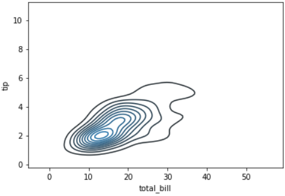

```python
kde, ax = plt.subplots()
sns.kdeplot(data=tips["total_bill"], 
            data2=tips["tip"], shade=True)
```

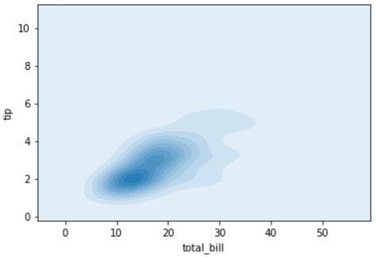

```python
kde, ax = plt.subplots()
ax = sns.kdeplot(data=tips["total_bill"], 
                 data2=tips["tip"], shade=True)
ax.set_title("Kernel Density Plot")
```

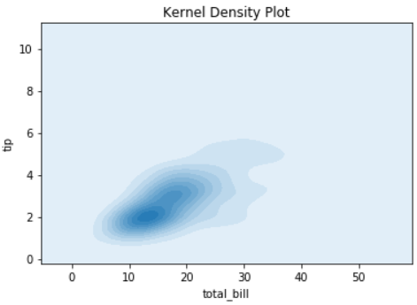

## barplot

```python
ax = plt.subplots()
sns.barplot(x="time", y="total_bill", data=tips)
```

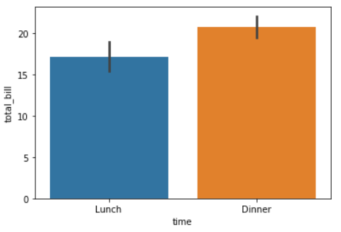

```python
ax = plt.subplots()
ax = sns.barplot(x="time", y="total_bill", data=tips)
ax.set_title("Bar plot")
```

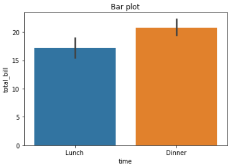

## boxplot

```python
ax = plt.subplots()
ax = sns.boxplot(x="time", y="total_bill", data=tips)
```

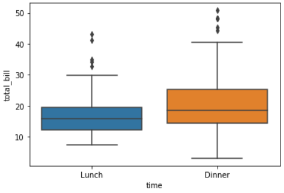

```python
ax = plt.subplots()
ax = sns.boxplot(x="total_bill", data=tips)
```

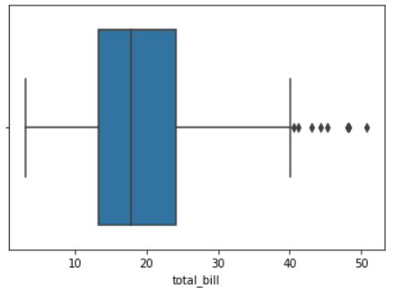

```python
ax = plt.subplots()
ax = sns.boxplot(x="total_bill", data=tips, orient="v")
```

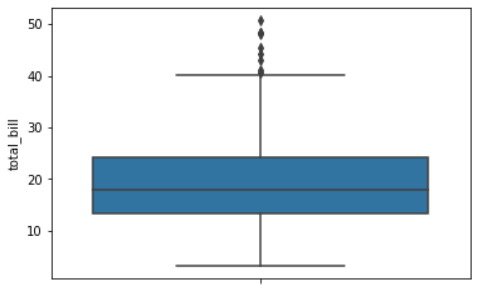

```python
ax = plt.subplots()
ax = sns.boxplot(x="day", y="total_bill", data=tips)
```

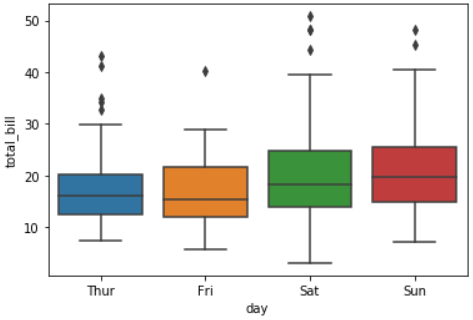

```python
ax = plt.subplots()
ax = sns.boxplot(x="day", y="total_bill", data=tips, 
                 hue="smoker")
```

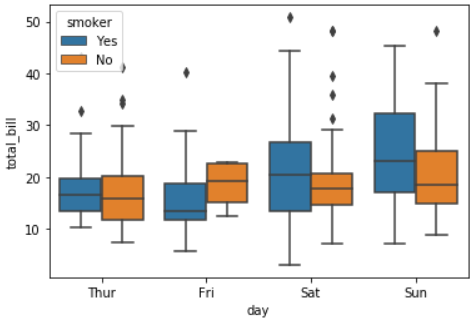

```python
ax = plt.subplots()
ax = sns.boxplot(x="day", y="total_bill", data=tips, 
                 hue="smoker", palette="muted")
```

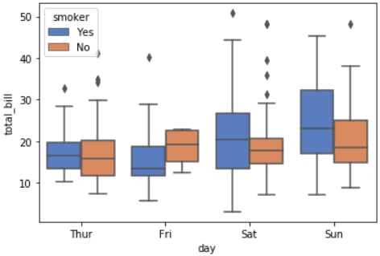

```python
ax = plt.subplots()
ax = sns.boxplot(x="day", y="total_bill", data=tips, 
                 hue="smoker", palette="Set3")
```

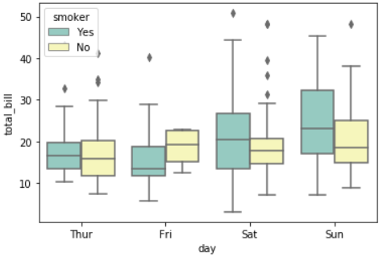

## swarmplot

```python
sns.boxplot(x="day", y="total_bill", data=tips, 
            hue="smoker")
sns.swarmplot(x="day", y="total_bill", data=tips)
```

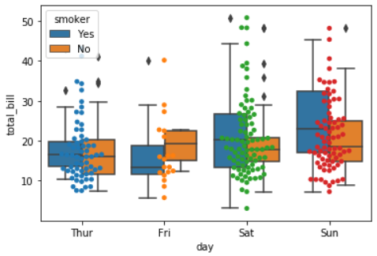

## violinplot

```python
ax = plt.subplots()
sns.violinplot(x="time", y="total_bill", data=tips)
```

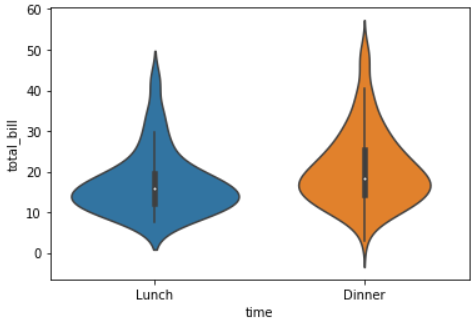

## 관계그래프(pairplot)

```python
sns.pairplot(tips)
```

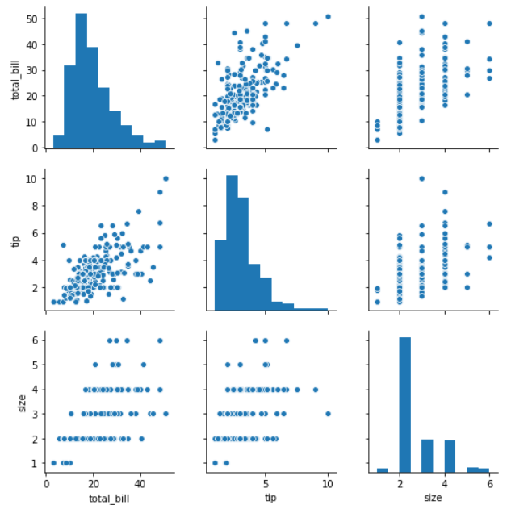

```python
sns.PairGrid(tips) # 빈 PairGrid 생성
```

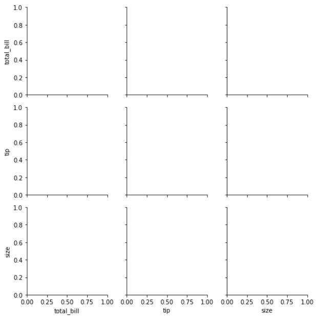

```python
pg = sns.PairGrid(tips)
pg.map_upper(sns.regplot) # 대각선 위쪽 생성
```

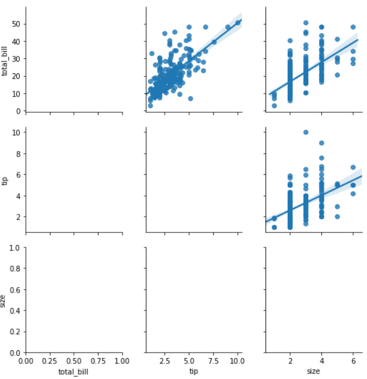

```python
pg = sns.PairGrid(tips)
pg.map_upper(sns.regplot)
pg.map_lower(sns.kdeplot) # 대각선 아래쪽 생성
```

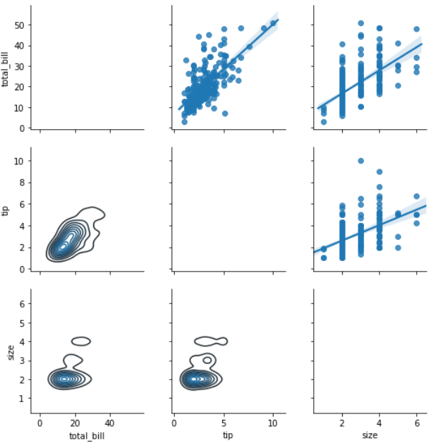

```python
pg = sns.PairGrid(tips)
pg.map_upper(sns.regplot)
pg.map_lower(sns.kdeplot)
pg.map_diag(sns.distplot) # 대각선에 생성
```

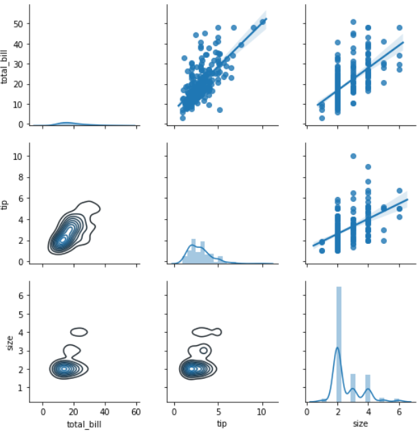

```python
pg = sns.PairGrid(tips)
pg.map_upper(sns.regplot)
pg.map_lower(sns.kdeplot)
pg.map_diag(sns.distplot, rug=True)
```

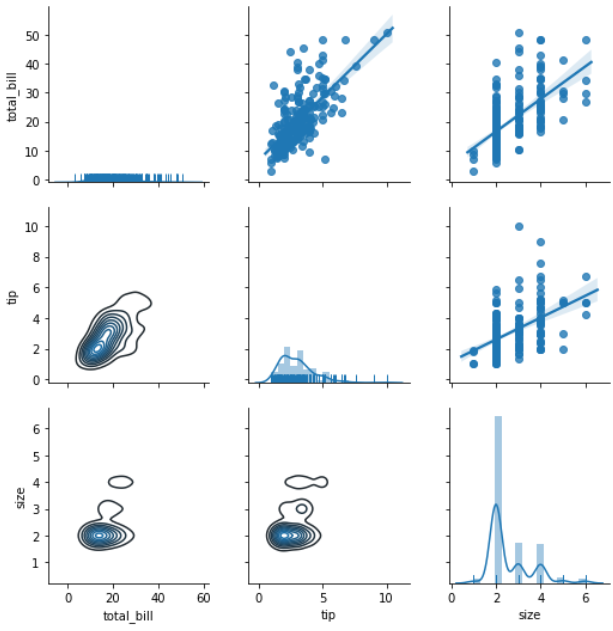

# iris

```python
iris = sns.load_dataset("iris")
iris.head()
```

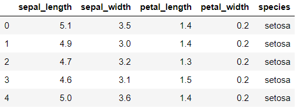

```python
iris.petal_length # Series
# > 0      1.4
# > 1      1.4
# > 2      1.3
# > 3      1.5
# > 4      1.4
# >       ... 
# > 145    5.2
# > 146    5.0
# > 147    5.2
# > 148    5.4
# > 149    5.1
# > Name: petal_length, Length: 150, dtype: float64

iris.petal_length.values # array
# > array([1.4, 1.4, 1.3, 1.5, 1.4, 1.7, 1.4, 1.5, 1.4, 1.5, 1.5, 1.6, 1.4,
# >        1.1, 1.2, 1.5, 1.3, 1.4, 1.7, 1.5, 1.7, 1.5, 1. , 1.7, 1.9, 1.6,
# > ...,
# >        6.1, 6.4, 5.6, 5.1, 5.6, 6.1, 5.6, 5.5, 4.8, 5.4, 5.6, 5.1, 5.1,
# >        5.9, 5.7, 5.2, 5. , 5.2, 5.4, 5.1])
```

## rugplot

```python
x = iris.petal_length.values
sns.rugplot(x)
```

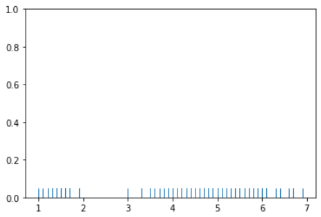

```python
sns.kdeplot(x)
```

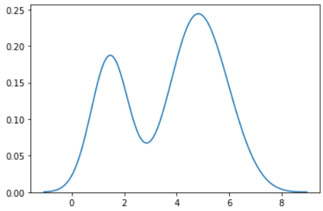

## distplot

```python
sns.distplot(x)
```

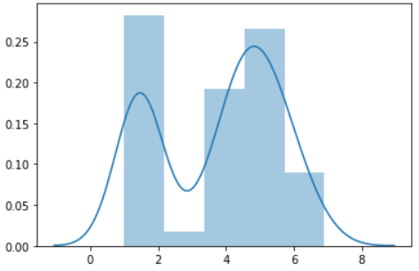

```python
sns.distplot(x, kde=False)
```

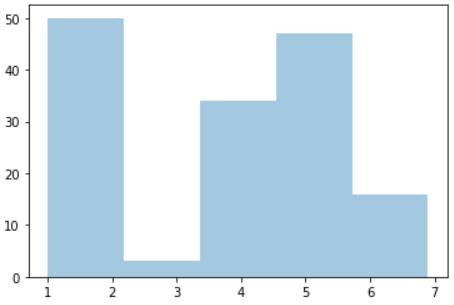

```python
sns.distplot(x, kde=False, rug=True)
```


## countplot

```python
# countplot : 각 종류별 데이터가 얼마나 있는지 표시
titanic = sns.load_dataset("titanic")
sns.countplot(x="class", data=titanic)
```

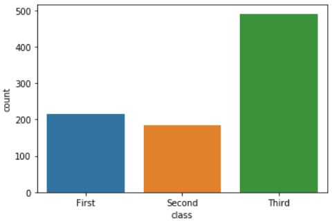

```python
sns.countplot(x="day", data=tips)
```

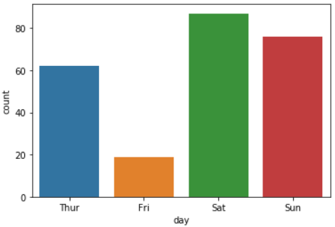

----

# 상황에 따른 plot

- 1차원 데이터 : 실수값, 실수분포 플롯
- (커널밀도, 러그, rugplot, distplot)

- countplot : 카테고리별 데이터가 얼마나 있는지 나타낼 때 사용

- 다차원 데이터(변수가 여러개)
  - 2차원 실수형 데이터 : 스캐터플롯(jointplot)
  - 3차원 이상의 실수형 데이터 : pairplot(그리드 형태)
  - 카테고리형 데이터가 포함된 경우 : hue속성을 지정
  - 2차원 카테고리형 데이터 : heatmap
  - 2차원 실수값, 카테고리형 데이터 : bar, box, point, violin, swarmplot

## 2차원, 연속적인 실수값


```python
# 2차원, 연속적인 실수값
sns.jointplot(x="sepal_length", y="sepal_width", data=iris)
```

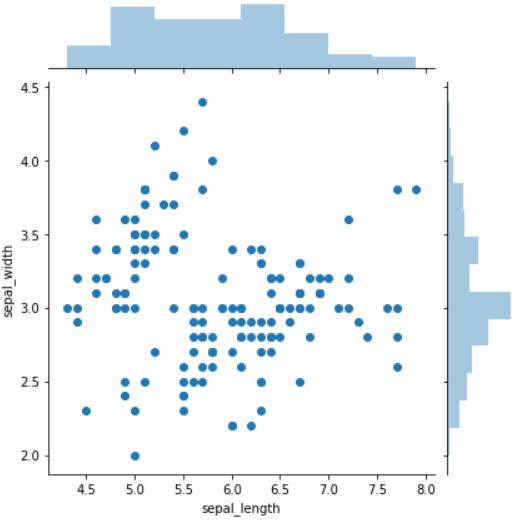

```python
sns.jointplot(x="sepal_length", y="sepal_width", data=iris,
              kind="scatter")
```

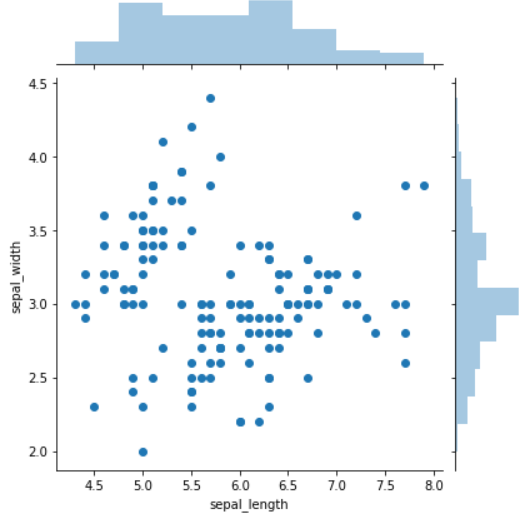

```python
sns.jointplot(x="sepal_length", y="sepal_width", data=iris,
              kind="kde")
```

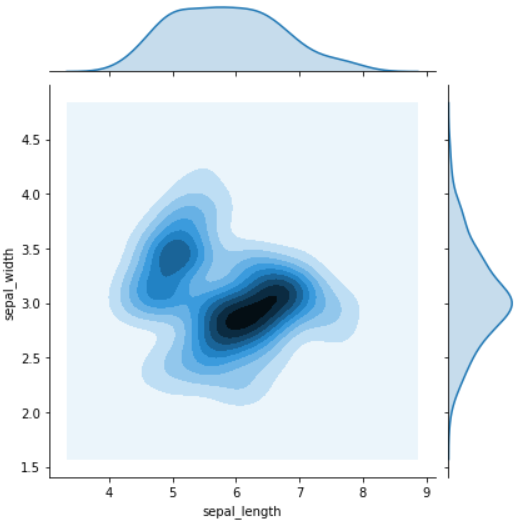

## 3차원 이상 데이터

```python
# 3차원 이상 데이터
sns.pairplot(iris)
```

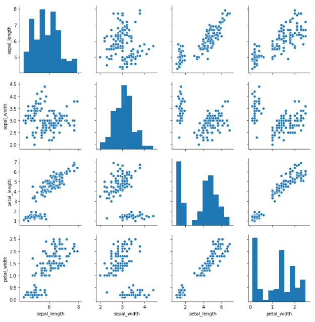

```python
sns.pairplot(iris, hue="species")
```

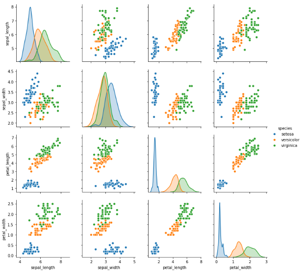

```python
sns.pairplot(iris, hue="species", markers=["o", "s", "D"])
```

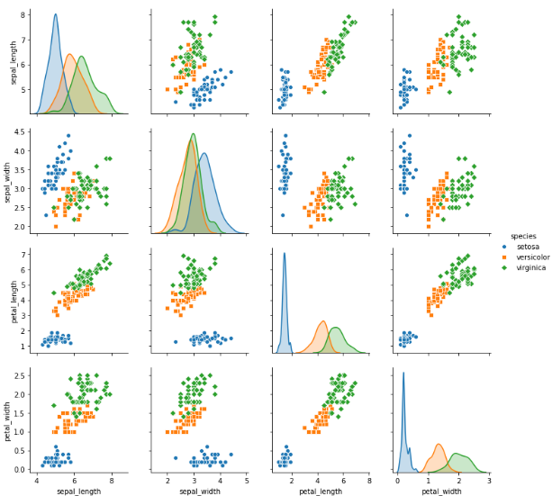

## 2차원데이터, 모든 값이 카테고리형(heatmap)

```python
# heatmap
import pandas as pd
titanic_size = titanic.pivot_table(
    index="class",  columns="sex", aggfunc="size")
titanic_size
```

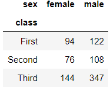

```python
sns.heatmap(titanic_size)
```

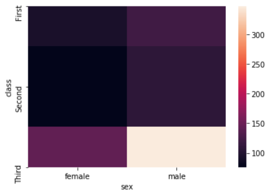

```python
sns.heatmap(titanic_size, annot=True)
```

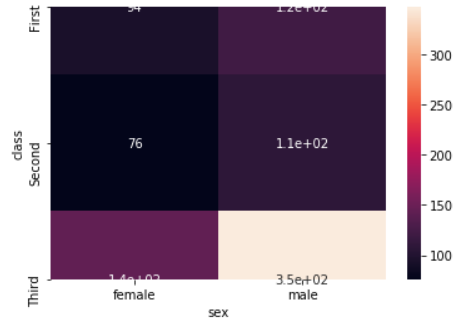

```python
sns.heatmap(titanic_size, annot=True, fmt="d")
```


```python
sns.heatmap(titanic_size, annot=True, fmt="d", 
            cmap=sns.light_palette("gray"))
```

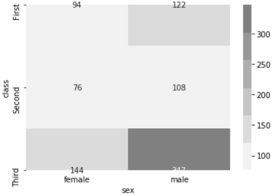

```python
sns.heatmap(titanic_size, annot=True, fmt="d", cmap=sns.light_palette("red"))
```

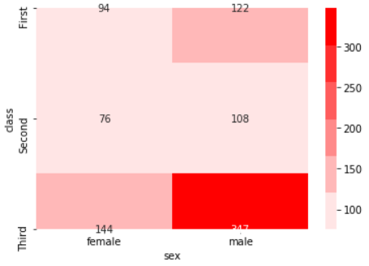

```python
sns.heatmap(titanic_size, annot=True, fmt="d", cmap=sns.light_palette("blue"))
```

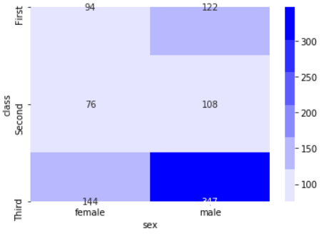

## 2차원 데이터 실수, 카테고리가 섞임

```python
sns.barplot(x="day",  y="total_bill", data=tips)
```


```python
sns.boxplot(x="day",  y="total_bill", data=tips)
```


```python
sns.violinplot(x="day",  y="total_bill", data=tips)
```

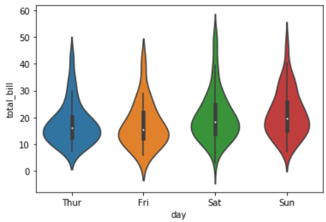

### stripplot

```python
sns.stripplot(x="day",  y="total_bill", data=tips)
```

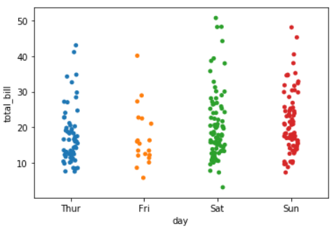

```python
sns.stripplot(x="day",  y="total_bill", data=tips, 
              jitter=False)
```

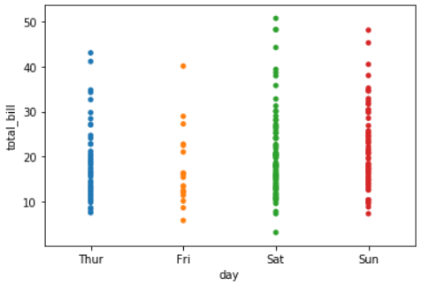

```python
sns.stripplot(x="day",  y="total_bill", data=tips, 
              jitter=True)
```

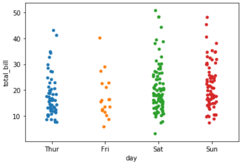

----

```python
# 하나도 겹치지 않고 출력하기 위해서 사용하는 plot
sns.swarmplot(x="day",  y="total_bill", data=tips)
```

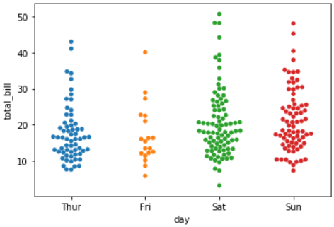

```python
# 요일별, 성별 전체 팁의 히스토그램
# (barplot)
# x : Thur, Fri, Sat, Sun
# y : total_bill
sns.barplot(x="day", y="total_bill", data=tips, hue="sex")
```

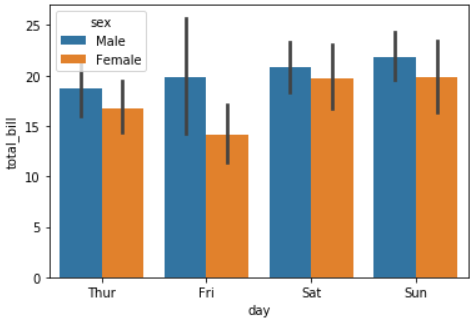

```python
sns.stripplot(x="day", y="total_bill", data=tips, hue="sex")
```

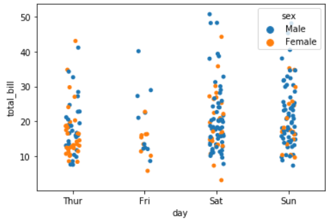

```python
sns.stripplot(x="day", y="total_bill", data=tips, hue="sex")
plt.legend(loc=2)
```


# flights

```python
flights = sns.load_dataset("flights")
flights.head()
```


```python
flights.pivot("month", "year", "passengers")
```


```python
fp = flights.pivot("month", "year", "passengers")
sns.heatmap(fp)
```


```python
sns.heatmap(fp, linewidths=1, annot=True, fmt="d")
```


- 숫자를 다 입력하기 위해서는 set_inches를 사용하여  fig사이즈를 설정해야 한다.

# pandas를 이용한 시각화

```python
import pandas as pd
import numpy as np

df = pd.DataFrame(
    np.random.randn(100, 3),
    index=pd.date_range('1/28/2020', periods=100),
    columns=['A','B','C'])
df
```


```python
df = pd.DataFrame(
    np.random.randn(100, 3),
    index=pd.date_range('1/28/2020', periods=100),
    columns=['A','B','C']).cumsum()
df
```


```python
df.plot()
```


```python
iris.sepal_length[:20].plot()
```


```python
iris.sepal_length[:20].plot(kind="bar")
```


```python
iris.sepal_length[:20].plot(kind="bar", rot=0)
```


```python
iris.sepal_length[:20].plot(kind="bar", rot=180)
```


```python
iris.sepal_length[:20].plot.bar(rot=0)
```


```python
df2 = iris.groupby("species").mean()
# df2 = iris.groupby(iris.species).mean()
df2
```


```python
df2.plot.bar(rot=0)
```


```python
df = titanic.pclass.value_counts()
df
# > 3    491
# > 1    216
# > 2    184
# > Name: pclass, dtype: int64

df.plot.pie()
```


```python
df.plot.pie(autopct="%.2f%%")
```


```python
iris.plot.hist() # 빈도수 bar 그래프
```


```python
iris.plot.kde()
```


# 선형대수

- 넘파이 사용
- 데이터 개수, 형태에 따라서
  - 스칼라(숫자 1개)
  - 벡터(숫자 여러개)
  - 행렬(벡터가 여러개인 데이터 집합)
  - 텐서(같은 크기의 행렬이 여러개 있는 구조)

```python
from sklearn.datasets import load_iris
iris = load_iris()
iris
# > {'data': array([[5.1, 3.5, 1.4, 0.2],
# >         [4.9, 3. , 1.4, 0.2],
# >  ...
# >         [6.2, 3.4, 5.4, 2.3],
# >         [5.9, 3. , 5.1, 1.8]]),
# >   'target': array([0, 0, 0, 0, 0, 0, 0, 0, 0, 0, 0, 0, 0, 0, 0, 0, 0, 0, 0, 0, 0, 0,
# > ...
# >  'filename': 'C:\\Users\\student\\Anaconda3\\lib\\site-packages\\sklearn\\datasets\\data\\iris.csv'}

iris.data
# > array([[5.1, 3.5, 1.4, 0.2],
# >        [4.9, 3. , 1.4, 0.2],
# >        [4.7, 3.2, 1.3, 0.2],
# > ...
# >        [6.2, 3.4, 5.4, 2.3],
# >        [5.9, 3. , 5.1, 1.8]])

iris.data[0, :]
# > array([5.1, 3.5, 1.4, 0.2])
```

- 넘파이 : 선형대수 문제 해결 사용

```python
x1 = np.array([[5.1], [3.1], [1.4], [0.2]])
x1 # 4차원 벡터 <= 2차원 배열
# > array([[5.1],
# >        [3.1],
# >        [1.4],
# >        [0.2]])

np.array([5.1, 3.1, 1.4, 0.2]) # 열벡터 <= 1차원 배열
# > array([5.1, 3.1, 1.4, 0.2])
```

## digit data

```python
from sklearn.datasets import load_digits

digits = load_digits()
digits
```


```python
samples = [0,10,20,30,1,11,21,31]
# *0 : 0의 이미지, *1 : 1의 이미지

d = []
for i in range(8) :
    d.append(digits.images[samples[i]])
    
plt.figure(figsize=(8,2))
for i in range(8):
    plt.subplot(1,8,i+1)
    plt.imshow(d[i])
```


```python
plt.figure(figsize=(8,2))
for i in range(8):
    plt.subplot(1,8,i+1)
    plt.imshow(d[i], cmap=plt.cm.bone_r)
```


```python
plt.figure(figsize=(8,2))
for i in range(8):
    plt.subplot(1,8,i+1)
    plt.imshow(d[i], cmap=plt.cm.bone_r)
    plt.title("image{}".format(i+1))
```


```python
plt.figure(figsize=(8,2))
for i in range(8):
    plt.subplot(1,8,i+1)
    plt.imshow(d[i], cmap=plt.cm.bone_r)
    plt.title("image{}".format(i+1))
    plt.grid(False)
```


```python
plt.figure(figsize=(8,2))
for i in range(8):
    plt.subplot(1,8,i+1)
    plt.imshow(d[i], cmap=plt.cm.bone_r)
    plt.title("image{}".format(i+1))
    plt.grid(False)
    plt.xticks([]);    plt.yticks([])
```


```python
# 2차원 이미지 => 64차원 데이터 => 1차원 벡터
v = []
for i in range(8) :
    v.append(d[i].reshape(64,1))

plt.figure(figsize=(8,2))
for i in range(8):
    plt.subplot(1,8,i+1)
    plt.imshow(v[i], cmap=plt.cm.bone_r)
    plt.title("vector{}".format(i+1))
    plt.grid(False)
    plt.xticks([]);    plt.yticks([])
```


```python
# 행렬
a = np.array([[10, 20, 30], [40, 50 ,60]])
a
# > array([[10, 20, 30],
# >        [40, 50, 60]])
```

## 텐서

- 텐서 : 같은 크기의 행렬이 여러 개 묶여 있는 것
- 다차원 배열

```python
from scipy import misc
img = misc.face()
img.shape # 768*1024행렬이 3개 있는 데이터
# 768*1024*3 크기를 갖는 3차원 텐서
# > (768, 1024, 3)
```

```python
plt.subplot(221) # 2*2로 나눔, 1번째 위치 출력
plt.imshow(img, cmap=plt.cm.gray)
```


```python
plt.subplot(221)
plt.imshow(img, cmap=plt.cm.gray)
plt.axis("off")
```


```python
plt.subplot(221)
plt.imshow(img, cmap=plt.cm.gray)
plt.axis("off")

plt.subplot(222)
plt.imshow(img[:,:,0], cmap=plt.cm.gray) # r 채널 출력
plt.axis("off")
```


```python
plt.subplot(221)
plt.imshow(img, cmap=plt.cm.gray)
plt.axis("off")

plt.subplot(222)
plt.imshow(img[:,:,0], cmap=plt.cm.gray) # r 채널 출력
plt.axis("off")

plt.subplot(223)
plt.imshow(img[:,:,1], cmap=plt.cm.gray) # g 채널 출력
plt.axis("off")

plt.subplot(224)
plt.imshow(img[:,:,2], cmap=plt.cm.gray) # b 채널 출력
plt.axis("off")
```


## 요소간 연산

- 요소간 연산 : 두 벡터와 행렬에서 같은 위치에 있는 요소끼리 덧셈/뺄셈 수행

```python
x = np.array([1,2])
y = np.array([3,4])
x+y
# > array([4, 6])

x-y
# > array([-2, -2])
```

- 스칼라와 벡터/행렬간 곱셈

```python
x = np.array([1,2])

3*x
# > array([3, 6])

x = np.array([[1,2], [3,4]])
x
# > array([[1, 2],
# >        [3, 4]])

3*x
# > array([[ 3,  6],
# >        [ 9, 12]])
```

- 선형 조합 : 벡터/행렬에 스칼라 값을 곱한 후 더하거나 뺀 것을 벡터/행렬의 선형조합이라고 함.

```python
x = np.array([1,2])
3*x-1
# > array([2, 5])

x = np.array([[1,2], [3,4]])
3*x-1
# > array([[ 2,  5],
# >        [ 8, 11]])
```


## 내적

- 내적 : 두 벡터의 곱셈(dot)
- 두 벡터의 차원이 같아야 함
- 행벡터 * 열벡터
- 내적 결과는 스칼라

```python
x = np.array([[1,2,3]]).T
x
# > array([[1],
# >        [2],
# >        [3]])

y = np.array([[4,5,6]]).T
y
# > array([[4],
# >        [5],
# >        [6]])

np.dot(x, y)
```


```python
np.dot(x.T, y)
# > array([[32]])

x.T@y
# > array([[32]])
```

- 데이터벡터, 가중치벡터 => 데이터벡터의 가중치 합
- 벡터의 내적은 두 벡터의 유사도를 계산하는데 사용됨
- 유사도 : 두 벡터가 닮은 정도(값이 클 수록 닮음)
- 코사인유사도 : 두 벡터 사이의 각도 또한 고려한 유사도

```python
digits = load_digits()
d1 = digits.images[0]
d1
# > array([[ 0.,  0.,  5., 13.,  9.,  1.,  0.,  0.],
# >        [ 0.,  0., 13., 15., 10., 15.,  5.,  0.],
# >        [ 0.,  3., 15.,  2.,  0., 11.,  8.,  0.],
# >        [ 0.,  4., 12.,  0.,  0.,  8.,  8.,  0.],
# >        [ 0.,  5.,  8.,  0.,  0.,  9.,  8.,  0.],
# >        [ 0.,  4., 11.,  0.,  1., 12.,  7.,  0.],
# >        [ 0.,  2., 14.,  5., 10., 12.,  0.,  0.],
# >        [ 0.,  0.,  6., 13., 10.,  0.,  0.,  0.]])

d2 = digits.images[10]
d3 = digits.images[1]
d4 = digits.images[11]

v1 = d1.reshape(64,1)
v2 = d2.reshape(64,1)
v3 = d3.reshape(64,1)
v4 = d4.reshape(64,1)

plt.figure(figsize=(9,9)) # 1당 72pix

import matplotlib.gridspec as gridspec

gs = gridspec.GridSpec(1,8, height_ratios=[1],#동일한높이 지정
                       width_ratios=[9,1,9,1,9,1, 9,1])

for i in range(4) :
    plt.subplot(gs[2*i])
    plt.imshow(eval("d"+str(i+1)), cmap=plt.cm.bone_r)
```


```python
for i in range(4) :
    plt.subplot(gs[2*i])
    plt.imshow(eval("d"+str(i+1)), cmap=plt.cm.bone_r)
    plt.subplot(gs[2*i+1])
    plt.imshow(eval("v"+str(i+1)), cmap=plt.cm.bone_r)
```


- v1과 v2 내적

```python
v1.T@v2
# > array([[3064.]])

(v1.T@v2)[0]
# > array([3064.])

(v1.T@v2)[0][0] # v1와 v2 벡터간 내적
# > 3064.0

(v1.T@v3)[0][0] # v1와 v3 벡터간 내적
# > 1866.0

(v1.T@v4)[0][0] # v1와 v4 벡터간 내적
# > 1883.0
```

- 단순히 v1과 v2의 내적이 가장 크므로 유사도가 높게 나타났다고 할 수 있고, v1과 v2이 가장 비슷하다고 할 수 있다.

- v2, v3, v4 내적

```python
np.dot(v2.T, v3)[0][0]
# > 2421.0

np.dot(v2.T, v4)[0][0]
# > 2479.0

np.dot(v3.T, v4)[0][0]
# > 3661.0
```

- v3와 v4의 내적 값이 가장 크므로 가장 유사하다고 볼 수 있다.

# 연습문제

## 1.

- A, B, C 세 회사의 주식은 각각 100만원, 80만원, 50만원이다. 이 주식을 각각 3주, 4주, 5주를 매수할 때 필요한 금액을 구하고자 한다.
- (1) 주식의 가격과 수량을 각각  p  벡터,  n  벡터로 표시하고 넘파이로 코딩한다.
- (2) 주식을 매수할 때 필요한 금액을 곱셈으로 표시하고 넘파이 연산으로 그 값을 계산한다.

### A.

```python
# 1.
# (1)
p = np.array([[100, 80, 50]]).T
p
# > array([[100],
# >        [ 80],
# >        [ 50]])

n = np.array([[3,4,5]]).T
n
# > array([[3],
# >        [4],
# >        [5]])

# (2)
np.dot(p.T, n)[0][0]
# > 870
```

## 2.

- 다음 코드를 실행하면 MNIST 숫자 이미지 전체 데이터를 모두 벡터로 변환하여 하나의 넘파이 행렬 X를 만든다. 이 행렬을 이용하여 다음 문제를 풀어라.
```python
from sklearn.datasets import load_digits
X = load_digits().data
```
- (1) 내적을 이용하여 첫 번째 이미지와 10번째 이미지의 유사도를 구하라.
-   (2) 내적을 이용하여 모든 이미지의 조합에 대해 유사도를 구하라.

### A.

```python
# 2.
from sklearn.datasets import load_digits
X = load_digits().data
# (1)
X[1].T@X[10]
# > 2421.0

# (2)
similar = np.zeros((len(X), len(X)))
for i in range(len(X)) :
    for j in range(i, len(X)) :
        if i == j :
            similar[i,i] = X[i].T@X[i]
        else :
            similar[i,j] = X[i].T@X[j]
            similar[j,i] = X[i].T@X[j]
similar
# > array([[3070., 1866., 2264., ..., 2812., 3006., 2898.],
# >        [1866., 4209., 3432., ..., 3906., 3083., 3307.],
# >        [2264., 3432., 4388., ..., 4005., 3063., 3697.],
# >        ...,
# >        [2812., 3906., 4005., ..., 5092., 3729., 4598.],
# >        [3006., 3083., 3063., ..., 3729., 4316., 3850.],
# >        [2898., 3307., 3697., ..., 4598., 3850., 4938.]])
```

## 3.

- JSON 형태의 문자열 입력을 파싱해서 유효한 형태인지 출력합니다단 지원하는 json decoding 함수나 라이브러리는 사용하지 않습니다.
- Sample Input
  - {"level":3, "attr":{"power":120, "name":"hero"}, "friendIds":[12, 23, 34, 23]}
  - [12, 23, 34, "23"]
  - {"level":3, "attr":{"power":120, "name":"hero"}, "friendIds":[12, 23, 34, 23}
  - ["level":3, 23, 34, "23"]
- Sample Output
  - Valid JSON
  - Valid JSON
  - Parse error!
  - Parse error!

```python
# 3
form = input()

try : 
    eval(form)
    print("Valid JSON")
except :
    print("Parse error!")
# > {"level":3, "attr":{"power":120, "name":"hero"}, "friendIds":[12, 23, 34, 23]}
# > Valid JSON

# > [12, 23, 34, "23"]
# > Valid JSON

# > {"level":3, "attr":{"power":120, "name":"hero"}, "friendIds":[12, 23, 34, 23}
# > Parse error!
  
# > ["level":3, 23, 34, "23"]
# > Parse error!
```

```python
# 3

def json(string) :
    middle_start = 0
    middle_end = 0
    large_start = 0
    large_end = 0
    
    for s in string :
        if s == "{" :
            middle_start += 1
        elif s == "}" :
            middle_end += 1
        elif s == "[" :
            large_start += 1
        elif s == "]" :
            large_end += 1
        elif (large_start != large_end) and (s == ":") :
            break
    if (middle_start == middle_end) and (large_start == large_end) :
        print("Valid JSON")
    else :
        print("Parse error!")
        
string = '{"level":3, "attr":{"power":120, "name":"hero"}, "friendIds":[12, 23, 34, 23]}'
json(string)
# > Valid JSON

string = '[12, 23, 34, "23"]'
json(string)
# > Valid JSON

string = '{"level":3, "attr":{"power":120, "name":"hero"}, "friendIds":[12, 23, 34, 23}'
json(string)
# > Parse error!

string = '["level":3, 23, 34, "23"]'
json(string)
# > Parse error!
```

