[toc]

# Day28 딥러닝을 위한 빅데이터 기초 - 데이터 분석를 위한 NumPy, Pandas (13)

## 앞으로의 대략적인 일정

- ~ 2.1 numpy, pandas
- 2.3 ~ 2.14 R프로그램밍 & 머신러닝 & 자연어처리(최근 논문, 경향까지)
  - 머신러닝 : 트리, knn, kmeans, 클러스터링, ...
    - 스팸메일 분류기, 클러스터링, 결측값 대체
  - 자연어 처리 : 형태소분석, 토픽모델링
- 2.17 ~ 2.21(발표일) 1차 프로젝트
- 2.24 ~ 2.28 azure 머신러닝
- 3.2 ~ 3.13 파이썬 머신러닝
  - 분류기(암), 타이타닉/자전거, 집값예측, 전기요금예측, ...
- 3.16 ~ 3.27 텐서플로 & 딥러닝
  - 주식예측, 숫자인식, 날씨예측, ...
- 3.30 ~ 4.3 CNN(DNN(DeepNeuralNetwork) 종류 중 하나)
  - 이미지 분류, 텐서플로, keras 사용
- 4.6 ~ 4.17 RNN & LSTM & 자연어처리
  - 시계열 데이터 분석
  - 베이즈, 토픽모델링, 자연어 이해, 생성
  - 품사 태깅, ..., 영화 줄거리 -> 추천
- 4.20 ~ 4.24 챗봇 만들기
- 4.27 ~ 5.8 GAN 및 강화학습
  - 유사 이미지 생성, 자율주행차 시뮬레이터
- 5.11 ~ 5.21(발표일) 2차 프로젝트
  - 데이터 분석 기반 

# 자료형 처리

```python
import pandas as pd
import seaborn as sns

tips = sns.load_dataset("tips")
tips.info()
# > <class 'pandas.core.frame.DataFrame'>
# > RangeIndex: 244 entries, 0 to 243
# > Data columns (total 7 columns):
# > total_bill    244 non-null float64
# > tip           244 non-null float64
# > sex           244 non-null category
# > smoker        244 non-null category
# > day           244 non-null category
# > time          244 non-null category
# > size          244 non-null int64
# > dtypes: category(4), float64(2), int64(1)
# > memory usage: 7.3 KB

tips['sex_str'] = tips['sex'].astype(str)
tips.dtypes
# > total_bill     float64
# > tip            float64
# > sex           category
# > smoker        category
# > day           category
# > time          category
# > size             int64
# > sex_str         object
# > dtype: object

tsm = tips.head(10)
tsm
```


```python
tsm.loc[[1,3,5,7], "total_bill"] = "missing"
tsm
```

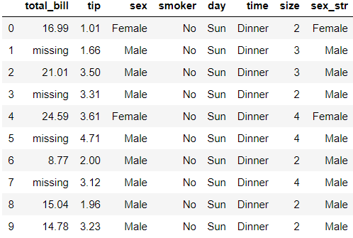

```python
tsm.dtypes
# > total_bill      object
# > tip            float64
# > sex           category
# > smoker        category
# > day           category
# > time          category
# > size             int64
# > sex_str         object
# > dtype: object
```
- total_bill을 수치형으로 다시 변환하기
```python
tsm['total_bill'].astype(float)
```

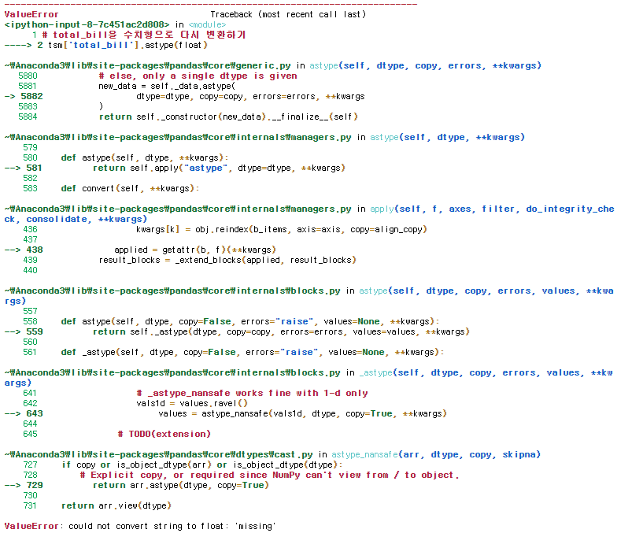

```python
pd.to_numeric(tsm['total_bill'])
```

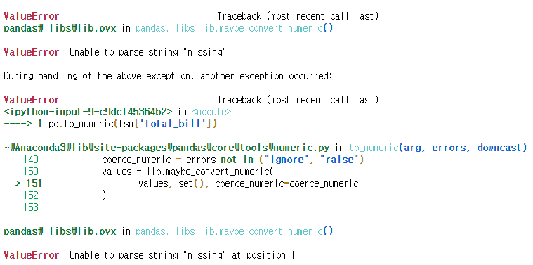

- 'reise' = error 옵션의 default, 숫자로 변환할 수 없는 값이 있으면 에러 발생

```python
tsm['total_bill'] = pd.to_numeric(tsm['total_bill'], 
                                  errors='raise')
```

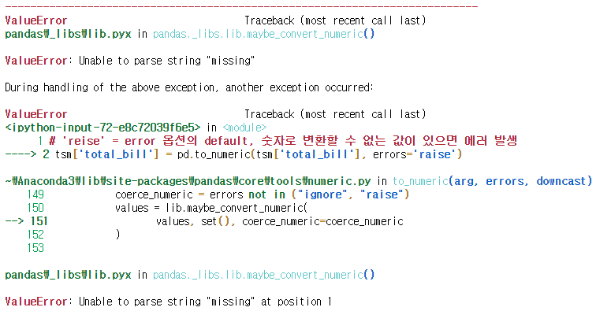

- 'ignore' = error는 무시하고 실행하는 옵션

```python
tsm['total_bill'] = pd.to_numeric(tsm['total_bill'], 
                                  errors='ignore')
tsm.dtypes
# > total_bill      object
# > tip            float64
# > sex           category
# > smoker        category
# > day           category
# > time          category
# > size             int64
# > sex_str         object
# > dtype: object
```

- 'coerce' = 숫자로 변환할 수 없는 값은 누락값(NaN)으로 처리하는 옵션

```python
tsm['total_bill'] = pd.to_numeric(tsm['total_bill'], 
                                  errors='coerce')
tsm.dtypes
# > total_bill     float64
# > tip            float64
# > sex           category
# > smoker        category
# > day           category
# > time          category
# > size             int64
# > sex_str         object
# > dtype: object

tsm
```

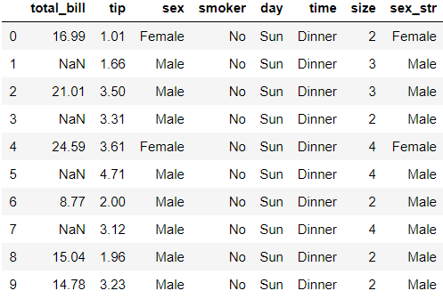

- string 보다 category형의 자료 처리가 더 빠르고, 용량도 더 작으므로,
-  category 바꿀 수 있는 경우에는 바꾸는 것이 좋다.
- 극단적인 예로, object가 1byte를 사용한다면, category는 1bit만 사용한다.

```python
tips['sex'] = tips['sex'].astype("str") # 10.7+ KB
tips.info()
# > <class 'pandas.core.frame.DataFrame'>
# > RangeIndex: 244 entries, 0 to 243
# > Data columns (total 8 columns):
# > total_bill    244 non-null float64
# > tip           244 non-null float64
# > sex           244 non-null object
# > smoker        244 non-null category
# > day           244 non-null category
# > time          244 non-null category
# > size          244 non-null int64
# > sex_str       244 non-null object
# > dtypes: category(3), float64(2), int64(1), object(2)
# > memory usage: 10.7+ KB

tips['sex'] = tips['sex'].astype("category") # 9.2+ KB
tips.info()
# > <class 'pandas.core.frame.DataFrame'>
# > RangeIndex: 244 entries, 0 to 243
# > Data columns (total 8 columns):
# > total_bill    244 non-null float64
# > tip           244 non-null float64
# > sex           244 non-null category
# > smoker        244 non-null category
# > day           244 non-null category
# > time          244 non-null category
# > size          244 non-null int64
# > sex_str       244 non-null object
# > dtypes: category(4), float64(2), int64(1), object(1)
# > memory usage: 9.2+ KB
```

## 문자열 관련 함수

```python
word = 'hello'
sent = 'world'
sent[-1]
# > 'd'

sent[0:3]
# > 'wor'

sent[2:-1]
# > 'rl'

word[::2] # 0,2,4번 index의 단어가 추출
# > 'hlo'
```

- capitalize() : 첫글자를 대문자, 나머지는 소문자로 만드는 함수

```python
"Hello World".capitalize()
# > 'Hello world'
```

- count() : 해당하는 문자의 갯수를 세는 함수

```python
"Hello World".count('o')
# > 2
```

- startswith() : ()로 시작하는지 확인하는 함수

```python
"Hello World".startswith("Hi")
# > False

"Hello World".startswith("Hello")
# > True
```

- endswith() : ()로 끝나는지 확인하는 함수

```python
"Hello World".endswith("World")
# > True
```

- index(), find() : ()의 위치 리턴
  - find와 index는 찾았을 때는 동일한 결과를 return 하지만, 못찾은 경우에는 서로 다른 결과를 출력한다.

```python
"Hello World".find('l')
# > 2

"Hello World".index('l')
# > 2

"Hello World".find('z')
# > -1

"Hello World".index('z')
```

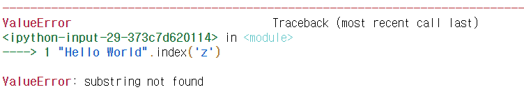

- isalpha() : 알파벳으로만 구성되어 있는지 확인하는 함수

```python
"Hello World".isalpha()
# > False

"HelloWorld".isalpha()
# > True
```

- isdecimal() : 십진 정수인지 확인하는 함수

```python
"130".isdecimal()
# > True

"I'm 25".isdecimal()
# > False
```

- lower() : 문자열에 있는 알파벳을 모두 소문자로 변경
- upper() : 문자열에 있는 알파벳을 모두 대문자로 변경

```python
"Hello World".lower()

# > 'hello world'

"Hello World".upper()
# > 'HELLO WORLD'
```

- replace() : 특정 문자 변경

```python
"Hello World".replace("Hello", "Hi")
# > 'Hi World'
```

- strip() : 양쪽에 있는 공백 제거

```python
"  Hello World  ".strip()
# > 'Hello World'
```

- split() : 문자열 분리

```python
"Hi Hi Hi".split(sep=' ')
# > ['Hi', 'Hi', 'Hi']
```

- join() : 문자열 연결

```python
d1 = '40'
d2 = '50'
d3 = '60'
d4 = 'Number'
" ".join([d1, d2, d3, d4])
# > '40 50 60 Number'
```

- splitlines() : 여러 줄로 구성된 문자열을 분리

```python
mystr = """
A:Hello
B:Hi
A:How are you?
B:Fine
"""
mystr
# > '\nA:Hello\nB:Hi\nA:How are you?\nB:Fine\n'

msr = mystr.splitlines()
msr
# > ['', 'A:Hello', 'B:Hi', 'A:How are you?', 'B:Fine']
```

- formating

```python
a = 'hi'
s = 'hello {}'
s.format(a)
# > 'hello hi'

myhome = "location : {lat}, {lon}"
myhome.format(lat="36", lon="125")
# > 'location : 36, 125'

s = "%d digits of pi" % 3
s
# > '3 digits of pi'

print("some digits of %(co)s: %(val).2f" % {"co":'e', 
                                            "val":2.718})
# > some digits of e: 2.72
```

# apply 메서드

```python
df = pd.DataFrame({"a" : [1,2,3], "b" : [2,3,4]})
df
```

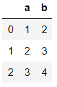

```python
def my_sq(x) :
    return x**2
def my_exp(x, n) :
    return x**n

df['a']
# > 0    1
# > 1    2
# > 2    3
# > Name: a, dtype: int64

df['a']**2
# > 0    1
# > 1    4
# > 2    9
# > Name: a, dtype: int64

df['a'].apply(my_sq)
# > 0    1
# > 1    4
# > 2    9
# > Name: a, dtype: int64

df['a'].apply(my_exp)
```

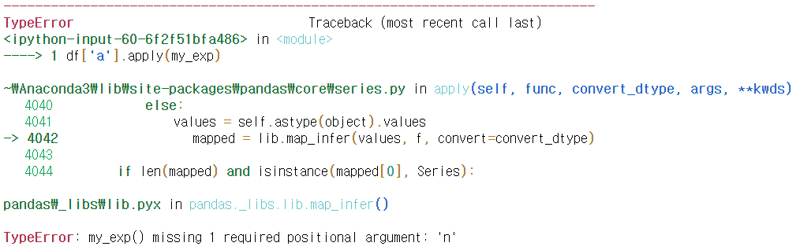

```python
df['a'].apply(my_exp, n=3)
# > 0     1
# > 1     8
# > 2    27
# > Name: a, dtype: int64
```

```python
def print_me(x):
    print(x)

print(df.apply(print_me))
# > 0    1
# > 1    2
# > 2    3
# > Name: a, dtype: int64
# > 0    2
# > 1    3
# > 2    4
# > Name: b, dtype: int64
# > a    None
# > b    None
# > dtype: object

print(df.apply(print_me, axis=0)) # axis=0 default
# > 0    1
# > 1    2
# > 2    3
# > Name: a, dtype: int64
# > 0    2
# > 1    3
# > 2    4
# > Name: b, dtype: int64
# > a    None
# > b    None
# > dtype: object

print(df.apply(print_me, axis=1))
# > a    1
# > b    2
# > Name: 0, dtype: int64
# > a    2
# > b    3
# > Name: 1, dtype: int64
# > a    3
# > b    4
# > Name: 2, dtype: int64
# > 0    None
# > 1    None
# > 2    None
# > dtype: object
```

```python
def myavg(x,y,z) :
    return (x+y+z)/3

df.apply(myavg)
```


```python
def myavg_apply(data) :
    x = data[0]
    y = data[1]
    z = data[2]
    print(x)

df.apply(myavg_apply)
# > 1
# > 2
# > a    None
# > b    None
# > dtype: object
```

```python
def myavg_apply(data) :
    x = data[0]
    y = data[1]
    z = data[2]
    return (x+y+z)/3

df.apply(myavg_apply)
# > a    2.0
# > b    3.0
# > dtype: float64
```

- 일반화

```python
def myavg_apply2(data) :
    s = 0
    for item in data :
        s += item
    return s/df.shape[0]

df.apply(myavg_apply2)
# > a    2.0
# > b    3.0
# > dtype: float64
```

```python
def myavg_apply2(data) :
    s = 0
    for item in data :
        s += item
    return s/df.shape[1]

df.apply(myavg_apply2, axis=1)
# > 0    1.5
# > 1    2.5
# > 2    3.5
# > dtype: float64
```

```python
titanic = sns.load_dataset('titanic')
titanic.info()
# > <class 'pandas.core.frame.DataFrame'>
# > RangeIndex: 891 entries, 0 to 890
# > Data columns (total 15 columns):
# > survived       891 non-null int64
# > pclass         891 non-null int64
# > sex            891 non-null object
# > age            714 non-null float64
# > sibsp          891 non-null int64
# > parch          891 non-null int64
# > fare           891 non-null float64
# > embarked       889 non-null object
# > class          891 non-null category
# > who            891 non-null object
# > adult_male     891 non-null bool
# > deck           203 non-null category
# > embark_town    889 non-null object
# > alive          891 non-null object
# > alone          891 non-null bool
# > dtypes: bool(2), category(2), float64(2), int64(4), object(5)
# > memory usage: 80.6+ KB
```

```python
def count_missing(data):
    # 누락값의 개수 리턴
    c = data.isnull().sum()
    return c

cm = titanic.apply(count_missing)
print(cm)
# 각 컬럼별 누락값의 개수가 모두 출력
# > survived         0
# > pclass           0
# > sex              0
# > age            177
# > sibsp            0
# > parch            0
# > fare             0
# > embarked         2
# > class            0
# > who              0
# > adult_male       0
# > deck           688
# > embark_town      2
# > alive            0
# > alone            0
# > dtype: int64
```

```python
def prob_missing(data):
    # 누락값의 비율 리턴
    num = data.size
    miss = count_missing(data)
    return miss/num

pm = titanic.apply(prob_missing)
print(pm)
# 각 컬럼별 누락값의 비율이 모두 출력
# > survived       0.000000
# > pclass         0.000000
# > sex            0.000000
# > age            0.198653
# > sibsp          0.000000
# > parch          0.000000
# > fare           0.000000
# > embarked       0.002245
# > class          0.000000
# > who            0.000000
# > adult_male     0.000000
# > deck           0.772166
# > embark_town    0.002245
# > alive          0.000000
# > alone          0.000000
# > dtype: float64
```

```python
def prop_complete(data) :
    return 1-prob_missing(data)

pcm = titanic.apply(prop_complete)
print(pcm)
# 각 컬럼별 누락값이 아닌 값의 비율이 모두 출력
# > survived       1.000000
# > pclass         1.000000
# > sex            1.000000
# > age            0.801347
# > sibsp          1.000000
# > parch          1.000000
# > fare           1.000000
# > embarked       0.997755
# > class          1.000000
# > who            1.000000
# > adult_male     1.000000
# > deck           0.227834
# > embark_town    0.997755
# > alive          1.000000
# > alone          1.000000
# > dtype: float64
```

```python
# 행 방향으로 누락값의 개수/비율 조사
titanic.apply(count_missing, axis=1)
# > 0      1
# > 1      0
# > 2      1
# > 3      0
# > 4      1
# >       ..
# > 886    1
# > 887    0
# > 888    2
# > 889    0
# > 890    1
# > Length: 891, dtype: int64

cmr = titanic.apply(count_missing, axis=1)
pmr = titanic.apply(prob_missing, axis=1)
pcmr = titanic.apply(prop_complete, axis=1)

cmr.head()
# > 0    1
# > 1    0
# > 2    1
# > 3    0
# > 4    1
# > dtype: int64

pmr.head()
# > 0    0.066667
# > 1    0.000000
# > 2    0.066667
# > 3    0.000000
# > 4    0.066667
# > dtype: float64

pcmr.head()
# > 0    0.933333
# > 1    1.000000
# > 2    0.933333
# > 3    1.000000
# > 4    0.933333
# > dtype: float64
```

```python
titanic['num_missing'] = titanic.apply(count_missing, 
                                       axis=1)
titanic.head()
```

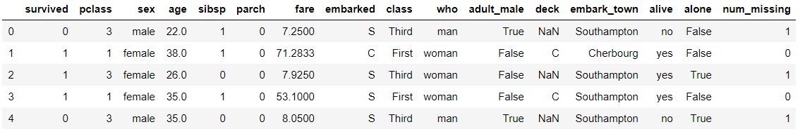

- num_missing 값이 1보다 큰 행을 추출

```python
titanic[titanic.num_missing > 1]
```

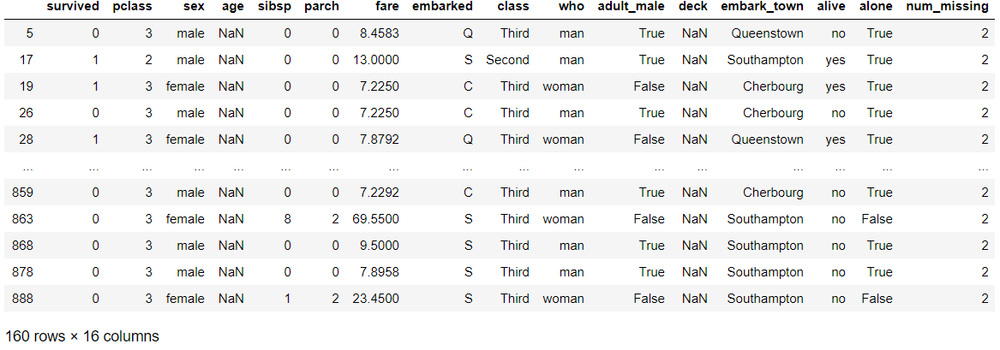

```python
titanic[titanic.num_missing > 1].sample(10) # 10개 임의 추출
```

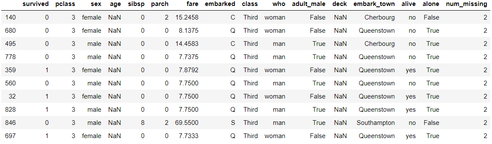


# 신생아의 이름 통계 데이터 분석 (미국, 1880~2010)

```python
names2010 = pd.read_csv('../names/names/yob2010.txt', 
                        header=None)
names2010
```

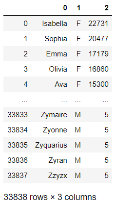

```python
names2010 = pd.read_csv('../names/names/yob2010.txt', 
                        names = ['name', 'sex', 'births'])
names2010
```

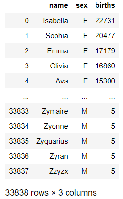

```python
names2010.shape
# > (33838, 3)

names2010.info()
# > <class 'pandas.core.frame.DataFrame'>
# > RangeIndex: 33838 entries, 0 to 33837
# > Data columns (total 3 columns):
# > name      33838 non-null object
# > sex       33838 non-null object
# > births    33838 non-null int64
# > dtypes: int64(1), object(2)
# > memory usage: 793.2+ KB
```

- 성별을 기준으로 births의 합계 출력

```python
names2010.groupby('sex').sum()
```

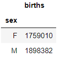

```python
names2010.groupby('sex').births.sum()
# > sex
# > F    1759010
# > M    1898382
# > Name: births, dtype: int64
```

## 다른 파일에 있는 데이터 한 곳에 모으기

- 데이터를 리스트의 요소로 불러내기
- [1880df, 1881df, ..., 2010df]

```python
pieces = []
for year in range(1880, 2011) :
    path = "../names/names/yob%d.txt" % year
    df = pd.read_csv(path, names=['name', 'sex', 'births'])
    df['year'] = year
    pieces.append(df)
print(pieces)
```

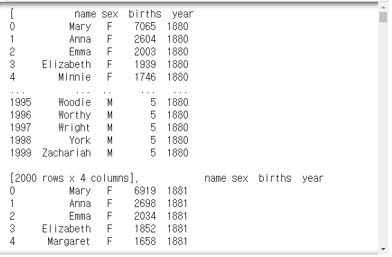

```python
pd.concat(pieces)
```

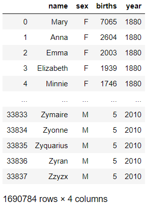

```python
pd.concat(pieces, ignore_index=True)
```

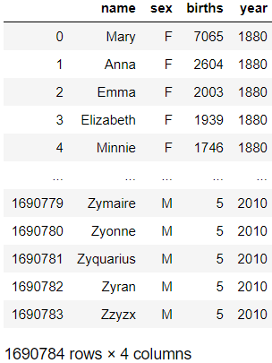

```python
names = pd.concat(pieces, ignore_index=True)
names.head(20)
```

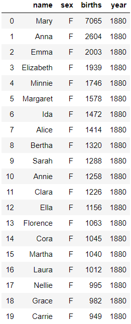

```python
names[:20]
```


## 조건에 맞춰 그룹화

- 피봇테이블 작성
- biths 합계를 데이터, 행을 year, 열을 sex

```python
import numpy as np
names.pivot_table(index=["year"], columns=["sex"], 
                  values=['births'], aggfunc=np.sum)
# pd에도 sum이 존재하므로 'aggfunc=sum'도 가능하다.
```

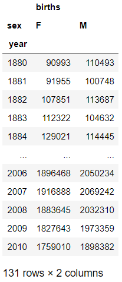

```python
pd.pivot_table(data=names, index=["year"], columns=["sex"], 
               values=['births'], aggfunc=sum)
```

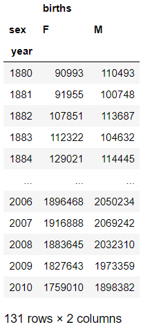

```python
total_births = pd.pivot_table(data=names, index=["year"], 
                              columns=["sex"], 
                              values=['births'], aggfunc=sum)
total_births.tail()
```

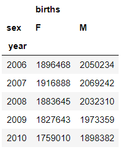

```python
total_births.plot(title="Total births")
```

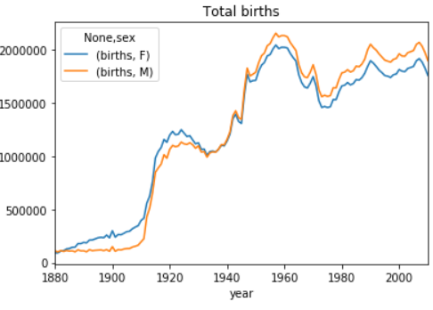

## 조건에 맞춰 열 생성하기

- 해당 연도에서 각 이름의 퍼센트를 나타내는 열 생성하기
  - names에서 year, sex

  - ex) Mary는 1880년에 태어난 여자아이들 중 전체에서 차지하는 비중이 얼마인지 조사?

  - 원하는 출력 결과

    - |      | name | sex  | births | year | prop |
      | ---- | ---- | ---- | ------ | ---- | ---- |
      | 0    | Mary | F    | 10000  | 1880 | 0.08 |
      | 1    | ...  |      |        |      |      |
      | ...  |      |      |        |      |      |

```python
def add_prop(group) : 
    group['prop'] = group['births']/group['births'].sum()
    return group
    
name_group = names.groupby(['year', 'sex']).apply(add_prop)
name_group
```


- prop가 잘 구해졌는지 확인하기
- np.allclose(검사할 값, 비교할 값) : 검사할 값들이 비교할 값들과 거의 같은지 확인하는 함수

```python
name_group.groupby(['year', 'sex']).prop.sum()
# > year  sex
# > 1880  F      1.0
# >       M      1.0
# > ...
# > 2010  F      1.0
# >       M      1.0
# > Name: prop, Length: 262, dtype: float64

np.allclose(name_group.groupby(['year', 'sex']).prop.sum(),
            1)
# > True
```

## 조건에 맞는 열 추출하기

- 각 연도별, 성별에 따른 이름 빈도수가 가장 높은 이름을 1000개씩 추출

```python
def get_top1000(group) :
    return group.sort_index(by="births", 
                            ascending=False)[:1000]

grouped = name_group.groupby(['year', 'sex'])
top1000 = grouped.apply(get_top1000)
top1000
```

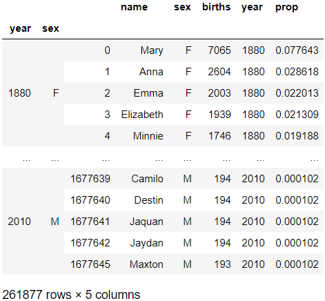

```python
top1000[top1000.sex == 'M']
```

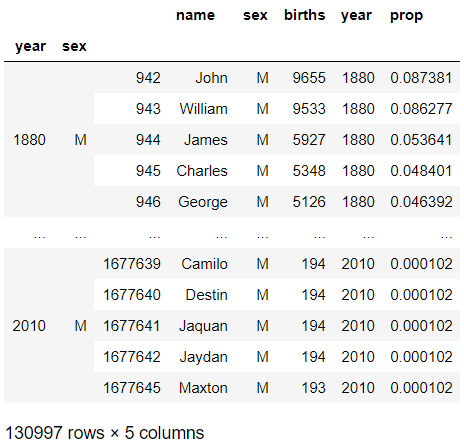

```python
top1000[top1000.sex == 'F']
```

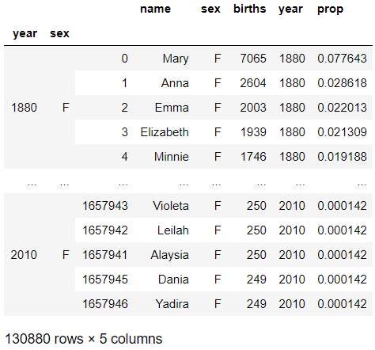

- 그룹 인덱스 제거

```python
top1000.reset_index(inplace=True, drop=True)
top1000
```

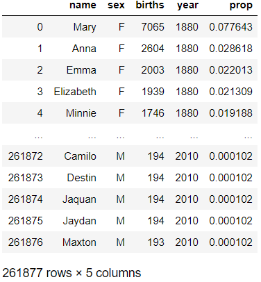

```python
girls = top1000[top1000.sex == 'F']
boys = top1000[top1000.sex == 'M']

total_birth = top1000.pivot_table("births", index="year",
                                  columns="name", 
                                  aggfunc=sum)
total_birth
```

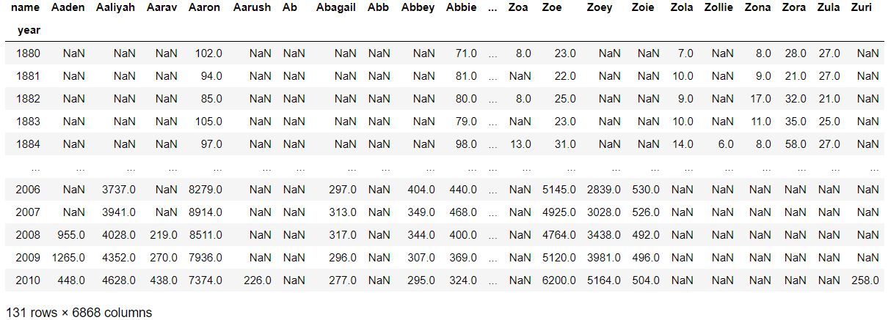

## 조건에 맞는 데이터 찾아 그래프 그리기

```python
df = boys[boys.year == 2010]
df
```


```python
prop_cumsum = df.sort_index(by="prop", ascending=False)
prop_cumsum[:10]
```

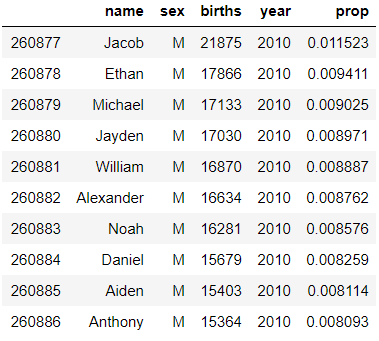

```python
prop_cumsum.values
# > array([['Jacob', 'M', 21875, 2010, 0.011522970613922804],
# >        ['Ethan', 'M', 17866, 2010, 0.009411172250895763],
# >        ['Michael', 'M', 17133, 2010, 0.0090250539670098],
# >        ...,
# >        ['Jaquan', 'M', 194, 2010, 0.00010219228795890395],
# >        ['Jaydan', 'M', 194, 2010, 0.00010219228795890395],
# >        ['Maxton', 'M', 193, 2010, 0.00010166552358798176]], dtype=object)
```

```python
prop_cumsum.prop.cumsum().values.searchsorted(0.5)
# 누적합이 0.5인 지점까지 이름 종류의 개수
# > 116
```

```python
def get_qc(group, q=0.5) :
    group = group.sort_index(by="prop", ascending=False)
    return group.prop.cumsum().values.searchsorted(q)

res = top1000.groupby(['year', 'sex']).apply(get_qc)
res
# > year  sex
# > 1880  F       37
# >       M       13
# > 1881  F       37
# >       M       13
# > 1882  F       37
# >             ... 
# > 2008  M      108
# > 2009  F      240
# >       M      113
# > 2010  F      245
# >       M      116
# > Length: 262, dtype: int64

res = res.unstack('sex')
res
```

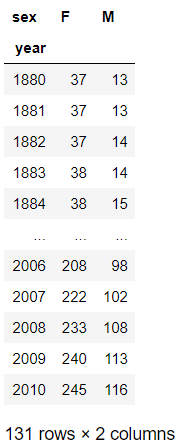

```python
res.plot()
```

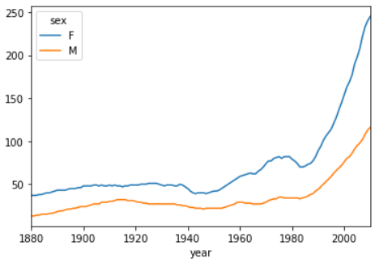


# 연습문제

## 1.

- 1900, 1950, 2010년
- 성별로 구분
- 이름을 구성하는 알파벳 문자 비율 조사
- ex)
  - 1900년 남자아이들 이름
  - john
  - micheal
  - ...
- a:10만건, b:9만건, ... z:3천건
- 1900년 남자아이들 이름에 가장 많이 사용된 알파벳 문자?
- 1950년 남자아이들 이름에 가장 많이 사용된 알파벳 문자?
- 2010년 남자아이들 이름에 가장 많이 사용된 알파벳 문자?
- 1900년 여자아이들 이름에 가장 많이 사용된 알파벳 문자?
- 1950년 여자아이들 이름에 가장 많이 사용된 알파벳 문자?
- 2010년 여자아이들 이름에 가장 많이 사용된 알파벳 문자?

```python
# 1.
# 출생년도 & 성별에 따라 데이터 생성
b00 = names[(names.year==1900) & (names.sex=="M")]
g00 = names[(names.year==1900) & (names.sex=="F")]
b50 = names[(names.year==1950) & (names.sex=="M")]
g50 = names[(names.year==1950) & (names.sex=="F")]
b10 = names[(names.year==2010) & (names.sex=="M")]
g10 = names[(names.year==2010) & (names.sex=="F")]

# 이름을 모두 소문자로 변경
def ch_lower(data) :
    data['name'] = data['name'].lower()
    return data

b00 = b00.apply(ch_lower, axis=1)
g00 = g00.apply(ch_lower, axis=1)
b50 = b50.apply(ch_lower, axis=1)
g50 = g50.apply(ch_lower, axis=1)
b10 = b10.apply(ch_lower, axis=1)
g10 = g10.apply(ch_lower, axis=1)

# 이름에 사용된 알파벳 카운트
def count_al(data) :
    res = [0]*26
    for name in data['name'] :
        for s in str(name) :
            res[ord(s)-ord('a')] += 1
    return res

b00_c = count_al(b00)
g00_c = count_al(g00)
b50_c = count_al(b50)
g50_c = count_al(g50)
b10_c = count_al(b10)
g10_c = count_al(g10)

# 각 년도 & 성별에 따른 최빈값 알파벳 찾기
alphabet = [chr(i) for i in range(ord('a'), ord('z'))]
print("1900년 남자아이들 이름에 가장 많이 사용된 알파벳 : %s" % alphabet[b00_c.index(max(b00_c))])
print("1950년 남자아이들 이름에 가장 많이 사용된 알파벳 : %s" % alphabet[b50_c.index(max(b50_c))])
print("2010년 남자아이들 이름에 가장 많이 사용된 알파벳 : %s" % alphabet[b10_c.index(max(b10_c))])

print("")
print("1900년 여자아이들 이름에 가장 많이 사용된 알파벳 : %s" % alphabet[g00_c.index(max(g00_c))])
print("1950년 여자아이들 이름에 가장 많이 사용된 알파벳 : %s" % alphabet[g50_c.index(max(g50_c))])
print("2010년 여자아이들 이름에 가장 많이 사용된 알파벳 : %s" % alphabet[g10_c.index(max(g10_c))])
# > 1900년 남자아이들 이름에 가장 많이 사용된 알파벳 : e
# > 1950년 남자아이들 이름에 가장 많이 사용된 알파벳 : e
# > 2010년 남자아이들 이름에 가장 많이 사용된 알파벳 : a
# > 
# > 1900년 여자아이들 이름에 가장 많이 사용된 알파벳 : e
# > 1950년 여자아이들 이름에 가장 많이 사용된 알파벳 : e
# > 2010년 여자아이들 이름에 가장 많이 사용된 알파벳 : a

print(b00_c)
print(g00_c)
print(b50_c)
print(g50_c)
print(b10_c)
print(g10_c)
# > [762, 185, 243, 325, 1100, 106, 150, 265, 583, 78, 61, 767, 267, 650, 620, 87, 5, 759, 418, 358, 229, 119, 137, 13, 237, 35]
# > [1947, 186, 338, 431, 2064, 100, 173, 303, 1250, 94, 45, 1308, 398, 969, 583, 101, 7, 877, 425, 631, 235, 235, 43, 17, 233, 87]
# > [2301, 473, 790, 1128, 3021, 281, 403, 633, 1715, 228, 311, 2178, 742, 2169, 1874, 223, 31, 2417, 1017, 963, 557, 350, 291, 33, 716, 93]
# > [5571, 454, 1049, 1395, 5748, 200, 455, 964, 2889, 508, 291, 3419, 981, 3850, 1544, 215, 51, 3044, 1207, 1796, 577, 519, 180, 38, 1062, 142]
# > [12185, 1326, 1893, 3367, 8567, 458, 863, 3076, 6692, 1891, 2460, 4372, 2948, 8334, 4992, 457, 241, 6414, 3798, 3026, 1891, 1339, 525, 317, 3164, 927]
# > [25104, 1450, 2046, 2828, 13132, 348, 1039, 5016, 12244, 1955, 2930, 10070, 4082, 11747, 2916, 512, 116, 6987, 4998, 3126, 1284, 1089, 253, 244, 7572, 1437]
```


## 2.

 - 숫자 패턴 가능여부 판별하기
 - 1 2 3
 - 4 5 6
 - 7 8 9
- 번호가 이웃 할 것
- 지나온 번호를 다시 지나지 못한다.
- 입력 : 12564 /출력 : False
- 1236 / True
- 2846 / False

```python
# 2.
"""
1 -> [2,4,5,6,8]
2 -> [1,3,4,5,6,7,9]
3 -> [2,4,5,6,8]
4 -> [1,2,3,5,7,8,9]
5 -> [1,2,3,4,6,7,8,9]
6 -> [1,2,3,5,7,8,9]
7 -> [2,4,5,6,8]
8 -> [1,3,4,5,6,7,9]
9 -> [2,4,5,6,8]
"""
password = list(map(int, input()))

if len(password) != len(set(password)) :
    print(False)
elif len(password) < 4 :
    print(False)
else :
    for i in range(len(password)) :
        if i == len(password)-1 : 
            print(True)
            break
        if password[i] == 1 :
            if password[i+1] in [2,4,5,6,8] :
                continue
        elif password[i] == 2 :
            if password[i+1] in [1,3,4,5,6,7,9] :
                continue
        elif password[i] == 3 :
            if password[i+1] in [2,4,5,6,8] :
                continue
        elif password[i] == 4 :
            if password[i+1] in [1,2,3,5,7,8,9] :
                continue
        elif password[i] == 5 :
            if password[i+1] in [1,2,3,4,6,7,8,9] :
                continue
        elif password[i] == 6 :
            if password[i+1] in [1,2,3,5,7,8,9] :
                continue
        elif password[i] == 7 :
            if password[i+1] in [2,4,5,6,8] :
                continue
        elif password[i] == 8 :
            if password[i+1] in [1,3,4,5,6,7,9] :
                continue
        elif password[i] == 9 :
            if password[i+1] in [2,4,5,6,8] :
                continue
        print(False)
        break
```


