[toc]

# Day29 딥러닝을 위한 빅데이터 기초 - 데이터 분석를 위한 NumPy, Pandas (14)

# 신생아의 이름 통계 데이터 분석 (미국, 1880~2010)(2)

```python
import pandas as pd
import numpy as np

pieces = []
for year in range(1880, 2011) :
    path = "../names/names/yob%d.txt" % year
    df = pd.read_csv(path, names=['name', 'sex', 'births'])
    df['year'] = year
    pieces.append(df)
    
names = pd.concat(pieces, ignore_index=True)

def add_prop(group) : 
    group['prop'] = group['births']/group['births'].sum()
    return group
    
name_group = names.groupby(['year', 'sex']).apply(add_prop)

def get_top1000(group) :
    return group.sort_index(by="births", 
                            ascending=False)[:1000]

grouped = name_group.groupby(['year', 'sex'])
top1000 = grouped.apply(get_top1000)
top1000.reset_index(inplace=True, drop=True)
```

## 년도별 이름에 대한 유행

- 행:년도, 열:이름, 데이터:births의 합계

```python
top1000
```

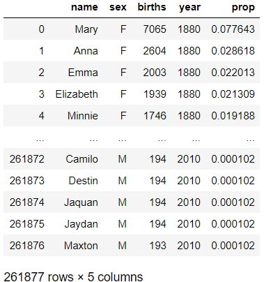

```python
top1000.pivot_table('births', index='year', columns='name')
```

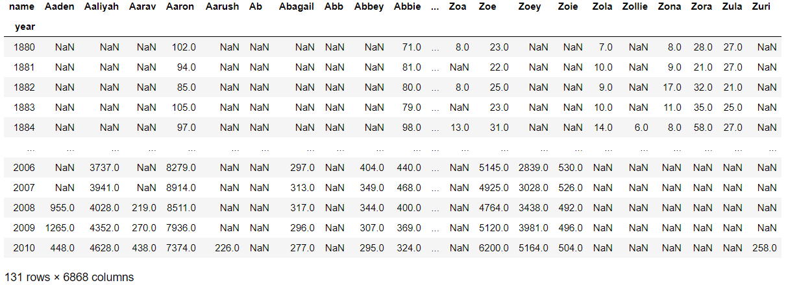

```python
total_births = top1000.pivot_table('births', index='year', 
                                   columns='name', aggfunc=sum)
total_births.info()
# > <class 'pandas.core.frame.DataFrame'>
# > Int64Index: 131 entries, 1880 to 2010
# > Columns: 6868 entries, Aaden to Zuri
# > dtypes: float64(6868)
# > memory usage: 6.9 MB

total_births['John']
# > year
# > 1880     9701.0
# > 1881     8795.0
# > 1882     9597.0
# > 1883     8934.0
# > 1884     9427.0
# >          ...   
# > 2006    15140.0
# > 2007    14405.0
# > 2008    13273.0
# > 2009    12048.0
# > 2010    11424.0
# > Name: John, Length: 131, dtype: float64

total_births[['John', 'Harry', 'Mary', 'Marilyn']]
```

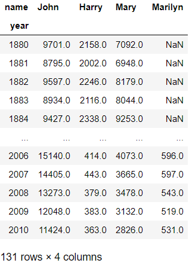

```python
subset = total_births[['John', 'Harry', 'Mary', 'Marilyn']]
subset.plot()
```

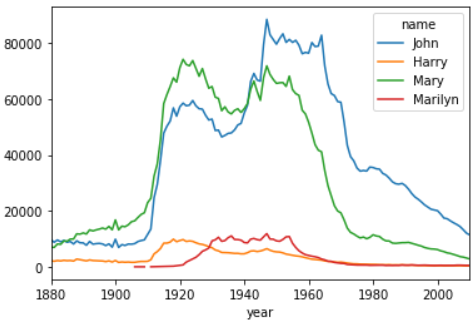

- Marilyn이란 이름은 1910년대 쯤 처음 등장 했다.
- 1960년대 부터 그래프가 떨어지는 경향을 보아 이때부터 신생아의 이름이 다양해졌다는 것으로 생각해볼 수 있다.

- 이름에 따라 그래프 따로 그리기

```python
subset.plot(subplots=True)
```

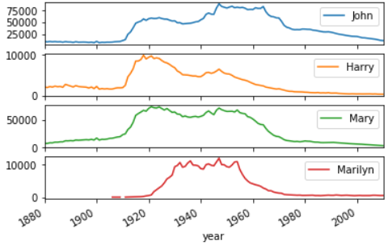

```python
subset.plot(subplots=True, figsize=(12,10))
```


## 년도별 이름의 다양성

- 상위 1000개의 이름이 전체에 대해 자치하는 비율의 변화

```python
top1000.pivot_table('prop', index='year', columns='sex', 
                    aggfunc=sum)
```

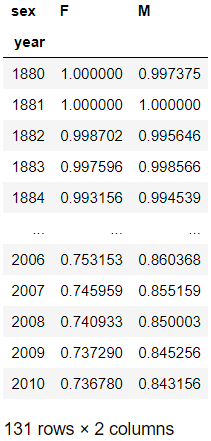

- 초반에는 신생아 이름의 다양성이 많이 떨어졌다.
- 후반으로 갈수록 값이 작아지는 것으로 보아 이름이 초반보다 다양해 졌다는 것을 알 수 있다.

```python
table = top1000.pivot_table('prop', index='year', 
                            columns='sex', aggfunc=sum)
table.plot()
```

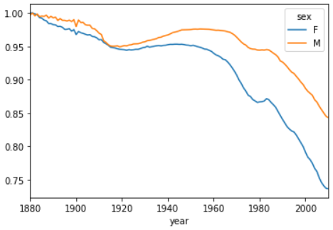

- y축 구간에 대한 설정

```python
table.plot(yticks=np.linspace(0, 1.1, 12))
```

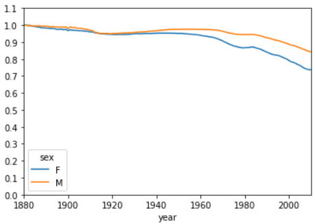

- x축 구간 설정

```python
table.plot(yticks=np.linspace(0, 1.1, 12), 
           xticks=range(1880, 2010,10))
```

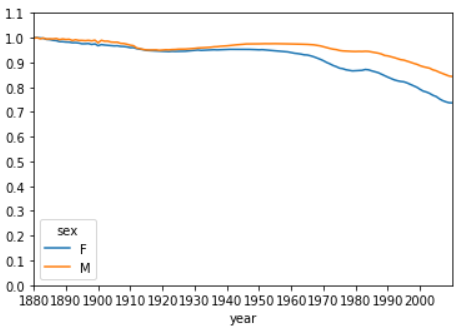

- 범례위치는 loc를 옵션을 통해 조정 가능

## 상위 50%를 차지하는 이름의 갯수(년도별, 성별)

```python
girls = top1000[top1000.sex == 'F']
boys = top1000[top1000.sex == 'M']

boys
```

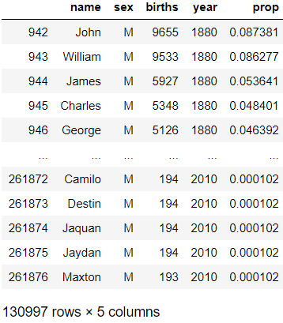

- 1880년 부터 2010년 까지의 각 년도의 상위 1000개의 남자아이들의 이름

### 2010년 남자아이

- 2010년의 남자 아이들의 이름만 따로 저장

```python
df = boys[boys.year == 2010]
df.sort_values(by='prop')
```

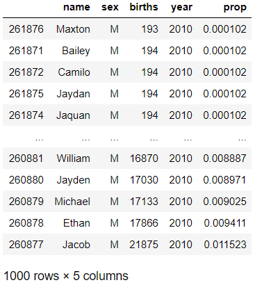

```python
df.sort_values(by='prop', ascending=False) # 오름차순 정렬
```

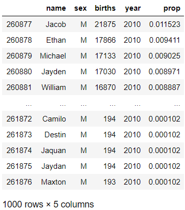

```python
df.sort_values(by='prop', ascending=False).prop
# > 260877    0.011523
# > 260878    0.009411
# > 260879    0.009025
# > 260880    0.008971
# > 260881    0.008887
# >             ...   
# > 261872    0.000102
# > 261873    0.000102
# > 261874    0.000102
# > 261875    0.000102
# > 261876    0.000102
# > Name: prop, Length: 1000, dtype: float64

df.sort_values(by='prop', ascending=False).prop.cumsum()
# > 260877    0.011523
# > 260878    0.020934
# > 260879    0.029959
# > 260880    0.038930
# > 260881    0.047817
# >             ...   
# > 261872    0.842748
# > 261873    0.842850
# > 261874    0.842953
# > 261875    0.843055
# > 261876    0.843156
# > Name: prop, Length: 1000, dtype: float64

prop_cumsum = df.sort_values(by='prop', 
                             ascending=False).prop.cumsum()
prop_cumsum[:10] # 상위 10등 까지의 비중
# > 260877    0.011523
# > 260878    0.020934
# > 260879    0.029959
# > 260880    0.038930
# > 260881    0.047817
# > 260882    0.056579
# > 260883    0.065155
# > 260884    0.073414
# > 260885    0.081528
# > 260886    0.089621
# > Name: prop, dtype: float64

prop_cumsum.values
```

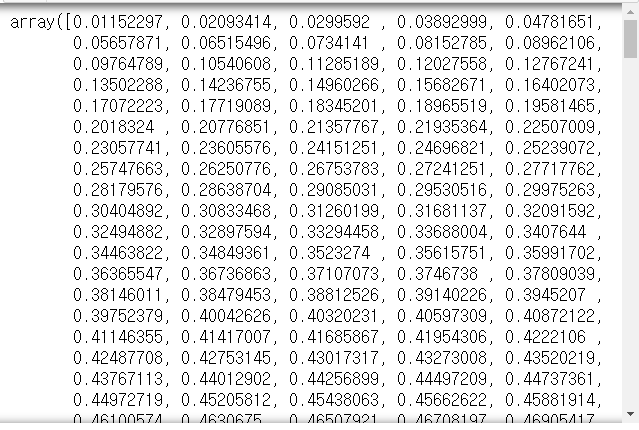

- 누적합이 0.5가 되는 위치를 알려줌

```python
prop_cumsum.values.searchsorted(0.5)
# > 116
```

- index가 0부터 시작하므로, 누적 0.5가 되는 지점에서 이름의 갯수는 +1를 한 117개 이다.

### 1900년 남자아이

```python
df = boys[boys.year == 1900]
in1900 = df.sort_values(by='prop', 
                        ascending=False).prop.cumsum()
in1900
# > 40877    0.065319
# > 40878    0.122308
# > 40879    0.170437
# > 40880    0.206338
# > 40881    0.233584
# >            ...   
# > 41848    0.979489
# > 41847    0.979542
# > 41846    0.979595
# > 41845    0.979648
# > 41876    0.979702
# > Name: prop, Length: 1000, dtype: float64

in1900.values.searchsorted(0.5)
# > 25
```

- 1900년에 남자아이의 이름은 절반가량이 상위 25개 중 하나의 이름을 가지고 있었다는 것을 알 수 있다.

### 전체년도 성별에 대하여

- 전체 년도에 대하여 남자와 여자아이의 약 50%를 차지하는 이름의 갯수 구하기

  - 원하는 결과 창

    - | sex<br />year | F    | M    |
      | ------------- | ---- | ---- |
      | 1880          | 40   | 20   |
      | ...           |      |      |
      | 2010          |      |      |

```python
def get_qc(group, q=0.5) :
    group = group.sort_index(by='prop', ascending=False)
    return group.prop.cumsum().values.searchsorted(q)+1
    
diversity = top1000.groupby(['year', 'sex']).apply(get_qc)
diversity
# > year  sex
# > 1880  F       38
# >       M       14
# > 1881  F       38
# >       M       14
# > 1882  F       38
# >             ... 
# > 2008  M      109
# > 2009  F      241
# >       M      114
# > 2010  F      246
# >       M      117
# > Length: 262, dtype: int64

diversity = diversity.unstack('sex')
diversity
```

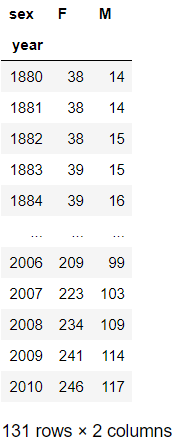

```python
diversity.plot()
```

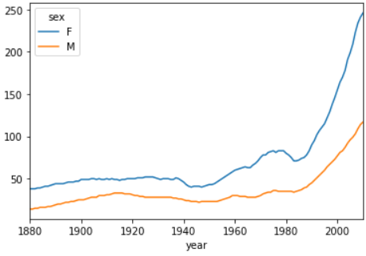

- y축 : 50%를 차지하는 이름 종류의 갯수를 의미
- 여자아이의 이름은 남자아이의 이름보다 항상 다양했다.
- 시간이 지남에 따라 이름이 다양해졌다.
- 이름에 사용되는 절차가 다양해졌다고 생각해 볼 수 있다.

## 가능한 추가 분석

- 이름에 사용된 철자의 패턴의 변화?
  - 상위 50% 이름들에 사용된 절차의 비율을 조사
    - ex.
      - 1880 ; a:3%, ..., z:0.1%
      - 1881 ; a:...
      - ...
      - 2010 ; a:...

## names의 name 열에서 마지막 글자를 추출

```python
names
```

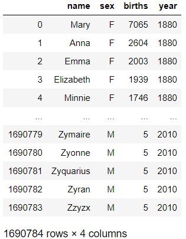

```python
names.name
# > 0               Mary
# > 1               Anna
# > 2               Emma
# > 3          Elizabeth
# > 4             Minnie
# >              ...    
# > 1690779      Zymaire
# > 1690780       Zyonne
# > 1690781    Zyquarius
# > 1690782        Zyran
# > 1690783        Zzyzx
# > Name: name, Length: 1690784, dtype: object
```

```python
last_ch = []
for name in names.name :
    last_ch.append(name[-1])
last_ch
```

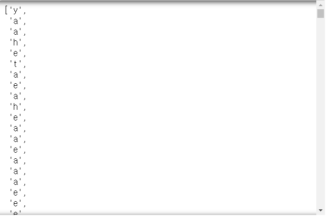

- map함수 이용

```python
# map함수 이용
print(names.name.map(lambda x: x[-1]))
# > 0          y
# > 1          a
# > 2          a
# > 3          h
# > 4          e
# >           ..
# > 1690779    e
# > 1690780    e
# > 1690781    s
# > 1690782    n
# > 1690783    x
# > Name: name, Length: 1690784, dtype: object

last_letters = names.name.map(lambda x: x[-1])
last_letters
# > 0          y
# > 1          a
# > 2          a
# > 3          h
# > 4          e
# >           ..
# > 1690779    e
# > 1690780    e
# > 1690781    s
# > 1690782    n
# > 1690783    x
# > Name: name, Length: 1690784, dtype: object

last_letters.name = "last_letter"
last_letters
# > 0          y
# > 1          a
# > 2          a
# > 3          h
# > 4          e
# >           ..
# > 1690779    e
# > 1690780    e
# > 1690781    s
# > 1690782    n
# > 1690783    x
# > Name: last_letter, Length: 1690784, dtype: object
```

```python
table = names.pivot_table('births', index=last_letters,
                          columns=['sex', 'year'], aggfunc=sum)
table
```


### 1900, 1950, 2010년

```python
subtable = table.reindex(columns=[1900, 1950, 2010],
                         level='year')
subtable
```

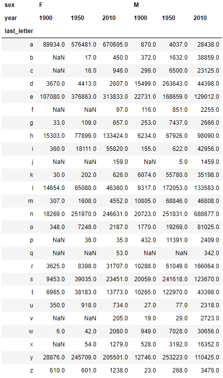

```python
subtable.sum()
# > sex  year
# > F    1900     299873.0
# >      1950    1713001.0
# >      2010    1759010.0
# > M    1900     150554.0
# >      1950    1789936.0
# >      2010    1898382.0
# > dtype: float64

subtable.sum(axis=1)
# > last_letter
# > a    1370365.0
# > b      41330.0
# > c      30886.0
# > d     334230.0
# > e    1118178.0
# > f       3319.0
# > g      11155.0
# > h     398876.0
# > i     118024.0
# > j       1623.0
# > k      97910.0
# > l     441055.0
# > m     132926.0
# > n    1478101.0
# > o     111847.0
# > p      14303.0
# > q        395.0
# > r     281131.0
# > s     457286.0
# > t     235554.0
# > u       4424.0
# > v       2976.0
# > w      40761.0
# > x      21405.0
# > y     856480.0
# > z       6216.0
# > dtype: float64
```

#### 각 년도에서 last_letter로 사용된 알파벳의 비율&시각화

```python
subtable / subtable.sum(axis=0)
```

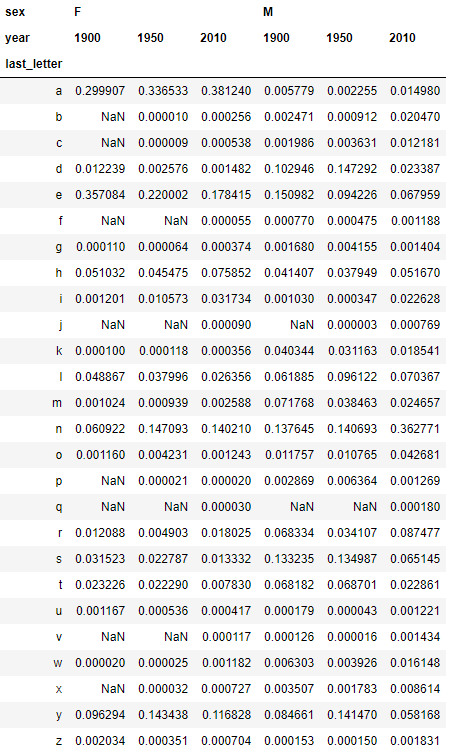

```python
import matplotlib.pyplot as plt

letter_prop = subtable / subtable.sum(axis=0)

fig, axes = plt.subplots(2,1, figsize=(10,8))
```

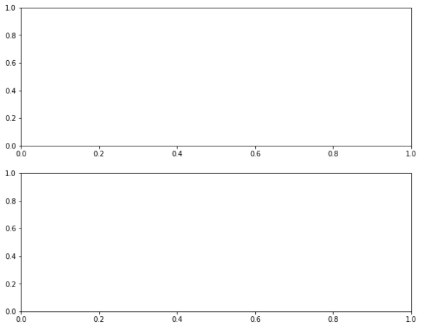

```python
letter_prop['F']
```

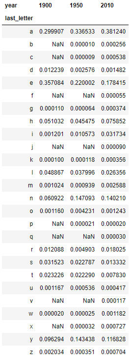

```python
letter_prop['F'].plot()
```

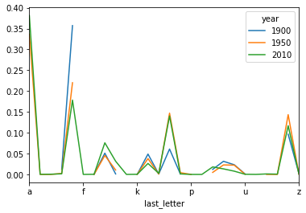

- 추이를 보는 것이 아니므로 bar 그래프 사용

```python
letter_prop['F'].plot(kind="bar")
```

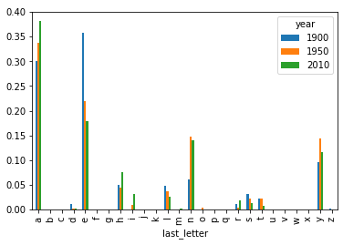

```python
letter_prop['F'].plot(kind="bar", rot=0) # rot : x축 index 회전
```

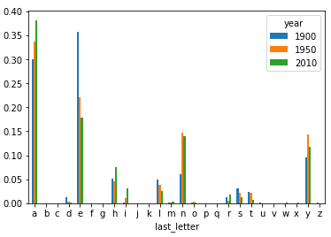

```python
letter_prop['F'].plot(kind="bar", rot=0, ax=axes[0])
letter_prop['M'].plot(kind="bar", rot=0, ax=axes[1])

fig
```

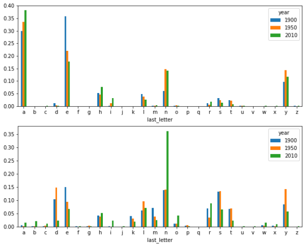

- 여자아이는 a로 많이 끝나고
- 남자아이는 n으로 많이 끝난다.
- 남자아이의 경우 last_letter가 다양하다.

### 1880 ~ 2010년까지의 특정 알파벳의 비율 & 시각화

- d, n, y

```python
letter_prop.loc['a']
# > sex  year
# > F    1900    0.299907
# >      1950    0.336533
# >      2010    0.381240
# > M    1900    0.005779
# >      1950    0.002255
# >      2010    0.014980
# > Name: a, dtype: float64

letter_prop.loc[['d', 'n', 'y']]
```

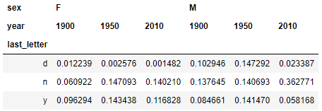

- 남자아이만 원할 경우

```python
letter_prop.loc[['d', 'n', 'y'], 'M']
```

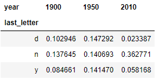

```python
letter_prop = table / table.sum()
letter_prop
```

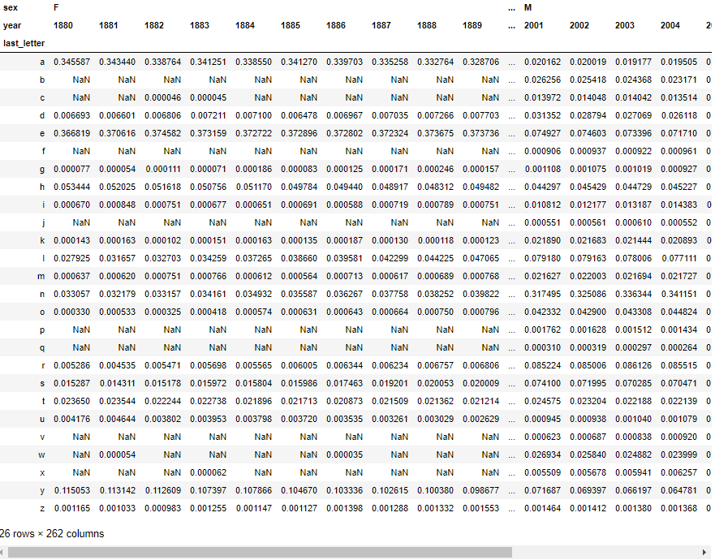

```python
letter_prop.loc[['d', 'n', 'y'], 'M']
```

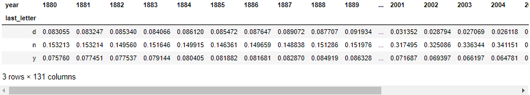

```python
dny_ts = letter_prop.loc[['d', 'n', 'y'], 'M']
dny_ts.plot()
```

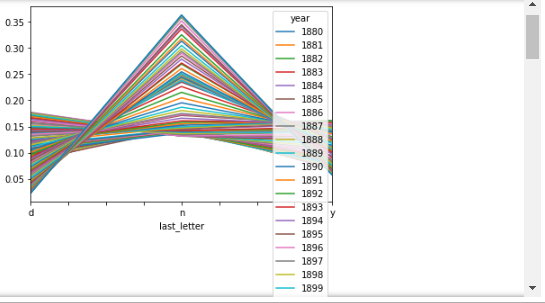

```python
dny_ts = dny_ts.T
dny_ts.plot()
```

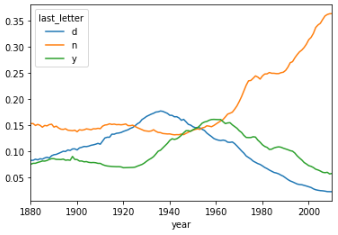

# movielens data

```python
users = pd.read_csv("../dataset/movielens/users.dat", 
                    sep="::", header=None)
users
```

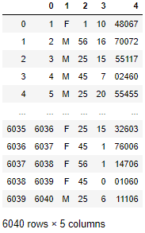

```python
unames = ['user_id', 'gender', 'age', 'occupation', 'zip']
upath = "../dataset/movielens/users.dat"
users = pd.read_csv(upath, sep="::", header=None,
                    names=unames)
users
```

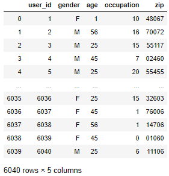

```python
rnames = ['user_id', 'movie_id', 'ratings', 'timestamp']
mnames = ['movie_id', 'title', 'genres']
rpath = "../dataset/movielens/ratings.dat"
mpath = "../dataset/movielens/movies.dat"
ratings = pd.read_csv(rpath, sep="::", header=None,
                      names=rnames)
movies = pd.read_csv(mpath, sep="::", header=None,
                     names=mnames)

ratings
```

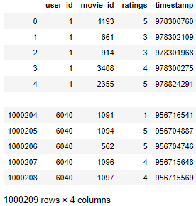

```python
movies
```

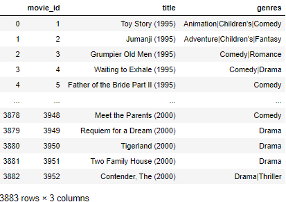

## 영화 추천하기

- uesr_id가 1인 사람이 대상이라고 할 때
  1. 최소 3편이상의 공통된 영화를 본 사람
  2. 평점을 유사하게 부여한 사람
     - 유클리디안 거리의 평균 고려
  3. 1과 가장 유사한 사람의 id가 50이라고 할 때,
- => 1은 안봤지만, 50은 보고 & 평점이 높은 영화를 추천

## 데이터 병합

```python
pd.merge(ratings, users)
```

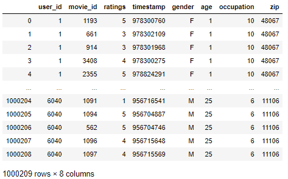

```python
data = pd.merge(pd.merge(ratings, users), movies)
data
```

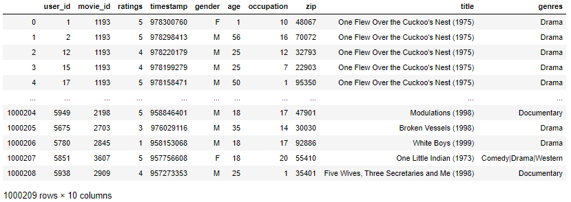

```python
data.loc[0]
# > user_id                                            1
# > movie_id                                        1193
# > ratings                                            5
# > timestamp                                  978300760
# > gender                                             F
# > age                                                1
# > occupation                                        10
# > zip                                            48067
# > title         One Flew Over the Cuckoo's Nest (1975)
# > genres                                         Drama
# > Name: 0, dtype: object
```

## 성별에 따른 각 영화의 평점 평균

- data : value는  성별에 따른 각 영화의 평균 평점

  - | gender<br />title | F    | M    |
    | ----------------- | ---- | ---- |
    | Superman          | 3.5  | 3.1  |
    | ...               | ...  | ...  |

```python
mean_ratings = data.pivot_table(
    values="ratings", index="title", 
    columns="gender", aggfunc=np.mean)
mean_ratings
```

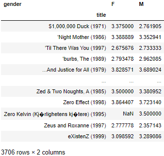

- 영화제목으로 그룹핑 하여 해당 영화를 본 사람 카운트하기

```python
ratings_by_title = data.groupby("title").size()
ratings_by_title
# > title
# > $1,000,000 Duck (1971)                         37
# > 'Night Mother (1986)                           70
# > 'Til There Was You (1997)                      52
# > 'burbs, The (1989)                            303
# > ...And Justice for All (1979)                 199
# >                                              ... 
# > Zed & Two Noughts, A (1985)                    29
# > Zero Effect (1998)                            301
# > Zero Kelvin (Kj�rlighetens kj�tere) (1995)      2
# > Zeus and Roxanne (1997)                        23
# > eXistenZ (1999)                               410
# > Length: 3706, dtype: int64
```

- 250명이상이 평점을 부여한 영화에 대하여 분석

```python
type(ratings_by_title)
# > pandas.core.series.Series

ratings_by_title.index
# > Index(['$1,000,000 Duck (1971)', ''Night Mother (1986)',
# >        ''Til There Was You (1997)', ''burbs, The (1989)',
# >        '...And Justice for All (1979)', '1-900 (1994)',
# >        '10 Things I Hate About You (1999)', '101 Dalmatians (1961)',
# >        '101 Dalmatians (1996)', '12 Angry Men (1957)',
# >        ...
# >        'Young Poisoner's Handbook, The (1995)', 'Young Sherlock Holmes (1985)',
# >        'Young and Innocent (1937)', 'Your Friends and Neighbors (1998)',
# >        'Zachariah (1971)', 'Zed & Two Noughts, A (1985)', 'Zero Effect (1998)',
# >        'Zero Kelvin (Kj�rlighetens kj�tere) (1995)', 'Zeus and Roxanne (1997)',
# >        'eXistenZ (1999)'],
# >       dtype='object', name='title', length=3706)

ratings_by_title.values
# > array([ 37,  70,  52, ...,   2,  23, 410], dtype=int64)

ratings_by_title >= 250
# > title
# > $1,000,000 Duck (1971)                        False
# > 'Night Mother (1986)                          False
# > 'Til There Was You (1997)                     False
# > 'burbs, The (1989)                             True
# > ...And Justice for All (1979)                 False
# >                                               ...  
# > Zed & Two Noughts, A (1985)                   False
# > Zero Effect (1998)                             True
# > Zero Kelvin (Kj�rlighetens kj�tere) (1995)    False
# > Zeus and Roxanne (1997)                       False
# > eXistenZ (1999)                                True
# > Length: 3706, dtype: bool

ratings_by_title[ratings_by_title >= 250]
# > title
# > 'burbs, The (1989)                   303
# > 10 Things I Hate About You (1999)    700
# > 101 Dalmatians (1961)                565
# > 101 Dalmatians (1996)                364
# > 12 Angry Men (1957)                  616
# >                                     ... 
# > Young Guns (1988)                    562
# > Young Guns II (1990)                 369
# > Young Sherlock Holmes (1985)         379
# > Zero Effect (1998)                   301
# > eXistenZ (1999)                      410
# > Length: 1216, dtype: int64

ratings_by_title[ratings_by_title >= 250].index
# > Index([''burbs, The (1989)', '10 Things I Hate About You (1999)',
# >        '101 Dalmatians (1961)', '101 Dalmatians (1996)', '12 Angry Men (1957)',
# >        '13th Warrior, The (1999)', '2 Days in the Valley (1996)',
# >        '20,000 Leagues Under the Sea (1954)', '2001: A Space Odyssey (1968)',
# >        '2010 (1984)',
# >        ...
# >        'X-Men (2000)', 'Year of Living Dangerously (1982)',
# >        'Yellow Submarine (1968)', 'You've Got Mail (1998)',
# >        'Young Frankenstein (1974)', 'Young Guns (1988)',
# >        'Young Guns II (1990)', 'Young Sherlock Holmes (1985)',
# >        'Zero Effect (1998)', 'eXistenZ (1999)'],
# >       dtype='object', name='title', length=1216)

active_titles = ratings_by_title.index[ratings_by_title >= 250]
active_titles
# > Index([''burbs, The (1989)', '10 Things I Hate About You (1999)',
# >        '101 Dalmatians (1961)', '101 Dalmatians (1996)', '12 Angry Men (1957)',
# >        '13th Warrior, The (1999)', '2 Days in the Valley (1996)',
# >        '20,000 Leagues Under the Sea (1954)', '2001: A Space Odyssey (1968)',
# >        '2010 (1984)',
# >        ...
# >        'X-Men (2000)', 'Year of Living Dangerously (1982)',
# >        'Yellow Submarine (1968)', 'You've Got Mail (1998)',
# >        'Young Frankenstein (1974)', 'Young Guns (1988)',
# >        'Young Guns II (1990)', 'Young Sherlock Holmes (1985)',
# >        'Zero Effect (1998)', 'eXistenZ (1999)'],
# >       dtype='object', name='title', length=1216)
```

- mean_ratings에서 active_titles에 저장된
- 영화 제목에 대한 데이터만 추출

```python
mean_ratings = mean_ratings.loc[active_titles]
mean_ratings
```

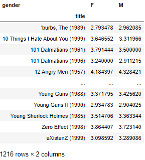

```python
top_female_ratings = mean_ratings.sort_values(
    by='F', ascending=False)
top_female_ratings
```

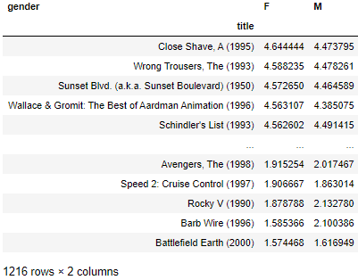

### 남녀간 평점 차를 구했을 때, 가장 평점차가 큰 영화제목이 무엇인지 확인

```python
np.argmax(abs(mean_ratings['F'] - mean_ratings['M']))
# > 'Dirty Dancing (1987)'
```

```python
mean_ratings['diff'] = mean_ratings['M'] - mean_ratings['F']
mean_ratings.head()
```

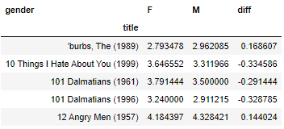

- diff를 기준으로 오름차순 정렬

```python
mean_ratings.sort_values(by='diff')
```

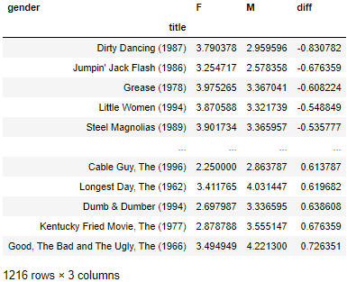

```python
sorted_by_diff = mean_ratings.sort_values(by='diff')
sorted_by_diff[::-1]
```

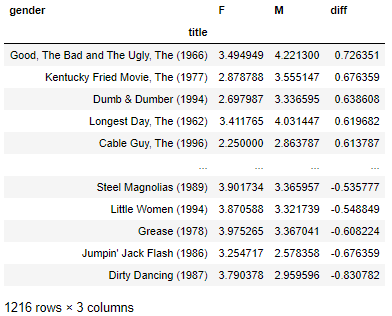

### 남녀간 영화 평점에 대한 표준편차

```python
rs_by_title = data.groupby('title')['ratings'].std()
rs_by_title
# > title
# > $1,000,000 Duck (1971)                        1.092563
# > 'Night Mother (1986)                          1.118636
# > 'Til There Was You (1997)                     1.020159
# > 'burbs, The (1989)                            1.107760
# > ...And Justice for All (1979)                 0.878110
# >                                                 ...   
# > Zed & Two Noughts, A (1985)                   1.052794
# > Zero Effect (1998)                            1.042932
# > Zero Kelvin (Kj�rlighetens kj�tere) (1995)    0.707107
# > Zeus and Roxanne (1997)                       1.122884
# > eXistenZ (1999)                               1.178568
# > Name: ratings, Length: 3706, dtype: float64
```
- 250명 이상이 평가한 영화만 분석
```python
rs_by_title = rs_by_title.loc[active_titles]
rs_by_title
# > title
# > 'burbs, The (1989)                   1.107760
# > 10 Things I Hate About You (1999)    0.989815
# > 101 Dalmatians (1961)                0.982103
# > 101 Dalmatians (1996)                1.098717
# > 12 Angry Men (1957)                  0.812731
# >                                        ...   
# > Young Guns (1988)                    1.017437
# > Young Guns II (1990)                 1.071959
# > Young Sherlock Holmes (1985)         0.891176
# > Zero Effect (1998)                   1.042932
# > eXistenZ (1999)                      1.178568
# > Name: ratings, Length: 1216, dtype: float64
```

- 표준편차를 내림차순으로 정렬

```python
rs_by_title.sort_values(ascending=False)
# > title
# > Dumb & Dumber (1994)                     1.321333
# > Blair Witch Project, The (1999)          1.316368
# > Natural Born Killers (1994)              1.307198
# > Tank Girl (1995)                         1.277695
# > Rocky Horror Picture Show, The (1975)    1.260177
# >                                            ...   
# > Wrong Trousers, The (1993)               0.708666
# > Shawshank Redemption, The (1994)         0.700443
# > Great Escape, The (1963)                 0.692585
# > Rear Window (1954)                       0.688946
# > Close Shave, A (1995)                    0.667143
# > Name: ratings, Length: 1216, dtype: float64
```


# 연습문제

## 1.

- 1900년 남자아이, 여자아이의 전체 수 출력

### A.

```python
# 1.
f1900_sum = names[(names.year == 1900)&(names.sex == 'F')]['births'].sum()
m1900_sum = names[(names.year == 1900)&(names.sex == 'M')]['births'].sum()

print("1900년 미국에서 태어난 남자아이 %d명" % m1900_sum)
print("1900년 미국에서 태어난 여자아이 %d명" % f1900_sum)
# > 1900년 미국에서 태어난 남자아이 150554명
# > 1900년 미국에서 태어난 여자아이 299873명
```

## 2.

- 남자/여자 이름이 바뀐경우(대소문자는 구분 안함)
- ex)
- Lesley : 여자 -> 남자  (시각화)
- 확인 이름 : Leslie, Lesley, Leslee, Lesli, Lesly

### A.

```python
# 2.
names.name = names.name.map(lambda x: x.lower())
names['name']
# > 0               mary
# > 1               anna
# > 2               emma
# > 3          elizabeth
# > 4             minnie
# >              ...    
# > 1690779      zymaire
# > 1690780       zyonne
# > 1690781    zyquarius
# > 1690782        zyran
# > 1690783        zzyzx
# > Name: name, Length: 1690784, dtype: object

name_group = names.pivot_table(
    'births', index=['year'], 
    columns=['name', 'sex'], aggfunc=sum)
name_group
```

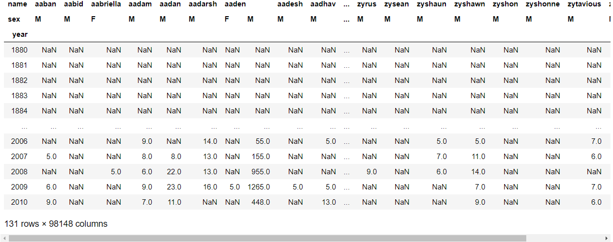

```python
search = ['leslie', 'lesley', 'leslee', 'lesli', 'lesly']
subset = name_group.loc[:, search]
subset
```

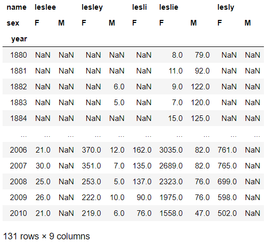

```python
fig, axes = plt.subplots(5,1, figsize=(10,20), constrained_layout=True)

for i in range(5) :
    subset[search[i]].plot(ax=axes[i])
    axes[i].set_title(search[i])
```

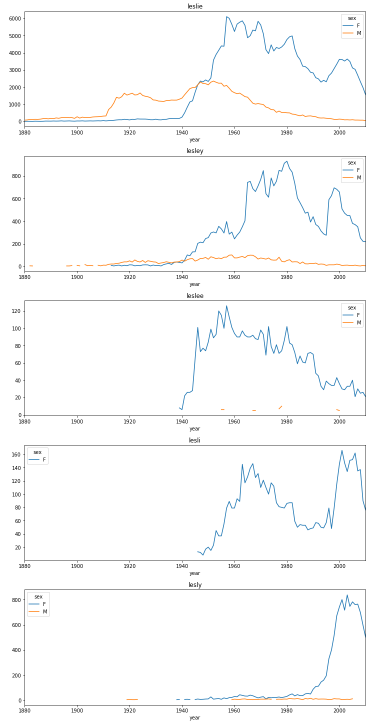

## 3.

- data.go.kr(해도/안해도)
- 검색어 : 이름 -> 동대문구 동물이름 download
- 동물이름 첫번째 글자로 가장 많이 오는 글자는 무엇인가?

### A.

```python
# 3.
animal = pd.read_csv(
    '../서울특별시_동대문구_등록동물이름현황_20191203.csv', 
    date_parser='데이터기준일자', encoding='ANSI')
animal
```

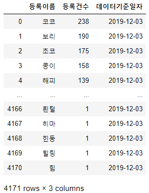

```python
animal['first'] = animal.등록이름.map(lambda x: x[0])
animal
```

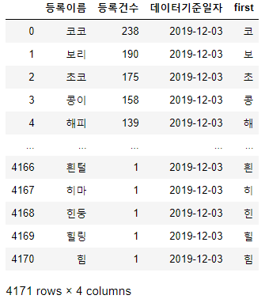

```python
first_co = animal.pivot_table(index='first', aggfunc=sum)
first_co
```

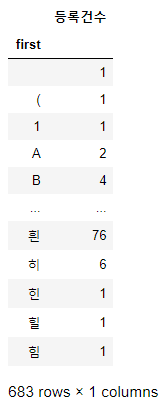

```python
first_co[(first_co == first_co.등록건수.max()).values]
```

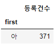

# 알고리즘 문제

- 렌덤으로 1부터 45까지의 무작위로 섞인 6개의 숫자와 1개의 보너스 숫자를 당첨번호로 생성해 저장한 뒤

- 로또를 몇개살지 입력받고 입력된 번호의 수에 따라 렌덤으로 뽑힌 번호를 당첨번호와 비교!

- 한뒤 당첨이 되면 당첨된 번호와 축하의 말을 출력 해주자

- 예시 : 로또를 몇개 구매하시겠습니까? : 5

-  현재 당첨번호는 43,2,35,16,4,6 보너스번호는 11 입니다.

- 구매하신 추첨번호는 43,2,41,18,19,21 보너스번호는 8입니다.

- 구매하신 추첨번호는 28,20,1,4,32,5 보너스번호는 8입니다

-  구매하신 추첨번호.... 11,4,35,2,43,16 보너스번호 6 ..1등이다!! 아싸 오늘저녁은 치킨이닭!!
  - 7가지의 숫자가다 맞으면 1등
  - 6가지의 숫자가 맞으면 2등
  - 5가지 숫자가 맞으면 3등

## A.

```python
# 로또 갯수 입력
n = int(input("로또를 몇개 구매 하시겠습니까? "))
# 수동, 자동 갯수 입력
manual = int(input("수동 갯수 :"))
while n < manual :
    print("구매 갯수보다 많이 입력하였습니다. 다시 입력 해주세요.")
    manual = int(input("수동 갯수 :"))

# 로또 번호 구성
# 수동
user = []
for _ in range(manual) :
    tmp = list(map(int, input("수동 로또 : ").split()))
    while len(tmp) != 6 :
        print("6개의 번호를 입력해 주세요.")
        tmp = list(map(int, input("수동 로또 : ").split()))
    while (min(tmp) < 1) and (max(tmp) > 45) :
        print("로또 번호는 1~45 사이의 번호입니다.")
        tmp = list(map(int, input("수동 로또 : ").split()))
    while len(tmp) != len(set(tmp)) :
        print("중복된 번호는 할 수 없습니다.")
        tmp = list(map(int, input("수동 로또 : ").split()))
    user.append(tmp)    

# 자동        
for _ in range(n-manual) :
    tmp = []
    while len(tmp) < 6 :
        number = np.random.randint(1, 46)
        if number not in tmp :
            tmp.append(number)
    user.append(tmp)

# 당첨 번호
target = []
while len(target) < 7 :
    num = np.random.randint(1, 46)
    if num not in target :
        target.append(num)

bonus = target[-1]
target = target[:-1]

# 당첨 번호, 보너스 번호 출력
print("현재 당첨번호는", end=' ')
print(*target, sep=',', end=' ')
print("보너스 번호는 %d입니다." % bonus)

# 당첨 여부 확인
c = 0
for i in range(n) :
    result = len(set(user[i]) - set(target))
    if result == 0 :
        c += 1
        print("1등 당첨")
    elif result == 1 :
        c += 1
        if bonus in user[i] :
            print("2등 당첨")
        else : 
            print("3등 당첨")
    elif result == 2 :
        c += 1
        print("4등 당첨")
    elif result == 3 :
        c += 1
        print("5등 당첨")
if c == 0 :
    print("당첨된 로또가 없습니다.")
```

