# Day31 딥러닝을 위한 빅데이터 기초 - xml, json file 열기 & R (1)

# xml 파일

```python
from lxml import etree
```

- sample.xml

```xml
<?xml version="1.0" encoding="UTF-8"?>
<girlgroup>
  <name alias="GFRIEND">여자친구</name>
  <members>
    <member>소원</member>
    <member>예린</member>
    <member>은하</member>
    <member>유주</member>
    <member>신비</member>
    <member>엄지</member>
  </members>
  <albums>
    <album order="EP 1집">Season of Glass</album>
    <album order="EP 2집">Flower Bud</album>
    <album order="EP 3집">Snowflake</album>
    <album order="정규 1집">LOL</album>
  </albums>
</girlgroup>
```

- xml을 tree 모드로 읽어들이기

```python
tree = etree.parse("../sample.xml")
tree
# > <lxml.etree._ElementTree at 0x1cfbcf38f88>
```

- tree의 root tag를 불러오기

```python
root = tree.getroot()
root
# > <Element girlgroup at 0x1cfbf0e4348>

kids = root.getchildren()
kids
# > [<Element name at 0x1cfbef32348>,
# >  <Element members at 0x1cfbfe84108>,
# >  <Element albums at 0x1cfbfe840c8>]

for child in kids :
    print(child.tag)
# > name
# > members
# > albums

for child in kids :
    print(child.text)
# > 여자친구
# > 
# >     
# > 
# >     
```

- memebers와 albums는 하위요인에 텍스트가 저장되어 있어 출력되지 않는다.

```python
members = []
albums = []
for child in kids :
    if child.tag == "name" :
        gname = child.text
    elif child.tag == "members" :
        for xmember in child :
            members.append(xmember.text)
    elif child.tag == "albums" :
        for xalbum in child :
            albums.append(xalbum.text)

print(gname)
print(members)
print(albums)
# > 여자친구
# > ['소원', '예린', '은하', '유주', '신비', '엄지']
# > ['Season of Glass', 'Flower Bud', 'Snowflake', 'LOL']
```

- 앨범 종류도 같이 저장하기

```python
members = []
albums = []
for child in kids :
    if child.tag == "name" :
        gname = child.text
    elif child.tag == "members" :
        for xmember in child :
            members.append(xmember.text)
    elif child.tag == "albums" :
        for xalbum in child :
            albums.append([xalbum.get("order"), xalbum.text])

print(gname)
print(members)
print(albums)
# > 여자친구
# > ['소원', '예린', '은하', '유주', '신비', '엄지']
# > [['EP 1집', 'Season of Glass'], ['EP 2집', 'Flower Bud'], ['EP 3집', 'Snowflake'], ['정규 1집', 'LOL']]
```

```python
print("걸그룹 : %s" % gname)
# > 걸그룹 : 여자친구

print("멤버 : ", end="")
for i, m in enumerate(members) :
    print(m, end=", ")
# > 멤버 : 소원 예린 은하 유주 신비 엄지 

print("")
for album in albums :
    print(" %s : %s" %(album[0], album[1]))
# > 
# >  EP 1집 : Season of Glass
# >  EP 2집 : Flower Bud
# >  EP 3집 : Snowflake
# >  정규 1집 : LOL
```

```python
print("걸그룹 : %s" % gname)
print("멤버 : ", end="")
for i, m in enumerate(members) :
    print(m, end=" ")
print("")
for album in albums :
    print(" %s : %s" %(album[0], album[1]))
# > 걸그룹 : 여자친구
# > 멤버 : 소원 예린 은하 유주 신비 엄지 
# >  EP 1집 : Season of Glass
# >  EP 2집 : Flower Bud
# >  EP 3집 : Snowflake
# >  정규 1집 : LOL
```

# json 파일

```python
import json
```

```python
path = '../usagov_bitly_data.txt'

records = [json.loads(line) for line in open(path, encoding='UTF-8')]
records
```

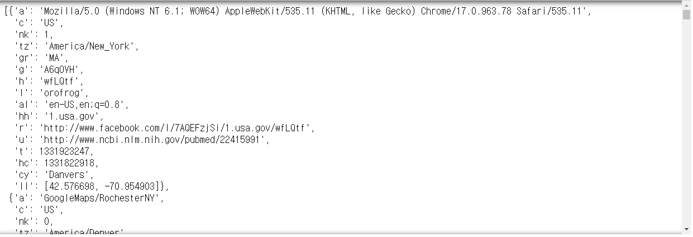

- 일단 list로 읽어지고, line이 key, value 쌍으로 읽어진다.

```python
records[0]
# > {'a': 'Mozilla/5.0 (Windows NT 6.1; WOW64) AppleWebKit/535.11 (KHTML, like Gecko) Chrome/17.0.963.78 Safari/535.11',
# >  'c': 'US',
# >  'nk': 1,
# >  'tz': 'America/New_York',
# >  'gr': 'MA',
# >  'g': 'A6qOVH',
# >  'h': 'wfLQtf',
# >  'l': 'orofrog',
# >  'al': 'en-US,en;q=0.8',
# >  'hh': '1.usa.gov',
# >  'r': 'http://www.facebook.com/l/7AQEFzjSi/1.usa.gov/wfLQtf',
# >  'u': 'http://www.ncbi.nlm.nih.gov/pubmed/22415991',
# >  't': 1331923247,
# >  'hc': 1331822918,
# >  'cy': 'Danvers',
# >  'll': [42.576698, -70.954903]}

records[0]['tz'] # tz : timezone
# > 'America/New_York'
```

```python
time_zones = [rec['tz'] for rec in records]
time_zones
```

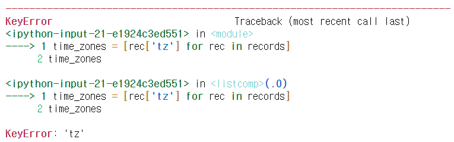

- tz가 없는 딕셔너리가 존재하여 Error 발생

- => tz 컬럼이 있는 경우에만 time_zones에 저장

```python
time_zones = [rec['tz'] for rec in records if 'tz' in rec]
time_zones
```

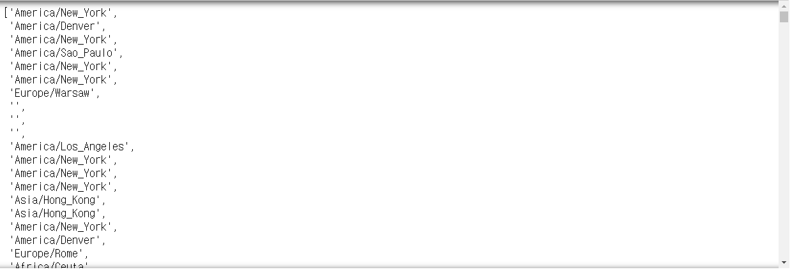

- 'tz'가 없는 딕셔너리는 저장되지 않는다.
- ''는 'tz'가 존재하지만, 값이 ''로 저장된 경우 이다.

## pands DataFrame

```python
from pandas import DataFrame, Series
import pandas as pd

records
```

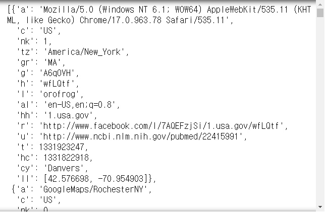

```python
frame = DataFrame(records)
frame
```


```python
frame.info()
# > <class 'pandas.core.frame.DataFrame'>
# > RangeIndex: 3560 entries, 0 to 3559
# > Data columns (total 18 columns):
# > a              3440 non-null object
# > c              2919 non-null object
# > nk             3440 non-null float64
# > tz             3440 non-null object
# > gr             2919 non-null object
# > g              3440 non-null object
# > h              3440 non-null object
# > l              3440 non-null object
# > al             3094 non-null object
# > hh             3440 non-null object
# > r              3440 non-null object
# > u              3440 non-null object
# > t              3440 non-null float64
# > hc             3440 non-null float64
# > cy             2919 non-null object
# > ll             2919 non-null object
# > _heartbeat_    120 non-null float64
# > kw             93 non-null object
# > dtypes: float64(4), object(14)
# > memory usage: 500.8+ KB

frame['tz'].value_counts()
# > America/New_York       1251
# >                         521
# > America/Chicago         400
# > America/Los_Angeles     382
# > America/Denver          191
# >                        ... 
# > Europe/Skopje             1
# > Europe/Uzhgorod           1
# > Europe/Ljubljana          1
# > America/Caracas           1
# > Africa/Casablanca         1
# > Name: tz, Length: 97, dtype: int64
```

- ''를 Unknown으로 변경하기

```python
frame[frame['tz'] == '']
```

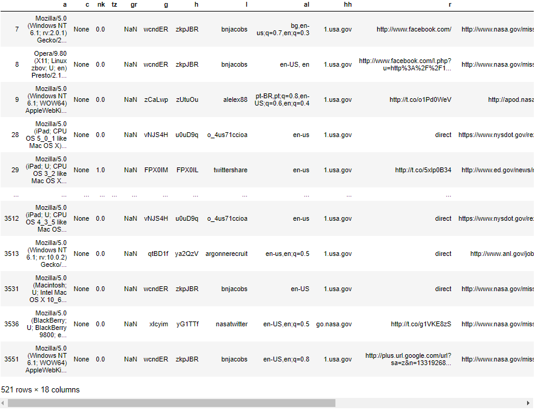

```python
ctz = frame['tz'].fillna("missing")
ctz[ctz == ''] = "Unknown"
ctz.value_counts()
# > America/New_York       1251
# > Unknown                 521
# > America/Chicago         400
# > America/Los_Angeles     382
# > America/Denver          191
# >                        ... 
# > Europe/Skopje             1
# > Europe/Uzhgorod           1
# > Europe/Ljubljana          1
# > America/Caracas           1
# > Africa/Casablanca         1
# > Name: tz, Length: 98, dtype: int64

ctz.value_counts()[:10]
# > America/New_York       1251
# > Unknown                 521
# > America/Chicago         400
# > America/Los_Angeles     382
# > America/Denver          191
# > missing                 120
# > Europe/London            74
# > Asia/Tokyo               37
# > Pacific/Honolulu         36
# > Europe/Madrid            35
# > Name: tz, dtype: int64
```

```python
tzc = ctz.value_counts()
tzc.plot()
```

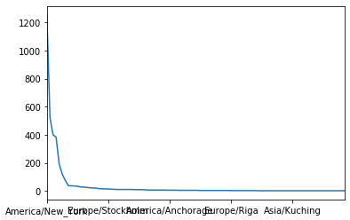

```python
tzc[:10].plot()
```

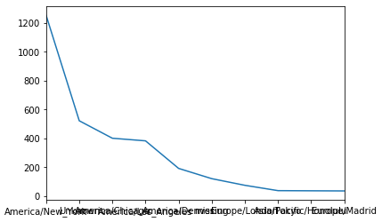

```python
tzc[:10].plot(kind="barh")
```

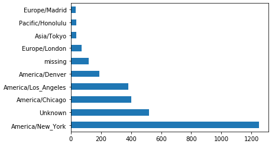

- a : 사용하는 브라우저, 운영체제 종류

```python
frame['a']
# 운영체제 추출(정규식)
# > 0       Mozilla/5.0 (Windows NT 6.1; WOW64) AppleWebKi...
# > 1                                  GoogleMaps/RochesterNY
# > 2       Mozilla/4.0 (compatible; MSIE 8.0; Windows NT ...
# > 3       Mozilla/5.0 (Macintosh; Intel Mac OS X 10_6_8)...
# > 4       Mozilla/5.0 (Windows NT 6.1; WOW64) AppleWebKi...
# >                               ...                        
# > 3555    Mozilla/4.0 (compatible; MSIE 9.0; Windows NT ...
# > 3556    Mozilla/5.0 (Windows NT 5.1) AppleWebKit/535.1...
# > 3557                               GoogleMaps/RochesterNY
# > 3558                                       GoogleProducer
# > 3559    Mozilla/4.0 (compatible; MSIE 8.0; Windows NT ...
# > Name: a, Length: 3560, dtype: object
```

```python
frame.info()
# > <class 'pandas.core.frame.DataFrame'>
# > RangeIndex: 3560 entries, 0 to 3559
# > Data columns (total 18 columns):
# > a              3440 non-null object
# > c              2919 non-null object
# > nk             3440 non-null float64
# > tz             3440 non-null object
# > gr             2919 non-null object
# > g              3440 non-null object
# > h              3440 non-null object
# > l              3440 non-null object
# > al             3094 non-null object
# > hh             3440 non-null object
# > r              3440 non-null object
# > u              3440 non-null object
# > t              3440 non-null float64
# > hc             3440 non-null float64
# > cy             2919 non-null object
# > ll             2919 non-null object
# > _heartbeat_    120 non-null float64
# > kw             93 non-null object
# > dtypes: float64(4), object(14)
# > memory usage: 500.8+ KB

len(frame.a)
# > 3560

len(frame.a.dropna()) # nan은 제외하고 값이 구해짐
# > 3440
```

```python
for x in frame.a.dropna() :
    print(x)
```

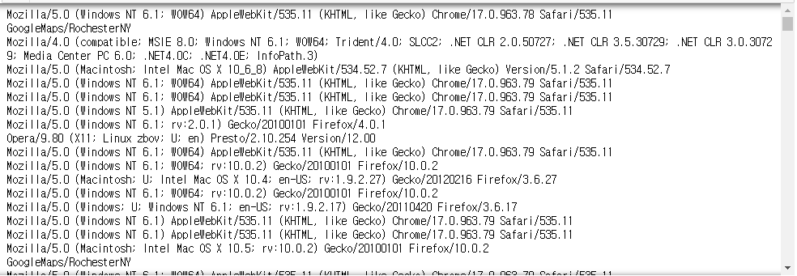

```python
res = [x.split()[0] for x in frame.a.dropna()]
res # 브라우저
```

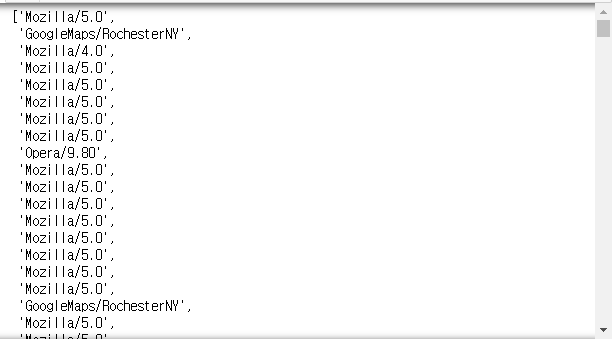

```python
pd.Series(res).value_counts()
```

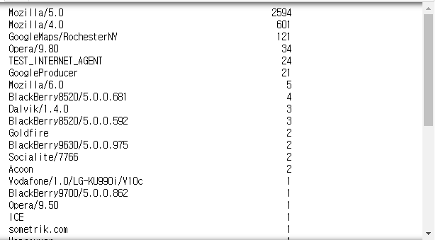

```python
pd.Series(res).value_counts()[:10]
# > Mozilla/5.0                 2594
# > Mozilla/4.0                  601
# > GoogleMaps/RochesterNY       121
# > Opera/9.80                    34
# > TEST_INTERNET_AGENT           24
# > GoogleProducer                21
# > Mozilla/6.0                    5
# > BlackBerry8520/5.0.0.681       4
# > Dalvik/1.4.0                   3
# > BlackBerry8520/5.0.0.592       3
# > dtype: int64
```

- Windows 여부 판단

```python
frame.a
# > 0       Mozilla/5.0 (Windows NT 6.1; WOW64) AppleWebKi...
# > 1                                  GoogleMaps/RochesterNY
# > 2       Mozilla/4.0 (compatible; MSIE 8.0; Windows NT ...
# > 3       Mozilla/5.0 (Macintosh; Intel Mac OS X 10_6_8)...
# > 4       Mozilla/5.0 (Windows NT 6.1; WOW64) AppleWebKi...
# >                               ...                        
# > 3555    Mozilla/4.0 (compatible; MSIE 9.0; Windows NT ...
# > 3556    Mozilla/5.0 (Windows NT 5.1) AppleWebKit/535.1...
# > 3557                               GoogleMaps/RochesterNY
# > 3558                                       GoogleProducer
# > 3559    Mozilla/4.0 (compatible; MSIE 8.0; Windows NT ...
# > Name: a, Length: 3560, dtype: object

frame[frame.a.notnull()]
```

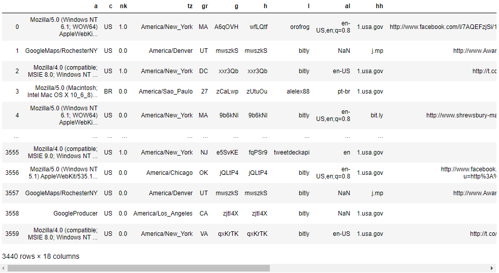

```python
cframe = frame[frame.a.notnull()]

# cframe의 'a'컬럼에 Windows 단어가 있으면 Windows,
# 없으면 Not Windows를 myOs에 저장
# cf) contains()

cframe.a.str.contains('Windows')
# > 0        True
# > 1       False
# > 2        True
# > 3       False
# > 4        True
# >         ...  
# > 3555     True
# > 3556     True
# > 3557    False
# > 3558    False
# > 3559     True
# > Name: a, Length: 3440, dtype: bool

import numpy as np
myOs = np.where(cframe.a.str.contains('Windows'), 'Windows', 'Not Windows')
myOs
# > array(['Windows', 'Not Windows', 'Windows', ..., 'Not Windows',
# >        'Not Windows', 'Windows'], dtype='<U11')
```

- time zone, myOs에 따른 그룹화

```python
tzos = cframe.groupby(['tz', myOs])
tzos.size()
# > tz                            
# >                    Not Windows    245
# >                    Windows        276
# > Africa/Cairo       Windows          3
# > Africa/Casablanca  Windows          1
# > Africa/Ceuta       Windows          2
# >                                  ... 
# > Europe/Warsaw      Windows         15
# > Europe/Zurich      Not Windows      4
# > Pacific/Auckland   Not Windows      3
# >                    Windows          8
# > Pacific/Honolulu   Windows         36
# > Length: 149, dtype: int64

tzos.size().unstack()
```

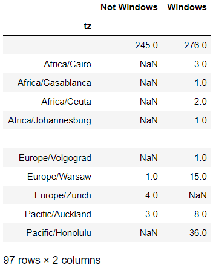

```python
tzos.size().unstack().fillna(0)
```

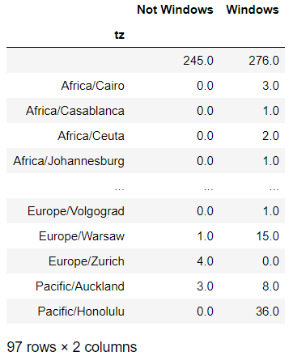

# count관련 함수

```python
def get_counts(seq) : 
    counts = {} # 딕셔너리
    for x in seq :
        if x in counts :
            counts[x]+=1
        else :
            counts[x] = 1
    return counts

counts = get_counts(time_zones)
counts
```

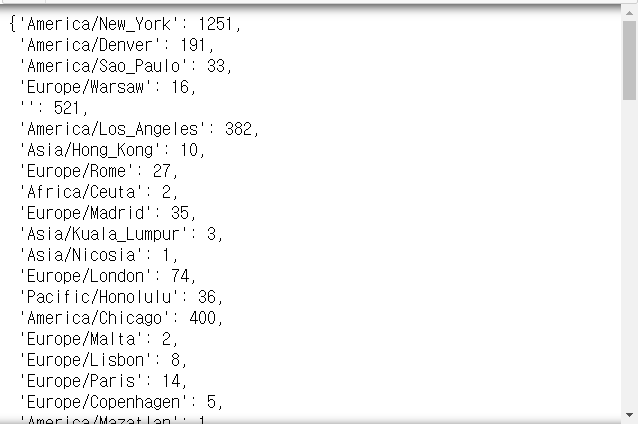

```python
counts['America/New_York']
# > 1251

len(time_zones)
# > 3440
```

- 패키지에 존재하는 함수 사용

```python
from collections import defaultdict

def get_counts2(seq):
    # 값을 0으로 초기화한 dictionary를 생성하라
        #길이가 처음에 지정되진 않음
        # 입력된 값이 key값에 없는 경우 생성하고 연산을 수행
    counts = defaultdict(int) 
    
    for x in seq :
        counts[x] += 1
    return counts

counts = get_counts2(time_zones)
counts
```

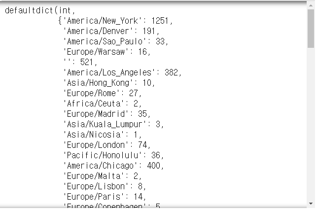

## 위에서 생성한 counts에서 상위 10개 출력

- 가장 많이 등장하는 상위 10개의 표준시간대를 출력하는 함수 작성
- [(1251, 'A/N'), (521, ''), ...]

```python
def top_counts(count_dict, n=10) :
    print(count_dict.items())
    
top_counts(counts)
```

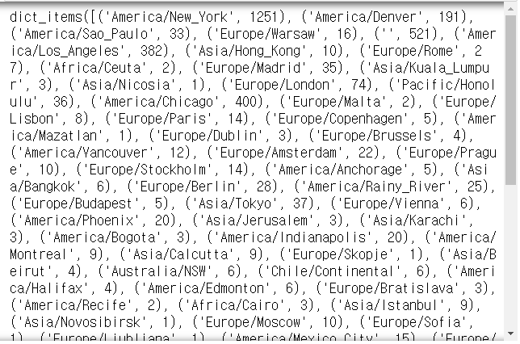

```python
def top_counts(count_dict, n=10) :
    pairs = [(count, tz) for tz, count in count_dict.items()]
    print(pairs)
    
top_counts(counts)
```

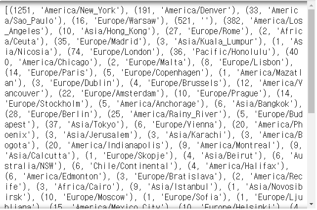

```python
def top_counts(count_dict, n=10) :
    pairs = [(count, tz) for tz, count in count_dict.items()]
    pairs.sort()
    print(pairs)
    
top_counts(counts)
```

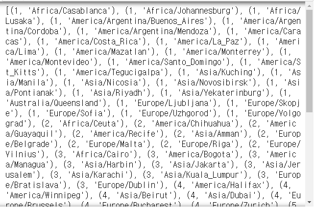

```python
def top_counts(count_dict, n=10) :
    pairs = [(count, tz) for tz, count in count_dict.items()]
    pairs.sort()
    print(pairs[-n:])
    
top_counts(counts)
# > [(33, 'America/Sao_Paulo'), (35, 'Europe/Madrid'), (36, 'Pacific/Honolulu'), (37, 'Asia/Tokyo'), (74, 'Europe/London'), (191, 'America/Denver'), (382, 'America/Los_Angeles'), (400, 'America/Chicago'), (521, ''), (1251, 'America/New_York')]
```

```python
def top_counts(count_dict, n=10) :
    pairs = [(count, tz) for tz, count in count_dict.items()]
    pairs.sort()
    return pairs[-n:]
    
print(top_counts(counts))
# > [(33, 'America/Sao_Paulo'), (35, 'Europe/Madrid'), (36, 'Pacific/Honolulu'), (37, 'Asia/Tokyo'), (74, 'Europe/London'), (191, 'America/Denver'), (382, 'America/Los_Angeles'), (400, 'America/Chicago'), (521, ''), (1251, 'America/New_York')]
```

- 패키지의 함수 이용하여 수행하기

```python
from collections import Counter

counts = Counter(time_zones)
counts
```

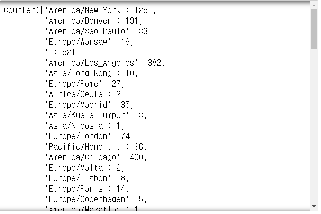

```python
counts.most_common(10)
# > [('America/New_York', 1251),
# >  ('', 521),
# >  ('America/Chicago', 400),
# >  ('America/Los_Angeles', 382),
# >  ('America/Denver', 191),
# >  ('Europe/London', 74),
# >  ('Asia/Tokyo', 37),
# >  ('Pacific/Honolulu', 36),
# >  ('Europe/Madrid', 35),
# >  ('America/Sao_Paulo', 33)]
```

### Conter 함수 사용 예시

```python
mylist = ['a', 'c', 'd', 'a', 'b']
Counter(mylist)
# > Counter({'a': 2, 'c': 1, 'd': 1, 'b': 1})
```

- print문을 통해서 출력하면 값에 의하여 정렬되어 출력된다.

```python
myDict = {'다':3, '나':1, "가":5}
print(Counter(myDict))
# > Counter({'가': 5, '다': 3, '나': 1})

c = Counter(c=3, b=2, a=5)
print(c)
# > Counter({'a': 5, 'c': 3, 'b': 2})

print(sorted(c.elements()))
# > ['a', 'a', 'a', 'a', 'a', 'b', 'b', 'c', 'c', 'c']
```


# 연습문제

- 진수는 어린 동욱이에게 숫자 공부를 시키고 있다.
- 진수는 숫자를 여러 번 말한다.
- 그러면 동욱이는 진수가 부르는 숫자를 공책에 적거나 지운다.
- 숫자를 적을 때는 공책에 그 숫자가 적혀 있지 않을 때이고,
- 숫자를 지울 때는 공책에 그 숫자가 적혀 있을 때이다.
- 처음 공책에는 어떤 숫자도 적혀 있지 않다고 할 때,
- 마지막에 공책에 적힌 숫자의 개수를 구하는 프로그램을 작성하라.

- [입력]
  - 첫 번째 줄에 테스트 케이스의 수 T가 주어진다.
  - 각 테스트 케이스의 첫 번째 줄에는 ‘0’에서 ‘9’사이의 숫자로 이루어진 길이 1이상 104이하의 문자열이 주어진다.
  - 문자열은 진수가 말하는 숫자를 순서대로 나타낸다.

- [출력]
  - 각 테스트 케이스마다 ‘#x’(x는 테스트케이스 번호를 의미하며 1부터 시작한다)를 출력하고,
  - 각 테스트 케이스 마다 마지막에 공책에 적힌 숫자의 개수를 출력한다.

- 입력
  - 3
  - 121
  - 0123456789
  - 555555
  - // 테스트 케이스 개수
  - // 첫 번째 테스트 케이스 문자열
  - // 두 번째 테스트 케이스 문자열

- sample_input.txt
- 출력
  - #1 1	
  - #2 10
  - #3 0

```python
T = int(input())

for i in range(1,T+1) :
    num_list = [0]*10
    num_string = list(input())
    for num in range(10) :
        num_list[num] = num_string.count(str(num))
    c = sum(list(map(lambda x: x%2, num_list)))
    print("#%d %d" %(i, c))
# > 3
# > 121
# > #1 1
# > 0123456789
# > #2 10
# > 555555
# > #3 0
```

