# Day33 딥러닝을 위한 빅데이터 기초 - R(3)

# 지도를 이용한 시각화

```R
install.packages("ggiraphExtra")
library(ggiraphExtra)
```

## USArrests 데이터

```R
head(USArrests)
##            Murder Assault UrbanPop Rape
## Alabama      13.2     236       58 21.2
## Alaska       10.0     263       48 44.5
## Arizona       8.1     294       80 31.0
## Arkansas      8.8     190       50 19.5
## California    9.0     276       91 40.6
## Colorado      7.9     204       78 38.7
```

```R
str(USArrests)
## 'data.frame':    50 obs. of  4 variables:
##  $ Murder  : num  13.2 10 8.1 8.8 9 7.9 3.3 5.9 15.4 17.4 ...
##  $ Assault : int  236 263 294 190 276 204 110 238 335 211 ...
##  $ UrbanPop: int  58 48 80 50 91 78 77 72 80 60 ...
##  $ Rape    : num  21.2 44.5 31 19.5 40.6 38.7 11.1 15.8 31.9 25.8 ...
```

- 행 이름인 주이름을 열로 만들기

```R
library(tibble)
crime = rownames_to_column(USArrests, var = "state")
head(crime)
##        state Murder Assault UrbanPop Rape
## 1    Alabama   13.2     236       58 21.2
## 2     Alaska   10.0     263       48 44.5
## 3    Arizona    8.1     294       80 31.0
## 4   Arkansas    8.8     190       50 19.5
## 5 California    9.0     276       91 40.6
## 6   Colorado    7.9     204       78 38.7
```

- 주이름의 대문자를 소문자로 변경

```R
crime$state = tolower(crime$state)
crime$state
##  [1] "alabama"        "alaska"         "arizona"        "arkansas"      
##  [5] "california"     "colorado"       "connecticut"    "delaware"      
##  [9] "florida"        "georgia"        "hawaii"         "idaho"         
## [13] "illinois"       "indiana"        "iowa"           "kansas"        
## [17] "kentucky"       "louisiana"      "maine"          "maryland"      
## [21] "massachusetts"  "michigan"       "minnesota"      "mississippi"   
## [25] "missouri"       "montana"        "nebraska"       "nevada"        
## [29] "new hampshire"  "new jersey"     "new mexico"     "new york"      
## [33] "north carolina" "north dakota"   "ohio"           "oklahoma"      
## [37] "oregon"         "pennsylvania"   "rhode island"   "south carolina"
## [41] "south dakota"   "tennessee"      "texas"          "utah"          
## [45] "vermont"        "virginia"       "washington"     "west virginia" 
## [49] "wisconsin"      "wyoming"
```

## 미국 지도

```R
install.packages("maps")
library(maps)
library(ggplot2)

head(map_data("state")) # 위 경도 정보 출력
##        long      lat group order  region subregion
## 1 -87.46201 30.38968     1     1 alabama      <NA>
## 2 -87.48493 30.37249     1     2 alabama      <NA>
## 3 -87.52503 30.37249     1     3 alabama      <NA>
## 4 -87.53076 30.33239     1     4 alabama      <NA>
## 5 -87.57087 30.32665     1     5 alabama      <NA>
## 6 -87.58806 30.32665     1     6 alabama      <NA>
```

```R
states_map = map_data("state")
str(states_map)
## 'data.frame':    15537 obs. of  6 variables:
##  $ long     : num  -87.5 -87.5 -87.5 -87.5 -87.6 ...
##  $ lat      : num  30.4 30.4 30.4 30.3 30.3 ...
##  $ group    : num  1 1 1 1 1 1 1 1 1 1 ...
##  $ order    : int  1 2 3 4 5 6 7 8 9 10 ...
##  $ region   : chr  "alabama" "alabama" "alabama" "alabama" ...
##  $ subregion: chr  NA NA NA NA ...
```

- 미국 지도에 crime 데이터 표시하기

```R
install.packages("mapproj")
library(mapproj)

ggChoropleth(data=crime, # 지도에 표시할 데이터
             aes(fill = Murder, map_id = state), 
             # fill = 색깔로 표시할 변수
             # map_id = 지역기준 변수
             map = states_map) # 지도데이터
```

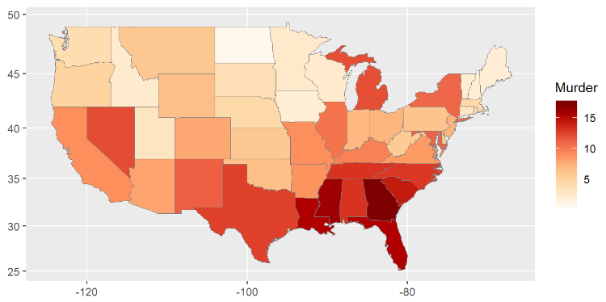

```R
ggChoropleth(data=crime,
             aes(fill = Murder, map_id = state), 
             map = states_map,
             interactive = T)
  # interactive = T
  # : 지도에 커서를 올려 자세히 볼 수 있게 해준다.
```

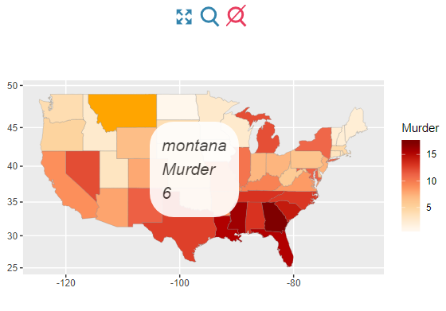


## 우리나라 데이터 & 지도

```R
install.packages("stringi")
install.packages("devtools")

library(stringi)
library(devtools)
```

- 대한민국 행정지도 만들어놓은 github package

```R
install_github("cardiomoon/kormaps2014")
library(kormaps2014)
```

- 시도별 행정지도 데이터

```R
str(kormap1)
## 'data.frame':    8831 obs. of  15 variables:
##  $ id       : chr  "0" "0" "0" "0" ...
##  $ long     : num  138 138 138 138 138 ...
##  $ lat      : num  50.7 50.7 50.7 50.7 50.7 ...
##  $ order    : int  1 2 3 4 5 6 7 8 9 10 ...
##  $ hole     : logi  FALSE FALSE FALSE FALSE FALSE FALSE ...
##  $ piece    : Factor w/ 113 levels "1","2","3","4",..: 1 1 1 1 1 1 1 1 1 1 ...
##  $ group    : Factor w/ 205 levels "0.1","1.1","1.2",..: 1 1 1 1 1 1 1 1 1 1 ...
##  $ SP_ID    : Factor w/ 17 levels "0","1","10","11",..: 1 1 1 1 1 1 1 1 1 1 ...
##  $ SIDO_CD  : Factor w/ 17 levels "11","21","22",..: 1 1 1 1 1 1 1 1 1 1 ...
##  $ SIDO_NM  : Factor w/ 17 levels "강원도","경기도",..: 9 9 9 9 9 9 9 9 9 9 ...
##  $ BASE_YEAR: Factor w/ 1 level "2014": 1 1 1 1 1 1 1 1 1 1 ...
##  $ name     : Factor w/ 17 levels "媛뺤썝\xeb룄",..: 9 9 9 9 9 9 9 9 9 9 ...
##  $ name1    : Factor w/ 17 levels "강원도","경기도",..: 9 9 9 9 9 9 9 9 9 9 ...
##  $ region   : Factor w/ 17 levels "11","21","22",..: 1 1 1 1 1 1 1 1 1 1 ...
##  $ code     : Factor w/ 17 levels "11","21","22",..: 1 1 1 1 1 1 1 1 1 1 ...
```

- 데이터의 글자가 깨져서 나오므로 변환이 필요

```R
str(changeCode(kormap1))
## 'data.frame':    8831 obs. of  15 variables:
##  $ id       : chr  "0" "0" "0" "0" ...
##  $ long     : chr  "137.774352627938" "137.779270931415" "137.780545929866" "137.814504843261" ...
##  $ lat      : chr  "50.6883045072662" "50.6899249663447" "50.6900586920365" "50.6937941360883" ...
##  $ order    : chr  "1" "2" "3" "4" ...
##  $ hole     : chr  "FALSE" "FALSE" "FALSE" "FALSE" ...
##  $ piece    : chr  "1" "1" "1" "1" ...
##  $ group    : chr  "0.1" "0.1" "0.1" "0.1" ...
##  $ SP_ID    : chr  "0" "0" "0" "0" ...
##  $ SIDO_CD  : chr  "11" "11" "11" "11" ...
##  $ SIDO_NM  : chr  NA NA NA NA ...
##  $ BASE_YEAR: chr  "2014" "2014" "2014" "2014" ...
##  $ name     : chr  "서울특별시" "서울특별시" "서울특별시" "서울특별시" ...
##  $ name1    : chr  NA NA NA NA ...
##  $ region   : chr  "11" "11" "11" "11" ...
##  $ code     : chr  "11" "11" "11" "11" ...
```

- 시도별 인구 데이터

```R
str(changeCode(korpop1))
## 'data.frame':    17 obs. of  25 variables:
##  $ C행정구역별_읍면동     : chr  "'11" "'21" "'22" "'23" ...
##  $ 행정구역별_읍면동      : chr  "서울특별시" "부산광역시" "대구광역시" "인천광역시" ...
##  $ 시점                   : chr  "2015" "2015" "2015" "2015" ...
##  $ 총인구_명              : chr  "9904312" "3448737" "2466052" "2890451" ...
##  $ 남자_명                : chr  "4859535" "1701347" "1228511" "1455017" ...
##  $ 여자_명                : chr  "5044777" "1747390" "1237541" "1435434" ...
##  $ 내국인_계_명           : chr  "9567196" "3404667" "2436770" "2822601" ...
##  $ 내국인_남자_명         : chr  "4694317" "1675339" "1211219" "1414793" ...
##  $ 내국인_여자_명         : chr  "4872879" "1729328" "1225551" "1407808" ...
##  $ 외국인_계_명           : chr  "337116" "44070" "29282" "67850" ...
##  $ 외국인_남자_명         : chr  "165218" "26008" "17292" "40224" ...
##  $ 외국인_여자_명         : chr  "171898" "18062" "11990" "27626" ...
##  $ 가구_계_가구           : chr  "3914820" "1348315" "937573" "1066297" ...
##  $ 일반가구_가구          : chr  "3784490" "1335900" "928528" "1045417" ...
##  $ 집단가구_가구          : chr  "2261" "686" "574" "713" ...
##  $ 외국인가구_가구        : chr  "128069" "11729" "8471" "20167" ...
##  $ 주택_계_호             : chr  "2793244" "1164352" "738100" "942244" ...
##  $ 단독주택_호            : chr  "355039" "225697" "155801" "102914" ...
##  $ 아파트_호              : chr  "1636896" "738068" "509068" "577346" ...
##  $ 연립주택_호            : chr  "117235" "32120" "9381" "21589" ...
##  $ 다세대주택_호          : chr  "654372" "154253" "53098" "232346" ...
##  $ 비거주용_건물내_주택_호: chr  "29702" "14214" "10752" "8049" ...
##  $ 주택이외의_거처_호     : chr  "150951" "50810" "15304" "39964" ...
##  $ C행정구역별            : chr  "11" "21" "22" "23" ...
##  $ code                   : chr  "11" "21" "22" "23" ...
```

```R
head(changeCode(korpop1))
##      C행정구역별_읍면동 행정구역별_읍면동 시점 총인구_명 남자_명 여자_명
## 5                   '11        서울특별시 2015   9904312 4859535 5044777
## 455                 '21        부산광역시 2015   3448737 1701347 1747390
## 681                 '22        대구광역시 2015   2466052 1228511 1237541
## 832                 '23        인천광역시 2015   2890451 1455017 1435434
## 995                 '24        광주광역시 2015   1502881  748867  754014
## 1096                '25        대전광역시 2015   1538394  772243  766151
##      내국인_계_명 내국인_남자_명 내국인_여자_명 외국인_계_명 외국인_남자_명
## 5         9567196        4694317        4872879       337116         165218
## 455       3404667        1675339        1729328        44070          26008
## 681       2436770        1211219        1225551        29282          17292
## 832       2822601        1414793        1407808        67850          40224
## 995       1481289         736656         744633        21592          12211
## 1096      1519314         763310         756004        19080           8933
##      외국인_여자_명 가구_계_가구 일반가구_가구 집단가구_가구 외국인가구_가구
## 5            171898      3914820       3784490          2261          128069
## 455           18062      1348315       1335900           686           11729
## 681           11990       937573        928528           574            8471
## 832           27626      1066297       1045417           713           20167
## 995            9381       573181        567157           438            5586
## 1096          10147       588395        582504           420            5471
##      주택_계_호 단독주택_호 아파트_호 연립주택_호 다세대주택_호
## 5       2793244      355039   1636896      117235        654372
## 455     1164352      225697    738068       32120        154253
## 681      738100      155801    509068        9381         53098
## 832      942244      102914    577346       21589        232346
## 995      486527       88401    376731        7396          8517
## 1096     468885       81292    338250       10068         34151
##      비거주용_건물내_주택_호 주택이외의_거처_호 C행정구역별 code
## 5                      29702             150951          11   11
## 455                    14214              50810          21   21
## 681                    10752              15304          22   22
## 832                     8049              39964          23   23
## 995                     5482              10625          24   24
## 1096                    5124              10676          25   25
```

- korpop1 > korpop2 > korpop3로 갈수록 데이터가 자세히 나옴

```R
str(changeCode(korpop2)) # 시군구
## 'data.frame':    306 obs. of  25 variables:
##  $ C행정구역별_읍면동     : chr  "'11010" "'11020" "'11030" "'11040" ...
##  $ 행정구역별_읍면동      : chr  " 종로구" " 중구" " 용산구" " 성동구" ...
##  $ 시점                   : chr  "2015" "2015" "2015" "2015" ...
##  $ 총인구_명              : chr  "161521" "128478" "227282" "295006" ...
##  $ 남자_명                : chr  "79510" "63218" "109980" "146332" ...
##  $ 여자_명                : chr  "82011" "65260" "117302" "148674" ...
##  $ 내국인_계_명           : chr  "146119" "118021" "212189" "285137" ...
##  $ 내국인_남자_명         : chr  "71951" "58223" "102154" "141429" ...
##  $ 내국인_여자_명         : chr  "74168" "59798" "110035" "143708" ...
##  $ 외국인_계_명           : chr  "15402" "10457" "15093" "9869" ...
##  $ 외국인_남자_명         : chr  "7559" "4995" "7826" "4903" ...
##  $ 외국인_여자_명         : chr  "7843" "5462" "7267" "4966" ...
##  $ 가구_계_가구           : chr  "68429" "55508" "96385" "118900" ...
##  $ 일반가구_가구          : chr  "61580" "51205" "90313" "114719" ...
##  $ 집단가구_가구          : chr  "106" "64" "68" "75" ...
##  $ 외국인가구_가구        : chr  "6743" "4239" "6004" "4106" ...
##  $ 주택_계_호             : chr  "43550" "37478" "70723" "82331" ...
##  $ 단독주택_호            : chr  "13103" "6436" "15503" "11250" ...
##  $ 아파트_호              : chr  "12552" "22186" "35343" "59331" ...
##  $ 연립주택_호            : chr  "5395" "1975" "4029" "2076" ...
##  $ 다세대주택_호          : chr  "11664" "6148" "15206" "8610" ...
##  $ 비거주용_건물내_주택_호: chr  "836" "733" "642" "1064" ...
##  $ 주택이외의_거처_호     : chr  "4226" "3549" "4036" "4507" ...
##  $ C행정구역별            : chr  "11010" "11020" "11030" "11040" ...
##  $ code                   : chr  "11010" "11020" "11030" "11040" ...
```

```R
str(changeCode(korpop3)) # 읍면동
## 'data.frame':    3492 obs. of  25 variables:
##  $ C행정구역별_읍면동     : chr  "'1101053" "'1101054" "'1101055" "'1101056" ...
##  $ 행정구역별_읍면동      : chr  "  사직동" "  삼청동" "  부암동" "  평창동" ...
##  $ 시점                   : chr  "2015" "2015" "2015" "2015" ...
##  $ 총인구_명              : chr  "9379" "2808" "11012" "18594" ...
##  $ 남자_명                : chr  "4325" "1340" "5327" "8794" ...
##  $ 여자_명                : chr  "5054" "1468" "5685" "9800" ...
##  $ 내국인_계_명           : chr  "8571" "2601" "10157" "17789" ...
##  $ 내국인_남자_명         : chr  "3934" "1222" "4921" "8393" ...
##  $ 내국인_여자_명         : chr  "4637" "1379" "5236" "9396" ...
##  $ 외국인_계_명           : chr  "808" "207" "855" "805" ...
##  $ 외국인_남자_명         : chr  "391" "118" "406" "401" ...
##  $ 외국인_여자_명         : chr  "417" "89" "449" "404" ...
##  $ 가구_계_가구           : chr  "3897" "1168" "4096" "6645" ...
##  $ 일반가구_가구          : chr  "3562" "1092" "3841" "6310" ...
##  $ 집단가구_가구          : chr  "7" "X" "6" "16" ...
##  $ 외국인가구_가구        : chr  "328" "75" "249" "319" ...
##  $ 주택_계_호             : chr  "2771" "799" "2957" "5754" ...
##  $ 단독주택_호            : chr  "729" "714" "1092" "1533" ...
##  $ 아파트_호              : chr  "1532" "X" "121" "936" ...
##  $ 연립주택_호            : chr  "78" "19" "902" "2180" ...
##  $ 다세대주택_호          : chr  "386" "41" "806" "1044" ...
##  $ 비거주용_건물내_주택_호: chr  "46" "25" "36" "61" ...
##  $ 주택이외의_거처_호     : chr  "633" "35" "197" "130" ...
##  $ C행정구역별            : chr  "1101053" "1101054" "1101055" "1101056" ...
##  $ code                   : chr  "1101053" "1101054" "1101055" "1101056" ...
```

```R
# 시각화를 위해 'dplyr' 호출
library(dplyr)
```

```R
korpop1 = rename(korpop1, pop = "총인구_명",
                 name = "행정구역별_읍면동")

str(changeCode(korpop1))
## 'data.frame':    17 obs. of  25 variables:
##  $ C행정구역별_읍면동     : chr  "'11" "'21" "'22" "'23" ...
##  $ name                   : chr  "서울특별시" "부산광역시" "대구광역시" "인천광역시" ...
##  $ 시점                   : chr  "2015" "2015" "2015" "2015" ...
##  $ pop                    : chr  "9904312" "3448737" "2466052" "2890451" ...
##  $ 남자_명                : chr  "4859535" "1701347" "1228511" "1455017" ...
##  $ 여자_명                : chr  "5044777" "1747390" "1237541" "1435434" ...
##  $ 내국인_계_명           : chr  "9567196" "3404667" "2436770" "2822601" ...
##  $ 내국인_남자_명         : chr  "4694317" "1675339" "1211219" "1414793" ...
##  $ 내국인_여자_명         : chr  "4872879" "1729328" "1225551" "1407808" ...
##  $ 외국인_계_명           : chr  "337116" "44070" "29282" "67850" ...
##  $ 외국인_남자_명         : chr  "165218" "26008" "17292" "40224" ...
##  $ 외국인_여자_명         : chr  "171898" "18062" "11990" "27626" ...
##  $ 가구_계_가구           : chr  "3914820" "1348315" "937573" "1066297" ...
##  $ 일반가구_가구          : chr  "3784490" "1335900" "928528" "1045417" ...
##  $ 집단가구_가구          : chr  "2261" "686" "574" "713" ...
##  $ 외국인가구_가구        : chr  "128069" "11729" "8471" "20167" ...
##  $ 주택_계_호             : chr  "2793244" "1164352" "738100" "942244" ...
##  $ 단독주택_호            : chr  "355039" "225697" "155801" "102914" ...
##  $ 아파트_호              : chr  "1636896" "738068" "509068" "577346" ...
##  $ 연립주택_호            : chr  "117235" "32120" "9381" "21589" ...
##  $ 다세대주택_호          : chr  "654372" "154253" "53098" "232346" ...
##  $ 비거주용_건물내_주택_호: chr  "29702" "14214" "10752" "8049" ...
##  $ 주택이외의_거처_호     : chr  "150951" "50810" "15304" "39964" ...
##  $ C행정구역별            : chr  "11" "21" "22" "23" ...
##  $ code                   : chr  "11" "21" "22" "23" ...
```

```R
head(changeCode(korpop1))
##      C행정구역별_읍면동       name 시점     pop 남자_명 여자_명 내국인_계_명
## 5                   '11 서울특별시 2015 9904312 4859535 5044777      9567196
## 455                 '21 부산광역시 2015 3448737 1701347 1747390      3404667
## 681                 '22 대구광역시 2015 2466052 1228511 1237541      2436770
## 832                 '23 인천광역시 2015 2890451 1455017 1435434      2822601
## 995                 '24 광주광역시 2015 1502881  748867  754014      1481289
## 1096                '25 대전광역시 2015 1538394  772243  766151      1519314
##      내국인_남자_명 내국인_여자_명 외국인_계_명 외국인_남자_명 외국인_여자_명
## 5           4694317        4872879       337116         165218         171898
## 455         1675339        1729328        44070          26008          18062
## 681         1211219        1225551        29282          17292          11990
## 832         1414793        1407808        67850          40224          27626
## 995          736656         744633        21592          12211           9381
## 1096         763310         756004        19080           8933          10147
##      가구_계_가구 일반가구_가구 집단가구_가구 외국인가구_가구 주택_계_호
## 5         3914820       3784490          2261          128069    2793244
## 455       1348315       1335900           686           11729    1164352
## 681        937573        928528           574            8471     738100
## 832       1066297       1045417           713           20167     942244
## 995        573181        567157           438            5586     486527
## 1096       588395        582504           420            5471     468885
##      단독주택_호 아파트_호 연립주택_호 다세대주택_호 비거주용_건물내_주택_호
## 5         355039   1636896      117235        654372                   29702
## 455       225697    738068       32120        154253                   14214
## 681       155801    509068        9381         53098                   10752
## 832       102914    577346       21589        232346                    8049
## 995        88401    376731        7396          8517                    5482
## 1096       81292    338250       10068         34151                    5124
##      주택이외의_거처_호 C행정구역별 code
## 5                150951          11   11
## 455               50810          21   21
## 681               15304          22   22
## 832               39964          23   23
## 995               10625          24   24
## 1096              10676          25   25
```

### 시각화

```R
library(ggplot2)
library(maps)
library(mapproj)
library(ggiraphExtra)
ggChoropleth(data = changeCode(korpop1), 
             aes(fill = pop, map_id = code, 
                 tooltip = name), # 지도위에 표시할 지역명
             map = kormap1,
             interactive = T)
```

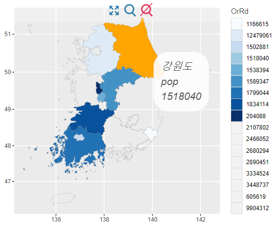

#### ggplot을 이용한 지도 시각화

```R
ggplot(korpop1, aes(map_id=code, fill="총인구_명")) +
  geom_map(map=kormap1)
```

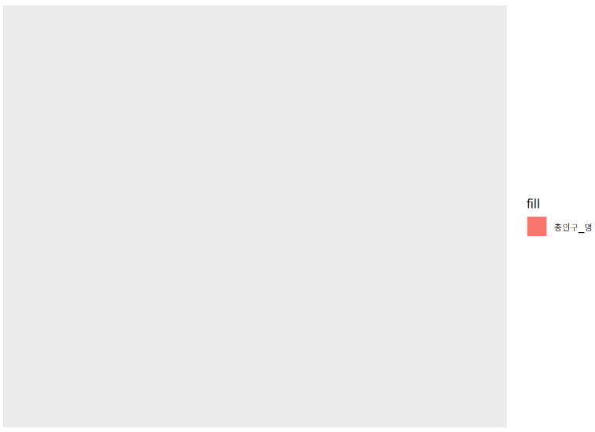

```R
ggplot(korpop1, aes(map_id=code, fill="총인구_명")) +
  geom_map(map=kormap1) +
  expand_limits(x=kormap1$long, y=kormap1$lat)
```

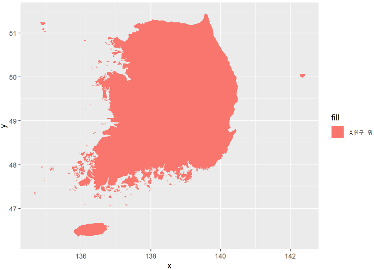

```R
ggplot(korpop1, aes(map_id=code, fill="총인구_명")) +
  geom_map(map=kormap1, colour="black", size=0.1) +
  # 지역별 구분선 옵션
  expand_limits(x=kormap1$long, y=kormap1$lat) +
  # scale_fill_gradientn(colours=c('white', 'orange', 'red')) +
  ggtitle("2015년 인구분포도")
```

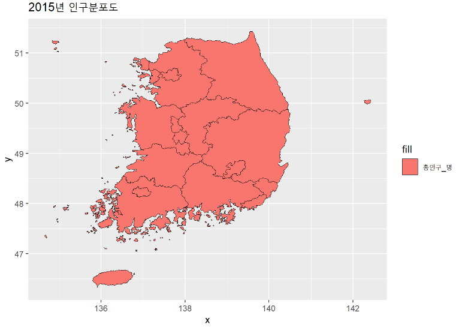


# 머신러닝

- 통계적 기법, 연산 능력, 빅데이터
- 데이터마이닝?
- 머신러닝 : 통계적 기반을 바탕으로 확률적으로 판단
- dataset_for_ml.zip 폴더에 있는 데이터 사용

## 벡터 기본사항

```R
subject_name = c("John", "Jane", "Steve")
temp = c(37, 35, 33)
flu_status = c(TRUE, FALSE, FALSE)

temp[2]
## [1] 35

temp[2:3]
## [1] 35 33

temp[-2]
## [1] 37 33

temp[c(T, F, T)]
## [1] 37 33
```

- 펙터 : 범주값을 갖는 명목형 데이터를 나타낼 때 표현

```R
gender = factor(c("M", "F", "M"))
gender
## [1] M F M
## Levels: F M
```

- factor의 level 지정 가능

```R
blood = factor(c("O", "AB", "A"), 
               levels = c("O", "AB", "A", "B"))
blood
## [1] O  AB A 
## Levels: O AB A B
```

- 순서가 존재하는 데이터의 경우

```R
factor(c("A", "F", "C"), 
       levels = c("A", "B", "C", "D", "F"),
       ordered = TRUE)
## [1] A F C
## Levels: A < B < C < D < F
```

## 리스트

- 리스트 : 순서 X, type이 다양해도 된다.

```R
sb1 = list(fn = subject_name[1],
     temp = temp[1],
     flu = flu_status[1])
sb1
## $fn
## [1] "John"
## 
## $temp
## [1] 37
## 
## $flu
## [1] TRUE
```

```R
sb1$fn
## [1] "John"

sb1[1]
## $fn
## [1] "John"

class(sb1[1])
## [1] "list"

sb1[[1]]
## [1] "John"

class(sb1[[1]])
## [1] "character"

sb1[c("temp", "flu")]
## $temp
## [1] 37
## 
## $flu
## [1] TRUE
```

## data.frame

```R
df = data.frame(sb1)
df
##     fn temp  flu
## 1 John   37 TRUE

str(df)
## 'data.frame':    1 obs. of  3 variables:
##  $ fn  : Factor w/ 1 level "John": 1
##  $ temp: num 37
##  $ flu : logi TRUE

df = data.frame(sb1, stringsAsFactors = F)
# stringsAsFactors : 문자열을 펙터형으로 읽을 것인가?
str(df)
## 'data.frame':    1 obs. of  3 variables:
##  $ fn  : chr "John"
##  $ temp: num 37
##  $ flu : logi TRUE
```

## apply 계열 함수

- 함수 연산은 특정단위로 쉽게 할 수 있도록 지원
- 반복연산
  - for, while(소규모 반복연산)
  - apply(대규모 반복연산)

```R
iris_num = NULL
head(iris)
##   Sepal.Length Sepal.Width Petal.Length Petal.Width Species
## 1          5.1         3.5          1.4         0.2  setosa
## 2          4.9         3.0          1.4         0.2  setosa
## 3          4.7         3.2          1.3         0.2  setosa
## 4          4.6         3.1          1.5         0.2  setosa
## 5          5.0         3.6          1.4         0.2  setosa
## 6          5.4         3.9          1.7         0.4  setosa
```

```R
str(iris)
## 'data.frame':    150 obs. of  5 variables:
##  $ Sepal.Length: num  5.1 4.9 4.7 4.6 5 5.4 4.6 5 4.4 4.9 ...
##  $ Sepal.Width : num  3.5 3 3.2 3.1 3.6 3.9 3.4 3.4 2.9 3.1 ...
##  $ Petal.Length: num  1.4 1.4 1.3 1.5 1.4 1.7 1.4 1.5 1.4 1.5 ...
##  $ Petal.Width : num  0.2 0.2 0.2 0.2 0.2 0.4 0.3 0.2 0.2 0.1 ...
##  $ Species     : Factor w/ 3 levels "setosa","versicolor",..: 1 1 1 1 1 1 1 1 1 1 ...
```

### sapply

- for를 사용한 경우

```R
for(x in 1:ncol(iris)){
  print(iris[1:5,x])
}
## [1] 5.1 4.9 4.7 4.6 5.0
## [1] 3.5 3.0 3.2 3.1 3.6
## [1] 1.4 1.4 1.3 1.5 1.4
## [1] 0.2 0.2 0.2 0.2 0.2
## [1] setosa setosa setosa setosa setosa
## Levels: setosa versicolor virginica
```

```R
for(x in 1:ncol(iris)){
  if(is.numeric(iris[,x])){
    iris_num = cbind(iris_num, iris[,x])
  }
}
head(iris_num)
##      [,1] [,2] [,3] [,4]
## [1,]  5.1  3.5  1.4  0.2
## [2,]  4.9  3.0  1.4  0.2
## [3,]  4.7  3.2  1.3  0.2
## [4,]  4.6  3.1  1.5  0.2
## [5,]  5.0  3.6  1.4  0.2
## [6,]  5.4  3.9  1.7  0.4
```

```R
class(iris_num)
```

- matrix를 data.frame으로 저장하는 방법

```R
iris_num = data.frame(iris_num)
```

- sapply 함수를 사용한 경우

```R
sapply(iris, is.numeric)
## Sepal.Length  Sepal.Width Petal.Length  Petal.Width      Species 
##         TRUE         TRUE         TRUE         TRUE        FALSE
```

```R
head(iris[,sapply(iris, is.numeric)])
##   Sepal.Length Sepal.Width Petal.Length Petal.Width
## 1          5.1         3.5          1.4         0.2
## 2          4.9         3.0          1.4         0.2
## 3          4.7         3.2          1.3         0.2
## 4          4.6         3.1          1.5         0.2
## 5          5.0         3.6          1.4         0.2
## 6          5.4         3.9          1.7         0.4
```

```R
iris_num = iris[,sapply(iris, is.numeric)]
class(iris_num)
## [1] "data.frame"
```

----

```R
iris_num = iris[1:10, 1:4]
set.seed(123)
idx_r = sample(1:10, 2)
idx_c = sample(1:4, 2)
idx_r
## [1]  3 10

idx_c
## [1] 2 4
```

```R
for(i in 1:2){
  iris_num[idx_r[i],idx_c[i]] = NA
}
iris_num
##    Sepal.Length Sepal.Width Petal.Length Petal.Width
## 1           5.1         3.5          1.4         0.2
## 2           4.9         3.0          1.4         0.2
## 3           4.7          NA          1.3         0.2
## 4           4.6         3.1          1.5         0.2
## 5           5.0         3.6          1.4         0.2
## 6           5.4         3.9          1.7         0.4
## 7           4.6         3.4          1.4         0.3
## 8           5.0         3.4          1.5         0.2
## 9           4.4         2.9          1.4         0.2
## 10          4.9         3.1          1.5          NA
```

### apply

- 입력 : 배열, 매트릭스(같은 변수형), 리스트X
- margin 옵션 : 행(1) 또는 열(2) 단위 연산
- 출력 : 매트릭스 or 벡터

```R
apply(iris_num, 1, mean)
##     1     2     3     4     5     6     7     8     9    10 
## 2.550 2.375    NA 2.350 2.550 2.850 2.425 2.525 2.225    NA
```

```R
apply(iris_num, 2, mean)
## Sepal.Length  Sepal.Width Petal.Length  Petal.Width 
##         4.86           NA         1.45           NA
```

```R
apply(iris_num, 2, mean, na.rm = T)
## Sepal.Length  Sepal.Width Petal.Length  Petal.Width 
##    4.8600000    3.3222222    1.4500000    0.2333333
```

- 사용자 정의함수도 적용가능

```R
apply(iris_num, 2, function(x){x*2+1})
##    Sepal.Length Sepal.Width Petal.Length Petal.Width
## 1          11.2         8.0          3.8         1.4
## 2          10.8         7.0          3.8         1.4
## 3          10.4          NA          3.6         1.4
## 4          10.2         7.2          4.0         1.4
## 5          11.0         8.2          3.8         1.4
## 6          11.8         8.8          4.4         1.8
## 7          10.2         7.8          3.8         1.6
## 8          11.0         7.8          4.0         1.4
## 9           9.8         6.8          3.8         1.4
## 10         10.8         7.2          4.0          NA
```

```R
apply(iris_num, 2, function(x){median(x*2+1)})
## Sepal.Length  Sepal.Width Petal.Length  Petal.Width 
##         10.8           NA          3.8           NA
```

```R
apply(iris_num, 2, function(x){median(x*2+1, na.rm = T)})
## Sepal.Length  Sepal.Width Petal.Length  Petal.Width 
##         10.8          7.8          3.8          1.4
```

### lapply : list + apply

- 실행 결과가 list로 출력

cf)

- 데이터 프레임 : 모든 변수가 벡터를 가져야 함
- 리스트 : 벡터, 매트릭스, 데이터프레임

- apply, lapply 함수 비교

```R
apply(iris_num, 2, mean, na.rm = T)
## Sepal.Length  Sepal.Width Petal.Length  Petal.Width 
##    4.8600000    3.3222222    1.4500000    0.2333333

class(apply(iris_num, 2, mean, na.rm = T))
## [1] "numeric"
```

```R
lapply(iris_num, mean, na.rm = T)
## $Sepal.Length
## [1] 4.86
## 
## $Sepal.Width
## [1] 3.322222
## 
## $Petal.Length
## [1] 1.45
## 
## $Petal.Width
## [1] 0.2333333

class(lapply(iris_num, mean, na.rm = T))
## [1] "list"
```

### sapply : lapply와 거의 비슷, 간단하게 기술

- 연산결과가 벡터, list(길이가 다른 경우)

```R
sapply(iris_num, mean, na.rm = T)
## Sepal.Length  Sepal.Width Petal.Length  Petal.Width 
##    4.8600000    3.3222222    1.4500000    0.2333333

class(sapply(iris_num, mean, na.rm = T))
## [1] "numeric"
```

```R
sapply(iris_num, mean, na.rm = T, simplify = F)
## $Sepal.Length
## [1] 4.86
## 
## $Sepal.Width
## [1] 3.322222
## 
## $Petal.Length
## [1] 1.45
## 
## $Petal.Width
## [1] 0.2333333
```

### vapply : sapply + 템플릿 지정

```R
# fivenum : 5개의 요약통계를 구해주는 함수
# 최솟값, Q1, Q1(median), Q3, 최댓값 출력

sapply(iris_num, fivenum)
##      Sepal.Length Sepal.Width Petal.Length Petal.Width
## [1,]          4.4         2.9          1.3         0.2
## [2,]          4.6         3.1          1.4         0.2
## [3,]          4.9         3.4          1.4         0.2
## [4,]          5.0         3.5          1.5         0.2
## [5,]          5.4         3.9          1.7         0.4
```

```R
vapply(iris_num, fivenum, c("Min."=0, "1st."=0, "med."=0, "3rd."=0, "Max."=0))
##      Sepal.Length Sepal.Width Petal.Length Petal.Width
## Min.          4.4         2.9          1.3         0.2
## 1st.          4.6         3.1          1.4         0.2
## med.          4.9         3.4          1.4         0.2
## 3rd.          5.0         3.5          1.5         0.2
## Max.          5.4         3.9          1.7         0.4
```


## usedcars 데이터

```R
usedcars = read.csv("dataset_for_ml/usedcars.csv")
str(usedcars)
## 'data.frame':    150 obs. of  6 variables:
##  $ year        : int  2011 2011 2011 2011 2012 2010 2011 2010 2011 2010 ...
##  $ model       : Factor w/ 3 levels "SE","SEL","SES": 2 2 2 2 1 2 2 2 3 3 ...
##  $ price       : int  21992 20995 19995 17809 17500 17495 17000 16995 16995 16995 ...
##  $ mileage     : int  7413 10926 7351 11613 8367 25125 27393 21026 32655 36116 ...
##  $ color       : Factor w/ 9 levels "Black","Blue",..: 9 4 7 4 8 7 2 7 7 7 ...
##  $ transmission: Factor w/ 2 levels "AUTO","MANUAL": 1 1 1 1 1 1 1 1 1 1 ...
```

- stirng을 factor로 읽지 않도록 옵션 지정

```R
usedcars = read.csv("dataset_for_ml/usedcars.csv",
                    stringsAsFactors = FALSE)
str(usedcars)
## 'data.frame':    150 obs. of  6 variables:
##  $ year        : int  2011 2011 2011 2011 2012 2010 2011 2010 2011 2010 ...
##  $ model       : chr  "SEL" "SEL" "SEL" "SEL" ...
##  $ price       : int  21992 20995 19995 17809 17500 17495 17000 16995 16995 16995 ...
##  $ mileage     : int  7413 10926 7351 11613 8367 25125 27393 21026 32655 36116 ...
##  $ color       : chr  "Yellow" "Gray" "Silver" "Gray" ...
##  $ transmission: chr  "AUTO" "AUTO" "AUTO" "AUTO" ...
```

- 데이터에 factor과 string이 모두 필요한 경우,
- factor와 string의 갯수를 비교해서 많은 type으로 읽은 다음 필요한 번수들만 type을 변경해야한다.

### 기초통계

```R
summary(usedcars)
##       year         model               price          mileage      
##  Min.   :2000   Length:150         Min.   : 3800   Min.   :  4867  
##  1st Qu.:2008   Class :character   1st Qu.:10995   1st Qu.: 27200  
##  Median :2009   Mode  :character   Median :13592   Median : 36385  
##  Mean   :2009                      Mean   :12962   Mean   : 44261  
##  3rd Qu.:2010                      3rd Qu.:14904   3rd Qu.: 55125  
##  Max.   :2012                      Max.   :21992   Max.   :151479  
##     color           transmission      
##  Length:150         Length:150        
##  Class :character   Class :character  
##  Mode  :character   Mode  :character  
##                                       
##                                       
## 
```

```R
summary(usedcars[c("price", "mileage")])
##      price          mileage      
##  Min.   : 3800   Min.   :  4867  
##  1st Qu.:10995   1st Qu.: 27200  
##  Median :13592   Median : 36385  
##  Mean   :12962   Mean   : 44261  
##  3rd Qu.:14904   3rd Qu.: 55125  
##  Max.   :21992   Max.   :151479
```

```R
# 변수의 범위
range(usedcars$price)
## [1]  3800 21992

# 범위의 차
diff(range(usedcars$price))
## [1] 18192

# 변수의 IQR 구간 길이
IQR(usedcars$price)
## [1] 3909.5

# 변수의 백분위수
quantile(usedcars$price)
##      0%     25%     50%     75%    100% 
##  3800.0 10995.0 13591.5 14904.5 21992.0

# 보고 싶은 백분위수 지정해서 출력
quantile(usedcars$price, seq(from=0, to=1, by=0.1))
##      0%     10%     20%     30%     40%     50%     60%     70%     80%     90% 
##  3800.0  8431.9 10759.4 11982.8 12993.8 13591.5 13992.0 14496.2 14999.0 15999.1 
##    100% 
## 21992.0
```

```R
# 분산 : (데이터-평균)**2 합의 평균(n-1)
var(usedcars$price)
## [1] 9749892

# 표준편차 : 분산의 제곱근
sd(usedcars$price)
## [1] 3122.482
```
```R
table(usedcars$year)
## 
## 2000 2001 2002 2003 2004 2005 2006 2007 2008 2009 2010 2011 2012 
##    3    1    1    1    3    2    6   11   14   42   49   16    1

table(usedcars$model)
## 
##  SE SEL SES 
##  78  23  49

table(usedcars$color)
## 
##  Black   Blue   Gold   Gray  Green    Red Silver  White Yellow 
##     35     17      1     16      5     25     32     16      3
```

- 정확한 비중을 알고 싶을 때

```R
c_table = table(usedcars$color)
prop.table(c_table)
## 
##       Black        Blue        Gold        Gray       Green         Red 
## 0.233333333 0.113333333 0.006666667 0.106666667 0.033333333 0.166666667 
##      Silver       White      Yellow 
## 0.213333333 0.106666667 0.020000000

prop.table(c_table)*100
## 
##      Black       Blue       Gold       Gray      Green        Red     Silver 
## 23.3333333 11.3333333  0.6666667 10.6666667  3.3333333 16.6666667 21.3333333 
##      White     Yellow 
## 10.6666667  2.0000000

round(prop.table(c_table)*100, 1)
## 
##  Black   Blue   Gold   Gray  Green    Red Silver  White Yellow 
##   23.3   11.3    0.7   10.7    3.3   16.7   21.3   10.7    2.0
```


### boxplot

```R
boxplot(usedcars$price,
        main = "Car price", ylab = "price($)")
```

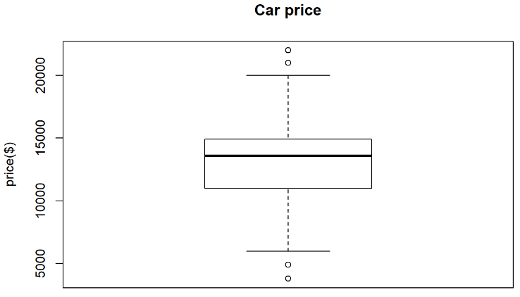

```R
boxplot(usedcars$mileage,
        main = "Car mileage", ylab = "odometer")
```

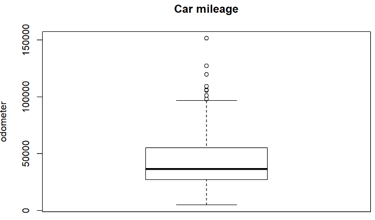

### hist

```R
hist(usedcars$price,
        main = "Car price", xlab = "price($)")
```

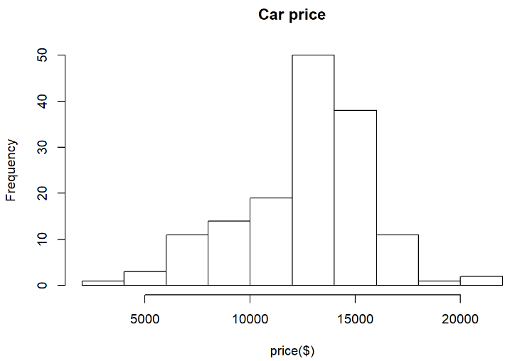

```R
hist(usedcars$mileage,
        main = "Car mileage", xlab = "odometer")
```

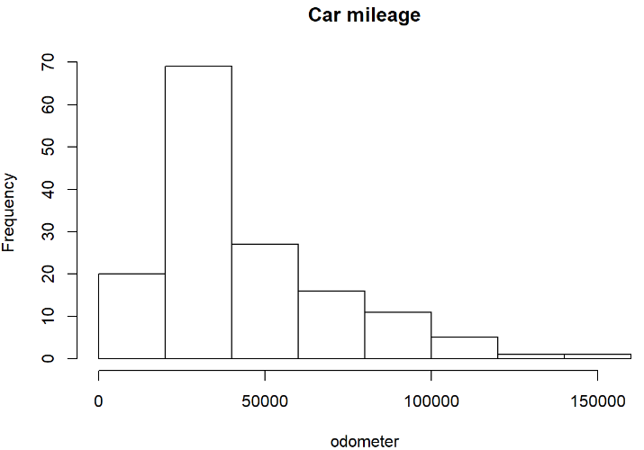

- 이러게 변수 하나로 하는 통계를 일변량 통계라 한다.

- 이변량 통계(두 변수의 관계)

- 다변량 통계(두 개 이상의 변수 관계)

### 산포도(이변량)

```R
plot(x = usedcars$mileage, y=usedcars$price)
```

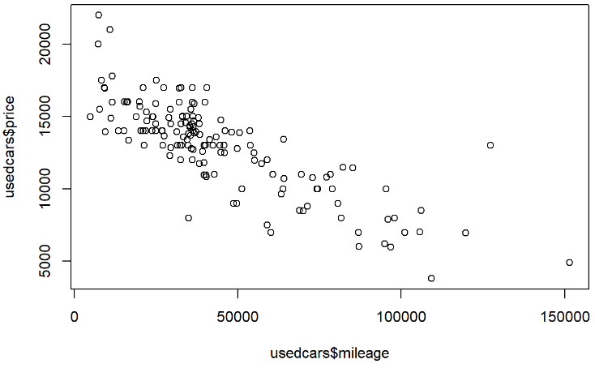

- mileage와 price는 반비례 관계가 존재한다고 생각할 수 있다. (강한 음의 상관관계)

### 빈도분석

```R
usedcars$conservative = usedcars$color %in% c("Black", "Gray", "Silver", "White")
head(usedcars$conservative, 10)
##  [1] FALSE  TRUE  TRUE  TRUE  TRUE  TRUE FALSE  TRUE  TRUE  TRUE

table(usedcars$conservative)
## 
## FALSE  TRUE 
##    51    99
```

```R
install.packages("gmodels")
library(gmodels)
```

```R
# SAS 빈도분석표
CrossTable(x=usedcars$model, y=usedcars$conservative)
## 
##  
##    Cell Contents
## |-------------------------|
## |                       N |
## | Chi-square contribution |
## |           N / Row Total |
## |           N / Col Total |
## |         N / Table Total |
## |-------------------------|
## 
##  
## Total Observations in Table:  150 
## 
##  
##                | usedcars$conservative 
## usedcars$model |     FALSE |      TRUE | Row Total | 
## ---------------|-----------|-----------|-----------|
##             SE |        27 |        51 |        78 | 
##                |     0.009 |     0.004 |           | 
##                |     0.346 |     0.654 |     0.520 | 
##                |     0.529 |     0.515 |           | 
##                |     0.180 |     0.340 |           | 
## ---------------|-----------|-----------|-----------|
##            SEL |         7 |        16 |        23 | 
##                |     0.086 |     0.044 |           | 
##                |     0.304 |     0.696 |     0.153 | 
##                |     0.137 |     0.162 |           | 
##                |     0.047 |     0.107 |           | 
## ---------------|-----------|-----------|-----------|
##            SES |        17 |        32 |        49 | 
##                |     0.007 |     0.004 |           | 
##                |     0.347 |     0.653 |     0.327 | 
##                |     0.333 |     0.323 |           | 
##                |     0.113 |     0.213 |           | 
## ---------------|-----------|-----------|-----------|
##   Column Total |        51 |        99 |       150 | 
##                |     0.340 |     0.660 |           | 
## ---------------|-----------|-----------|-----------|
## 
## 
```

## wisc_bc_data.csv 데이터

```R
wbcd = read.csv("dataset_for_ml/wisc_bc_data.csv", 
                stringsAsFactors = F)
head(wbcd)
##         id diagnosis radius_mean texture_mean perimeter_mean area_mean
## 1 87139402         B       12.32        12.39          78.85     464.1
## 2  8910251         B       10.60        18.95          69.28     346.4
## 3   905520         B       11.04        16.83          70.92     373.2
## 4   868871         B       11.28        13.39          73.00     384.8
## 5  9012568         B       15.19        13.21          97.65     711.8
## 6   906539         B       11.57        19.04          74.20     409.7
##   smoothness_mean compactness_mean concavity_mean points_mean symmetry_mean
## 1         0.10280          0.06981        0.03987     0.03700        0.1959
## 2         0.09688          0.11470        0.06387     0.02642        0.1922
## 3         0.10770          0.07804        0.03046     0.02480        0.1714
## 4         0.11640          0.11360        0.04635     0.04796        0.1771
## 5         0.07963          0.06934        0.03393     0.02657        0.1721
## 6         0.08546          0.07722        0.05485     0.01428        0.2031
##   dimension_mean radius_se texture_se perimeter_se area_se smoothness_se
## 1        0.05955    0.2360     0.6656        1.670   17.43      0.008045
## 2        0.06491    0.4505     1.1970        3.430   27.10      0.007470
## 3        0.06340    0.1967     1.3870        1.342   13.54      0.005158
## 4        0.06072    0.3384     1.3430        1.851   26.33      0.011270
## 5        0.05544    0.1783     0.4125        1.338   17.72      0.005012
## 6        0.06267    0.2864     1.4400        2.206   20.30      0.007278
##   compactness_se concavity_se points_se symmetry_se dimension_se radius_worst
## 1       0.011800      0.01683  0.012410     0.01924     0.002248        13.50
## 2       0.035810      0.03354  0.013650     0.03504     0.003318        11.88
## 3       0.009355      0.01056  0.007483     0.01718     0.002198        12.41
## 4       0.034980      0.02187  0.019650     0.01580     0.003442        11.92
## 5       0.014850      0.01551  0.009155     0.01647     0.001767        16.20
## 6       0.020470      0.04447  0.008799     0.01868     0.003339        13.07
##   texture_worst perimeter_worst area_worst smoothness_worst compactness_worst
## 1         15.64           86.97      549.1           0.1385            0.1266
## 2         22.94           78.28      424.8           0.1213            0.2515
## 3         26.44           79.93      471.4           0.1369            0.1482
## 4         15.77           76.53      434.0           0.1367            0.1822
## 5         15.73          104.50      819.1           0.1126            0.1737
## 6         26.98           86.43      520.5           0.1249            0.1937
##   concavity_worst points_worst symmetry_worst dimension_worst
## 1         0.12420      0.09391         0.2827         0.06771
## 2         0.19160      0.07926         0.2940         0.07587
## 3         0.10670      0.07431         0.2998         0.07881
## 4         0.08669      0.08611         0.2102         0.06784
## 5         0.13620      0.08178         0.2487         0.06766
## 6         0.25600      0.06664         0.3035         0.08284
```

```R
str(wbcd)
## 'data.frame':    569 obs. of  32 variables:
##  $ id               : int  87139402 8910251 905520 868871 9012568 906539 925291 87880 862989 89827 ...
##  $ diagnosis        : chr  "B" "B" "B" "B" ...
##  $ radius_mean      : num  12.3 10.6 11 11.3 15.2 ...
##  $ texture_mean     : num  12.4 18.9 16.8 13.4 13.2 ...
##  $ perimeter_mean   : num  78.8 69.3 70.9 73 97.7 ...
##  $ area_mean        : num  464 346 373 385 712 ...
##  $ smoothness_mean  : num  0.1028 0.0969 0.1077 0.1164 0.0796 ...
##  $ compactness_mean : num  0.0698 0.1147 0.078 0.1136 0.0693 ...
##  $ concavity_mean   : num  0.0399 0.0639 0.0305 0.0464 0.0339 ...
##  $ points_mean      : num  0.037 0.0264 0.0248 0.048 0.0266 ...
##  $ symmetry_mean    : num  0.196 0.192 0.171 0.177 0.172 ...
##  $ dimension_mean   : num  0.0595 0.0649 0.0634 0.0607 0.0554 ...
##  $ radius_se        : num  0.236 0.451 0.197 0.338 0.178 ...
##  $ texture_se       : num  0.666 1.197 1.387 1.343 0.412 ...
##  $ perimeter_se     : num  1.67 3.43 1.34 1.85 1.34 ...
##  $ area_se          : num  17.4 27.1 13.5 26.3 17.7 ...
##  $ smoothness_se    : num  0.00805 0.00747 0.00516 0.01127 0.00501 ...
##  $ compactness_se   : num  0.0118 0.03581 0.00936 0.03498 0.01485 ...
##  $ concavity_se     : num  0.0168 0.0335 0.0106 0.0219 0.0155 ...
##  $ points_se        : num  0.01241 0.01365 0.00748 0.01965 0.00915 ...
##  $ symmetry_se      : num  0.0192 0.035 0.0172 0.0158 0.0165 ...
##  $ dimension_se     : num  0.00225 0.00332 0.0022 0.00344 0.00177 ...
##  $ radius_worst     : num  13.5 11.9 12.4 11.9 16.2 ...
##  $ texture_worst    : num  15.6 22.9 26.4 15.8 15.7 ...
##  $ perimeter_worst  : num  87 78.3 79.9 76.5 104.5 ...
##  $ area_worst       : num  549 425 471 434 819 ...
##  $ smoothness_worst : num  0.139 0.121 0.137 0.137 0.113 ...
##  $ compactness_worst: num  0.127 0.252 0.148 0.182 0.174 ...
##  $ concavity_worst  : num  0.1242 0.1916 0.1067 0.0867 0.1362 ...
##  $ points_worst     : num  0.0939 0.0793 0.0743 0.0861 0.0818 ...
##  $ symmetry_worst   : num  0.283 0.294 0.3 0.21 0.249 ...
##  $ dimension_worst  : num  0.0677 0.0759 0.0788 0.0678 0.0677 ...
```

- 환자의 id는 필요 없으므로 제거

```R
wbcd = wbcd[-1]
str(wbcd)
## 'data.frame':    569 obs. of  31 variables:
##  $ diagnosis        : chr  "B" "B" "B" "B" ...
##  $ radius_mean      : num  12.3 10.6 11 11.3 15.2 ...
##  $ texture_mean     : num  12.4 18.9 16.8 13.4 13.2 ...
##  $ perimeter_mean   : num  78.8 69.3 70.9 73 97.7 ...
##  $ area_mean        : num  464 346 373 385 712 ...
##  $ smoothness_mean  : num  0.1028 0.0969 0.1077 0.1164 0.0796 ...
##  $ compactness_mean : num  0.0698 0.1147 0.078 0.1136 0.0693 ...
##  $ concavity_mean   : num  0.0399 0.0639 0.0305 0.0464 0.0339 ...
##  $ points_mean      : num  0.037 0.0264 0.0248 0.048 0.0266 ...
##  $ symmetry_mean    : num  0.196 0.192 0.171 0.177 0.172 ...
##  $ dimension_mean   : num  0.0595 0.0649 0.0634 0.0607 0.0554 ...
##  $ radius_se        : num  0.236 0.451 0.197 0.338 0.178 ...
##  $ texture_se       : num  0.666 1.197 1.387 1.343 0.412 ...
##  $ perimeter_se     : num  1.67 3.43 1.34 1.85 1.34 ...
##  $ area_se          : num  17.4 27.1 13.5 26.3 17.7 ...
##  $ smoothness_se    : num  0.00805 0.00747 0.00516 0.01127 0.00501 ...
##  $ compactness_se   : num  0.0118 0.03581 0.00936 0.03498 0.01485 ...
##  $ concavity_se     : num  0.0168 0.0335 0.0106 0.0219 0.0155 ...
##  $ points_se        : num  0.01241 0.01365 0.00748 0.01965 0.00915 ...
##  $ symmetry_se      : num  0.0192 0.035 0.0172 0.0158 0.0165 ...
##  $ dimension_se     : num  0.00225 0.00332 0.0022 0.00344 0.00177 ...
##  $ radius_worst     : num  13.5 11.9 12.4 11.9 16.2 ...
##  $ texture_worst    : num  15.6 22.9 26.4 15.8 15.7 ...
##  $ perimeter_worst  : num  87 78.3 79.9 76.5 104.5 ...
##  $ area_worst       : num  549 425 471 434 819 ...
##  $ smoothness_worst : num  0.139 0.121 0.137 0.137 0.113 ...
##  $ compactness_worst: num  0.127 0.252 0.148 0.182 0.174 ...
##  $ concavity_worst  : num  0.1242 0.1916 0.1067 0.0867 0.1362 ...
##  $ points_worst     : num  0.0939 0.0793 0.0743 0.0861 0.0818 ...
##  $ symmetry_worst   : num  0.283 0.294 0.3 0.21 0.249 ...
##  $ dimension_worst  : num  0.0677 0.0759 0.0788 0.0678 0.0677 ...
```

### knn

- 레이블이 없는 추정 모델
- 얼굴인식, 숫자인식, 추천시스템, 유전자 data패턴인식 등에서 사용
- 적절한 k를 선택하는 것이 고려사항
  - k가 클 경우 : underfitting
  - k가 작을 경우 : overfitting
- 유클리디안 거리를 사용하여 근접 데이터를 찾음
  - 변수들의 범위가 비슷해야 영향이 비슷하므로 정규화를 통해 변수들의 범위를 맞춰준다.
- 명목형 변수 -> 수치 변화
  - male(1), female(2) =>dummy coding
  - hot, medium, cold
    - hot, not hot = 1, 0
    - medium, not medium = 1, 0


```R
wbcd$diagosis = factor(wbcd$diagnosis, levels = c("B", "M"),
       labels = c("Benign", "Malignant"))
# M : 악성종양(암)

table(wbcd$diagnosis)
## 
##   B   M 
## 357 212
```

```R
round(prop.table(table(wbcd$diagnosis))*100, 1)
## 
##    B    M 
## 62.7 37.3
```

```R
summary(wbcd[c("radius_mean", "area_mean", "smoothness_mean")])
##   radius_mean       area_mean      smoothness_mean  
##  Min.   : 6.981   Min.   : 143.5   Min.   :0.05263  
##  1st Qu.:11.700   1st Qu.: 420.3   1st Qu.:0.08637  
##  Median :13.370   Median : 551.1   Median :0.09587  
##  Mean   :14.127   Mean   : 654.9   Mean   :0.09636  
##  3rd Qu.:15.780   3rd Qu.: 782.7   3rd Qu.:0.10530  
##  Max.   :28.110   Max.   :2501.0   Max.   :0.16340
```

- 변수에 따라 변수의 범위와 크기가 다르므로 표준화를 실시하기 위하여 함수 만들기

```R
normalize = function(x){
  return ((x - min(x)) / (max(x) - min(x)))
}

normalize(c(1,2,3,4,5))
## [1] 0.00 0.25 0.50 0.75 1.00
```

```R
wbcd_n = as.data.frame(lapply(wbcd[2:31], normalize))
class(wbcd_n)
## [1] "data.frame"
```

```R
head(wbcd_n)
##   radius_mean texture_mean perimeter_mean  area_mean smoothness_mean
## 1   0.2526859    0.0906324      0.2422777 0.13599152       0.4529205
## 2   0.1712812    0.3124789      0.1761454 0.08606575       0.3994764
## 3   0.1921056    0.2407846      0.1874784 0.09743372       0.4971563
## 4   0.2034644    0.1244505      0.2018520 0.10235419       0.5756974
## 5   0.3885182    0.1183632      0.3721927 0.24106045       0.2437483
## 6   0.2171896    0.3155225      0.2101444 0.11291622       0.2963799
##   compactness_mean concavity_mean points_mean symmetry_mean dimension_mean
## 1        0.1546838     0.09341612  0.18389662     0.4540404      0.2019798
## 2        0.2923747     0.14964855  0.13131213     0.4353535      0.3148694
## 3        0.1799276     0.07136832  0.12326044     0.3303030      0.2830666
## 4        0.2890007     0.10859888  0.23836978     0.3590909      0.2266217
## 5        0.1532421     0.07949859  0.13205765     0.3338384      0.1154170
## 6        0.1774124     0.12851453  0.07097416     0.4904040      0.2676917
##    radius_se texture_se perimeter_se    area_se smoothness_se compactness_se
## 1 0.04508419 0.06749470   0.04301937 0.01985065     0.2152497     0.07170968
## 2 0.12275937 0.18493635   0.12594826 0.03791198     0.1957032     0.25203533
## 3 0.03085280 0.22692716   0.02756443 0.01258503     0.1171092     0.05334665
## 4 0.08216549 0.21720297   0.05154785 0.03647380     0.3248802     0.24580166
## 5 0.02418975 0.01155852   0.02737596 0.02039231     0.1121460     0.09461652
## 6 0.06333514 0.23864038   0.06827498 0.02521115     0.1891763     0.13682519
##   concavity_se points_se symmetry_se dimension_se radius_worst texture_worst
## 1   0.04250000 0.2350824   0.1598188   0.04675041    0.1981501    0.09648188
## 2   0.08469697 0.2585717   0.3821410   0.08371682    0.1405194    0.29104478
## 3   0.02666667 0.1417503   0.1308324   0.04502301    0.1593739    0.38432836
## 4   0.05522727 0.3722296   0.1114144   0.08800077    0.1419424    0.09994670
## 5   0.03916667 0.1734230   0.1208420   0.03013280    0.2942014    0.09888060
## 6   0.11229798 0.1666793   0.1519390   0.08444233    0.1828531    0.39872068
##   perimeter_worst area_worst smoothness_worst compactness_worst concavity_worst
## 1       0.1820808 0.08943669        0.4446279        0.09635106      0.09920128
## 2       0.1388017 0.05888714        0.3310440        0.21752966      0.15303514
## 3       0.1470193 0.07034015        0.4340619        0.11730749      0.08522364
## 4       0.1300862 0.06114825        0.4327412        0.15029446      0.06924121
## 5       0.2693859 0.15579532        0.2735918        0.14204771      0.10878594
## 6       0.1793914 0.08240759        0.3548174        0.16145181      0.20447284
##   points_worst symmetry_worst dimension_worst
## 1    0.3227148      0.2487680      0.08310376
## 2    0.2723711      0.2710428      0.13662600
## 3    0.2553608      0.2824759      0.15590975
## 4    0.2959107      0.1058545      0.08395645
## 5    0.2810309      0.1817465      0.08277581
## 6    0.2290034      0.2897694      0.18234291
```

```R
summary(wbcd_n$area_mean)
##    Min. 1st Qu.  Median    Mean 3rd Qu.    Max. 
##  0.0000  0.1174  0.1729  0.2169  0.2711  1.0000
```

- train과 test 데이터 임의로 분할

```R
wbcd_trian = wbcd_n[1:469, ]
wbcd_test = wbcd_n[470:569, ]

wbcd_trian_labels = wbcd[1:469, 1]
wbcd_test_labels = wbcd[470:569, 1]
```

- knn을 위한 library 호출

```R
library(class)
```

- knn적용

```R
wbcd_test_pred = knn(train = wbcd_trian, 
                     test = wbcd_test, 
                     cl = wbcd_trian_labels, k=21)
wbcd_test_pred
##   [1] B B B B M B M B M B M B M M B B M B M B M M M M B B B B M M M B M M B B B
##  [38] B B M M B M M B M M M M M B B B B B B B B M B B B B B M M B B B B B M B B
##  [75] M M B B B B B B B M B B M B B B B M B B B B B M B M
## Levels: B M
```

- 실제값과 예측값 비교

```R
table(wbcd_test_pred, wbcd_test_labels)
##               wbcd_test_labels
## wbcd_test_pred  B  M
##              B 61  2
##              M  0 37
```

```R
# or
library(gmodels)
CrossTable(x = wbcd_test_labels, y = wbcd_test_pred,
           prop.chisq = FALSE)
## 
##  
##    Cell Contents
## |-------------------------|
## |                       N |
## |           N / Row Total |
## |           N / Col Total |
## |         N / Table Total |
## |-------------------------|
## 
##  
## Total Observations in Table:  100 
## 
##  
##                  | wbcd_test_pred 
## wbcd_test_labels |         B |         M | Row Total | 
## -----------------|-----------|-----------|-----------|
##                B |        61 |         0 |        61 | 
##                  |     1.000 |     0.000 |     0.610 | 
##                  |     0.968 |     0.000 |           | 
##                  |     0.610 |     0.000 |           | 
## -----------------|-----------|-----------|-----------|
##                M |         2 |        37 |        39 | 
##                  |     0.051 |     0.949 |     0.390 | 
##                  |     0.032 |     1.000 |           | 
##                  |     0.020 |     0.370 |           | 
## -----------------|-----------|-----------|-----------|
##     Column Total |        63 |        37 |       100 | 
##                  |     0.630 |     0.370 |           | 
## -----------------|-----------|-----------|-----------|
## 
## 
```

- 정규화:표준화는 최대/최소값이 없음
  - 그 값이 중심 방향으로 축소되지 않음.

- z점수 표준화

```R
wbcd_z = as.data.frame(scale(wbcd[-c(1, 32)]))
summary(wbcd_z)
##   radius_mean       texture_mean     perimeter_mean      area_mean      
##  Min.   :-2.0279   Min.   :-2.2273   Min.   :-1.9828   Min.   :-1.4532  
##  1st Qu.:-0.6888   1st Qu.:-0.7253   1st Qu.:-0.6913   1st Qu.:-0.6666  
##  Median :-0.2149   Median :-0.1045   Median :-0.2358   Median :-0.2949  
##  Mean   : 0.0000   Mean   : 0.0000   Mean   : 0.0000   Mean   : 0.0000  
##  3rd Qu.: 0.4690   3rd Qu.: 0.5837   3rd Qu.: 0.4992   3rd Qu.: 0.3632  
##  Max.   : 3.9678   Max.   : 4.6478   Max.   : 3.9726   Max.   : 5.2459  
##  smoothness_mean    compactness_mean  concavity_mean     points_mean     
##  Min.   :-3.10935   Min.   :-1.6087   Min.   :-1.1139   Min.   :-1.2607  
##  1st Qu.:-0.71034   1st Qu.:-0.7464   1st Qu.:-0.7431   1st Qu.:-0.7373  
##  Median :-0.03486   Median :-0.2217   Median :-0.3419   Median :-0.3974  
##  Mean   : 0.00000   Mean   : 0.0000   Mean   : 0.0000   Mean   : 0.0000  
##  3rd Qu.: 0.63564   3rd Qu.: 0.4934   3rd Qu.: 0.5256   3rd Qu.: 0.6464  
##  Max.   : 4.76672   Max.   : 4.5644   Max.   : 4.2399   Max.   : 3.9245  
##  symmetry_mean      dimension_mean      radius_se         texture_se     
##  Min.   :-2.74171   Min.   :-1.8183   Min.   :-1.0590   Min.   :-1.5529  
##  1st Qu.:-0.70262   1st Qu.:-0.7220   1st Qu.:-0.6230   1st Qu.:-0.6942  
##  Median :-0.07156   Median :-0.1781   Median :-0.2920   Median :-0.1973  
##  Mean   : 0.00000   Mean   : 0.0000   Mean   : 0.0000   Mean   : 0.0000  
##  3rd Qu.: 0.53031   3rd Qu.: 0.4706   3rd Qu.: 0.2659   3rd Qu.: 0.4661  
##  Max.   : 4.48081   Max.   : 4.9066   Max.   : 8.8991   Max.   : 6.6494  
##   perimeter_se        area_se        smoothness_se     compactness_se   
##  Min.   :-1.0431   Min.   :-0.7372   Min.   :-1.7745   Min.   :-1.2970  
##  1st Qu.:-0.6232   1st Qu.:-0.4943   1st Qu.:-0.6235   1st Qu.:-0.6923  
##  Median :-0.2864   Median :-0.3475   Median :-0.2201   Median :-0.2808  
##  Mean   : 0.0000   Mean   : 0.0000   Mean   : 0.0000   Mean   : 0.0000  
##  3rd Qu.: 0.2428   3rd Qu.: 0.1067   3rd Qu.: 0.3680   3rd Qu.: 0.3893  
##  Max.   : 9.4537   Max.   :11.0321   Max.   : 8.0229   Max.   : 6.1381  
##   concavity_se       points_se        symmetry_se       dimension_se    
##  Min.   :-1.0566   Min.   :-1.9118   Min.   :-1.5315   Min.   :-1.0960  
##  1st Qu.:-0.5567   1st Qu.:-0.6739   1st Qu.:-0.6511   1st Qu.:-0.5846  
##  Median :-0.1989   Median :-0.1404   Median :-0.2192   Median :-0.2297  
##  Mean   : 0.0000   Mean   : 0.0000   Mean   : 0.0000   Mean   : 0.0000  
##  3rd Qu.: 0.3365   3rd Qu.: 0.4722   3rd Qu.: 0.3554   3rd Qu.: 0.2884  
##  Max.   :12.0621   Max.   : 6.6438   Max.   : 7.0657   Max.   : 9.8429  
##   radius_worst     texture_worst      perimeter_worst     area_worst     
##  Min.   :-1.7254   Min.   :-2.22204   Min.   :-1.6919   Min.   :-1.2213  
##  1st Qu.:-0.6743   1st Qu.:-0.74797   1st Qu.:-0.6890   1st Qu.:-0.6416  
##  Median :-0.2688   Median :-0.04348   Median :-0.2857   Median :-0.3409  
##  Mean   : 0.0000   Mean   : 0.00000   Mean   : 0.0000   Mean   : 0.0000  
##  3rd Qu.: 0.5216   3rd Qu.: 0.65776   3rd Qu.: 0.5398   3rd Qu.: 0.3573  
##  Max.   : 4.0906   Max.   : 3.88249   Max.   : 4.2836   Max.   : 5.9250  
##  smoothness_worst  compactness_worst concavity_worst    points_worst    
##  Min.   :-2.6803   Min.   :-1.4426   Min.   :-1.3047   Min.   :-1.7435  
##  1st Qu.:-0.6906   1st Qu.:-0.6805   1st Qu.:-0.7558   1st Qu.:-0.7557  
##  Median :-0.0468   Median :-0.2693   Median :-0.2180   Median :-0.2233  
##  Mean   : 0.0000   Mean   : 0.0000   Mean   : 0.0000   Mean   : 0.0000  
##  3rd Qu.: 0.5970   3rd Qu.: 0.5392   3rd Qu.: 0.5307   3rd Qu.: 0.7119  
##  Max.   : 3.9519   Max.   : 5.1084   Max.   : 4.6965   Max.   : 2.6835  
##  symmetry_worst    dimension_worst  
##  Min.   :-2.1591   Min.   :-1.6004  
##  1st Qu.:-0.6413   1st Qu.:-0.6913  
##  Median :-0.1273   Median :-0.2163  
##  Mean   : 0.0000   Mean   : 0.0000  
##  3rd Qu.: 0.4497   3rd Qu.: 0.4504  
##  Max.   : 6.0407   Max.   : 6.8408
```

- 보통 data :1000건 일 때
  - train(700), test(300) 으로 분할
  - train(700)을 train(490), validation(210)으로 재분할

# 연습문제

## 1.

- 위에서 z점수 표준화를 실시한 데이터를 이용해
- 모델 -> 테스트 -> 정확도

### A.

```R
wbcd_z_train = wbcd_z[c(1:469), ]
wbcd_z_test = wbcd_z[c(470:569), ]
for(i in 0:11){
  print(2*i+1)
  wbcd_z_pred = knn(train = wbcd_z_train,test = wbcd_z_test,
                  cl = wbcd_trian_labels, k=2*i+1)
print(table(wbcd_z_pred, wbcd_test_labels))
}
## [1] 1
##            wbcd_test_labels
## wbcd_z_pred  B  M
##           B 59  3
##           M  2 36
## [1] 3
##            wbcd_test_labels
## wbcd_z_pred  B  M
##           B 59  2
##           M  2 37
## [1] 5
##            wbcd_test_labels
## wbcd_z_pred  B  M
##           B 60  2
##           M  1 37
## [1] 7
##            wbcd_test_labels
## wbcd_z_pred  B  M
##           B 60  3
##           M  1 36
## [1] 9
##            wbcd_test_labels
## wbcd_z_pred  B  M
##           B 60  3
##           M  1 36
## [1] 11
##            wbcd_test_labels
## wbcd_z_pred  B  M
##           B 60  3
##           M  1 36
## [1] 13
##            wbcd_test_labels
## wbcd_z_pred  B  M
##           B 59  3
##           M  2 36
## [1] 15
##            wbcd_test_labels
## wbcd_z_pred  B  M
##           B 61  3
##           M  0 36
## [1] 17
##            wbcd_test_labels
## wbcd_z_pred  B  M
##           B 60  3
##           M  1 36
## [1] 19
##            wbcd_test_labels
## wbcd_z_pred  B  M
##           B 61  4
##           M  0 35
## [1] 21
##            wbcd_test_labels
## wbcd_z_pred  B  M
##           B 61  5
##           M  0 34
## [1] 23
##            wbcd_test_labels
## wbcd_z_pred  B  M
##           B 61  5
##           M  0 34
```

- k가 5와 15일 때 오분류 3개씩으로 가장 적게 나타났다.
- k=15의 경우, 오분류 3개 모두 악성 종양을 양성 종양으로 예측하였고,
- k=5의 경우, 오분류 중 2개는 악성 종양을 양성 종양으로 나머지 1개는 양성 종양을 악성 종양으로 예측하였다.

## 2.

- iris(1:35, 51:85, 101:135) => train
- 나머지 => test
- 분류

### A.

```R
iris_train = iris[c(1:35, 51:85, 101:135), ]
iris_test = iris[c(36:50, 86:100, 136:150), ]

for(i in 0:4){
  print(2*i+1)
  iris_predict = knn(train = iris_train[, -5],
                     test = iris_test[, -5], 
                     cl = iris_train[, 5], k=2*i+1)
  print(table(iris_predict, iris_test[, 5]))
}
## [1] 1
##             
## iris_predict setosa versicolor virginica
##   setosa         15          0         0
##   versicolor      0         15         0
##   virginica       0          0        15
## [1] 3
##             
## iris_predict setosa versicolor virginica
##   setosa         15          0         0
##   versicolor      0         15         0
##   virginica       0          0        15
## [1] 5
##             
## iris_predict setosa versicolor virginica
##   setosa         15          0         0
##   versicolor      0         15         1
##   virginica       0          0        14
## [1] 7
##             
## iris_predict setosa versicolor virginica
##   setosa         15          0         0
##   versicolor      0         15         1
##   virginica       0          0        14
## [1] 9
##             
## iris_predict setosa versicolor virginica
##   setosa         15          0         0
##   versicolor      0         15         1
##   virginica       0          0        14
```

- k가 1, 3, 5일 때 모두 제대로 예측하여 오분류 0를 나타냈다.