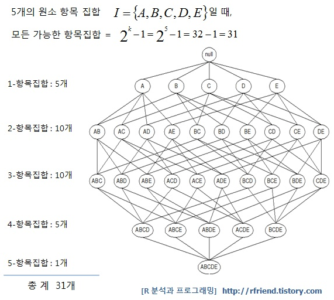
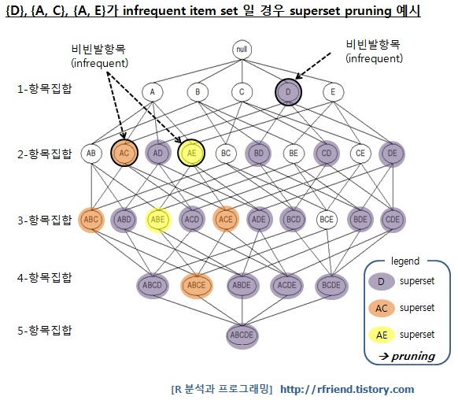
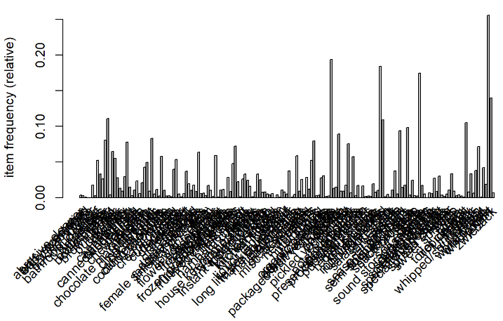
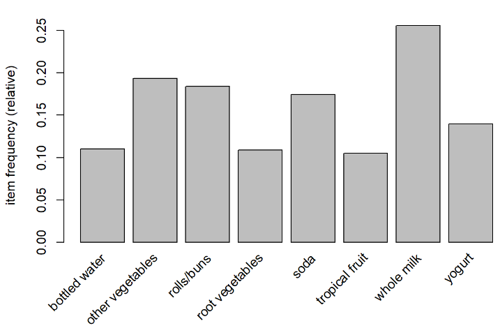
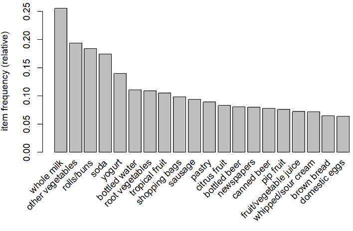
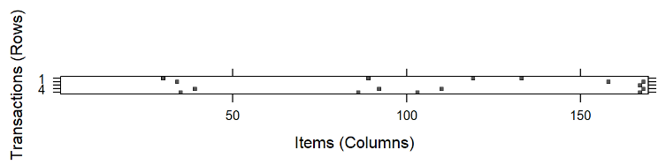
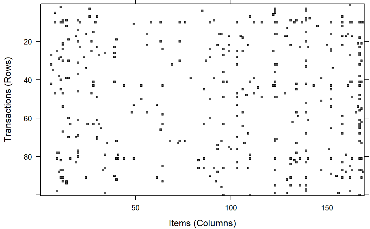
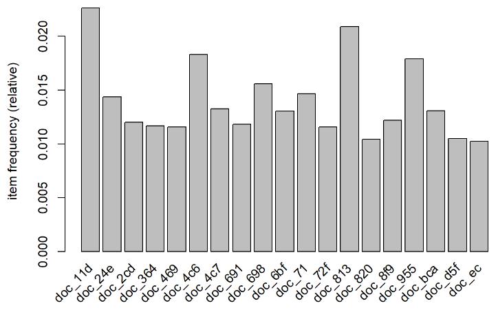
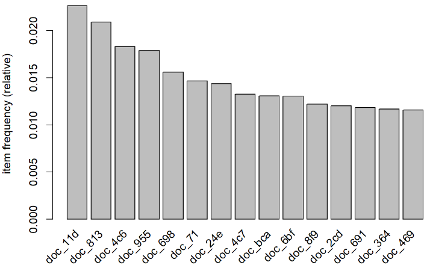
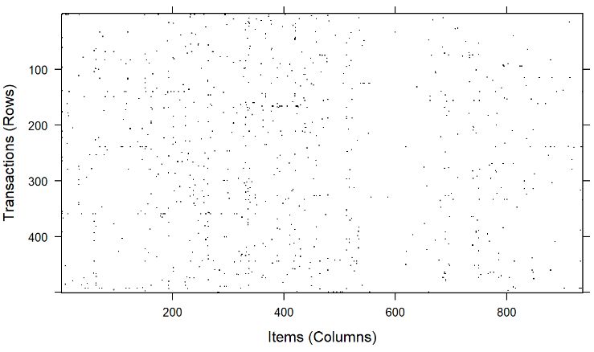

# Day34 딥러닝을 위한 빅데이터 기초 - R(4)

[toc]


- 차원
  - 머신러닝 : 컴퓨터가 data로 부터 이론을 만들도록 하는 방법
  - 사물 정의? 사물의 특징들로 설명
    - 한가지 특징으로만 판단할 경우 편견에 빠질 가능성이 존재
    - 따라서 다각도의 관점에서 사물의 특징들을 발견하고 알려줘야 한다.
    - 특징을 각각 한 축으로 고려하여 좌표로 데이터를 설명하는 것은 선형대수학과 관련이 된다.
    - 데이터 프레임으로 나타내면, 하나의 행이 하나의 사물을 의미한다.
      - ex. 동물
        - 꼬리(1), 다리(4), 짖다(1), 몸(50)
        - 이 데이터를 바탕으로 컴퓨터가 학습
        - 1 4 1 50 => 개
        - 1 4 1 20 => 고양이
        - ....
        - 이렇게 학습된 데이터를 가지고 test 데이터가 주어졌을 때, 각 동물일 확률을 반환해서 softmax를 바탕으로 가장 높은 확률 값을 가진 동물로 예측한다.

# 기계학습(머신러닝)

- 지도학습 : 지도자(교사)가 존재 => 문제(Data)의 답(label)이 존재

- 비지도학습 : 답X, 문제만 존재

- 강화학습 : 쉽게말해서 잘하면 칭찬해주고 못하면 벌을 줘서 잘하도록 만드는 것

## 지도학습(Supervised)

- 답이 존재하고, 컴퓨터가 잘 맞추도록 하는 방법
- 예측값의 모습을 표현하는 용어
  - 편향(bias)
    - 컴퓨터가 만든 예측값과 정답이 어느정도 떨어져 있는지를 나타내는 용어
    - 편향이 크다 => 실제값과 예측값 사이의 차가 크다.
    - 에러라고 하기도 함
  - 분산(variance)
    - 예측값들끼리 얼마만큼 떨어져 있는지 나타냄
    - 분산이 크다 => 예측값들끼리 멀리 떨어져 있다.
  - ex.
    - $ x $: 데이터
    - $ f(x) $ : 정답
    - $ \hat{f(x)} $ : 예측값
    - $E[ ]$ : 기대값(평균)
    - $E[\hat{f(x)}]$ : 예측값들의 평균
    - 편향 : $( E[\hat{f(x)}] - f(x) )^2$
    - 분산 : $E[ ( \hat{f(x)} - E[ \hat{f(x)}] )^2 ]$
    - => Error(x)  = 편향 + 분산 + e(irreduceible error ; 근본적인 오류)

## fitting

- overfitting : 과대적합
  - 훈련을 심하게 한 상태(모델이 복잡)
- underfitting : 과소적합
  - 훈련이 덜 된 상태(모델이 단순)
- 실제 데이터가 2차원 곡선을 이룬다고 할 때,
- 1차로 적합을 하면 underfitting이라 하고
- 실제 데이터에 일치하도록 높은 차수로 적합하면 overfitting이라고 한다.
- 평향과 분산은 상반되는 관계 존재
- 데이터를 학습하는 횟수가 많을 수록 모델이 복잡함
- => 
  1. 트레이닝 data로 모델정용
  2. validation data로 모데에 대해 과적합/과소적합 검증 => 최적추정
  3. test data로 최종 모델 test

### k-fold validation

- data가 부족할 경우 시행
- 트레이닝 data를 k개로 분리
  - k-1개를 훈련 data
  - 1개 data를 validation data로 사용
  - 이를 k번 반복

# 추천시스템

- 장바구니 분석
- 연관성 찾기, 거래 data특성 찾기, 패턴 식별
- 아이템, 아이템 집합(거래 data)
  - data = {빵, 버터, 우유, 껌, ...}
  - => 연관규칙(Apriori 알고리즘)
    - {버터, 빵} -> {우유}
    - LHS -> RHS
- ex.
  - 암 data(DNA 패턴, 단백질 서열)
  - 사기성 신용카드 사용, 부당 의료비(보험) 청구 패턴
  - 통신사 변심? 선행되는 동작 패턴 식별

- 시간의 흐름에 따른 구매패턴

- 추천시스템

  1. 연관규칙 : 함께 구매가 발생하는 규칙

  2. CF(Collaborative Fitering) : 상관계수를 바탕으로 패턴 분석
  3. 순차분석 : 시간의 흐름에 따른 구매패턴


## 연관규칙

- 컴퓨터가 연관된 변수를 알려주면, 

- 어떠한 관계가 있는지는 분석자가 알아내야 한다.

- 평가측도

  - 지지도(Support)

    - item 집합이 나타나는 트랜잭션 비율

    - $X, Y 지지도 = \cfrac{X, Y는 모두 포함하고 있는 거래 수}{전체 거래 수}$

    - ex.

      1. 계란, 우유
      2. 계란, 기저귀, 맥주, 사과
      3. 우유, 기저귀, 맥주, 콜라
      4. 계란, 우유, 맥주, 기저귀
      5. 계란, 우유, 맥주, 콜라

      - 연관규칙 X = {계란, 맥주} -> Y={기저귀}
      - 지지도? $\cfrac{2(2번, 4번)}{5}=0.4$
      - Y의 지지도? $\cfrac{3}{5} = 0.6$

  - 신뢰도(Confidence)

    - 항목집합 X를 포함하는 거래 중에서, 항목집합 Y도 포함하는 거래  비율(조건부 확률)
    - $X,Y 신뢰도 = \cfrac{X와 Y를 모두 포함한 거래 수}{X가 포함된 거래 수}$
    - ex.
      - 위의 지지도 데이터이용
      - 신뢰도? $\cfrac{2(2번, 4번)}{3(2번, 4번 5번)}=0.667$

  - 향상도(lift)

    - item집합 X가 주어져있지 않은 상황에서 item집합 Y의 확률 대비 item집합 X가 주어졌을 때, item집합 Y의 확률 증가비율
    - $X,Y 향상도 = \cfrac{X,Y 신뢰도}{Y 지지도} = \cfrac{C(X->Y)}{S(Y)}$
    - ex.
      - 향상도? $\cfrac{0.667}{0.6} = 1.11$
    - => Y를 구매한 사람이 X를 구매할 가능성이 존재한다.
    - 1이 나올 경우 X와 Y는 독립적이다.

- item의 갯수가 많아질수록 계산해야 할 경우의 수가 많아지게 된다.

  - item이 k개 일 때 **모든 가능한 연관 규칙의 개수**: $3^k - 2^{k+1} + 1$

  - ex. 
    - 

- 계산해야할 경우의 수가 너무 많기 때문에 계산을 줄일 필요가 있음

- => Apriori 알고리즘(모든 가능한 항목 집합의 개수를 줄이는 전략) 사용

  - 빈발항목집합만을 찾아내서 연관규칙을 계산하는 것이 주요 내용
    - 빈발항목집합 : 최소 지지도 이상을 갖는 집합

  1. **한 항목집합**이 **빈발**하다면 이 항목집합의 **모든 부분집합** 역시 **빈발항목집합**이다.
  2. **한 항목집합**이 **비빈발**하다면 이 항목집합을 **포함하는 모든 집합**은 **비빈발항목집합**이다.

  - 이러한 알고리즘으로 항목집합을 제거하는 것을 pruning이라 한다.

- Pruning(가지치기)

  - 더이상 해가 될 가능성이 없다면 제거하는 방법
  - ex.
    - {A, B}가 비빈발항목 일 경우
      - 
    - {A, B, C, D, E}의 5개 원소 항목을 가지는 4건의 transaction에서 minimum support 2건(=2건/4건 =0.5) 기준으로 pruning
      - 
      - 

# groceries.csv 데이터 분석

```R
install.packages("arules")
library(arules)
```

```R
groceries = read.csv("dataset_for_ml/groceries.csv")
head(groceries)
##       citrus.fruit semi.finished.bread      margarine              ready.soups
## 1   tropical fruit              yogurt         coffee                         
## 2       whole milk                                                            
## 3        pip fruit              yogurt   cream cheese             meat spreads
## 4 other vegetables          whole milk condensed milk long life bakery product
## 5       whole milk              butter         yogurt                     rice
## 6 abrasive cleaner
```

> 파일을 제대로 읽지 못함

- read.transactions함수를 이용하여 데이터 불러오기

```R
groceries = read.transactions("dataset_for_ml/groceries.csv", sep = ',')
summary(groceries)
## transactions as itemMatrix in sparse format with
##  9835 rows (elements/itemsets/transactions) and
##  169 columns (items) and a density of 0.02609146 
## 
## most frequent items:
##       whole milk other vegetables       rolls/buns             soda 
##             2513             1903             1809             1715 
##           yogurt          (Other) 
##             1372            34055 
## 
## element (itemset/transaction) length distribution:
## sizes
##    1    2    3    4    5    6    7    8    9   10   11   12   13   14   15   16 
## 2159 1643 1299 1005  855  645  545  438  350  246  182  117   78   77   55   46 
##   17   18   19   20   21   22   23   24   26   27   28   29   32 
##   29   14   14    9   11    4    6    1    1    1    1    3    1 
## 
##    Min. 1st Qu.  Median    Mean 3rd Qu.    Max. 
##   1.000   2.000   3.000   4.409   6.000  32.000 
## 
## includes extended item information - examples:
##             labels
## 1 abrasive cleaner
## 2 artif. sweetener
## 3   baby cosmetics
```

> - 9835 rows => 9835개의 장바구니 데이터(transactions)
> - 169 columns => 거래내역에 나타난 전체 상품의 종류의 갯수(item)
> - sizes => 한 거래당 구매상품의 갯수
>   - 물건 1개를 구입한 거래가 2159개
>   - 물건 2개를 구입한 거래가 1643개
>   - ...
>   - 물건 32개를 구입한 거래가 1개

- 거래마다 항목 직접적으로 보기

```R
inspect(groceries[1:5])
##     items                     
## [1] {citrus fruit,            
##      margarine,               
##      ready soups,             
##      semi-finished bread}     
## [2] {coffee,                  
##      tropical fruit,          
##      yogurt}                  
## [3] {whole milk}              
## [4] {cream cheese,            
##      meat spreads,            
##      pip fruit,               
##      yogurt}                  
## [5] {condensed milk,          
##      long life bakery product,
##      other vegetables,        
##      whole milk}
```

- 특정 item 관찰
  - 각 item의 구매 비율
  - 알파벳 순으로 정렬되어 있음

```R
itemFrequency(groceries[, 1:3])
## abrasive cleaner artif. sweetener   baby cosmetics 
##     0.0035587189     0.0032536858     0.0006100661

itemFrequency(groceries[, 166:169])
##  white wine  whole milk      yogurt    zwieback 
## 0.019013726 0.255516014 0.139501779 0.006914082
```

- itemFrequency 그래프로 보기
  - 옵션없이 실행할 경우 전체 item에 대하여 그래프를 출력하여 보기 힘들다.

```R
itemFrequencyPlot(groceries)
```



- support 옵션 : 지지도가 0.1이상인 item만 출력

```R
itemFrequencyPlot(groceries, support=0.1)
```



- topN 옵션 : 1위부터 N까지의 순위의 item만 출력

```R
itemFrequencyPlot(groceries, topN = 20)
```



- 희소 행렬 image로 보기

```R
image(groceries[1:5])
```



```R
image(sample(groceries, 100))
```



## apriori 알고리즘 적용하기

```R
apriori(groceries)
## Apriori
## 
## Parameter specification:
##  confidence minval smax arem  aval originalSupport maxtime support minlen
##         0.8    0.1    1 none FALSE            TRUE       5     0.1      1
##  maxlen target   ext
##      10  rules FALSE
## 
## Algorithmic control:
##  filter tree heap memopt load sort verbose
##     0.1 TRUE TRUE  FALSE TRUE    2    TRUE
## 
## Absolute minimum support count: 983 
## 
## set item appearances ...[0 item(s)] done [0.00s].
## set transactions ...[169 item(s), 9835 transaction(s)] done [0.00s].
## sorting and recoding items ... [8 item(s)] done [0.00s].
## creating transaction tree ... done [0.00s].
## checking subsets of size 1 2 done [0.00s].
## writing ... [0 rule(s)] done [0.00s].
## creating S4 object  ... done [0.00s].
##
## set of 0 rules
```

> set of 0 rules : default에 성립하는 item set이 없기 때문에

```R
groceriesRules <- apriori(groceries, 
                         parameter = list(support=0.006,
                                          confidence = 0.25,
# minlen=2 : 최소 2개 이상의 item을 갖는 규칙을 만들겠다.
                                          minlen=2)) 
## Apriori
## 
## Parameter specification:
##  confidence minval smax arem  aval originalSupport maxtime support minlen
##        0.25    0.1    1 none FALSE            TRUE       5   0.006      2
##  maxlen target   ext
##      10  rules FALSE
## 
## Algorithmic control:
##  filter tree heap memopt load sort verbose
##     0.1 TRUE TRUE  FALSE TRUE    2    TRUE
## 
## Absolute minimum support count: 59 
## 
## set item appearances ...[0 item(s)] done [0.00s].
## set transactions ...[169 item(s), 9835 transaction(s)] done [0.00s].
## sorting and recoding items ... [109 item(s)] done [0.00s].
## creating transaction tree ... done [0.00s].
## checking subsets of size 1 2 3 4 done [0.00s].
## writing ... [463 rule(s)] done [0.00s].
## creating S4 object  ... done [0.00s].

groceriesRules
## set of 463 rules
```

> 463개의 rules 생성

```R
summary(groceriesRules)
## set of 463 rules
## 
## rule length distribution (lhs + rhs):sizes
##   2   3   4 
## 150 297  16 
## 
##    Min. 1st Qu.  Median    Mean 3rd Qu.    Max. 
##   2.000   2.000   3.000   2.711   3.000   4.000 
## 
## summary of quality measures:
##     support           confidence          lift            count      
##  Min.   :0.006101   Min.   :0.2500   Min.   :0.9932   Min.   : 60.0  
##  1st Qu.:0.007117   1st Qu.:0.2971   1st Qu.:1.6229   1st Qu.: 70.0  
##  Median :0.008744   Median :0.3554   Median :1.9332   Median : 86.0  
##  Mean   :0.011539   Mean   :0.3786   Mean   :2.0351   Mean   :113.5  
##  3rd Qu.:0.012303   3rd Qu.:0.4495   3rd Qu.:2.3565   3rd Qu.:121.0  
##  Max.   :0.074835   Max.   :0.6600   Max.   :3.9565   Max.   :736.0  
## 
## mining info:
##       data ntransactions support confidence
##  groceries          9835   0.006       0.25
```

- 1번째 부터 3번째 까지의 rule 보기

```R
inspect(groceriesRules[1:3])
##     lhs                rhs               support     confidence lift     count
## [1] {potted plants} => {whole milk}      0.006914082 0.4000000  1.565460 68   
## [2] {pasta}         => {whole milk}      0.006100661 0.4054054  1.586614 60   
## [3] {herbs}         => {root vegetables} 0.007015760 0.4312500  3.956477 69
```

- 원하는 컬럼을 기준으로 정렬

```R
inspect(sort(groceriesRules, by="lift")[1:5])
##     lhs                   rhs                      support confidence     lift count
## [1] {herbs}            => {root vegetables}    0.007015760  0.4312500 3.956477    69
## [2] {berries}          => {whipped/sour cream} 0.009049314  0.2721713 3.796886    89
## [3] {other vegetables,                                                              
##      tropical fruit,                                                                
##      whole milk}       => {root vegetables}    0.007015760  0.4107143 3.768074    69
## [4] {beef,                                                                          
##      other vegetables} => {root vegetables}    0.007930859  0.4020619 3.688692    78
## [5] {other vegetables,                                                              
##      tropical fruit}   => {pip fruit}          0.009456024  0.2634561 3.482649    93
```

> - 일반 고객이 root vegetables를 살 가능성보다 herbs를 산 고객들이 root vegetables를 살 가능성이 약 4배가 더 높다.
> - 일반 고객이 whipped/sour cream를 살 가능성보다 berries를 산 고객들이 whipped/sour cream을 살 가능성이 약 3.8배가 더 높다.

- groceriesRules에서 berry가 들어간 모든 규칙 찾기

```R
berryRules = subset(groceriesRules, items %in% "berries")
inspect(berryRules)
##     lhs          rhs                  support     confidence lift     count
## [1] {berries} => {whipped/sour cream} 0.009049314 0.2721713  3.796886  89  
## [2] {berries} => {yogurt}             0.010574479 0.3180428  2.279848 104  
## [3] {berries} => {other vegetables}   0.010269446 0.3088685  1.596280 101  
## [4] {berries} => {whole milk}         0.011794611 0.3547401  1.388328 116
```

- 2개 이상의 item에 관해 각각이 들어간 모든 규칙 찾기

```R
be_yoRules = subset(groceriesRules, items %in% c("berries", "yogurt"))
inspect(head(be_yoRules))
##     lhs                rhs                  support     confidence lift    
## [1] {cat food}      => {yogurt}             0.006202339 0.2663755  1.909478
## [2] {hard cheese}   => {yogurt}             0.006405694 0.2614108  1.873889
## [3] {butter milk}   => {yogurt}             0.008540925 0.3054545  2.189610
## [4] {ham}           => {yogurt}             0.006710727 0.2578125  1.848095
## [5] {sliced cheese} => {yogurt}             0.008032537 0.3278008  2.349797
## [6] {berries}       => {whipped/sour cream} 0.009049314 0.2721713  3.796886
##     count
## [1] 61   
## [2] 63   
## [3] 84   
## [4] 66   
## [5] 79   
## [6] 89
```

- 파일로 저장하기

```R
write(groceriesRules, file = "groceriesRules.csv", sep=',')
```

- groceriesRules 데이터 형식

```R
class(groceriesRules)
## [1] "rules"
## attr(,"package")
## [1] "arules"
```

- data.frame으로 변환

```R
grdf = as(groceriesRules, "data.frame")
head(grdf)
##                                rules     support confidence     lift count
## 1    {potted plants} => {whole milk} 0.006914082  0.4000000 1.565460    68
## 2            {pasta} => {whole milk} 0.006100661  0.4054054 1.586614    60
## 3       {herbs} => {root vegetables} 0.007015760  0.4312500 3.956477    69
## 4      {herbs} => {other vegetables} 0.007727504  0.4750000 2.454874    76
## 5            {herbs} => {whole milk} 0.007727504  0.4750000 1.858983    76
## 6 {processed cheese} => {whole milk} 0.007015760  0.4233129 1.656698    69
```

```R
str(grdf)
## 'data.frame':    463 obs. of  5 variables:
##  $ rules     : Factor w/ 463 levels "{baking powder} => {other vegetables}",..: 340 302 207 206 208 341 402 21 139 140 ...
##  $ support   : num  0.00691 0.0061 0.00702 0.00773 0.00773 ...
##  $ confidence: num  0.4 0.405 0.431 0.475 0.475 ...
##  $ lift      : num  1.57 1.59 3.96 2.45 1.86 ...
##  $ count     : int  68 60 69 76 76 69 70 67 63 88 ...
```

# 연습문제 & 전자책 거래 데이터(Epub)

```R
data(Epub)
summary(Epub)
## transactions as itemMatrix in sparse format with
##  15729 rows (elements/itemsets/transactions) and
##  936 columns (items) and a density of 0.001758755 
## 
## most frequent items:
## doc_11d doc_813 doc_4c6 doc_955 doc_698 (Other) 
##     356     329     288     282     245   24393 
## 
## element (itemset/transaction) length distribution:
## sizes
##     1     2     3     4     5     6     7     8     9    10    11    12    13 
## 11615  2189   854   409   198   121    93    50    42    34    26    12    10 
##    14    15    16    17    18    19    20    21    22    23    24    25    26 
##    10     6     8     6     5     8     2     2     3     2     3     4     5 
##    27    28    30    34    36    38    41    43    52    58 
##     1     1     1     2     1     2     1     1     1     1 
## 
##    Min. 1st Qu.  Median    Mean 3rd Qu.    Max. 
##   1.000   1.000   1.000   1.646   2.000  58.000 
## 
## includes extended item information - examples:
##    labels
## 1 doc_11d
## 2 doc_13d
## 3 doc_14c
## 
## includes extended transaction information - examples:
##       transactionID           TimeStamp
## 10792  session_4795 2003-01-02 10:59:00
## 10793  session_4797 2003-01-02 21:46:01
## 10794  session_479a 2003-01-03 00:50:38
```

- 데이터 앞쪽 5개만 보기

```R
inspect(Epub[1:5])
##     items                    transactionID TimeStamp          
## [1] {doc_154}                session_4795  2003-01-02 10:59:00
## [2] {doc_3d6}                session_4797  2003-01-02 21:46:01
## [3] {doc_16f}                session_479a  2003-01-03 00:50:38
## [4] {doc_11d,doc_1a7,doc_f4} session_47b7  2003-01-03 08:55:50
## [5] {doc_83}                 session_47bb  2003-01-03 11:27:44
```

- item 빈도율 앞에 5개, 뒤에 5개 보기

```R
itemFrequency(Epub[, 1:5])
##      doc_11d      doc_13d      doc_14c      doc_14e      doc_150 
## 0.0226333524 0.0009536525 0.0024794965 0.0017801513 0.0015894208

itemFrequency(Epub[, 932:936])
##       doc_ec       doc_f0       doc_f2       doc_f3       doc_f4 
## 0.0102358700 0.0006993452 0.0006993452 0.0008900757 0.0012715367
```

- 빈도율로 plot 그려보기

```R
itemFrequencyPlot(Epub, support = 0.01)
```



- 빈도율 top15개 그래프로 보기

```R
itemFrequencyPlot(Epub, topN = 15)
```



- data random으로 500개 뽑아 이미지로 보기

```R
image(sample(Epub, 500))
```



- Apriori 알고리즘 적용하기

```R
epubRules = apriori(Epub,
                    parameter = list(support = 0.001,
                                     confidence = 0.5,
                                     minlen = 2))
## Apriori
## 
## Parameter specification:
##  confidence minval smax arem  aval originalSupport maxtime support minlen
##         0.5    0.1    1 none FALSE            TRUE       5   0.001      2
##  maxlen target   ext
##      10  rules FALSE
## 
## Algorithmic control:
##  filter tree heap memopt load sort verbose
##     0.1 TRUE TRUE  FALSE TRUE    2    TRUE
## 
## Absolute minimum support count: 15 
## 
## set item appearances ...[0 item(s)] done [0.00s].
## set transactions ...[936 item(s), 15729 transaction(s)] done [0.01s].
## sorting and recoding items ... [481 item(s)] done [0.00s].
## creating transaction tree ... done [0.00s].
## checking subsets of size 1 2 3 done [0.00s].
## writing ... [13 rule(s)] done [0.00s].
## creating S4 object  ... done [0.00s].

epubRules
## set of 13 rules
```

- Apriori 알고리즘 적용 후 남은 규칙 요약

```R
summary(epubRules)
## set of 13 rules
## 
## rule length distribution (lhs + rhs):sizes
##  2  3 
## 10  3 
## 
##    Min. 1st Qu.  Median    Mean 3rd Qu.    Max. 
##   2.000   2.000   2.000   2.231   2.000   3.000 
## 
## summary of quality measures:
##     support           confidence          lift           count   
##  Min.   :0.001081   Min.   :0.5000   Min.   : 77.1   Min.   :17  
##  1st Qu.:0.001081   1st Qu.:0.5938   1st Qu.:294.9   1st Qu.:17  
##  Median :0.001208   Median :0.6552   Median :321.0   Median :19  
##  Mean   :0.001208   Mean   :0.6679   Mean   :309.9   Mean   :19  
##  3rd Qu.:0.001272   3rd Qu.:0.7143   3rd Qu.:333.5   3rd Qu.:20  
##  Max.   :0.001335   Max.   :0.8947   Max.   :454.8   Max.   :21  
## 
## mining info:
##  data ntransactions support confidence
##  Epub         15729   0.001        0.5
```

- 남은 규칙의 앞에서 5개 규칙 출력

```R
inspect(epubRules[1:5])
##     lhs          rhs       support     confidence lift      count
## [1] {doc_506} => {doc_507} 0.001207960 0.6551724  303.09432 19   
## [2] {doc_507} => {doc_506} 0.001207960 0.5588235  303.09432 19   
## [3] {doc_4bf} => {doc_4ac} 0.001080806 0.5000000   77.10294 17   
## [4] {doc_6e9} => {doc_6e8} 0.001207960 0.6785714  333.53906 19   
## [5] {doc_6e8} => {doc_6e9} 0.001207960 0.5937500  333.53906 19
```

- support, confidence, lift로 정렬하여 상위 6개씩 출력하기

```R
inspect(sort(epubRules, by = "support")[1:6])
##     lhs          rhs       support     confidence lift     count
## [1] {doc_6e8} => {doc_6e7} 0.001335113 0.6562500  294.9187 21   
## [2] {doc_6e7} => {doc_6e8} 0.001335113 0.6000000  294.9187 21   
## [3] {doc_87c} => {doc_882} 0.001335113 0.6000000  171.5891 21   
## [4] {doc_6e9} => {doc_6e7} 0.001271537 0.7142857  321.0000 20   
## [5] {doc_6e7} => {doc_6e9} 0.001271537 0.5714286  321.0000 20   
## [6] {doc_506} => {doc_507} 0.001207960 0.6551724  303.0943 19
```

```R
inspect(sort(epubRules, by = "confidence")[1:6])
##     lhs                  rhs       support     confidence lift     count
## [1] {doc_6e8,doc_6e9} => {doc_6e7} 0.001080806 0.8947368  402.0947 17   
## [2] {doc_6e7,doc_6e9} => {doc_6e8} 0.001080806 0.8500000  417.8016 17   
## [3] {doc_6e7,doc_6e8} => {doc_6e9} 0.001080806 0.8095238  454.7500 17   
## [4] {doc_6e9}         => {doc_6e7} 0.001271537 0.7142857  321.0000 20   
## [5] {doc_6e9}         => {doc_6e8} 0.001207960 0.6785714  333.5391 19   
## [6] {doc_6e8}         => {doc_6e7} 0.001335113 0.6562500  294.9187 21
```

```R
inspect(sort(epubRules, by = "lift")[1:6])
##     lhs                  rhs       support     confidence lift     count
## [1] {doc_6e7,doc_6e8} => {doc_6e9} 0.001080806 0.8095238  454.7500 17   
## [2] {doc_6e7,doc_6e9} => {doc_6e8} 0.001080806 0.8500000  417.8016 17   
## [3] {doc_6e8,doc_6e9} => {doc_6e7} 0.001080806 0.8947368  402.0947 17   
## [4] {doc_6e9}         => {doc_6e8} 0.001207960 0.6785714  333.5391 19   
## [5] {doc_6e8}         => {doc_6e9} 0.001207960 0.5937500  333.5391 19   
## [6] {doc_6e9}         => {doc_6e7} 0.001271537 0.7142857  321.0000 20
```

> LHS <=> RHS가 되는 책들이 존재하는 것처럼 보인다.

```R
inspect(subset(epubRules, items %in% "doc_87c"))
##     lhs          rhs       support     confidence lift     count
## [1] {doc_87c} => {doc_882} 0.001335113 0.6        171.5891 21
```

```R
inspect(subset(epubRules, items %in% "doc_506"))
##     lhs          rhs       support    confidence lift     count
## [1] {doc_506} => {doc_507} 0.00120796 0.6551724  303.0943 19   
## [2] {doc_507} => {doc_506} 0.00120796 0.5588235  303.0943 19
```

```R
inspect(subset(epubRules, items %in% c("doc_6e7", "doc_6e8", "doc_6e9")))
##     lhs                  rhs       support     confidence lift     count
## [1] {doc_6e9}         => {doc_6e8} 0.001207960 0.6785714  333.5391 19   
## [2] {doc_6e8}         => {doc_6e9} 0.001207960 0.5937500  333.5391 19   
## [3] {doc_6e9}         => {doc_6e7} 0.001271537 0.7142857  321.0000 20   
## [4] {doc_6e7}         => {doc_6e9} 0.001271537 0.5714286  321.0000 20   
## [5] {doc_6e8}         => {doc_6e7} 0.001335113 0.6562500  294.9187 21   
## [6] {doc_6e7}         => {doc_6e8} 0.001335113 0.6000000  294.9187 21   
## [7] {doc_6e8,doc_6e9} => {doc_6e7} 0.001080806 0.8947368  402.0947 17   
## [8] {doc_6e7,doc_6e9} => {doc_6e8} 0.001080806 0.8500000  417.8016 17   
## [9] {doc_6e7,doc_6e8} => {doc_6e9} 0.001080806 0.8095238  454.7500 17
```

