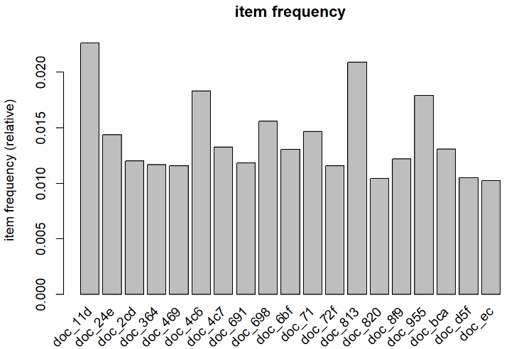
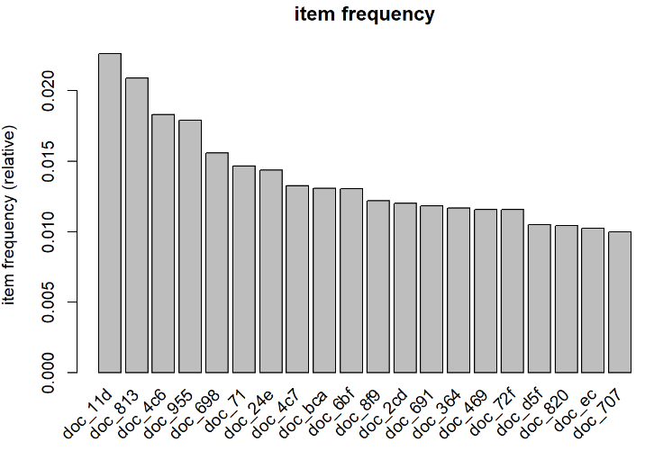
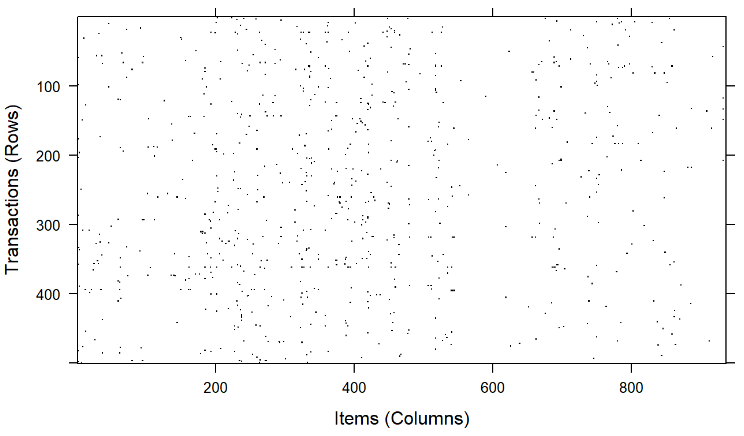
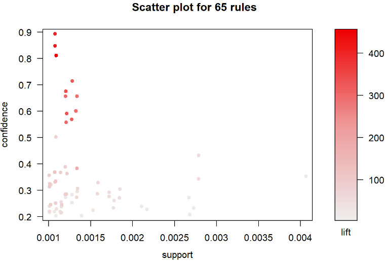
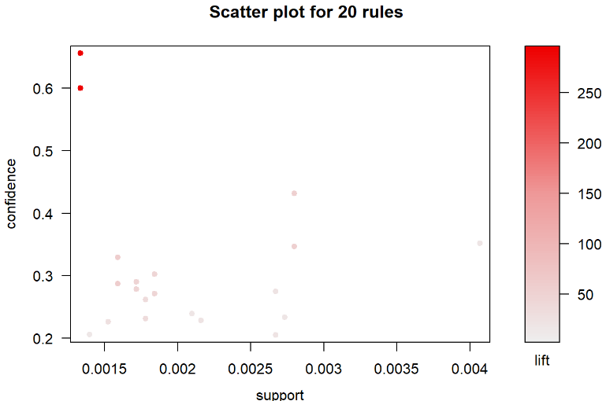
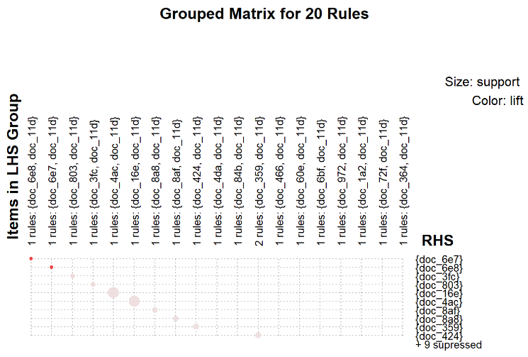
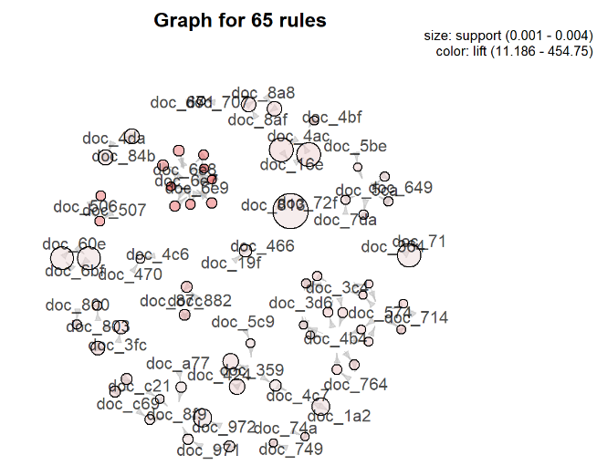
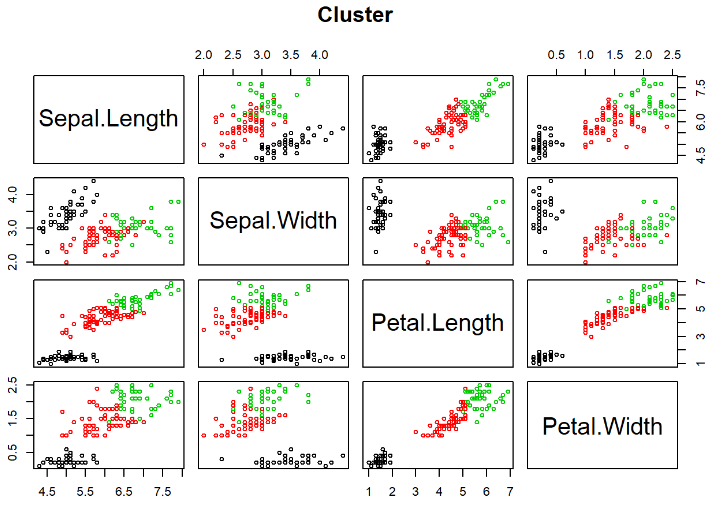

[toc]

# Day35 딥러닝을 위한 빅데이터 기초 - R(5)

# 전날 수업 복습

```R
library(arules)
data(Epub)
```

```R
summary(Epub)
## transactions as itemMatrix in sparse format with
##  15729 rows (elements/itemsets/transactions) and
##  936 columns (items) and a density of 0.001758755 
## 
## most frequent items:
## doc_11d doc_813 doc_4c6 doc_955 doc_698 (Other) 
##     356     329     288     282     245   24393 
## 
## element (itemset/transaction) length distribution:
## sizes
##     1     2     3     4     5     6     7     8     9    10    11    12    13 
## 11615  2189   854   409   198   121    93    50    42    34    26    12    10 
##    14    15    16    17    18    19    20    21    22    23    24    25    26 
##    10     6     8     6     5     8     2     2     3     2     3     4     5 
##    27    28    30    34    36    38    41    43    52    58 
##     1     1     1     2     1     2     1     1     1     1 
## 
##    Min. 1st Qu.  Median    Mean 3rd Qu.    Max. 
##   1.000   1.000   1.000   1.646   2.000  58.000 
## 
## includes extended item information - examples:
##    labels
## 1 doc_11d
## 2 doc_13d
## 3 doc_14c
## 
## includes extended transaction information - examples:
##       transactionID           TimeStamp
## 10792  session_4795 2003-01-02 10:59:00
## 10793  session_4797 2003-01-02 21:46:01
## 10794  session_479a 2003-01-03 00:50:38
```

```R
inspect(Epub[1:10])
##      items                    transactionID TimeStamp          
## [1]  {doc_154}                session_4795  2003-01-02 10:59:00
## [2]  {doc_3d6}                session_4797  2003-01-02 21:46:01
## [3]  {doc_16f}                session_479a  2003-01-03 00:50:38
## [4]  {doc_11d,doc_1a7,doc_f4} session_47b7  2003-01-03 08:55:50
## [5]  {doc_83}                 session_47bb  2003-01-03 11:27:44
## [6]  {doc_11d}                session_47c2  2003-01-04 00:18:04
## [7]  {doc_368}                session_47cb  2003-01-04 04:40:57
## [8]  {doc_11d,doc_192}        session_47d8  2003-01-04 09:00:01
## [9]  {doc_364}                session_47e2  2003-01-05 02:48:36
## [10] {doc_ec}                 session_47e7  2003-01-05 05:58:48
```

```R
itemFrequency(Epub[,1:10])
##      doc_11d      doc_13d      doc_14c      doc_14e      doc_150      doc_151 
## 0.0226333524 0.0009536525 0.0024794965 0.0017801513 0.0015894208 0.0007629220 
##      doc_153      doc_154      doc_155      doc_156 
## 0.0006357683 0.0013351135 0.0010808062 0.0031152648
```

```R
itemFrequencyPlot(Epub, support = 0.01, 
                  main = "item frequency")
```



```R
itemFrequencyPlot(Epub, topN = 20, 
                  main = "item frequency")
```



```R
image(sample(Epub, 500))
```



```R
epub_rule = apriori(data = Epub, 
                    parameter = list(support = 0.001,
                                     confidence = 0.2,
                                     minlen = 2))
## Apriori
## 
## Parameter specification:
##  confidence minval smax arem  aval originalSupport maxtime support minlen
##         0.2    0.1    1 none FALSE            TRUE       5   0.001      2
##  maxlen target   ext
##      10  rules FALSE
## 
## Algorithmic control:
##  filter tree heap memopt load sort verbose
##     0.1 TRUE TRUE  FALSE TRUE    2    TRUE
## 
## Absolute minimum support count: 15 
## 
## set item appearances ...[0 item(s)] done [0.00s].
## set transactions ...[936 item(s), 15729 transaction(s)] done [0.00s].
## sorting and recoding items ... [481 item(s)] done [0.00s].
## creating transaction tree ... done [0.00s].
## checking subsets of size 1 2 3 done [0.00s].
## writing ... [65 rule(s)] done [0.00s].
## creating S4 object  ... done [0.00s].

epub_rule
## set of 65 rules
```

```R
summary(epub_rule)
## set of 65 rules
## 
## rule length distribution (lhs + rhs):sizes
##  2  3 
## 62  3 
## 
##    Min. 1st Qu.  Median    Mean 3rd Qu.    Max. 
##   2.000   2.000   2.000   2.046   2.000   3.000 
## 
## summary of quality measures:
##     support           confidence          lift            count      
##  Min.   :0.001017   Min.   :0.2048   Min.   : 11.19   Min.   :16.00  
##  1st Qu.:0.001081   1st Qu.:0.2388   1st Qu.: 34.02   1st Qu.:17.00  
##  Median :0.001208   Median :0.2874   Median : 59.47   Median :19.00  
##  Mean   :0.001435   Mean   :0.3571   Mean   :105.16   Mean   :22.57  
##  3rd Qu.:0.001526   3rd Qu.:0.3696   3rd Qu.:100.71   3rd Qu.:24.00  
##  Max.   :0.004069   Max.   :0.8947   Max.   :454.75   Max.   :64.00  
## 
## mining info:
##  data ntransactions support confidence
##  Epub         15729   0.001        0.2
```

```R
inspect(epub_rule[1:10])
##      lhs          rhs       support     confidence lift      count
## [1]  {doc_506} => {doc_507} 0.001207960 0.6551724  303.09432 19   
## [2]  {doc_507} => {doc_506} 0.001207960 0.5588235  303.09432 19   
## [3]  {doc_470} => {doc_4c6} 0.001080806 0.2048193   11.18612 17   
## [4]  {doc_714} => {doc_574} 0.001080806 0.3695652  113.97826 17   
## [5]  {doc_574} => {doc_714} 0.001080806 0.3333333  113.97826 17   
## [6]  {doc_4bf} => {doc_4ac} 0.001080806 0.5000000   77.10294 17   
## [7]  {doc_6e9} => {doc_6e8} 0.001207960 0.6785714  333.53906 19   
## [8]  {doc_6e8} => {doc_6e9} 0.001207960 0.5937500  333.53906 19   
## [9]  {doc_6e9} => {doc_6e7} 0.001271537 0.7142857  321.00000 20   
## [10] {doc_6e7} => {doc_6e9} 0.001271537 0.5714286  321.00000 20
```

```R
inspect(sort(epub_rule, by="lift")[1:20])
##      lhs                  rhs       support     confidence lift      count
## [1]  {doc_6e7,doc_6e8} => {doc_6e9} 0.001080806 0.8095238  454.75000 17   
## [2]  {doc_6e7,doc_6e9} => {doc_6e8} 0.001080806 0.8500000  417.80156 17   
## [3]  {doc_6e8,doc_6e9} => {doc_6e7} 0.001080806 0.8947368  402.09474 17   
## [4]  {doc_6e9}         => {doc_6e8} 0.001207960 0.6785714  333.53906 19   
## [5]  {doc_6e8}         => {doc_6e9} 0.001207960 0.5937500  333.53906 19   
## [6]  {doc_6e9}         => {doc_6e7} 0.001271537 0.7142857  321.00000 20   
## [7]  {doc_6e7}         => {doc_6e9} 0.001271537 0.5714286  321.00000 20   
## [8]  {doc_506}         => {doc_507} 0.001207960 0.6551724  303.09432 19   
## [9]  {doc_507}         => {doc_506} 0.001207960 0.5588235  303.09432 19   
## [10] {doc_6e8}         => {doc_6e7} 0.001335113 0.6562500  294.91875 21   
## [11] {doc_6e7}         => {doc_6e8} 0.001335113 0.6000000  294.91875 21   
## [12] {doc_87c}         => {doc_882} 0.001335113 0.6000000  171.58909 21   
## [13] {doc_882}         => {doc_87c} 0.001335113 0.3818182  171.58909 21   
## [14] {doc_714}         => {doc_574} 0.001080806 0.3695652  113.97826 17   
## [15] {doc_574}         => {doc_714} 0.001080806 0.3333333  113.97826 17   
## [16] {doc_574}         => {doc_3c4} 0.001017229 0.3137255  100.70588 16   
## [17] {doc_3c4}         => {doc_574} 0.001017229 0.3265306  100.70588 16   
## [18] {doc_4b4}         => {doc_3c4} 0.001207960 0.2835821   91.02985 19   
## [19] {doc_3c4}         => {doc_4b4} 0.001207960 0.3877551   91.02985 19   
## [20] {doc_749}         => {doc_74a} 0.001017229 0.3555556   86.03897 16
```

```R
rule_ins = subset(epub_rule, 
                  items %in% c("doc_72f", "doc_4ac"))
inspect(rule_ins)
##     lhs          rhs       support     confidence lift     count
## [1] {doc_4bf} => {doc_4ac} 0.001080806 0.5000000  77.10294 17   
## [2] {doc_4ac} => {doc_16e} 0.002797381 0.4313725  53.42566 44   
## [3] {doc_16e} => {doc_4ac} 0.002797381 0.3464567  53.42566 44   
## [4] {doc_72f} => {doc_813} 0.004068917 0.3516484  16.81178 64
```

```R
rule_ins = subset(epub_rule, 
                  lhs %in% c("doc_72f", "doc_4ac"))
inspect(rule_ins)
##     lhs          rhs       support     confidence lift     count
## [1] {doc_4ac} => {doc_16e} 0.002797381 0.4313725  53.42566 44   
## [2] {doc_72f} => {doc_813} 0.004068917 0.3516484  16.81178 64
```

```R
rule_ins = subset(epub_rule, 
                  rhs %in% c("doc_72f", "doc_4ac"))
inspect(rule_ins)
##     lhs          rhs       support     confidence lift     count
## [1] {doc_4bf} => {doc_4ac} 0.001080806 0.5000000  77.10294 17   
## [2] {doc_16e} => {doc_4ac} 0.002797381 0.3464567  53.42566 44
```

# 조건에 맞는 규칙 불러내기

- %in%은 적어도 하나의 제품이 존재하면 해당 규칙을 가져옴
- 이름의 일부분만을 가지고 규칙을 찾을 때는 %pin% 사용

```R
rule_ins = subset(epub_rule, 
                  items %pin% c("60e"))
inspect(rule_ins)
##     lhs          rhs       support     confidence lift     count
## [1] {doc_60e} => {doc_6bf} 0.002670227 0.2745098  21.06227 42   
## [2] {doc_6bf} => {doc_60e} 0.002670227 0.2048780  21.06227 42
```

- %ain% : 완벽히 일치하는 것에 대하여 호출

```R
rule_ins = subset(epub_rule, 
                  items %ain% c("60e"))
## Error in items %ain% c("60e"): table contains an unknown item label
```

```R
rule_ins = subset(epub_rule, 
                  items %ain% c("doc_6e8"))
inspect(rule_ins)
##     lhs                  rhs       support     confidence lift     count
## [1] {doc_6e9}         => {doc_6e8} 0.001207960 0.6785714  333.5391 19   
## [2] {doc_6e8}         => {doc_6e9} 0.001207960 0.5937500  333.5391 19   
## [3] {doc_6e8}         => {doc_6e7} 0.001335113 0.6562500  294.9187 21   
## [4] {doc_6e7}         => {doc_6e8} 0.001335113 0.6000000  294.9187 21   
## [5] {doc_6e8,doc_6e9} => {doc_6e7} 0.001080806 0.8947368  402.0947 17   
## [6] {doc_6e7,doc_6e9} => {doc_6e8} 0.001080806 0.8500000  417.8016 17   
## [7] {doc_6e7,doc_6e8} => {doc_6e9} 0.001080806 0.8095238  454.7500 17
```

```R
rule_ins = subset(epub_rule, 
                  lhs %ain% c("doc_6e8", "doc_6e9"))
inspect(rule_ins)
##     lhs                  rhs       support     confidence lift     count
## [1] {doc_6e8,doc_6e9} => {doc_6e7} 0.001080806 0.8947368  402.0947 17
```

```R
rule_ins = subset(epub_rule, 
                  items %pin% c("60e"))
inspect(rule_ins)
##     lhs          rhs       support     confidence lift     count
## [1] {doc_60e} => {doc_6bf} 0.002670227 0.2745098  21.06227 42   
## [2] {doc_6bf} => {doc_60e} 0.002670227 0.2048780  21.06227 42
```

- 이름에 대한 것 뿐만 아니라 다른 변수에 대해서도 조건을 줄 수 있다.

```R
rule_ins = subset(epub_rule, 
                  items %pin% c("60e") & confidence > 0.25)
inspect(rule_ins)
##     lhs          rhs       support     confidence lift     count
## [1] {doc_60e} => {doc_6bf} 0.002670227 0.2745098  21.06227 42
```

# 연관규칙 시각화

```R
install.packages("arulesViz")
library(arulesViz)
```

```R
plot(epub_rule)
```



```R
plot(sort(epub_rule, by="support")[1:20])
```



## method = "grouped"

```R
plot(sort(epub_rule, by="support")[1:20], method = "grouped")
```



## method = "graph"

```R
plot(epub_rule, method = "graph", 
     control = list(type = "items"))
```


```R
plot(epub_rule, method = "graph", 
     control = list(type = "items"), 
     vertex.label.cex = 0.7, # 점의 크기(default = 1)
     edge.arrow.size = 0.3,  # 화살표의 크기
     edge.arrow.wideth = 2   # 화살표의 너비
     )
```



- 원의 크기 : support(지지도)에 비례
- 원의 색깔 : lift(향상도)에 비례
- 화살표 : lhs -> rhs

# k-means

- 군집

  - 데이터 셋을 클러스터 라는 그룹으로 나누는 작업
  - 한 클러스터 안의 데이터 포인트끼리는 매우 비슷하고
  - 다른 클러스터의 데이터 포인트와는 구분 되도록 데이터를 나누는 것이 목표
  - 군집 알고리즘은 각 데이터가 어느 클러스터에 속하는지 할당(or 예측)
  - 타깃 마케팅
    - 고객 data를 유사한 구매 패턴을 가진 고객들을 그룹으로 묶어
    - 그룹으로 묶인 고객들의 특징에 맞는 마켓팅 실시
  - 무단 네트워크 침입
    - 정상적인 접근과 비정상적인 접근의 패턴이 다르다는 것을 바탕으로
    - port scanning을 통해 비정상적인 집근을 하므로 보안 시스템은 port scanning이 행동하는 방식을 미리 학습하여 이를 통해 비정상적인 접근 차단

- k-means

  - 가장 간단하고 널리 사용하는 군집 알고리즘

  - 데이터의 어떤 영역을 대표하는 클러스터 중심을 찾는 과정

    1. 클러스터 중심을 random으로 할당

    2. 데이터를 가장 가장 가까운 클러스터 중심에 할당

    3. 클러스터에 할당된 데이터들의 평균으로 클러스터 중심을 재지정

    4. 2번과 3번을 반복
    5. 클러스터에 할당된 데이터의 변화가 없을 때(클러스터의 중심이 매우 조금 움직이거나 안 움직일 때) 알고리즘 종료

## snsdata.csv

- gender 결측치 : 사용한 단어들을 이용하여 knn을 사용하여 추정하여 대체
- age 결측치 : gradyear(졸업년도)가 같은 학생들의 나이의 평균으로 대체

```R
teens = read.csv("dataset_for_ml/snsdata.csv")
head(teens)
##   gradyear gender    age friends basketball football soccer softball volleyball
## 1     2006      M 18.982       7          0        0      0        0          0
## 2     2006      F 18.801       0          0        1      0        0          0
## 3     2006      M 18.335      69          0        1      0        0          0
## 4     2006      F 18.875       0          0        0      0        0          0
## 5     2006   <NA> 18.995      10          0        0      0        0          0
## 6     2006      F     NA     142          0        0      0        0          0
##   swimming cheerleading baseball tennis sports cute sex sexy hot kissed dance
## 1        0            0        0      0      0    0   0    0   0      0     1
## 2        0            0        0      0      0    1   0    0   0      0     0
## 3        0            0        0      0      0    0   0    0   0      0     0
## 4        0            0        0      0      0    1   0    0   0      0     0
## 5        0            0        0      0      0    0   1    0   0      5     1
## 6        0            0        0      0      0    0   1    0   0      0     0
##   band marching music rock god church jesus bible hair dress blonde mall
## 1    0        0     0    0   0      0     0     0    0     0      0    0
## 2    0        0     2    2   1      0     0     0    6     4      0    1
## 3    2        0     1    0   0      0     0     0    0     0      0    0
## 4    0        0     0    1   0      0     0     0    0     0      0    0
## 5    1        0     3    0   1      0     0     0    1     0      0    0
## 6    0        1     2    0   0      0     0     0    0     1      0    0
##   shopping clothes hollister abercrombie die death drunk drugs
## 1        0       0         0           0   0     0     0     0
## 2        0       0         0           0   0     0     0     0
## 3        0       0         0           0   0     1     0     0
## 4        0       0         0           0   0     0     0     0
## 5        2       0         0           0   0     0     1     1
## 6        1       0         0           0   0     0     1     0
```

```R
str(teens)
## 'data.frame':    30000 obs. of  40 variables:
##  $ gradyear    : int  2006 2006 2006 2006 2006 2006 2006 2006 2006 2006 ...
##  $ gender      : Factor w/ 2 levels "F","M": 2 1 2 1 NA 1 1 2 1 1 ...
##  $ age         : num  19 18.8 18.3 18.9 19 ...
##  $ friends     : int  7 0 69 0 10 142 72 17 52 39 ...
##  $ basketball  : int  0 0 0 0 0 0 0 0 0 0 ...
##  $ football    : int  0 1 1 0 0 0 0 0 0 0 ...
##  $ soccer      : int  0 0 0 0 0 0 0 0 0 0 ...
##  $ softball    : int  0 0 0 0 0 0 0 1 0 0 ...
##  $ volleyball  : int  0 0 0 0 0 0 0 0 0 0 ...
##  $ swimming    : int  0 0 0 0 0 0 0 0 0 0 ...
##  $ cheerleading: int  0 0 0 0 0 0 0 0 0 0 ...
##  $ baseball    : int  0 0 0 0 0 0 0 0 0 0 ...
##  $ tennis      : int  0 0 0 0 0 0 0 0 0 0 ...
##  $ sports      : int  0 0 0 0 0 0 0 0 0 0 ...
##  $ cute        : int  0 1 0 1 0 0 0 0 0 1 ...
##  $ sex         : int  0 0 0 0 1 1 0 2 0 0 ...
##  $ sexy        : int  0 0 0 0 0 0 0 1 0 0 ...
##  $ hot         : int  0 0 0 0 0 0 0 0 0 1 ...
##  $ kissed      : int  0 0 0 0 5 0 0 0 0 0 ...
##  $ dance       : int  1 0 0 0 1 0 0 0 0 0 ...
##  $ band        : int  0 0 2 0 1 0 1 0 0 0 ...
##  $ marching    : int  0 0 0 0 0 1 1 0 0 0 ...
##  $ music       : int  0 2 1 0 3 2 0 1 0 1 ...
##  $ rock        : int  0 2 0 1 0 0 0 1 0 1 ...
##  $ god         : int  0 1 0 0 1 0 0 0 0 6 ...
##  $ church      : int  0 0 0 0 0 0 0 0 0 0 ...
##  $ jesus       : int  0 0 0 0 0 0 0 0 0 2 ...
##  $ bible       : int  0 0 0 0 0 0 0 0 0 0 ...
##  $ hair        : int  0 6 0 0 1 0 0 0 0 1 ...
##  $ dress       : int  0 4 0 0 0 1 0 0 0 0 ...
##  $ blonde      : int  0 0 0 0 0 0 0 0 0 0 ...
##  $ mall        : int  0 1 0 0 0 0 2 0 0 0 ...
##  $ shopping    : int  0 0 0 0 2 1 0 0 0 1 ...
##  $ clothes     : int  0 0 0 0 0 0 0 0 0 0 ...
##  $ hollister   : int  0 0 0 0 0 0 2 0 0 0 ...
##  $ abercrombie : int  0 0 0 0 0 0 0 0 0 0 ...
##  $ die         : int  0 0 0 0 0 0 0 0 0 0 ...
##  $ death       : int  0 0 1 0 0 0 0 0 0 0 ...
##  $ drunk       : int  0 0 0 0 1 1 0 0 0 0 ...
##  $ drugs       : int  0 0 0 0 1 0 0 0 0 0 ...
```

### gender 결측치 처리

```R
table(teens$gender)
## 
##     F     M 
## 22054  5222
```

- NA인 데이터도 표시하기

```R
table(teens$gender, useNA = "ifany")
## 
##     F     M  <NA> 
## 22054  5222  2724
```
- 성별 각각을 나타내는 변수 생성

```R
teens$female = ifelse(teens$gender == "F" & 
                        !is.na(teens$gender), 1, 0)
# !is.na 조건을 안 줄 경우
# gender=NA는 female또한 NA로 들어감
table(teens$female)
## 
##     0     1 
##  7946 22054
```

```R
teens$no_gender = ifelse(is.na(teens$gender), 1, 0)
table(teens$no_gender)
## 
##     0     1 
## 27276  2724
```

### age 결측치 처리

```R
summary(teens$age)
##    Min. 1st Qu.  Median    Mean 3rd Qu.    Max.    NA's 
##   3.086  16.312  17.287  17.994  18.259 106.927    5086
```

- 13세 이상 20세 미만의 나이를 갖는 사람은 유지, 나머지는 NA

```R
teens$age = ifelse(teens$age >=13 & teens$age < 20,
                   teens$age, NA)
summary(teens$age)
##    Min. 1st Qu.  Median    Mean 3rd Qu.    Max.    NA's 
##   13.03   16.30   17.27   17.25   18.22   20.00    5523
```

```R
mean(teens$age, na.rm = TRUE)
## [1] 17.25243
```

- 그룹(졸업년도)에 대한 통계(평균) 계산

```R
myagg = aggregate(data = teens, age~gradyear, mean, na.rm=T)
myagg
##   gradyear      age
## 1     2006 18.65586
## 2     2007 17.70617
## 3     2008 16.76770
## 4     2009 15.81957
```

```R
class(aggregate(data = teens, age~gradyear, mean, na.rm=T))
## [1] "data.frame"
```

- gradyear별로 각 그룹의 age의 평균을 값을 구하는 과정을 모든 데이터에 대하여 실시하여 vector로 반환

```R
avg_age = ave(teens$age, teens$gradyear, FUN = function(x) mean(x, na.rm = TRUE))
head(avg_age)
## [1] 18.65586 18.65586 18.65586 18.65586 18.65586 18.65586
```

```R
class(avg_age)
## [1] "numeric"
```

```R
 table(avg_age)
## avg_age
## 15.8195733445096 16.7677007371007 17.7061723749799 18.6558579508727 
##             7500             7500             7500             7500
```

- aggregte의 함수로 구한 값으로 대체할 경우

```R
head(ifelse(is.na(teens$age), myagg, teens$age), 10)
## [[1]]
## [1] 18.982
## 
## [[2]]
## [1] 18.801
## 
## [[3]]
## [1] 18.335
## 
## [[4]]
## [1] 18.875
## 
## [[5]]
## [1] 18.995
## 
## [[6]]
## [1] 18.65586 17.70617 16.76770 15.81957
## 
## [[7]]
## [1] 18.93
## 
## [[8]]
## [1] 18.322
## 
## [[9]]
## [1] 19.055
## 
## [[10]]
## [1] 18.708
```

- ave의 함수로 구한 값으로 대체할 경우

```R
head(ifelse(is.na(teens$age), avg_age, teens$age), 10)
##  [1] 18.98200 18.80100 18.33500 18.87500 18.99500 18.65586 18.93000 18.32200
##  [9] 19.05500 18.70800
```

- ave의 함수의 결과로 대체

```R
teens$age = ifelse(is.na(teens$age), avg_age, teens$age)
summary(teens$age)
##    Min. 1st Qu.  Median    Mean 3rd Qu.    Max. 
##   13.03   16.28   17.24   17.24   18.21   20.00
```

- 표준화

```R
interests = teens[5:40]
set.seed(2345)

interests_z = as.data.frame(lapply(interests, scale))
head(interests_z)
##   basketball   football     soccer   softball volleyball   swimming
## 1 -0.3322117 -0.3576914 -0.2428701 -0.2179242 -0.2236659 -0.2599662
## 2 -0.3322117  1.0600312 -0.2428701 -0.2179242 -0.2236659 -0.2599662
## 3 -0.3322117  1.0600312 -0.2428701 -0.2179242 -0.2236659 -0.2599662
## 4 -0.3322117 -0.3576914 -0.2428701 -0.2179242 -0.2236659 -0.2599662
## 5 -0.3322117 -0.3576914 -0.2428701 -0.2179242 -0.2236659 -0.2599662
## 6 -0.3322117 -0.3576914 -0.2428701 -0.2179242 -0.2236659 -0.2599662
##   cheerleading   baseball     tennis     sports       cute        sex
## 1   -0.2073236 -0.2011273 -0.1689361 -0.2971184 -0.4023555 -0.1863812
## 2   -0.2073236 -0.2011273 -0.1689361 -0.2971184  0.8438417 -0.1863812
## 3   -0.2073236 -0.2011273 -0.1689361 -0.2971184 -0.4023555 -0.1863812
## 4   -0.2073236 -0.2011273 -0.1689361 -0.2971184  0.8438417 -0.1863812
## 5   -0.2073236 -0.2011273 -0.1689361 -0.2971184 -0.4023555  0.7036915
## 6   -0.2073236 -0.2011273 -0.1689361 -0.2971184 -0.4023555  0.7036915
##         sexy        hot    kissed      dance       band   marching      music
## 1 -0.2673182 -0.2642206 -0.202616  0.4944488 -0.2677903 -0.1414187 -0.5891515
## 2 -0.2673182 -0.2642206 -0.202616 -0.3657115 -0.2677903 -0.1414187  1.0078256
## 3 -0.2673182 -0.2642206 -0.202616 -0.3657115  1.5198620 -0.1414187  0.2093371
## 4 -0.2673182 -0.2642206 -0.202616 -0.3657115 -0.2677903 -0.1414187 -0.5891515
## 5 -0.2673182 -0.2642206  9.614050  0.4944488  0.6260359 -0.1414187  1.8063142
## 6 -0.2673182 -0.2642206 -0.202616 -0.3657115 -0.2677903  3.3418014  1.0078256
##         rock        god     church      jesus      bible       hair      dress
## 1 -0.3377872 -0.3464049 -0.2975519 -0.1926506 -0.1042455 -0.3848661 -0.2469018
## 2  2.4385462  0.3980715 -0.2975519 -0.1926506 -0.1042455  5.0798257  8.6531327
## 3 -0.3377872 -0.3464049 -0.2975519 -0.1926506 -0.1042455 -0.3848661 -0.2469018
## 4  1.0503795 -0.3464049 -0.2975519 -0.1926506 -0.1042455 -0.3848661 -0.2469018
## 5 -0.3377872  0.3980715 -0.2975519 -0.1926506 -0.1042455  0.5259159 -0.2469018
## 6 -0.3377872 -0.3464049 -0.2975519 -0.1926506 -0.1042455 -0.3848661  1.9781068
##        blonde       mall   shopping    clothes  hollister abercrombie
## 1 -0.05093567 -0.3699086 -0.4873061 -0.3141926 -0.2014729  -0.1830287
## 2 -0.05093567  1.0673738 -0.4873061 -0.3141926 -0.2014729  -0.1830287
## 3 -0.05093567 -0.3699086 -0.4873061 -0.3141926 -0.2014729  -0.1830287
## 4 -0.05093567 -0.3699086 -0.4873061 -0.3141926 -0.2014729  -0.1830287
## 5 -0.05093567 -0.3699086  2.2736351 -0.3141926 -0.2014729  -0.1830287
## 6 -0.05093567 -0.3699086  0.8931645 -0.3141926 -0.2014729  -0.1830287
##          die      death     drunk      drugs
## 1 -0.2947883 -0.2615258 -0.220399 -0.1749047
## 2 -0.2947883 -0.2615258 -0.220399 -0.1749047
## 3 -0.2947883  2.0278743 -0.220399 -0.1749047
## 4 -0.2947883 -0.2615258 -0.220399 -0.1749047
## 5 -0.2947883 -0.2615258  2.285084  2.7192710
## 6 -0.2947883 -0.2615258  2.285084 -0.1749047
```

- K-means 적용

```R
library(stats)
teen_clusters = kmeans(interests_z, centers = 5)
```

- 각 cluster에 속한 데이터 개수

```R
teen_clusters$size
## [1]  1038   601  4066  2696 21599
```

```R
teen_clusters$centers
##     basketball    football      soccer   softball  volleyball    swimming
## 1  0.362160730  0.37985213  0.13734997  0.1272107  0.09247518  0.26180286
## 2 -0.094426312  0.06691768 -0.09956009 -0.0379725 -0.07286202  0.04578401
## 3  0.003980104  0.09524062  0.05342109 -0.0496864 -0.01459648  0.32944934
## 4  1.372334818  1.19570343  0.55621097  1.1304527  1.07177211  0.08513210
## 5 -0.186822093 -0.18729427 -0.08331351 -0.1368072 -0.13344819 -0.08650052
##   cheerleading    baseball      tennis      sports         cute          sex
## 1    0.2159945  0.25312305  0.11991682  0.77040675  0.475265034  2.043945661
## 2   -0.1070370 -0.11182941  0.04027335 -0.10638613 -0.027044898 -0.042725567
## 3    0.5142451 -0.04933628  0.06703386 -0.05435093  0.796948359 -0.003156716
## 4    0.0400367  1.09279737  0.13887184  1.08316097 -0.005291962 -0.033193640
## 5   -0.1092056 -0.13616893 -0.03683671 -0.15903307 -0.171452198 -0.092301138
##           sexy          hot      kissed        dance        band   marching
## 1  0.547956598  0.314845390  3.02610259  0.455501275  0.39009330 -0.0105463
## 2 -0.027913348 -0.035027022 -0.04581067  0.050772118  4.09723438  5.2196105
## 3  0.266741598  0.623263396 -0.01284964  0.650572336 -0.03301257 -0.1131486
## 4  0.003036966  0.009046774 -0.08755418 -0.001993853 -0.07317758 -0.1039509
## 5 -0.076149916 -0.132614350 -0.13080557 -0.145524147 -0.11740538 -0.1104553
##         music       rock         god     church       jesus       bible
## 1  1.21014015  1.2014998  0.41743650  0.1621804  0.12698409  0.07464400
## 2  0.51624366  0.1865286  0.09706027  0.0675347  0.05333966  0.05836708
## 3  0.24527495  0.1166274  0.32867738  0.5195729  0.26142784  0.23946855
## 4  0.07102323  0.1565155  0.04902918  0.1320602  0.01776986  0.01719220
## 5 -0.12755935 -0.1044230 -0.09075500 -0.1239664 -0.05901846 -0.05243708
##          hair      dress      blonde         mall    shopping      clothes
## 1  2.59053048  0.5312082  0.36322464  0.622896285  0.27607550  1.245121599
## 2 -0.05146837  0.0492724 -0.01238629 -0.087713363 -0.03710273 -0.004395251
## 3  0.35590025  0.5837827  0.03301526  0.808620531  1.07073115  0.616207360
## 4  0.01714820 -0.0653358  0.03690938 -0.004723697  0.03497875  0.016201064
## 5 -0.19220150 -0.1286412 -0.02793327 -0.179127117 -0.21816580 -0.177738408
##     hollister abercrombie          die       death       drunk       drugs
## 1  0.31525537   0.4131560  1.712160983  0.94713629  1.83371069  2.73878856
## 2 -0.16788599  -0.1413652  0.008941101  0.05464759 -0.08699556 -0.06414588
## 3  0.85951603   0.7935060  0.062399295  0.12642222  0.03594162 -0.05888141
## 4 -0.08381546  -0.0861708 -0.067312427 -0.01611162 -0.06891763 -0.08795059
## 5 -0.16182051  -0.1545430 -0.085876102 -0.06882571 -0.08386703 -0.10777278
```

```R
head(teen_clusters$cluster, 50)
##  [1] 5 3 5 5 1 5 3 5 5 3 5 5 5 5 5 5 5 5 5 3 3 5 5 5 5 5 5 1 5 5 5 4 5 5 5 5 4 5
## [39] 5 1 5 5 5 5 5 5 3 5 5 4
```

```R
teens$cluster = teen_clusters$cluster
teens[1:5,]
##   gradyear gender    age friends basketball football soccer softball volleyball
## 1     2006      M 18.982       7          0        0      0        0          0
## 2     2006      F 18.801       0          0        1      0        0          0
## 3     2006      M 18.335      69          0        1      0        0          0
## 4     2006      F 18.875       0          0        0      0        0          0
## 5     2006   <NA> 18.995      10          0        0      0        0          0
##   swimming cheerleading baseball tennis sports cute sex sexy hot kissed dance
## 1        0            0        0      0      0    0   0    0   0      0     1
## 2        0            0        0      0      0    1   0    0   0      0     0
## 3        0            0        0      0      0    0   0    0   0      0     0
## 4        0            0        0      0      0    1   0    0   0      0     0
## 5        0            0        0      0      0    0   1    0   0      5     1
##   band marching music rock god church jesus bible hair dress blonde mall
## 1    0        0     0    0   0      0     0     0    0     0      0    0
## 2    0        0     2    2   1      0     0     0    6     4      0    1
## 3    2        0     1    0   0      0     0     0    0     0      0    0
## 4    0        0     0    1   0      0     0     0    0     0      0    0
## 5    1        0     3    0   1      0     0     0    1     0      0    0
##   shopping clothes hollister abercrombie die death drunk drugs female no_gender
## 1        0       0         0           0   0     0     0     0      0         0
## 2        0       0         0           0   0     0     0     0      1         0
## 3        0       0         0           0   0     1     0     0      0         0
## 4        0       0         0           0   0     0     0     0      1         0
## 5        2       0         0           0   0     0     1     1      0         1
##   cluster
## 1       5
## 2       3
## 3       5
## 4       5
## 5       1
```

```R
teens[1:5, c("cluster", "gender", "age", "friends")]
##   cluster gender    age friends
## 1       5      M 18.982       7
## 2       3      F 18.801       0
## 3       5      M 18.335      69
## 4       5      F 18.875       0
## 5       1   <NA> 18.995      10
```

- 클러스터 단위로 나이 평균

```R
aggregate(data = teens, age~cluster, mean)
##   cluster      age
## 1       1 17.09319
## 2       2 17.38488
## 3       3 17.03773
## 4       4 17.03759
## 5       5 17.30265
```

- 클러스터 단위로 친구 수 평균

```R
aggregate(data = teens, friends~cluster, mean)
##   cluster  friends
## 1       1 30.66570
## 2       2 32.79368
## 3       3 38.54575
## 4       4 35.91728
## 5       5 27.79221
```

- 클러스터 단위로 여자 비율

```R
mean(teens$female)
## [1] 0.7351333

aggregate(data = teens, female~cluster, mean)
##   cluster    female
## 1       1 0.8025048
## 2       2 0.7237937
## 3       3 0.8866208
## 4       4 0.6984421
## 5       5 0.7082735
```

# 연습문제

## iris data k-means

- iris 3개 그룹
- 정확도?

```R
head(iris)
##   Sepal.Length Sepal.Width Petal.Length Petal.Width Species
## 1          5.1         3.5          1.4         0.2  setosa
## 2          4.9         3.0          1.4         0.2  setosa
## 3          4.7         3.2          1.3         0.2  setosa
## 4          4.6         3.1          1.5         0.2  setosa
## 5          5.0         3.6          1.4         0.2  setosa
## 6          5.4         3.9          1.7         0.4  setosa
```

```R
set.seed(20)
iris_kmeans = kmeans(iris[-5], center = 3)
iris_kmeans$size
## [1] 50 62 38
```

> 각 cluster는 50, 62, 38개의 데이터로 나눠졌다.

```R
iris_kmeans$centers
##   Sepal.Length Sepal.Width Petal.Length Petal.Width
## 1     5.006000    3.428000     1.462000    0.246000
## 2     5.901613    2.748387     4.393548    1.433871
## 3     6.850000    3.073684     5.742105    2.071053
```

> Sepal : 꽃받침, Petal : 꽃잎
>
> 1번 cluster는 꽃받침의 길이와 꽃잎의 길이, 너비가 가장 작다.
>
> 2번 cluster는 꽃받침의 너비가 가장 작고, 나머지는 중간이다.
>
> 3번 cluster는 꽃받침의 길이와 꽃잎의 길이, 너비가 가장 크다.

```R
iris$cluster = iris_kmeans$cluster
table(iris$Species, iris$cluster)
##             
##               1  2  3
##   setosa     50  0  0
##   versicolor  0 48  2
##   virginica   0 14 36
```

> setosa는 아주 잘 나눠졌지만
>
> versicolor와 virginica는 분리가 잘 되지 않았다.

```R
plot(iris[1:4], col = iris$Species, cex = 0.1, main = "Species")
```


```R
plot(iris[1:4], col = iris$cluster, cex = 0.1, main = "Cluster")
```



## 1.

- 아래 조건에 따라 리스트를 회전하는 프로그램을 작성하시오.

- 조건
  - 입력값은 한 행의 문자열로 주어지며, 각 값은 공백으로 구분된다.
  - 첫 번째 값은 리스트를 회전하는 양과 방향(음수의 경우 좌측으로, 양수의 경우 우측으로 회전)이다.
  - 첫 번째 값을 제외한 나머지 값은 리스트의 각 항목의 값이다.
  - 회전된 리스트를 문자열로 출력한다.
  - 구현에 이용할 자료구조에 대한 조건이나 제약은 없다.
  - 입력되는 리스트의 항목의 개수는 유한한다.
- 입출력예
  - 예 1)
    - 입력: 1 10 20 30 40 50
    - 출력: 50 10 20 30 40
  - 예 2)
    - 입력: 4 가 나 다 라 마 바 사
    - 출력: 라 마 바 사 가 나 다
  - 예 3)
    - 입력: -2 A B C D E F G
    - 출력: C D E F G A B
  - 예 4)
    - 입력: 0 똘기 떵이 호치 새초미
    - 출력: 똘기 떵이 호치 새초미

### A.

```python
# 1.
rotation = input().split()
n = int(rotation.pop(0))

for i in range(-n, len(rotation)-n) :
    if i >= len(rotation) : i = i-len(rotation)
    print(rotation[i], end = " ")
```

## 2.

- 당신은 그림판의 '색 채우기' 기능을 구현하려한다.

- 이미지 크기는 제한이 없다. (처리속도 < 3s)

- 입력 설명
  - 가로 세로
  - 색을 채우기 시작할 점 과 색
  - 이미지의 색상 데이터
- 입력 예시
  - 10 10
  - 5 5 3
  - 0000000000
  - 0000001000
  - 0000110100
  - 0011000010
  - 0100000010
  - 0100000010
  - 0100000100
  - 0010001000
  - 0001011000
  - 0000100000
- 출력 예시
  - 0000000000
  - 0000001000
  - 0000113100
  - 0011333310
  - 0133333310
  - 0133333310
  - 0133333100
  - 0013331000
  - 0001331000
  - 0000100000

### A.

```python
# 2. 
n_col, n_row = map(int, input().split())
start_row, start_col, color = map(int, input().split())
data = []
for _ in range(n_row) :
    data.append(list(input()))

if data[start_row][:start_col].count(init) == len(range(0, start_col)) : # 외부 색 채우기
    
    # 경계 표시하는 숫자 찾기
    for i in data[start_row] :
        if i != init :
            division = i
            break
    
    for i in range(n_row) :
        # 외부에 해당하는 열 색 채우기
        s_1, e_1 = n_col, n_col
        
        # 행에 내부가 존재하는 경우
        # 경계의 시작점과 끝점 찾기
        if division in data[i] :
            
            t = data[i].index(division)
            if division in data[i][t+1:] :
                s_1 = t
                e_1 = n_col -1 -data[i][-1:-n_col:-1].index(division)
            else :
                s_1 = t
                e_1 = t
        
        # 외부에 해당하는 열 색 채우기
        for j in range(s_1) :
            data[i][j] = str(color)
        for j in range(e_1+1, n_col) :
            data[i][j] = str(color)    
        
else : # 내부 색 채우기
    
    # 경계 표시하는 숫자 찾기
    for i in list(reversed(data[start_row][:start_col])) :
        if i != init :
            division = i
            break

    for i in range(n_row) :
        # 내부에 해당 안될 경우 continue
        if division not in data[i] : continue
        
        # 내부와 외부의 경계 지점 찾기
        s_1 = data[i].index(division)
        # 경계 선만 존재할 경우 continue
        if division not in data[i][s_1+1:] : continue
        
        # 내부의 시작과 끝점 찾기
        s_0 = s_1 + 1 + data[i][s_1+1:].index(init)
        e_0 = s_0 + 1 + data[i][s_0+1:].index(division)
        
        # 내부에 대해 색칠하기
        for j in range(s_0, e_0) :
            data[i][j] = str(color)

# 출력하기
print("result")
for i in range(n_row) :
    print(''.join(data[i]))
# > 10 10
# > 2 2 3
# > 0000000000
# > 0000001000
# > 0000110100
# > 0011000010
# > 0100000010
# > 0100000010
# > 0100000100
# > 0010001000
# > 0001011000
# > 0000100000
# > result
# > 3333333333
# > 3333331333
# > 3333110133
# > 3311000013
# > 3100000013
# > 3100000013
# > 3100000133
# > 3310001333
# > 3331011333
# > 3333133333
```

