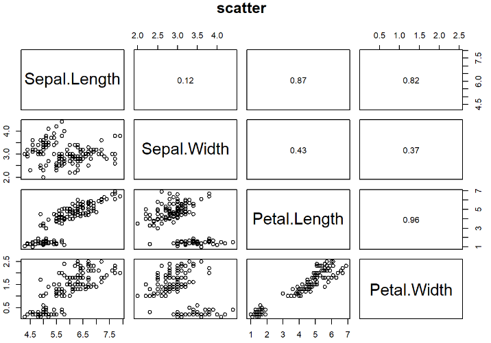
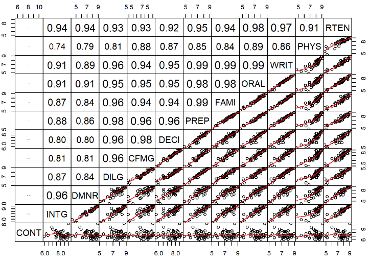
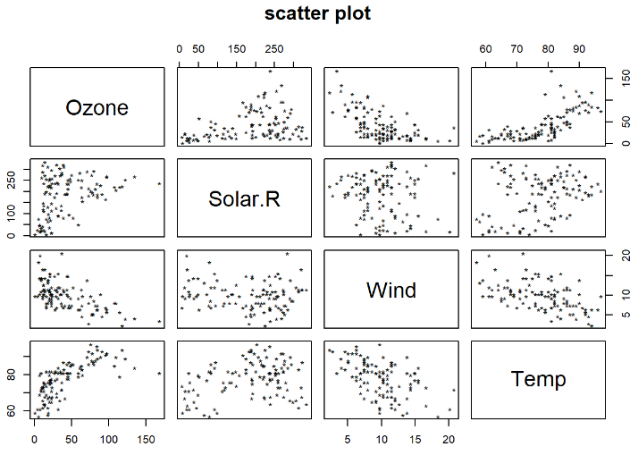
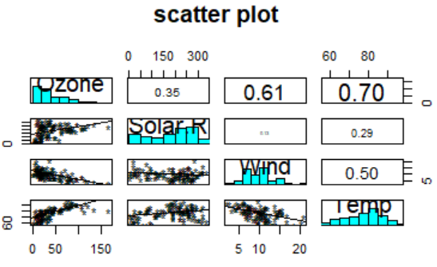
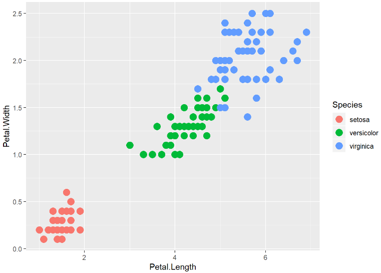
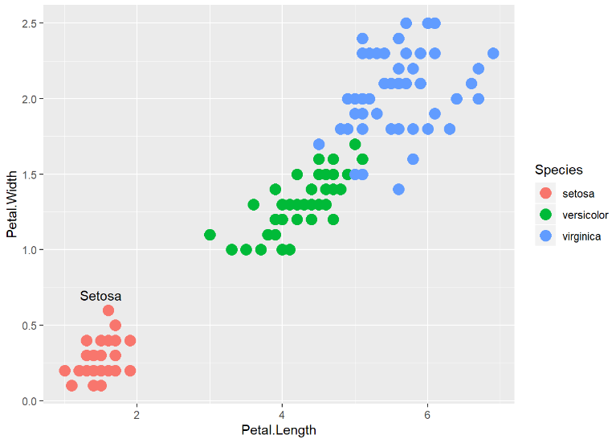
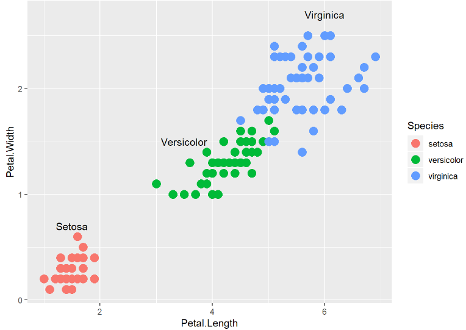
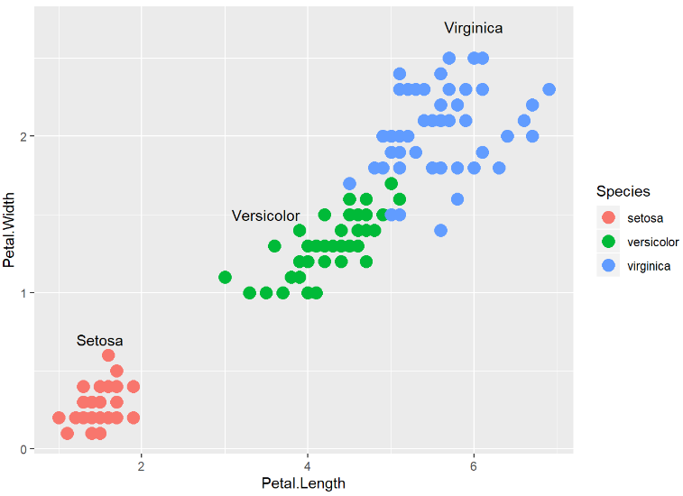
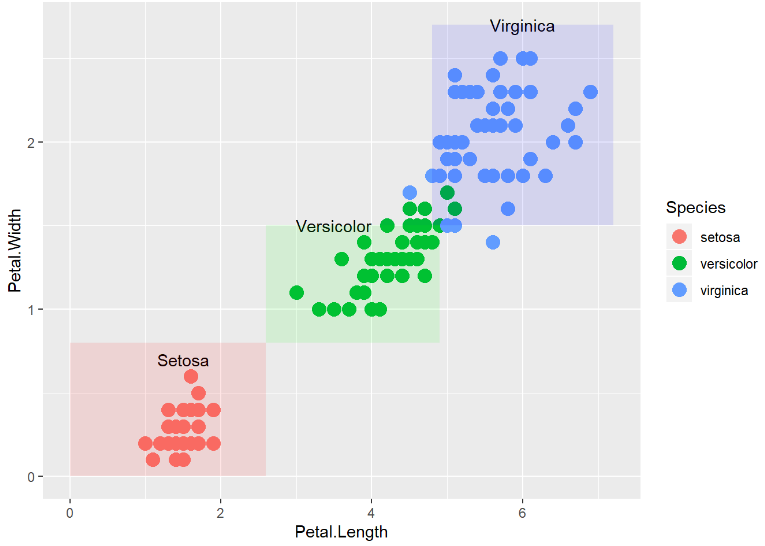
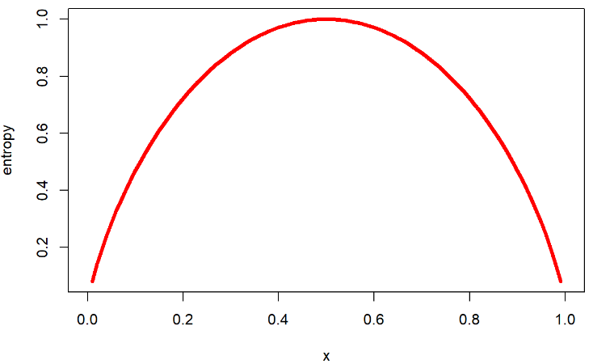

[toc]

# Day36 딥러닝을 위한 빅데이터 기초 - R(6)

# k-means

- 클러스터 중심과 각 data간 거리의 합은 최소화
- 클러스터 중심 간에 거리의 합은 최대화

1. k 결정
2. k개 초기 중심 설정
3. data와 중심(클러스터)이 가장 가까운 클러스터로 데이터 할당
4. 중심 점이 update
5. 3, 4번 과정을 중심점이 움직이지 않을 때 까지 반복

```R
str(iris)
## 'data.frame':    150 obs. of  5 variables:
##  $ Sepal.Length: num  5.1 4.9 4.7 4.6 5 5.4 4.6 5 4.4 4.9 ...
##  $ Sepal.Width : num  3.5 3 3.2 3.1 3.6 3.9 3.4 3.4 2.9 3.1 ...
##  $ Petal.Length: num  1.4 1.4 1.3 1.5 1.4 1.7 1.4 1.5 1.4 1.5 ...
##  $ Petal.Width : num  0.2 0.2 0.2 0.2 0.2 0.4 0.3 0.2 0.2 0.1 ...
##  $ Species     : Factor w/ 3 levels "setosa","versicolor",..: 1 1 1 1 1 1 1 1 1 1 ...
```

```R
head(iris)
##   Sepal.Length Sepal.Width Petal.Length Petal.Width Species
## 1          5.1         3.5          1.4         0.2  setosa
## 2          4.9         3.0          1.4         0.2  setosa
## 3          4.7         3.2          1.3         0.2  setosa
## 4          4.6         3.1          1.5         0.2  setosa
## 5          5.0         3.6          1.4         0.2  setosa
## 6          5.4         3.9          1.7         0.4  setosa
```

- column별로 na가 몇개 인지 확인하기

```R
colSums(is.na(iris))
## Sepal.Length  Sepal.Width Petal.Length  Petal.Width      Species 
##            0            0            0            0            0
```

## 산점도

```R
panel.fun = function(x, y, ...){
  horizontal = (par("usr")[1] + par("usr")[2])/2;
  vertical = (par("usr")[3] + par("usr")[4])/2 ;
  text(horizontal, vertical, format(abs(cor(x,y)), 
                                    digits = 2))
}
pairs(iris[1:4], pca=21, 
      bg = c("red", "green", "blue")[unclass(iris$Species)],
      upper.panel = panel.fun, main = "scatter")
```



- ggplot2 패키지의 geom_point() : 변수 1개의 산점도 그리기
- corrplot 패키지 : 상관계수 행렬 그리기

```R
str(airquality)
## 'data.frame':    153 obs. of  6 variables:
##  $ Ozone  : int  41 36 12 18 NA 28 23 19 8 NA ...
##  $ Solar.R: int  190 118 149 313 NA NA 299 99 19 194 ...
##  $ Wind   : num  7.4 8 12.6 11.5 14.3 14.9 8.6 13.8 20.1 8.6 ...
##  $ Temp   : int  67 72 74 62 56 66 65 59 61 69 ...
##  $ Month  : int  5 5 5 5 5 5 5 5 5 5 ...
##  $ Day    : int  1 2 3 4 5 6 7 8 9 10 ...
```

```R
head(airquality[,c(1:4)])
##   Ozone Solar.R Wind Temp
## 1    41     190  7.4   67
## 2    36     118  8.0   72
## 3    12     149 12.6   74
## 4    18     313 11.5   62
## 5    NA      NA 14.3   56
## 6    28      NA 14.9   66
```

```R
airquality_1 = airquality[,c(1:4)]
str(airquality_1)
## 'data.frame':    153 obs. of  4 variables:
##  $ Ozone  : int  41 36 12 18 NA 28 23 19 8 NA ...
##  $ Solar.R: int  190 118 149 313 NA NA 299 99 19 194 ...
##  $ Wind   : num  7.4 8 12.6 11.5 14.3 14.9 8.6 13.8 20.1 8.6 ...
##  $ Temp   : int  67 72 74 62 56 66 65 59 61 69 ...
```

```R
colSums(is.na(airquality_1))
##   Ozone Solar.R    Wind    Temp 
##      37       7       0       0
```

```R
sum(is.na(airquality_1$Ozone))
## [1] 37
```

- 결측값이 있는 행을 제거

```R
airquality_2 = na.omit(airquality_1)
str(airquality_2)
## 'data.frame':    111 obs. of  4 variables:
##  $ Ozone  : int  41 36 12 18 23 19 8 16 11 14 ...
##  $ Solar.R: int  190 118 149 313 299 99 19 256 290 274 ...
##  $ Wind   : num  7.4 8 12.6 11.5 8.6 13.8 20.1 9.7 9.2 10.9 ...
##  $ Temp   : int  67 72 74 62 65 59 61 69 66 68 ...
##  - attr(*, "na.action")= 'omit' Named int  5 6 10 11 25 26 27 32 33 34 ...
##   ..- attr(*, "names")= chr  "5" "6" "10" "11" ...
```

```R
colSums(is.na(airquality_2))
##   Ozone Solar.R    Wind    Temp 
##       0       0       0       0
```

```R
panel.cor <- function(x, y, digits = 2, prefix = "", cex.cor, ...)
{
    usr <- par("usr"); on.exit(par(usr))
    par(usr = c(0, 1, 0, 1))
    r <- abs(cor(x, y))
    txt <- format(c(r, 0.123456789), digits = digits)[1]
    txt <- paste0(prefix, txt)
    if(missing(cex.cor)) cex.cor <- 0.8/strwidth(txt)
    text(0.5, 0.5, txt, cex = cex.cor * r)
}
pairs(USJudgeRatings, lower.panel = panel.smooth, upper.panel = panel.cor,
      gap=0, row1attop=FALSE)
```



> 대각선 위쪽은 corr 값
>
> 대각선 아래쪽은 산점도 + 회귀선

```R
pairs(airquality_2)
```


```R
pairs(airquality_2, pch="*", main = "scatter plot")
```



```R
panel.lm = function(x, y, col = par("col"), bg = NA, 
                    pch = par("pch"), cex = 1, 
                    col.smooth = "black", ...){
  points(x,y,pch = pch, col = col, bg = bg, cex = cex)
  abline(stats::lm(y~x, col = col.smooth, ...))
}
pairs(airquality_2, pch="*", main = "scatter plot",
      lower.panel = panel.lm,
      upper.panel = panel.cor,
      diag.panel = panel.hist)
```



```R
pairs(iris[1:4], main = "Anderson's Iris Data -- 3 species",
      pch = 21, bg = c("red", "green3", "blue")[unclass(iris$Species)])
```


```R
head(unclass(iris$Species))
## [1] 1 1 1 1 1 1
```

```R
library(ggplot2)
ggplot(data = iris, aes(x = Petal.Length, y = Petal.Width, colour = Species)) +
  geom_point(shape = 19, size = 4)
```


```R
iris_plot = ggplot(data = iris, aes(x = Petal.Length, y = Petal.Width, colour = Species)) +
  geom_point(shape = 19, size = 4)
iris_plot
```



```R
iris_plot +
  annotate("text", x = 1.5, y = 0.7, label = "Setosa")
```



```R
iris_plot +
  annotate("text", x = 1.5, y = 0.7, label = "Setosa") +
  annotate("text", x = 3.5, y = 1.5, label = "Versicolor") +
  annotate("text", x = 6, y = 2.7, label = "Virginica")
```



```R
iris_plot2  = iris_plot +
  annotate("text", x = 1.5, y = 0.7, label = "Setosa") +
  annotate("text", x = 3.5, y = 1.5, label = "Versicolor") +
  annotate("text", x = 6, y = 2.7, label = "Virginica")
iris_plot2
```



```R
iris_plot2 +
  annotate("rect", xmin = 0, xmax = 2.6, 
           ymin = 0, ymax = 0.8, alpha = 0.1, fill="red") + 
  annotate("rect", xmin = 2.6, xmax = 4.9, 
           ymin = 0.8, ymax = 1.5, alpha = 0.1, fill="green") +
  annotate("rect", xmin = 4.8, xmax = 7.2, 
           ymin = 1.5, ymax = 2.7, alpha = 0.1, fill="blue")
```



```R
iris_kmeans = kmeans(iris[,c("Petal.Length", "Petal.Width")], 3)
iris_kmeans
## K-means clustering with 3 clusters of sizes 50, 48, 52
## 
## Cluster means:
##   Petal.Length Petal.Width
## 1     1.462000    0.246000
## 2     5.595833    2.037500
## 3     4.269231    1.342308
## 
## Clustering vector:
##   [1] 1 1 1 1 1 1 1 1 1 1 1 1 1 1 1 1 1 1 1 1 1 1 1 1 1 1 1 1 1 1 1 1 1 1 1 1 1
##  [38] 1 1 1 1 1 1 1 1 1 1 1 1 1 3 3 3 3 3 3 3 3 3 3 3 3 3 3 3 3 3 3 3 3 3 3 3 3
##  [75] 3 3 3 2 3 3 3 3 3 2 3 3 3 3 3 3 3 3 3 3 3 3 3 3 3 3 2 2 2 2 2 2 3 2 2 2 2
## [112] 2 2 2 2 2 2 2 2 3 2 2 2 2 2 2 3 2 2 2 2 2 2 2 2 2 2 2 3 2 2 2 2 2 2 2 2 2
## [149] 2 2
## 
## Within cluster sum of squares by cluster:
## [1]  2.02200 16.29167 13.05769
##  (between_SS / total_SS =  94.3 %)
## 
## Available components:
## 
## [1] "cluster"      "centers"      "totss"        "withinss"     "tot.withinss"
## [6] "betweenss"    "size"         "iter"         "ifault"
```

```R
names(iris_kmeans)
## [1] "cluster"      "centers"      "totss"        "withinss"     "tot.withinss"
## [6] "betweenss"    "size"         "iter"         "ifault"
```

```R
iris_kmeans$size
## [1] 50 48 52
```

```R
table(iris_kmeans$cluster)
## 
##  1  2  3 
## 50 48 52
```

# 결정 트리

- 엔트로피 : 복잡도
  - $-plog_2(p) - (1-p)log_2(1-p)$

- IG = Entropy before - Entropy after
- 신용평가모델
- 고객 행동, 만족 마케팅
- 제약회사, 질병, …
- 분할 기준 선정
  - IG

## entropy 함수 그래프

```R
curve(-x*log2(x) - (1-x)*log2(1-x), col = "red", 
      xlab = "x", ylab = "entropy", lwd = 4)
```



## credit.csv를 이용한 데이터 분석

```R
credit = read.csv("dataset_for_ml/credit.csv")
str(credit)
## 'data.frame':    1000 obs. of  17 variables:
##  $ checking_balance    : Factor w/ 4 levels "< 0 DM","> 200 DM",..: 1 3 4 1 1 4 4 3 4 3 ...
##  $ months_loan_duration: int  6 48 12 42 24 36 24 36 12 30 ...
##  $ credit_history      : Factor w/ 5 levels "critical","good",..: 1 2 1 2 4 2 2 2 2 1 ...
##  $ purpose             : Factor w/ 6 levels "business","car",..: 5 5 4 5 2 4 5 2 5 2 ...
##  $ amount              : int  1169 5951 2096 7882 4870 9055 2835 6948 3059 5234 ...
##  $ savings_balance     : Factor w/ 5 levels "< 100 DM","> 1000 DM",..: 5 1 1 1 1 5 4 1 2 1 ...
##  $ employment_duration : Factor w/ 5 levels "< 1 year","> 7 years",..: 2 3 4 4 3 3 2 3 4 5 ...
##  $ percent_of_income   : int  4 2 2 2 3 2 3 2 2 4 ...
##  $ years_at_residence  : int  4 2 3 4 4 4 4 2 4 2 ...
##  $ age                 : int  67 22 49 45 53 35 53 35 61 28 ...
##  $ other_credit        : Factor w/ 3 levels "bank","none",..: 2 2 2 2 2 2 2 2 2 2 ...
##  $ housing             : Factor w/ 3 levels "other","own",..: 2 2 2 1 1 1 2 3 2 2 ...
##  $ existing_loans_count: int  2 1 1 1 2 1 1 1 1 2 ...
##  $ job                 : Factor w/ 4 levels "management","skilled",..: 2 2 4 2 2 4 2 1 4 1 ...
##  $ dependents          : int  1 1 2 2 2 2 1 1 1 1 ...
##  $ phone               : Factor w/ 2 levels "no","yes": 2 1 1 1 1 2 1 2 1 1 ...
##  $ default             : Factor w/ 2 levels "no","yes": 1 2 1 1 2 1 1 1 1 2 ...
```

```R
summary(credit)
##    checking_balance months_loan_duration   credit_history
##  < 0 DM    :274     Min.   : 4.0         critical :293   
##  > 200 DM  : 63     1st Qu.:12.0         good     :530   
##  1 - 200 DM:269     Median :18.0         perfect  : 40   
##  unknown   :394     Mean   :20.9         poor     : 88   
##                     3rd Qu.:24.0         very good: 49   
##                     Max.   :72.0                         
##                  purpose        amount           savings_balance
##  business            : 97   Min.   :  250   < 100 DM     :603   
##  car                 :337   1st Qu.: 1366   > 1000 DM    : 48   
##  car0                : 12   Median : 2320   100 - 500 DM :103   
##  education           : 59   Mean   : 3271   500 - 1000 DM: 63   
##  furniture/appliances:473   3rd Qu.: 3972   unknown      :183   
##  renovations         : 22   Max.   :18424                       
##   employment_duration percent_of_income years_at_residence      age       
##  < 1 year   :172      Min.   :1.000     Min.   :1.000      Min.   :19.00  
##  > 7 years  :253      1st Qu.:2.000     1st Qu.:2.000      1st Qu.:27.00  
##  1 - 4 years:339      Median :3.000     Median :3.000      Median :33.00  
##  4 - 7 years:174      Mean   :2.973     Mean   :2.845      Mean   :35.55  
##  unemployed : 62      3rd Qu.:4.000     3rd Qu.:4.000      3rd Qu.:42.00  
##                       Max.   :4.000     Max.   :4.000      Max.   :75.00  
##  other_credit  housing    existing_loans_count         job        dependents   
##  bank :139    other:108   Min.   :1.000        management:148   Min.   :1.000  
##  none :814    own  :713   1st Qu.:1.000        skilled   :630   1st Qu.:1.000  
##  store: 47    rent :179   Median :1.000        unemployed: 22   Median :1.000  
##                           Mean   :1.407        unskilled :200   Mean   :1.155  
##                           3rd Qu.:2.000                         3rd Qu.:1.000  
##                           Max.   :4.000                         Max.   :2.000  
##  phone     default  
##  no :596   no :700  
##  yes:404   yes:300  
##                     
##                     
##                     
## 
```

- 채무불이행 여부 변수

```R
table(credit$default)
## 
##  no yes 
## 700 300
```

### 데이터 분할

```R
set.seed(123)
train_sample = sample(1000, 900)
str(train_sample)
##  int [1:900] 415 463 179 526 195 938 818 118 299 229 ...
```

```R
credit_train = credit[train_sample, ]
credit_test = credit[-train_sample, ]
```

```R
table(credit_train$default)
## 
##  no yes 
## 635 265

table(credit_test$default)
## 
##  no yes 
##  65  35
```

```R
prop.table(table(credit_train$default))
## 
##        no       yes 
## 0.7055556 0.2944444
```

### 모델 적용

```R
install.packages("C50")
library(C50)
```

```R
credit_model = C5.0(credit_train[-17], credit_train$default)
credit_model
## 
## Call:
## C5.0.default(x = credit_train[-17], y = credit_train$default)
## 
## Classification Tree
## Number of samples: 900 
## Number of predictors: 16 
## 
## Tree size: 69 
## 
## Non-standard options: attempt to group attributes
```

```R
summary(credit_model)
## 
## Call:
## C5.0.default(x = credit_train[-17], y = credit_train$default)
## 
## 
## C5.0 [Release 2.07 GPL Edition]      Mon Feb 10 16:27:51 2020
## -------------------------------
## 
## Class specified by attribute `outcome'
## 
## Read 900 cases (17 attributes) from undefined.data
## 
## Decision tree:
## 
## checking_balance in {> 200 DM,unknown}: no (412/54)
## checking_balance in {< 0 DM,1 - 200 DM}:
## :...credit_history in {perfect,very good}:
##     :...housing = rent: yes (16/1)
##     :   housing = other:
##     :   :...employment_duration in {> 7 years,1 - 4 years,
##     :   :   :                       4 - 7 years}: yes (10)
##     :   :   employment_duration in {< 1 year,unemployed}:
##     :   :   :...job in {management,unemployed,unskilled}: no (3)
##     :   :       job = skilled: yes (1)
##     :   housing = own:
##     :   :...purpose in {business,education}: no (9/2)
##     :       purpose in {car0,renovations}: yes (3)
##     :       purpose = car:
##     :       :...months_loan_duration <= 18: yes (5)
##     :       :   months_loan_duration > 18:
##     :       :   :...job in {management,skilled,unemployed}: no (3)
##     :       :       job = unskilled: yes (1)
##     :       purpose = furniture/appliances:
##     :       :...other_credit = store: no (4)
##     :           other_credit in {bank,none}:
##     :           :...existing_loans_count <= 1: yes (6)
##     :               existing_loans_count > 1: no (2)
##     credit_history in {critical,good,poor}:
##     :...months_loan_duration <= 15:
##         :...purpose in {business,car0}: no (10)
##         :   purpose = education:
##         :   :...savings_balance in {< 100 DM,> 1000 DM,100 - 500 DM,
##         :   :   :                   500 - 1000 DM}: yes (7/1)
##         :   :   savings_balance = unknown: no (3)
##         :   purpose = furniture/appliances:
##         :   :...savings_balance in {< 100 DM,> 1000 DM,500 - 1000 DM,
##         :   :   :                   unknown}: no (88/14)
##         :   :   savings_balance = 100 - 500 DM: yes (3)
##         :   purpose = renovations:
##         :   :...other_credit in {bank,none}: no (5/1)
##         :   :   other_credit = store: yes (1)
##         :   purpose = car:
##         :   :...credit_history in {critical,poor}: no (27/4)
##         :       credit_history = good:
##         :       :...existing_loans_count > 1: yes (2)
##         :           existing_loans_count <= 1:
##         :           :...savings_balance in {> 1000 DM,100 - 500 DM,
##         :               :                   500 - 1000 DM}: no (6/1)
##         :               savings_balance = unknown:
##         :               :...age <= 23: yes (2)
##         :               :   age > 23: no (5)
##         :               savings_balance = < 100 DM:
##         :               :...years_at_residence <= 3:
##         :                   :...percent_of_income <= 2: no (3/1)
##         :                   :   percent_of_income > 2: yes (7)
##         :                   years_at_residence > 3:
##         :                   :...employment_duration in {< 1 year,1 - 4 years,
##         :                       :                       4 - 7 years,
##         :                       :                       unemployed}: no (8)
##         :                       employment_duration = > 7 years: yes (3)
##         months_loan_duration > 15:
##         :...savings_balance in {> 1000 DM,unknown}:
##             :...credit_history in {critical,poor}: no (14)
##             :   credit_history = good:
##             :   :...amount > 6110:
##             :       :...checking_balance = < 0 DM: yes (3)
##             :       :   checking_balance = 1 - 200 DM:
##             :       :   :...amount <= 9629: no (2)
##             :       :       amount > 9629: yes (2)
##             :       amount <= 6110:
##             :       :...phone = yes: no (11)
##             :           phone = no:
##             :           :...savings_balance = > 1000 DM: no (2)
##             :               savings_balance = unknown:
##             :               :...months_loan_duration <= 27: yes (9/2)
##             :                   months_loan_duration > 27: no (3)
##             savings_balance in {< 100 DM,100 - 500 DM,500 - 1000 DM}:
##             :...months_loan_duration > 47: yes (23/3)
##                 months_loan_duration <= 47:
##                 :...employment_duration = unemployed:
##                     :...years_at_residence <= 2: yes (7)
##                     :   years_at_residence > 2: no (12/2)
##                     employment_duration = < 1 year:
##                     :...years_at_residence <= 1:
##                     :   :...housing in {other,own}: no (14/4)
##                     :   :   housing = rent: yes (2)
##                     :   years_at_residence > 1:
##                     :   :...job in {management,unemployed,
##                     :       :       unskilled}: yes (11/1)
##                     :       job = skilled:
##                     :       :...percent_of_income <= 2: no (4)
##                     :           percent_of_income > 2: yes (12/1)
##                     employment_duration = > 7 years:
##                     :...other_credit = store: no (2)
##                     :   other_credit = bank:
##                     :   :...job in {management,unskilled}: no (4/1)
##                     :   :   job in {skilled,unemployed}: yes (6)
##                     :   other_credit = none:
##                     :   :...purpose = business: yes (2)
##                     :       purpose in {car0,education,
##                     :       :           renovations}: no (1)
##                     :       purpose = furniture/appliances:
##                     :       :...job = management: yes (2)
##                     :       :   job in {skilled,unemployed,unskilled}: no (9)
##                     :       purpose = car:
##                     :       :...amount <= 6999: no (7/1)
##                     :           amount > 6999: [S1]
##                     employment_duration = 1 - 4 years:
##                     :...purpose in {business,car0}: no (5/2)
##                     :   purpose in {education,renovations}: yes (4)
##                     :   purpose = car:
##                     :   :...phone = yes: no (6)
##                     :   :   phone = no:
##                     :   :   :...checking_balance = < 0 DM: yes (4)
##                     :   :       checking_balance = 1 - 200 DM: no (3/1)
##                     :   purpose = furniture/appliances:
##                     :   :...savings_balance in {100 - 500 DM,
##                     :       :                   500 - 1000 DM}: yes (6)
##                     :       savings_balance = < 100 DM:
##                     :       :...months_loan_duration <= 22: yes (12/1)
##                     :           months_loan_duration > 22:
##                     :           :...amount <= 2325: yes (3)
##                     :               amount > 2325: no (6)
##                     employment_duration = 4 - 7 years:
##                     :...savings_balance in {100 - 500 DM,
##                         :                   500 - 1000 DM}: no (8)
##                         savings_balance = < 100 DM:
##                         :...job in {management,unemployed,
##                             :       unskilled}: no (6)
##                             job = skilled:
##                             :...dependents > 1: no (3/1)
##                                 dependents <= 1:
##                                 :...months_loan_duration <= 22: no (3)
##                                     months_loan_duration > 22: yes (8)
## 
## SubTree [S1]
## 
## checking_balance = < 0 DM: no (1)
## checking_balance = 1 - 200 DM: yes (3)
## 
## 
## Evaluation on training data (900 cases):
## 
##      Decision Tree   
##    ----------------  
##    Size      Errors  
## 
##      69   99(11.0%)   <<
## 
## 
##     (a)   (b)    <-classified as
##    ----  ----
##     625    10    (a): class no
##      89   176    (b): class yes
## 
## 
##  Attribute usage:
## 
##  100.00% checking_balance
##   54.22% credit_history
##   48.22% months_loan_duration
##   42.22% savings_balance
##   31.89% purpose
##   22.33% employment_duration
##    9.22% years_at_residence
##    8.78% housing
##    8.44% job
##    6.11% other_credit
##    5.78% amount
##    4.89% existing_loans_count
##    4.22% phone
##    2.89% percent_of_income
##    1.56% dependents
##    0.78% age
## 
## 
## Time: 0.0 secs
```

```R
credit_pred = predict(credit_model, credit_test[-17])
head(credit_pred, 20)
##  [1] no  no  no  yes no  no  yes yes no  no  no  no  no  yes yes no  no  no  no 
## [20] no 
## Levels: no yes
```

```R
library(gmodels)
CrossTable(credit_test$default, credit_pred, 
           prop.c = FALSE, prop.r = FALSE,
           dnn = c("actual", "prdicted"))
## 
##  
##    Cell Contents
## |-------------------------|
## |                       N |
## | Chi-square contribution |
## |         N / Table Total |
## |-------------------------|
## 
##  
## Total Observations in Table:  100 
## 
##  
##              | prdicted 
##       actual |        no |       yes | Row Total | 
## -------------|-----------|-----------|-----------|
##           no |        55 |        10 |        65 | 
##              |     0.801 |     2.404 |           | 
##              |     0.550 |     0.100 |           | 
## -------------|-----------|-----------|-----------|
##          yes |        20 |        15 |        35 | 
##              |     1.488 |     4.464 |           | 
##              |     0.200 |     0.150 |           | 
## -------------|-----------|-----------|-----------|
## Column Total |        75 |        25 |       100 | 
## -------------|-----------|-----------|-----------|
## 
## 
```

- boosting : 의사결정트리를 여러개 작성
- => 각 의사결정트리에서 나온 결과에 대해 투표 진행
- 성능이 약한 모델을 모아서 성능 개선

```R
credit_boost10 = C5.0(credit_train[-17], 
                      credit_train$default, trials = 10)
# trials = 의사결정나무 갯수(최적의 갯수 10 from paper)
credit_boost10
## 
## Call:
## C5.0.default(x = credit_train[-17], y = credit_train$default, trials = 10)
## 
## Classification Tree
## Number of samples: 900 
## Number of predictors: 16 
## 
## Number of boosting iterations: 10 
## Average tree size: 56.6 
## 
## Non-standard options: attempt to group attributes
```

```R
summary(credit_boost10)
## 
## Call:
## C5.0.default(x = credit_train[-17], y = credit_train$default, trials = 10)
## 
## 
## C5.0 [Release 2.07 GPL Edition]      Mon Feb 10 16:27:52 2020
## -------------------------------
## 
## Class specified by attribute `outcome'
## 
## Read 900 cases (17 attributes) from undefined.data
## 
## -----  Trial 0:  -----
## 
## Decision tree:
## 
## checking_balance in {> 200 DM,unknown}: no (412/54)
## checking_balance in {< 0 DM,1 - 200 DM}:
## :...credit_history in {perfect,very good}:
##     :...housing = rent: yes (16/1)
##     :   housing = other:
##     :   :...employment_duration in {> 7 years,1 - 4 years,
##     :   :   :                       4 - 7 years}: yes (10)
##     :   :   employment_duration in {< 1 year,unemployed}:
##     :   :   :...job in {management,unemployed,unskilled}: no (3)
##     :   :       job = skilled: yes (1)
##     :   housing = own:
##     :   :...purpose in {business,education}: no (9/2)
##     :       purpose in {car0,renovations}: yes (3)
##     :       purpose = car:
##     :       :...months_loan_duration <= 18: yes (5)
##     :       :   months_loan_duration > 18:
##     :       :   :...job in {management,skilled,unemployed}: no (3)
##     :       :       job = unskilled: yes (1)
##     :       purpose = furniture/appliances:
##     :       :...other_credit = store: no (4)
##     :           other_credit in {bank,none}:
##     :           :...existing_loans_count <= 1: yes (6)
##     :               existing_loans_count > 1: no (2)
##     credit_history in {critical,good,poor}:
##     :...months_loan_duration <= 15:
##         :...purpose in {business,car0}: no (10)
##         :   purpose = education:
##         :   :...savings_balance in {< 100 DM,> 1000 DM,100 - 500 DM,
##         :   :   :                   500 - 1000 DM}: yes (7/1)
##         :   :   savings_balance = unknown: no (3)
##         :   purpose = furniture/appliances:
##         :   :...savings_balance in {< 100 DM,> 1000 DM,500 - 1000 DM,
##         :   :   :                   unknown}: no (88/14)
##         :   :   savings_balance = 100 - 500 DM: yes (3)
##         :   purpose = renovations:
##         :   :...other_credit in {bank,none}: no (5/1)
##         :   :   other_credit = store: yes (1)
##         :   purpose = car:
##         :   :...credit_history in {critical,poor}: no (27/4)
##         :       credit_history = good:
##         :       :...existing_loans_count > 1: yes (2)
##         :           existing_loans_count <= 1:
##         :           :...savings_balance in {> 1000 DM,100 - 500 DM,
##         :               :                   500 - 1000 DM}: no (6/1)
##         :               savings_balance = unknown:
##         :               :...age <= 23: yes (2)
##         :               :   age > 23: no (5)
##         :               savings_balance = < 100 DM:
##         :               :...years_at_residence <= 3:
##         :                   :...percent_of_income <= 2: no (3/1)
##         :                   :   percent_of_income > 2: yes (7)
##         :                   years_at_residence > 3:
##         :                   :...employment_duration in {< 1 year,1 - 4 years,
##         :                       :                       4 - 7 years,
##         :                       :                       unemployed}: no (8)
##         :                       employment_duration = > 7 years: yes (3)
##         months_loan_duration > 15:
##         :...savings_balance in {> 1000 DM,unknown}:
##             :...credit_history in {critical,poor}: no (14)
##             :   credit_history = good:
##             :   :...amount > 6110:
##             :       :...checking_balance = < 0 DM: yes (3)
##             :       :   checking_balance = 1 - 200 DM:
##             :       :   :...amount <= 9629: no (2)
##             :       :       amount > 9629: yes (2)
##             :       amount <= 6110:
##             :       :...phone = yes: no (11)
##             :           phone = no:
##             :           :...savings_balance = > 1000 DM: no (2)
##             :               savings_balance = unknown:
##             :               :...months_loan_duration <= 27: yes (9/2)
##             :                   months_loan_duration > 27: no (3)
##             savings_balance in {< 100 DM,100 - 500 DM,500 - 1000 DM}:
##             :...months_loan_duration > 47: yes (23/3)
##                 months_loan_duration <= 47:
##                 :...employment_duration = unemployed:
##                     :...years_at_residence <= 2: yes (7)
##                     :   years_at_residence > 2: no (12/2)
##                     employment_duration = < 1 year:
##                     :...years_at_residence <= 1:
##                     :   :...housing in {other,own}: no (14/4)
##                     :   :   housing = rent: yes (2)
##                     :   years_at_residence > 1:
##                     :   :...job in {management,unemployed,
##                     :       :       unskilled}: yes (11/1)
##                     :       job = skilled:
##                     :       :...percent_of_income <= 2: no (4)
##                     :           percent_of_income > 2: yes (12/1)
##                     employment_duration = > 7 years:
##                     :...other_credit = store: no (2)
##                     :   other_credit = bank:
##                     :   :...job in {management,unskilled}: no (4/1)
##                     :   :   job in {skilled,unemployed}: yes (6)
##                     :   other_credit = none:
##                     :   :...purpose = business: yes (2)
##                     :       purpose in {car0,education,
##                     :       :           renovations}: no (1)
##                     :       purpose = furniture/appliances:
##                     :       :...job = management: yes (2)
##                     :       :   job in {skilled,unemployed,unskilled}: no (9)
##                     :       purpose = car:
##                     :       :...amount <= 6999: no (7/1)
##                     :           amount > 6999: [S1]
##                     employment_duration = 1 - 4 years:
##                     :...purpose in {business,car0}: no (5/2)
##                     :   purpose in {education,renovations}: yes (4)
##                     :   purpose = car:
##                     :   :...phone = yes: no (6)
##                     :   :   phone = no:
##                     :   :   :...checking_balance = < 0 DM: yes (4)
##                     :   :       checking_balance = 1 - 200 DM: no (3/1)
##                     :   purpose = furniture/appliances:
##                     :   :...savings_balance in {100 - 500 DM,
##                     :       :                   500 - 1000 DM}: yes (6)
##                     :       savings_balance = < 100 DM:
##                     :       :...months_loan_duration <= 22: yes (12/1)
##                     :           months_loan_duration > 22:
##                     :           :...amount <= 2325: yes (3)
##                     :               amount > 2325: no (6)
##                     employment_duration = 4 - 7 years:
##                     :...savings_balance in {100 - 500 DM,
##                         :                   500 - 1000 DM}: no (8)
##                         savings_balance = < 100 DM:
##                         :...job in {management,unemployed,
##                             :       unskilled}: no (6)
##                             job = skilled:
##                             :...dependents > 1: no (3/1)
##                                 dependents <= 1:
##                                 :...months_loan_duration <= 22: no (3)
##                                     months_loan_duration > 22: yes (8)
## 
## SubTree [S1]
## 
## checking_balance = < 0 DM: no (1)
## checking_balance = 1 - 200 DM: yes (3)
## 
## -----  Trial 1:  -----

## ...

## 
##     (a)   (b)    <-classified as
##    ----  ----
##     635          (a): class no
##      13   252    (b): class yes
## 
## 
##  Attribute usage:
## 
##  100.00% checking_balance
##  100.00% months_loan_duration
##  100.00% employment_duration
##  100.00% housing
##   99.33% amount
##   98.78% credit_history
##   94.67% dependents
##   94.00% savings_balance
##   92.56% percent_of_income
##   92.33% purpose
##   90.78% other_credit
##   86.22% job
##   85.78% years_at_residence
##   79.00% age
##   76.33% existing_loans_count
##   56.33% phone
## 
## 
## Time: 0.1 secs
```

```R
credit_boost_pred10 = predict(credit_boost10,
                              credit_test[-17])
CrossTable(credit_test$default, credit_boost_pred10, 
           prop.c = FALSE, prop.r = FALSE,
           dnn = c("actual", "prdicted"))
## 
##  
##    Cell Contents
## |-------------------------|
## |                       N |
## | Chi-square contribution |
## |         N / Table Total |
## |-------------------------|
## 
##  
## Total Observations in Table:  100 
## 
##  
##              | prdicted 
##       actual |        no |       yes | Row Total | 
## -------------|-----------|-----------|-----------|
##           no |        52 |        13 |        65 | 
##              |     1.140 |     2.537 |           | 
##              |     0.520 |     0.130 |           | 
## -------------|-----------|-----------|-----------|
##          yes |        17 |        18 |        35 | 
##              |     2.117 |     4.712 |           | 
##              |     0.170 |     0.180 |           | 
## -------------|-----------|-----------|-----------|
## Column Total |        69 |        31 |       100 | 
## -------------|-----------|-----------|-----------|
## 
## 
```

## 타이타닉 데이터를 이용한 분석 

```R
train = read.csv("titanic/train.csv")
str(train)
## 'data.frame':    891 obs. of  12 variables:
##  $ PassengerId: int  1 2 3 4 5 6 7 8 9 10 ...
##  $ Survived   : int  0 1 1 1 0 0 0 0 1 1 ...
##  $ Pclass     : int  3 1 3 1 3 3 1 3 3 2 ...
##  $ Name       : Factor w/ 891 levels "Abbing, Mr. Anthony",..: 109 191 358 277 16 559 520 629 417 581 ...
##  $ Sex        : Factor w/ 2 levels "female","male": 2 1 1 1 2 2 2 2 1 1 ...
##  $ Age        : num  22 38 26 35 35 NA 54 2 27 14 ...
##  $ SibSp      : int  1 1 0 1 0 0 0 3 0 1 ...
##  $ Parch      : int  0 0 0 0 0 0 0 1 2 0 ...
##  $ Ticket     : Factor w/ 681 levels "110152","110413",..: 524 597 670 50 473 276 86 396 345 133 ...
##  $ Fare       : num  7.25 71.28 7.92 53.1 8.05 ...
##  $ Cabin      : Factor w/ 148 levels "","A10","A14",..: 1 83 1 57 1 1 131 1 1 1 ...
##  $ Embarked   : Factor w/ 4 levels "","C","Q","S": 4 2 4 4 4 3 4 4 4 2 ...
```

```R
test = read.csv("titanic/test.csv")
str(test)
## 'data.frame':    418 obs. of  11 variables:
##  $ PassengerId: int  892 893 894 895 896 897 898 899 900 901 ...
##  $ Pclass     : int  3 3 2 3 3 3 3 2 3 3 ...
##  $ Name       : Factor w/ 418 levels "Abbott, Master. Eugene Joseph",..: 210 409 273 414 182 370 85 58 5 104 ...
##  $ Sex        : Factor w/ 2 levels "female","male": 2 1 2 2 1 2 1 2 1 2 ...
##  $ Age        : num  34.5 47 62 27 22 14 30 26 18 21 ...
##  $ SibSp      : int  0 1 0 0 1 0 0 1 0 2 ...
##  $ Parch      : int  0 0 0 0 1 0 0 1 0 0 ...
##  $ Ticket     : Factor w/ 363 levels "110469","110489",..: 153 222 74 148 139 262 159 85 101 270 ...
##  $ Fare       : num  7.83 7 9.69 8.66 12.29 ...
##  $ Cabin      : Factor w/ 77 levels "","A11","A18",..: 1 1 1 1 1 1 1 1 1 1 ...
##  $ Embarked   : Factor w/ 3 levels "C","Q","S": 2 3 2 3 3 3 2 3 1 3 ...
```

```R
install.packages("rpart.plot")
library(readr)
library(rpart)
library(rpart.plot)
library(dplyr)
library(ggplot2)
```

### 데이터 전처리

```R
dim(bind_rows(train, test))
## [1] 1309   12
```

```R
Survived = train$Survived
train$Survived = NULL

dataset = bind_rows(train, test)
```

```R
str(dataset)
## 'data.frame':    1309 obs. of  11 variables:
##  $ PassengerId: int  1 2 3 4 5 6 7 8 9 10 ...
##  $ Pclass     : int  3 1 3 1 3 3 1 3 3 2 ...
##  $ Name       : chr  "Braund, Mr. Owen Harris" "Cumings, Mrs. John Bradley (Florence Briggs Thayer)" "Heikkinen, Miss. Laina" "Futrelle, Mrs. Jacques Heath (Lily May Peel)" ...
##  $ Sex        : Factor w/ 2 levels "female","male": 2 1 1 1 2 2 2 2 1 1 ...
##  $ Age        : num  22 38 26 35 35 NA 54 2 27 14 ...
##  $ SibSp      : int  1 1 0 1 0 0 0 3 0 1 ...
##  $ Parch      : int  0 0 0 0 0 0 0 1 2 0 ...
##  $ Ticket     : chr  "A/5 21171" "PC 17599" "STON/O2. 3101282" "113803" ...
##  $ Fare       : num  7.25 71.28 7.92 53.1 8.05 ...
##  $ Cabin      : chr  "" "C85" "" "C123" ...
##  $ Embarked   : chr  "S" "C" "S" "S" ...
```

```R
summary(dataset)
##   PassengerId       Pclass          Name               Sex           Age       
##  Min.   :   1   Min.   :1.000   Length:1309        female:466   Min.   : 0.17  
##  1st Qu.: 328   1st Qu.:2.000   Class :character   male  :843   1st Qu.:21.00  
##  Median : 655   Median :3.000   Mode  :character                Median :28.00  
##  Mean   : 655   Mean   :2.295                                   Mean   :29.88  
##  3rd Qu.: 982   3rd Qu.:3.000                                   3rd Qu.:39.00  
##  Max.   :1309   Max.   :3.000                                   Max.   :80.00  
##                                                                 NA's   :263    
##      SibSp            Parch          Ticket               Fare        
##  Min.   :0.0000   Min.   :0.000   Length:1309        Min.   :  0.000  
##  1st Qu.:0.0000   1st Qu.:0.000   Class :character   1st Qu.:  7.896  
##  Median :0.0000   Median :0.000   Mode  :character   Median : 14.454  
##  Mean   :0.4989   Mean   :0.385                      Mean   : 33.295  
##  3rd Qu.:1.0000   3rd Qu.:0.000                      3rd Qu.: 31.275  
##  Max.   :8.0000   Max.   :9.000                      Max.   :512.329  
##                                                      NA's   :1        
##     Cabin             Embarked        
##  Length:1309        Length:1309       
##  Class :character   Class :character  
##  Mode  :character   Mode  :character  
##                                       
##                                       
##                                       
## 
```

```R
sum(is.na(dataset$PassengerId))
## [1] 0

dataset$PassengerId[is.na(dataset$PassengerId) == TRUE]
## integer(0)
```

```R
dataset$PassengerId[is.na(dataset$Fare) == TRUE]
## [1] 1044

median(dataset$Fare, na.rm = TRUE)
## [1] 14.4542

dataset$Fare[dataset$PassengerId == 1044] = median(dataset$Fare, na.rm = TRUE)
```

```R
summary(dataset$Age)
##    Min. 1st Qu.  Median    Mean 3rd Qu.    Max.    NA's 
##    0.17   21.00   28.00   29.88   39.00   80.00     263

dataset$Age = sapply(dataset$Age, 
                     FUN = function(x){ifelse(is.na(x), 
                                       median(dataset$Age, 
                                       na.rm = TRUE), x)})
summary(dataset$Age)
##    Min. 1st Qu.  Median    Mean 3rd Qu.    Max. 
##    0.17   22.00   28.00   29.50   35.00   80.00
```

```R
table(dataset$Embarked)
## 
##       C   Q   S 
##   2 270 123 914

table(dataset$Embarked) / sum(dataset$Embarked != "")
## 
##                       C           Q           S 
## 0.001530222 0.206579954 0.094108646 0.699311400
```

- dataset$Embarked가 ""인 승객의 id 추출

```R
dataset$PassengerId[dataset$Embarked == ""]
## [1]  62 830

dataset$Embarked[c(62,830)]
## [1] "" ""

dataset$Embarked[c(62,830)] = "S"
```

```R
nrow(dataset)
## [1] 1309

dim(dataset)
## [1] 1309   11
```

```R
sum(dataset$Cabin != "")/nrow(dataset)
## [1] 0.2253629

1-sum(dataset$Cabin != "")/nrow(dataset)
## [1] 0.7746371
```

- dataset$Cabin에서 첫번째 글자만 추출

```R
substr(dataset$Cabin, 1, 1)
##    [1] ""  "C" ""  "C" ""  ""  "E" ""  ""  ""  "G" "C" ""  ""  ""  ""  ""  "" 
##   [19] ""  ""  ""  "D" ""  "A" ""  ""  ""  "C" ""  ""  ""  "B" ""  ""  ""  "" 
##   [37] ""  ""  ""  ""  ""  ""  ""  ""  ""  ""  ""  ""  ""  ""  ""  ""  "D" "" 
##   [55] "B" "C" ""  ""  ""  ""  ""  "B" "C" ""  ""  ""  "F" ""  ""  ""  ""  "" 
##   [73] ""  ""  ""  "F" ""  ""  ""  ""  ""  ""  ""  ""  ""  ""  ""  ""  "C" "" 
##   [91] ""  ""  "E" ""  ""  ""  "A" "D" ""  ""  ""  ""  "D" ""  ""  ""  ""  "" 
##  [109] ""  ""  "C" ""  ""  ""  ""  ""  ""  ""  "B" ""  ""  ""  ""  "E" "D" "" 
##  [127] ""  ""  "F" ""  ""  ""  ""  ""  ""  ""  "D" "C" ""  "B" ""  ""  ""  "" 
##  [145] ""  ""  ""  ""  "F" ""  ""  "C" ""  ""  ""  ""  ""  ""  ""  ""  ""  "" 
##  [163] ""  ""  ""  ""  "E" ""  ""  ""  "B" ""  ""  ""  "A" ""  ""  "C" ""  "" 
##  [181] ""  ""  ""  "F" ""  "A" ""  ""  ""  ""  ""  ""  ""  "F" "B" "B" ""  "" 
##  [199] ""  ""  ""  ""  ""  ""  ""  "G" ""  ""  ""  "A" ""  ""  ""  ""  ""  "D"
##  [217] ""  ""  "D" ""  ""  ""  ""  ""  "C" ""  ""  ""  ""  ""  "C" ""  ""  "" 
##  [235] ""  ""  ""  ""  ""  ""  ""  ""  ""  ""  ""  "C" ""  ""  "D" ""  ""  "G"
##  [253] "C" ""  ""  ""  ""  "B" ""  ""  ""  ""  "E" "B" ""  ""  ""  ""  "C" "C"
##  [271] ""  ""  ""  "C" ""  "D" ""  ""  ""  ""  ""  ""  ""  ""  "A" ""  ""  "" 
##  [289] ""  ""  ""  "B" "D" ""  ""  ""  ""  "C" "C" "B" ""  ""  ""  "E" ""  "C"
##  [307] ""  "C" ""  "E" "C" "B" ""  ""  ""  ""  ""  ""  "C" "E" ""  ""  ""  "" 
##  [325] ""  "C" ""  "D" ""  "B" ""  "C" "C" ""  ""  ""  "C" "E" ""  "T" "F" "C"
##  [343] ""  ""  ""  "F" ""  ""  ""  ""  ""  "C" ""  ""  ""  ""  "E" ""  ""  "" 
##  [361] ""  ""  ""  ""  ""  ""  "D" ""  ""  "B" "E" ""  ""  ""  ""  ""  ""  "C"
##  [379] ""  ""  ""  ""  ""  ""  ""  ""  ""  ""  ""  ""  "B" ""  ""  "D" "G" "" 
##  [397] ""  ""  ""  ""  ""  ""  ""  ""  ""  ""  ""  ""  ""  ""  ""  ""  "C" "" 
##  [415] ""  ""  ""  ""  ""  ""  ""  ""  ""  ""  ""  ""  ""  ""  ""  "E" "C" "" 
##  [433] ""  ""  "E" "B" ""  ""  "C" ""  ""  ""  ""  ""  ""  "A" ""  ""  ""  "C"
##  [451] ""  ""  "C" "C" ""  ""  "E" "D" ""  ""  "E" ""  "E" ""  ""  ""  ""  "" 
##  [469] ""  ""  ""  ""  ""  "D" ""  "A" ""  ""  ""  ""  ""  ""  ""  ""  "B" "" 
##  [487] "C" "B" ""  ""  ""  ""  "C" ""  ""  ""  "D" ""  "C" ""  ""  ""  ""  "" 
##  [505] "B" "C" ""  ""  ""  ""  ""  ""  "E" ""  ""  "D" "F" ""  ""  ""  "B" "" 
##  [523] ""  "B" ""  ""  ""  "C" ""  ""  ""  ""  ""  ""  ""  ""  "B" ""  ""  "B"
##  [541] "B" ""  ""  ""  "C" ""  ""  ""  ""  ""  "C" ""  ""  ""  ""  ""  "A" "" 
##  [559] "E" ""  ""  ""  ""  ""  ""  ""  ""  ""  ""  ""  ""  "C" "E" ""  ""  "" 
##  [577] ""  "E" ""  ""  ""  "C" ""  "A" ""  "E" ""  "B" ""  ""  ""  "D" ""  "" 
##  [595] ""  ""  ""  ""  ""  "A" ""  ""  ""  ""  ""  ""  ""  ""  ""  "C" ""  "" 
##  [613] ""  ""  ""  ""  ""  ""  "F" ""  ""  "D" ""  ""  ""  "D" ""  "D" ""  "" 
##  [631] "A" ""  "B" ""  ""  ""  ""  ""  ""  ""  ""  "B" ""  ""  ""  "D" ""  "A"
##  [649] ""  ""  ""  ""  ""  ""  ""  ""  ""  ""  ""  "D" ""  ""  "E" ""  ""  "" 
##  [667] ""  ""  ""  "C" ""  "B" ""  ""  ""  ""  ""  ""  ""  "B" ""  "D" ""  "" 
##  [685] ""  ""  ""  ""  ""  "B" "B" ""  ""  ""  ""  ""  ""  ""  "C" "F" "C" "E"
##  [703] ""  ""  ""  ""  ""  "E" ""  ""  "C" "C" "C" ""  ""  "F" "C" "E" ""  "" 
##  [721] ""  ""  ""  ""  "E" ""  ""  ""  ""  ""  "B" ""  ""  ""  ""  ""  ""  "B"
##  [739] ""  ""  "D" "C" "B" ""  ""  "B" ""  ""  "D" ""  ""  "E" ""  ""  ""  "" 
##  [757] ""  ""  ""  "B" ""  ""  ""  "B" ""  "D" ""  ""  ""  ""  ""  ""  "E" "" 
##  [775] ""  ""  "F" ""  ""  "B" ""  "B" "D" ""  ""  ""  ""  ""  ""  "B" ""  "" 
##  [793] ""  ""  ""  ""  "D" ""  ""  ""  ""  ""  "B" ""  ""  ""  "A" ""  ""  "E"
##  [811] ""  ""  ""  ""  ""  "B" ""  ""  ""  ""  "B" ""  ""  "E" ""  ""  ""  "" 
##  [829] ""  "B" ""  ""  ""  ""  ""  "E" ""  ""  ""  "C" ""  ""  ""  ""  ""  "" 
##  [847] ""  ""  ""  "C" ""  ""  ""  "D" ""  ""  ""  "E" ""  ""  ""  ""  "D" "" 
##  [865] ""  ""  ""  "A" ""  ""  ""  "D" "B" ""  ""  ""  ""  ""  ""  "C" ""  "" 
##  [883] ""  ""  ""  ""  ""  "B" ""  "C" ""  ""  ""  ""  ""  ""  ""  ""  ""  "" 
##  [901] ""  ""  ""  "B" ""  "E" ""  ""  ""  ""  ""  ""  ""  ""  ""  "B" ""  "B"
##  [919] ""  "A" ""  ""  ""  ""  ""  "C" ""  ""  ""  ""  ""  ""  "D" ""  ""  "D"
##  [937] ""  "A" ""  "D" ""  "C" ""  ""  "C" ""  ""  ""  "F" ""  "B" ""  ""  "" 
##  [955] ""  "B" ""  ""  ""  "C" "C" ""  ""  ""  "D" "C" "C" ""  "C" ""  ""  "" 
##  [973] "C" ""  ""  ""  ""  ""  ""  ""  ""  ""  ""  "B" ""  ""  ""  "C" ""  "" 
##  [991] ""  "C" ""  ""  ""  ""  ""  ""  ""  ""  "F" ""  ""  "A" ""  "C" ""  "" 
## [1009] "G" "C" ""  ""  ""  "C" ""  ""  ""  ""  ""  ""  ""  ""  "C" ""  ""  "" 
## [1027] ""  ""  ""  ""  ""  ""  ""  "B" ""  ""  ""  "E" ""  ""  ""  "C" ""  "" 
## [1045] ""  ""  ""  "C" ""  "D" ""  ""  ""  ""  ""  ""  ""  "B" ""  ""  ""  "" 
## [1063] ""  ""  ""  ""  ""  ""  "C" "F" "E" ""  "E" "D" ""  "B" ""  ""  ""  "" 
## [1081] ""  ""  ""  ""  ""  ""  ""  "E" ""  ""  ""  ""  ""  "C" ""  ""  ""  "" 
## [1099] ""  "A" ""  ""  ""  ""  ""  ""  "B" ""  ""  "C" ""  ""  ""  "F" ""  "" 
## [1117] ""  ""  ""  ""  ""  ""  ""  ""  ""  "C" ""  "D" ""  ""  "C" ""  ""  "E"
## [1135] ""  ""  "D" ""  ""  ""  ""  ""  ""  "C" ""  ""  ""  ""  ""  ""  ""  "" 
## [1153] ""  ""  ""  ""  ""  ""  ""  ""  ""  "C" ""  "C" ""  ""  ""  ""  ""  "" 
## [1171] ""  ""  ""  ""  ""  ""  ""  ""  "B" "F" ""  ""  ""  ""  "A" ""  ""  "" 
## [1189] ""  ""  ""  ""  "D" ""  ""  ""  "B" "C" ""  "B" ""  ""  ""  ""  ""  "C"
## [1207] ""  "B" ""  ""  ""  ""  "F" "F" ""  ""  ""  "F" ""  ""  ""  ""  "A" "" 
## [1225] ""  ""  "C" ""  ""  ""  ""  ""  ""  ""  "B" ""  ""  ""  ""  ""  ""  "D"
## [1243] ""  ""  ""  ""  "E" "C" ""  ""  ""  ""  ""  ""  ""  "E" ""  ""  ""  "" 
## [1261] ""  ""  "E" "B" ""  "A" ""  ""  ""  "C" ""  ""  ""  ""  ""  ""  ""  "" 
## [1279] ""  ""  ""  "B" "D" ""  ""  ""  "C" ""  "B" ""  ""  "C" ""  ""  ""  "D"
## [1297] "D" ""  "C" ""  ""  ""  "C" ""  ""  "C" ""  ""  ""
```

```R
dataset$Cabin = substr(dataset$Cabin, 1, 1)
table(dataset$Cabin)
## 
##         A    B    C    D    E    F    G    T 
## 1014   22   65   94   46   41   21    5    1
```

```R
dataset$Cabin[dataset$Cabin == ""] = "H"
table(dataset$Cabin)
## 
##    A    B    C    D    E    F    G    H    T 
##   22   65   94   46   41   21    5 1014    1
```

```R
str(dataset)
## 'data.frame':    1309 obs. of  11 variables:
##  $ PassengerId: int  1 2 3 4 5 6 7 8 9 10 ...
##  $ Pclass     : int  3 1 3 1 3 3 1 3 3 2 ...
##  $ Name       : chr  "Braund, Mr. Owen Harris" "Cumings, Mrs. John Bradley (Florence Briggs Thayer)" "Heikkinen, Miss. Laina" "Futrelle, Mrs. Jacques Heath (Lily May Peel)" ...
##  $ Sex        : Factor w/ 2 levels "female","male": 2 1 1 1 2 2 2 2 1 1 ...
##  $ Age        : num  22 38 26 35 35 28 54 2 27 14 ...
##  $ SibSp      : int  1 1 0 1 0 0 0 3 0 1 ...
##  $ Parch      : int  0 0 0 0 0 0 0 1 2 0 ...
##  $ Ticket     : chr  "A/5 21171" "PC 17599" "STON/O2. 3101282" "113803" ...
##  $ Fare       : num  7.25 71.28 7.92 53.1 8.05 ...
##  $ Cabin      : chr  "H" "C" "H" "C" ...
##  $ Embarked   : chr  "S" "C" "S" "S" ...
```

- PassengerId, Pclass, Sex, Embarked, Cabin을 Factor로 바꾸기

```R
factor_vars = c("PassengerId", "Pclass", "Sex", 
                "Embarked", "Cabin")
dataset[factor_vars] = lapply(dataset[factor_vars],
                              function(x) as.factor(x))
str(dataset)
## 'data.frame':    1309 obs. of  11 variables:
##  $ PassengerId: Factor w/ 1309 levels "1","2","3","4",..: 1 2 3 4 5 6 7 8 9 10 ...
##  $ Pclass     : Factor w/ 3 levels "1","2","3": 3 1 3 1 3 3 1 3 3 2 ...
##  $ Name       : chr  "Braund, Mr. Owen Harris" "Cumings, Mrs. John Bradley (Florence Briggs Thayer)" "Heikkinen, Miss. Laina" "Futrelle, Mrs. Jacques Heath (Lily May Peel)" ...
##  $ Sex        : Factor w/ 2 levels "female","male": 2 1 1 1 2 2 2 2 1 1 ...
##  $ Age        : num  22 38 26 35 35 28 54 2 27 14 ...
##  $ SibSp      : int  1 1 0 1 0 0 0 3 0 1 ...
##  $ Parch      : int  0 0 0 0 0 0 0 1 2 0 ...
##  $ Ticket     : chr  "A/5 21171" "PC 17599" "STON/O2. 3101282" "113803" ...
##  $ Fare       : num  7.25 71.28 7.92 53.1 8.05 ...
##  $ Cabin      : Factor w/ 9 levels "A","B","C","D",..: 8 3 8 3 8 8 5 8 8 8 ...
##  $ Embarked   : Factor w/ 3 levels "C","Q","S": 3 1 3 3 3 2 3 3 3 1 ...
```

```R
train_cleaned = dataset[1:891, ]
test_cleaned = dataset[892:1309, ]
train_cleaned$Survived = Survived
```

### 모델 적용

```R
DT = rpart(Survived~Pclass+Sex+Embarked+Cabin,
           data=train_cleaned, method = "class")
summary(DT)
## Call:
## rpart(formula = Survived ~ Pclass + Sex + Embarked + Cabin, data = train_cleaned, 
##     method = "class")
##   n= 891 
## 
##           CP nsplit rel error    xerror       xstd
## 1 0.44444444      0 1.0000000 1.0000000 0.04244576
## 2 0.03216374      1 0.5555556 0.5555556 0.03574957
## 3 0.01000000      3 0.4912281 0.4912281 0.03413963
## 
## Variable importance
##      Sex   Pclass    Cabin Embarked 
##       66       17       10        7 
## 
## Node number 1: 891 observations,    complexity param=0.4444444
##   predicted class=0  expected loss=0.3838384  P(node) =1
##     class counts:   549   342
##    probabilities: 0.616 0.384 
##   left son=2 (577 obs) right son=3 (314 obs)
##   Primary splits:
##       Sex      splits as  RL,        improve=124.42630, (0 missing)
##       Pclass   splits as  RRL,       improve= 43.78183, (0 missing)
##       Cabin    splits as  LRRRRRRLL, improve= 43.55901, (0 missing)
##       Embarked splits as  RLL,       improve= 11.92920, (0 missing)
##   Surrogate splits:
##       Cabin splits as  LRLRLLRLL, agree=0.663, adj=0.045, (0 split)
## 
## Node number 2: 577 observations
##   predicted class=0  expected loss=0.1889081  P(node) =0.647587
##     class counts:   468   109
##    probabilities: 0.811 0.189 
## 
## Node number 3: 314 observations,    complexity param=0.03216374
##   predicted class=1  expected loss=0.2579618  P(node) =0.352413
##     class counts:    81   233
##    probabilities: 0.258 0.742 
##   left son=6 (144 obs) right son=7 (170 obs)
##   Primary splits:
##       Pclass   splits as  RRL,       improve=31.163130, (0 missing)
##       Cabin    splits as  RRRRRRLL-, improve=12.210390, (0 missing)
##       Embarked splits as  RLL,       improve= 3.450116, (0 missing)
##   Surrogate splits:
##       Cabin    splits as  RRRRRRLL-, agree=0.742, adj=0.437, (0 split)
##       Embarked splits as  RLR,       agree=0.637, adj=0.208, (0 split)
## 
## Node number 6: 144 observations,    complexity param=0.03216374
##   predicted class=0  expected loss=0.5  P(node) =0.1616162
##     class counts:    72    72
##    probabilities: 0.500 0.500 
##   left son=12 (88 obs) right son=13 (56 obs)
##   Primary splits:
##       Embarked splits as  RRL, improve=7.071429, (0 missing)
##   Surrogate splits:
##       Cabin splits as  ----LRLL-, agree=0.618, adj=0.018, (0 split)
## 
## Node number 7: 170 observations
##   predicted class=1  expected loss=0.05294118  P(node) =0.1907969
##     class counts:     9   161
##    probabilities: 0.053 0.947 
## 
## Node number 12: 88 observations
##   predicted class=0  expected loss=0.375  P(node) =0.09876543
##     class counts:    55    33
##    probabilities: 0.625 0.375 
## 
## Node number 13: 56 observations
##   predicted class=1  expected loss=0.3035714  P(node) =0.06285073
##     class counts:    17    39
##    probabilities: 0.304 0.696
```

```R
predict_dt = predict(DT, test_cleaned, type="class")
res = data.frame(PassengerID = test_cleaned$PassengerId, 
                 Survived = predict_dt)
```

```R
save(res, file = "result.csv", row.names = FALSE)
```

# 연습문제

## mushrooms.csv를 이용한 데이터 분석

```R
mushrooms = read.csv("dataset_for_ml/mushrooms.csv")
str(mushrooms)
## 'data.frame':    8124 obs. of  23 variables:
##  $ type                    : Factor w/ 2 levels "edible","poisonous": 2 1 1 2 1 1 1 1 2 1 ...
##  $ cap_shape               : Factor w/ 6 levels "bell","conical",..: 3 3 1 3 3 3 1 1 3 1 ...
##  $ cap_surface             : Factor w/ 4 levels "fibrous","grooves",..: 4 4 4 3 4 3 4 3 3 4 ...
##  $ cap_color               : Factor w/ 10 levels "brown","buff",..: 1 10 9 9 4 10 9 9 9 10 ...
##  $ bruises                 : Factor w/ 2 levels "no","yes": 2 2 2 2 1 2 2 2 2 2 ...
##  $ odor                    : Factor w/ 9 levels "almond","anise",..: 8 1 2 8 7 1 1 2 8 1 ...
##  $ gill_attachment         : Factor w/ 2 levels "attached","free": 2 2 2 2 2 2 2 2 2 2 ...
##  $ gill_spacing            : Factor w/ 2 levels "close","crowded": 1 1 1 1 2 1 1 1 1 1 ...
##  $ gill_size               : Factor w/ 2 levels "broad","narrow": 2 1 1 2 1 1 1 1 2 1 ...
##  $ gill_color              : Factor w/ 12 levels "black","brown",..: 1 1 2 2 1 2 5 2 8 5 ...
##  $ stalk_shape             : Factor w/ 2 levels "enlarging","tapering": 1 1 1 1 2 1 1 1 1 1 ...
##  $ stalk_root              : Factor w/ 5 levels "bulbous","club",..: 3 2 2 3 3 2 2 2 3 2 ...
##  $ stalk_surface_above_ring: Factor w/ 4 levels "fibrous","scaly",..: 4 4 4 4 4 4 4 4 4 4 ...
##  $ stalk_surface_below_ring: Factor w/ 4 levels "fibrous","scaly",..: 4 4 4 4 4 4 4 4 4 4 ...
##  $ stalk_color_above_ring  : Factor w/ 9 levels "brown","buff",..: 8 8 8 8 8 8 8 8 8 8 ...
##  $ stalk_color_below_ring  : Factor w/ 9 levels "brown","buff",..: 8 8 8 8 8 8 8 8 8 8 ...
##  $ veil_type               : Factor w/ 1 level "partial": 1 1 1 1 1 1 1 1 1 1 ...
##  $ veil_color              : Factor w/ 4 levels "brown","orange",..: 3 3 3 3 3 3 3 3 3 3 ...
##  $ ring_number             : Factor w/ 3 levels "none","one","two": 2 2 2 2 2 2 2 2 2 2 ...
##  $ ring_type               : Factor w/ 5 levels "evanescent","flaring",..: 5 5 5 5 1 5 5 5 5 5 ...
##  $ spore_print_color       : Factor w/ 9 levels "black","brown",..: 1 2 2 1 2 1 1 2 1 1 ...
##  $ population              : Factor w/ 6 levels "abundant","clustered",..: 4 3 3 4 1 3 3 4 5 4 ...
##  $ habitat                 : Factor w/ 7 levels "grasses","leaves",..: 5 1 3 5 1 1 3 3 1 3 ...
```

```R
colSums(is.na(mushrooms))
##                     type                cap_shape              cap_surface 
##                        0                        0                        0 
##                cap_color                  bruises                     odor 
##                        0                        0                        0 
##          gill_attachment             gill_spacing                gill_size 
##                        0                        0                        0 
##               gill_color              stalk_shape               stalk_root 
##                        0                        0                        0 
## stalk_surface_above_ring stalk_surface_below_ring   stalk_color_above_ring 
##                        0                        0                        0 
##   stalk_color_below_ring                veil_type               veil_color 
##                        0                        0                        0 
##              ring_number                ring_type        spore_print_color 
##                        0                        0                        0 
##               population                  habitat 
##                        0                        0
```

```R
set.seed(1)
train_index = sample(nrow(mushrooms), nrow(mushrooms)*0.7)
train_mushroom = mushrooms[train_index, ]
test_mushroom = mushrooms[-train_index, ]
mushroom_dt = rpart(type~., data = train_mushroom, 
                    method = "class")
predict_m_dt = predict(mushroom_dt, test_mushroom[-1],
                       type = "class")
table(predict_m_dt, test_mushroom$type)
##             
## predict_m_dt edible poisonous
##    edible      1266        13
##    poisonous      0      1159
```

