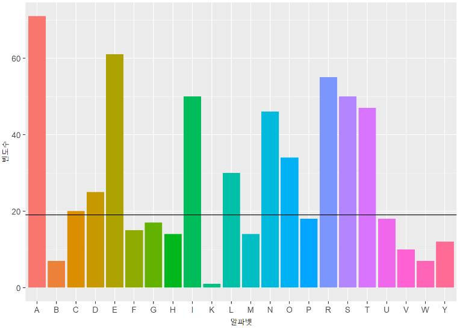
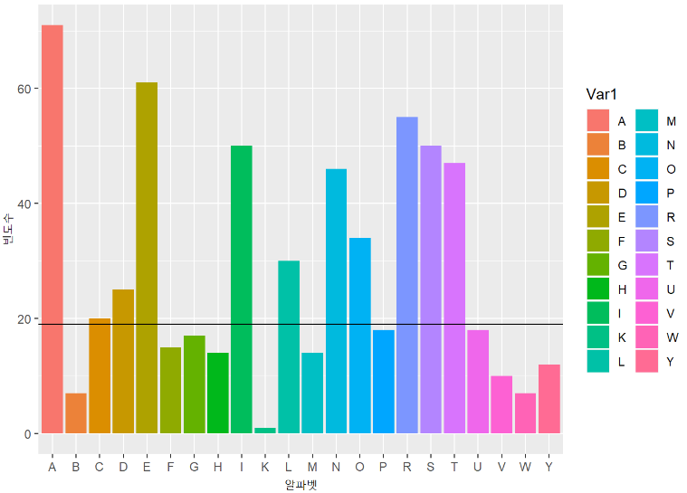

[toc]

# Day38 딥러닝을 위한 빅데이터 기초 - R(8)

# data.frame 속성

```R
name = c("갑", "을", "병", "정")
gender = c(2, 1, 1, 2)
mydata = data.frame(name, gender)
mydata
##   name gender
## 1   갑      2
## 2   을      1
## 3   병      1
## 4   정      2
```

- attr() : 속성값을 저장하거나 추출할 때 사용
- 메타데이터 : 데이터의 데이터
- ex. 메타데이터 : 데이터에 대한 부가 설명 등
  - gender의 메타 데이터 : 성별의 의미함

```R
attr(mydata$name, "what the variable means") = "응답자 이름"
mydata$name
## [1] 갑 을 병 정
## attr(,"what the variable means")
## [1] 응답자 이름
## Levels: 갑 병 을 정
```

```R
attr(mydata$gender, "what the variable means") = "응답자 성별"
mydata$gender
## [1] 2 1 1 2
## attr(,"what the variable means")
## [1] "응답자 성별"
```

```R
myvalues = gender
for(i in 1:length(gender)){
  myvalues[i] = ifelse(gender[i] == 1, "남성", "여성")
}
myvalues
## [1] "여성" "남성" "남성" "여성"

attr(mydata$gender, "what the value means") = myvalues
mydata$gender
## [1] 2 1 1 2
## attr(,"what the variable means")
## [1] "응답자 성별"
## attr(,"what the value means")
## [1] "여성" "남성" "남성" "여성"
```

```R
mydata$gender.character = attr(mydata$gender, "what the value means")
mydata
##   name gender gender.character
## 1   갑      2             여성
## 2   을      1             남성
## 3   병      1             남성
## 4   정      2             여성
```


# 문자열 관련 기본 문법

```R
myvector = c(1:6, 'a')
myvector
## [1] "1" "2" "3" "4" "5" "6" "a"

mylist = list(1:6, 'a')
mylist
## [[1]]
## [1] 1 2 3 4 5 6
## 
## [[2]]
## [1] "a"

obj1 = 1:4
obj2 = 6:10
obj3 = list(obj1, obj2)
obj3
## [[1]]
## [1] 1 2 3 4
## 
## [[2]]
## [1]  6  7  8  9 10

mylist = list(obj1, obj2, obj3)
mylist
## [[1]]
## [1] 1 2 3 4
## 
## [[2]]
## [1]  6  7  8  9 10
## 
## [[3]]
## [[3]][[1]]
## [1] 1 2 3 4
## 
## [[3]][[2]]
## [1]  6  7  8  9 10

mylist[[3]]
## [[1]]
## [1] 1 2 3 4
## 
## [[2]]
## [1]  6  7  8  9 10

mylist[[3]][1]
## [[1]]
## [1] 1 2 3 4

mylist[[3]][[1]]
## [1] 1 2 3 4
```

> 리스트에서 자료 추출시, [1]를 사용해서 리스트를 추출할 수 있고 [[1]]를 사용하면 벡터를 추출할 수 있다.

```R
mylist[[3]][[1]][2]
## [1] 2
```

## unlist

- 리스트를 벡터형식으로 리턴

```R
mylist = list(1:6, 'a')
mylist
## [[1]]
## [1] 1 2 3 4 5 6
## 
## [[2]]
## [1] "a"

unlist(mylist)
## [1] "1" "2" "3" "4" "5" "6" "a"

myvector == unlist(mylist)
## [1] TRUE TRUE TRUE TRUE TRUE TRUE TRUE
```

```R
mylist[[1]]
## [1] 1 2 3 4 5 6

mylist[[1]][1:6]
## [1] 1 2 3 4 5 6

mean(mylist[[1]][1:6])
## [1] 3.5
```

```R
unlist(mylist)
## [1] "1" "2" "3" "4" "5" "6" "a"

unlist(mylist)[1:6]
## [1] "1" "2" "3" "4" "5" "6"

mean(unlist(mylist)[1:6])
## Warning in mean.default(unlist(mylist)[1:6]): argument is not numeric or
## logical: returning NA
## [1] NA
```

- 하나의 문자 형태의 객체로 합치고자 할 때 사용

```R
name1 = 'Donald'
myspace = ' '
name2 = 'Trump'
list(name1, myspace, name2)
## [[1]]
## [1] "Donald"
## 
## [[2]]
## [1] " "
## 
## [[3]]
## [1] "Trump"

unlist(list(name1, myspace, name2))
## [1] "Donald" " "      "Trump"
```

## lapply

- 리스트 -> lapply

```R
mylist = list(1:4, 6:10, list(1:4, 6:10))
mylist
## [[1]]
## [1] 1 2 3 4
## 
## [[2]]
## [1]  6  7  8  9 10
## 
## [[3]]
## [[3]][[1]]
## [1] 1 2 3 4
## 
## [[3]][[2]]
## [1]  6  7  8  9 10
```

```R
lapply(mylist[[3]], mean)
## [[1]]
## [1] 2.5
## 
## [[2]]
## [1] 8
```

## tapply

```R
wordlist = c("the", "is", "a", "the")
df1 = c(3,4,2,4) # 문서1
df2 = rep(1,4) # 문서2
df2
## [1] 1 1 1 1
```

```R
# 문서1에서 wordlist에 속한 단어가 등장한 횟수
# the:3, is:4, a:2, the:4
tapply(df1, wordlist, sum)
##   a  is the 
##   2   4   7
```

```R
# 문서2에서 wordlist에 속한 단어가 등장한 횟수
# the:1, is:1, a:1, the:1
tapply(df2, wordlist, sum)
##   a  is the 
##   1   1   2
```

```R
# 빈도수 출력
tapply(df1, wordlist, length)
##   a  is the 
##   1   1   2
```

```R
tapply(df2, wordlist, length)
##   a  is the 
##   1   1   2
```

## 알파벳 출력 함수

```R
letters[3]
## [1] "c"

LETTERS[3]
## [1] "C"

letters[1:26]
##  [1] "a" "b" "c" "d" "e" "f" "g" "h" "i" "j" "k" "l" "m" "n" "o" "p" "q" "r" "s"
## [20] "t" "u" "v" "w" "x" "y" "z"

LETTERS[1:26]
##  [1] "A" "B" "C" "D" "E" "F" "G" "H" "I" "J" "K" "L" "M" "N" "O" "P" "Q" "R" "S"
## [20] "T" "U" "V" "W" "X" "Y" "Z"
```

## nchar() : 문자수를 세는 함수

```R
nchar("Korea")
## [1] 5

nchar("한국")
## [1] 2

nchar("Korea", type = "bytes")
## [1] 5

nchar("한국", type = "bytes")
## [1] 4

nchar("Korea ")
## [1] 6

nchar("Korea\t")
## [1] 6

nchar("Korea\t", type = "bytes")
## [1] 6

nchar("Korea, Republic of")
## [1] 18

nchar("Korea, 
      Republic of")
## [1] 25

nchar("Korea, \nRepublic of")
## [1] 19
```

## 문장관련 함수

- 문장을 단어로 분리

```R
mysentence = "Learning R is so interesting"
strsplit(mysentence, split = ' ')
## [[1]]
## [1] "Learning"    "R"           "is"          "so"          "interesting"
```

```R
mywords = strsplit(mysentence, split = ' ')
mywords
## [[1]]
## [1] "Learning"    "R"           "is"          "so"          "interesting"
```
- 단어를 문자로 분리

```R
strsplit(mywords[[1]][5], split = '')
## [[1]]
##  [1] "i" "n" "t" "e" "r" "e" "s" "t" "i" "n" "g"
```

```R
myletters = list(rep(NA, 5))
myletters
## [[1]]
## [1] NA NA NA NA NA
```

```R
for (i in 1:5){
  myletters[i] = strsplit(mywords[[1]][i], split = '')
}
myletters
## [[1]]
## [1] "L" "e" "a" "r" "n" "i" "n" "g"
## 
## [[2]]
## [1] "R"
## 
## [[3]]
## [1] "i" "s"
## 
## [[4]]
## [1] "s" "o"
## 
## [[5]]
##  [1] "i" "n" "t" "e" "r" "e" "s" "t" "i" "n" "g"
```

- 문자를 합쳐서 단어로 구성

```R
paste(1,2,3)
## [1] "1 2 3"
```

```R
paste(myletters[[1]], collapse = '#')
## [1] "L#e#a#r#n#i#n#g"

paste(myletters[[1]], collapse = '')
## [1] "Learning"
```

```R
mywords2 = list(rep(NA, 5))
for (i in 1:5){
  mywords2[i] = paste(myletters[[i]], collapse = '')
}
mywords2
## [[1]]
## [1] "Learning"
## 
## [[2]]
## [1] "R"
## 
## [[3]]
## [1] "is"
## 
## [[4]]
## [1] "so"
## 
## [[5]]
## [1] "interesting"
```

```R
paste(mywords2, collapse = ' ')
## [1] "Learning R is so interesting"
```

### rwiki 설명 문장

```R
rwiki = "R is a programming language and software environment for statistical computing and graphics supported by the R Foundation for Statistical Computing. The R language is widely used among statisticians and data miners for developing statistical software and data analysis. Polls, surveys of data miners, and studies of scholarly literature databases show that R's popularity has increased substantially in recent years.
R is a GNU package. The source code for the R software environment is written primarily in C, Fortran, and R. R is freely available under the GNU General Public License, and pre-compiled binary versions are provided for various operating systems. While R has a command line interface, there are several graphical front-ends available."
```

- 문단 단위로 구분

```R
rwikipara = strsplit(rwiki, split='\n')
rwikipara
## [[1]]
## [1] "R is a programming language and software environment for statistical computing and graphics supported by the R Foundation for Statistical Computing. The R language is widely used among statisticians and data miners for developing statistical software and data analysis. Polls, surveys of data miners, and studies of scholarly literature databases show that R's popularity has increased substantially in recent years."
## [2] "R is a GNU package. The source code for the R software environment is written primarily in C, Fortran, and R. R is freely available under the GNU General Public License, and pre-compiled binary versions are provided for various operating systems. While R has a command line interface, there are several graphical front-ends available."
```

- 문장 단위로 구분

```R
rwikisent = strsplit(rwikipara[[1]], split = '\\. ')
rwikisent
## [[1]]
## [1] "R is a programming language and software environment for statistical computing and graphics supported by the R Foundation for Statistical Computing"
## [2] "The R language is widely used among statisticians and data miners for developing statistical software and data analysis"                            
## [3] "Polls, surveys of data miners, and studies of scholarly literature databases show that R's popularity has increased substantially in recent years." 
## 
## [[2]]
## [1] "R is a GNU package"                                                                                                                     
## [2] "The source code for the R software environment is written primarily in C, Fortran, and R"                                               
## [3] "R is freely available under the GNU General Public License, and pre-compiled binary versions are provided for various operating systems"
## [4] "While R has a command line interface, there are several graphical front-ends available."
```

- 단어 단위로 구분

```R
rwikiwords = list(NA, NA)
rwikiwords
## [[1]]
## [1] NA
## 
## [[2]]
## [1] NA
```

```R
for (i in 1:2){
  rwikiwords[[i]] = strsplit(rwikisent[[i]], split = ' ')
}
rwikiwords
## [[1]]
## [[1]][[1]]
##  [1] "R"           "is"          "a"           "programming" "language"   
##  [6] "and"         "software"    "environment" "for"         "statistical"
## [11] "computing"   "and"         "graphics"    "supported"   "by"         
## [16] "the"         "R"           "Foundation"  "for"         "Statistical"
## [21] "Computing"  
## 
## [[1]][[2]]
##  [1] "The"           "R"             "language"      "is"           
##  [5] "widely"        "used"          "among"         "statisticians"
##  [9] "and"           "data"          "miners"        "for"          
## [13] "developing"    "statistical"   "software"      "and"          
## [17] "data"          "analysis"     
## 
## [[1]][[3]]
##  [1] "Polls,"        "surveys"       "of"            "data"         
##  [5] "miners,"       "and"           "studies"       "of"           
##  [9] "scholarly"     "literature"    "databases"     "show"         
## [13] "that"          "R's"           "popularity"    "has"          
## [17] "increased"     "substantially" "in"            "recent"       
## [21] "years."       
## 
## 
## [[2]]
## [[2]][[1]]
## [1] "R"       "is"      "a"       "GNU"     "package"
## 
## [[2]][[2]]
##  [1] "The"         "source"      "code"        "for"         "the"        
##  [6] "R"           "software"    "environment" "is"          "written"    
## [11] "primarily"   "in"          "C,"          "Fortran,"    "and"        
## [16] "R"          
## 
## [[2]][[3]]
##  [1] "R"            "is"           "freely"       "available"    "under"       
##  [6] "the"          "GNU"          "General"      "Public"       "License,"    
## [11] "and"          "pre-compiled" "binary"       "versions"     "are"         
## [16] "provided"     "for"          "various"      "operating"    "systems"     
## 
## [[2]][[4]]
##  [1] "While"      "R"          "has"        "a"          "command"   
##  [6] "line"       "interface," "there"      "are"        "several"   
## [11] "graphical"  "front-ends" "available."
```

```R
rwikiwords[[1]][[2]][3]
## [1] "language"
```

## regexpr()

- regexpr() : 정규표현식, 처음 등장하는 텍스트 위치 출력

```R
mysentence = "Learning R is so interesting"
regexpr("ing", mysentence)
## [1] 6
## attr(,"match.length")
## [1] 3
## attr(,"index.type")
## [1] "chars"
## attr(,"useBytes")
## [1] TRUE
```

```R
loc.begin = as.vector(regexpr("ing", mysentence))
loc.begin
## [1] 6
```

```R
loc.length = attr(regexpr("ing", mysentence), 'match.length')
loc.length
## [1] 3
```

```R
loc.end = loc.begin+loc.length-1
loc.end
## [1] 8
```

## gregexpr()

- gregexpr() : 패턴이 등장하는 모든 텍스트 위치 출력

```R
gregexpr("ing", mysentence)
## [[1]]
## [1]  6 26
## attr(,"match.length")
## [1] 3 3
## attr(,"index.type")
## [1] "chars"
## attr(,"useBytes")
## [1] TRUE
```

- 발견된 패턴의 수

```R
length(gregexpr("ing", mysentence)[[1]])
## [1] 2
```

```R
loc.begin = as.vector(gregexpr("ing", mysentence)[[1]])
loc.begin
## [1]  6 26
```

```R
loc.length = attr(gregexpr("ing", mysentence)[[1]], "match.length")
loc.length
## [1] 3 3
```

```R
loc.end = loc.begin + loc.length - 1
loc.end
## [1]  8 28
```

## regexec()

```R
regexpr("interesting", mysentence)
## [1] 18
## attr(,"match.length")
## [1] 11
## attr(,"index.type")
## [1] "chars"
## attr(,"useBytes")
## [1] TRUE
```

```R
regexec("interestin(g)", mysentence)
## [[1]]
## [1] 18 28
## attr(,"match.length")
## [1] 11  1
## attr(,"index.type")
## [1] "chars"
## attr(,"useBytes")
## [1] TRUE
```

```R
regexec("so (interestin(g))", mysentence)
## [[1]]
## [1] 15 18 28
## attr(,"match.length")
## [1] 14 11  1
## attr(,"index.type")
## [1] "chars"
## attr(,"useBytes")
## [1] TRUE
```

----

### rwiki 설명 문장(이어서)

```R
rwikisent
## [[1]]
## [1] "R is a programming language and software environment for statistical computing and graphics supported by the R Foundation for Statistical Computing"
## [2] "The R language is widely used among statisticians and data miners for developing statistical software and data analysis"                            
## [3] "Polls, surveys of data miners, and studies of scholarly literature databases show that R's popularity has increased substantially in recent years." 
## 
## [[2]]
## [1] "R is a GNU package"                                                                                                                     
## [2] "The source code for the R software environment is written primarily in C, Fortran, and R"                                               
## [3] "R is freely available under the GNU General Public License, and pre-compiled binary versions are provided for various operating systems"
## [4] "While R has a command line interface, there are several graphical front-ends available."
```

```R
mysentences = unlist(rwikisent)
mysentences
## [1] "R is a programming language and software environment for statistical computing and graphics supported by the R Foundation for Statistical Computing"
## [2] "The R language is widely used among statisticians and data miners for developing statistical software and data analysis"                            
## [3] "Polls, surveys of data miners, and studies of scholarly literature databases show that R's popularity has increased substantially in recent years." 
## [4] "R is a GNU package"                                                                                                                                 
## [5] "The source code for the R software environment is written primarily in C, Fortran, and R"                                                           
## [6] "R is freely available under the GNU General Public License, and pre-compiled binary versions are provided for various operating systems"            
## [7] "While R has a command line interface, there are several graphical front-ends available."
```

```R
regexpr("software", mysentences)
## [1] 33 94 -1 -1 27 -1 -1
## attr(,"match.length")
## [1]  8  8 -1 -1  8 -1 -1
## attr(,"index.type")
## [1] "chars"
## attr(,"useBytes")
## [1] TRUE
```

```R
gregexpr("software", mysentences)
## [[1]]
## [1] 33
## attr(,"match.length")
## [1] 8
## attr(,"index.type")
## [1] "chars"
## attr(,"useBytes")
## [1] TRUE
## 
## [[2]]
## [1] 94
## attr(,"match.length")
## [1] 8
## attr(,"index.type")
## [1] "chars"
## attr(,"useBytes")
## [1] TRUE
## 
## [[3]]
## [1] -1
## attr(,"match.length")
## [1] -1
## attr(,"index.type")
## [1] "chars"
## attr(,"useBytes")
## [1] TRUE
## 
## [[4]]
## [1] -1
## attr(,"match.length")
## [1] -1
## attr(,"index.type")
## [1] "chars"
## attr(,"useBytes")
## [1] TRUE
## 
## [[5]]
## [1] 27
## attr(,"match.length")
## [1] 8
## attr(,"index.type")
## [1] "chars"
## attr(,"useBytes")
## [1] TRUE
## 
## [[6]]
## [1] -1
## attr(,"match.length")
## [1] -1
## attr(,"index.type")
## [1] "chars"
## attr(,"useBytes")
## [1] TRUE
## 
## [[7]]
## [1] -1
## attr(,"match.length")
## [1] -1
## attr(,"index.type")
## [1] "chars"
## attr(,"useBytes")
## [1] TRUE
```

```R
sub("ing", "ING", mysentence)
## [1] "LearnING R is so interesting"
```

```R
gsub("ing", "ING", mysentence)
## [1] "LearnING R is so interestING"
```

```R
mytemp = regexpr("software", mysentences)
mytemp
## [1] 33 94 -1 -1 27 -1 -1
## attr(,"match.length")
## [1]  8  8 -1 -1  8 -1 -1
## attr(,"index.type")
## [1] "chars"
## attr(,"useBytes")
## [1] TRUE
```

```R
my.begin = as.vector(mytemp)
my.begin
## [1] 33 94 -1 -1 27 -1 -1
```

```R
my.begin[my.begin == -1] = NA
my.begin
## [1] 33 94 NA NA 27 NA NA
```

```R
my.end = my.begin + attr(mytemp, "match.length") - 1
my.end
## [1]  40 101  NA  NA  34  NA  NA
```

```R
length(my.begin)
## [1] 7

mylocs = matrix(NA, nrow = length(my.begin), ncol = 2)
mylocs
##      [,1] [,2]
## [1,]   NA   NA
## [2,]   NA   NA
## [3,]   NA   NA
## [4,]   NA   NA
## [5,]   NA   NA
## [6,]   NA   NA
## [7,]   NA   NA
```

```R
colnames(mylocs) = c("begin", "end")
mylocs
##      begin end
## [1,]    NA  NA
## [2,]    NA  NA
## [3,]    NA  NA
## [4,]    NA  NA
## [5,]    NA  NA
## [6,]    NA  NA
## [7,]    NA  NA
```

```R
paste("hi", 1:3, sep = ".")
## [1] "hi.1" "hi.2" "hi.3"

paste("hi", "hello")
## [1] "hi hello"
```

```R
rownames(mylocs) = paste("sentence", 1:length(my.begin), sep = ".")
mylocs
##            begin end
## sentence.1    NA  NA
## sentence.2    NA  NA
## sentence.3    NA  NA
## sentence.4    NA  NA
## sentence.5    NA  NA
## sentence.6    NA  NA
## sentence.7    NA  NA
```

```R
for(i in 1:length(my.begin)){
  mylocs[i,] = cbind(my.begin[i], my.end[i])
}
mylocs
##            begin end
## sentence.1    33  40
## sentence.2    94 101
## sentence.3    NA  NA
## sentence.4    NA  NA
## sentence.5    27  34
## sentence.6    NA  NA
## sentence.7    NA  NA
```

## grep, grepl

- grep, grepl : 특정 표현이 텍스트에 있는지 확인

```R
mysentences
## [1] "R is a programming language and software environment for statistical computing and graphics supported by the R Foundation for Statistical Computing"
## [2] "The R language is widely used among statisticians and data miners for developing statistical software and data analysis"                            
## [3] "Polls, surveys of data miners, and studies of scholarly literature databases show that R's popularity has increased substantially in recent years." 
## [4] "R is a GNU package"                                                                                                                                 
## [5] "The source code for the R software environment is written primarily in C, Fortran, and R"                                                           
## [6] "R is freely available under the GNU General Public License, and pre-compiled binary versions are provided for various operating systems"            
## [7] "While R has a command line interface, there are several graphical front-ends available."
```

```R
grep("software", mysentences)
## [1] 1 2 5
```

> 1, 2, 5번 문장에서 표현이 발견

```R
grepl("software", mysentences)
## [1]  TRUE  TRUE FALSE FALSE  TRUE FALSE FALSE
```

## 고유명사 처리

- “Donald Trump” => “Donald_Trump”

```R
rwikisent
## [[1]]
## [1] "R is a programming language and software environment for statistical computing and graphics supported by the R Foundation for Statistical Computing"
## [2] "The R language is widely used among statisticians and data miners for developing statistical software and data analysis"                            
## [3] "Polls, surveys of data miners, and studies of scholarly literature databases show that R's popularity has increased substantially in recent years." 
## 
## [[2]]
## [1] "R is a GNU package"                                                                                                                     
## [2] "The source code for the R software environment is written primarily in C, Fortran, and R"                                               
## [3] "R is freely available under the GNU General Public License, and pre-compiled binary versions are provided for various operating systems"
## [4] "While R has a command line interface, there are several graphical front-ends available."
```

```R
sent1 = rwikisent[[1]][1]
sent1
## [1] "R is a programming language and software environment for statistical computing and graphics supported by the R Foundation for Statistical Computing"
```

```R
new_sent1 = gsub("R Foundation for Statistical Computing", 
                 "R_Foundation_for_Statistical_Computing",
                 sent1)
new_sent1
## [1] "R is a programming language and software environment for statistical computing and graphics supported by the R_Foundation_for_Statistical_Computing"
```

```R
length(strsplit(sent1, split = " ")[[1]])
## [1] 21

length(strsplit(new_sent1, split = " ")[[1]])
## [1] 17

sum(table(strsplit(sent1, split = " ")))
## [1] 21
```

## for, by, and, the 제거

```R
drop.sent1 = gsub("and|by|for|the", "", new_sent1)
sum(table(strsplit(drop.sent1, split = " ")))
## [1] 17
```

```R
mysentence
## [1] "Learning R is so interesting"
```

## 특정 단어 찾기

```R
mypattern = regexpr("ing", mysentence)
mypattern
## [1] 6
## attr(,"match.length")
## [1] 3
## attr(,"index.type")
## [1] "chars"
## attr(,"useBytes")
## [1] TRUE
```

```R
regmatches(mysentence, mypattern)
## [1] "ing"
```

```R
mypattern = gregexpr("ing", mysentence)
regmatches(mysentence, mypattern)
## [[1]]
## [1] "ing" "ing"
```

### invert 옵션 : 반대 표현

```R
mypattern = regexpr("ing", mysentence)
regmatches(mysentence, mypattern, invert = TRUE)
## [[1]]
## [1] "Learn"                " R is so interesting"
```

```R
mypattern = gregexpr("ing", mysentence)
regmatches(mysentence, mypattern, invert = TRUE)
## [[1]]
## [1] "Learn"             " R is so interest" ""
```

```R
strsplit(mysentence, split = "ing")
## [[1]]
## [1] "Learn"             " R is so interest"
```

```R
gsub("ing", "", mysentence)
## [1] "Learn R is so interest"
```

### substr

```R
substr(mysentence, 1, 20)
## [1] "Learning R is so int"
```

```R
substr(mysentences, 1, 20)
## [1] "R is a programming l" "The R language is wi" "Polls, surveys of da"
## [4] "R is a GNU package"   "The source code for " "R is freely availabl"
## [7] "While R has a comman"
```

### ing로 끝나는 모든 단어를 검출

```R
my2sentence = c("Learning R is so interesting", 
                "He is a fascinating singer")
```

```R
mypattern0 = gregexpr("ing", my2sentence)
mypattern0
## [[1]]
## [1]  6 26
## attr(,"match.length")
## [1] 3 3
## attr(,"index.type")
## [1] "chars"
## attr(,"useBytes")
## [1] TRUE
## 
## [[2]]
## [1] 17 22
## attr(,"match.length")
## [1] 3 3
## attr(,"index.type")
## [1] "chars"
## attr(,"useBytes")
## [1] TRUE
```

```R
regmatches(my2sentence, mypattern0)
## [[1]]
## [1] "ing" "ing"
## 
## [[2]]
## [1] "ing" "ing"
```

- ing앞에 온 알파벳 표현 확인 => `[[:alpha:]]`

```R
mypattern1 = gregexpr("[[:alpha:]]+(ing)", my2sentence)
mypattern1
## [[1]]
## [1]  1 18
## attr(,"match.length")
## [1]  8 11
## attr(,"index.type")
## [1] "chars"
## attr(,"useBytes")
## [1] TRUE
## 
## [[2]]
## [1]  9 21
## attr(,"match.length")
## [1] 11  4
## attr(,"index.type")
## [1] "chars"
## attr(,"useBytes")
## [1] TRUE

regmatches(my2sentence, mypattern1)
## [[1]]
## [1] "Learning"    "interesting"
## 
## [[2]]
## [1] "fascinating" "sing"
```

- `[[:alpha:]]+ing => \\b`

```R
mypattern2 = gregexpr("[[:alpha:]]+(ing)\\b", my2sentence)
regmatches(my2sentence, mypattern2)
## [[1]]
## [1] "Learning"    "interesting"
## 
## [[2]]
## [1] "fascinating"
```

- 7개의 문장 모두에 대해 ing로 끝나는 영어 단어 출력

```R
mypattern3 = gregexpr("[[:alpha:]]+(ing)\\b", mysentences)
myings = regmatches(mysentences, mypattern3)
myings
## [[1]]
## [1] "programming" "computing"   "Computing"  
## 
## [[2]]
## [1] "developing"
## 
## [[3]]
## character(0)
## 
## [[4]]
## character(0)
## 
## [[5]]
## character(0)
## 
## [[6]]
## [1] "operating"
## 
## [[7]]
## character(0)
```

```R
unlist(myings)
## [1] "programming" "computing"   "Computing"   "developing"  "operating"

table(unlist(myings))
## 
##   computing   Computing  developing   operating programming 
##           1           1           1           1           1
```

> 문서 전체에서 ing로 끝나는 영어 단어를 모두 추출하고, 빈도수를 조사

```R
mypattern = gregexpr("[[:alpha:]]+(ing)\\b", tolower(mysentences))
mypattern
## [[1]]
## [1]   8  70 139
## attr(,"match.length")
## [1] 11  9  9
## attr(,"index.type")
## [1] "chars"
## attr(,"useBytes")
## [1] TRUE
## 
## [[2]]
## [1] 71
## attr(,"match.length")
## [1] 10
## attr(,"index.type")
## [1] "chars"
## attr(,"useBytes")
## [1] TRUE
## 
## [[3]]
## [1] -1
## attr(,"match.length")
## [1] -1
## attr(,"index.type")
## [1] "chars"
## attr(,"useBytes")
## [1] TRUE
## 
## [[4]]
## [1] -1
## attr(,"match.length")
## [1] -1
## attr(,"index.type")
## [1] "chars"
## attr(,"useBytes")
## [1] TRUE
## 
## [[5]]
## [1] -1
## attr(,"match.length")
## [1] -1
## attr(,"index.type")
## [1] "chars"
## attr(,"useBytes")
## [1] TRUE
## 
## [[6]]
## [1] 119
## attr(,"match.length")
## [1] 9
## attr(,"index.type")
## [1] "chars"
## attr(,"useBytes")
## [1] TRUE
## 
## [[7]]
## [1] -1
## attr(,"match.length")
## [1] -1
## attr(,"index.type")
## [1] "chars"
## attr(,"useBytes")
## [1] TRUE
```

```R
myings = regmatches(tolower(mysentences), mypattern)
table(unlist(myings))
## 
##   computing  developing   operating programming 
##           2           1           1           1
```

### 대소문자 구분없이 stat- 시작되는 단어 추출

```R
mypattern4 = gregexpr("(stat)[[:alpha:]]+", tolower(mysentences))
mystats = regmatches(tolower(mysentences), mypattern4)
table(unlist(mystats))
## 
##   statistical statisticians 
##             3             1
```

### 대문자 추출

```R
mysentences
## [1] "R is a programming language and software environment for statistical computing and graphics supported by the R Foundation for Statistical Computing"
## [2] "The R language is widely used among statisticians and data miners for developing statistical software and data analysis"                            
## [3] "Polls, surveys of data miners, and studies of scholarly literature databases show that R's popularity has increased substantially in recent years." 
## [4] "R is a GNU package"                                                                                                                                 
## [5] "The source code for the R software environment is written primarily in C, Fortran, and R"                                                           
## [6] "R is freely available under the GNU General Public License, and pre-compiled binary versions are provided for various operating systems"            
## [7] "While R has a command line interface, there are several graphical front-ends available."
```

```R
gregexpr("[[:upper:]]", mysentences)
## [[1]]
## [1]   1 110 112 127 139
## attr(,"match.length")
## [1] 1 1 1 1 1
## attr(,"index.type")
## [1] "chars"
## attr(,"useBytes")
## [1] TRUE
## 
## [[2]]
## [1] 1 5
## attr(,"match.length")
## [1] 1 1
## attr(,"index.type")
## [1] "chars"
## attr(,"useBytes")
## [1] TRUE
## 
## [[3]]
## [1]  1 88
## attr(,"match.length")
## [1] 1 1
## attr(,"index.type")
## [1] "chars"
## attr(,"useBytes")
## [1] TRUE
## 
## [[4]]
## [1]  1  8  9 10
## attr(,"match.length")
## [1] 1 1 1 1
## attr(,"index.type")
## [1] "chars"
## attr(,"useBytes")
## [1] TRUE
## 
## [[5]]
## [1]  1 25 72 75 88
## attr(,"match.length")
## [1] 1 1 1 1 1
## attr(,"index.type")
## [1] "chars"
## attr(,"useBytes")
## [1] TRUE
## 
## [[6]]
## [1]  1 33 34 35 37 45 52
## attr(,"match.length")
## [1] 1 1 1 1 1 1 1
## attr(,"index.type")
## [1] "chars"
## attr(,"useBytes")
## [1] TRUE
## 
## [[7]]
## [1] 1 7
## attr(,"match.length")
## [1] 1 1
## attr(,"index.type")
## [1] "chars"
## attr(,"useBytes")
## [1] TRUE
```

```R
mypattern = gregexpr("[[:upper:]]", mysentences)
my.uppers = regmatches(mysentences, mypattern)
my.uppers
## [[1]]
## [1] "R" "R" "F" "S" "C"
## 
## [[2]]
## [1] "T" "R"
## 
## [[3]]
## [1] "P" "R"
## 
## [[4]]
## [1] "R" "G" "N" "U"
## 
## [[5]]
## [1] "T" "R" "C" "F" "R"
## 
## [[6]]
## [1] "R" "G" "N" "U" "G" "P" "L"
## 
## [[7]]
## [1] "W" "R"
```

```R
table(unlist(my.uppers))
## 
## C F G L N P R S T U W 
## 2 2 3 1 2 2 9 1 2 2 1
```

### 소문자 추출

```R
mypattern = gregexpr("[[:lower:]]", mysentences)
my.lowers = regmatches(mysentences, mypattern)
table(unlist(my.lowers))
## 
##  a  b  c  d  e  f  g  h  i  k  l  m  n  o  p  r  s  t  u  v  w  y 
## 71  7 18 25 61 13 14 14 50  1 29 14 44 34 16 46 49 45 16 10  6 12
```

### 문자 추출

```R
mypattern = gregexpr("[[:upper:]]", toupper(mysentences))
my.alphas = regmatches(toupper(mysentences), mypattern)
mytable = table(unlist(my.alphas))
mytable
## 
##  A  B  C  D  E  F  G  H  I  K  L  M  N  O  P  R  S  T  U  V  W  Y 
## 71  7 20 25 61 15 17 14 50  1 30 14 46 34 18 55 50 47 18 10  7 12
```

```R
max(mytable)
## [1] 71

mytable[mytable == max(mytable)]
##  A 
## 71
```

```R
sum(mytable)
## [1] 622
```

#### 시각화

```R
library(ggplot2)
```

```R
class(mytable)
## [1] "table"
```

- ggplot할 때 데이터프레임으로 변환 후 적용

```R
mydata = data.frame(mytable)
ggplot(mydata, aes(x = Var1, y = Freq, fill = Var1)) +
  geom_bar(stat = "identity") +
  guides(fill = FALSE) +
  geom_hline(aes(yintercept = median(mytable))) +
  xlab("알파벳") + 
  ylab("빈도수")
```



```R
mydata = data.frame(mytable)
ggplot(mydata, aes(x = Var1, y = Freq, fill = Var1)) +
  geom_bar(stat = "identity") +
  # guides(fill = FALSE) +
  geom_hline(aes(yintercept = median(mytable))) +
  xlab("알파벳") + 
  ylab("빈도수")
```




# 연습문제

- movie-pang02.csv
  1. 베이지안 필터기 제작
  2. POS/NEG 단위로 알파벳 문자(빈도수)

## 1.

```R
movie_pang = read.csv("movie-pang02/movie-pang02.csv",
                      stringsAsFactors = FALSE)
movie_pang$class = as.factor(movie_pang$class)
str(movie_pang)
## 'data.frame':    2000 obs. of  2 variables:
##  $ class: Factor w/ 2 levels "Neg","Pos": 2 2 2 2 2 2 2 2 2 2 ...
##  $ text : chr  " films adapted from comic books have had plenty of success   whether they re about superheroes   batman   super"| __truncated__ " every now and then a movie comes along from a suspect studio   with every indication that it will be a stinker"| __truncated__ " you ve got mail works alot better than it deserves to    in order to make the film a success   all they had to"| __truncated__ "    jaws   is a rare film that grabs your attention before it shows you a single image on screen    the movie o"| __truncated__ ...
```

```R
library(tm)
```

```R
movie_corpus = VCorpus(VectorSource(movie_pang$text))
movie_dtm = DocumentTermMatrix(
  movie_corpus, control = list(tolower = T,
                               removeNumbers = T,
                               stopwords = T,
                               removePunctuation = T,
                               stemming = T))
movie_dtm
## <<DocumentTermMatrix (documents: 2000, terms: 25006)>>
## Non-/sparse entries: 501939/49510061
## Sparsity           : 99%
## Maximal term length: 53
## Weighting          : term frequency (tf)
```

```R
table(movie_pang$class)
## 
##  Neg  Pos 
## 1000 1000
```

```R
movie_dtm_train = movie_dtm[c(1:700, 1001:1700), ]
movie_dtm_test = movie_dtm[c(701:1000, 1701:2000), ]

movie_train_labels = movie_pang[c(1:700, 1001:1700), 1]
movie_test_labels = movie_pang[c(701:1000, 1701:2000), 1]
```

```R
movie_freq_words = findFreqTerms(movie_dtm_train, 5)

convert_counts = function(x){
  x = ifelse(x>0, "Yes", "NO")
}
```

```R
movie_dtm_freq_train = movie_dtm_train[, movie_freq_words]
movie_dtm_freq_test = movie_dtm_test[, movie_freq_words]

movie_train = apply(movie_dtm_freq_train, MARGIN = 2, convert_counts)
movie_test = apply(movie_dtm_freq_test, MARGIN = 2, convert_counts)
```

```R
library("e1071")
movie_classifier = naiveBayes(movie_train, movie_train_labels)
movie_test_pred = predict(movie_classifier, movie_test)

table(movie_test_pred, movie_test_labels)
##                movie_test_labels
## movie_test_pred Neg Pos
##             Neg 261  78
##             Pos  39 222
```

## 2.

```R
movie_pos = movie_pang$text[1:1000]
movie_neg = movie_pang$text[1001:2000]
```
```R
pos_pattern = gregexpr("[[:alpha:]]", toupper(movie_pos))
pos_alpha = regmatches(toupper(movie_pos), pos_pattern)
pos_table = table(unlist(pos_alpha))
pos_table
## 
##      A      B      C      D      E      F      G      H      I      J      K 
## 257030  50316  96508 106545 384360  73883  67057 169969 241671   7611  26962 
##      L      M      N      O      P      Q      R      S      T      U      V 
## 143817  87534 216771 229597  57059   3180 188651 222104 287907  83403  36258 
##      W      X      Y      Z 
##  57276   5758  61904   3318

pos_table[pos_table == max(pos_table)]
##      E 
## 384360
```

```R
neg_pattern = gregexpr("[[:alpha:]]", toupper(movie_neg))
neg_alpha = regmatches(toupper(movie_neg), neg_pattern)
neg_table = table(unlist(neg_alpha))
neg_table
## 
##      A      B      C      D      E      F      G      H      I      J      K 
## 223499  46694  83606  95302 338479  62165  60172 150770 209470   7172  25390 
##      L      M      N      O      P      Q      R      S      T      U      V 
## 126738  76512 190446 207447  52282   2562 162031 193348 256611  76181  32849 
##      W      X      Y      Z 
##  51563   5032  55447   2918

neg_table[neg_table == max(neg_table)]
##      E 
## 338479
```

