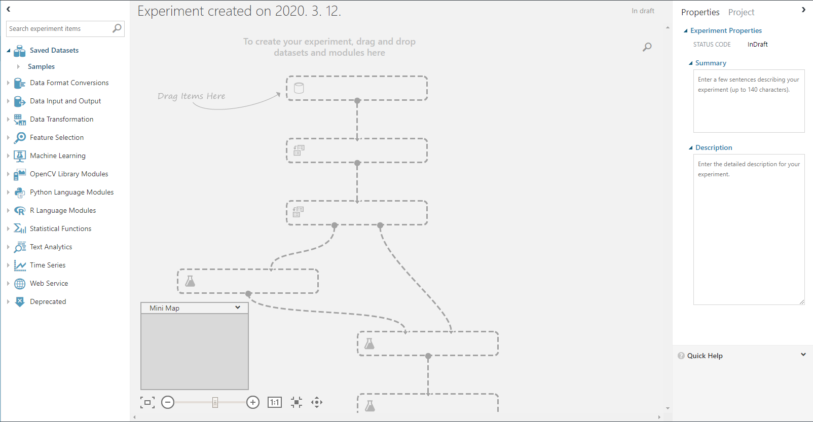
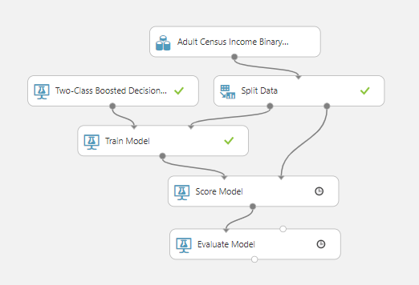
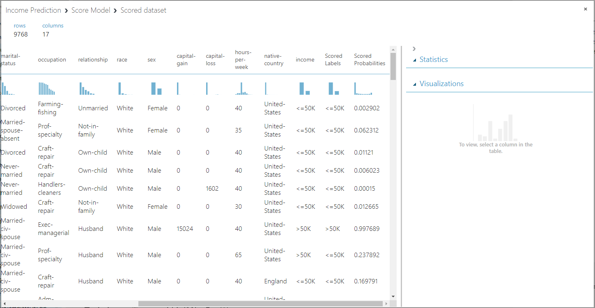

[toc]

# Day45 Azure 머신러닝을 활용한 기계학습(1)

# 1. Azure : 클라우드 컴퓨팅 플랫폼

   1. azure machine learning studio 사용 이유
      1. 컴퓨팅 자원 부족
      2. GPU기반 설정 작업 번거로움
      3. 학습 도구 설치 어려움
      4. 버전 관리
      5. 주피터 노트북 설치 및 관리
   2. 모델 개발 과정
      1. 실험 데이터 삽입(azure cloud)
      2. 실험 데이터 전처리
      3. 데이터 특징 추출
      4. 알고리즘 선택 -> 학습 -> 모델 -> 평가 -> 오류 체크
      5. 모델 저장
      6. 웹 서비스 배포
   3. studio.azureml.net
      - New
        - DATASET : 로컬에 존재하는 data 파일이나 Python or R Script를 클라우드에 업로드
        - MODULE : R로 작성된 Script 파일을 zip파일로 압축하여 사용할 수 있게 해줌
        - PROJECT : project를 만들 때 사용하는 기능
        - EXPERIMENT : 데이터를 이용하여 모델을 만들고 web 서비스를 할 수 있게 해주는 기능
        - NOTEBOOK : Python or R을 직접 코딩해 볼 수 있는 workspace를 제공하는 기능
      - Blank Experiment
        - Saved Datasets
          - 우리가 사용할 수 있는 데이터들을 확인 할 수 있는 메뉴
          - Samples : 기본적으로 제공되는 데이터
        - Data Format Conversions
          - 입력 데이터의 형식을 변환할 때 사용하는 메뉴
        - Data Input and Output
          - 데이터를 가져오고 내보내는 기능을 하는 메뉴
          - 훈련 모델을 불러오는 기능 존재
        - Data Transformaion
          - 데이터 split, join, filter 등의 기능을 제공해 주는 메뉴
          - Manipulation : 행, 열 추가, 결측값 처리 등등
        - Feature Selection
          - feature를 추출할 때 사용하는 메뉴
        - Machine Learning
          - 모델 생성, 훈련, 평가 등을 하는 메뉴
        - OpenCV Library Modules
          - 영상처리 라이브러리로 영상처리를 하는 기능을 이용하여 이미지 분석을 실시 할 수 있다.
        - Python Language Modules
        - R Language Modules
        - Statistical Funcions
          - 기술통계, 통계검정 등 통계관련 함수 제공 메뉴
        - Text Analytics
        - Time Series
        - Web Service
        - Deprecated
          - 사라질 기술들을 모아놓은 메뉴

- 가운데 창을 캔버스 창이라고 하고
- 오른쪽 창은 Propertiess로 속성을 의미한다.
- 왼쪽 창에 있는 기능 중 원하는 기능을 캔버스 창으로 드래그&드랍을 함으로써 분석을 실시할 수 있다.
- 프로그램 작성

- => RUN
- Score Model -> 오른쪽 클릭 -> Scored dataset -> Visualize

   

- income : 실제값
- Scored Labels : 예측값
- Scored Probabilities : 예측확률

이렇게 분석하는 코드를 R or Python 코드로 저장할 수 있다.

# Day46 Azure 머신러닝을 활용한 기계학습(2)

''파이썬 라이브러리를 활용한 머신러능(안드레아스 뮐러, 세라 가이도 저)'' 책 내용

1. 모델 결합 방법(앙상블) :
   1. 취합 방법론 : 사용할 모형의 집합이 이미 결정되어 있음
      - 종류 : 다수결, 배깅, 랜덤 포레스트
   2. 부스팅 방법론 : 사용할 모형을 계속해서 늘려가는 방법
      - 종류 : 에이다부스트(Ada Boost), 그래디언트 부스트(Gradient Boost)

# Azure Machin Learning

- ROC
  - FPR(거짓양성비율) = FP / (FP + TN)
    - TP : P으로 예측, 실제는 P인 경우
    - FN : N으로 예측, 실제는 P인 경우
    - FP : P으로 예측, 실제는 N인 경우
    - TN : N으로 예측, 실제는 N인 경우
  - TPR = TP / (TP + FN)
  - => TPR -> 1, FPR -> 0 에 가까운  모델이 좋음