[toc]

# Day47 Scikitlearn을 활용한 머신러닝(1)

# bank.csv

UCI website의 Bank Marketing Data Set

```python
import pandas as pd
import numpy as np
import matplotlib.pyplot as plt
import seaborn as sns
from sklearn.model_selection import train_test_split
from sklearn.tree import export_graphviz
from sklearn import tree
from sklearn import metrics
%matplotlib inline
```

```python
bank = pd.read_csv("../bank.csv")
bank.head()
```

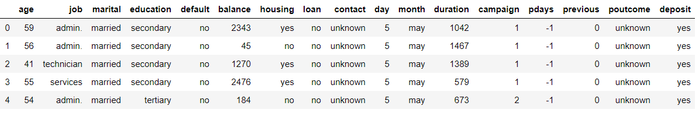

- 각 컬럼별 null의 개수 출력

```python
bank.isnull().sum()
# > age          0
# > job          0
# > marital      0
# > education    0
# > default      0
# > balance      0
# > housing      0
# > loan         0
# > contact      0
# > day          0
# > month        0
# > duration     0
# > campaign     0
# > pdays        0
# > previous     0
# > poutcome     0
# > deposit      0
# > dtype: int64
```

- 기초 통계

```python
bank.describe()
```

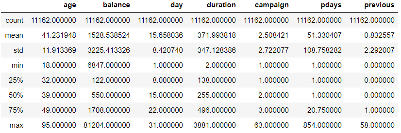

- age열

```python
# box plot
sns.boxplot(x = bank['age'])
```

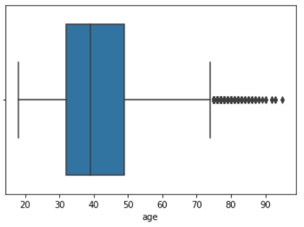

```python
# dist plot
sns.distplot(bank.age, bins = 100)
```

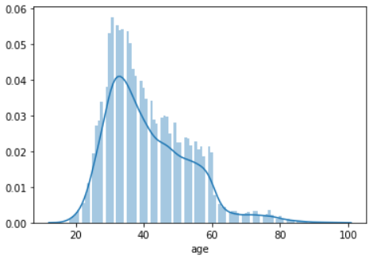

- duration 열

```python
sns.boxplot(x = bank.duration)
```

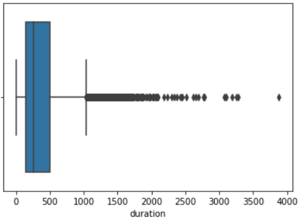

## Convert categorical data

```python
bankData = bank.copy()
bankData.info()
# > <class 'pandas.core.frame.DataFrame'>
# > RangeIndex: 11162 entries, 0 to 11161
# > Data columns (total 17 columns):
# > age          11162 non-null int64
# > job          11162 non-null object
# > marital      11162 non-null object
# > education    11162 non-null object
# > default      11162 non-null object
# > balance      11162 non-null int64
# > housing      11162 non-null object
# > loan         11162 non-null object
# > contact      11162 non-null object
# > day          11162 non-null int64
# > month        11162 non-null object
# > duration     11162 non-null int64
# > campaign     11162 non-null int64
# > pdays        11162 non-null int64
# > previous     11162 non-null int64
# > poutcome     11162 non-null object
# > deposit      11162 non-null object
# > dtypes: int64(7), object(10)
# > memory usage: 1.4+ MB
```

```python
bankData.columns
# > Index(['age', 'job', 'marital', 'education', 'default', 'balance', 'housing',
# >        'loan', 'contact', 'day', 'month', 'duration', 'campaign', 'pdays',
# >        'previous', 'poutcome', 'deposit'],
# >       dtype='object')
```

- job별로 count

```python
bankData.groupby(['job']).size()
# > job
# > admin.           1334
# > blue-collar      1944
# > entrepreneur      328
# > housemaid         274
# > management       2566
# > retired           778
# > self-employed     405
# > services          923
# > student           360
# > technician       1823
# > unemployed        357
# > unknown            70
# > dtype: int64
```

```python
bankData.job.value_counts()
# > management       2566
# > blue-collar      1944
# > technician       1823
# > admin.           1334
# > services          923
# > retired           778
# > self-employed     405
# > student           360
# > unemployed        357
# > entrepreneur      328
# > housemaid         274
# > unknown            70
# > Name: job, dtype: int64
```

- deposit이 yes인 데이터에 한해서 개수를 출력
- ex. admin이면서 deposit이 yes인 데이터 건수

```python
bankData[bankData.deposit == "yes"].job.value_counts()
# > management       1301
# > technician        840
# > blue-collar       708
# > admin.            631
# > retired           516
# > services          369
# > student           269
# > unemployed        202
# > self-employed     187
# > entrepreneur      123
# > housemaid         109
# > unknown            34
# > Name: job, dtype: int64
```

```python
bankData[bankData.deposit == "yes"].groupby('job').size()
# > job
# > admin.            631
# > blue-collar       708
# > entrepreneur      123
# > housemaid         109
# > management       1301
# > retired           516
# > self-employed     187
# > services          369
# > student           269
# > technician        840
# > unemployed        202
# > unknown            34
# > dtype: int64
```

```python
jobs = list(set(bankData.job.values))
jobs
# > ['retired',
# >  'blue-collar',
# >  'unknown',
# >  'admin.',
# >  'unemployed',
# >  'housemaid',
# >  'management',
# >  'self-employed',
# >  'student',
# >  'technician',
# >  'services',
# >  'entrepreneur']

for i in jobs :
    print("{:15} : {:5}".format(i, len(bankData[((bankData.deposit=="yes") & (bankData.job == i))])))
# > retired         :   516
# > blue-collar     :   708
# > unknown         :    34
# > admin.          :   631
# > unemployed      :   202
# > housemaid       :   109
# > management      :  1301
# > self-employed   :   187
# > student         :   269
# > technician      :   840
# > services        :   369
# > entrepreneur    :   123
```

## 데이터 변경

### job 열

- management, admin => white-collar3
- services, housemaid => pink-collar
- retired, student, unemployed, unknown => other

```python
bankData.job = bankData.job.replace(['management', 'admin.'], 'white-collar')
bankData.job = bankData.job.replace(['services', 'housemaid'], 'pink-collar')
bankData.job = bankData.job.replace(['retired', 'student', 'unemployed', 'unknown'], 'other')

bankData.job.value_counts()
# > white-collar     3900
# > blue-collar      1944
# > technician       1823
# > other            1565
# > pink-collar      1197
# > self-employed     405
# > entrepreneur      328
# > Name: job, dtype: int64
```

### poutcome 열

```python
bankData.poutcome.value_counts()
# > unknown    8326
# > failure    1228
# > success    1071
# > other       537
# > Name: poutcome, dtype: int64
```

```python
# other => unknown
bankData.poutcome = bankData.poutcome.replace(['other'], 'unknown')

bankData.poutcome.value_counts()
# > unknown    8863
# > failure    1228
# > success    1071
# > Name: poutcome, dtype: int64
```

### contact 열 : 연락처의 유형

```python
bankData.contact.value_counts()
# > cellular     8042
# > unknown      2346
# > telephone     774
# > Name: contact, dtype: int64
```

```python
# contact열 drop
bankData.drop('contact', axis=1, inplace=True)

bankData.info()
# > <class 'pandas.core.frame.DataFrame'>
# > RangeIndex: 11162 entries, 0 to 11161
# > Data columns (total 16 columns):
# > age          11162 non-null int64
# > job          11162 non-null object
# > marital      11162 non-null object
# > education    11162 non-null object
# > default      11162 non-null object
# > balance      11162 non-null int64
# > housing      11162 non-null object
# > loan         11162 non-null object
# > day          11162 non-null int64
# > month        11162 non-null object
# > duration     11162 non-null int64
# > campaign     11162 non-null int64
# > pdays        11162 non-null int64
# > previous     11162 non-null int64
# > poutcome     11162 non-null object
# > deposit      11162 non-null object
# > dtypes: int64(7), object(9)
# > memory usage: 1.4+ MB
```

### defalut 열

```python
bankData.default.value_counts()
# > no     10994
# > yes      168
# > Name: default, dtype: int64
```

```python
# bankData['default_cat'] : yes -> 1, no -> 0
# default 컬럼은 제거
bankData['default_cat'] = bankData['default'].map({'yes':1, 'no':0})
bankData.default_cat.value_counts()
# > 0    10994
# > 1      168
# > Name: default_cat, dtype: int64
```

```python
bankData.drop('default', axis=1, inplace=True)
```

### housing열

```python
bankData.housing.value_counts()
# > no     5881
# > yes    5281
# > Name: housing, dtype: int64
```

```python
# yes -> 1, no -> 0
bankData['housing_cat'] = bankData['housing'].map({'yes':1, 'no':0})
bankData.drop('housing', axis=1, inplace=True)
```

### loan 열

```python
# yes -> 1, no -> 0
bankData['loan_cat'] = bankData['loan'].map({'yes':1, 'no':0})
bankData.drop('loan', axis=1, inplace=True)
```

### deposite 열

```python
# yes -> 1, no -> 0
bankData['deposit_cat'] = bankData.deposit.map({'yes':1, 'no':0})
bankData.drop('deposit', axis=1, inplace=True)
```

### month, day 열 제거

```python
bankData.drop('month', axis=1, inplace=True)
bankData.drop('day', axis=1, inplace=True)
```

### contact되지 않은 고객 수

```python
len(bankData[bankData['pdays'] == -1])
# > 8324
```

### pdays 열

```python
bankData['pdays'].max()
# > 854
```

```python
# bankData.pdays == -1 를 모두 10000으로 변경
# bankData.loc[bankData['pdays'] == -1, 'pdays'] = 10000
bankData.pdays[bankData.pdays == -1] = 10000
bankData.pdays.value_counts()
# > 10000    8324
# > 92        106
# > 182        89
# > 91         84
# > 181        81
# >          ... 
# > 587         1
# > 579         1
# > 515         1
# > 491         1
# > 683         1
# > Name: pdays, Length: 472, dtype: int64
```

```python
bankData['recent_pdays'] = np.where(bankData['pdays'], 1/bankData['pdays'], 1/bankData['pdays'])
bankData.drop('pdays', axis=1, inplace=True)
```

```python
bankData.tail()
```

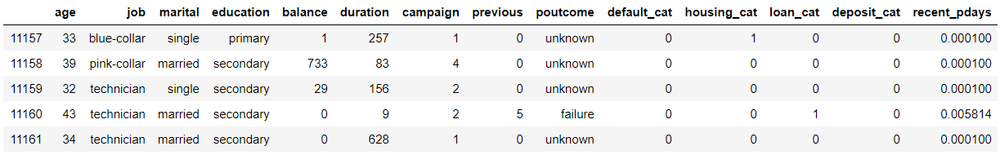

## dummy 데이터 생성

```python
bankWithDummies = pd.get_dummies(data=bankData, columns=['job', 'marital', 'education', 'poutcome'], prefix=['job', 'marital', 'education', 'poutcome'])
bankWithDummies.head()
```

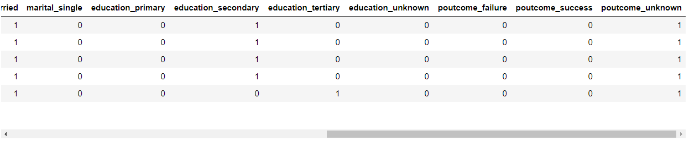

```python
bankWithDummies.shape
# > (11162, 27)

bankWithDummies.describe()
```

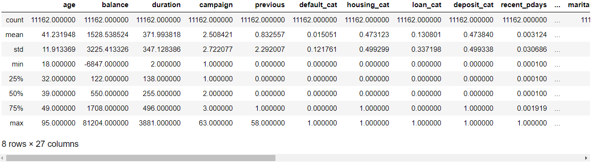

### plot

```python
bankWithDummies.plot(kind='scatter', x='age', y='balance')
```

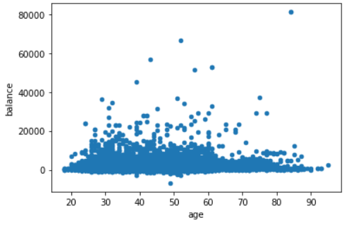

```python
bankWithDummies.plot(kind='hist', x='poutcome_success', y='duration')
```

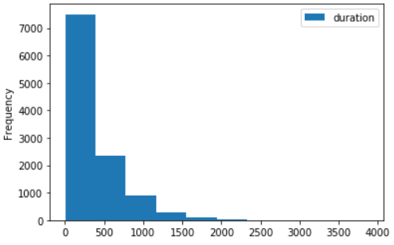

### 조건에 맞는 데이터 추출

```python
# 계약기간이 만료된 사람들
bankWithDummies[bankData.deposit_cat == 1].describe()
```

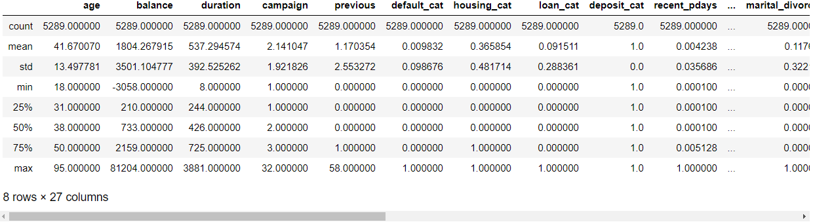

```python
bankWithDummies[(bankData.deposit_cat == 1) & (bankWithDummies.loan_cat == 1) & (bankWithDummies.housing_cat == 1)]
```

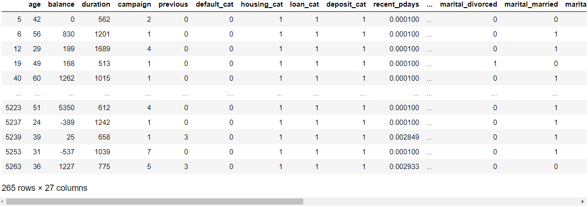

```python
len(bankWithDummies[(bankData.deposit_cat == 1) & (bankWithDummies.loan_cat == 1) & (bankWithDummies.housing_cat == 1)])
# > 265
```

> 265명은 저축, 개인대출, 주택대출 모두 있음

```python
# deposit_cat값이 1, default_cat값이 1인 사람의 인원수
len(bankWithDummies[(bankData.deposit_cat == 1) & (bankData.default_cat == 1)])
# > 52
```

> 52명은 정기예금 가입, 채무불이행

```python
# 직업별 정기저축가입비율 시각화
plt.figure(figsize=(10,6))
sns.barplot(x='job', y='deposit_cat', data=bankData)
```

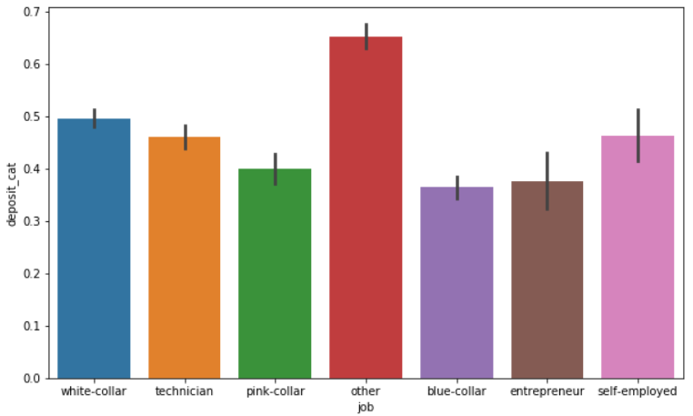

### corr

```python
bankwd = bankWithDummies

corr = bankwd.corr()
corr
```

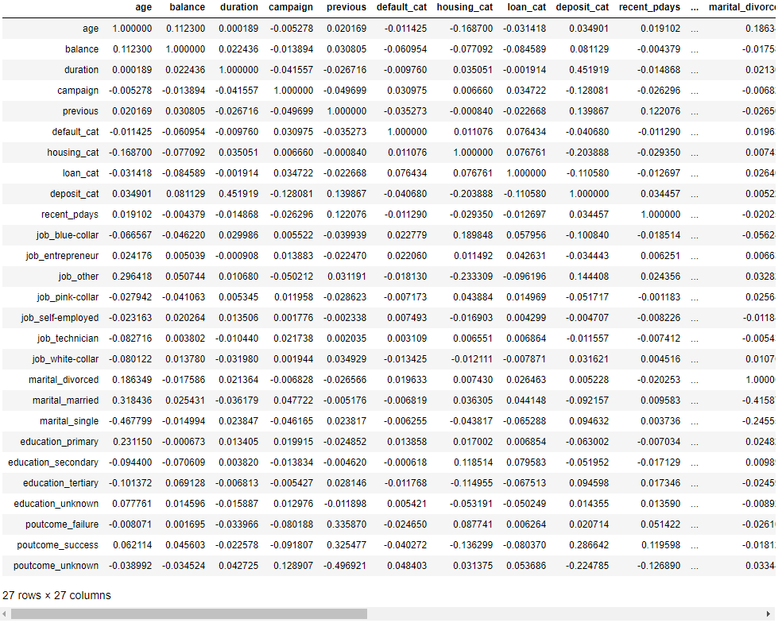

```python
plt.figure(figsize=(10, 10))
cmap = sns.diverging_palette(220, 10, as_cmap=True)
sns.heatmap(corr, cmap=cmap, linewidths=.5, square=True, center=0, vmax=.3, cbar_kws={'shrink':.80})
```

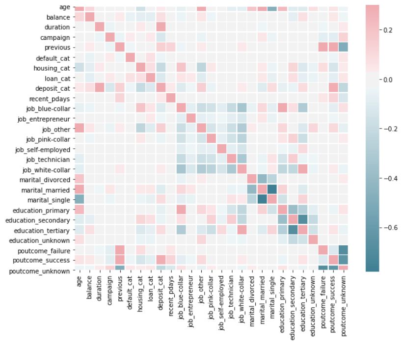

```python
corr['deposit_cat'].drop('deposit_cat')
# > age                    0.034901
# > balance                0.081129
# > duration               0.451919
# > campaign              -0.128081
# > previous               0.139867
# > default_cat           -0.040680
# > housing_cat           -0.203888
# > loan_cat              -0.110580
# > recent_pdays           0.034457
# > job_blue-collar       -0.100840
# > job_entrepreneur      -0.034443
# > job_other              0.144408
# > job_pink-collar       -0.051717
# > job_self-employed     -0.004707
# > job_technician        -0.011557
# > job_white-collar       0.031621
# > marital_divorced       0.005228
# > marital_married       -0.092157
# > marital_single         0.094632
# > education_primary     -0.063002
# > education_secondary   -0.051952
# > education_tertiary     0.094598
# > education_unknown      0.014355
# > poutcome_failure       0.020714
# > poutcome_success       0.286642
# > poutcome_unknown      -0.224785
# > Name: deposit_cat, dtype: float64
```

```python
corr_deposit = pd.DataFrame(corr['deposit_cat'].drop('deposit_cat'))

# corr_deposit에서 deposit_cat기준으로 내림차순 소트 출력
corr_deposit.sort_values(by='deposit_cat', ascending=False)
```

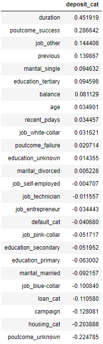

## decision tree 모델

```python
dropDeposit = bankwd.drop('deposit_cat', 1) # 입력변수
label = bankwd.deposit_cat # 출력변수
```

```python
# train_test_split(입력, 출력, 사이즈, 랜덤)
dataTrain, dataTest, labelTrain, labelTest = train_test_split(dropDeposit, label, train_size=0.2, random_state=42)
```

```python
dt2 = tree.DecisionTreeClassifier(max_depth=2)
dt2.fit(dataTrain, labelTrain)
dt2_sc_train = dt2.score(dataTrain, labelTrain)
dt2_sc_test = dt2.score(dataTest, labelTest)
```

```python
print("트레이닝 스코어 :", dt2_sc_train)
print("테스트 스코어 :", dt2_sc_test)
# > 트레이닝 스코어 : 0.7670250896057348
# > 테스트 스코어 : 0.7530795072788354
```

- depth = 3, 4, 5, 6, 10, 생략

```python
# depth = 3
dt3 = tree.DecisionTreeClassifier(max_depth=3)
dt3.fit(dataTrain, labelTrain)
dt3_sc_train = dt3.score(dataTrain, labelTrain)
dt3_sc_test = dt3.score(dataTest, labelTest)

print("트레이닝 스코어 :", dt3_sc_train)
print("테스트 스코어 :", dt3_sc_test)
# > 트레이닝 스코어 : 0.7732974910394266
# > 테스트 스코어 : 0.7559910414333707
```

```python
# depth = 4
dt4 = tree.DecisionTreeClassifier(max_depth=4)
dt4.fit(dataTrain, labelTrain)
dt4_sc_train = dt4.score(dataTrain, labelTrain)
dt4_sc_test = dt4.score(dataTest, labelTest)

print("트레이닝 스코어 :", dt4_sc_train)
print("테스트 스코어 :", dt4_sc_test)
# > 트레이닝 스코어 : 0.7885304659498208
# > 테스트 스코어 : 0.7698768197088466
```

```python
# depth = 5
dt5 = tree.DecisionTreeClassifier(max_depth=5)
dt5.fit(dataTrain, labelTrain)
dt5_sc_train = dt5.score(dataTrain, labelTrain)
dt5_sc_test = dt5.score(dataTest, labelTest)

print("트레이닝 스코어 :", dt5_sc_train)
print("테스트 스코어 :", dt5_sc_test)
# > 트레이닝 스코어 : 0.8104838709677419
# > 테스트 스코어 : 0.7797312430011198
```

```python
# depth = 6
dt6 = tree.DecisionTreeClassifier(max_depth=6)
dt6.fit(dataTrain, labelTrain)
dt6_sc_train = dt6.score(dataTrain, labelTrain)
dt6_sc_test = dt6.score(dataTest, labelTest)

print("트레이닝 스코어 :", dt6_sc_train)
print("테스트 스코어 :", dt6_sc_test)
# > 트레이닝 스코어 : 0.831989247311828
# > 테스트 스코어 : 0.7852183650615902
```

```python
# depth = 10
dt10 = tree.DecisionTreeClassifier(max_depth=10)
dt10.fit(dataTrain, labelTrain)
dt10_sc_train = dt10.score(dataTrain, labelTrain)
dt10_sc_test = dt10.score(dataTest, labelTest)

print("트레이닝 스코어 :", dt10_sc_train)
print("테스트 스코어 :", dt10_sc_test)
# > 트레이닝 스코어 : 0.9041218637992832
# > 테스트 스코어 : 0.7667413213885779
```

```python
# depth = 생략
dt = tree.DecisionTreeClassifier()
dt.fit(dataTrain, labelTrain)
dt_sc_train = dt.score(dataTrain, labelTrain)
dt_sc_test = dt.score(dataTest, labelTest)

print("트레이닝 스코어 :", dt_sc_train)
print("테스트 스코어 :", dt_sc_test)
# > 트레이닝 스코어 : 1.0
# > 테스트 스코어 : 0.72508398656215

dt.get_depth()
# > 21
```

# 연습문제

- 타이타닉 데이터셋
- 생존여부(출력변수)
- decision tree(최적 depth)
- train, test(정확도)

미완성

```python
train = pd.read_csv("../titanic/train.csv")
train.head()
```

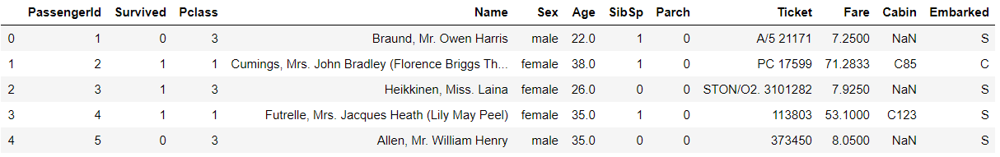

```python
train.info()
# > <class 'pandas.core.frame.DataFrame'>
# > RangeIndex: 891 entries, 0 to 890
# > Data columns (total 12 columns):
# > PassengerId    891 non-null int64
# > Survived       891 non-null int64
# > Pclass         891 non-null int64
# > Name           891 non-null object
# > Sex            891 non-null object
# > Age            714 non-null float64
# > SibSp          891 non-null int64
# > Parch          891 non-null int64
# > Ticket         891 non-null object
# > Fare           891 non-null float64
# > Cabin          204 non-null object
# > Embarked       889 non-null object
# > dtypes: float64(2), int64(5), object(5)
# > memory usage: 83.7+ KB
```

- PassengerId 제거

```python
train.drop('PassengerId', axis=1, inplace=True)
```

- Name 호칭만 추출하여 저장 후 변환

```python
import re
p = re.compile('([A-Z][a-z]+)[\.]')
p.findall(train.Name[1])
# > ['Mrs']
```

```python
import re
p = re.compile('([A-Z][a-z]+)[\.]')
train['name_exr'] = pd.DataFrame(map(p.findall, train.Name))
train.drop('Name', axis=1, inplace = True)
```

```python
train.head()
```

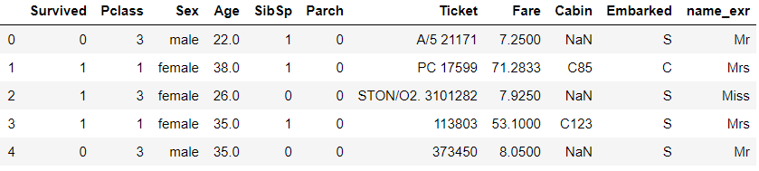

```python
train.groupby('name_exr').size()
# > name_exr
# > Capt          1
# > Col           2
# > Countess      1
# > Don           1
# > Dr            7
# > Jonkheer      1
# > Lady          1
# > Major         2
# > Master       40
# > Miss        182
# > Mlle          2
# > Mme           1
# > Mr          517
# > Mrs         125
# > Ms            1
# > Rev           6
# > Sir           1
# > dtype: int64
```

```python
train.name_exr = train.name_exr.replace(['Capt', 'Col', 'Countess', 'Don', 'Dr', 'Jonkheer', 'Lady', 'Major', 'Mlle', 'Mme', 'Ms', 'Rev', 'Sir'], 'other')
train.name_exr.value_counts()
# > Mr        517
# > Miss      182
# > Mrs       125
# > Master     40
# > other      27
# > Name: name_exr, dtype: int64
```

- Sex : male -> 0, female -> 1

```python
train['sex_cat'] = train['Sex'].map({'male':0, 'female':1})
train.drop('Sex', axis=1, inplace=True)
```

- Age 평균 대체

```python
dict(train.groupby('name_exr')['Age'].mean())
# > {'Master': 4.574166666666667,
# >  'Miss': 21.773972602739725,
# >  'Mr': 32.368090452261306,
# >  'Mrs': 35.898148148148145,
# >  'other': 42.38461538461539}
```

