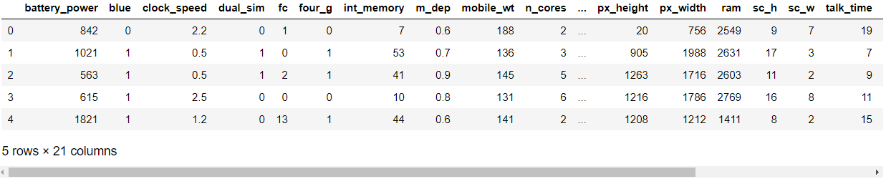
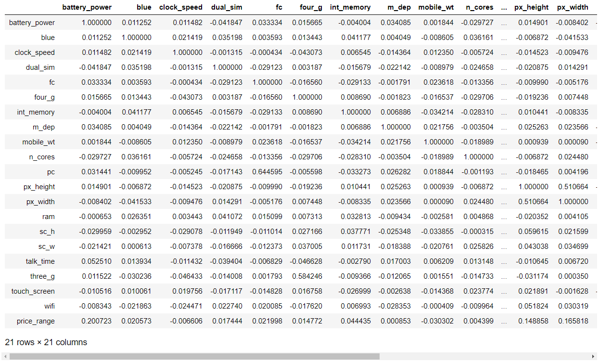
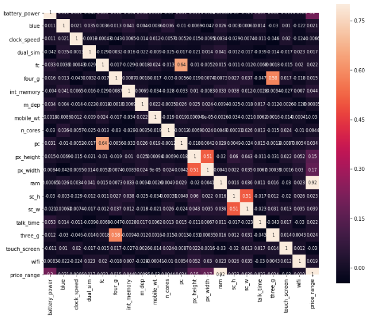
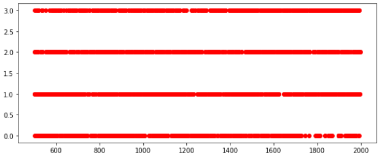
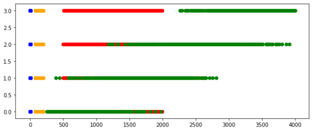
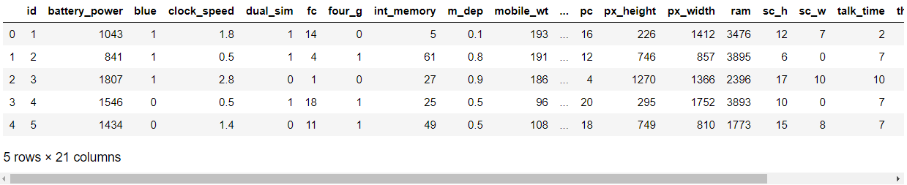
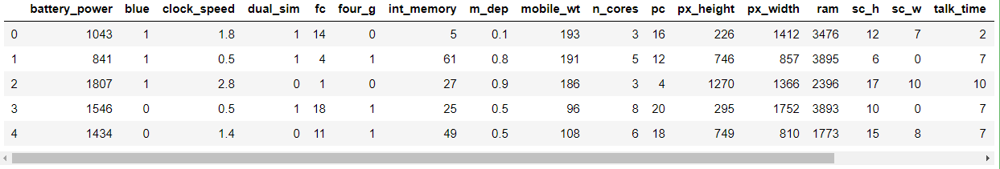
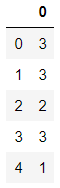

[toc]

# Day48 Scikitlearn을 활용한 머신러닝(2)

# SVM

- 선형 : Linear SVM, C
- 비선형 : RBF SVM, C, gamma

C, gamma : grid search를 이용하여 찾아야 함.

- 선형 SVM : 최적의 선형 결정 경계를 찾는 알고리즘
  - 가장 분류를 잘하는(마진이 가장 큰) 선(결정경계, 초평면)을 찾는 것
- 마진? 두 데이터 집합과 결정 경계 사이의 여백

- 서포트 벡터? 두 클래스 사이의 경계에 위치한 데이터 포인트들

선형 분리가 불가능한 경우

- 약간의 오류 허용(C)
- C? 얼마나 많은 데이터 샘플을 다른 클래스에 소속되는 것을 허용하는지를 경정하는 변수
  - 작을수록 => 많이 허용(일반적인 결정 경계)
  - 클수록 => 적게 허용(자세한 결정 경계)
- 커널기법? 주어진 data를 고차원 공간으로 mapping
  - RBF의 gamma? 하나의 data가 영향력을 행사하는 거리를 결정
    - gamma는 클수록, 작은 표준편차를 갖음

#  mobile-price-classification.csv

```python
import numpy as np
import pandas as pd
import seaborn as sns
import matplotlib.pyplot as plt
from matplotlib.colors import ListedColormap
```

```python
df = pd.read_csv("../data_for_analysis/mobile-price-classification/train.csv")
df.head()
```



```python
df.info()
# > <class 'pandas.core.frame.DataFrame'>
# > RangeIndex: 2000 entries, 0 to 1999
# > Data columns (total 21 columns):
# > battery_power    2000 non-null int64
# > blue             2000 non-null int64
# > clock_speed      2000 non-null float64
# > dual_sim         2000 non-null int64
# > fc               2000 non-null int64
# > four_g           2000 non-null int64
# > int_memory       2000 non-null int64
# > m_dep            2000 non-null float64
# > mobile_wt        2000 non-null int64
# > n_cores          2000 non-null int64
# > pc               2000 non-null int64
# > px_height        2000 non-null int64
# > px_width         2000 non-null int64
# > ram              2000 non-null int64
# > sc_h             2000 non-null int64
# > sc_w             2000 non-null int64
# > talk_time        2000 non-null int64
# > three_g          2000 non-null int64
# > touch_screen     2000 non-null int64
# > wifi             2000 non-null int64
# > price_range      2000 non-null int64
# > dtypes: float64(2), int64(19)
# > memory usage: 328.2 KB
```

```python
df.isnull().sum()
# > battery_power    0
# > blue             0
# > clock_speed      0
# > dual_sim         0
# > fc               0
# > four_g           0
# > int_memory       0
# > m_dep            0
# > mobile_wt        0
# > n_cores          0
# > pc               0
# > px_height        0
# > px_width         0
# > ram              0
# > sc_h             0
# > sc_w             0
# > talk_time        0
# > three_g          0
# > touch_screen     0
# > wifi             0
# > price_range      0
# > dtype: int64

df.isnull().sum().max()
# > 0
```

```python
df['price_range'].describe()
# > count    2000.000000
# > mean        1.500000
# > std         1.118314
# > min         0.000000
# > 25%         0.750000
# > 50%         1.500000
# > 75%         2.250000
# > max         3.000000
# > Name: price_range, dtype: float64

df.price_range.unique()
# > array([1, 2, 3, 0], dtype=int64)
```

## corr

```python
corrmat = df.corr()
corrmat
```



```python
plt.subplots(figsize=(12,10))
sns.heatmap(corrmat, vmax=0.8, square=True, annot=True, annot_kws={'size':8})
```



## scatter

```python
plt.subplots(figsize=(10,4))
plt.scatter(y=df['price_range'], x=df['battery_power'], color='red')
```



```python
plt.subplots(figsize=(10,4))
plt.scatter(y=df['price_range'], x=df['battery_power'], color='red')
plt.scatter(y=df['price_range'], x=df['ram'], color='green')
plt.scatter(y=df['price_range'], x=df['n_cores'], color='blue')
plt.scatter(y=df['price_range'], x=df['mobile_wt'], color='orange')
```



## SVM

```python
from sklearn.svm import SVC
from sklearn.model_selection import train_test_split
from sklearn.preprocessing import MinMaxScaler
```

```python
yt = np.array(df['price_range'])
xt = df.drop(['price_range'], axis=1)
xt = np.array(xt)
```

```python
scaler = MinMaxScaler()
xt = scaler.fit_transform(xt)

xt.shape
# > (2000, 20)
```

```python
xTrain, xTest, yTrain, yTest = train_test_split(xt, yt, test_size=0.2, random_state=42)

xTrain.shape
# > (1600, 20)
```

### Linear SVM을 위한 적절한 C값 검색

```python
for thisC in [1,3,5,10,40,60,80,100] :
    svc = SVC(kernel='linear', C=thisC)
    model = svc.fit(xTrain, yTrain)
    scoreTrain = model.score(xTrain, yTrain)
    scoreTest = model.score(xTest, yTest)
    print("선형 SVM : C:{}, training score:{:2f}, test score:{:2f}".format(thisC, scoreTrain, scoreTest))
# > 선형 SVM : C:1, training score:0.953750, test score:0.960000
# > 선형 SVM : C:3, training score:0.961875, test score:0.977500
# > 선형 SVM : C:5, training score:0.968125, test score:0.975000
# > 선형 SVM : C:10, training score:0.977500, test score:0.967500
# > 선형 SVM : C:40, training score:0.981250, test score:0.962500
# > 선형 SVM : C:60, training score:0.981250, test score:0.962500
# > 선형 SVM : C:80, training score:0.981875, test score:0.970000
# > 선형 SVM : C:100, training score:0.980625, test score:0.967500
```

```python
from sklearn.model_selection import cross_val_score, StratifiedKFold

model = SVC(kernel='linear', C=20).fit(xTrain, yTrain)
scores = cross_val_score(model, xTrain, yTrain, cv=5)
print("CV 점수 : ", scores)

st_scores = cross_val_score(model, xTrain, yTrain, cv=StratifiedKFold(5, random_state=10, shuffle=True))
print("stratifiedKFold CV 점수 : ", st_scores)

print("CV 평균점수 : ", scores.mean())
print("stratifiedKFlod CV 평균점수 : ", st_scores.mean())
# > CV 점수 :  [0.95015576 0.96261682 0.94392523 0.92789969 0.97169811]
# > stratifiedKFold CV 점수 :  [0.97819315 0.92834891 0.93457944 0.97805643 0.96226415]
# > CV 평균점수 :  0.9512591238085129
# > stratifiedKFlod CV 평균점수 :  0.9562884145205576
```

- linearSVC 함수 사용하여 동일한 작업 수행

```python
from sklearn.svm import LinearSVC
```

```python
for thisC in [1,3,5,10,40,60,80,100] :
    svc = LinearSVC(C=thisC)
    model2 = svc.fit(xTrain, yTrain)
    scoreTrain = model2.score(xTrain, yTrain)
    scoreTest = model2.score(xTest, yTest)
    
    print("선형 SVM : C:{}, training score:{:2f}, test score:{:2f}".format(thisC, scoreTrain, scoreTest))
# > 선형 SVM : C:1, training score:0.846250, test score:0.840000
# > 선형 SVM : C:3, training score:0.864375, test score:0.855000
# > 선형 SVM : C:5, training score:0.866875, test score:0.870000
# > 선형 SVM : C:10, training score:0.873750, test score:0.875000
# > 선형 SVM : C:40, training score:0.792500, test score:0.812500
# > 선형 SVM : C:60, training score:0.841250, test score:0.855000
# > 선형 SVM : C:80, training score:0.741250, test score:0.775000
# > 선형 SVM : C:100, training score:0.798750, test score:0.822500
```

> LinearSVC가 SVC보다 빠르다, model의 정확도는 직접 비교하여 사용할 것

### RBF kernel SVM

- C와 gamma parameter 사용

```python
for thisGamma in [.1, .25, .5, 1] :
    for thisC in [1,5,10,20,40,100] :
        model3 = SVC(kernel="rbf", gamma=thisGamma, C=thisC).fit(xTrain, yTrain)
        m3Train = model3.score(xTrain, yTrain)
        m3Test = model3.score(xTest, yTest)
        print("RBF SVM : C:{}, gamma:{}, training score:{:2f}, test score:{:2f}".format(thisC, thisGamma, m3Train, m3Test))
# > RBF SVM : C:1, gamma:0.1, training score:0.928750, test score:0.902500
# > RBF SVM : C:5, gamma:0.1, training score:0.965000, test score:0.907500
# > RBF SVM : C:10, gamma:0.1, training score:0.979375, test score:0.907500
# > RBF SVM : C:20, gamma:0.1, training score:0.990000, test score:0.912500
# > RBF SVM : C:40, gamma:0.1, training score:0.995000, test score:0.902500
# > RBF SVM : C:100, gamma:0.1, training score:1.000000, test score:0.907500
# > RBF SVM : C:1, gamma:0.25, training score:0.959375, test score:0.887500
# > RBF SVM : C:5, gamma:0.25, training score:0.990000, test score:0.872500
# > RBF SVM : C:10, gamma:0.25, training score:0.998125, test score:0.895000
# > RBF SVM : C:20, gamma:0.25, training score:1.000000, test score:0.902500
# > RBF SVM : C:40, gamma:0.25, training score:1.000000, test score:0.897500
# > RBF SVM : C:100, gamma:0.25, training score:1.000000, test score:0.897500
# > RBF SVM : C:1, gamma:0.5, training score:0.980625, test score:0.835000
# > RBF SVM : C:5, gamma:0.5, training score:1.000000, test score:0.850000
# > RBF SVM : C:10, gamma:0.5, training score:1.000000, test score:0.847500
# > RBF SVM : C:20, gamma:0.5, training score:1.000000, test score:0.847500
# > RBF SVM : C:40, gamma:0.5, training score:1.000000, test score:0.847500
# > RBF SVM : C:100, gamma:0.5, training score:1.000000, test score:0.847500
# > RBF SVM : C:1, gamma:1, training score:0.993125, test score:0.712500
# > RBF SVM : C:5, gamma:1, training score:1.000000, test score:0.742500
# > RBF SVM : C:10, gamma:1, training score:1.000000, test score:0.742500
# > RBF SVM : C:20, gamma:1, training score:1.000000, test score:0.742500
# > RBF SVM : C:40, gamma:1, training score:1.000000, test score:0.742500
# > RBF SVM : C:100, gamma:1, training score:1.000000, test score:0.742500
```

### Grid Search

```python
from sklearn.model_selection import GridSearchCV
param = {'C':[1,5,10,20,40,100], 'gamma':[.1, .25, .5, 1]}
GS = GridSearchCV(SVC(kernel='rbf'), param, cv=5)
GS.fit(xTrain, yTrain)
print(GS.best_params_)
print(GS.best_score_)
# > {'C': 5, 'gamma': 0.1}
# > 0.90375
```

```python
test = pd.read_csv("../data_for_analysis/mobile-price-classification/test.csv")
test.head()
```



```python
test = test.drop(['id'], axis=1)
test.head()
```



```python
# scaler 옛버전은 array만 가능
test = scaler.fit_transform(test)
model = SVC(kernel='rbf', C=5, gamma=.1).fit(xTrain, yTrain)

model
# > SVC(C=5, cache_size=200, class_weight=None, coef0=0.0,
# >     decision_function_shape='ovr', degree=3, gamma=0.1, kernel='rbf',
# >     max_iter=-1, probability=False, random_state=None, shrinking=True,
# >     tol=0.001, verbose=False)
```

```python
prediction = model.predict(test)
pred = pd.DataFrame(prediction)
pred.head()
```



# 연습문제

- titanic data로 SVM 실시

decision tree에서 사용한 전처리 그대로 사용

```python
import pandas as pd
import numpy as np

train = pd.read_csv("../data_for_analysis/titanic/train.csv")

train.drop('PassengerId', axis=1, inplace=True)

import re
p = re.compile('([A-Z][a-z]+)[\.]')
train['name_exr'] = pd.DataFrame(map(p.findall, train.Name))
train.drop('Name', axis=1, inplace = True)

train.name_exr = train.name_exr.replace(np.setdiff1d(train.name_exr.unique(),['Mr', 'Mrs', 'Miss', 'Master']), 'other')

train['sex_cat'] = train['Sex'].map({'male':0, 'female':1})
train.drop('Sex', axis=1, inplace=True)

ageMean = dict(train.groupby('name_exr')['Age'].mean())
train.Age = train.Age.fillna(train.name_exr.map(ageMean))

train = train.drop(['Ticket', 'Cabin'], axis=1)

train.Embarked[train.Embarked.isnull()] = "S"

trainDummies = pd.get_dummies(data=train, columns=['Embarked', 'name_exr'], prefix=['Embarked', 'name'])
```

```python
test = pd.read_csv("../data_for_analysis/titanic/test.csv")

test.drop('PassengerId', axis=1, inplace=True)

test['name_exr'] = pd.DataFrame(map(p.findall, test.Name))
test.drop('Name', axis=1, inplace = True)

test.name_exr = test.name_exr.replace(np.setdiff1d(test.name_exr.unique(),['Mr', 'Mrs', 'Miss', 'Master']), 'other')

test['sex_cat'] = test['Sex'].map({'male':0, 'female':1})
test.drop('Sex', axis=1, inplace=True)

test.Age = test.Age.fillna(test.name_exr.map(ageMean))

test = test.drop(['Ticket', 'Cabin'], axis=1)

test.Fare[test.Fare.isnull()] = 7.5

test.Embarked[test.Embarked.isnull()] = "S"

testDummies = pd.get_dummies(data=test, columns=['Embarked', 'name_exr'], prefix=['Embarked', 'name'])
```

```python
dropSurvived = trainDummies.drop('Survived', 1)
label = trainDummies.Survived
```

```python
from sklearn.model_selection import GridSearchCV
from sklearn.svm import SVC

l_param = {'C':[2**-5, 2**-4, 2**-3, 2**-2, 2**-1, 2**0, 2**1, 2**2, 2**3, 2**4, 2**5]}
LGS = GridSearchCV(SVC(kernel="linear"), l_param, cv=5)
LGS.fit(dropSurvived, label)
print(LGS.best_params_)
print(LGS.best_score_)
# > {'C': 0.25}
# > 0.8249158249158249
```

```python
rbf_param = {'C':[2**-5, 2**-4, 2**-3, 2**-2, 2**-1, 2**0, 2**1, 2**2, 2**3, 2**4, 2**5], 'gamma':[2**-5, 2**-4, 2**-3, 2**-2, 2**-1, 2**0, 2**1, 2**2, 2**3, 2**4, 2**5]}
rbfGS = GridSearchCV(SVC(kernel="rbf"), rbf_param, cv=5)
rbfGS.fit(dropSurvived, label)
print(rbfGS.best_params_)
print(rbfGS.best_score_)
# > {'C': 16, 'gamma': 0.03125}
# > 0.7564534231200898
```

```python
model = SVC(kernel='linear', C=0.25).fit(dropSurvived, label)
prediction = model.predict(testDummies)
pred = pd.DataFrame(prediction)
pred.to_csv("submission_svm_200317.csv")
```

- Score : 78468