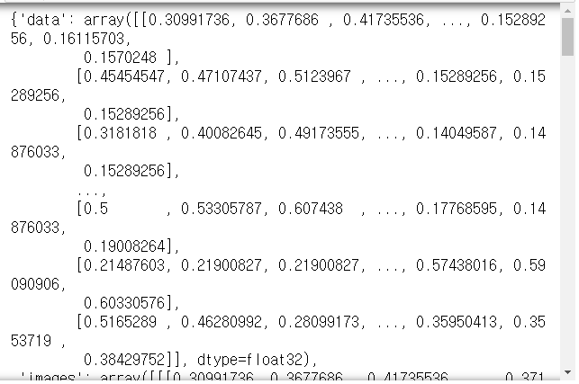
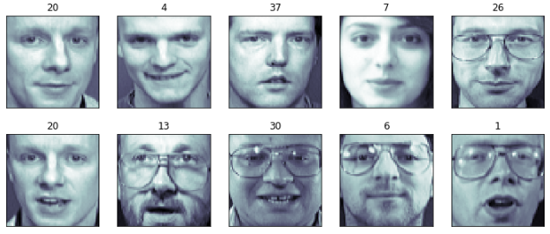
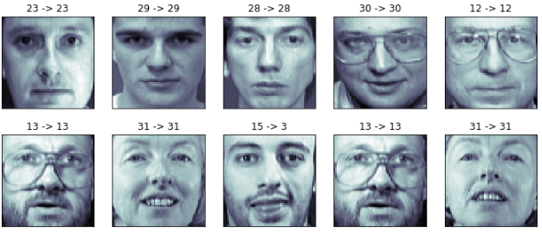

[toc]

# Day49 Scikitlearn을 활용한 머신러닝(3)

# olivetti_faces data를 이용한 SVM

```python
from sklearn.datasets import fetch_olivetti_faces
faces = fetch_olivetti_faces()
# > downloading Olivetti faces from https://ndownloader.figshare.com/files/5976027 to C:\Users\student\scikit_learn_data
```

```python
import pandas as pd
import numpy as np
import matplotlib.pyplot as plt
import seaborn as sns
```

```python
faces
```



```python
faces.keys()
# > dict_keys(['data', 'images', 'target', 'DESCR'])

faces.data.shape
# > (400, 4096)

len(faces.data)
# > 400
```

```python
klist = np.random.choice(range(len(faces.data)), 10)
klist
# > array([205,  47, 377,  71, 266, 209, 136, 303,  64,  18])

# 2행 5열로 나누어 얼굴 이미지(klist) 출력
fig = plt.figure(figsize=(12,5))
for i in range(2) :
    for j in range(5) :
        k = klist[i*5+j]
        ax = fig.add_subplot(2, 5, i*5+j+1)
        ax.imshow(faces.images[k], cmap=plt.cm.bone)
        plt.title(faces.target[k]) # 사진위에 target 번호 출력
        ax.yaxis.set_ticks([]) # y축 ticks 삭제
        ax.xaxis.set_ticks([]) # x축 ticks 삭제
plt.show()
```




## Linaer SVM

```python
from sklearn.model_selection import train_test_split
xTrain, xTest, yTrain, yTest = train_test_split(faces.data, faces.target, test_size=0.4, random_state=0)

from sklearn.svm import SVC
model = SVC(kernel='linear').fit(xTrain, yTrain)
```

```python
klist = np.random.choice(range(len(yTest)), 10)
fig = plt.figure(figsize=(12,5))
for i in range(2) :
    for j in range(5) :
        k = klist[i*5+j]
        ax = fig.add_subplot(2, 5, i*5+j+1)
        ax.imshow(xTest[k:(k+1), :].reshape(64,64), cmap=plt.cm.bone)
        plt.title("%d -> %d" % (yTest[k], model.predict(xTest[k:(k+1), :]))) # 사진위에 target 번호 출력
        ax.yaxis.set_ticks([]) # y축 ticks 삭제
        ax.xaxis.set_ticks([]) # x축 ticks 삭제
plt.show()
```




## 평가

```python
from sklearn.metrics import classification_report, accuracy_score

# scikit-learn.org
yPredTrain = model.predict(xTrain)
yPredTest = model.predict(xTest)
```

```python
(yPredTrain == yTrain).mean()
# > 1.0

print(classification_report(yTrain, yPredTrain))
# >               precision    recall  f1-score   support
# > 
# >            0       1.00      1.00      1.00         4
# >            1       1.00      1.00      1.00         5
# >            2       1.00      1.00      1.00         6
# >            3       1.00      1.00      1.00         8
# >            4       1.00      1.00      1.00         8
# >            5       1.00      1.00      1.00         5
# >            6       1.00      1.00      1.00         4
# >            7       1.00      1.00      1.00         7
# >            8       1.00      1.00      1.00         8
# > ...
# >           37       1.00      1.00      1.00         6
# >           38       1.00      1.00      1.00         9
# >           39       1.00      1.00      1.00         6
# > 
# >     accuracy                           1.00       240
# >    macro avg       1.00      1.00      1.00       240
# > weighted avg       1.00      1.00      1.00       240
```

```python
print(classification_report(yTest, yPredTest))
len(yTest)
# >               precision    recall  f1-score   support
# > 
# >            0       0.86      1.00      0.92         6
# >            1       1.00      1.00      1.00         5
# >            2       1.00      1.00      1.00         4
# >            3       0.50      1.00      0.67         2
# >            4       1.00      0.50      0.67         2
# > ...
# >           37       1.00      1.00      1.00         4
# >           38       0.50      1.00      0.67         1
# >           39       0.67      0.50      0.57         4
# > 
# >     accuracy                           0.93       160
# >    macro avg       0.93      0.93      0.91       160
# > weighted avg       0.95      0.93      0.92       160
# > 160
```

### confusion matrix

- confusion matrix(분류 평가표) : 실제와 예측이 일치하는 개수
- 행-정답, 열-예측

```python
from sklearn.metrics import confusion_matrix

xtrue = [2,0,2,2,0,1] # 정답
xpred = [0,0,2,2,0,2] # 예측값
confusion_matrix(xtrue, xpred)
# > array([[2, 0, 0],
# >        [0, 0, 1],
# >        [1, 0, 2]], dtype=int64)
```

### 이진분류(양성, 음성)

|           | 예측 양성      | 예측 음성      |
| --------- | -------------- | -------------- |
| 실제 양성 | True Positive  | False Negative |
| 실제 음성 | False Positive | True Negative  |

ex) 제고공장 - 품질 테스트 - 품질테스트 결과
- 테스트 결과 양성 : 불량품이라고 예측

ex) 암검진
- 테스트 결과 양성 : 암이라고 예측

ex) FDS(Fraud Detection System)
- 사기거래를 찾아내는 시스템
- 테스트 결과 양성 : 사기거래라고 예측
- 테스트 결과 음성 : 사기거래가 아님으로 예측


- TP : 사기를 사기로 예측
- TN : 정상을 정상으로예측
- FP : 정상을 사기로 예측
- FN : 사기를 정상으로 예측

```python
# 양성:1, 음성:0
xtrue = [1,0,1,1,0,1]
xpred = [0,0,1,1,0,1]
confusion_matrix(xtrue, xpred)
# > array([[2, 0],
# >        [1, 3]], dtype=int64)

confusion_matrix(xtrue, xpred, labels=[1,0])
# > array([[3, 1],
# >        [0, 2]], dtype=int64)
```

### 평가점수

- confusion-matrix로 부터 평가점수를 계산
- 정확도, <U>정밀도, F점수, 재현율</U>(주로 사용), 위양성율


1. 정확도(accuracy)
    - 전체 샘플 중에서 맞게 예측한 샘플의 비율
    - accuracy = (TP + TN) / (TP + TN + FP + FN)
2. 정밀도(precision)
    - 양성 class에 속한다고 출력한 샘플 중에서 실제로 양성 class에 속하는 샘플 수의 비율
    - 예측 및 실제 양성 / 양성으로 예측한 샘플 수 = TP / (TP + FP)
    - ex) FDS의 정밀도는 사기거래라고 예측한 전체 샘플 중에서, 실제로도 사기거래인 샘플의 비율
3. 재현율(recall)
    - 실제 양성 중에서, 양성에 속한다고 예측한 비율
    - TP / (TP + FN)
    - ex) FDS의 재현율은 실제 사기거래 중에서, 사기거래라고 예측한 거래의 비율 
4. 위양성율(fallout)
	- 실제 음성 중에서, 양성에 속한다고 예측한 비율
    - => 낮을수록 좋은 모델
    - FP / (FP + TN)
    - ex) FDS의 위양성율은 실제 정상거래 중에서, 사기거래라고 예측한 거래의 비율
    - 특이도 : 1 - fallout
5. F점수(F_beta 점수, beta(가중치)=1 => F_1 점수 )
    - F_beta = (1 + beta^2)(precision \* recall) / (beta^2 \* precision + recall)
    - => F_1 = 2 \* precision \* recall / (precision + recall)
        - => 조화평균(precision과 recall)

```python
xtrue = [0,0,0,1,1,0,0]
xpred = [0,0,0,0,1,1,1]
print(classification_report(xtrue, xpred))
# >               precision    recall  f1-score   support
# > 
# >            0       0.75      0.60      0.67         5
# >            1       0.33      0.50      0.40         2
# > 
# >     accuracy                           0.57         7
# >    macro avg       0.54      0.55      0.53         7
# > weighted avg       0.63      0.57      0.59         7
```

> accuracy와 macro avg를 보면 된다.
>
> precision
> - 0.75 => 0으로 예측한 data에 대해서 75%가 실제로 0이었음
> - 0.33 => 1로 예측한 data에 대해서 33%가 실제로 1이었음
>
> recall
> - 0.60 => 실제 0인 데이터 중의 60%만 0으로 판별됨
> - 0.50 => 실제 1인 데이터 중의 50%만 1로 판별됨

# 신경망

## 활성함수의 필요성?
1. 출력값의 범위 결정
2. 히든레이어를 의미 있게 쌓아주는 역할

## weight update algorithm
- 경사하강법(Gradient Descent)
    - `w_i := w_i + LR * E * x_i`
        - LR : Learnning Rate(가중치를 변화시키는 정도, 랜덤 or 직접설정)
        - E : Target - outcome


- ex.

| x_1  | x_2  | y    |
| ---- | ---- | ---- |
| 0    | 0    | 0    |
| 0    | 1    | 1    |
| 1    | 0    | 1    |
| 1    | 1    | 1    |

`hat{y} = w_1*x_1 + w_2*x_2 + w_0`

=> w_1=0.1, w_2=0.2, w_0=-0.4, LR=0.2

1. 0.1\*0 + 0.2\*0 - 0.4 = -0.4 < 0 => hat{y} = 0
    - Error = target - outcome = 0 - 0 => update 없음
2. 0.1\*0 + 0.2\*1 - 0.4 = -0.2 < 0 => hat{y} = 0
    - Error = 1 - 0 = 1 => update 필요
        - w_1 <= w_1 + LR \* E \* x_1
            - = 0.1 + 0.2 \* 1 \* 0 = 0.1
        - w_2 = 0.2 + 0.2 \* 1 \* 1 = 0.4
        - w_0 = -0.4 + 0.2 \* 1 \* 1 = -0.2
    - => 0.1\*0 + 0.4\*1 - 0.2 = 0.2 > 0 => hat{y} = 1
        - Error = 1 - 1 = 0 => update 없음
3. 0.1\*1 + 0.4\*0 - 0.2 = -0.1 < 0 => hat{y} = 0
    - Error = 1 - 0 = 1 => update 필요
        - w_1 = 0.1 + 0.2 \* 1 \* 1 = 0.3
        - w_2 = 0.4 + 0.2 \* 1 \* 0 = 0.4
        - w_0 = -0.2 + 0.2 \* 1 \* 1 = 0
    - => 0.3\*1 + 0.4\*0 + 0 = 0.3 > 0 => hat{y} = 1
        - Error = 1 - 1 = 0 => update 없음
4. 0.3\*1 + 0.4\*1 + 0 = 0.7 > 0 => hat{y} = 1
    - Error = 1 - 1 = 0 => update 없음

=> 1epoch(에폭)

- 데이터 처음부터 다시 적용하면서 Error 확인 update 진행
- 2epoch에서 모두 Error가 0이므로 update 없음


- ex2.
    - 킬로미터 -> 연산 -> 마일
        - 킬로미터와 마일의 관계가 선형이다.
    - => 마일(y) = 킬로미터(x) * c (c는 상수)

| x(킬로미터) | y(마일) |
| ----------- | ------- |
| 0           | 0       |
| 100         | 62.137  |

- c = 0.5라고 하면
    - 100 -> 마일 = 킬로미터 \* 0.5 -> 50마일
    - 오차 = 실제값 - 예측값 = 62.137 - 50 = 12.137
- c = 0.6
    - 100 -> 60마일
    - 오차 = 62.137 - 60 = 2.137
- c = 0.7
    - 100 -> 70마일
    - 오차 = 62.137 - 70 = -7.863 (오버슈팅,overshooting)
- c = 0.6 => 0.61
     - 100 -> 61마일
     - 오차 = 62.137 - 61 = 1.137
- 이를 반복하여 적절한 c값을 찾음

## 참고 사이트

- 신경망이 어떻게 움직이는지 볼 수 있는 사이트

https://playground.tensorflow.org/ 

# 연습문제

- sigmoid, ReLu, step function 구현
- def mysig()
- def myReLu()
- def mystep()
- ex. mysig(-5) => 0.007

```python
def mysig(x) :
    from math import exp
    return 1/(1+exp(-x))

mysig(-5)
# > 0.0066928509242848554
```

```python
def myReLu(x) :
    if x < 0 :
        return 0
    else :
        return x
    
myReLu(-1)
# > 0
```

```python
def mystep(x) :
    if x < 0 :
        return 0
    elif x > 0 :
        return 1
    else :
        return 0.5

mystep(1)
# > 1
```

