[toc]

# Day50 Scikitlearn을 활용한 머신러닝(4)

## 미분 기초

- 운전 : 속도 변화(수학적으로 표현)
- -> 수학적 표현? 한 사물의 변화가 다른 사물에 어떤 변화를 주는가
  - ex) 시간 변화 -> 속도 변화
    - 강우량 변화 -> 식물의 키 변화
    - 당기는 힘의 변화 -> 용수철 길이 변화
  - => 미분

### 직선

| 분   | 속도   |
| ---- | ------ |
| 0    | 30km/h |
| 0.5  | 30     |
| ...  | ...    |
| 3    | 30     |

- 시간에 상관없이 속도가 유지된다.
  - $속도 (s) = 30$
  - => 속도가 그대로다, 변화율이 0이다.
  - => 속도는 시간에 대해 의존 관계가 X, 의존도 0
- 미분? 시간의 변화에 따라 속도가 어떻게 변화
  - 위의 직선은 $\cfrac{\delta s}{\delta t} = 0$ (s가 t에 어떻게 의존하는가 에 대한 정도)
  - 변화율 = 미분계수


### 경사가 있는 직선

| 분   | 속도 |
| ---- | ---- |
| 0    | 30   |
| 0.5  | 35   |
| 1    | 40   |
| ...  | ...  |
| 3    | 60   |

- 일정한 비율로 증가
  - $s = 30 + 10t \Leftarrow y = wx + b$
    - $10$ : 기울기
    - $\cfrac{\delta s}{\delta t} = 10$ : 속도와 시간 의존관계

### 곡선

| 분   | 속도 |
| ---- | ---- |
| 0    | 0    |
| 1    | 1    |
| 2    | 4    |
| 3    | 9    |
| ...  | ...  |
| 8    | 64   |

- $s = t^2$
- 변화율? 시간의 변화에 따라 속도는 어떻게 변할까?
- 기울기 = 변화율


- 높이(속도) = $\Delta s$
- 길이(시간) = $\Delta t$
  - $\Delta$ : 작은 변화
  - $\Delta x$ : $x$에서의 작은 변화
- 기울기 = $\cfrac{\Delta s}{\Delta t}$ 


- $변화율 = \cfrac{\delta s}{\delta t} = \cfrac{높이}{길이} = \cfrac{(t+ \Delta x)^2 - (t - \Delta x)^2}{2 \Delta x}$
- $s = t^2$
  - $t^2 + {\Delta x}^2 + 2t \Delta x - (t^2 + {\Delta x}^2 - 2t \Delta x)$
  - => $\cfrac{4t\Delta x}{2\Delta x} = 2t$
- $s = t^2 + 2t$
  - => $2t+2$
- 미분계수 패턴
  - $s = t^2 \Rightarrow 2t$
  - $s = t^2 + 2t \Rightarrow 2t+2$
  - $s = t^3 \Rightarrow 3t^2$
  - $s = 6t^6 + 9t + 4 \Rightarrow 36t^5 + 9$
  - $\therefore y = ax^n \Rightarrow anx^{n-1}$

### 함수의 함수

$f = y^2, y = x^3 +x$일 경우

- 패턴
  - $\cfrac{\delta f}{\delta x} = \cfrac{\delta f}{\delta y} \cfrac{\delta y}{\delta x}$
  - $\Rightarrow (2y)\cdot(3x^2 +1)$
  - $\Rightarrow (2(x^3 + x))\cdot(3x^2 + 1)$
  - $\Rightarrow (2x^3 + 2x)\cdot(3x^2 + 1)$

### 편미분

- 내가 미분하고자 하는 관심있는 값을 제외하고는 상수로 취급하는 미분
- $f(x) = 2x, \cfrac{df}{dx} = 2$
- $f(x,y) = xy$
  - $\cfrac{\delta f}{\delta x} = y$ (y를 상수로 취급)
  - $\cfrac{\delta f}{\delta y} = x$
- $f(x, y) = x + y$
  - $\cfrac{\delta f}{\delta x} = 1$


# 퍼셉트론

$y = 
\begin{cases} 
0 & \text{if} & w_1 x_1 + w_2 x_2 \leq \theta \\ 
1 & \text{if} & w_1 x_1 + w_2 x_2 > \theta
\end{cases}$

- 위의 식에서 $w_1, w_2, \theta$의 값을 찾는 과정

```python
import numpy as np
```

```python
def AND(x1, x2) :
    result = x1 + x2 - 1.5
    if result > 0 : return 1
    else : return 0
    
for data in [(0,0), (0,1), (1,0), (1,1)]:
    print(AND(data[0], data[1])) # 0 0 0 1
# > 0
# > 0
# > 0
# > 1
```

```python
def AND(x1, x2) :
    w1 = 0.5
    w2 = 0.5
    b = -0.6
    hf = w1*x1 + w2*x2 + b
    if hf <= 0 :
        return 0
    else : 
        return 1

for data in [(0,0), (0,1), (1,0), (1,1)]:
    print(AND(data[0], data[1])) # 0 0 0 1
# > 0
# > 0
# > 0
# > 1
```

```python
# numpy를 이용하여 수식 변경
def AND(x1, x2) : 
    b = -0.6
    x = np.array([x1, x2])
    w = np.array([0.5, 0.5])
    hf = np.sum(w*x) + b
    if hf <= 0 :
        return 0
    else : 
        return 1

for data in [(0,0), (0,1), (1,0), (1,1)]:
    print(AND(data[0], data[1])) # 0 0 0 1
# > 0
# > 0
# > 0
# > 1
```

```python
def NAND(x1, x2) : 
    b = 0.6
    x = np.array([x1, x2])
    w = np.array([-0.5, -0.5])
    hf = np.sum(w*x) + b
    if hf <= 0 :
        return 0
    else : 
        return 1

for data in [(0,0), (0,1), (1,0), (1,1)]:
    print(NAND(data[0], data[1])) # 1 1 1 0
# > 1
# > 1
# > 1
# > 0
```

```python
def OR(x1, x2) : 
    b = -0.1
    x = np.array([x1, x2])
    w = np.array([0.5, 0.5])
    hf = np.sum(w*x) + b
    if hf <= 0 :
        return 0
    else : 
        return 1

for data in [(0,0), (0,1), (1,0), (1,1)]:
    print(OR(data[0], data[1])) # 0 1 1 1
# > 0
# > 1
# > 1
# > 1
```

```python
# AND, NAND, OR 함수를 적절하게 호출하여 리턴된 값을 통해 XOR 결과를 출력하는 함수를 구하시오.
def XOR(x1, x2) : 
    result = AND(NAND(x1, x2), OR(x1, x2))
    return result

for data in [(0,0), (0,1), (1,0), (1,1)]:
    print(XOR(data[0], data[1])) # 0 1 1 0
# > 0
# > 1
# > 1
# > 0
```

## 활성함수

### 계단함수

```python
import matplotlib.pyplot as plt

def myStep(x) :
    return np.array(x>0, dtype=np.int)

x = np.arange(-3, 3, 0.1)
y = myStep(x)
plt.plot(x, y)
plt.show()
```

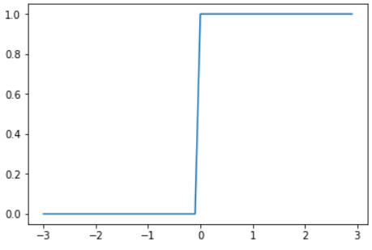

### 시그모이드 함수

```python
def mySig(x) :
    return 1/(1 + np.exp(-x))

x = np.arange(-3, 3, 0.1)
y = mySig(x)
plt.plot(x, y)
plt.show()
```

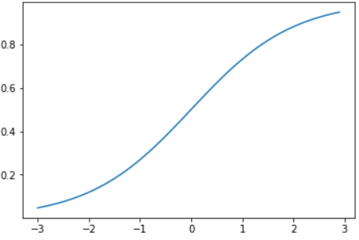

- 선형함수 : 출력이 입력값의 상수 배만큼 변하는 함수
    - `f(x) = ax + b` => 1개의 직선
- 비선형함수 : 1개의 직선으로 그릴 수 없는 함수


- 신경망 : 여러 퍼셉트론으로 깊게 구성
    - Hidden layer로 선형함수를 사용할 경우
        - Hidden layer 전후의 데이터가 비슷하게 변하므로 유의미하지 않다.

### ReLu 함수

```python
def myLeRu(x) :
    return np.maximum(0, x)

x = np.arange(-3, 3, 0.1)
y = myLeRu(x)
plt.plot(x, y)
plt.show()
```

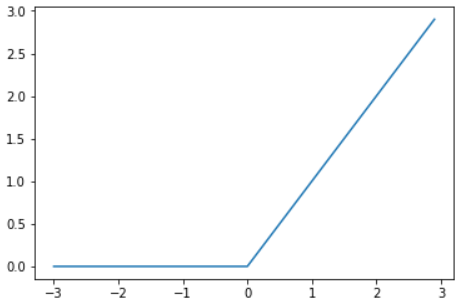

# MLP 분류기 기반 타이타닉 데이터 분석

```python
import pandas as pd
import numpy as np
import re
import matplotlib.pyplot as plt
%matplotlib inline
```

```python
train_df = pd.read_csv("../data_for_analysis/titanic/train.csv")
test_df = pd.read_csv("../data_for_analysis/titanic/test.csv")
train_df.head()
```

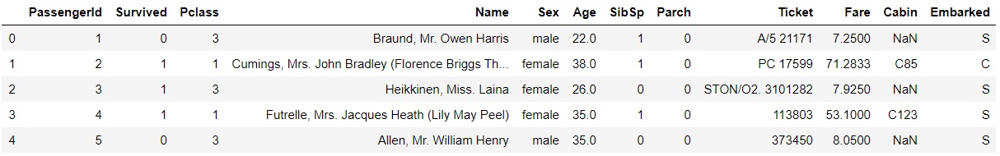

```python
full_df = pd.concat([train_df, test_df], ignore_index=True)
full_df
```

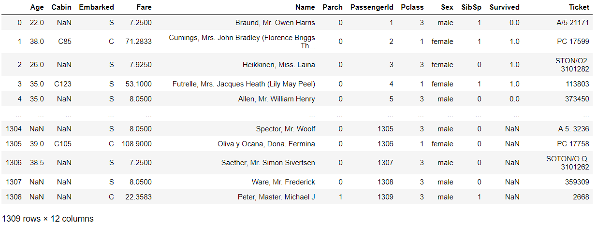

```python
train_df.info()
# > <class 'pandas.core.frame.DataFrame'>
# > RangeIndex: 891 entries, 0 to 890
# > Data columns (total 12 columns):
# > PassengerId    891 non-null int64
# > Survived       891 non-null int64
# > Pclass         891 non-null int64
# > Name           891 non-null object
# > Sex            891 non-null object
# > Age            714 non-null float64
# > SibSp          891 non-null int64
# > Parch          891 non-null int64
# > Ticket         891 non-null object
# > Fare           891 non-null float64
# > Cabin          204 non-null object
# > Embarked       889 non-null object
# > dtypes: float64(2), int64(5), object(5)
# > memory usage: 83.7+ KB
```

```python
test_df.info()
# > <class 'pandas.core.frame.DataFrame'>
# > RangeIndex: 418 entries, 0 to 417
# > Data columns (total 11 columns):
# > PassengerId    418 non-null int64
# > Pclass         418 non-null int64
# > Name           418 non-null object
# > Sex            418 non-null object
# > Age            332 non-null float64
# > SibSp          418 non-null int64
# > Parch          418 non-null int64
# > Ticket         418 non-null object
# > Fare           417 non-null float64
# > Cabin          91 non-null object
# > Embarked       418 non-null object
# > dtypes: float64(2), int64(4), object(5)
# > memory usage: 36.0+ KB
```

```python
full_df.info()
# > <class 'pandas.core.frame.DataFrame'>
# > RangeIndex: 1309 entries, 0 to 1308
# > Data columns (total 12 columns):
# > Age            1046 non-null float64
# > Cabin          295 non-null object
# > Embarked       1307 non-null object
# > Fare           1308 non-null float64
# > Name           1309 non-null object
# > Parch          1309 non-null int64
# > PassengerId    1309 non-null int64
# > Pclass         1309 non-null int64
# > Sex            1309 non-null object
# > SibSp          1309 non-null int64
# > Survived       891 non-null float64
# > Ticket         1309 non-null object
# > dtypes: float64(3), int64(4), object(5)
# > memory usage: 122.8+ KB
```

```python
train_df = pd.DataFrame()
test_Df = pd.DataFrame()
```

```python
def extract_df() :
    tr_df = full_df.loc[full_df['Survived'].notnull()]
    te_df = full_df.loc[full_df['Survived'].isnull()]
    return tr_df, te_df
    
train_df, test_df = extract_df()
```

## 호칭 추출

- 공백문자 + 알파벳문자1개 이상 + .

```python
title_sr = full_df.Name.str.extract(" ([A-Za-z]+)\.")
title_sr
```

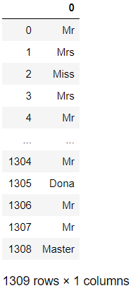

```python
full_df['Title'] = title_sr
pd.crosstab(full_df['Title'], full_df['Sex'])
```

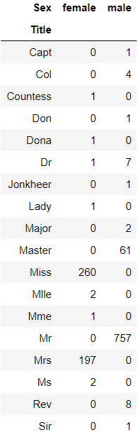

```python
title_sr = full_df.Name.str.extract(" ([A-Za-z]+)\.", expand=False)
# expand=True -> 데이터프레임(default)
title_sr.value_counts()
# > Mr          757
# > Miss        260
# > Mrs         197
# > Master       61
# > Rev           8
# > Dr            8
# > Col           4
# > Mlle          2
# > Ms            2
# > Major         2
# > Jonkheer      1
# > Dona          1
# > Lady          1
# > Mme           1
# > Sir           1
# > Capt          1
# > Don           1
# > Countess      1
# > Name: Name, dtype: int64
```

### 호칭 단순화

```python
title_list = set(title_sr)
map_title_dic = {'Mlle':'Miss', 'Ms':'Miss', 'Mme':'Mrs'}

working_dic = {}
for key in ['Lady', 'Countess', 'Capt', 'Col', 'Don', 'Major', 'Rev', 'Sir', 'Jonkheer', 'Dona'] :
    working_dic[key] = 'Rare'

working_dic
# > {'Lady': 'Rare',
# >  'Countess': 'Rare',
# >  'Capt': 'Rare',
# >  'Col': 'Rare',
# >  'Don': 'Rare',
# >  'Major': 'Rare',
# >  'Rev': 'Rare',
# >  'Sir': 'Rare',
# >  'Jonkheer': 'Rare',
# >  'Dona': 'Rare'}
```

#### dict update

```python
map_title_dic.update(working_dic)
map_title_dic # 호칭을 매핑하기 위한 규칙 정의 딕셔너리
# > {'Mlle': 'Miss',
# >  'Ms': 'Miss',
# >  'Mme': 'Mrs',
# >  'Lady': 'Rare',
# >  'Countess': 'Rare',
# >  'Capt': 'Rare',
# >  'Col': 'Rare',
# >  'Don': 'Rare',
# >  'Major': 'Rare',
# >  'Rev': 'Rare',
# >  'Sir': 'Rare',
# >  'Jonkheer': 'Rare',
# >  'Dona': 'Rare'}
```

```python
full_df['Title']
# > 0           Mr
# > 1          Mrs
# > 2         Miss
# > 3          Mrs
# > 4           Mr
# >          ...  
# > 1304        Mr
# > 1305      Dona
# > 1306        Mr
# > 1307        Mr
# > 1308    Master
# > Name: Title, Length: 1309, dtype: object
```

```python
full_df['Title'] = full_df['Title'].replace(map_title_dic)
full_df['Title']
# > 0           Mr
# > 1          Mrs
# > 2         Miss
# > 3          Mrs
# > 4           Mr
# >          ...  
# > 1304        Mr
# > 1305      Rare
# > 1306        Mr
# > 1307        Mr
# > 1308    Master
# > Name: Title, Length: 1309, dtype: object

set(list(full_df['Title']))
# > {'Dr', 'Master', 'Miss', 'Mr', 'Mrs', 'Rare'}
```

## 불필요한 변수 제거

```python
SubCol1 = test_df.PassengerId
full_df.drop(['PassengerId', 'Name', 'Ticket', 'Cabin'], axis=1, inplace=True)

train_df, test_df = extract_df()
```

- PClass별 생존자별 평균

```python
train_df.groupby('Pclass')['Survived'].mean()
# > Pclass
# > 1    0.629630
# > 2    0.472826
# > 3    0.242363
# > Name: Survived, dtype: float64
```

```python
train_df[['Pclass', 'Survived']].groupby(['Pclass'], as_index=False).mean()
```

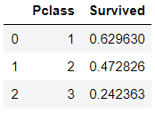

## 변수에 대한 요약

```python
feature_list = list(full_df)
feature_list
# > ['Age',
# >  'Embarked',
# >  'Fare',
# >  'Parch',
# >  'Pclass',
# >  'Sex',
# >  'SibSp',
# >  'Survived',
# >  'Title']
```

```python
# 각 변수에서 unique 수
for f in feature_list :
    print(f+" "+str(len(full_df[f].value_counts())))
# > Age 98
# > Embarked 3
# > Fare 281
# > Parch 8
# > Pclass 3
# > Sex 2
# > SibSp 7
# > Survived 2
# > Title 6
```

```python
train_df.hist()
```

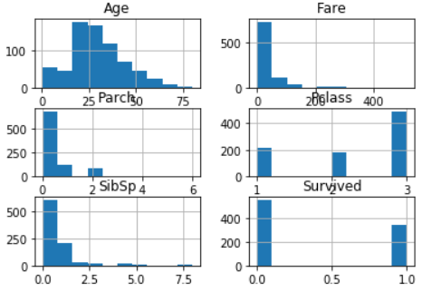

```python
train_df.hist(figsize=(9,7), grid=False, bins="auto")
```

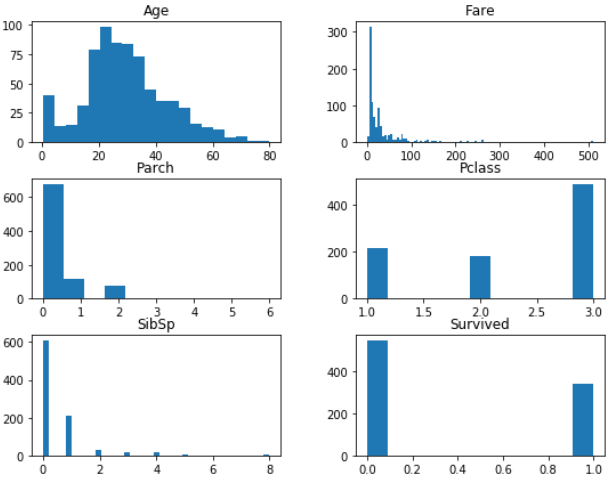

## 결측치 처리

```python
train_df.isnull().sum()
# > Age         177
# > Embarked      2
# > Fare          0
# > Parch         0
# > Pclass        0
# > Sex           0
# > SibSp         0
# > Survived      0
# > Title         0
# > dtype: int64

test_df.isnull().sum()
# > Age          86
# > Embarked      0
# > Fare          1
# > Parch         0
# > Pclass        0
# > Sex           0
# > SibSp         0
# > Survived    418
# > Title         0
# > dtype: int64
```

```python
full_df['Embarked'].value_counts()
# > S    914
# > C    270
# > Q    123
# > Name: Embarked, dtype: int64

full_df['Embarked'].fillna("S", inplace=True)
```

```python
full_df['Fare'].fillna(test_df['Fare'].median(), inplace=True)
```

```python
train_df, test_df = extract_df()
full_df['Sex'] = full_df['Sex'].map({'female':0, 'male':1})
```

```python
def onehot(df, feature_list) : # 원핫 인코딩
    df = pd.get_dummies(df, columns=feature_list)
    return df
    
onehot_list = ['Title', 'Pclass', 'Embarked']
full_df = onehot(full_df, onehot_list)
full_df.head()
```

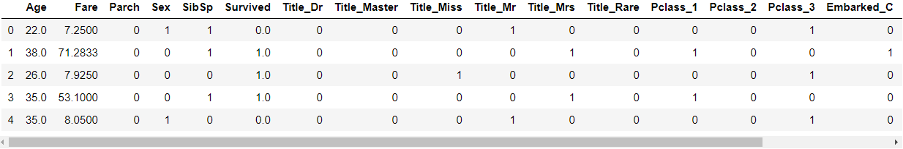

## Age 컬럼 결측치 처리

```python
train_df, test_df = extract_df()
x_train_age = full_df[[x for x in list(train_df) if not x in ['Survived']]]
x_train_age
```

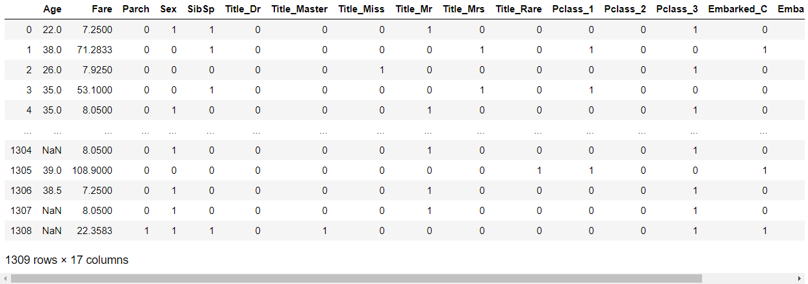

```python
x_pred_age = x_train_age.loc[x_train_age['Age'].isnull()]
x_pred_age
```

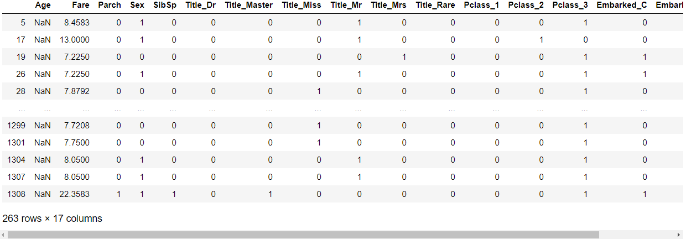

```python
x_train_age = x_train_age.loc[x_train_age['Age'].notnull()]
x_train_age
```

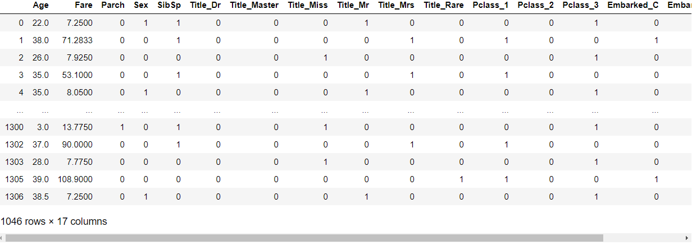

```python
y_train_age = x_train_age.Age
x_train_age.drop('Age', axis=1, inplace=True)

x_pred_age.drop('Age', axis=1, inplace=True)
```


### MLP기반 나이 예측 및 나이 결측값 대체

- 표준화

```python
from sklearn import preprocessing
scaler2 = preprocessing.StandardScaler().fit(x_train_age)
scaler2
# > StandardScaler(copy=True, with_mean=True, with_std=True)
```

```python
x_train_age = scaler2.transform(x_train_age)
x_pred_age = scaler2.transform(x_pred_age)
```

- 표준화 결과

```python
x_pred_age
# > array([[-0.5065512 , -0.50116236,  0.7678969 , ..., -0.50417918,
# >          4.46318272, -1.72984578],
# >        [-0.42498839, -0.50116236,  0.7678969 , ..., -0.50417918,
# >         -0.22405536,  0.57808622],
# >        [-0.52869961, -0.50116236, -1.30225815, ...,  1.98342186,
# >         -0.22405536, -1.72984578],
# >        ...,
# >        [-0.51388372, -0.50116236,  0.7678969 , ..., -0.50417918,
# >         -0.22405536,  0.57808622],
# >        [-0.51388372, -0.50116236,  0.7678969 , ..., -0.50417918,
# >         -0.22405536,  0.57808622],
# >        [-0.25692593,  0.69023725,  0.7678969 , ...,  1.98342186,
# >         -0.22405536, -1.72984578]])
```

- Age열 결측치를 위한 모델 생성 & 적합

```python
Age_None_list = full_df[full_df['Age'].isnull()].index.tolist()
Age_None_list
```

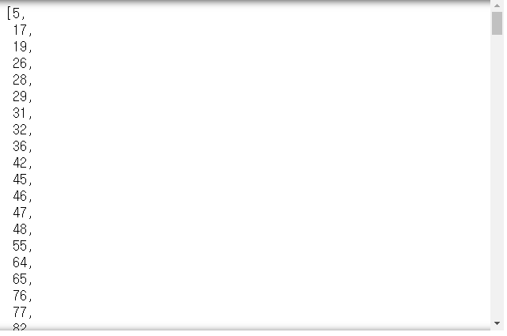

```python
from sklearn.neural_network import MLPRegressor

mlr = MLPRegressor(solver="lbfgs", alpha=1e-5, 
                   hidden_layer_sizes=(50, 50))
mlr.fit(x_train_age, y_train_age)
# > MLPRegressor(activation='relu', alpha=1e-05, batch_size='auto', beta_1=0.9,
# >              beta_2=0.999, early_stopping=False, epsilon=1e-08,
# >              hidden_layer_sizes=(50, 50), learning_rate='constant',
# >              learning_rate_init=0.001, max_iter=200, momentum=0.9,
# >              n_iter_no_change=10, nesterovs_momentum=True, power_t=0.5,
# >              random_state=None, shuffle=True, solver='lbfgs', tol=0.0001,
# >              validation_fraction=0.1, verbose=False, warm_start=False)
```

```python
mlr.score(x_train_age, y_train_age)
# > 0.482738333757977
```

- 실제값과 예측값 확인

```python
for a, b in zip(np.array(y_train_age), mlr.predict(x_train_age)) :
    print(a, " ", b)
```

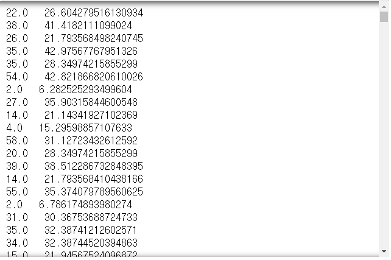

- Age 컬럼 결측치를 예측치로 대체

```python
full_df['Age'][Age_None_list]
# > 5      NaN
# > 17     NaN
# > 19     NaN
# > 26     NaN
# > 28     NaN
# >         ..
# > 1299   NaN
# > 1301   NaN
# > 1304   NaN
# > 1307   NaN
# > 1308   NaN
# > Name: Age, Length: 263, dtype: float64
```

```python
full_df['Age'][Age_None_list] = mlr.predict(x_pred_age).tolist()
```

- 결측치 확인

```python
full_df.info()
# > <class 'pandas.core.frame.DataFrame'>
# > RangeIndex: 1309 entries, 0 to 1308
# > Data columns (total 18 columns):
# > Age             1309 non-null float64
# > Fare            1309 non-null float64
# > Parch           1309 non-null int64
# > Sex             1309 non-null int64
# > SibSp           1309 non-null int64
# > Survived        891 non-null float64
# > Title_Dr        1309 non-null uint8
# > Title_Master    1309 non-null uint8
# > Title_Miss      1309 non-null uint8
# > Title_Mr        1309 non-null uint8
# > Title_Mrs       1309 non-null uint8
# > Title_Rare      1309 non-null uint8
# > Pclass_1        1309 non-null uint8
# > Pclass_2        1309 non-null uint8
# > Pclass_3        1309 non-null uint8
# > Embarked_C      1309 non-null uint8
# > Embarked_Q      1309 non-null uint8
# > Embarked_S      1309 non-null uint8
# > dtypes: float64(3), int64(3), uint8(12)
# > memory usage: 76.8 KB
```

## Survived 여부 예측

- 모형 적합을 위한 데이터 분할

```python
xtrain = full_df[full_df['Survived'].notnull()]
ytrain = full_df['Survived'][full_df['Survived'].notnull()]

xtrain
```

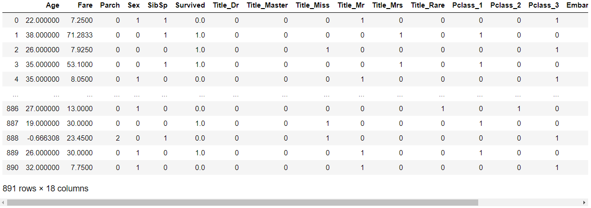

```python
ytrain
# > 0      0.0
# > 1      1.0
# > 2      1.0
# > 3      1.0
# > 4      0.0
# >       ... 
# > 886    0.0
# > 887    1.0
# > 888    0.0
# > 889    1.0
# > 890    0.0
# > Name: Survived, Length: 891, dtype: float64
```

```python
xpredict = full_df[full_df['Survived'].isnull()]
```

```python
xtrain.drop('Survived', axis=1, inplace=True)
xpredict.drop('Survived', axis=1, inplace=True)
```

- 표준화

```python
scaler = preprocessing.StandardScaler().fit(xtrain)
xtrain = scaler.transform(xtrain)
xpredict = scaler.transform(xpredict)
```

### 모델 적용

```python
from sklearn.neural_network import MLPClassifier

clf = MLPClassifier(solver='lbfgs', alpha=1e-5, hidden_layer_sizes=(50, 50))
clf.fit(xtrain, ytrain)
# > MLPClassifier(activation='relu', alpha=1e-05, batch_size='auto', beta_1=0.9,
# >               beta_2=0.999, early_stopping=False, epsilon=1e-08,
# >               hidden_layer_sizes=(50, 50), learning_rate='constant',
# >               learning_rate_init=0.001, max_iter=200, momentum=0.9,
# >               n_iter_no_change=10, nesterovs_momentum=True, power_t=0.5,
# >               random_state=None, shuffle=True, solver='lbfgs', tol=0.0001,
# >               validation_fraction=0.1, verbose=False, warm_start=False)
```

```python
clf.score(xtrain, ytrain)
# > 0.9292929292929293

clf.predict(xtrain)
```

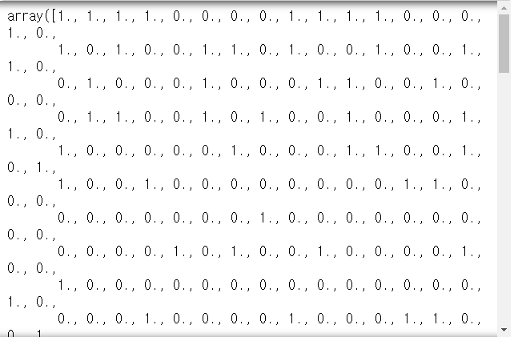

```python
subcol = clf.predict(xpredict).astype(int)
subcol
```

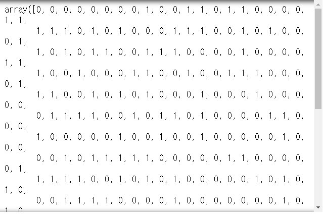

```python
sm = pd.DataFrame({'PassengerId':SubCol1, 'Survived':subcol})
sm.to_csv('titanic_sub.csv', index=True)
```

# 연습문제

- iris 데이터 분류기(MLP기반) 제작


- iris 데이터 호출

```python
from sklearn.datasets import load_iris

iris = load_iris()
iris_data = pd.DataFrame(data=np.c_[iris['data'], iris['target']], columns=iris['feature_names'] + ['target'])
iris_data['target'] = iris_data['target'].map(dict(zip([0,1,2], iris['target_names'])))

iris_data.head()
```

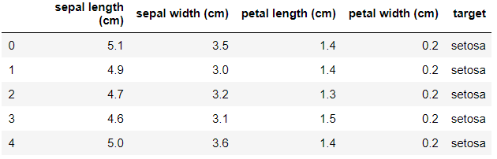

- 데이터 분할

```python
from sklearn.model_selection import train_test_split

xTrain, xTest, yTrain, yTest = train_test_split(iris_data.iloc[:,:-1], iris_data['target'], test_size=0.3, random_state=0, stratify=iris_data['target'])
```

- 모델 적용

```python
from sklearn.neural_network import MLPClassifier

clf = MLPClassifier(solver='lbfgs', alpha=1e-5, hidden_layer_sizes=(50,50))
clf.fit(xTrain, yTrain)
# > MLPClassifier(activation='relu', alpha=1e-05, batch_size='auto', beta_1=0.9,
# >               beta_2=0.999, early_stopping=False, epsilon=1e-08,
# >               hidden_layer_sizes=(50, 50), learning_rate='constant',
# >               learning_rate_init=0.001, max_iter=200, momentum=0.9,
# >               n_iter_no_change=10, nesterovs_momentum=True, power_t=0.5,
# >               random_state=None, shuffle=True, solver='lbfgs', tol=0.0001,
# >               validation_fraction=0.1, verbose=False, warm_start=False)
```
```python
clf.score(xTrain, yTrain)
# > 0.9809523809523809

clf.predict(xTest)
# > array(['virginica', 'virginica', 'setosa', 'setosa', 'versicolor',
# >        'setosa', 'versicolor', 'virginica', 'setosa', 'versicolor',
# >        'setosa', 'virginica', 'setosa', 'virginica', 'versicolor',
# >        'virginica', 'versicolor', 'versicolor', 'versicolor', 'setosa',
# >        'versicolor', 'virginica', 'setosa', 'versicolor', 'virginica',
# >        'virginica', 'virginica', 'virginica', 'versicolor', 'virginica',
# >        'versicolor', 'setosa', 'setosa', 'versicolor', 'versicolor',
# >        'virginica', 'versicolor', 'setosa', 'setosa', 'versicolor',
# >        'setosa', 'virginica', 'setosa', 'setosa', 'virginica'],
# >       dtype='<U10')

pd.crosstab(yTest, clf.predict(xTest))
```

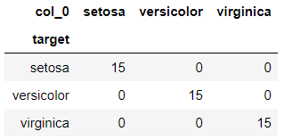

