[toc]

# Day51 미니프로젝트

1. 데이터 분석 범위
   - 공용 관리비에 한함
   - 공용 관리비 : 일반관리비, 청소비, ..., 수도 공용
   - => 공용관리비 중 각 항목이 차지하는 비중 & 시각화
   - 일반 관리비의 하위 항목들이 차지하는 비중
   - 월/년/분기/계절별로 관리비 항목의 변화 패턴?
   - 이상치 확인(시각화)
   - 상관분석(상관관계가 높은 변수들, 1 or -1에 가까운)
2. 예측/분류

```python
import pandas as pd
import numpy as np
import matplotlib.pyplot as plt
import xlrd
```

```python
# 그래프 한글 표시
import matplotlib
from matplotlib import font_manager, rc
import platform
if platform.system()=="Windows":
    font_name=font_manager.FontProperties(fname="c:/Windows/Fonts/malgun.ttf").get_name()
    rc('font', family=font_name)
matplotlib.rcParams['axes.unicode_minus']=False

import warnings
warnings.filterwarnings("ignore")
```

## 데이터 불러오기

```python
path = "../data_for_analysis/관리비데이터/"
period = []
for i in [2015, 2016, 2017, 2018, 2019] :
    period = period + list(map(str, range(100*i+1, 100*i+13)))
file_tail = " 가양도시개발공사8단지(임대).xls"
```

```python
# 원하는 데이터만 따로 저장
management = pd.DataFrame()

for month in period :
    xls = pd.ExcelFile(path+month+file_tail)
    sheetX = xls.parse(0, header=2)
    data = sheetX.iloc[[1,32,33,34,35,36,37,42,45,48,51,54,57],[0,1]]
    management = pd.concat([management, data.우리단지총액], axis=1)
```

```python
management.columns = period
management.index = data.iloc[:,0].values
management = management.T

management
```

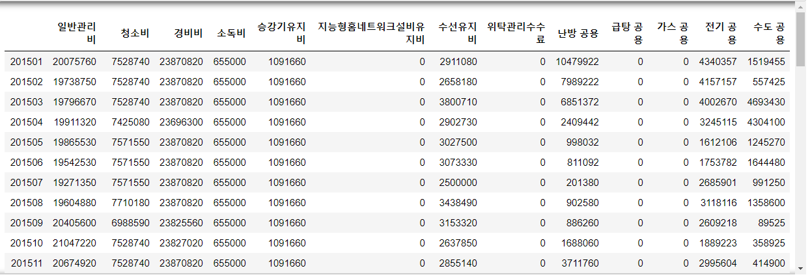

```python
management_per = management.div(management.sum(1),0)*100
management_per
```

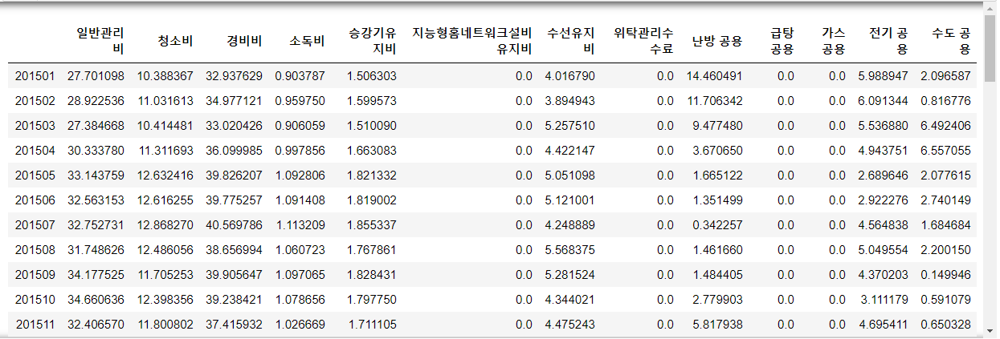

## 공용관리비 중 각 항목이 차지하는 비중 & 시각화

```python
colors = ['grey', 'rosybrown', 'darksalmon', 
          'palegreen', 'sandybrown', 'tan',
          'darkkhaki', 'lightseagreen', 
          'palevioletred', 'paleturquoise', 
          'royalblue', 'mediumpurple', 'plum']
plt.figure(figsize=(12, 10))

title = plt.title("2015.01", fontsize=30)
pie = plt.pie(management.iloc[1], colors=colors)
plt.legend(loc="center right", 
           labels=['%3.1f%%, %s' %(l, s) for l, s in zip(management_per.iloc[1], management.columns)], 
           bbox_to_anchor=(1.1,0.5), 
           fontsize=20, 
           bbox_transform=plt.gcf().transFigure)
plt.axis('equal')
plt.tight_layout()
```

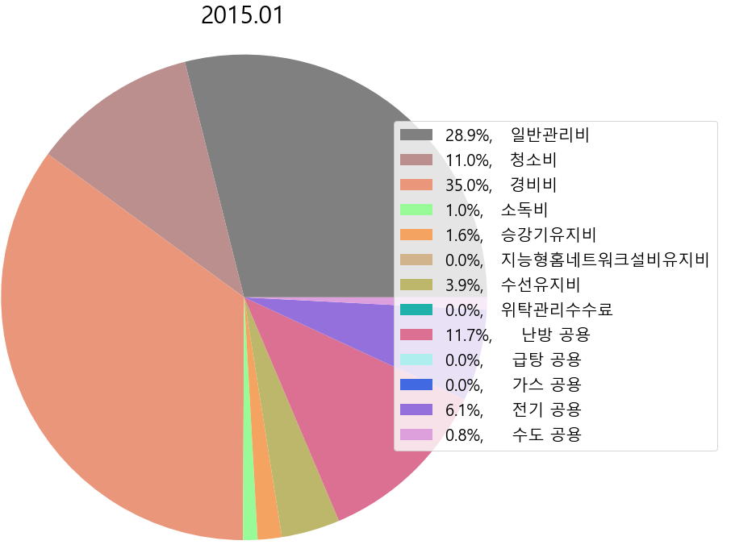

```python
want_month = "201902"

colors = ['grey', 'rosybrown', 'darksalmon', 
          'palegreen', 'sandybrown', 'tan', 
          'darkkhaki', 'lightseagreen', 
          'palevioletred', 'paleturquoise', 
          'royalblue', 'mediumpurple', 'plum']
plt.figure(figsize=(12, 10))

title = plt.title(want_month, fontsize=30)
pie = plt.pie(management.loc[want_month], colors=colors)
plt.legend(loc="center right", 
           labels=['%3.1f%%, %s' %(l, s) for l, s in zip(management_per.loc[want_month], management.columns)], 
           bbox_to_anchor=(1.1,0.5), 
           fontsize=20, 
           bbox_transform=plt.gcf().transFigure)
plt.axis('equal')
plt.tight_layout()
```

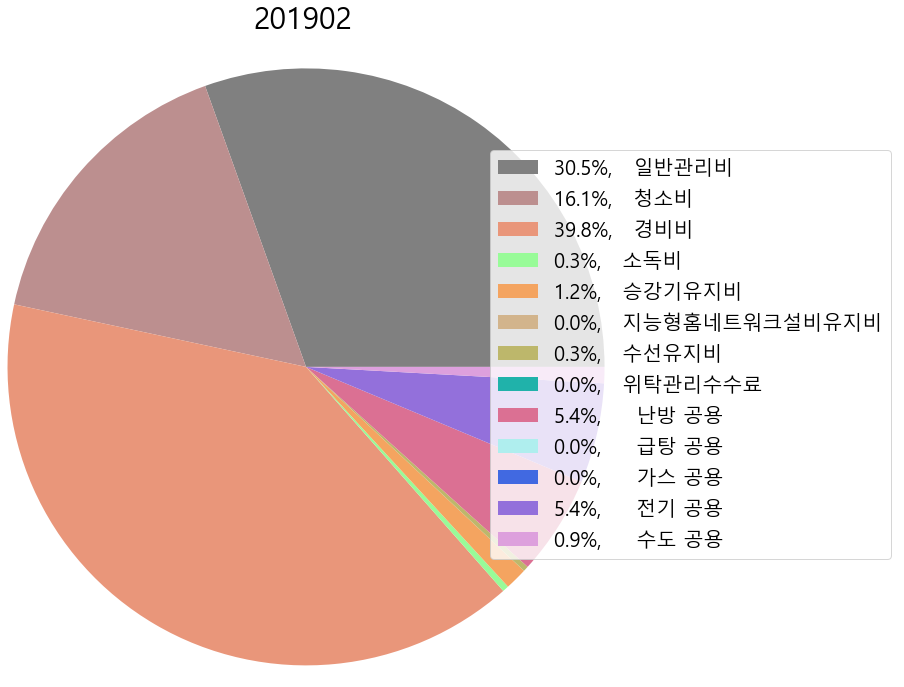

## 일반 관리비만 불러오기

```python
general = pd.DataFrame()

for month in period :
    xls = pd.ExcelFile(path+month+file_tail)
    sheetX = xls.parse(0, header=2)
    data = sheetX.iloc[list(range(2, 32)),[0,1]]
    general = pd.concat([general, data.우리단지총액], axis=1)

general.head()
```

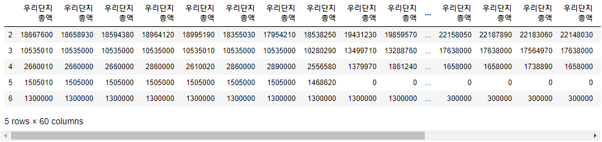

```python
general.columns = period
general.index = list(map(lambda x: x.replace(" ",""), data.iloc[:,0].values))
general = general.T
general.head()
```

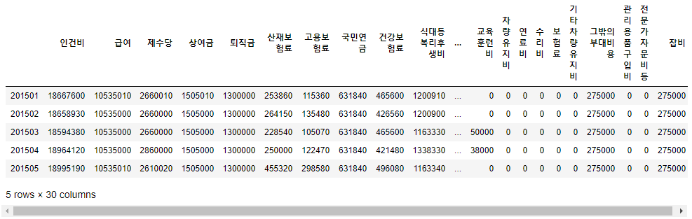

## 일반 관리비의 하위 항목들이 차지하는 비중

```python
plt.rcParams['figure.figsize'] = [10,10]

# info. of groups
group_names = ['인건비', '제사무비', '제세공과금', 
               '피복비', '교육훈련비', '차량유지비', 
               '그밖의부대비용']

# info. of subgroups
subgroup_names = ['급여','제수당','상여금','퇴직금','산재보험료','고용보험료','국민연금','건강보험료','식대등복리후생비',
                 '일반사무용품비','도서인쇄비','여비교통비',
                 '공과금중전기료','통신료','우편료','제세공과금등',
                 '피복비','교육훈련비',
                 '연료비','수리비','보험료','기타차량유지비',
                 '관리용품구입비','전문가자문비등','잡비']

# colors
c1, c2, c3, c4, c5, c6, c7 = [plt.cm.Reds, plt.cm.Blues, plt.cm.Greens,
                              plt.cm.Greys, plt.cm.Accent, plt.cm.Purples,
                              plt.cm.Oranges]

# width
width_num = 0.4
```

```python
want_month = "201501"
# Outside Ring
fig, ax = plt.subplots()
ax.axis('equal')
pie_outside, _ = ax.pie(general.loc[want_month, group_names],
                        radius=1.3, 
                        labels=group_names, 
                        labeldistance=0.8, 
                        colors=[c1(1.0), c2(0.6), c3(0.6), c4(0.6), c5(0.6), c6(0.6), c7(0.6)],
                        textprops={'fontsize':15})

plt.setp(pie_outside, width=width_num, edgecolor='white')

# Inner Ring
pie_inside, plt_labels, junk = ax.pie(
    general.loc[want_month, subgroup_names],
    radius=(1.3 - width_num),
    labels=subgroup_names, 
    labeldistance=0.75, 
    autopct='%1.1f%%',
    colors=[c1(0.9), c1(0.8), c1(0.7), c1(0.6), c1(0.5), c1(0.4), c1(0.3), c1(0.2), c1(0.1),
            c2(0.5), c2(0.4), c2(0.3),
            c3(0.5), c3(0.4), c3(0.3), c3(0.2),
            c4(0.6), c5(0.6),
            c6(0.5), c6(0.4), c6(0.3), c6(0.2), c6(0.1),
            c7(0.5), c7(0.4), c7(0.3)],
            textprops={'fontsize':10})

plt.setp(pie_inside, width=width_num, edgecolor='white')

plt.title("일반관리비의 하위 항목", fontsize=20)
plt.show()
```

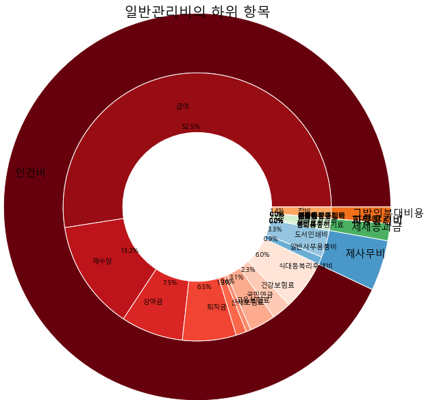

- 약간의 변화

```python
general_per = general.loc[:,subgroup_names].div(general.loc[:,subgroup_names].sum(1),0)*100
general_per.head()
```

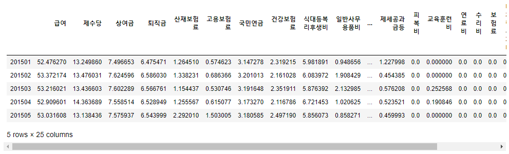

```python
want_month = "201501"

plt.rcParams['figure.figsize'] = [13,12]

# Outside Ring
fig, ax = plt.subplots()
ax.axis('equal')
pie_outside, _ = ax.pie(general.loc[want_month, group_names],
                        radius=1.3, 
                        labels=group_names, 
                        labeldistance=0.8, 
                        colors=[c1(1.0), c2(0.6), c3(0.6), c4(0.6), c5(0.6), c6(0.6), c7(0.6)],
                        textprops={'fontsize':15})

plt.setp(pie_outside, width=width_num, edgecolor='white')

# Inner Ring
pie_inside, plt_labels, junk = ax.pie(
    general.loc[want_month, subgroup_names],
    radius=(1.3 - width_num),
    labels=subgroup_names, 
    labeldistance=0.75, 
    autopct='%1.1f%%',
    colors=[c1(0.9), c1(0.8), c1(0.7), c1(0.6), c1(0.5), c1(0.4), c1(0.3), c1(0.2), c1(0.1),
            c2(0.5), c2(0.4), c2(0.3),
            c3(0.5), c3(0.4), c3(0.3), c3(0.2),
            c4(0.6), c5(0.6),
            c6(0.5), c6(0.4), c6(0.3), c6(0.2), c6(0.1),
            c7(0.5), c7(0.4), c7(0.3)],
            textprops={'fontsize':10}
)

ax.legend(loc="center right", 
          labels=group_names+['%3.1f%%, %s' %(l, s) for l, s in zip(general_per.loc[want_month, subgroup_names], subgroup_names)], 
          bbox_to_anchor=(1.1,0.5), 
          fontsize=15, 
          bbox_transform=plt.gcf().transFigure)
plt.setp(pie_inside, width=width_num, edgecolor='white')

plt.title("일반관리비의 하위 항목", fontsize=20)
plt.show()
```

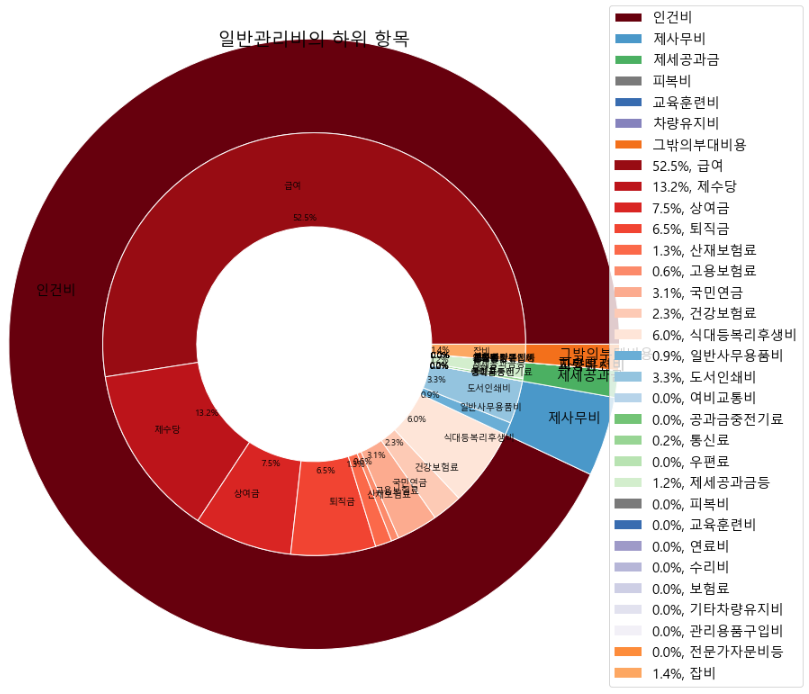

## 월/년/분기/계절별로 관리비 항목의 변화 패턴

```python
management_per.index = pd.to_datetime(management_per.index, format='%Y%m')

plt.figure(figsize=(15,10))
plt.plot(management_per[["일반관리비", "청소비", "경비비"]])
plt.legend(loc="center right", 
           labels=["일반관리비", "청소비", "경비비"], 
           bbox_to_anchor=(1.1,0.5), 
           fontsize=20, 
           bbox_transform=plt.gcf().transFigure)
```

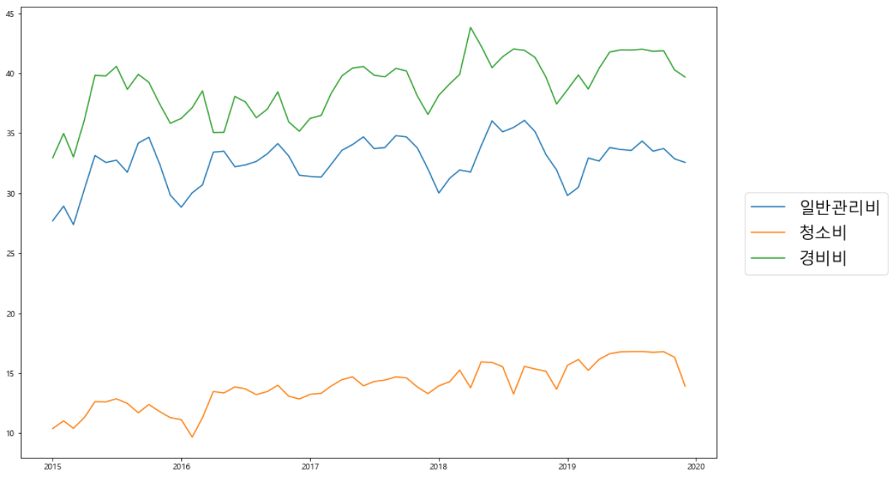

```python
manage_list = management_per.columns

plt.figure(figsize=(15,10))
plt.plot(management_per[manage_list[list(range(3,13))]])
plt.legend(loc="center right", 
           labels=manage_list[list(range(3,13))], 
           bbox_to_anchor=(1.2,0.5), 
           fontsize=20, 
           bbox_transform=plt.gcf().transFigure)
```

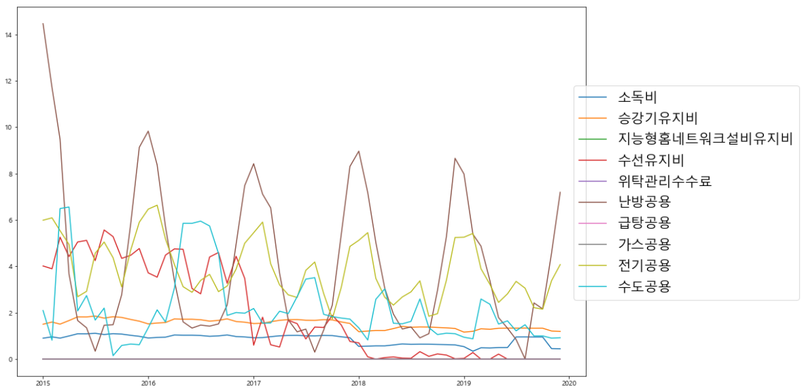

- datetime으로 변경한 index 확인

```python
management_per.index
# > DatetimeIndex(['2015-01-01', '2015-02-01', '2015-03-01', '2015-04-01',
# >                '2015-05-01', '2015-06-01', '2015-07-01', '2015-08-01',
# >                '2015-09-01', '2015-10-01', '2015-11-01', '2015-12-01',
# >                '2016-01-01', '2016-02-01', '2016-03-01', '2016-04-01',
# >                '2016-05-01', '2016-06-01', '2016-07-01', '2016-08-01',
# >                '2016-09-01', '2016-10-01', '2016-11-01', '2016-12-01',
# >                '2017-01-01', '2017-02-01', '2017-03-01', '2017-04-01',
# >                '2017-05-01', '2017-06-01', '2017-07-01', '2017-08-01',
# >                '2017-09-01', '2017-10-01', '2017-11-01', '2017-12-01',
# >                '2018-01-01', '2018-02-01', '2018-03-01', '2018-04-01',
# >                '2018-05-01', '2018-06-01', '2018-07-01', '2018-08-01',
# >                '2018-09-01', '2018-10-01', '2018-11-01', '2018-12-01',
# >                '2019-01-01', '2019-02-01', '2019-03-01', '2019-04-01',
# >                '2019-05-01', '2019-06-01', '2019-07-01', '2019-08-01',
# >                '2019-09-01', '2019-10-01', '2019-11-01', '2019-12-01'],
# >               dtype='datetime64[ns]', freq=None)
```

## 이상치 확인 (시각화)

```python
plt.figure(figsize=(15,10))
plt.boxplot(management_per.iloc[:,:3].T, labels=management.columns[:3])
```

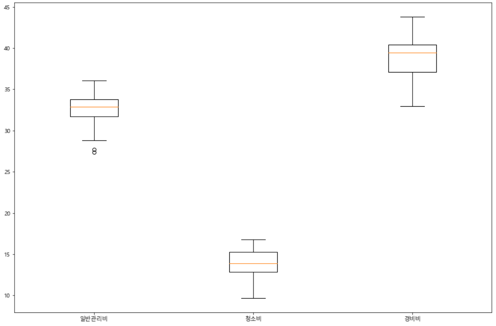

```python
plt.figure(figsize=(15,10))
plt.boxplot(management_per.iloc[:,3:].T, labels=management.columns[3:])
```

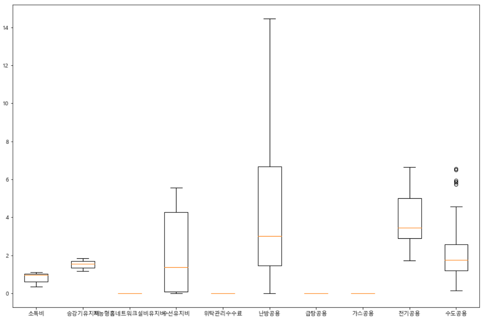

## 상관분석(상관관계가 높은 변수들, 1 or -1에 가까운)

```python
management.corr(method="pearson")
```

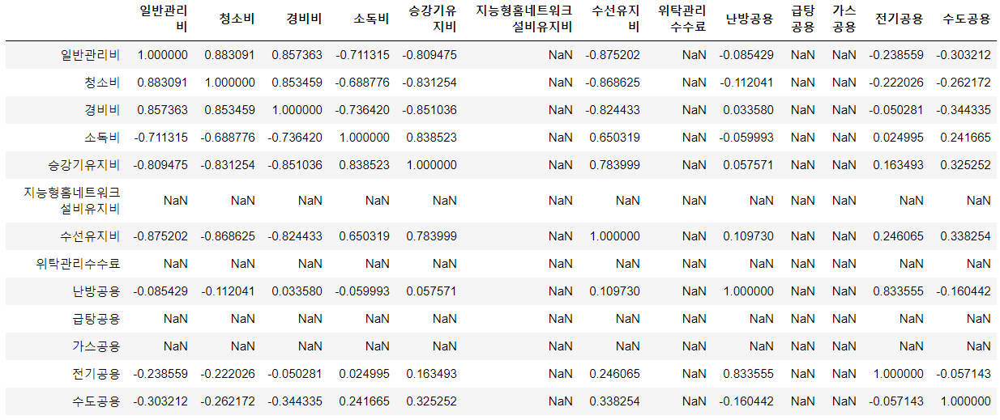