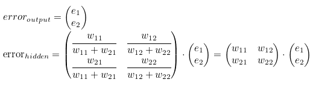

[toc]

# Day52 Scikitlearn을 활용한 머신러닝(5)

뉴런은 선형함수로 표현(실제 뉴런은 단순하지 않다)

선형 함수의 출력값 = 상수\* 입력값 + 상수 >= or < 임계치 -> 1 or 0

'퍼셉트론 = 노드' 들이 각각의 Layer에 존재하여 입력 계층과 노드, 출력 계층 사이에 존재한다.

연결선(가중치)은 노드 간 연결의 강도를 나타낸다.


에서 가중치를 나타내는 변수의 넘버링은 논문이나 책에 따라 다를 수 있으므로 미리 확인을 하여야 한다.

- 행렬

행렬 곱 = 내적(inner product, dot product)

행렬 곱을 이용하여 신경망 식을 계산할 수 있다.

- 역전파(Backpropagation)

먼저 계산 결과와 정답의 오차를 구해 이 오차에 관여하는 값들의 가중치를 수정하여 오차가 작아지는 방향으로 일정 횟수를 반복해 수정하는 방법

동일 입력층에 대해 원하는 값이 출력되도록 개개의 weight를 조정하는 방법으로 사용


- 가중치 활용

입력 신호를 전달하는 데에 가중치로 사용

오차를 줄이기 위하여 역전파를 실시할 때 가중치로 사용 



## 간단한 신경망

```python
# 신경망 구현(라이브러리X)
import numpy as np

X = np.array([1,2,3,4])

# 차원의 수
np.ndim(X)
# > 1

X.shape
# > (4,)
```

```python
# 이차원 배열
X = np.array([[1,2],[3,4],[5,6]])
np.ndim(X)
# > 2

X.shape
# > (3, 2)
```

```python
# 행렬의 곱(내적)
X = np.array([[1,2],[3,4]])
Y = np.array([[5,6],[7,8]])

np.dot(X,Y)
# > array([[19, 22],
# >        [43, 50]])
```

```python
X = np.array([1,2])
X.shape
# > (2,)

W = np.array([[1,3,5],[2,4,6]])
W.shape
# > (2, 3)

np.dot(X,W)
# > array([ 5, 11, 17])
```

### 단순 구현

```python
# active function(sigmoid)
def sigmoid(x):
    return 1/(1+np.exp(-x))
```

```python
X = np.array([[1.0, 0.5]])
W1 = np.array([[0.1, 0.3, 0.5], [0.2, 0.4, 0.6]])
B1 = np.array([0.1, 0.2, 0.3])

H1 = np.dot(X,W1) + B1
H1
# > array([[0.3, 0.7, 1.1]])

Z1 = sigmoid(H1)
Z1
# > array([[0.57444252, 0.66818777, 0.75026011]])

W2 = np.array([[0.1, 0.4], [0.2, 0.5], [0.3, 0.6]])
B2 = np.array([0.1, 0.2])

H2 = np.dot(Z1, W2) + B2
Z2 = sigmoid(H2)
Z2
# > array([[0.62624937, 0.7710107 ]])

W3 = np.array([[0.1, 0.2], [0.2, 0.3]])
B3 = np.array([0.1, 0.2])

H3 = np.dot(Z2, W3) + B3
H3
# > array([[0.31682708, 0.55655308]])
```

마지막 H값에 sigmoid함수를 사용하지 않으면 예측문제이고, sigmoid를 함수를 사용하면 분류문제가 된다.

cf) softmax함수는 다분류 문제에 사용된다.

### softmax

```python
scores = np.array([20,10,1])
exp_s = np.exp(scores) # 지수함수
exp_s
# > array([4.85165195e+08, 2.20264658e+04, 2.71828183e+00])

sum_exp_s = np.sum(exp_s) # 지수 함수의 합
sum_exp_s
# > 485187224.5938669

y = exp_s / sum_exp_s
y # softmax 결과
# > array([9.99954597e-01, 4.53978684e-05, 5.60254205e-09])
```

# 연습문제

- 간단한 순전차

```python
def relu(x):
    return np.array(list(map(lambda x: max(0,x), x)))

X = np.array([2,5])
W1 = np.array([[1,2,3], [4,5,6]])
H1 = np.dot(X, W1)
Z1 = relu(H1)
W2 = np.array([[1,2], [3,4], [5,6]])
H2 = np.dot(Z1, W2)
W3 = np.array([[1],[2]])
Z3 = np.dot(H2, W3)
Z3
# > array([1041])
```

