[toc]

# Day53 Scikitlearn을 활용한 머신러닝(6)

- 가중치 갱신

  - | 입력  |  |        은닉         |  | 출력  |
    | :---: | :-----------: | :-----------------: | :--: | :---: |
    | i = 1 |  |        j = 1        |  | k = 1 |
    |       | 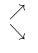 |                     |  |       |
    | i = 2 | 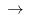 |  j = 2 |  | k = 2 |

  - 노드 오차 = 목표값 - 실제값($E_k = t_k - O_k$)
  
  - 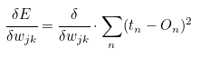
  
  - 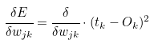
  
  - 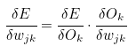
  
- 계산 그래프 : 계산을 그래프로 표현

  - 코딩이 간단하다.
  - 중간중간의 계산 결과를 저장할 수 있다.
  - 중간 수치 조정에 용이하다.(가중치를 효율적으로 업데이트하기 위해서)
  - ex. 길동은 사과를 2개, 귤을 3개
  - 사과는 1개에 100원, 귤 150원 지불금액은? 세금 10%
    - 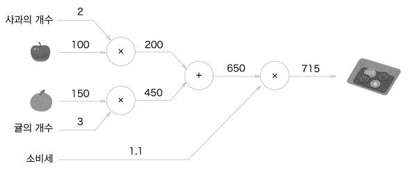
      - 순전파
    - 사과 가격 : `x` , 지불금액 : `L` 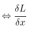
      - 역전파
        - 
        - 200밑의 1.1 = 220/200*1의 결과 값
        - 1.1 밑의 200 = 220/1.1*1의 결과 값
        - 100밑의 2.2 = 200/100*1.1의 결과 값
        - 2밑의 110 = 200/2*1.1의 결과 값
        - 사과 가격에 대한 최종 계산 금액의 미분값? 2.2
          - 사과 가격이 1 오르면 지불할 금액은 2.2 오른다.
          - 사과의 개수가 1개 오르면 지불할 금액은 110이 오른다.
        - 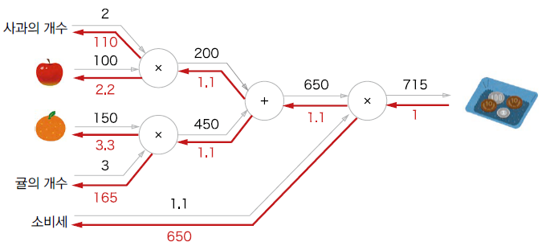

- 연쇄법칙? 합성 함수 미분과 관련된 성질

  - 합성 함수의 미분은 합성 함수를 구성한느 각 함수의 미분의 곱으로 표현
  - 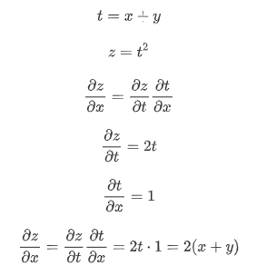
  - 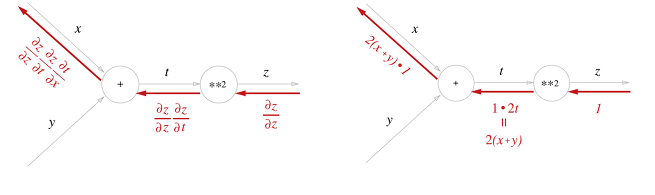

## 역전파

### 덧셈 노드의 역전파

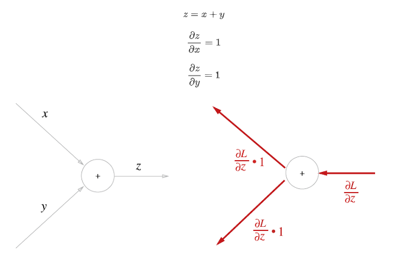

### 곱셈 노드의 역전파

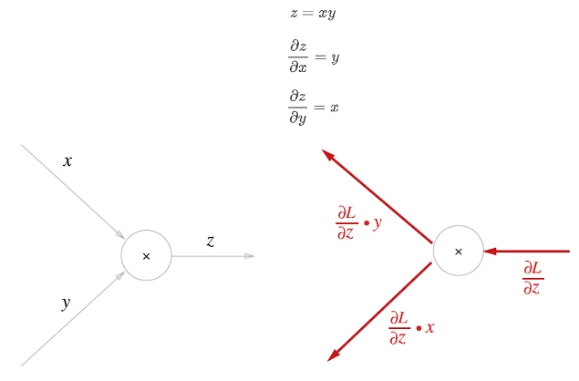

### 코드실습


```python
snack = 100
snack_num = 2
tax = 1.1

class BackTest :
    def __init__(self) :
        self.x = None
        self.y = None
    def forward(self, x, y) :
        self.x = x
        self.y = y
        out= x*y
        return out
    def backward(self, dout):
        dx = dout * self.y
        dy = dout * self.x
        return dx, dy

mul_snack_layer = BackTest() # 객체생성 -> 생성자(초기화) 함수 호출
mul_tax_layer = BackTest()
snack_price = mul_snack_layer.forward(snack, snack_num)
price = mul_tax_layer.forward(snack_price, tax)
print(snack_price, price)
# > 200 220.00000000000003

dprice = 1
dsnack_price, dtax = mul_tax_layer.backward(dprice)
dsnack, dsnack_num = mul_snack_layer.backward(dsnack_price)
print(dsnack_price, dtax)
print(dsnack, dsnack_num)
# > 1.1 200
# > 2.2 110.00000000000001
```


