[toc]

# Day54 Scikitlearn을 활용한 머신러닝(7)

- 오차함수 : `목표값 - 실제값` or `|목표값 - 실제값|` or `(목표값 - 실제값)^2`

  - 주로 `(목표값 - 실제값)^2`를 사용한다.
  - 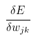 : 은닉계층 j와 출력계층 k 사이에 존재하는 가중치의 변화에 따른 E의 변화

  - 오차함수? n개의 노드에 대한 오차의 제곱의 합
  - 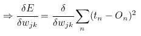
  - 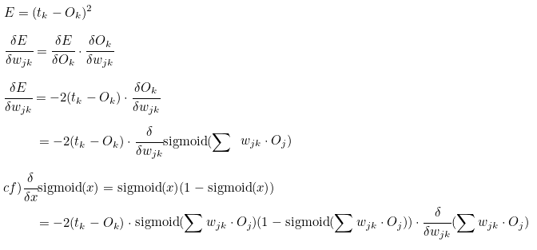

- 입력계층(i)과 은닉계층(j) 사이의 가중치에 대한 오차함수의 가중치

  - 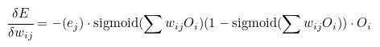
  - e_j 는 오차값

- 가중치 업데이터

  - 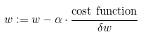
  - 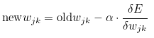
  - alpha는 학습율을 의미

# 신경망 구현

1. 초기화(입력, 은닉, 출력 계층의 노드의 수 결정)
2. 학습(가중치 업데이트)
3. 질의(입력 -> 연산 -> 출력 노드에 전달)


- 신경망 구현에 사용할 함수 사용 예시

```python
import numpy as np

print(np.random.rand(3))
print(np.random.rand(3,3)) # 0 ~ 1 사이
# > [0.46504749 0.78560589 0.50718132]
# > [[0.89326589 0.08224787 0.86393101]
# >  [0.5066614  0.2745761  0.4567312 ]
# >  [0.82155143 0.93179975 0.55781287]]

np.random.normal(0,2) # 정규분포를 따르는 난수 발생
# > 1.919712790670865
```

```python
print(np.array([1,2,3]))
print(np.array([1,2,3.0]))
print(np.array([[1,2],[3,4]]))
print(np.array([1,2,3,4], ndmin=2)) # ndmin : 차원지정
# > [1 2 3]
# > [1. 2. 3.]
# > [[1 2]
# >  [3 4]]
# > [[1 2 3 4]]
```

- 신경망 구현

```python
import scipy

class neuralNetwork :
    # 신경망 초기화 기능
    def __init__(self, input_nodes, hidden_nodes, output_nodes, learning_rate) :
        self.inodes = input_nodes
        self.hnodes = hidden_nodes
        self.onodes = output_nodes
        self.lr = learning_rate
        # 가중치는 행렬로 표현
        # 입력/은닉 가중치 행렬 형식 :
        # (은닉노드 * 입력노드)
        # 은닉/출력 가중치 행렬 형식 :
        # (출력노드 * 은닉노드)
        self.wih = np.random.normal(0.0,
                                    pow(self.hnodes, -0.5), 
                                    (self.hnodes, self.inodes))
        # normal(평균, 표준편차, 개수)
        self.who = np.random.normal(0.0,
                                    pow(self.onodes, -0.5), 
                                    (self.onodes, self.hnodes))
        # active function
        # scipy.sepcial.expit() : sigmoid 함수
        self.activation_function = lambda x : scipy.special.expit(x)
        pass
    
    # 신경망 학습 기능(2단계)
    # 1단계(forward propagation) : 입력 데이터에 대해 계산(query)
    # 2단계(backward propagation) : 예측값과 실제값의 차이를 계산 -> 가중치 업데이트 단계
    def train(self, inputs_list, targets_list) :
        inputs = np.array(inputs_list, ndmin=2).T
        targets = np.array(targets_list, ndmin=2).T
        
        # 은닉계층으로 들어오는 신호를 계산
        hidden_inputs = np.dot(self.wih, inputs)
        # 은닉계층에서 나가는 신호 계산
        hidden_outputs = self.activation_function(hidden_inputs)
        # 출력계층으로 들어오는 신호를 계산
        final_inputs = np.dot(self.who, hidden_outputs)
        # 출력계층에서 나가는 신호 계산
        final_outputs = self.activation_function(final_inputs)
        
        # 오차 = 실제값-예측값
        output_errors = targets - final_outputs
        
        # 은닉계층 노드에 대한 역전파된 오차
        # 은닉계층의 오차는 가중치에 의해 나뉜 출력계층의 오차들을 재조합하여 계산
        hidden_errors = np.dot(self.who.T, output_errors)
        # 은닉 계층과 출력 계층 간의 가중치 업데이트(who)
        self.who += self.lr * np.dot((output_errors * final_outputs * (1.0 - final_outputs)), np.transpose(hidden_outputs))
        # 입력 계층과 은닉 계층 간의 가중치 업데이트(wih)
        self.wih += self.lr * np.dot((hidden_errors * hidden_outputs * (1.0 - hidden_outputs)), np.transpose(inputs))
        
        pass
    
    # 신경망의 질의 기능 : 신경망으로 들어오는 입력을 받아 출력을 반환
    def query(self, inputs_list) :
        # 입력리스트를 2차원 행렬로 변환
        inputs = np.array(inputs_list, ndmin=2).T
        # 은닉계층으로 들어오는 신호를 계산
        hidden_inputs = np.dot(self.wih, inputs)
        # 은닉계층에서 나가는 신호 계산
        hidden_outputs = self.activation_function(hidden_inputs)
        # 출력계층으로 들어오는 신호를 계산
        final_inputs = np.dot(self.who, hidden_outputs)
        # 출력계층에서 나가는 신호 계산
        final_outputs = self.activation_function(final_inputs)
        
        return final_outputs
```

```python
# 입력, 은닉, 출력 노드 수
input_nodes = 3
hidden_nodes = 3
output_nodes = 3
# 학습율 정의
learning_rate = 0.3

# 신경망 클래스 객체 생성
n = neuralNetwork(input_nodes, hidden_nodes, output_nodes, learning_rate)
n.query([1.0, 0.5, -1.5])
# > array([[0.60730535],
# >        [0.37515114],
# >        [0.5989398 ]])
```

## train data(mnist)

```python
data_file = open("../data_for_analysis/mnist_train_100.csv", "r")
data_list = data_file.readlines()
data_list
```

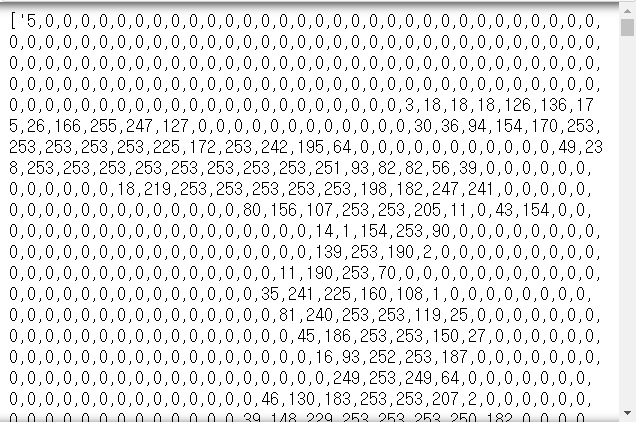

```python
len(data_list)
# > 100

data_list[0]
# > '5,0,0,0,0,0,0,0,0,0,0,0,0,0,0,0,0,0,0,0,0,0,0,0,0,0,0,0,0,0,0,0,0,0,0,0,0,0,0,0,0,0,0,0,0,0,0,0,0,0,0,0,0,0,0,0,0,0,0,0,0,0,0,0,0,0,0,0,0,0,0,0,0,0,0,0,0,0,0,0,0,0,0,0,0,0,0,0,0,0,0,0,0,0,0,0,0,0,0,0,0,0,0,0,0,0,0,0,0,0,0,0,0,0,0,0,0,0,0,0,0,0,0,0,0,0,0,0,0,0,0,0,0,0,0,0,0,0,0,0,0,0,0,0,0,0,0,0,0,0,0,0,0,3,18,18,18,126,136,175,26,166,255,247,127,0,0,0,0,0,0,0,0,0,0,0,0,30,36,94,154,170,253,253,253,253,253,225,172,253,242,195,64,0,0,0,0,0,0,0,0,0,0,0,49,238,253,253,253,253,253,253,253,253,251,93,82,82,56,39,0,0,0,0,0,0,0,0,0,0,0,0,18,219,253,253,253,253,253,198,182,247,241,0,0,0,0,0,0,0,0,0,0,0,0,0,0,0,0,0,0,80,156,107,253,253,205,11,0,43,154,0,0,0,0,0,0,0,0,0,0,0,0,0,0,0,0,0,0,0,14,1,154,253,90,0,0,0,0,0,0,0,0,0,0,0,0,0,0,0,0,0,0,0,0,0,0,0,0,0,139,253,190,2,0,0,0,0,0,0,0,0,0,0,0,0,0,0,0,0,0,0,0,0,0,0,0,0,11,190,253,70,0,0,0,0,0,0,0,0,0,0,0,0,0,0,0,0,0,0,0,0,0,0,0,0,0,35,241,225,160,108,1,0,0,0,0,0,0,0,0,0,0,0,0,0,0,0,0,0,0,0,0,0,0,0,81,240,253,253,119,25,0,0,0,0,0,0,0,0,0,0,0,0,0,0,0,0,0,0,0,0,0,0,0,45,186,253,253,150,27,0,0,0,0,0,0,0,0,0,0,0,0,0,0,0,0,0,0,0,0,0,0,0,16,93,252,253,187,0,0,0,0,0,0,0,0,0,0,0,0,0,0,0,0,0,0,0,0,0,0,0,0,0,249,253,249,64,0,0,0,0,0,0,0,0,0,0,0,0,0,0,0,0,0,0,0,0,0,46,130,183,253,253,207,2,0,0,0,0,0,0,0,0,0,0,0,0,0,0,0,0,0,0,0,39,148,229,253,253,253,250,182,0,0,0,0,0,0,0,0,0,0,0,0,0,0,0,0,0,0,24,114,221,253,253,253,253,201,78,0,0,0,0,0,0,0,0,0,0,0,0,0,0,0,0,0,23,66,213,253,253,253,253,198,81,2,0,0,0,0,0,0,0,0,0,0,0,0,0,0,0,0,18,171,219,253,253,253,253,195,80,9,0,0,0,0,0,0,0,0,0,0,0,0,0,0,0,0,55,172,226,253,253,253,253,244,133,11,0,0,0,0,0,0,0,0,0,0,0,0,0,0,0,0,0,0,136,253,253,253,212,135,132,16,0,0,0,0,0,0,0,0,0,0,0,0,0,0,0,0,0,0,0,0,0,0,0,0,0,0,0,0,0,0,0,0,0,0,0,0,0,0,0,0,0,0,0,0,0,0,0,0,0,0,0,0,0,0,0,0,0,0,0,0,0,0,0,0,0,0,0,0,0,0,0,0,0,0,0,0,0,0,0,0,0,0,0,0,0,0,0,0,0,0,0,0,0,0,0,0,0,0,0,0\n'

all_values = data_list[0].split(',')
all_values
```

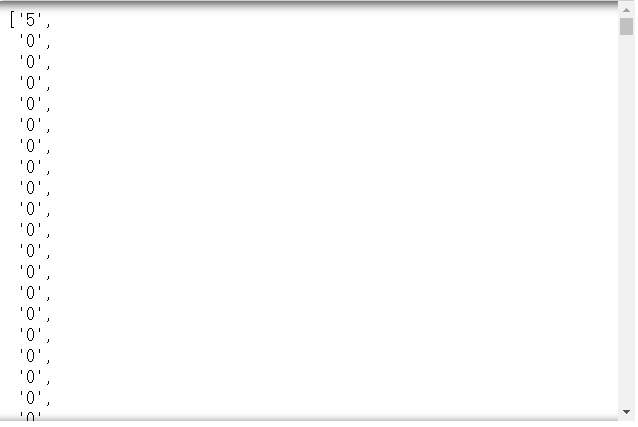

```python
type(all_values) # 784 => array(28,28)
# > list

all_values[1:]
```

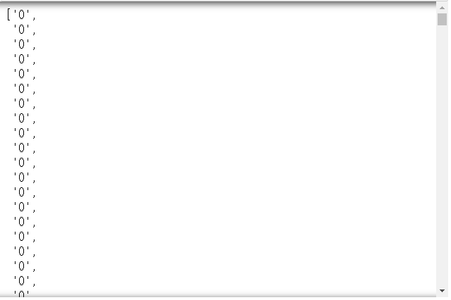

```python
# asfarray : 문자로 된 숫자 -> 실수로 변환
np.asfarray(all_values[1:])
```

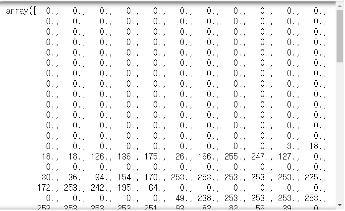

```python
image_array = np.asfarray(all_values[1:]).reshape(28,-1)
image_array
```

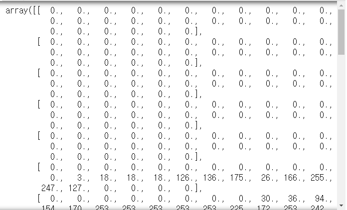

```python
import matplotlib.pyplot as plt

plt.imshow(image_array)
```

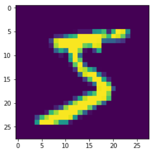

```python
plt.imshow(image_array, cmap="Greys", interpolation="None")
```

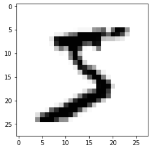

```python
# 0~255 -> 0.01~1.0
# (0~255)/255 => (0~1)*0.99 => (0~0.99)+0.01 => (0.01~1.0)
scaled_input = (np.asfarray(all_values[1:])/255*0.99)+0.01
scaled_input
```

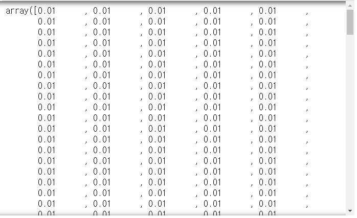

| 레이블 | 5에 대한 결과 |
| ------ | ------------- |
| 0      | 0.00          |
| 1      | 0.01          |
| ...    | ...           |
| 5      | 0.99          |
| ...    | ...           |
| 9      | 0.00          |

## 신경망 적용

### 학습

```python
onodes = 10 # 출력노드 종류가 10가지
targets = np.zeros(onodes)+0.01
targets[int(all_values[0])] = 0.99
targets
# > array([0.01, 0.01, 0.01, 0.01, 0.01, 0.99, 0.01, 0.01, 0.01, 0.01])
```

```python
# 입력, 은닉, 출력 노드의 수
input_nodes = 784 # column의 수
hidden_nodes = 100
output_nodes = 10 # 0~9

# 학습률 0.3
learning_rate = 0.3

# 신경망 객체 생성
n = neuralNetwork(input_nodes, hidden_nodes, output_nodes, learning_rate)

# mnist train data 불러오기
training_data_file = open("../data_for_analysis/mnist_train_100.csv", "r")
training_data_list = training_data_file.readlines()
training_data_file.close() # 메모리를 위하여 사용안할 경우 닫기

# 신경망 학습
for record in training_data_list :
    all_values = record.split(',')
    # 0.01~1.0으로 스케일링
    inputs = (np.asfarray(all_values[1:])/255*0.99) + 0.01
    # 결과값 생성
    targets = np.zeros(output_nodes) + 0.01
    targets[int(all_values[0])] = 0.99
    n.train(inputs, targets)
```

### test data

```python
test_data_file = open("../data_for_analysis/mnist_test_10.csv", "r")
test_data_list = test_data_file.readlines()
test_data_file.close()

len(test_data_list)
# > 10
```

#### 일부

```python
all_values = test_data_list[0].split(",")
all_values[0] # 첫번째 test data 정답 : 7
# > '7'

image_array = np.asfarray(all_values[1:]).reshape(28,28)
plt.imshow(image_array, cmap="Greys")
```

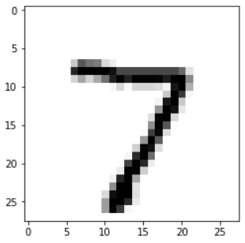

```python
outputs = n.query((np.asfarray(all_values[1:])/255*0.99)+0.01)
outputs
# > array([[0.02541073],
# >        [0.00580606],
# >        [0.02507519],
# >        [0.08700936],
# >        [0.08196167],
# >        [0.03327376],
# >        [0.00396735],
# >        [0.92362061],
# >        [0.06265676],
# >        [0.04109658]])

label = np.argmax(outputs)
print(label, "my network's answer")
# > 7 my network's answer
```

#### 전체

```python
score_card = []

for record in test_data_list :
    all_values = record.split(",")
    # 정답
    correct_label = int(all_values[0])
    print(correct_label, ": correct_label")
    
    outputs = n.query((np.asfarray(all_values[1:])/255*0.99)+0.01)
    label = np.argmax(outputs)
    print(label, ": my network's answer")
    
    if (label == correct_label) :
        score_card.append(1)
    else :
        score_card.append(0)

scorecard_array = np.asarray(score_card)
print(scorecard_array.sum()/scorecard_array.size)
# > 7 : correct_label
# > 7 : my network's answer
# > 2 : correct_label
# > 8 : my network's answer
# > 1 : correct_label
# > 1 : my network's answer
# > 0 : correct_label
# > 0 : my network's answer
# > 4 : correct_label
# > 4 : my network's answer
# > 1 : correct_label
# > 1 : my network's answer
# > 4 : correct_label
# > 7 : my network's answer
# > 9 : correct_label
# > 4 : my network's answer
# > 5 : correct_label
# > 6 : my network's answer
# > 9 : correct_label
# > 7 : my network's answer
# > 0.5
```

#### epochs 증가

```python
epochs = 10
for e in range(epochs) :
    # 신경망 학습
    for record in training_data_list :
        all_values = record.split(',')
        # 0.01~1.0으로 스케일링
        inputs = (np.asfarray(all_values[1:])/255*0.99) + 0.01
        # 결과값 생성
        targets = np.zeros(output_nodes) + 0.01
        targets[int(all_values[0])] = 0.99
        n.train(inputs, targets)
```

```python
score_card = []

for record in test_data_list :
    all_values = record.split(",")
    # 정답
    correct_label = int(all_values[0])
    print(correct_label, ": correct_label")
    
    outputs = n.query((np.asfarray(all_values[1:])/255*0.99)+0.01)
    label = np.argmax(outputs)
    print(label, ": my network's answer")
    
    if (label == correct_label) :
        score_card.append(1)
    else :
        score_card.append(0)

scorecard_array = np.asarray(score_card)
print(scorecard_array.sum()/scorecard_array.size)
# > 7 : correct_label
# > 7 : my network's answer
# > 2 : correct_label
# > 2 : my network's answer
# > 1 : correct_label
# > 1 : my network's answer
# > 0 : correct_label
# > 0 : my network's answer
# > 4 : correct_label
# > 4 : my network's answer
# > 1 : correct_label
# > 1 : my network's answer
# > 4 : correct_label
# > 9 : my network's answer
# > 9 : correct_label
# > 4 : my network's answer
# > 5 : correct_label
# > 1 : my network's answer
# > 9 : correct_label
# > 9 : my network's answer
# > 0.7
```

# 연습문제

- 데이터가 많은 mnist 데이터를 이용하여 학습하고, epochs에 따른 정확도 그래프 그리기

```python
train_file = open("../data_for_analysis/mnist-in-csv/mnist_train.csv", "r")
train_list = train_file.readlines()
train_file.close()
train_list = train_list[1:]

test_file = open("../data_for_analysis/mnist-in-csv/mnist_test.csv", "r")
test_list = test_file.readlines()
test_file.close()
test_list = test_list[1:]

input_nodes = 784
hidden_nodes = 100
output_nodes = 10

learning_rate = 0.3
```

```python
practice = neuralNetwork(input_nodes, hidden_nodes, output_nodes, learning_rate)

epochs = 100
result = []

for _ in range(epochs) :
    for record in train_list :
        all_values = record.split(',')
        inputs = np.asfarray(all_values[1:])/255*0.99 + 0.01
        
        targets = np.zeros(output_nodes) + 0.01
        targets[int(all_values[0])] = 0.99
        
        practice.train(inputs, targets)
        
    score_card = []
    
    for record in test_list :
        all_values = record.split(',')
        
        correct_label = int(all_values[0])
        
        outputs = practice.query(np.asfarray(all_values[1:])/255*0.99 + 0.01)
        label = np.argmax(outputs)
        
        if (label == correct_label) : 
            score_card.append(1)
        else :
            score_card.append(0)
    
    scorecard_array = np.asarray(score_card)
    result.append(scorecard_array.sum()/scorecard_array.size)
```

```python
plt.plot(result)
```

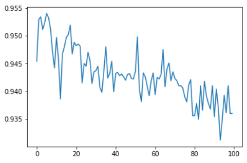