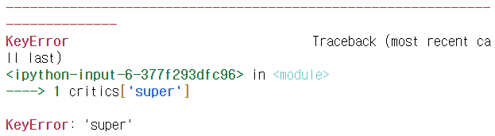
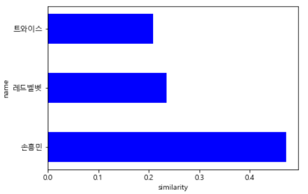
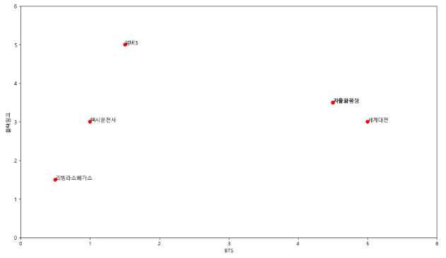
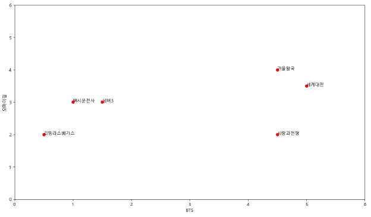
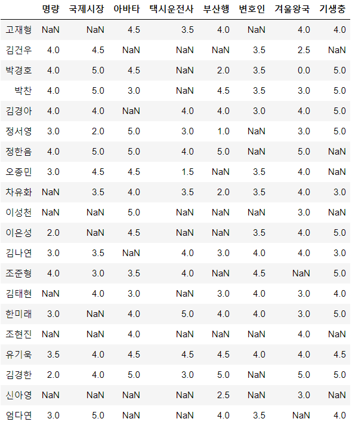
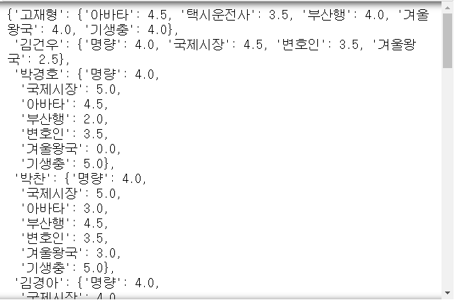

[toc]

# Day56 Scikitlearn을 활용한 머신러닝(8)

# 추천시스템

사용자의 취향을 파악하는 시스템

- 머신러닝 기반
  - 컨텐츠 기반
    - 넷플렉스 이후 사용되기 시작함
  - 협업 기반
    - 메모리 기반(KNN 기반)
      - 사용자 기반
        - 비슷한 사용자(나이, 성별 등등)들을 찾아 어떤 영화를 보는지
      - 아이템 기반
        - 어떤 영화를 본 관객들이 또 다른 어떤 영화를 보는지
    - 잠재요인(latent factor)
      - 행렬 분해 기법 사용
- 딥러닝 기반

## 컨텐츠 기반 필터링

- 사용자 : A(a), B(b), C(b)
- 영화 : a(로맨틱), b(스릴러), c(로맨틱)
- => 사용자 A에게 c를 추천해 줌
  - or 영화감독 정보가 있을 경우, 같은 감독의 작품을 추천해 줌

## 협업 기반 필터링

|          | 영화 1 | 영화 2   | 영화 3 | 영화 4   |
| -------- | ------ | -------- | ------ | -------- |
| 사용자 1 | 4      | ?(3예상) | 3      | ?(5예상) |
| 사용자 2 | 3      | 2        | ?      | 5        |
| 사용자 3 | ?      | 3        | 2      | 2        |

- 사용자 1에게 예상 평점이 더 높은 영화 4 추천
- 사용자 - 아이템 평점 행렬을 구성하여 추천시스템 구성
  - raw data를 위와 같은 행렬로 재구조화를 해야한다.(pandas.pivot_table)

### 사용자 기반 협업 필터링(user-item matrix)

- 주로 사용

|        | A    | B    | C    | D    | E    |
| ------ | ---- | ---- | ---- | ---- | ---- |
| User 1 | 3    | 4    | 4    |      | 1    |
| User 2 | 4    | 4    | 4    | 3    |      |
| User 3 | 1    | 1    | 2    | 5    |      |

- User 1과 User 2는 A~C의 평점이 비슷 => 비슷한 사람

### 아이템 기반 협업 필터링(item-user matrix)

|      | User 1 | User 2 | User 3 | User 4 | User 5 |
| ---- | ------ | ------ | ------ | ------ | ------ |
| A    | 5      | 4      | 4      |        | 5      |
| B    | 4      | 4      | 4      | 5      |        |
| C    | 1      | 1      | 2      | 3      |        |

- item A와 item B는 유사하다(평점 빈도가 비슷하므로)
  - => User 4에게 A를 추천, User 5에게 B를 추천

### 구현해보기

```python
import pandas as pd
import numpy as np

critics={
    'BTS':{'암수살인':5, '바울':4, '할로윈':1.5},
    '손흥민':{'바울':5, '할로윈':2},
    '레드벨벳':{'암수살인':2.5, '바울':2, '할로윈':1},
    '트와이스':{'암수살인':3.5, '바울':4, '할로윈':5}
}
critics
# > {'BTS': {'암수살인': 5, '바울': 4, '할로윈': 1.5},
# >  '손흥민': {'바울': 5, '할로윈': 2},
# >  '레드벨벳': {'암수살인': 2.5, '바울': 2, '할로윈': 1},
# >  '트와이스': {'암수살인': 3.5, '바울': 4, '할로윈': 5}}
```

```python
critics['BTS']
# > {'암수살인': 5, '바울': 4, '할로윈': 1.5}

critics.get('BTS')
# > {'암수살인': 5, '바울': 4, '할로윈': 1.5}

print(critics.get('super'))
# > None

critics['super']
```



```python
critics.get('BTS').get('바울')
# > 4
```

#### 피타고라스 거리

```python
from math import sqrt

pow(3,2)
# > 9

pow(1,2)
# > 1

pow(3,2) + pow(1,2)
# > 10

sqrt(pow(3,2) + pow(1,2))
# > 3.1622776601683795
```
```python
def sim(i,j) :# i : x좌표 거리, j : y좌표 거리
    return sqrt(pow(i,2) + pow(j,2))

v1 = critics['손흥민']['바울'] - critics['레드벨벳']['바울']
v2 = critics['손흥민']['할로윈'] - critics['레드벨벳']['할로윈']
print(v1, v2)
# > 3 1

print(sim(v1, v2))
# > 3.1622776601683795
```

#### 손흥민을 기준으로 다른 사용자와의 거리 구하기

```python
for i in critics :
    if i != '손흥민' :
        d1 = critics.get('손흥민').get('바울') - critics.get(i).get('바울')
        d2 = critics.get('손흥민').get('할로윈') - critics.get(i).get('할로윈')
        print(i, '와의 거리 :', sim(d1, d2))
# > BTS 와의 거리 : 1.118033988749895
# > 레드벨벳 와의 거리 : 3.1622776601683795
# > 트와이스 와의 거리 : 3.1622776601683795

for i in critics :
    if i != '손흥민' :
        d1 = critics.get('손흥민').get('바울') - critics.get(i).get('바울')
        d2 = critics.get('손흥민').get('할로윈') - critics.get(i).get('할로윈')
        # 0 <= 유사도 <= 1
        print(i, "와의 유사도 :", 1/(sim(d1, d2) + 1))
# > BTS 와의 유사도 : 0.4721359549995794
# > 레드벨벳 와의 유사도 : 0.2402530733520421
# > 트와이스 와의 유사도 : 0.2402530733520421
```

#### 유클리디안 거리

- 다차원 공간에서 두 점 사이의 거리

```python
def sim_distance(data, name1, name2) :
    movie = list(set(data.get(name1)) & set(data.get(name2)))
    d = list()
    
    for i in movie :
        d.append(pow(data.get(name1).get(i) - data.get(name2).get(i), 2))
    
    return sqrt(sum(d))
print(sim_distance(critics, 'BTS', '트와이스'))
# > 3.8078865529319543
```

```python
def sim_distance(data, name1, name2) :
    s = 0
    for i in data[name1] :
        if i in data[name2] :
            s += pow(data[name1][i] - data[name2][i], 2)
    return 1 / (sqrt(s)+1)
print(sim_distance(critics, 'BTS', '트와이스'))
# > 0.20799159651347807

print(sim_distance(critics, 'BTS', '손흥민'))
# > 0.4721359549995794

print(sim_distance(critics, 'BTS', '레드벨벳'))
# > 0.23582845781094
```

#### top_match() 생성

- top_match(영화평점데이터, 기준관객, 등수, 유사도함수)

```python
def top_match(data, name, rank=2, simf=sim_distance) :
    # sim_distance함수를 simf라는 이름으로 사용하겠다.
    sim_list = list()
    for i in data :
        if name != i : # BTS(자기자신)을 제외
            sim_list.append((simf(data, name, i), i))
    sim_list.sort() # 오름차순
    sim_list.reverse() # 역순
    # => 내림차순
    return sim_list[:rank]

# critics에서 BTS와 공통으로 본 영화 중에서, 가장 유사하게 평점을 준 관객 2명 출력    
print(top_match(critics, 'BTS'))
# > [(0.4721359549995794, '손흥민'), (0.23582845781094, '레드벨벳')]

print(top_match(critics, 'BTS', 1))
# > [(0.4721359549995794, '손흥민')]

print(top_match(critics, 'BTS', 3))
# > [(0.4721359549995794, '손흥민'), (0.23582845781094, '레드벨벳'), (0.20799159651347807, '트와이스')]
```

#### bar 그래프

```python
import matplotlib.pyplot as plt

# 한글깨짐 방지 코드
import matplotlib
from matplotlib import font_manager, rc
import platform
if platform.system()=="Windows":
    font_name=font_manager.FontProperties(fname="c:/Windows/Fonts/malgun.ttf").get_name()
    rc('font', family=font_name)
matplotlib.rcParams['axes.unicode_minus']=False

import warnings
warnings.filterwarnings("ignore")
```

```python
def myBar(data, lab) :
    pos = range(len(data))
    # 시각화
    plt.barh(pos, data, height=0.5, color="b")
    plt.yticks(pos, lab)
    plt.xlabel('similarity')
    plt.ylabel('name')
    plt.show()
    
li = top_match(critics, 'BTS', 3)
scoreList = []
nameList = []
for i in li :
    scoreList.append(i[0])
    nameList.append(i[1])

myBar(scoreList, nameList)
```



#### scatter plot

```python
critics = {
    '레드벨벳': {
        '택시운전사': 2.5,
        '겨울왕국': 3.5,
        '리빙라스베가스': 3.0,
        '넘버3': 3.5,
        '사랑과전쟁': 2.5,
        '세계대전': 3.0,
    },
    'BTS': {
        '택시운전사': 1.0,
        '겨울왕국': 4.5,
        '리빙라스베가스': 0.5,
        '넘버3': 1.5,
        '사랑과전쟁': 4.5,
        '세계대전': 5.0,
    },
    '블랙핑크': {
        '택시운전사': 3.0,
        '겨울왕국': 3.5,
        '리빙라스베가스': 1.5,
        '넘버3': 5.0,
        '세계대전': 3.0,
        '사랑과전쟁': 3.5,
    },
    '소녀시대': {
        '택시운전사': 2.5,
        '겨울왕국': 3.0,
        '넘버3': 3.5,
        '세계대전': 4.0,
    },
    '마마무': {
        '겨울왕국': 3.5,
        '리빙라스베가스': 3.0,
        '세계대전': 4.5,
        '넘버3': 4.0,
        '사랑과전쟁': 2.5,
    },
    '오마이걸': {
        '택시운전사': 3.0,
        '겨울왕국': 4.0,
        '리빙라스베가스': 2.0,
        '넘버3': 3.0,
        '세계대전': 3.5,
        '사랑과전쟁': 2.0,
    },
    '모모랜드': {
        '택시운전사': 3.0,
        '겨울왕국': 4.0,
        '세계대전': 3.0,
        '넘버3': 5.0,
        '사랑과전쟁': 3.5,
    },
    '우주소녀': {'겨울왕국': 4.5, '사랑과전쟁': 1.0,
             '넘버3': 4.0},
}
```

```python
def scoreGraph(data, n1, n2) :
    # 스케터 플롯 출력
    plt.figure(figsize=(14,8))
    li1 = []
    li2 = []
    
    for i in data[n1] : # BTS가 본 영화중에
        if i in data[n2] : # 블랙핑크도 본 영화라면
            li1.append(data[n1][i])
            li2.append(data[n2][i])
            plt.text(data[n1][i], data[n2][i], i)
    plt.plot(li1, li2, 'ro')
    plt.xlabel(n1)
    plt.ylabel(n2)
    plt.axis([0, 6, 0, 6]) # x,y축 한번에 지정 가능
    plt.show()
    
scoreGraph(critics, "BTS", "블랙핑크")
```



```python
scoreGraph(critics, "BTS", "오마이걸")
```



#### 피어슨 상관계수 함수 생성

````python
def sim_pearson(data, n1, n2) :
    sumX = 0
    sumY = 0
    sumSqX = 0
    sumSqY = 0
    sumXY = 0
    cnt = 0 # 영화 개수
    for i in data[n1] :
        if i in data[n2] :
            sumX += data[n1][i]
            sumY += data[n2][i]
            sumSqX += pow(data[n1][i], 2)
            sumSqY += pow(data[n2][i], 2)
            sumXY += data[n1][i] * data[n2][i]
            cnt += 1
    
    return (sumXY - ((sumX*sumY)/cnt)) / sqrt((sumSqX - pow(sumX, 2)/cnt) * (sumSqY - pow(sumY, 2)/cnt))

sim_pearson(critics, "BTS", "오마이걸")
# > 0.41791069697885247
````

##### top_match() 함수 사용

```python
def top_match(data, name, rank=2, simf=sim_distance) :
    # sim_distance함수를 simf라는 이름으로 사용하겠다.
    simList = list()
    for i in data :
        if name != i : # BTS(자기자신)을 제외
            simList.append((simf(data, name, i), i))
    simList.sort() # 오름차순
    simList.reverse() # 역순
    # => 내림차순
    return simList[:rank]

# critics에서 BTS와 공통으로 본 영화 중에서, 상관계수가 가장 높은 5명을 추출    
print(top_match(critics, 'BTS', 5, sim_pearson))
# > [(0.5692099788303083, '소녀시대'), (0.41791069697885247, '오마이걸'), (0.21693045781865616, '블랙핑크'), (0.15430334996209194, '마마무'), (0.05477225575051661, '레드벨벳')]
```

#### 추천시스템

- 유사도 값에 대한 기준치를 충족한느 사람에 한해, 예상평점/추천영화를 구하는데 사용

1. 평점 추측
    - 유사도 \* 상대방의 영화평점
    - ex. 소녀시대가 3점 부여, BTS와 소녀시대가 90% 유사도
        - 3 \* 0.9 => 2.7점 줄것으로 예측
        - 모든 관객에 대해 평점 추측 => 총합
2. `추측평점 총합 / 유사도 총합` => 모든 사람을 고려했을 때 예상되는 평점
3. 예상되는 평점을 기준으로 예상되는 평점이 가장 높은 & 아직 보지 않은 영화를 추천

```python
def recommendation(data, person, simf=sim_pearson) :
    res = top_match(data, person, len(data))
    
    simSum = 0 # 상관계수(유사도)의 합
    score_dic = dict() # 상관계수의 총합을 저장하기 위한 dic
    sim_dic = {} # 유사도의 합을 저장하기 위한 dic
    myList = []
    
    for sim, name in res :
        if sim < 0 : continue
        for movie in data[name] : # name이 본 영화를
            if movie not in data[person] : # person이 보지 않았다면
                simSum += sim * data[name][movie]
                # dic에 없는 key를 {key : 0}으로 생성
                score_dic.setdefault(movie, 0)
                score_dic[movie] += simSum
                
                sim_dic.setdefault(movie, 0)
                sim_dic[movie] += sim
            simSum = 0 # 영화 변경 -> 0으로 초기화
    
    for key in score_dic :
        score_dic[key] = score_dic[key] / sim_dic[key] # 예상되는 평점
        myList.append((score_dic[key], key))
    
    myList.sort()
    myList.reverse()
    
    return myList

# 소녀시대가 안본 영화 중에서 가장 높은 예상평점을 갖는 영화 3편 출력
recommendation(critics, "소녀시대")
# > [(2.6297516115569555, '사랑과전쟁'), (2.2323640321235456, '리빙라스베가스')]
```

### cf. dict 연습

```python
# setdefault 연습
x = {'a':10, 'b':20}
x.setdefault('c')
x
# > {'a': 10, 'b': 20, 'c': None}

x.setdefault('d', 30)
x
# > {'a': 10, 'b': 20, 'c': None, 'd': 30}

x.update(a=50)
x
# > {'a': 50, 'b': 20, 'c': None, 'd': 30}

x.setdefault('a', 100)
x
# > {'a': 50, 'b': 20, 'c': None, 'd': 30}

x['a'] += 5
x
# > {'a': 55, 'b': 20, 'c': None, 'd': 30}
```

# 연습문제

1. 나와 가장 상관계수가 높게 나온 사람? 5명 출력
2. 내가 안본 영화 중에서 추천 점수가 가장 높은 순으로 영화제목과 예상 평점을 출력

```python
movie_df = pd.read_excel('../data_for_analysis/영화평점.xlsx', header=1, index_col=0)
movie_df
```



```python
movie = {}
for name in movie_df.index:
    movie[name] = dict(movie_df.loc[name])
    tmp = list()
    for i in movie[name] :
        if pd.isnull(movie[name][i]) :
            tmp.append(i)
    for i in tmp :
        movie[name].pop(i)
movie
```



## 1.

```python
def pearson_corr(data, n1, rank=5) :
    res = list()
    
    for name in data :
        sumX, sumY, sumXY, sumX2, sumY2, count = 0,0,0,0,0,0
        
        if name==n1 : continue
        for i in data[name] :
            if i in data[n1] :
                sumX += data[name][i]
                sumY += data[n1][i]
                sumXY += data[name][i] * data[n1][i]
                sumX2 += pow(data[name][i], 2)
                sumY2 += pow(data[n1][i], 2)
                count += 1
        r = (count*sumXY - sumX*sumY +10e-6) / sqrt((count*sumX2 - pow(sumX, 2) +10e-6)*(count*sumY2 - pow(sumY, 2) +10e-6))
        res.append((r, name))
    res.sort()
    res.reverse()
    
    return res[:rank]
    
pearson_corr(movie, "신아영")
# > [(1.0, '조현진'), (1.0, '조준형'), (1.0, '이은성'), (1.0, '이성천'), (1.0, '오종민')]
```

## 2.

```python
def recommend(data, n1) :
    correlation = pearson_corr(data, n1, len(data))
    
    score_dic = dict()
    sim_dic = dict()
    resList = list()
    
    for sim, name in correlation :
        if name == n1 : continue
        for m in data[name] :
            if m not in data[n1] :
                score_dic.setdefault(m, 0)
                score_dic[m] += sim * data[name][m]
                
                sim_dic.setdefault(m, 0)
                sim_dic[m] += sim
    
    for key in score_dic :
        resList.append((score_dic[key] / sim_dic[key], key))
    
    resList.sort()
    resList.reverse()
    
    return resList

recommend(movie, "신아영")
# > [(4.8294572207157085, '아바타'),
# >  (3.6659771464379327, '변호인'),
# >  (3.0079094596355174, '국제시장'),
# >  (2.772036047911085, '기생충'),
# >  (2.5053013780069895, '명량'),
# >  (2.1789536950656974, '택시운전사')]
```

