[toc]

# Day57 Scikitlearn을 활용한 머신러닝(9)

선형대수

- 선형함수의 성질

  1. `f(kp) = k*f(p)`
  2. `f(p+q) = f(p) + f(q)`

  - `y=ax`, 확대/축소, 회전 변환
    - 이차, 삼각, 로그, 지수 함수 : 비선형 함수
  - 선형함수는 행렬로 표현 가능

- 벡터

  - 두 벡터의 내적의 값이 0이 되면, 두 벡터는 직교한다.
  - 벡터  내적 성질
    - 자기 자신과의 내적은 (그 벡터의 크기)^2과 같다.
    - 두 벡터의 내적이 0이면, 두 벡터가 직교하거나 두 벡터의 각 크기의 곱이 0이다.
    - 두 벡터의 내적은 두 벡터의 각 크기 \* `cos(theta`) 이다.

- 행렬

  - 수를 직사각형 모양으로 배열한 것
  - 단위행렬
    - k 곱셈에 대한 항등원
    - 행렬의 곱셈에 대한 항등원(`I`, `E`)

- 고유값 , 고유벡터
  - $A\mathbb{v} = \lambda \mathbb{v}$를 만족하는 0이 아닌 열벡터 $\mathbb{v}$를 고유벡터, 상수 $\lambda$를 고유값이라 정의
  - 고유벡터란? 어떤 벡터에 선형변환을 취했을 때, 방향은 변하지 않고 크기만 변환되는 벡터를 의미
  - 고유값이란? 고유벡터가 변환되는 '크기'를 의미
  - 고유값과 고유벡터는 행렬에 따라 정의되는 값으로서 어떤 행렬은 이러한 고유값-고유벡터가 아예 존재하지 않을 수도 있고, 어떤 행렬은 하나만 존재하거나 또는 최대 n개까지 존재한다.


- 공분산행렬?
  - 구조적 측면? 각 feature의 변동이 얼마나 닮았나?
  - 수학적 의미? 선형 변환
- PCA(주성분 분석)
  - 공분산 행렬의 고유벡터와 고유값
  - PCA => 공분산 행렬의 고유벡터로 데이터를 projection 하는 것
  - 공분산 행렬
    - 공분산 행렬 원소`(X^T * X)_ij` : `i`번째 속성과 `j`번째 속성의 변동이 닯은 정도
    - 선형 변환

## 고유값, 고유벡터

```python
import pandas as pd
import numpy as np

df = pd.DataFrame(columns=['calory', 'breakfast', 'lunch', 'dinner', 'exercise', 'body_shape'])
df.loc[0] = [1200, 1, 0, 0, 2, 'Skinny']
df.loc[1] = [2800, 1, 1, 1, 1, 'Normal']
df.loc[2] = [3500, 2, 2, 1, 0, 'Fat']
df.loc[3] = [1400, 0, 1, 0, 3, 'Skinny']
df.loc[4] = [5000, 2, 2, 2, 0, 'Fat']
df.loc[5] = [1300, 0, 0, 1, 2, 'Skinny']
df.loc[6] = [3000, 1, 0, 1, 1, 'Normal']
df.loc[7] = [4000, 2, 2, 2, 0, 'Fat']
df.loc[8] = [2600, 0, 2, 0, 0, 'Normal']
df.loc[9] = [3000, 1, 2, 1, 1, 'Fat']

df
```

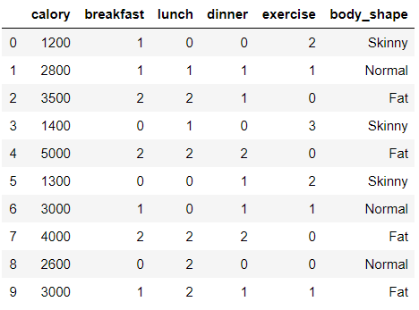

```python
from sklearn.preprocessing import StandardScaler

X = df[["calory", "breakfast", "lunch", "dinner", "exercise"]]
Y = df[["body_shape"]]

x_std = StandardScaler().fit_transform(X)
x_std
# > array([[-1.35205803,  0.        , -1.3764944 , -1.28571429,  1.        ],
# >        [ 0.01711466,  0.        , -0.22941573,  0.14285714,  0.        ],
# >        [ 0.61612771,  1.29099445,  0.91766294,  0.14285714, -1.        ],
# >        [-1.18091145, -1.29099445, -0.22941573, -1.28571429,  2.        ],
# >        [ 1.89972711,  1.29099445,  0.91766294,  1.57142857, -1.        ],
# >        [-1.26648474, -1.29099445, -1.3764944 ,  0.14285714,  1.        ],
# >        [ 0.18826125,  0.        , -1.3764944 ,  0.14285714,  0.        ],
# >        [ 1.04399418,  1.29099445,  0.91766294,  1.57142857, -1.        ],
# >        [-0.15403193, -1.29099445,  0.91766294, -1.28571429, -1.        ],
# >        [ 0.18826125,  0.        ,  0.91766294,  0.14285714,  0.        ]])

f = x_std.T
cov_matrix = np.cov(f)
cov_matrix
# > array([[ 1.11111111,  0.88379717,  0.76782385,  0.89376551, -0.93179808],
# >        [ 0.88379717,  1.11111111,  0.49362406,  0.81967902, -0.71721914],
# >        [ 0.76782385,  0.49362406,  1.11111111,  0.40056715, -0.76471911],
# >        [ 0.89376551,  0.81967902,  0.40056715,  1.11111111, -0.63492063],
# >        [-0.93179808, -0.71721914, -0.76471911, -0.63492063,  1.11111111]])
```

### np.linalg.eig() : eigen value, eigen vector 출력

```python
eig_vals, eig_vecs = np.linalg.eig(cov_matrix)

print("고유벡터 \n %s" %eig_vecs)
# > 고유벡터 
# >  [[ 0.508005    0.0169937  -0.84711404  0.11637853  0.10244985]
# >  [ 0.44660335  0.36890361  0.12808055 -0.63112016 -0.49973822]
# >  [ 0.38377913 -0.70804084  0.20681005 -0.40305226  0.38232213]
# >  [ 0.42845209  0.53194699  0.3694462   0.22228235  0.58954327]
# >  [-0.46002038  0.2816592  -0.29450345 -0.61341895  0.49601841]]

print("고유값 \n %s" %eig_vals)
# > 고유값 
# >  [4.0657343  0.8387565  0.07629538 0.27758568 0.2971837 ]
```

```python
eig_vals[0]/sum(eig_vals)
# > 0.7318321731427544
```

> 73% 데이터의 특성을 담는다
>
> 5차원 -> 1차원(eig_vals[0])축으로 차원축소를 하면 데이터 73%의 특성을 살린다.

- 천번째 고유벡터에 데이터를 정사영

```python
projected_x = x_std.dot(eig_vecs.T[0])
projected_x
# > array([-2.22600943, -0.0181432 ,  1.76296611, -2.73542407,  3.02711544,
# >        -2.14702579, -0.37142473,  2.59239883, -0.39347815,  0.50902498])
```

```python
x_std.shape
# > (10, 5)

eig_vecs.T[0].shape
# > (5,)
```

> 10행 1열 데이터 생성

## 시각화

```python
res = pd.DataFrame(projected_x, columns=["PC1"])
res
```

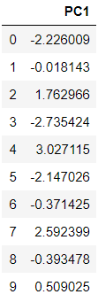

```python
res['yaxis'] = 0.0
res['label'] = Y
res
```

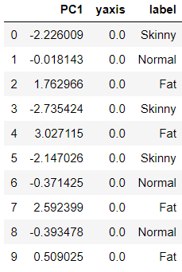

```python
import matplotlib.pyplot as plt
import seaborn as sns

sns.lmplot('PC1', 'yaxis', data=res, hue='label', fit_reg=False)
plt.title('PCA result')
```

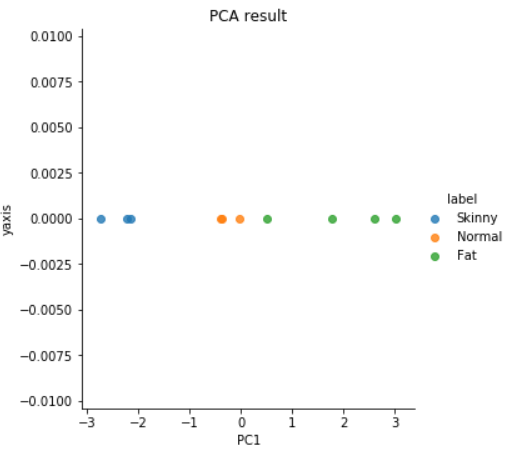

# 연습문제

1.userid가 1인 사람에게 추천하고자 하는 영화?
    - rating?
        - knn
    - 상관계수 => 유사한 사람 => 추천 점수

2. iris 데이터셋에서
    - 4차원 => 2차원 -> 1차원, 2차원 -> 2차원
    - 4차원 => 2차원으로 차원축소 => 시각화(꽃받침, 꽃잎)
    - \[꽃받침 너비, 길이, 꽃잎 너비, 길이 \]
    - \[5.1, 3.5, 1.4, 0.2\]
    - => \[0.7, 0.5\]

## 1.

### 데이터 불러오기 & 변형

```python
ratings_df = pd.read_csv('../data_for_analysis/movielens/ratings.csv')
ratings_df
```

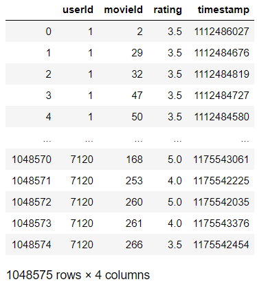

```python
movie_name = pd.read_csv('../data_for_analysis/movielens/movies.csv')
movie_name
```

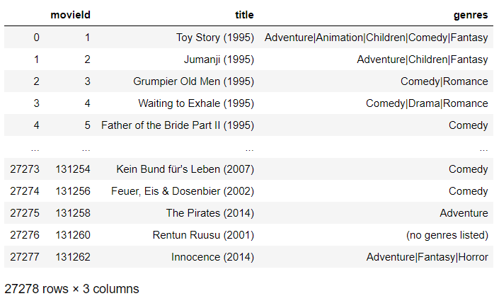

```python
ratings_movie = ratings_df.merge(movie_name, on='movieId')
ratings_movie
```

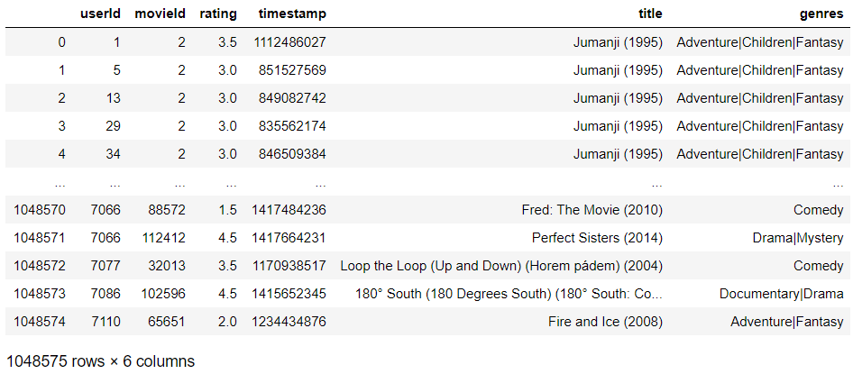

```python
ratings = dict()
for i in ratings_df.userId.unique():
    ratings[i] = dict(zip(ratings_movie[ratings_movie.userId == i]["title"], ratings_movie[ratings_movie.userId == i]["rating"]))

ratings
```

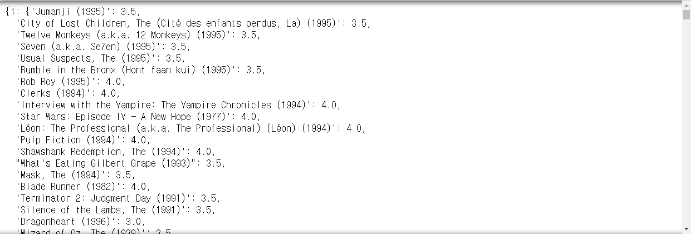

### 유클리디안 거리를 이용한 유사도

```python
from math import sqrt

def sim_distance(data, person, k=5) :
    res = list()
    for name in data :
        if name == person : continue
            
        squareSum = 0
        for m in data[name] :
            if m in data[person] :
                squareSum += pow(data[name][m] - data[person][m], 2)
        res.append((1/(sqrt(squareSum)+1), name))
        
    res.sort()
    res.reverse()
    
    return res[:k]
```

```python
sim_distance(ratings, 1, len(ratings))
```


```python
sim_distance(ratings, 1)
# > [(1.0, 7099), (1.0, 7096), (1.0, 7054), (1.0, 7027), (1.0, 7023)]
```

### pearson corrleation를 이용한 유사도

```python
def sim_pearson(data, person, rank=5) :
    res = list()
    for name in data :
        if name == person : continue
            
        sumX, sumY, sumXY, sumX2, sumY2, cnt = 0,0,0,0,0,0
        for i in data[name] :
            if i in data[person] :
                sumX += data[name][i]
                sumY += data[person][i]
                sumXY += data[name][i] * data[person][i]
                sumX2 += pow(data[name][i], 2)
                sumY2 += pow(data[person][i], 2)
                cnt += 1
            
        r = (cnt*sumXY - sumX*sumY) / sqrt((cnt*sumX2 - pow(sumX, 2)) * (cnt*sumY2 - pow(sumY, 2)) + 10e-6)
        res.append((r, name))
    
    res.sort()
    res.reverse()
    
    return res[:rank]
```

```python
t = sim_pearson(ratings, 1, len(ratings))
t[:5]
# > [(0.9999998611111399, 6310),
# >  (0.9999998185941538, 5943),
# >  (0.9999998000000601, 5630),
# >  (0.9999997530865112, 2195),
# >  (0.9999997530865112, 150)]

t[-5:]
# > [(-0.9999996875001465, 5025),
# >  (-0.9999996875001465, 1490),
# >  (-0.9999997530865112, 698),
# >  (-0.9999998347107848, 6557),
# >  (-0.9999999218750092, 525)]

sim_pearson(ratings, 1, 3)
# > [(0.9999998611111399, 6310),
# >  (0.9999998185941538, 5943),
# >  (0.9999998000000601, 5630)]
```

### 추천하는 영화 찾기

```python
def getRecommendation(data, person, k=3, sim_function=sim_pearson) :
    corrleation = sim_function(data, person, k)
    
    score_dic = dict()
    sim_dic = dict()
    resList = list()
    
    if sim_function == sim_pearson :
    for sim, name in corrleation :
        if name == person : continue
        for m in data[name] :
            if m not in data[person] :
                score_dic.setdefault(m, 0)
                score_dic[m] += sim * data[name][m]
                
                sim_dic.setdefault(m, 0)
                sim_dic[m] += sim
    
    for key in score_dic :
        resList.append((score_dic[key] / (sim_dic[key]), key))
        
    resList.sort()
    resList.reverse()
    
    return resList
```

```python
# 유클리디안 거리
getRecommendation(ratings, 1, sim_function=sim_distance)
```

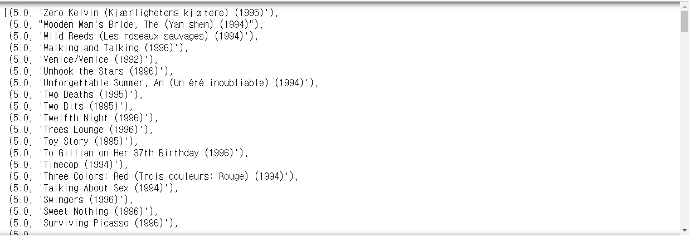

```python
# pearson corrleation
getRecommendation(ratings, 1, sim_function=sim_pearson)
```

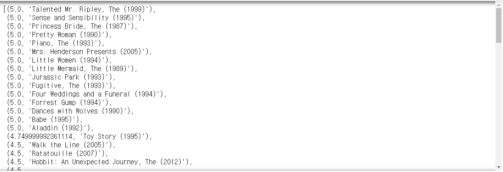

## 2.

```python
from sklearn import datasets

iris = datasets.load_iris()
iris
```

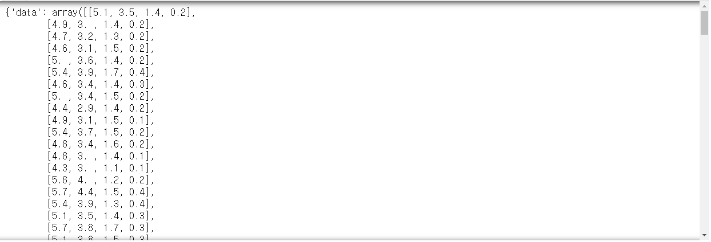

```python
iris.keys()
# > dict_keys(['data', 'target', 'target_names', 'DESCR', 'feature_names', 'filename'])

iris['target']
# > array([0, 0, 0, 0, 0, 0, 0, 0, 0, 0, 0, 0, 0, 0, 0, 0, 0, 0, 0, 0, 0, 0,
# >        0, 0, 0, 0, 0, 0, 0, 0, 0, 0, 0, 0, 0, 0, 0, 0, 0, 0, 0, 0, 0, 0,
# >        0, 0, 0, 0, 0, 0, 1, 1, 1, 1, 1, 1, 1, 1, 1, 1, 1, 1, 1, 1, 1, 1,
# >        1, 1, 1, 1, 1, 1, 1, 1, 1, 1, 1, 1, 1, 1, 1, 1, 1, 1, 1, 1, 1, 1,
# >        1, 1, 1, 1, 1, 1, 1, 1, 1, 1, 1, 1, 2, 2, 2, 2, 2, 2, 2, 2, 2, 2,
# >        2, 2, 2, 2, 2, 2, 2, 2, 2, 2, 2, 2, 2, 2, 2, 2, 2, 2, 2, 2, 2, 2,
# >        2, 2, 2, 2, 2, 2, 2, 2, 2, 2, 2, 2, 2, 2, 2, 2, 2, 2])

iris['target_names']
# > array(['setosa', 'versicolor', 'virginica'], dtype='<U10')

iris['feature_names']
# > ['sepal length (cm)',
# >  'sepal width (cm)',
# >  'petal length (cm)',
# >  'petal width (cm)']
```


### 정규화

```python
x_std = StandardScaler().fit_transform(iris['data'])
x_std
```

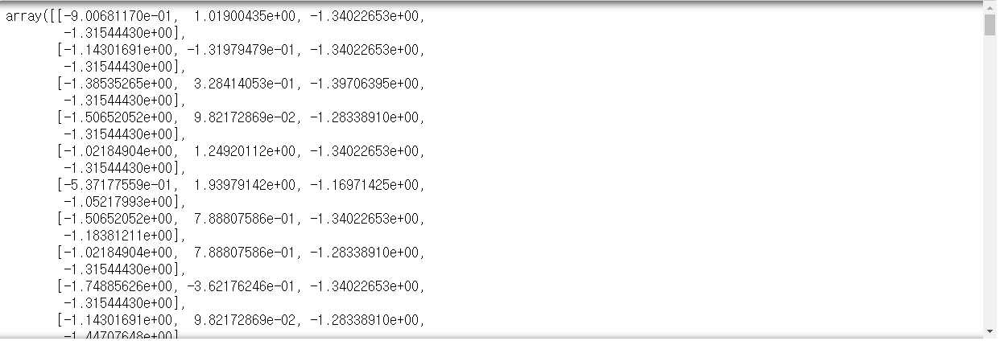

### covariance matrix

```python
cov_matrix = np.cov(x_std.T)
cov_matrix
# > array([[ 1.00671141, -0.11835884,  0.87760447,  0.82343066],
# >        [-0.11835884,  1.00671141, -0.43131554, -0.36858315],
# >        [ 0.87760447, -0.43131554,  1.00671141,  0.96932762],
# >        [ 0.82343066, -0.36858315,  0.96932762,  1.00671141]])
```

### 고유값, 고유벡터

```python
s_eig_value, s_eig_vector = np.linalg.eig(cov_matrix[:2, :2])

s_eig_value
# > array([0.88835257, 1.12507025])

s_eig_vector
# > array([[-0.70710678,  0.70710678],
# >        [-0.70710678, -0.70710678]])
```

```python
p_eig_value, p_eig_vector = np.linalg.eig(cov_matrix[2:, 2:])

p_eig_value
# > array([1.97603902, 0.03738379])

p_eig_vector
# > array([[ 0.70710678, -0.70710678],
# >        [ 0.70710678,  0.70710678]])
```

### 정사영

```python
projected_sepal = x_std.dot(np.concatenate((s_eig_vector.T[1], np.array([0,0]))))
projected_sepal
```

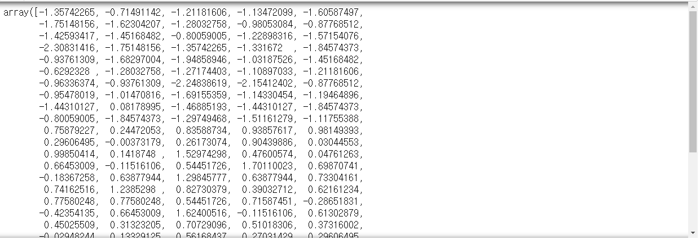

```python
projected_petal = x_std.dot(np.concatenate((np.array([0,0]), p_eig_vector.T[0])))
projected_petal
```

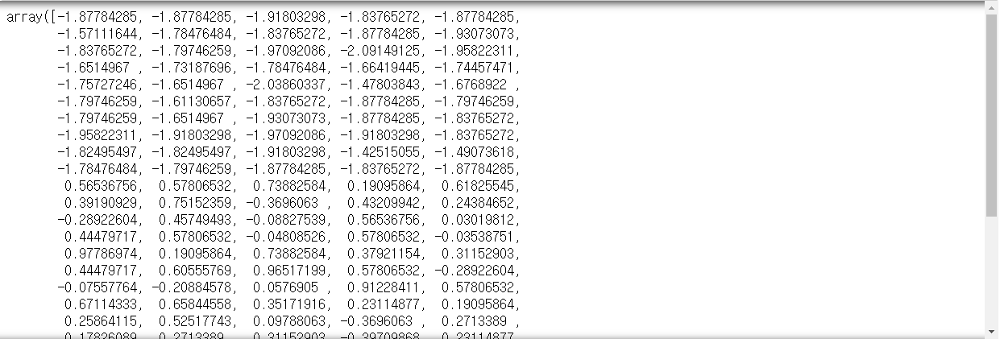

### 시각화

```python
res = pd.DataFrame(projected_sepal, columns=['sepal'])
res['petal'] = projected_petal
res['target'] = iris['target']
res['label'] = np.nan
res
```

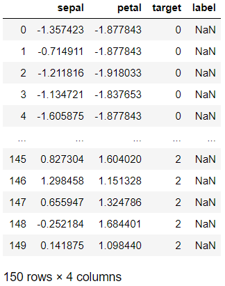

```python
for i in range(0,3) :
    res.label[res.target == i] = iris['target_names'][i]

res
```

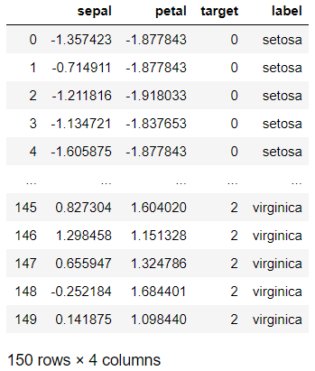

```python
import matplotlib.pyplot as plt
import seaborn as sns

sns.lmplot('sepal', 'petal', data=res, hue='label', fit_reg=False)
```

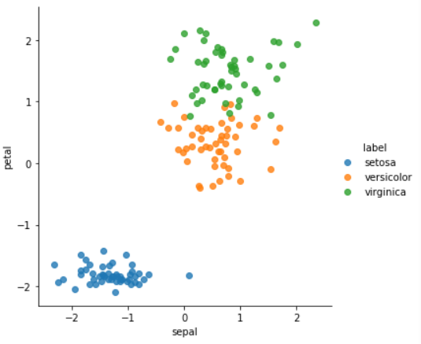