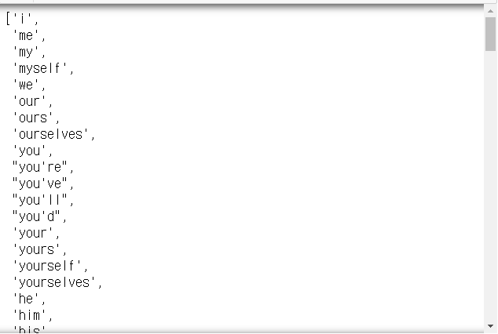
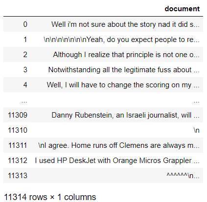
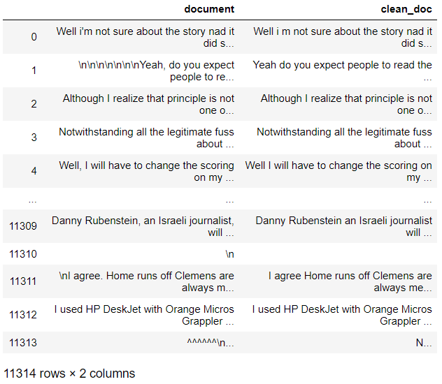
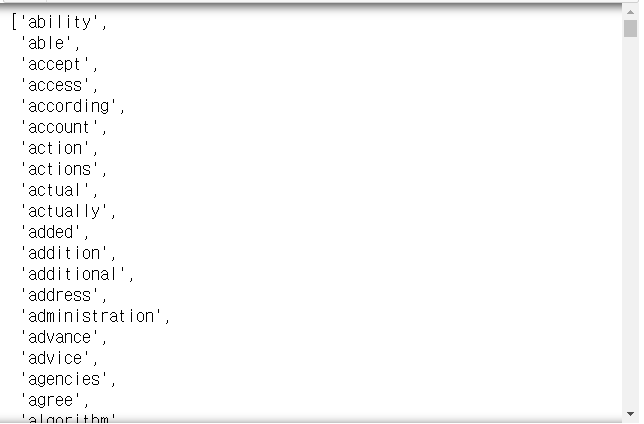

[toc]

# Day59 Scikitlearn을 활용한 머신러닝(11)

- 표제어(Lemmatization) 추출
  - 서로 형태는 다르지만, root 단어를 가지고 비교해서, 전체적으로 단어의 개수를 줄이자.
  - ex. am, are, is, was, were, ... => be(표제어)
- 형태소 : stem(어간, 단어의 의미), affix(접사, 단어의 부가적 의미)
  - 형태소 피싱 : 어간과 접사를 분리하는 작업
  - ex. dog(독립형태소)
    - dogs = dog(어간) + s(접사)

## 표제어 추출

- WordNetLemmatizer : NLTK 패키지에 있는 class로 표제어 추출 도구

```python
from nltk.stem import WordNetLemmatizer

wnl = WordNetLemmatizer()
wnl.lemmatize("watched")
# > 'watched'

wnl.lemmatize("watched", 'v')
# > 'watch'
```

> 품사정보를 알고 있어야 제대로 기능한다.

```python
wnl.lemmatize("has")
# > 'ha'

wnl.lemmatize("has", "v")
# > 'have'

wnl.lemmatize("dies", "v")
# > 'die'
```

## 어간 추출

```python
text = "Python is an interpreted, high-level, general-purpose programming language."

from nltk.stem import PorterStemmer
from nltk.tokenize import word_tokenize

words = word_tokenize(text)
print(words)
# > ['Python', 'is', 'an', 'interpreted', ',', 'high-level', ',', 'general-purpose', 'programming', 'language', '.']

ps = PorterStemmer()
print([ps.stem(w) for w in words])   
# > ['python', 'is', 'an', 'interpret', ',', 'high-level', ',', 'general-purpos', 'program', 'languag', '.']
```

```python
print(ps.stem("electricical"))
# > electric

print(ps.stem("formalize"))
# > formal
```

> 구글 : 마틴 포터 or 포터스태머 검색을 통해 어떻게 작동하는지 알아볼 수 있다.

```python
ps.stem("going")
# > 'go'

ps.stem("gone")
# > 'gone'
```

```python
from nltk.stem import LancasterStemmer

ls = LancasterStemmer()
ls.stem("going")
# > 'going'

ls.stem("gone")
# > 'gon'
```

## 불용어 : stopwords

```python
from nltk.corpus import stopwords
stopwords.words('english')
```



```python
len(stopwords.words('english'))
# > 179
```

```python
sw = stopwords.words('english')
ex = "Family is not an important thing. It's everything"
wt = word_tokenize(ex)

res =[]
for w in wt :
    if w not in sw :
        res.append(w)
print(wt)
print(res)
# > ['Family', 'is', 'not', 'an', 'important', 'thing', '.', 'It', "'s", 'everything']
# > ['Family', 'important', 'thing', '.', 'It', "'s", 'everything']
```

- 한국어 불용어 사전
  - www.ranks.nl/stopwords/korean

```python
ex = "최근 코로나19로 인한 감염으로 인해 확진자 및 사망자가 증가하고 있습니다. 코로나19를 이겨냅시다."
stop_words = "인한 증가 최근 및"
stop_words = stop_words.split(" ")
wt = word_tokenize(ex)
print(wt)
# > ['최근', '코로나19로', '인한', '감염으로', '인해', '확진자', '및', '사망자가', '증가하고', '있습니다', '.', '코로나19를', '이겨냅시다', '.']

res = []
for w in wt :
    if w not in stop_words :
        res.append(w)
print(res)
# > ['코로나19로', '감염으로', '인해', '확진자', '사망자가', '증가하고', '있습니다', '.', '코로나19를', '이겨냅시다', '.']
```

```python
text = "Python is an interpreted, high-level, general-purpose programming language. Created by Guido van Rossum and first released in 1991, Python's design philosophy emphasizes code readability with its notable use of significant whitespace. Its language constructs and object-oriented approach aim to help programmers write clear, logical code for small and large-scale projects."

from nltk.tokenize import sent_tokenize

text = sent_tokenize(text)
print(text)
# > ['Python is an interpreted, high-level, general-purpose programming language.', "Created by Guido van Rossum and first released in 1991, Python's design philosophy emphasizes code readability with its notable use of significant whitespace.", 'Its language constructs and object-oriented approach aim to help programmers write clear, logical code for small and large-scale projects.']
```

- 단어단위로 tokenize
  - 모든 단어를 소문자, 불용어 제거, 길이가 2이하면 제거

```python
res = []
for t in text :
    words = word_tokenize(t)
    for word in words :
        word = word.lower()
        if word not in sw :
            if len(word) > 2 :
                res.append(word)
print(res)
# > ['python', 'interpreted', 'high-level', 'general-purpose', 'programming', 'language', 'created', 'guido', 'van', 'rossum', 'first', 'released', '1991', 'python', 'design', 'philosophy', 'emphasizes', 'code', 'readability', 'notable', 'use', 'significant', 'whitespace', 'language', 'constructs', 'object-oriented', 'approach', 'aim', 'help', 'programmers', 'write', 'clear', 'logical', 'code', 'small', 'large-scale', 'projects']
```

- dictionary 형태로 만들기

```python
voc = dict()
for t in text :
    words = word_tokenize(t)
    for word in words :
        word = word.lower()
        if word not in sw :
            if len(word) > 2 :
                if word not in voc :
                    voc[word] = 0
                voc[word] += 1
print(voc)
# > {'python': 2, 'interpreted': 1, 'high-level': 1, 'general-purpose': 1, 'programming': 1, 'language': 2, 'created': 1, 'guido': 1, 'van': 1, 'rossum': 1, 'first': 1, 'released': 1, '1991': 1, 'design': 1, 'philosophy': 1, 'emphasizes': 1, 'code': 2, 'readability': 1, 'notable': 1, 'use': 1, 'significant': 1, 'whitespace': 1, 'constructs': 1, 'object-oriented': 1, 'approach': 1, 'aim': 1, 'help': 1, 'programmers': 1, 'write': 1, 'clear': 1, 'logical': 1, 'small': 1, 'large-scale': 1, 'projects': 1}
```

```python
voc.items()
# > dict_items([('python', 2), ('interpreted', 1), ('high-level', 1), ('general-purpose', 1), ('programming', 1), ('language', 2), ('created', 1), ('guido', 1), ('van', 1), ('rossum', 1), ('first', 1), ('released', 1), ('1991', 1), ('design', 1), ('philosophy', 1), ('emphasizes', 1), ('code', 2), ('readability', 1), ('notable', 1), ('use', 1), ('significant', 1), ('whitespace', 1), ('constructs', 1), ('object-oriented', 1), ('approach', 1), ('aim', 1), ('help', 1), ('programmers', 1), ('write', 1), ('clear', 1), ('logical', 1), ('small', 1), ('large-scale', 1), ('projects', 1)])

vs = sorted(voc.items(), key=lambda x : x[1], reverse=True)
print(vs)
# > [('python', 2), ('language', 2), ('code', 2), ('interpreted', 1), ('high-level', 1), ('general-purpose', 1), ('programming', 1), ('created', 1), ('guido', 1), ('van', 1), ('rossum', 1), ('first', 1), ('released', 1), ('1991', 1), ('design', 1), ('philosophy', 1), ('emphasizes', 1), ('readability', 1), ('notable', 1), ('use', 1), ('significant', 1), ('whitespace', 1), ('constructs', 1), ('object-oriented', 1), ('approach', 1), ('aim', 1), ('help', 1), ('programmers', 1), ('write', 1), ('clear', 1), ('logical', 1), ('small', 1), ('large-scale', 1), ('projects', 1)]
```

```python
wi = dict()
i = 0
for w, f in vs :
    if f > 1 :
        i += 1
        wi[w] = i # index 부여
print(wi)      
# > {'python': 1, 'language': 2, 'code': 3}

wi.items()
# > dict_items([('python', 1), ('language', 2), ('code', 3)])
```

```python
vocSize = 2 # 가장 많이 언급된 2개 단어만 추출
# 인덱스(index)가 3번 이상인 단어는 제거(1번, 2번)

# 단어의 인덱스가 vocSize를 초과하는 단어 추출
wordFreq = [w for w, i in wi.items() if i > vocSize]
print(wordFreq)
# > ['code']

for w in wordFreq :
    del wi[w]
wi
# > {'python': 1, 'language': 2}
```

## 문단과 문장으로 split

```python
sentences = list()
for t in text :
    words = word_tokenize(t)
    res = list()
    for word in words :
        word = word.lower()
        if word not in sw :
            if len(word) > 2 :
                res.append(word)
    sentences.append(res)
print(sentences)
# > [['python', 'interpreted', 'high-level', 'general-purpose', 'programming', 'language'], ['created', 'guido', 'van', 'rossum', 'first', 'released', '1991', 'python', 'design', 'philosophy', 'emphasizes', 'code', 'readability', 'notable', 'use', 'significant', 'whitespace'], ['language', 'constructs', 'object-oriented', 'approach', 'aim', 'help', 'programmers', 'write', 'clear', 'logical', 'code', 'small', 'large-scale', 'projects']]
```

## OOV

- OOV(out of voca, 단어집합에 없는 단어)
    - ex.
        - 영수 : 철수야 안녕? (입력 데이터, x)
        - 철수 : 응 너도 안녕.(출력 데이터, y)
        - 철수야 안녕? -> 모델 -> 응 너도 안녕.
        - 철수(1) 안녕(2) -> ... -> 응 너 안녕
        - 컴퓨터는 영어나 한글이나 이해하지 못하기 때문에 숫자로 변형이 필요
    - ex에서 없었더 단어가 입력 데이터로 들어오는 단어
- 객체명 인식
    - 이름을 가진 개체(Named Entity)를 인식하겠다는 것을 의미
    - 어떤 이름을 의미하는 단어를 보고는 그 단어가 어떤 유형인지를 인식하는 것

## 원핫인코딩

- 원핫벡터 : 단어 집합을 벡터로 표현하는 방식

```python
from konlpy.tag import Okt

okt = Okt()
tok = okt.morphs("나는 자연어 처리를 학습한다")
tok
# > ['나', '는', '자연어', '처리', '를', '학습', '한다']

w2i = dict()
for v in tok :
    if v not in w2i.keys() :
        w2i[v] = len(w2i)
print(w2i)
# > {'나': 0, '는': 1, '자연어': 2, '처리': 3, '를': 4, '학습': 5, '한다': 6}
```

- '자연어' -> 원핫 -> 0010000

- python 기반

```python
def ohe(w, w2i) :
    ohv = [0]*len(w2i)
    index = w2i[w]
    ohv[index] = 1
    return ohv
ohe("자연어", w2i)
# > [0, 0, 1, 0, 0, 0, 0]
```

- keras 기반 원핫인코딩 : to_categorical()

```python
text = "데이터 분석은 판다스가 최고야 판다스는 곰이야"

from tensorflow.keras.preprocessing.text import Tokenizer
from tensorflow.keras.utils import to_categorical

tok = Tokenizer()
tok.fit_on_texts([text])
print(tok.word_index)
# > {'데이터': 1, '분석은': 2, '판다스가': 3, '최고야': 4, '판다스는': 5, '곰이야': 6}
```

```python
text = "데이터 분석은 판다스 최고야 판다스 곰이야"
tok = Tokenizer()
tok.fit_on_texts([text])
print(tok.word_index) # 단어 집합(voc)
# > {'판다스': 1, '데이터': 2, '분석은': 3, '최고야': 4, '곰이야': 5}

sample = "판다스 분석은 동물원에서 한다"
enc = tok.texts_to_sequences([sample])[0]
enc
# > [1, 3]

to_categorical(enc)
# > array([[0., 1., 0., 0.],
# >        [0., 0., 0., 1.]], dtype=float32)
```

## 단어 분리(BPE, Byte Pair Encoding)

- 단어 분리(BPE, Byte Pair Encoding) => 기계번역에서 사용
- 학습과정에서 사용되지 않은 단어가 테스트 과정에서 입력되면 -> OOV 문제 => 제대로 모델이 동작X

----

- run-length 기법
    - aaaabbbaaaaa => a4b3a5
    - bmp이미지 파일에서 사용되는 방식
- 허프만 트리를 이용한 압축
    - a = 101, b=10, c=1101, ...
- BPE 알고리즘
    - 압축관련 알고리즘으로 단어 분리에 응용
    - AAABDAAABAC
    - 연속적인 글자 쌍(2글자)을 구성했을 때, 가장 많이 등장
        - 1)AA가 가장 많이 등장 => 다른 글자로 치환
            - => 소문자 z로 치환
    - zABDzABAC
        - 2)AB가 가장 많이 등장 => 다른 글자로 치환
            - => 소문자 y로 치환
    - zyDzyAC
        - 3)zy가 가장 많이 등장 => 다른 글자로 치환
            - => 소문자 x로 치환
    - xDxAC
        - 4)반복되는 글자 쌍이 없으므로 알고리즘 종료

----

- BPE : 단어 분리 알고리즘
  - => 글자 단위 -> 단어 집합
  - ex. train data
    - `= {low:5, lower:2, newest:6, widest:3}`
      1. 단어 집합(VOC)
         - => `{low, lower, newest, widest}`
         - ex. test과정에서 `lowest` 입력 => 제대로된 답변이 돌아오지 않음(= OOV 문제)
      2. OOV 문제 해결 : BPE 알고리즘

### BPE 알고리즘

- `{low:5, lower:2, newest:6, widest:3}`
  1. 글자 단위로 분리
     - `l, o, w, e, r, n, s, t, i, d`
     - `low => lo:7, ow:7`
     - `lower => we:8, er:2`
     - `newest => ne:6, ew:6, es:9, st:9`
     - `widest => wi:3, id:3, de:3`
  2. 가장 빈도수가 높은 글자 조합 `es`을 하나의 글자처럼 취급
     - `{low:5, lower:2, new(es)t:6, wid(es)t:3}`
     - 여기서 다시 빈도수가 가장 높은 쌍 검색
     - `lo:7, ow:7, we:8, er:2, ne:6, ew:6, w(es):6, (es)t:9, wi:3, id:3, d(es):3`
  3.  가장 빈도 수가 높은 글자 조합 `est`을 하나의 글자처럼 취급
     - `{low:5, lower:2, new(est):6, wid(est):3}`
     - 여기서 다시 빈도수가 가장 높은 쌍 검색
     - `lo:7, ow:7, we:2, er:2, ne:6, ew:6, w(est):6, wi:3, id:3, d(est):3`
  4. 가장 빈도 수가 높은 글자 조합 `lo`을 하나의 글자처럼 취급
     - `{(lo)w:5, (lo)wer:2, new(est):6, wid(est):3}`
     - 여기서 다시 빈도수가 가장 높은 쌍 검색
     - `(lo)w:7, we:2, er:2, ne:6, ew:6, w(est):6, wi:3, id:3, d(est):3`
  5. 위 과정을 반복
  6.  10회(프로그램시 사용자가 설정 가능) 반복 
     - 최종 : `l, o, w, e, r, n, w, s, t, i, d, es, est, lo, low, ne, new, newest, wi, wid, widest`
- 테스트 과정
  1. `lowest` 입력
  2. 글자단위로 분할 : `l,o,w,e,s,t`
  3. 위의 과정을 통해 얻어진 결과에서 `low, est`를 찾을 수 있으므로 VOC에 있는 단어라고 생각할 수 있다.
  4. cf. 가장 긴 경우부터 시작하여 한 글자씩 줄여가면서 VOC에 해당 단어가 있는지 확인한다.

## 언어 모델

- 언어 모델? 언어를 모델링
  - 단어 순서에 대한 확률을 기초로 모델링
  - 통계 기반
    - 이전단어가 주어졌을 때 다음 단어에 대한 확률을 기반으로한 모델링
    - 조건부 확률을 기반으로 확률이 가장 높은 단어부터 순서대로 추천해준다.
  - 인공신경망 기반
    - ex. CBOW, Skip-gram
      - 나는 오늘 \_\_ 타고 집에 갑니다.
      - CBOW : 주변에 있는 단어 몇개(n-gram)를 보고 \_\_에 들어갈 단어를 고려한다.
        - word vectors를 이용하여 주어진 text상의 중앙에 위치한 단어를 예측하는 것을 목표
      - Skip-gram
        - 중앙 단어로부터 text 단어들의 분포(확률)를 예측
- 기계번역
  - 각 단어의 다음단어가 나올 확률을 계산하여 높은 확률을 가진 단어를 추천
  - ex.
    - P(나는 전철을 탔다) > P(나는 전철을 태운다)
    - 홍길동은 역삼역으로  + P(달려갔다) > P(먹는다)
  - 음성인식에서도 통계 기반의 방식을 사용
    - P(오늘은 CNN을 배웁니다)
    - P(오늘은 CNN 뉴스를 배웁니다)
  - **단어들이 주어졌을 때 다음 단어 예상? => 조건부 확률**
    - P(W) = P(w1, w2, ..., wn)
      - W : 단어 시퀀스
    - => 하나의 단어를 w를 한다면 n개의 단어가 나타나는 단어 시퀀스의 확률를 P(W)로 나타낼 수 있다.

## 토픽모델링 => LSA(sklearn dataset : fetch_20newsgroups)

```python
from sklearn.datasets import fetch_20newsgroups

dataset = fetch_20newsgroups(shuffle=True, random_state=1, remove=("headers", "footers", "quotes"))
type(dataset)
# > sklearn.utils.Bunch

documentdata= dataset.data
len(documentscuments) # 11314건의 뉴스기사
# > 11314

type(documents)
# > list

documents[0] # 뉴스기사
# > "Well i'm not sure about the story nad it did seem biased. What\nI disagree with is your statement that the U.S. Media is out to\nruin Israels reputation. That is rediculous. The U.S. media is\nthe most pro-israeli media in the world. Having lived in Europe\nI realize that incidences such as the one described in the\nletter have occured. The U.S. media as a whole seem to try to\nignore them. The U.S. is subsidizing Israels existance and the\nEuropeans are not (at least not to the same degree). So I think\nthat might be a reason they report more clearly on the\natrocities.\n\tWhat is a shame is that in Austria, daily reports of\nthe inhuman acts commited by Israeli soldiers and the blessing\nreceived from the Government makes some of the Holocaust guilt\ngo away. After all, look how the Jews are treating other races\nwhen they got power. It is unfortunate.\n"

dataset.target_names
# > ['alt.atheism',
# >  'comp.graphics',
# >  'comp.os.ms-windows.misc',
# >  'comp.sys.ibm.pc.hardware',
# >  'comp.sys.mac.hardware',
# >  'comp.windows.x',
# >  'misc.forsale',
# >  'rec.autos',
# >  'rec.motorcycles',
# >  'rec.sport.baseball',
# >  'rec.sport.hockey',
# >  'sci.crypt',
# >  'sci.electronics',
# >  'sci.med',
# >  'sci.space',
# >  'soc.religion.christian',
# >  'talk.politics.guns',
# >  'talk.politics.mideast',
# >  'talk.politics.misc',
# >  'talk.religion.misc']
```

```python
documents[1] # 정규표현식을 이용한 데이터 클리닝 필요
# > "\n\n\n\n\n\n\nYeah, do you expect people to read the FAQ, etc. and actually accept hard\natheism?  No, you need a little leap of faith, Jimmy.  Your logic runs out\nof steam!\n\n\n\n\n\n\n\nJim,\n\nSorry I can't pity you, Jim.  And I'm sorry that you have these feelings of\ndenial about the faith you need to get by.  Oh well, just pretend that it will\nall end happily ever after anyway.  Maybe if you start a new newsgroup,\nalt.atheist.hard, you won't be bummin' so much?\n\n\n\n\n\n\nBye-Bye, Big Jim.  Don't forget your Flintstone's Chewables!  :) \n--\nBake Timmons, III"
```

- 최종 목표
    - 20개의 topic으로 분할
        - dataset.target과 최대한 비슷하게?
    - 각 토픽과 가장 관련성이 높은 단어를 10개씩 출력

### 전처리

```python
import pandas as pd

newsDf = pd.DataFrame({'document': documents})
newsDf
```



- Series 자료형에는 문자열 관련 함수를 바로 사용할 수 없으므로 df.str로 값을 준 다음 함수 적용가능하다.
- 특수문자 제거(영문자를 제외)

```python
newsDf['clean_doc'] = newsDf['document'].str.replace("[^a-zA-Z]", " ")
newsDf
```



- 3글자 이하 제거

```python
newsDf['clean_doc'] = newsDf['clean_doc'].apply(lambda x: ' '.join([w for w in x.split() if len(w)>3]))
```

- 소문자로 변환

```python
newsDf['clean_doc'] = newsDf['clean_doc'].apply(lambda x: x.lower())
```

```python
newsDf['clean_doc']
# > 0        well sure about story seem biased what disagre...
# > 1        yeah expect people read actually accept hard a...
# > 2        although realize that principle your strongest...
# > 3        notwithstanding legitimate fuss about this pro...
# > 4        well will have change scoring playoff pool unf...
# >                                ...                        
# > 11309    danny rubenstein israeli journalist will speak...
# > 11310                                                     
# > 11311    agree home runs clemens always memorable kinda...
# > 11312    used deskjet with orange micros grappler syste...
# > 11313    argument with murphy scared hell when came las...
# > Name: clean_doc, Length: 11314, dtype: object
```

- 불용어 제거를 위한 토큰화

```python
tokenizedDoc = newsDf['clean_doc'].apply(lambda x: x.split())
tokenizedDoc
# > 0        [well, sure, about, story, seem, biased, what,...
# > 1        [yeah, expect, people, read, actually, accept,...
# > 2        [although, realize, that, principle, your, str...
# > 3        [notwithstanding, legitimate, fuss, about, thi...
# > 4        [well, will, have, change, scoring, playoff, p...
# >                                ...                        
# > 11309    [danny, rubenstein, israeli, journalist, will,...
# > 11310                                                   []
# > 11311    [agree, home, runs, clemens, always, memorable...
# > 11312    [used, deskjet, with, orange, micros, grappler...
# > 11313    [argument, with, murphy, scared, hell, when, c...
# > Name: clean_doc, Length: 11314, dtype: object
```

- 불용어 제거

```python
sw = stopwords.words('english')
tokenizeDoc = tokenizedDoc.apply(lambda x: [item for item in x if item not in sw])
print(tokenizeDoc[1])
# > ['yeah', 'expect', 'people', 'read', 'actually', 'accept', 'hard', 'atheism', 'need', 'little', 'leap', 'faith', 'jimmy', 'logic', 'runs', 'steam', 'sorry', 'pity', 'sorry', 'feelings', 'denial', 'faith', 'need', 'well', 'pretend', 'happily', 'ever', 'anyway', 'maybe', 'start', 'newsgroup', 'atheist', 'hard', 'bummin', 'much', 'forget', 'flintstone', 'chewables', 'bake', 'timmons']
```

- TF-IDF 매트릭스 구성
  - TFIDF는 토큰화가 안되어 있는 텍스트 데이터로 구성
  - 토큰화 <-> 역토큰화(토큰화 취소)

```python
newsDf['clean_doc'][1]
# > 'yeah expect people read actually accept hard atheism need little leap faith jimmy your logic runs steam sorry pity sorry that have these feelings denial about faith need well just pretend that will happily ever after anyway maybe start newsgroup atheist hard bummin much forget your flintstone chewables bake timmons'
```

- 역토큰화

```python
deTokenizedDoc = []
for i in range(len(newsDf)) :
    temp = ' '.join(tokenizedDoc[i])
    deTokenizedDoc.append(temp)
newsDf['clean_doc'] = deTokenizedDoc
newsDf['clean_doc'][1]
# > 'yeah expect people read actually accept hard atheism need little leap faith jimmy your logic runs steam sorry pity sorry that have these feelings denial about faith need well just pretend that will happily ever after anyway maybe start newsgroup atheist hard bummin much forget your flintstone chewables bake timmons'
```

- tfidf 행렬 구성

```python
from sklearn.feature_extraction.text import TfidfVectorizer
vector = TfidfVectorizer(stop_words='english', 
                         max_features=1000) # 1000개의 단어로 tfidf를 구성하겠다.
res = vector.fit_transform(newsDf['clean_doc'])
res.shape
# > (11314, 1000)
```

### SVD

- svd(full, truncated)
    - 특이값분해
    - 행렬 = U \* S \\* VT
    - 절단된 SVD -> 차원 축소
- 토픽 숫자 : n_components 옵션으로 설정

```python
from sklearn.decomposition import TruncatedSVD

svdModel = TruncatedSVD(n_components=20)
svdModel.fit(res)
# > TruncatedSVD(algorithm='randomized', n_components=20, n_iter=5,
# >              random_state=None, tol=0.0)

import numpy as np

np.shape(svdModel.components_) # VT(20개의 토픽과 1000개의 단어)
# > (20, 1000)
```

```python
terms = vector.get_feature_names() # 1000개의 단어를 가져오는 함수
terms
```



### topic에 따른 빈도수 top10 단어 출력

```python
def getTopic(c, fName, n=10) :
    for i, t in enumerate(c) :
        print("토픽 %d:" %(i+1), 
              [(fName[j], t[j].round(5)) for j in t.argsort()[:-n-1:-1]])
getTopic(svdModel.components_, terms)
# > 토픽 1: [('just', 0.20887), ('like', 0.20469), ('know', 0.19349), ('people', 0.18318), ('think', 0.1697), ('does', 0.15336), ('good', 0.1438), ('time', 0.13656), ('thanks', 0.11063), ('make', 0.10461)]
# > 토픽 2: [('thanks', 0.32769), ('windows', 0.28797), ('card', 0.18013), ('drive', 0.16856), ('mail', 0.15255), ('file', 0.14385), ('advance', 0.12514), ('files', 0.11335), ('software', 0.11284), ('does', 0.11088)]
# > 토픽 3: [('game', 0.33955), ('team', 0.30386), ('year', 0.26755), ('games', 0.2378), ('drive', 0.17304), ('season', 0.17105), ('players', 0.14909), ('good', 0.14767), ('play', 0.14231), ('hockey', 0.12701)]
# > 토픽 4: [('drive', 0.46014), ('scsi', 0.17074), ('disk', 0.14453), ('hard', 0.13801), ('problem', 0.13088), ('drives', 0.11924), ('just', 0.11811), ('card', 0.11205), ('controller', 0.08494), ('floppy', 0.08312)]
# > 토픽 5: [('drive', 0.39872), ('know', 0.28926), ('thanks', 0.24803), ('does', 0.24203), ('just', 0.17692), ('scsi', 0.15448), ('drives', 0.10883), ('hard', 0.09964), ('controller', 0.07841), ('like', 0.07615)]
# > 토픽 6: [('just', 0.5536), ('like', 0.23711), ('windows', 0.22467), ('know', 0.15557), ('does', 0.11379), ('window', 0.10773), ('file', 0.09886), ('think', 0.0935), ('files', 0.07511), ('problem', 0.06386)]
# > 토픽 7: [('just', 0.43122), ('like', 0.22758), ('mail', 0.15832), ('bike', 0.11455), ('thanks', 0.10499), ('space', 0.10299), ('chip', 0.09313), ('email', 0.09044), ('sale', 0.08308), ('send', 0.07825)]
# > 토픽 8: [('does', 0.40298), ('know', 0.23253), ('chip', 0.21358), ('like', 0.19191), ('card', 0.15822), ('clipper', 0.12502), ('encryption', 0.12134), ('government', 0.11356), ('keys', 0.09326), ('data', 0.08432)]
# > 토픽 9: [('card', 0.36769), ('like', 0.32971), ('sale', 0.21503), ('video', 0.17451), ('offer', 0.14683), ('price', 0.13633), ('monitor', 0.13131), ('jesus', 0.12734), ('good', 0.12551), ('condition', 0.12322)]
# > 토픽 10: [('like', 0.66972), ('drive', 0.20475), ('file', 0.09994), ('sounds', 0.09551), ('files', 0.07257), ('scsi', 0.06805), ('program', 0.06669), ('look', 0.06418), ('looks', 0.06314), ('space', 0.06112)]
# > 토픽 11: [('people', 0.43803), ('like', 0.23873), ('card', 0.20159), ('government', 0.18866), ('thanks', 0.18325), ('right', 0.15041), ('windows', 0.13486), ('armenian', 0.122), ('armenians', 0.11267), ('game', 0.10317)]
# > 토픽 12: [('good', 0.3364), ('bike', 0.21475), ('thanks', 0.20359), ('know', 0.18628), ('problem', 0.1844), ('time', 0.16807), ('right', 0.14936), ('think', 0.09281), ('going', 0.07926), ('window', 0.07366)]
# > 토픽 13: [('think', 0.718), ('space', 0.12201), ('chip', 0.11401), ('people', 0.10386), ('mail', 0.08974), ('encryption', 0.08858), ('clipper', 0.08843), ('data', 0.07376), ('address', 0.06305), ('nasa', 0.06154)]
# > 토픽 14: [('know', 0.38773), ('windows', 0.24483), ('good', 0.24251), ('people', 0.21527), ('file', 0.21493), ('files', 0.17291), ('sale', 0.16171), ('price', 0.09638), ('condition', 0.09378), ('offer', 0.08864)]
# > 토픽 15: [('space', 0.45782), ('know', 0.26236), ('think', 0.17801), ('nasa', 0.16646), ('problem', 0.14903), ('israel', 0.12423), ('card', 0.0943), ('shuttle', 0.08917), ('post', 0.08895), ('launch', 0.0828)]
# > 토픽 16: [('right', 0.32422), ('does', 0.27326), ('think', 0.25447), ('israel', 0.22032), ('sale', 0.17127), ('window', 0.16476), ('make', 0.13462), ('bike', 0.13164), ('email', 0.12925), ('israeli', 0.11672)]
# > 토픽 17: [('good', 0.42458), ('israel', 0.2588), ('does', 0.20066), ('year', 0.16723), ('windows', 0.15456), ('thanks', 0.15346), ('israeli', 0.13951), ('jews', 0.12434), ('like', 0.12178), ('government', 0.1188)]
# > 토픽 18: [('does', 0.32936), ('people', 0.31336), ('window', 0.19166), ('year', 0.18768), ('space', 0.18453), ('thanks', 0.1327), ('problem', 0.12495), ('want', 0.09943), ('games', 0.08196), ('work', 0.08146)]
# > 토픽 19: [('file', 0.4844), ('problem', 0.28914), ('time', 0.17971), ('files', 0.17371), ('work', 0.16463), ('people', 0.13592), ('need', 0.1263), ('israel', 0.12135), ('game', 0.11911), ('make', 0.1117)]
# > 토픽 20: [('right', 0.40181), ('year', 0.36933), ('bike', 0.19078), ('file', 0.15796), ('space', 0.13132), ('believe', 0.12766), ('jesus', 0.10293), ('files', 0.10003), ('power', 0.09617), ('problem', 0.09551)]
```

# 연습문제

- `{low:5, lower:2, newest:6, widest:3}` 로 BPE 알고리즘 구현하기
- 단계별로 글자 조합 출력
- 10회 실시

```python
def bpe(data, n=10) :
    word_com = list()
    word_decom = list()
    
    for word in data.keys() :
        # [[l, o, w], [l, o, w, e, r], ... ]
        word_decom.append(list(word)) 
        for s in word :
            if s not in word_com :
                # [l, o, w, e, r, n, s, t, i, d]
                word_com.append(s)
    
    for _ in range(n) :
        # {lo:7, ow:7, we:8, er:2, ...}
        tmp_dic = dict()
        for word in word_decom :
             for i in range(len(word)-1):
                    s = ''.join(word[i:i+2]) 
                    if s not in tmp_dic :
                        tmp_dic[s] = 0
                    tmp_dic[s] += data[''.join(word)]
        
        # 최빈도 글자 조합 : ex. 'es'
        mode_s = max(tmp_dic.keys(), key=lambda x: tmp_dic[x])
        # 글자 조합 리스트
        word_com.append(mode_s)
        print(word_com)
        
        # 최빈도 글자 조합 합치기
        for word in word_decom :
            if mode_s in ''.join(word) :
                for i in range(len(word)-1) :
                    if ''.join(word[i:i+2]) == mode_s :
                        word.pop(i)
                        word[i] = mode_s
```

```python
data = {'low':5, 'lower':2, 'newest':6, 'widest':3}

bpe(data, 12)
# > ['l', 'o', 'w', 'e', 'r', 'n', 's', 't', 'i', 'd', 'es']
# > ['l', 'o', 'w', 'e', 'r', 'n', 's', 't', 'i', 'd', 'es', 'est']
# > ['l', 'o', 'w', 'e', 'r', 'n', 's', 't', 'i', 'd', 'es', 'est', 'lo']
# > ['l', 'o', 'w', 'e', 'r', 'n', 's', 't', 'i', 'd', 'es', 'est', 'lo', 'low']
# > ['l', 'o', 'w', 'e', 'r', 'n', 's', 't', 'i', 'd', 'es', 'est', 'lo', 'low', 'ne']
# > ['l', 'o', 'w', 'e', 'r', 'n', 's', 't', 'i', 'd', 'es', 'est', 'lo', 'low', 'ne', 'new']
# > ['l', 'o', 'w', 'e', 'r', 'n', 's', 't', 'i', 'd', 'es', 'est', 'lo', 'low', 'ne', 'new', 'newest']
# > ['l', 'o', 'w', 'e', 'r', 'n', 's', 't', 'i', 'd', 'es', 'est', 'lo', 'low', 'ne', 'new', 'newest', 'wi']
# > ['l', 'o', 'w', 'e', 'r', 'n', 's', 't', 'i', 'd', 'es', 'est', 'lo', 'low', 'ne', 'new', 'newest', 'wi', 'wid']
# > ['l', 'o', 'w', 'e', 'r', 'n', 's', 't', 'i', 'd', 'es', 'est', 'lo', 'low', 'ne', 'new', 'newest', 'wi', 'wid', 'widest']
# > ['l', 'o', 'w', 'e', 'r', 'n', 's', 't', 'i', 'd', 'es', 'est', 'lo', 'low', 'ne', 'new', 'newest', 'wi', 'wid', 'widest', 'lowe']
# > ['l', 'o', 'w', 'e', 'r', 'n', 's', 't', 'i', 'd', 'es', 'est', 'lo', 'low', 'ne', 'new', 'newest', 'wi', 'wid', 'widest', 'lowe', 'lower']
```

