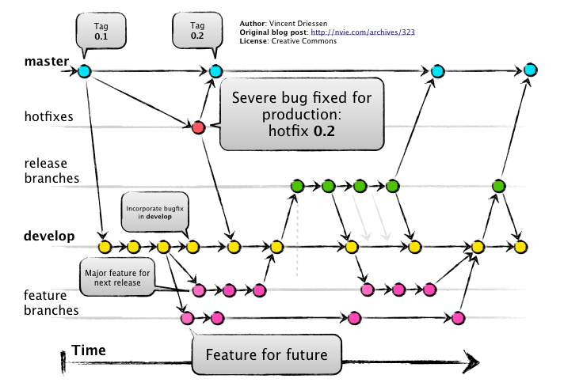

# Github 특강3

- 참고자료
  - [누구나 쉽게 이해할 수 있는 Git 입문](https://backlog.com/git-tutorial/kr/intro/intro1_1.html)
  - [스프린트서울](https://www.sprintseoul.org/)

# Github pages

## 정적파일 생성기

Markdown -> html, css, js

ex. [카카오 기술블로그](https://tech.kakao.com/), [카카오 기술블로그 Github](https://github.com/kakao/kakao.github.io)

1. Jekyll => rubys rlqks
   - 오래되고, 유명하고
2. Gatsby => JS기반, react + graph
   - 최근 등장, 매우 유명
3. hexo => vue
   - 중국어 되어 있는 경우가 많음

## Github page 만들기

- [Start Bootstrap](https://startbootstrap.com/) 에서 원하는 template 다운받기
- [**Visual Studio Code**](https://code.visualstudio.com/)를 설치한 후 template 폴더에서 `Code로 열기` 클릭
- Visual Studio Code에서 필요한 부분 수정하기
- Gtihub에 `이름.github.io`로 repository 생성하기
- `git bash`에서 `add`, `commit`, `push` 수행하기
- 업로드가 완료되면 `이름.github.io`에서 수정한 template를 볼 수 있음

## 참고사이트

- [아이콘 참고 사이트](https://fontawesome.com/)
- [GitHub Pages](https://pages.github.com/)
- 

# Git branch

> branch기능은 서로 다른 독립된 작업 이력을 관리할 수 있도록 한다.

## git flow

- [A successful Git branching model](https://nvie.com/posts/a-successful-git-branching-model/)
- [github flow.pdf](https://drive.google.com/file/d/1bkvYHMN2Rz8b0GZNw7GY5-flTOKF8pZj/view)



- master
  - 배포가능한 코드(지금 내가 쓰고 있는 상태)

## 1. branch 관련 명령어

> Git 브랜치를 위해 root-commit을 발생시키고 진행하세요.

1. branch 생성

   ```bash
   $ git branch {브랜치이름}
   ```

2. branch 이동

   ```bash
   (master) $ git checkout {브랜치이름}
   (브랜치이름) $
   ```

3.  branch 생성 및 이동

   ```bash
   (master) $ git checkout -b {브랜치일름}
   (브랜치이름) $
   ```

4. branch 목록

   ```bash
   (master) $ git branch
   *master
   브랜치이름
   ```

5. branch 병합

   ```bash
   (master) $ git merge {브랜치이름}
   ```

   - `master` 브랜치에 `{브랜치이름}`의 이력을 병합시킨다.

6.  branch 삭제

   ```bash
   $ git branch -d {브랜치이름}
   ```

   

## 2. branch 병합 시나리오

> branch 관련된 명령어는 간단하다.
>
> 다양한 시나리오 속에서 어떤 상황인지 파악하고 자유롭게 활용할 수 있어야 한다.

### 상황 1. fast-foward

> fast-foward는 feature 브랜치 생성된 이후 master 브랜치에 변경 사항이 없는 상황

1. feature/data-clean branch 생성 및 이동

   ```bash
   (master) $ git checkout -b feature/data-clean
   Switched to a new branch 'feature/data-clean'
   (feature/data-clean) $
   ```

2. 작업 완료 후 commit

   ```bash
   $ touch clean.txt
   $ git add .
   $ git commit -m 'Complete clean'
   ```

3. master 이동

   ```bash
   (feature/data-clean) $ git checkout master
   Switched to branch 'master'
   (master) $
   ```

4. master에 병합

   ```bash
   (master) $ git merge feature/data-clean
   ```

5. 결과 -> fast-foward (단순히 HEAD를 이동)

   - HEAD : 사용자의 현재 위치를 의미함

   ```bash
   (master) $ git merge feature/data-clean
   git merge feature/data-clean 
   Updating 1036e68..98079f0
   Fast-forward
    clean.txt | 0
    1 file changed, 0 insertions(+), 0 deletions(-)
    create mode 100644 clean.txt
   ```

6. branch 삭제

   ```bash
   $ git branch -d feature/data-clean 
   Deleted branch feature/data-clean (was 98079f0).
   ```

---

### 상황 2. merge commit

> 서로 다른 이력(commit)을 병합(merge)하는 과정에서 **다른 파일이 수정**되어 있는 상황
>
> git이 auto merging을 진행하고, **commit이 발생된다.**

1. feature/tensorflow branch 생성 및 이동

   ```bash
   (master) $ git checkout -b feature/tensorflow
   Switched to a new branch 'feature/tensorflow'
   (feature/tensorflow) $
   ```

2. 작업 완료 후 commit

   ```bash
   $ touch tf.txt
   $ git add .
   $ git commit -m 'Complete TF'
   ```

3. master 이동

   ```bash
   $ git checkout master
   ```

4. *master에 추가 commit 이 발생시키기!!*

   * **다른 파일을 수정 혹은 생성하세요!**

5. master에 병합

   ```bash
   (master) $ git merge feature/tensorflow
   ```

6. 결과 -> 자동으로 *merge commit 발생*


7. 그래프 확인하기

   ```bash
   $ git log --oneline --graph
   *   dfc05ab (HEAD -> master) Merge branch 'feature/tensorflow'       
   |\
   | * 9b97ef6 (feature/tensorflow) Complete Tensorflow
   * | 610325b hotfix
   |/
   * 98079f0 Complete clean
   * 1036e68 Init
   ```

8. branch 삭제

   ```bash
   $ git checkout -d feature/tensorflow
   ```

---

### 상황 3. merge commit 충돌

> 서로 다른 이력(commit)을 병합(merge)하는 과정에서 **같은 파일의 동일한 부분이 수정**되어 있는 상황
>
> git이 auto merging을 하지 못하고, 충돌 메시지가 뜬다.
>
> 해당 파일의 위치에 표준형식에 따라 표시 해준다.
>
> 원하는 형태의 코드로 직접 수정을 하고 직접 commit을 발생 시켜야 한다.


1. feature/visualization branch 생성 및 이동

   ```bash
   $ git checkout -b feature/visualization
   ```

2. 작업 완료 후 commit

   ```bash
   $ touch visual.txt
   # README.md 수정
   # 아래 상태 메시지로 확인하세요.
   $ git status
   On branch feature/visualization
   Changes not staged for commit:                        alization)
     (use "git add <file>..." to update what will be committed)
     (use "git restore <file>..." to discard changes in walization)orking directory)
           modified:   README.md
   
   Untracked files:
     (use "git add <file>..." to include in what will be 
   committed)
           visual.txt
   
   no changes added to commit (use "git add" and/or "git 
   commit -a")
   $ git add .
   $ git commit -m 'Complete visual'
   ```


3. master 이동

   ```bash
   $ git checkout master
   ```


4. *master에 추가 commit 이 발생시키기!!*

   * **동일 파일을 수정 혹은 생성하세요!**
     

5. master에 병합

   ```bash
   $ git merge feature/visualization 
   Auto-merging README.md
   CONFLICT (content): Merge conflict in README.md
   Automatic merge failed; fix conflicts and then commit the result.
   ```
   


6. 결과 -> *merge conflict발생*

   > git status 명령어로 충돌 파일을 확인할 수 있음.
   
   
   ```bash
   (master|MERGING) $ git status
   On branch master
   # 충돌 난 곳이 있음.
   You have unmerged paths.
     # 고치고 나서 commit을 실행 시킬 것.
     (fix conflicts and run "git commit")        
     (use "git merge --abort" to abort the merge)
   
   Changes to be committed:
           new file:   visual.txt
   
   # README.md 이 동시에 수정됨.
   # 해결하고 add 할 것..
   Unmerged paths:
     (use "git add <file>..." to mark resolution)
           both modified:   README.md
   ```
   


7. 충돌 확인 및 해결

   ```bash
   <<<<<<< HEAD
   * 분석 내용 정리
   =======
   * 시각화 작업
   >>>>>>> feature/visualization
   ```
   


8. merge commit 진행

    > 2번 상황에서는 merge commit 이 발생하였지만, 그 중간 과정에서 충돌이 났기 때문에 직접 변경사항을 add하고 commit을 하여야 합니다.
    
    ```bash
$ git add .
   $ git commit
   ```
   
   * vim 편집기 화면이 나타납니다.
   
   * 자동으로 작성된 커밋 메시지를 확인하고, `esc`를 누른 후 `:wq`를 입력하여 저장 및 종료를 합니다.
      * `w` : write
      * `q` : quit
      
   * 커밋이  확인 해봅시다.
   
9. 그래프 확인하기

    ```bash
      $ git log --oneline --graph
    *   891aafc (HEAD -> master) Merge branch 'feature/visualization'   
    |\
    | * 2d2e099 (feature/visualization) Complete Visual
    * | 31eaefc Update markdown
    |/
    *   dfc05ab Merge branch 'feature/tensorflow'
    |\
    | * 9b97ef6 Complete Tensorflow
    * | 610325b hotfix
    |/
    * 98079f0 Complete clean
    * 1036e68 Init
    ```


10. branch 삭제

    ```bash
    $ git branch -d feature/visualization
    ```


# Stash

> 작업 내역을 저장할 수 있는 공간이 있다.

## 기본 명령

1. stash 보관

   ```bash
   $ git stash
   ```

2. stash 반영

   ```bash
   $ git stash pop 
   # $ git stash apply - 반영
   # $ git stash drop  - 삭제
   ```

3. stash 목록

   ```bash
   $ git stash list
   ```


## 상황

> git은 commit 되지 않은 변경 사항에 대해서는 되돌리 수 없다.
>
> 따라서, 작업 내역이 있을 때(WD/Staging area 상태인 작업) 병합 과정이 진행되지 않는다. (merge, pull)


```bash
$ git pull origin master
remote: Enumerating objects: 6, done.
remote: Counting objects: 100% (6/6), done.
remote: Compressing objects: 100% (3/3), done.
remote: Total 4 (delta 0), reused 3 (delta 0), pack-reused 0
Unpacking objects: 100% (4/4), done.
From https://github.com/edutak/1001-ai

 * branch            master     -> FETCH_HEAD
   38ea6fa..64e06b8  master     -> origin/master

# pull 내용을 받아오면, 지금 로컬 변경사항 중 다음 파일이 덮어씌여질 것이다.
error: Your local changes to the following files would be overwritten by merge:
        README.md
# 커밋을 하거나
# stash를 해라.
Please commit your changes or stash them before you merge.
Aborting
Updating 38ea6fa..64e06b8
```

* 해결 과정

```bash
student@M1303 MINGW64 ~/Desktop/백일장 (master)
$ git stash
Saved working directory and index state WIP on master: 38ea6fa Init

student@M1303 MINGW64 ~/Desktop/백일장 (master)
$ git stash list
stash@{0}: WIP on master: 38ea6fa Init

student@M1303 MINGW64 ~/Desktop/백일장 (master)
$ git pull origin master
From https://github.com/edutak/1001-ai
 * branch            master     -> FETCH_HEAD
Updating 38ea6fa..64e06b8
Fast-forward
 README.md | 22 +++++++++++-----------
 1 file changed, 11 insertions(+), 11 deletions(-)

student@M1303 MINGW64 ~/Desktop/백일장 (master)
$ git stash pop
Auto-merging README.md
CONFLICT (content): Merge conflict in README.md
The stash entry is kept in case you need it again.
```


# 명령어 취소 및 되돌리기

1. `add` 취소

   ```bash
   $ git restore --staged {파일명}
   ```

   * `add` 명령을 취소하는 작업

   * Staging area => Working directory

   * 구버전 명령어

     ```bash
     $ git reset HEAD {파일명}
     ```

2. 커밋 메시지 변경

   **주의!!! 커밋 해시값이 바뀌므로, `push` 한 이후에는 절대 하면 안됨.**

   ```bash
   $ git commit --amend
   ```

   * vim 편집기 창에서 직접 메시지를 수정하고, 저장(`:wq`)하면 된다.

3. 커밋 변경

   * 만약, 특정 파일을 추가하지 못한 상태로 커밋을 하였다면, 아래와 같이 해결해서 커밋에 포함시킬 수 있다.

     ```bash
     $ git add omit_file.txt
     $ git commit --amend
     ```

   * **당연하게도, 커밋 해시값이 변경되므로 이미 `push` 한 상태에서는 하지 말 것!**

4. working directory 변경사항 삭제

   **주의!! 아래의 명령어를 입력하면, 절대 되살릴 수 없다.**

   ```bash
   $ git restore {파일명}
   ```

   * 구버전 명령어

     ```bash
     $ git checkout -- {파일명}
     ```

5. `reset` vs `revert`

   * 두 명령어는 특정 시점의 상태로 이력(커밋) 되돌리는 작업을 한다.

   * `reset` : 이력을 삭제

     * `--hard` : 해당 커밋 이후 변경사항 모두 삭제 (주의)
     * `--soft` : 해당 커밋 이후 변경사항 및 working directory 내용까지 보관
     * `--mixed` : (default) 해당 커밋 이후 변경사항 staging area 보관

     ```bash
     $ git log --oneline
     a70327e (HEAD -> master, origin/master) Update a.txt
     41a723a Init
     ```

   * `revert` : 되돌렸다는 이력을 남긴다.

     ```bash
     $ git log --oneline
     1cd8c64 (HEAD -> master) Revert "Update a.txt"
     b696a08 Complete a, b
     c02b94a R
     a70327e (origin/master) Update a.txt
     41a723a Init
     ```
