# Day60 Scikitlearn을 활용한 머신러닝(12)

- [**How does IMDb's rating system work?**](https://www.quora.com/How-does-IMDbs-rating-system-work)

# 추천시스템

- 협업필터링 - 잠재요인(latent) 기반 협업필터링

  - 잠재요인 기반 : 행렬분해(SVD) 이용
    - 행렬분해 : 잠재요인 추출, 차원 축소

- ex. 사용자 - 아이템 행렬 ==분해=> 사용자 - 잠재요인 \* 잠재요인 - 아이템

  - or 아이템 - 사용자 행렬 ==분해=> 아이템 - 잠재요인 \* 잠재요인 - 사용자

  - 잠재요인 : 장르(액션, 로맨스, 코미디)

    - 사용자 - 장르

      |      | 코미디 | 액션 |
      | ---- | ------ | ---- |
      | A    | O      | X    |
      | B    | X      | O    |
      | C    | O      | X    |
      | D    | O      | O    |

    - 장르 - 아이템

      |        | 1    | 2    | 3    | 4    | 5    |
      | ------ | ---- | ---- | ---- | ---- | ---- |
      | 코미디 | 3    | 1    | 1    | 3    | 1    |
      | 액션   | 1    | 2    | 4    | 1    | 3    |

    - => 사용자 - 아이템(`R`)

      |      | 1    | 2    | 3    | 4    | 5    |
      | ---- | ---- | ---- | ---- | ---- | ---- |
      | A    | 3    | 1    | 1    | 3    | 1    |
      | B    | 1    | 2    | 4    | 1    | 3    |
      | C    | 3    | 1    | 1    | 3    | 1    |
      | D    | 4    | 3    | 5    | 4    | 4    |

    - `R(u, i)` = 사용자 `u`가 아이템 `i`에 대한 평가


## 컨텐츠 기반 추천 시스템

- [Kaggle - TMDB 5000 Movie Dataset](https://www.kaggle.com/tmdb/tmdb-movie-metadata/data)

### 전처리

```python
import pandas as pd
path = '../data_for_analysis/tmdb-movie-metadata/'
data = pd.read_csv(path + 'tmdb_5000_movies.csv')
data
```

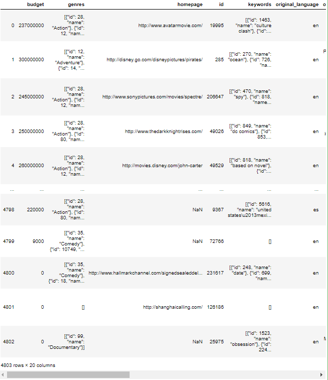

```python
data.columns
# > Index(['budget', 'genres', 'homepage', 'id', 'keywords', 'original_language',
# >        'original_title', 'overview', 'popularity', 'production_companies',
# >        'production_countries', 'release_date', 'revenue', 'runtime',
# >        'spoken_languages', 'status', 'tagline', 'title', 'vote_average',
# >        'vote_count'],
# >       dtype='object')
```
- 일부 열만 사용
```python
data = data[['id', 'genres', 'vote_average', 'vote_count',
             'popularity', 'title', 'keywords', 'overview']]
data
```

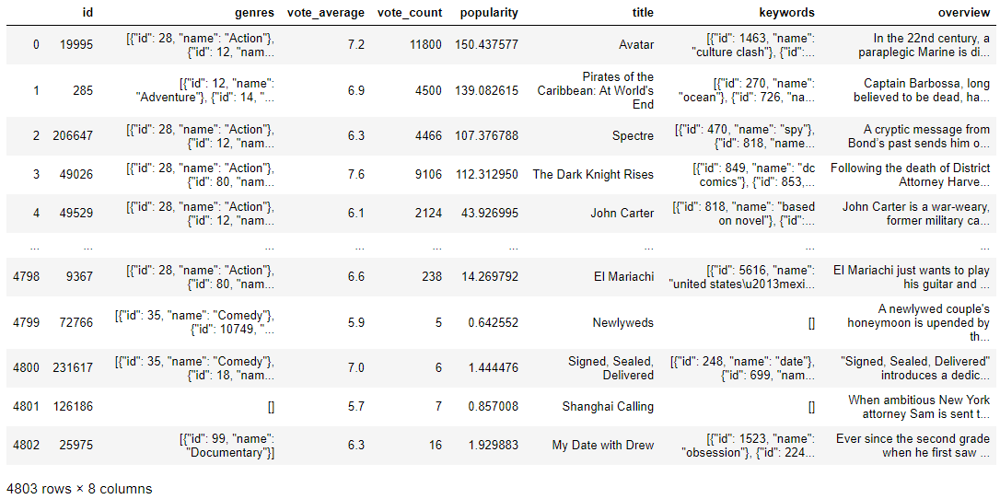

```python
data['vote_count']
# > 0       11800
# > 1        4500
# > 2        4466
# > 3        9106
# > 4        2124
# >         ...  
# > 4798      238
# > 4799        5
# > 4800        6
# > 4801        7
# > 4802       16
# > Name: vote_count, Length: 4803, dtype: int64
```

- vote_count가 90% 이상인 user들만 추출

```python
m = data['vote_count'].quantile(0.9)
data = data[data['vote_count'] >= m]
data
```

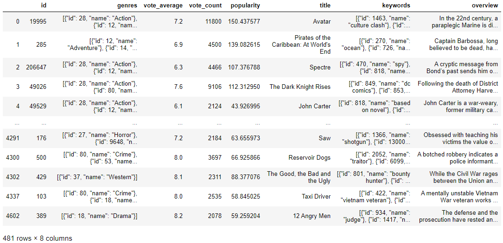

- data의 장르와 키워드에서 Name 키 값만 추출
  - 리스트 내부에 딕셔너리가 있는 구조

```python
data[['genres', 'keywords']]
```

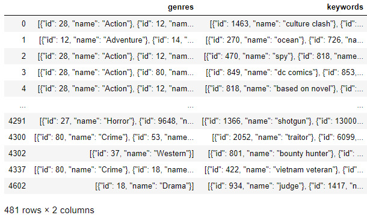

```python
data['genres']
# > 0       [{"id": 28, "name": "Action"}, {"id": 12, "nam...
# > 1       [{"id": 12, "name": "Adventure"}, {"id": 14, "...
# > 2       [{"id": 28, "name": "Action"}, {"id": 12, "nam...
# > 3       [{"id": 28, "name": "Action"}, {"id": 80, "nam...
# > 4       [{"id": 28, "name": "Action"}, {"id": 12, "nam...
# >                               ...                        
# > 4291    [{"id": 27, "name": "Horror"}, {"id": 9648, "n...
# > 4300    [{"id": 80, "name": "Crime"}, {"id": 53, "name...
# > 4302                      [{"id": 37, "name": "Western"}]
# > 4337    [{"id": 80, "name": "Crime"}, {"id": 18, "name...
# > 4602                        [{"id": 18, "name": "Drama"}]
# > Name: genres, Length: 481, dtype: object
```

- abstract syntzx tree모듈 : String을 사용할 수 있도록 해주는 라이브러리
  - literal_eval 함수 : literal(문자 그대로) evaluate(실행)하는 함수

----

- 예시

```python
import ast
strdict = {'a':3, 'b':5}
print(type(strdict))
# > <class 'dict'>

strdict2 = '{'a':3, 'b':5}'
print(type(strdict2))
# > <class 'str'>

ast.literal_eval(strdict)
```

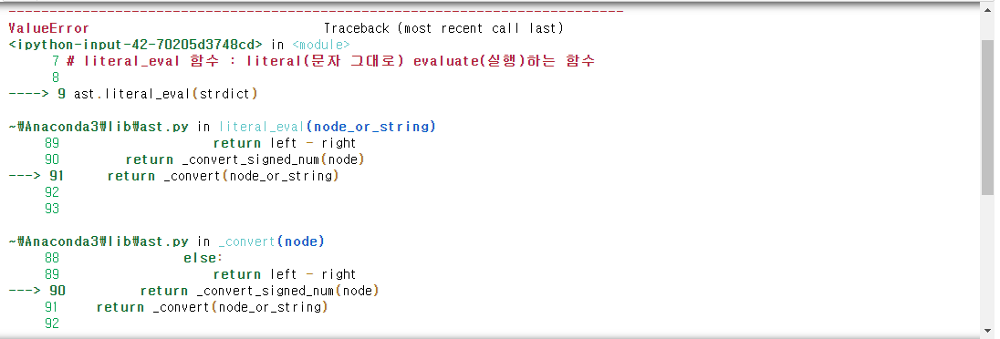

```python
ast.literal_eval(strdict2)
# > {'a': 3, 'b': 5}
```

- json 데이터 -> dict로 가져올 때 많이 사용됨

```python
ps = """{
'lists' : [1,2,3,4],
'tuples' : (5,6,7)
}
"""
ps
# > "{\n'lists' : [1,2,3,4],\n'tuples' : (5,6,7)\n}\n"

ps2 = ast.literal_eval(ps)
ps2
# > {'lists': [1, 2, 3, 4], 'tuples': (5, 6, 7)}

type(ps2)
# > dict

print(ps2['lists'])
# > [1, 2, 3, 4]
```

----

```python
from ast import literal_eval

data['genres'] = data['genres'].apply(literal_eval)
data['keywords'] = data['keywords'].apply(literal_eval)

data['genres']
# > 0       [{'id': 28, 'name': 'Action'}, {'id': 12, 'nam...
# > 1       [{'id': 12, 'name': 'Adventure'}, {'id': 14, '...
# > 2       [{'id': 28, 'name': 'Action'}, {'id': 12, 'nam...
# > 3       [{'id': 28, 'name': 'Action'}, {'id': 80, 'nam...
# > 4       [{'id': 28, 'name': 'Action'}, {'id': 12, 'nam...
# >                               ...                        
# > 4291    [{'id': 27, 'name': 'Horror'}, {'id': 9648, 'n...
# > 4300    [{'id': 80, 'name': 'Crime'}, {'id': 53, 'name...
# > 4302                      [{'id': 37, 'name': 'Western'}]
# > 4337    [{'id': 80, 'name': 'Crime'}, {'id': 18, 'name...
# > 4602                        [{'id': 18, 'name': 'Drama'}]
# > Name: genres, Length: 481, dtype: object

data['genres'][0][0]
# > {'id': 28, 'name': 'Action'}
```

- dict -> list -> 띄어쓰기로 된 str 형태

```python
data['genres'].apply(lambda x: [d['name'] for d in x]).apply(lambda x: ' '.join(x))
# > 0       Action Adventure Fantasy Science Fiction
# > 1                       Adventure Fantasy Action
# > 2                         Action Adventure Crime
# > 3                    Action Crime Drama Thriller
# > 4               Action Adventure Science Fiction
# >                           ...                   
# > 4291                        Horror Mystery Crime
# > 4300                              Crime Thriller
# > 4302                                     Western
# > 4337                                 Crime Drama
# > 4602                                       Drama
# > Name: genres, Length: 481, dtype: object
```

```python
for d in data['genres'][0] :
    print(d)
# > {'id': 28, 'name': 'Action'}
# > {'id': 12, 'name': 'Adventure'}
# > {'id': 14, 'name': 'Fantasy'}
# > {'id': 878, 'name': 'Science Fiction'}

for d in data['genres'][0] :
    print(d['name'])
# > Action
# > Adventure
# > Fantasy
# > Science Fiction

tmpList = list()
for d in data['genres'][0] :
    tmpList.append(d['name'])
' '.join(tmpList)
# > 'Action Adventure Fantasy Science Fiction'
```

```python
data['genres'] = data['genres'].apply(lambda x: [d['name'] for d in x]).apply(lambda x: ' '.join(x))
data['keywords'] = data['keywords'].apply(lambda x: [d['name'] for d in x]).apply(lambda x: ' '.join(x))
```

- 컨텐츠 기반 필터링
- 비슷한 영화를 추천 (장르 이용)
- 장르 -> 문자열 -> 숫자로 변환하여 벡터화

```python
data.genres.head(1)
# > 0    Action Adventure Fantasy Science Fiction
# > Name: genres, dtype: object
```

```python
from sklearn.feature_extraction.text import *
from sklearn.metrics.pairwise import cosine_similarity
```

### cf. BOW

- BOW : 문자를 숫자 벡터로 변환
- 전체문서집합 : {d1, ... , dn}
- 단어집합 : {t1, ..., tm}
- ex. BOW 구성
  - `Xij` = 문서 `di`내의 단어 `tj`의 출연 빈도라고 정의하면,
  - `Xij = 0` => 단어 `tj`가 문서 `di`에 없는 경우
  - `Xij = 1` => 단어 `tj`가 문서 `di`에 있는 경우
- BOW 구성
  1. DictVectorizer : 각 단어의 개수로 BOW벡터
  2. CountVectorizer : 문서 -> 단어 토큰 -> 각 문서에서 단어의 개수로 BOW벡터
  3. TfidfVectoerizer : CountVectorizer와 유사, TF-IDF 방식으로 BOW벡터
  4. HashingVectorizer : 메모리가 적게 사용, 속도 빠름 => BOW벡터 생성

- DictVectorizer

```python
from sklearn.feature_extraction import DictVectorizer

v = DictVectorizer()
ex_data = [{'A':1, 'B':2}, {'B':3, 'C':1}]
x = v.fit_transform(ex_data)
print(x)
# >   (0, 0)	1.0
# >   (0, 1)	2.0
# >   (1, 1)	3.0
# >   (1, 2)	1.0

v = DictVectorizer(sparse=False)
ex_data = [{'A':1, 'B':2}, {'B':3, 'C':1}]
x = v.fit_transform(ex_data)
print(x)
# > [[1. 2. 0.]
# >  [0. 3. 1.]]

print(v.feature_names_)
# > ['A', 'B', 'C']

print(v.transform({'C':4}))
# > [[0. 0. 4.]]

print(v.transform({'C':4, 'D':3}))
# > [[0. 0. 4.]]
```

> fit 할 때 'D'를 넣어주지 않았기 때문에 D값은 만들어 지지 않는다.

- CountVectorizer

```python
from sklearn.feature_extraction.text import CountVectorizer
corpus = [
    'This is the first document',
    'This is the second second document',
    'And the third one', 
    'Is this the first document?',
    'The last document?'
]
cv = CountVectorizer()
cv.fit(corpus)
cv
# > CountVectorizer(analyzer='word', binary=False, decode_error='strict',
# >                 dtype=<class 'numpy.int64'>, encoding='utf-8', input='content',
# >                 lowercase=True, max_df=1.0, max_features=None, min_df=1,
# >                 ngram_range=(1, 1), preprocessor=None, stop_words=None,
# >                 strip_accents=None, token_pattern='(?u)\\b\\w\\w+\\b',
# >                 tokenizer=None, vocabulary=None)

print(cv.vocabulary_)
# > {'this': 9, 'is': 3, 'the': 7, 'first': 2, 'document': 1, 'second': 6, 'and': 0, 'third': 8, 'one': 5, 'last': 4}
```

> 숫자는 단어의 번호를 의미(index, 알파벳 순서)

```python
cv.transform(['This is the second document']).toarray()
# > array([[0, 1, 0, 1, 0, 0, 1, 1, 0, 1]], dtype=int64)

cv.transform(['Hi Hello']).toarray()
# > array([[0, 0, 0, 0, 0, 0, 0, 0, 0, 0]], dtype=int64)

cv.transform(corpus).toarray()
# > array([[0, 1, 1, 1, 0, 0, 0, 1, 0, 1],
# >        [0, 1, 0, 1, 0, 0, 2, 1, 0, 1],
# >        [1, 0, 0, 0, 0, 1, 0, 1, 1, 0],
# >        [0, 1, 1, 1, 0, 0, 0, 1, 0, 1],
# >        [0, 1, 0, 0, 1, 0, 0, 1, 0, 0]], dtype=int64)
```

- 다양한 옵션

```python
cv2 = CountVectorizer(stop_words=['and', 'is', 'the', 'this']).fit(corpus)
cv2.vocabulary_
# > {'first': 1, 'document': 0, 'second': 4, 'third': 5, 'one': 3, 'last': 2}

cv3 = CountVectorizer(stop_words='english').fit(corpus)
cv3.vocabulary_
# > {'document': 0, 'second': 1}
```

```python
cv4 = CountVectorizer(analyzer='char').fit(corpus)
print(cv4.vocabulary_)
# > {'t': 15, 'h': 7, 'i': 8, 's': 14, ' ': 0, 'e': 5, 'f': 6, 'r': 13, 'd': 4, 'o': 12, 'c': 3, 'u': 16, 'm': 10, 'n': 11, 'a': 2, '?': 1, 'l': 9}
```

```python
cv5 = CountVectorizer(token_pattern='t\w+').fit(corpus)
cv5.vocabulary_
# > {'this': 2, 'the': 0, 'third': 1}
```

```python
import nltk
cv6 = CountVectorizer(tokenizer=nltk.word_tokenize).fit(corpus)
print(cv6.vocabulary_)
# > {'this': 10, 'is': 4, 'the': 8, 'first': 3, 'document': 2, 'second': 7, 'and': 1, 'third': 9, 'one': 6, '?': 0, 'last': 5}
```

> ?도 의미를 갖는 token으로 처리 되었다.

```python
cv7 = CountVectorizer(ngram_range=(2,2)).fit(corpus)
print(cv7.vocabulary_)
# > {'this is': 12, 'is the': 2, 'the first': 7, 'first document': 1, 'the second': 9, 'second second': 6, 'second document': 5, 'and the': 0, 'the third': 10, 'third one': 11, 'is this': 3, 'this the': 13, 'the last': 8, 'last document': 4}
```

> 두개의 token을 하나의 token으로 사용

```python
cv8 = CountVectorizer(ngram_range=(1,2)).fit(corpus)
print(cv8.vocabulary_)
# > {'this': 21, 'is': 5, 'the': 14, 'first': 3, 'document': 2, 'this is': 22, 'is the': 6, 'the first': 15, 'first document': 4, 'second': 11, 'the second': 17, 'second second': 13, 'second document': 12, 'and': 0, 'third': 19, 'one': 10, 'and the': 1, 'the third': 18, 'third one': 20, 'is this': 7, 'this the': 23, 'last': 8, 'the last': 16, 'last document': 9}

cv9 = CountVectorizer(ngram_range=(1,2), token_pattern='t\w+').fit(corpus)
cv9.vocabulary_
# > {'this': 3, 'the': 0, 'this the': 4, 'third': 2, 'the third': 1}
```

```python
cv10 = CountVectorizer(max_df=4, min_df=2).fit(corpus)
cv10.vocabulary_
# > {'this': 3, 'is': 2, 'first': 1, 'document': 0}
```

> 총 빈도가 min과 max 사이로 나타났을 때 token으로 사용 

- TfidfVectoerizer
  - TFIDF(d, t) = tf(d, t) \* idf(t)
  - tf(d, t) : 특정 단어의 빈도수
  - idf(t) : 특정 단어가 들어 있는 문서의 수에 반비례
    - idf(f) = log(n/(1+df(t)))
    - n : 전체 문서의 개수, df(t) : 단어 t를 갖는 문서의 갯수

```python
tfidf = TfidfVectorizer().fit(corpus)
tfidf.transform(corpus).toarray()
# > array([[0.        , 0.38947624, 0.55775063, 0.4629834 , 0.        ,
# >         0.        , 0.        , 0.32941651, 0.        , 0.4629834 ],
# >        [0.        , 0.24151532, 0.        , 0.28709733, 0.        ,
# >         0.        , 0.85737594, 0.20427211, 0.        , 0.28709733],
# >        [0.55666851, 0.        , 0.        , 0.        , 0.        ,
# >         0.55666851, 0.        , 0.26525553, 0.55666851, 0.        ],
# >        [0.        , 0.38947624, 0.55775063, 0.4629834 , 0.        ,
# >         0.        , 0.        , 0.32941651, 0.        , 0.4629834 ],
# >        [0.        , 0.45333103, 0.        , 0.        , 0.80465933,
# >         0.        , 0.        , 0.38342448, 0.        , 0.        ]])
```

- HashingVectorizer
  - CountVectorizer와 같은 결과를 출력함

```python
from sklearn.datasets import fetch_20newsgroups

twenty = fetch_20newsgroups()
twenty.data
```

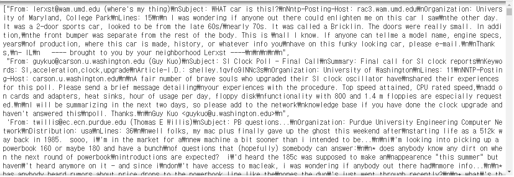

```python
len(twenty.data)
# > 11314
```
```python
cv = CountVectorizer().fit(twenty.data)
cv.vocabulary_
```

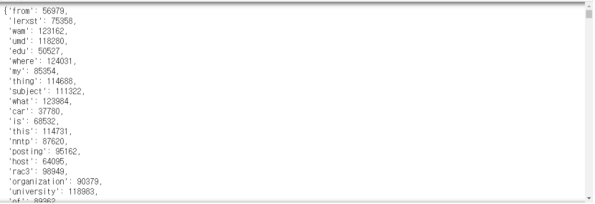

```python
print(cv.transform(twenty.data))
```

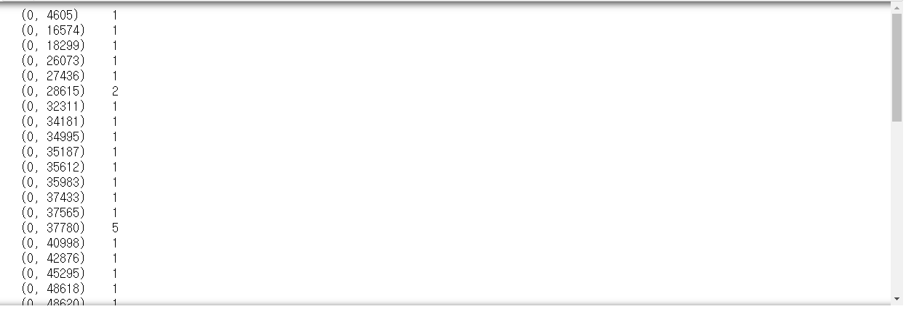

```python
cv.transform(twenty).toarray()
# > array([[0, 0, 0, ..., 0, 0, 0],
# >        [0, 0, 0, ..., 0, 0, 0],
# >        [0, 0, 0, ..., 0, 0, 0],
# >        [0, 0, 0, ..., 0, 0, 0],
# >        [0, 0, 0, ..., 0, 0, 0]], dtype=int64)
```

```python
%time CountVectorizer().fit(twenty.data).transform(twenty.data)
# > Wall time: 9.73 s
# > <11314x130107 sparse matrix of type '<class 'numpy.int64'>'
# > 	with 1787565 stored elements in Compressed Sparse Row format>
```

```python
from sklearn.feature_extraction.text import HashingVectorizer
hv = HashingVectorizer(n_features=300000)
%time hv.transform(twenty.data)
# > Wall time: 3.99 s
# > <11314x300000 sparse matrix of type '<class 'numpy.float64'>'
# > 	with 1786336 stored elements in Compressed Sparse Row format>

%time HashingVectorizer(n_features=300000).transform(twenty.data)
# > Wall time: 4.39 s
# > <11314x300000 sparse matrix of type '<class 'numpy.float64'>'
# > 	with 1786336 stored elements in Compressed Sparse Row format>
```

----

### CountVectorize & cosine_similarity
```python
count_vector = CountVectorizer(ngram_range=(1, 3))
cv_genres = count_vector.fit_transform(data['genres'])
cv_genres.shape
# > (481, 364)
```

- 영화별 유사도 측정(코사인 유사도)

```python
cosine_similarity(cv_genres, cv_genres)
# > array([[1.        , 0.47140452, 0.35355339, ..., 0.        , 0.        ,
# >         0.        ],
# >        [0.47140452, 1.        , 0.33333333, ..., 0.        , 0.        ,
# >         0.        ],
# >        [0.35355339, 0.33333333, 1.        , ..., 0.        , 0.23570226,
# >         0.        ],
# >        ...,
# >        [0.        , 0.        , 0.        , ..., 1.        , 0.        ,
# >         0.        ],
# >        [0.        , 0.        , 0.23570226, ..., 0.        , 1.        ,
# >         0.57735027],
# >        [0.        , 0.        , 0.        , ..., 0.        , 0.57735027,
# >         1.        ]])
```

### cf. np.argsort()

```python
import numpy as np
x = np.array([5,3,1,2])
x.sort()
x
# > array([1, 2, 3, 5])

x = np.array([5,3,1,2])
print(x.argsort()) # 정렬했을 때 원 데이터의 index 순서로 출력
# > [2 3 1 0]

x = np.array([5,3,1,2])
print(x.argsort()[::-1])
# > [0 1 3 2]
```

----

```python
genres_c_sim = cosine_similarity(cv_genres, cv_genres).argsort()[:,::-1]
genres_c_sim
# > array([[  0,  13,  42, ..., 298, 297, 240],
# >        [ 11,   1, 200, ..., 329, 330, 240],
# >        [  2, 376, 216, ..., 314, 304, 240],
# >        ...,
# >        [478, 187,  12, ..., 326, 327,   0],
# >        [479, 466, 383, ..., 220, 224,   0],
# >        [480, 468, 294, ..., 246, 248,   0]], dtype=int64)
```

```python
def get_rc_movieList(df, movie_title, top=30) :
    # 30개의 영화를 추천
    target_movie_index = df[df['title'] == movie_title].index.values
    sim_index = genres_c_sim[target_movie_index, :top].reshape(-1)
    sim_index = sim_index[sim_index != target_movie_index]
    res = df.iloc[sim_index].sort_values('vote_count', ascending=False)[:top]
    return res
    
get_rc_movieList(data, movie_title='The Dark Knight Rises')
```

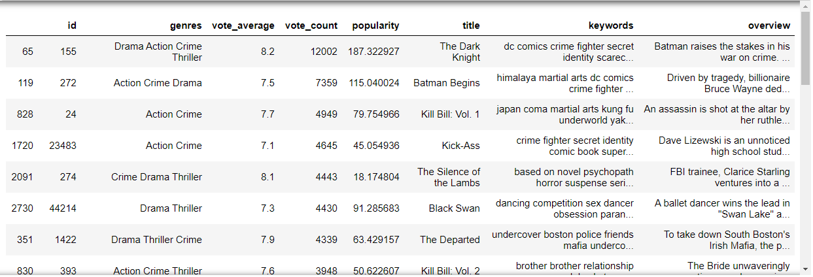

## 아이템 기반 협업 필터링 추천시스템

- [Kaggle - The Movies Dataset](https://www.kaggle.com/rounakbanik/the-movies-dataset)

```python
path = '../data_for_analysis/the-movies-dataset/'
data = pd.read_csv(path + 'ratings_small.csv')
data.head()
```

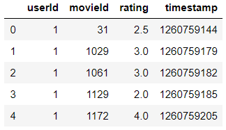

### user - item 행렬 구성

```python
data = data.pivot_table('rating', index='userId', columns='movieId')
data
```


```python
data.shape
# > (671, 9066)
```


```python
ratings = pd.read_csv(path + 'ratings_small.csv')
```

- [Kaggle - TMDB 5000 Movie Dataset](https://www.kaggle.com/tmdb/tmdb-movie-metadata/data)
  - 영화의 이름 데이터를 얻기 위하여 데이터 사용

```python
path_tmdb = '../data_for_analysis/tmdb-movie-metadata/'
movies = pd.read_csv(path_tmdb + 'tmdb_5000_movies.csv')
movies.head()
```

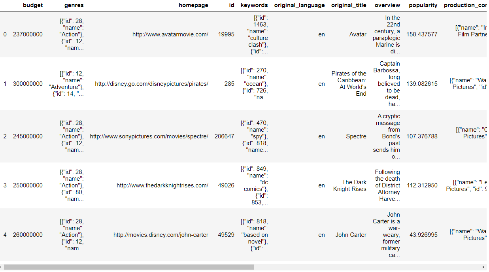

- movies 데이터의 열 이름 중 `id`를 `movieId`로 변환

```python
movies.rename(columns={'id':'movieId'}, inplace=True)
movies.head()
```

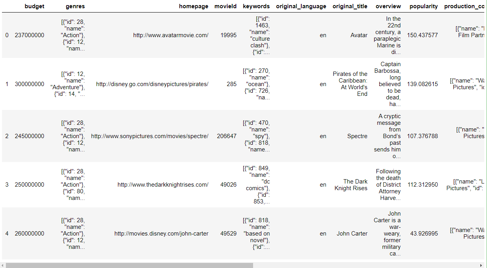

```python
ratings_movies = pd.merge(ratings, movies, on='movieId')
ratings_movies.head()
```


```python
ratings_movies.shape
# > (18571, 23)
```

```python
data = ratings_movies.pivot_table('rating', index='userId', columns='title').fillna(0)
data
```

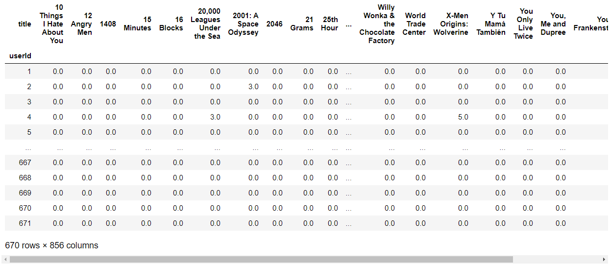

```python
data.shape
# > (670, 856)
```

> 사용자별 영화 타이틀에 대해 평점
>
> 아이템 기반 협업 필털링은 row가 item
>
> 코사인 유사도(row 기반)

```python
data = data.transpose()
data
```

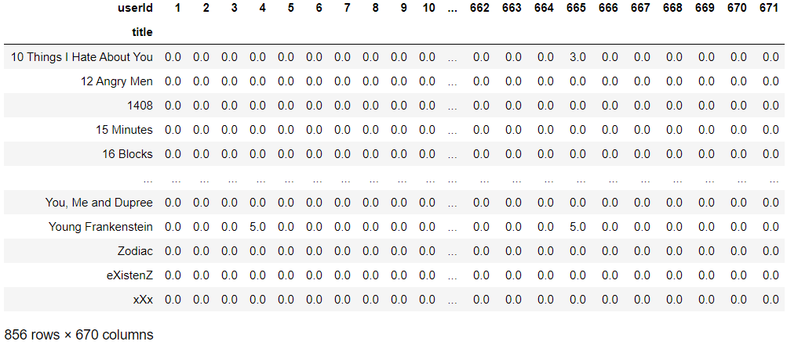

### 코사인 유사도

```python
mSim = cosine_similarity(data, data)

movie_simDf = pd.DataFrame(data=mSim, index=data.index, columns=data.index)
movie_simDf.head()
```

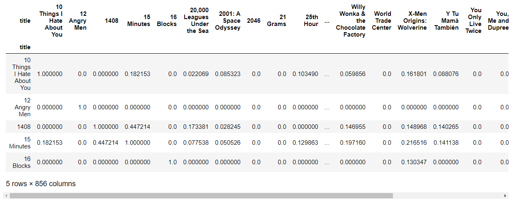

- 자기자신을 제외한 코사인 유사도가 가장 큰 9개 영화 추출 

```python
movie_simDf['Romeo Must Die'].sort_values(ascending=False)[1:10]
# > title
# > X-Men Origins: Wolverine              0.649625
# > The Wedding Planner                   0.633776
# > Conquest of the Planet of the Apes    0.501164
# > Dogtown and Z-Boys                    0.488048
# > The Terminal                          0.462727
# > The Last Samurai                      0.440224
# > An Unfinished Life                    0.427057
# > Madagascar                            0.422282
# > The Beach                             0.410215
# > Name: Romeo Must Die, dtype: float64
```

## 행렬 분해 추천시스템

- [Kaggle - Movielens (Small)](https://www.kaggle.com/sengzhaotoo/movielens-small)

```python
path_small = '../data_for_analysis/movielens-small/'
ratingData = pd.read_csv(path_small + 'ratings.csv')
movieData = pd.read_csv(path_small + 'movies.csv')
```

```python
from sklearn.decomposition import TruncatedSVD
from scipy.sparse.linalg import svds
import warnings
warnings.filterwarnings('ignore')
```

```python
ratingData.head() # userId, movieId, rating, timestamp
```

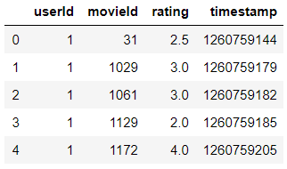

```python
movieData.head() # movieId, title, genres
```

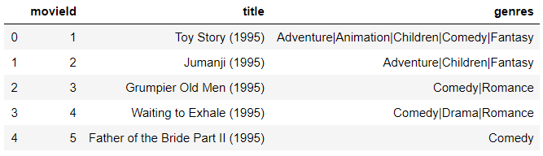

```python
ratingData.shape
# > (100004, 4)

movieData.shape
# > (9125, 3)
```

- `ratingData`에서 `timestamp` 제거

```python
ratingData.drop('timestamp', axis=1, inplace=True)
ratingData
```

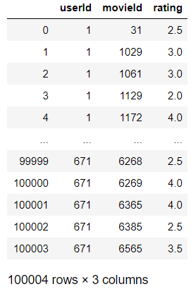

- `movieData`에서 `genres` 제거

```python
movieData.drop('genres', axis=1, inplace=True)
movieData
```

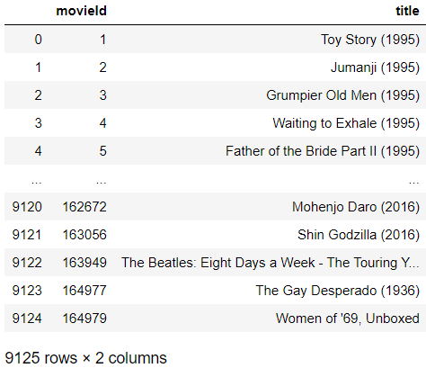

```python
ratingData.columns
# > Index(['userId', 'movieId', 'rating'], dtype='object')

movieData.columns
# > Index(['movieId', 'title'], dtype='object')
```

### ratingData, movieData를 병합(merge)

```python
user_movie_data = ratingData.merge(movieData, on='movieId')
user_movie_data
```

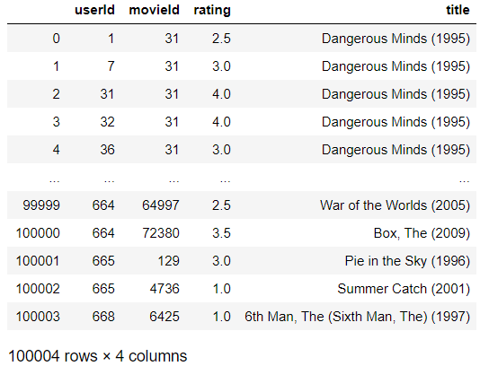

### 피봇테이블

- 데이터:rating, 행:userId, 열:title

```python
user_movie_rating = user_movie_data.pivot_table('rating', index='userId', columns='title').fillna(0)
user_movie_rating # 사용자 - 영화
```

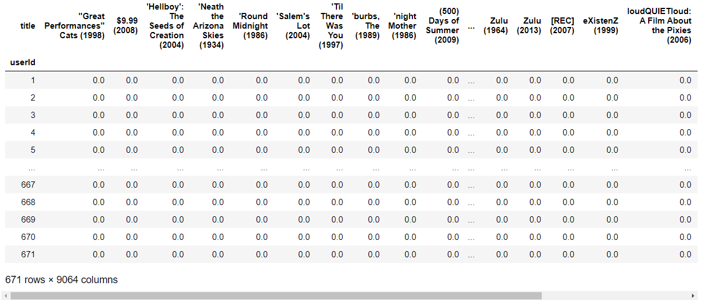

```python
user_movie_rating.shape
# > (671, 9064)
```

- 영화 - 사용자

```python
movie_user_rating = user_movie_rating.T
movie_user_rating
```


### SVD

- (9064, 671) => (9064,12)
- truncated SVD를 이용하여 시그마행렬의 대각원소(특이값) 가운데 상위 n(12)개 선택
- 기존 A행렬을 100% 원상복구는 못하지만 상당히 유사하게는 나옴

```python
SVD = TruncatedSVD(n_components=12)
mat = SVD.fit_transform(movie_user_rating)
mat.shape
# > (9064, 12)

mat[0]
# > array([ 0.01227491,  0.00250786,  0.01555514, -0.03399673, -0.01450643,
# >         0.00342035, -0.00239755,  0.04629672, -0.01520572, -0.0203855 ,
# >         0.01107046, -0.00481813])
```

- np.corrcoef : 피어슨 상관계수 함수

```python
corr = np.corrcoef(mat)
corr.shape
# > (9064, 9064)
```

### corrleation(heatmap)

```python
import matplotlib.pyplot as plt
import seaborn as sns

corr2 = corr[:200, :200]

plt.figure(figsize=(16,10))
sns.heatmap(corr2)
```

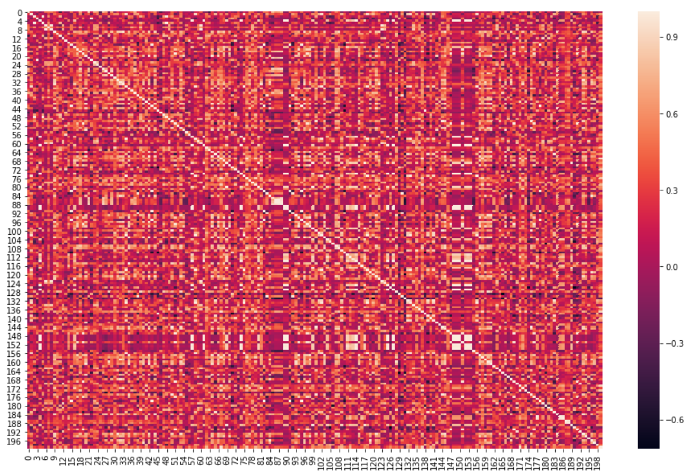

### 유사도 높은 영화 추출

```python
movie_title = user_movie_rating.columns
movie_title_list = list(movie_title)
movie_title_list
```

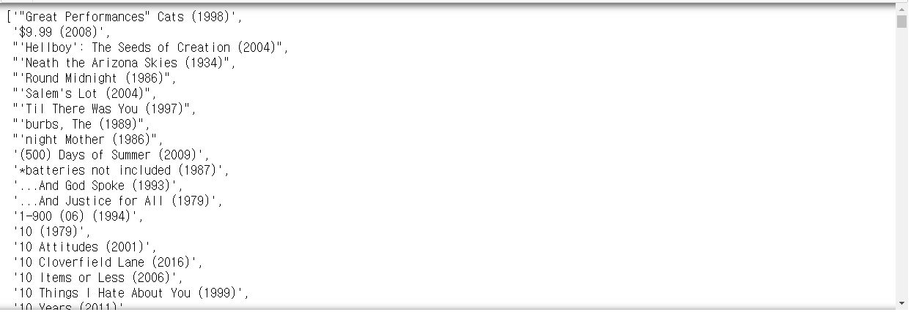

```python
coffey_hands = movie_title_list.index('Guardians of the Galaxy (2014)')
coffey_hands
# > 3405

corr_cf = corr[coffey_hands]
corr_cf
# > array([0.03623816, 0.20251808, 0.10494344, ..., 0.18169025, 0.24239998,
# >        0.86146483])
```

- 하나의 영화에 대해 비슷한 영화를 추천

```python
list(movie_title[corr_cf >= 0.9])[:50]
```

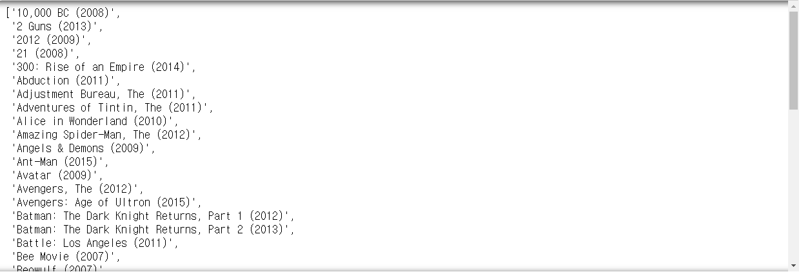

# 연습문제

- [Kaggle - MovieLens](https://www.kaggle.com/jneupane12/movielens)
- movielens 데이터로 아이템 기반 협업 필터링
- ratings.csv, movies.csv 파일 사용

- 데이터 불러오기

```python
path_movielens = '../data_for_analysis/movielens/'
ratings_mvls = pd.read_csv(path_movielens + 'ratings.csv')
movies_mvls = pd.read_csv(path_movielens + 'movies.csv')

ratings_mvls.head()
```

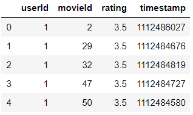

```python
movies_mvls.head()
```

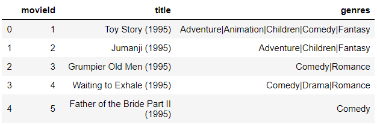

- `movieId`를 기준으로 데이터 병합하기

```python
movielens = ratings_mvls.merge(movies_mvls, on='movieId')
movielens.drop(['timestamp', 'genres'], axis=1, inplace=True)
movielens
```

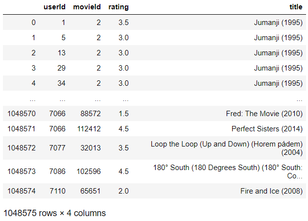

- index가 `title`, columns가 `userId`. 값을 `rating`으로 데이터 정리

```python
movielens_pt = movielens.pivot_table('rating', index='title', columns='userId').fillna(0)
movielens_pt
```


- 코사인 유사도 구하기

```python
movielens_cos = cosine_similarity(movielens_pt, movielens_pt)
movielens_cos
# > array([[1.        , 0.2099249 , 0.        , ..., 0.        , 0.        ,
# >         0.        ],
# >        [0.2099249 , 1.        , 0.        , ..., 0.        , 0.        ,
# >         0.        ],
# >        [0.        , 0.        , 1.        , ..., 0.        , 0.        ,
# >         0.        ],
# >        ...,
# >        [0.        , 0.        , 0.        , ..., 1.        , 0.00845335,
# >         0.04309269],
# >        [0.        , 0.        , 0.        , ..., 0.00845335, 1.        ,
# >         0.        ],
# >        [0.        , 0.        , 0.        , ..., 0.04309269, 0.        ,
# >         1.        ]])
```

- 코사인 유사도 결과 DataFrame으로 저장

```python
movielens_cosDF = pd.DataFrame(data=movielens_cos, index=movielens_pt.index, columns=movielens_pt.index)
movielens_cosDF.head()
```

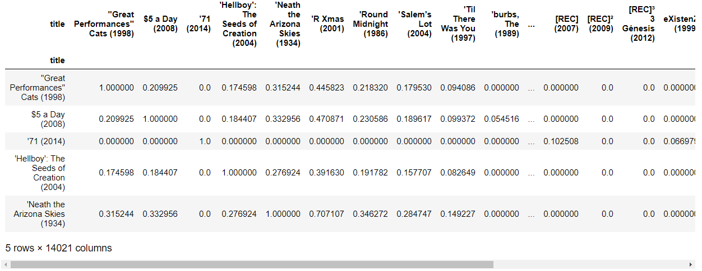

- 'Guardians of the Galaxy (2014)'와 가장 유사한 9개의 영화 출력

```python
movielens_cosDF['Guardians of the Galaxy (2014)'].sort_values(ascending=False)[1:10]
# > title
# > Captain America: The Winter Soldier (2014)    0.637174
# > X-Men: Days of Future Past (2014)             0.609119
# > Edge of Tomorrow (2014)                       0.601299
# > Interstellar (2014)                           0.498529
# > Iron Man 3 (2013)                             0.479350
# > Star Trek Into Darkness (2013)                0.478003
# > Hunger Games: Catching Fire, The (2013)       0.460294
# > Big Hero 6 (2014)                             0.444681
# > The Lego Movie (2014)                         0.435031
# > Name: Guardians of the Galaxy (2014), dtype: float64
```

